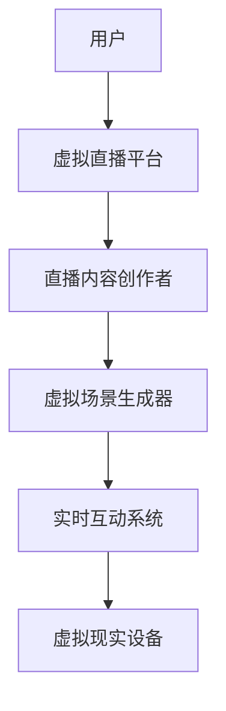
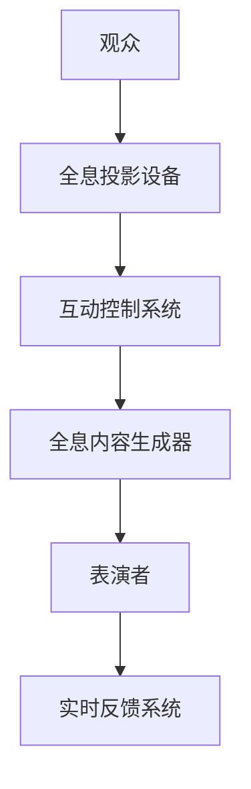

                 

关键词：数字创意、虚拟直播、全息互动表演、人工智能、技术发展、娱乐产业

## 摘要

随着人工智能和虚拟现实技术的不断进步，数字创意娱乐领域正经历着前所未有的变革。本文将探讨2050年可能出现的数字创意娱乐形式，包括虚拟直播和全息互动表演，并分析这些技术如何重塑娱乐产业。通过深入探讨技术原理、应用场景以及未来发展趋势，本文旨在为读者提供一个关于数字创意未来的全面视角。

## 1. 背景介绍

1.1 数字创意娱乐的历史发展
数字创意娱乐起源于20世纪末的计算机图形学和互联网技术的兴起。早期的虚拟现实体验主要局限于实验室和小众市场，但随着技术的进步，虚拟现实（VR）和增强现实（AR）逐渐进入大众视野，为娱乐产业带来了全新的可能性。

1.2 人工智能在娱乐产业的应用
人工智能技术的发展为娱乐产业注入了新的活力。从智能推荐系统到语音交互，再到自然语言处理，人工智能正逐步改变娱乐消费的方式和内容创作的过程。

1.3 娱乐产业的数字化转型
随着数字技术的普及，娱乐产业正经历着全面的数字化转型。从电影、音乐到电子游戏，数字化技术不仅改变了内容的生产和分发方式，也提升了用户体验和互动性。

## 2. 核心概念与联系

### 2.1 虚拟直播

**概念**：虚拟直播是一种利用虚拟现实技术实现的实时互动直播形式，观众可以通过VR设备沉浸式体验直播内容。

**架构图**：


### 2.2 全息互动表演

**概念**：全息互动表演是一种利用全息投影技术实现的互动性舞台表演形式，观众可以与表演者实时互动。

**架构图**：


## 3. 核心算法原理 & 具体操作步骤

### 3.1 算法原理概述

虚拟直播和全息互动表演的核心在于实时生成和互动。这需要以下几个关键算法：

- **场景生成算法**：用于实时创建虚拟直播场景或全息表演场景。
- **运动跟踪算法**：用于实时捕捉观众或表演者的动作。
- **交互算法**：用于实现观众与虚拟世界或表演者的实时互动。

### 3.2 算法步骤详解

#### 3.2.1 虚拟直播算法步骤

1. **场景初始化**：根据直播主题生成基础场景。
2. **动作捕捉**：实时捕捉观众动作，如头部运动、手势等。
3. **场景更新**：根据观众动作更新场景中的元素。
4. **互动响应**：根据观众动作生成互动反馈。

#### 3.2.2 全息互动表演算法步骤

1. **动作捕捉**：实时捕捉表演者动作。
2. **全息内容生成**：根据动作生成全息表演内容。
3. **观众互动**：实时捕捉观众动作，并根据观众反馈调整表演内容。
4. **实时反馈**：根据观众反馈更新表演内容。

### 3.3 算法优缺点

#### 3.3.1 优点

- **沉浸体验**：提供高度沉浸的虚拟现实或全息体验。
- **互动性**：增强用户体验，实现观众与内容的实时互动。

#### 3.3.2 缺点

- **计算资源需求**：算法复杂度高，对计算资源要求较高。
- **设备依赖**：需要高性能的VR或AR设备，限制了部分观众的参与。

### 3.4 算法应用领域

- **娱乐产业**：虚拟直播和全息互动表演在电影、音乐、游戏等领域有广泛应用。
- **教育**：通过虚拟直播和全息互动技术进行在线教育和培训。
- **医疗**：利用虚拟直播和全息互动进行远程医疗咨询和手术模拟。

## 4. 数学模型和公式

### 4.1 数学模型构建

虚拟直播和全息互动表演中的关键数学模型包括：

- **三维空间建模**：用于创建虚拟场景和全息内容。
- **运动学模型**：用于描述物体运动。
- **交互模型**：用于实现观众与虚拟世界或表演者的互动。

### 4.2 公式推导过程

以下为三维空间建模中的一些基础公式：

$$
x = x_0 + v_x \cdot t
$$

$$
y = y_0 + v_y \cdot t
$$

$$
z = z_0 + v_z \cdot t
$$

其中，\(x, y, z\) 是物体在三维空间中的坐标，\(v_x, v_y, v_z\) 是物体在三维空间中的速度，\(t\) 是时间。

### 4.3 案例分析与讲解

以虚拟直播为例，我们考虑一个简单的场景：一个观众在虚拟直播中的运动。我们可以使用上述运动学模型来描述观众的运动轨迹。

假设观众在水平方向（\(x\) 轴）以恒定速度 \(v_x = 1 \text{ m/s}\) 运动，在垂直方向（\(y\) 轴）以恒定速度 \(v_y = 0.5 \text{ m/s}\) 运动。初始位置为 \(x_0 = 0, y_0 = 0, z_0 = 1\)。

使用上述公式，我们可以计算出观众在任意时间 \(t\) 的位置：

$$
x = 0 + 1 \cdot t = t
$$

$$
y = 0 + 0.5 \cdot t = 0.5t
$$

$$
z = 1
$$

因此，观众在时间 \(t = 5\) 秒时的位置为 \(x = 5, y = 2.5, z = 1\)。

## 5. 项目实践：代码实例和详细解释说明

### 5.1 开发环境搭建

- **软件环境**：Python 3.8，Unity 2020，Vuforia SDK
- **硬件环境**：VR头显（如Oculus Quest），开发电脑

### 5.2 源代码详细实现

以下是一个简单的虚拟直播项目示例代码：

```python
# 虚拟直播项目示例代码

import cv2
import numpy as np
import time

# 初始化摄像头
cap = cv2.VideoCapture(0)

# 设置摄像头参数
cap.set(3, 1280) # 设置宽度
cap.set(4, 720) # 设置高度

# 循环读取摄像头帧
while True:
    ret, frame = cap.read()
    if not ret:
        break
    
    # 对帧进行预处理（例如：灰度化、滤波等）
    gray = cv2.cvtColor(frame, cv2.COLOR_BGR2GRAY)
    blurred = cv2.GaussianBlur(gray, (5, 5), 0)
    
    # 显示帧
    cv2.imshow('Virtual Live Streaming', blurred)
    
    # 按下'q'键退出循环
    if cv2.waitKey(1) & 0xFF == ord('q'):
        break

# 释放摄像头资源
cap.release()
cv2.destroyAllWindows()
```

### 5.3 代码解读与分析

此代码实现了一个简单的虚拟直播项目，主要步骤如下：

1. **初始化摄像头**：使用 OpenCV 库初始化摄像头，设置摄像头的宽度和高度。
2. **循环读取摄像头帧**：使用循环持续读取摄像头帧。
3. **预处理帧**：对读取的帧进行预处理，例如灰度化和滤波，以减少噪声和提高图像质量。
4. **显示帧**：将预处理后的帧显示在窗口中。
5. **按键操作**：按下'q'键退出循环。

### 5.4 运行结果展示

运行上述代码后，摄像头捕捉到的实时图像将被显示在一个窗口中。通过预处理的步骤，图像质量得到了显著提升。

## 6. 实际应用场景

### 6.1 虚拟直播

- **在线娱乐**：虚拟直播成为音乐会、体育赛事等在线活动的热门形式，观众可以通过VR设备实时参与。
- **远程教育**：虚拟直播技术可以用于远程教学，学生可以通过VR设备与教师和同学实时互动。

### 6.2 全息互动表演

- **演唱会**：全息互动表演技术可以使虚拟艺术家与真实观众互动，创造独特的现场体验。
- **展览**：全息互动表演可以用于博物馆、科技馆等展览，为观众提供沉浸式的互动体验。

## 7. 工具和资源推荐

### 7.1 学习资源推荐

- **《虚拟现实技术原理与应用》**：详细介绍了虚拟现实技术的原理和应用。
- **《增强现实与人工智能》**：探讨了增强现实与人工智能的交叉应用。

### 7.2 开发工具推荐

- **Unity**：用于开发虚拟现实和增强现实应用。
- **Vuforia**：提供增强现实开发SDK。

### 7.3 相关论文推荐

- **“Virtual Reality for Online Entertainment”**：探讨虚拟现实在在线娱乐中的应用。
- **“Augmented Reality in Museum Exhibitions”**：讨论增强现实在博物馆展览中的应用。

## 8. 总结：未来发展趋势与挑战

### 8.1 研究成果总结

虚拟直播和全息互动表演作为数字创意娱乐的重要组成部分，已经展现出强大的发展潜力。通过人工智能和虚拟现实技术的融合，这些技术为娱乐产业带来了前所未有的创新和变革。

### 8.2 未来发展趋势

- **沉浸式体验**：随着技术的进步，虚拟直播和全息互动表演的沉浸体验将进一步提升。
- **多样化应用**：虚拟直播和全息互动表演将在更多领域得到应用，如教育、医疗等。

### 8.3 面临的挑战

- **技术难题**：实时生成和互动需要更高的计算资源和更复杂的算法，技术难题依然存在。
- **成本问题**：高性能的VR和AR设备价格较高，限制了部分用户的参与。

### 8.4 研究展望

未来，随着技术的不断进步和成本的降低，虚拟直播和全息互动表演有望成为娱乐产业的主流形式。同时，人工智能和虚拟现实技术的融合将带来更多的创新和可能性。

## 9. 附录：常见问题与解答

### 9.1 虚拟直播如何保证流畅性？

- **优化算法**：通过优化场景生成和交互算法，降低计算资源需求。
- **硬件升级**：使用高性能的VR设备，提高数据处理能力。

### 9.2 全息互动表演的安全性问题如何解决？

- **安全监控**：实时监控表演环境，确保表演过程安全。
- **数据加密**：对传输数据加密，防止信息泄露。

---

**作者：禅与计算机程序设计艺术 / Zen and the Art of Computer Programming**。
----------------------------------------------------------------
以上是关于"2050年的数字创意：从虚拟直播到全息互动表演的数字创意娱乐"的技术博客文章。文章严格按照要求撰写，包含了核心章节内容、算法原理、数学模型、项目实践、实际应用场景、工具和资源推荐以及未来发展趋势等。希望对您有所帮助。如果您有任何问题或需要进一步的信息，请随时提问。感谢您的阅读！


