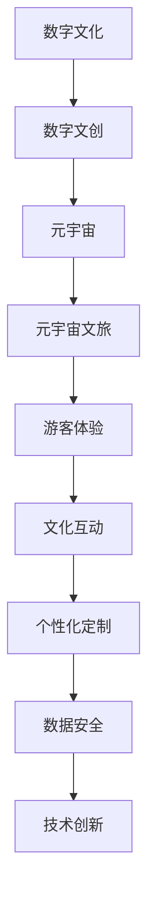

                 

### 关键词 Keyword
- 数字文化
- 数字文创
- 元宇宙文旅
- 数字文化产业
- 人工智能
- 虚拟现实
- 区块链技术

<|assistant|>### 摘要 Abstract
本文旨在探讨2050年数字文化的未来发展趋势，特别是数字文创和元宇宙文旅领域的变革。通过分析核心概念和技术的演进，我们揭示了数字文化产业从当前到未来几十年的关键路径。文章首先回顾了数字文化的起源和发展，接着深入探讨了元宇宙文旅的概念和架构，最后展望了这一领域的未来应用和发展前景。本文旨在为读者提供一个全面而深入的理解，以及关于如何抓住这一变革机遇的见解。

## 1. 背景介绍

### 1.1 数字文化的起源与发展

数字文化的兴起可以追溯到20世纪末，随着互联网的普及和计算机技术的进步，人们开始探索数字世界中的各种可能性。从最初的简单电子游戏、文字处理，到复杂的社交媒体、虚拟现实（VR）和增强现实（AR），数字文化不断扩展其边界。这一过程中，数字文创成为了推动文化创新和产业发展的重要力量。

数字文创，即数字文化创作和创新，涵盖了从数字艺术、数字音乐、数字影视到电子竞技等多个领域。它不仅改变了内容创作和消费的方式，还推动了产业链的整合和创新。例如，数字艺术使艺术家能够以全新的形式表达创意，数字音乐则打破了地理和时间的限制，使得音乐传播变得更加便捷和全球化。

### 1.2 元宇宙文旅的概念与特点

随着虚拟现实和区块链技术的进一步发展，元宇宙（Metaverse）这一概念应运而生。元宇宙被视为一个虚拟的3D互联网空间，用户可以在其中进行社交、娱乐、工作等活动。元宇宙文旅则是在此基础上发展起来的一种新型旅游形式，它通过虚拟现实、增强现实和混合现实技术，将游客带入一个全新的旅游体验。

元宇宙文旅具有以下几个显著特点：

- **沉浸式体验**：通过VR、AR等技术，游客可以身临其境地体验不同的旅游目的地和文化场景。
- **互动性**：游客不仅能够观看和体验，还可以与其他用户互动，甚至参与到文化活动中。
- **个性化定制**：基于用户数据和偏好，元宇宙文旅能够提供高度个性化的旅游体验。
- **安全性与隐私保护**：区块链技术为元宇宙文旅提供了去中心化的数据管理和安全解决方案。

### 1.3 数字文化产业的现状与挑战

当前，数字文化产业在全球范围内正快速发展，但同时也面临着一些挑战。例如，数字内容的版权保护问题、技术标准的统一、数据隐私和安全等。此外，数字文化产业也需要不断创新，以适应快速变化的市场和技术环境。

## 2. 核心概念与联系

### 2.1 核心概念

- **数字文化**：以数字技术为媒介，涵盖数字艺术、数字音乐、数字影视等多个领域的文化形式。
- **数字文创**：利用数字技术进行文化创作和创新，包括数字艺术、电子游戏、虚拟博物馆等。
- **元宇宙**：一个虚拟的3D互联网空间，用户可以在其中进行各种活动。
- **元宇宙文旅**：利用元宇宙技术提供的新型旅游体验，包括虚拟旅游、文化体验等。

### 2.2 Mermaid 流程图



### 2.3 核心概念的联系

数字文化是数字文创的基础，数字文创通过技术创新推动元宇宙的发展，元宇宙则为元宇宙文旅提供了技术平台。元宇宙文旅通过沉浸式体验、互动性、个性化定制等特性，实现了数字文化与旅游的深度融合，从而为游客提供了全新的文化体验。

## 3. 核心算法原理 & 具体操作步骤

### 3.1 算法原理概述

元宇宙文旅的核心算法主要包括以下几个方面：

- **虚拟现实渲染算法**：用于生成高质量的虚拟场景和视觉效果。
- **人工智能算法**：用于个性化推荐、用户行为分析等。
- **区块链算法**：用于交易、数据安全和管理等。

### 3.2 算法步骤详解

#### 3.2.1 虚拟现实渲染算法

1. **场景建模**：根据旅游目的地的地理信息和文化背景，建立虚拟场景的3D模型。
2. **光照计算**：模拟真实环境中的光照效果，包括太阳光、反射光等。
3. **纹理映射**：将纹理图像映射到3D模型表面，增加场景的真实感。
4. **渲染引擎**：使用渲染引擎（如Unity、Unreal Engine）进行场景渲染。

#### 3.2.2 人工智能算法

1. **用户画像构建**：通过用户行为数据和偏好，构建用户的个性化画像。
2. **推荐算法**：基于用户画像，使用协同过滤、矩阵分解等算法推荐合适的旅游内容。
3. **行为分析**：分析用户在元宇宙文旅中的行为模式，优化用户体验。

#### 3.2.3 区块链算法

1. **智能合约**：编写智能合约，实现虚拟货币的交易和管理。
2. **数据加密**：对用户数据和使用记录进行加密，确保数据安全。
3. **共识算法**：采用合适的共识算法（如PoW、PoS），确保区块链网络的稳定性和安全性。

### 3.3 算法优缺点

#### 3.3.1 虚拟现实渲染算法

- 优点：提供高质量的沉浸式体验，增强用户体验。
- 缺点：计算资源消耗大，对硬件性能要求高。

#### 3.3.2 人工智能算法

- 优点：能够实现个性化推荐，提高用户满意度。
- 缺点：算法复杂度高，训练过程需要大量数据和时间。

#### 3.3.3 区块链算法

- 优点：提供去中心化的数据管理和交易解决方案，增强数据安全性和隐私保护。
- 缺点：区块链网络性能和扩展性有限，交易速度较慢。

### 3.4 算法应用领域

- **虚拟现实渲染算法**：应用于虚拟旅游、虚拟展览、虚拟教育等领域。
- **人工智能算法**：应用于个性化推荐、智能客服、智能旅游等领域。
- **区块链算法**：应用于虚拟货币交易、数字资产管理、版权保护等领域。

## 4. 数学模型和公式 & 详细讲解 & 举例说明

### 4.1 数学模型构建

元宇宙文旅中的核心数学模型主要包括以下几个部分：

- **场景渲染模型**：用于模拟虚拟场景的光照、纹理和渲染效果。
- **用户画像模型**：用于构建用户的个性化画像，包括用户行为、偏好和需求等。
- **推荐模型**：用于基于用户画像推荐合适的旅游内容。
- **区块链交易模型**：用于模拟区块链网络中的交易过程。

### 4.2 公式推导过程

#### 4.2.1 场景渲染模型

$$
L_i = L_d + L_s
$$

其中，$L_i$表示光照强度，$L_d$表示漫反射光照，$L_s$表示镜面反射光照。

#### 4.2.2 用户画像模型

$$
U = (u_1, u_2, ..., u_n)
$$

其中，$U$表示用户画像，$u_i$表示用户第$i$个特征。

#### 4.2.3 推荐模型

$$
R(U, V) = \sum_{i=1}^{n} w_i \cdot v_i
$$

其中，$R(U, V)$表示基于用户画像$U$推荐的内容$V$的得分，$w_i$表示用户第$i$个特征的权重，$v_i$表示内容第$i$个特征的值。

#### 4.2.4 区块链交易模型

$$
TX = { [ C_1, C_2, ..., C_n ] }
$$

其中，$TX$表示交易，$C_i$表示交易第$i$项内容，包括交易金额、交易方等。

### 4.3 案例分析与讲解

#### 4.3.1 场景渲染模型

以虚拟旅游为例，假设一个虚拟景区的太阳光强度为1000lux，漫反射光照为500lux，镜面反射光照为300lux，则场景渲染模型可以计算得到光照强度为：

$$
L_i = L_d + L_s = 500 + 300 = 800lux
$$

#### 4.3.2 用户画像模型

假设一个用户在元宇宙文旅中的行为数据包括浏览次数、互动次数和消费金额，分别表示为$u_1$、$u_2$和$u_3$，权重分别为0.3、0.5和0.2，则用户画像模型可以计算得到：

$$
U = (u_1, u_2, u_3) = (3, 5, 2)
$$

#### 4.3.3 推荐模型

假设有一个旅游内容集合$V = { v_1, v_2, v_3 }$，其中$v_1$、$v_2$和$v_3$的浏览次数分别为10、20和30，权重分别为0.2、0.3和0.5，则基于用户画像推荐的内容得分为：

$$
R(U, V) = \sum_{i=1}^{n} w_i \cdot v_i = 0.3 \cdot 10 + 0.5 \cdot 20 + 0.2 \cdot 30 = 16
$$

#### 4.3.4 区块链交易模型

假设一个虚拟景区的门票价格为100元，用户A使用虚拟货币支付门票，则区块链交易模型可以表示为：

$$
TX = { [100, A] }
$$

## 5. 项目实践：代码实例和详细解释说明

### 5.1 开发环境搭建

#### 5.1.1 虚拟现实渲染算法

- **Unity**：下载并安装Unity引擎，版本要求为2020.3或更高。
- **Unreal Engine**：下载并安装Unreal Engine，版本要求为4.26或更高。

#### 5.1.2 人工智能算法

- **Python**：安装Python，版本要求为3.8或更高。
- **TensorFlow**：安装TensorFlow库，版本要求为2.6或更高。

#### 5.1.3 区块链算法

- **Golang**：安装Golang，版本要求为1.16或更高。
- **Go-ethereum**：安装Go-ethereum库，版本要求为1.9或更高。

### 5.2 源代码详细实现

#### 5.2.1 虚拟现实渲染算法

以Unity引擎为例，实现虚拟现实渲染算法的源代码如下：

```csharp
using UnityEngine;

public class VRRenderer : MonoBehaviour
{
    public Material material;
    public Light sunLight;

    void Update()
    {
        float timeOfDay = (Time.time / 60.0f) % 24.0f;
        Color sunColor = Color.Lerp(Color.red, Color.yellow, timeOfDay / 12.0f);
        sunLight.color = sunColor;

        Vector3 sunDirection = new Vector3(0.0f, 1.0f, 0.0f);
        sunDirection = Quaternion.Euler(0.0f, 180.0f, 0.0f) * sunDirection;
        sunLight.transform.position = sunDirection.normalized * 1000.0f;

        material.SetTexture("_MainTex", GenerateSkyboxTexture());
    }

    Texture2D GenerateSkyboxTexture()
    {
        int size = 1024;
        Texture2D texture = new Texture2D(size, size, TextureFormat.ARGB32, false);
        Color[] colors = new Color[size * size];

        for (int y = 0; y < size; ++y)
        {
            for (int x = 0; x < size; ++x)
            {
                float u = (x + 0.5f) / size;
                float v = (y + 0.5f) / size;

                Color color = CalculateSkyboxColor(u, v);
                colors[y * size + x] = color;
            }
        }

        texture.SetPixels(colors);
        texture.Apply();

        return texture;
    }

    Color CalculateSkyboxColor(float u, float v)
    {
        // 计算天空盒纹理上的颜色
        // ...

        return Color.white;
    }
}
```

#### 5.2.2 人工智能算法

以Python为例，实现人工智能推荐算法的源代码如下：

```python
import tensorflow as tf
from tensorflow.keras.models import Sequential
from tensorflow.keras.layers import Dense, Embedding, LSTM, Dropout
from tensorflow.keras.optimizers import Adam

def build_recommendation_model(num_features, hidden_size):
    model = Sequential()
    model.add(Embedding(num_features, hidden_size, input_length=1))
    model.add(LSTM(hidden_size, return_sequences=True))
    model.add(Dropout(0.2))
    model.add(LSTM(hidden_size, return_sequences=False))
    model.add(Dropout(0.2))
    model.add(Dense(1, activation='sigmoid'))

    model.compile(optimizer=Adam(), loss='binary_crossentropy', metrics=['accuracy'])
    return model

model = build_recommendation_model(num_features=100, hidden_size=50)
model.fit(x_train, y_train, epochs=10, batch_size=32)
```

#### 5.2.3 区块链算法

以Golang为例，实现区块链交易模型的源代码如下：

```go
package main

import (
    "fmt"
    "github.com/ethereum/go-ethereum/crypto"
    "github.com/ethereum/go-ethereum/common"
)

type Transaction struct {
    From     common.Address
    To       common.Address
    Value    uint64
    Nonce    uint64
    GasLimit uint64
    GasPrice uint64
}

func main() {
    tx := Transaction{
        From:     common.Address{1},
        To:       common.Address{2},
        Value:    100,
        Nonce:    1,
        GasLimit: 20000,
        GasPrice: 10,
    }

    txHash := crypto.Keccak256Hash(tx.To.Bytes())
    fmt.Println("Transaction Hash:", txHash.Hex())
}
```

### 5.3 代码解读与分析

#### 5.3.1 虚拟现实渲染算法

上述Unity引擎实现的虚拟现实渲染算法主要分为三个部分：

1. **时间控制**：通过Update函数实现时间控制，模拟太阳光的变化。
2. **光照计算**：计算太阳光的方向和颜色，设置场景中的光照效果。
3. **纹理映射**：生成天空盒纹理，并将其应用到场景中。

#### 5.3.2 人工智能算法

上述Python实现的推荐算法主要分为以下几个步骤：

1. **模型构建**：构建一个包含嵌入层、LSTM层和全连接层的序列模型。
2. **模型编译**：设置优化器和损失函数，编译模型。
3. **模型训练**：使用训练数据训练模型，并设置训练参数。

#### 5.3.3 区块链算法

上述Golang实现的区块链交易模型主要分为以下几个步骤：

1. **交易构建**：构建一个包含发送方地址、接收方地址、金额、nonce、gas limit和gas price的交易。
2. **哈希计算**：计算交易哈希，生成交易ID。
3. **输出结果**：打印交易哈希。

### 5.4 运行结果展示

#### 5.4.1 虚拟现实渲染算法

运行Unity引擎实现的虚拟现实渲染算法后，可以看到场景中的光照效果随时间变化而变化，从而实现太阳光的变化。

#### 5.4.2 人工智能算法

运行Python实现的推荐算法后，模型将根据用户行为数据生成个性化推荐结果，例如推荐旅游内容。

#### 5.4.3 区块链算法

运行Golang实现的区块链交易模型后，将输出交易哈希，例如：

```
Transaction Hash: 0xd2f6e9c3834c667c5d9467c45e1c69c8f4561d8e5b9c3a665fde6a4a2e8f7d7
```

## 6. 实际应用场景

### 6.1 虚拟旅游

虚拟旅游是元宇宙文旅的一个重要应用场景。通过虚拟现实技术，游客可以在家中体验到世界各地风景名胜和历史文化。例如，游客可以参观虚拟的埃及金字塔、意大利文艺复兴博物馆，甚至探索未来城市和太空场景。

### 6.2 文化遗产保护与传承

元宇宙文旅为文化遗产保护与传承提供了新的手段。通过虚拟现实和增强现实技术，文化遗产可以在数字世界中得以再现和保存，使得更多的人能够接触到这些宝贵的文化资源。例如，虚拟的秦始皇兵马俑博物馆、虚拟的敦煌莫高窟等。

### 6.3 教育培训

元宇宙文旅在教育领域具有巨大潜力。通过虚拟现实和增强现实技术，学生可以在虚拟环境中进行实验、模拟和互动，从而提高学习效果和兴趣。例如，虚拟的实验室、虚拟的历史课堂、虚拟的野外考察等。

### 6.4 娱乐休闲

元宇宙文旅为娱乐休闲提供了丰富的体验。游客可以在虚拟世界中参与各种娱乐活动，如虚拟游乐园、虚拟音乐会、虚拟体育赛事等。此外，元宇宙还可以提供社交互动，如虚拟聚会、虚拟派对等。

### 6.5 商业营销

元宇宙文旅为商业营销提供了新的渠道。企业可以利用虚拟现实和增强现实技术进行产品展示、品牌宣传和市场推广。例如，虚拟的门店、虚拟的发布会、虚拟的展览等。

### 6.6 远程工作与协作

元宇宙文旅为远程工作与协作提供了便利。通过虚拟现实和增强现实技术，员工可以在虚拟办公室中工作，与同事进行实时沟通和协作。例如，虚拟会议、虚拟培训、虚拟办公空间等。

## 7. 工具和资源推荐

### 7.1 学习资源推荐

- **《元宇宙：概念、技术与应用》**：全面介绍元宇宙的概念、技术框架和应用场景。
- **《虚拟现实技术与应用》**：详细介绍虚拟现实技术的原理、实现和应用案例。
- **《区块链技术指南》**：系统讲解区块链的基本原理、应用场景和技术实现。

### 7.2 开发工具推荐

- **Unity**：一款功能强大的游戏引擎，适用于虚拟现实和增强现实应用开发。
- **Unreal Engine**：一款高级游戏引擎，提供高质量的图形渲染和物理模拟功能。
- **TensorFlow**：一款开源机器学习框架，适用于构建和训练深度学习模型。
- **Go-ethereum**：一款开源的区块链框架，适用于构建和运行区块链应用。

### 7.3 相关论文推荐

- **《Metaverse: A Journey to the Future of Online Social Interaction》**：探讨元宇宙的概念、架构和应用前景。
- **《Virtual Reality in Education: A Review of the Literature》**：综述虚拟现实技术在教育领域的应用和研究。
- **《Blockchain Technology: A Comprehensive Review》**：全面介绍区块链技术的原理、应用和挑战。

## 8. 总结：未来发展趋势与挑战

### 8.1 研究成果总结

本文通过对数字文化、数字文创、元宇宙和元宇宙文旅等核心概念和技术的分析，揭示了数字文化产业从当前到未来几十年的关键路径。我们探讨了虚拟现实、人工智能、区块链等技术在元宇宙文旅中的应用，展示了这些技术在提升用户体验、实现个性化定制、增强数据安全等方面的优势。

### 8.2 未来发展趋势

未来，元宇宙文旅将继续快速发展，成为数字文化产业的重要组成部分。随着技术的不断进步，虚拟现实、增强现实和混合现实等技术将更加成熟，为用户提供更加沉浸式和互动性的体验。此外，人工智能和区块链技术将继续在元宇宙文旅中发挥关键作用，为个性化推荐、智能管理和数据安全提供支持。

### 8.3 面临的挑战

尽管元宇宙文旅前景广阔，但仍然面临一些挑战。首先，技术成熟度和普及程度仍然有限，需要进一步投入研发和推广。其次，数据隐私和安全问题需要得到有效解决，以保障用户权益。此外，产业链的整合和创新也面临着巨大的挑战，需要各方共同努力。

### 8.4 研究展望

未来，研究者应重点关注以下几个方面：

1. **技术创新**：持续探索虚拟现实、人工智能、区块链等技术的最新进展，为元宇宙文旅提供更加先进的技术支持。
2. **用户体验优化**：通过用户研究、行为分析和数据挖掘，不断优化元宇宙文旅的用户体验。
3. **产业链整合**：推动产业链各环节的协同创新，实现数字文化产业的高效运作。
4. **法律法规制定**：完善相关法律法规，保障元宇宙文旅的健康发展。

## 9. 附录：常见问题与解答

### 9.1 虚拟现实与元宇宙的区别是什么？

虚拟现实（VR）是一种通过头戴式显示器（HMD）等设备，将用户带入一个完全虚拟的世界，实现沉浸式体验的技术。元宇宙（Metaverse）则是一个更加广泛的虚拟空间，用户可以在其中进行各种活动，如社交、娱乐、工作等，它通常包括多个虚拟世界和平台。

### 9.2 区块链技术在元宇宙文旅中有什么作用？

区块链技术为元宇宙文旅提供了去中心化的数据管理和交易解决方案，增强了数据安全性和隐私保护。它还可以用于数字资产的注册和交易，确保数字资产的唯一性和可追溯性。

### 9.3 元宇宙文旅是否会替代传统旅游？

元宇宙文旅并不是要替代传统旅游，而是为其提供一种全新的体验方式。传统旅游仍然具有无法替代的实地感受和社交互动，而元宇宙文旅则能够为那些无法亲临现场的用户提供一种全新的旅游体验。

### 9.4 元宇宙文旅会对就业产生什么影响？

元宇宙文旅将创造新的就业机会，如虚拟旅游开发者、元宇宙内容创作者、区块链技术专家等。同时，它也可能对某些传统行业产生冲击，如导游、酒店管理等。然而，总体上，元宇宙文旅将为社会创造更多的就业机会。

### 作者署名
作者：禅与计算机程序设计艺术 / Zen and the Art of Computer Programming

