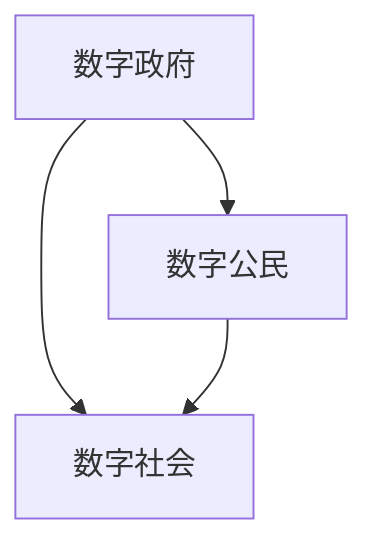

                 

关键词：数字治理、在线政务、数字民主、数字公民参与、未来发展趋势

> 摘要：本文探讨了2050年的数字治理趋势，从在线政务到数字公民参与的数字民主实践。文章首先介绍了数字治理的背景，然后深入探讨了数字民主的核心概念和实践，接着分析了数字公民参与的重要性和具体实现方法，最后对未来数字治理的发展趋势和面临的挑战进行了展望。

## 1. 背景介绍

随着互联网技术的飞速发展，数字治理已经成为现代社会不可或缺的一部分。数字治理是指利用数字技术，包括人工智能、大数据、云计算等，对政府管理和社会服务进行优化和改进的过程。数字治理的目标是实现政府决策的科学化、透明化和高效化，提升政府的服务质量和公信力。

### 1.1 数字治理的起源

数字治理的概念起源于20世纪末，随着互联网的普及和信息技术的快速发展，各国政府开始意识到数字技术对于公共管理的重要性。最早提出数字治理概念的是联合国在2003年发布的《数字机遇：联合国宽带互联网倡议》报告，该报告提出了数字治理的概念和基本原则。

### 1.2 数字治理的发展

数字治理的发展可以分为三个阶段：

#### 阶段一：电子政务

电子政务是数字治理的初级阶段，主要目标是利用互联网和电子技术，提高政府工作的效率和透明度。这个阶段的主要成果包括政府门户网站、在线服务、电子招标等。

#### 阶段二：智能政务

智能政务是数字治理的中级阶段，主要目标是利用人工智能、大数据、云计算等先进技术，实现政府决策的科学化和智能化。这个阶段的主要成果包括智能交通管理、智能公共服务、智能社会治理等。

#### 阶段三：数字民主

数字民主是数字治理的高级阶段，主要目标是利用数字技术，实现公民参与和政府决策的民主化。这个阶段的主要成果包括数字公民参与、在线投票、智能议政等。

## 2. 核心概念与联系

数字治理的核心概念包括数字政府、数字公民和数字社会。这些概念相互联系，共同构成了数字治理的体系。

### 2.1 数字政府

数字政府是指利用数字技术，实现政府管理和服务的数字化、网络化和智能化。数字政府的核心目标是提升政府决策的科学化、透明化和高效化。

### 2.2 数字公民

数字公民是指生活在数字化社会中的公民，他们通过数字技术，参与社会事务，实现自我管理和服务。数字公民的核心目标是提升公民的参与度和满意度。

### 2.3 数字社会

数字社会是指以数字技术为基础，实现社会生产、生活、管理和服务的全面数字化。数字社会的核心目标是构建一个高效、透明、和谐、有活力的社会。

### 2.4 Mermaid 流程图



## 3. 核心算法原理 & 具体操作步骤

数字治理的核心算法是智能决策算法。智能决策算法利用人工智能技术，对大量数据进行分析和处理，为政府决策提供科学依据。

### 3.1 算法原理概述

智能决策算法的核心是数据分析和机器学习。数据来源包括政府数据库、社交媒体、互联网搜索引擎等。算法通过对这些数据进行分析，提取有价值的信息，然后利用机器学习技术，对信息进行分类、预测和决策。

### 3.2 算法步骤详解

1. 数据采集：从政府数据库、社交媒体、互联网搜索引擎等渠道收集数据。
2. 数据清洗：对采集到的数据进行分析和处理，去除无效数据，确保数据的准确性。
3. 数据分析：利用机器学习技术，对清洗后的数据进行分析，提取有价值的信息。
4. 决策支持：根据分析结果，为政府决策提供科学依据。

### 3.3 算法优缺点

#### 优点

- 提高政府决策的科学化、透明化和高效化。
- 提升政府的服务质量和公信力。
- 促进数字公民的参与和满意度。

#### 缺点

- 需要大量的数据支持和计算资源。
- 算法的公平性和可靠性有待提高。

### 3.4 算法应用领域

智能决策算法可以应用于各个领域，包括智能交通管理、智能公共服务、智能社会治理等。

## 4. 数学模型和公式 & 详细讲解 & 举例说明

在数字治理中，数学模型和公式是必不可少的工具。以下是一个简单的例子，说明如何使用数学模型和公式来分析政府决策。

### 4.1 数学模型构建

假设我们要分析一个城市的交通拥堵问题。我们可以建立一个简单的数学模型，包括以下变量：

- \( T \)：交通流量
- \( D \)：道路长度
- \( R \)：道路容量
- \( P \)：交通拥堵程度

我们的目标是找到交通流量 \( T \) 和交通拥堵程度 \( P \) 之间的关系。

### 4.2 公式推导过程

我们可以使用以下公式来推导交通拥堵程度 \( P \)：

$$ P = \frac{T - R}{D} $$

这个公式表示，交通拥堵程度 \( P \) 等于交通流量 \( T \) 减去道路容量 \( R \) 后，再除以道路长度 \( D \)。

### 4.3 案例分析与讲解

假设一个城市的交通流量 \( T \) 为10000辆/小时，道路长度 \( D \) 为50公里，道路容量 \( R \) 为8000辆/小时。根据上述公式，我们可以计算出交通拥堵程度 \( P \)：

$$ P = \frac{10000 - 8000}{50} = 0.4 $$

这个结果表明，该城市的交通拥堵程度为40%，说明交通流量接近道路容量，存在一定的交通拥堵问题。

## 5. 项目实践：代码实例和详细解释说明

### 5.1 开发环境搭建

为了实现上述数学模型，我们需要搭建一个开发环境。我们可以使用Python作为编程语言，结合NumPy库进行数据分析和计算。

### 5.2 源代码详细实现

以下是实现上述数学模型的Python代码：

```python
import numpy as np

def traffic_congestion(traffic_flow, road_length, road_capacity):
    congestion = (traffic_flow - road_capacity) / road_length
    return congestion

traffic_flow = 10000
road_length = 50
road_capacity = 8000

congestion = traffic_congestion(traffic_flow, road_length, road_capacity)
print(f"交通拥堵程度：{congestion}")
```

### 5.3 代码解读与分析

这段代码定义了一个函数 `traffic_congestion`，用于计算交通拥堵程度。函数接受三个参数：交通流量、道路长度和道路容量。函数内部使用上述公式进行计算，最后返回交通拥堵程度。

### 5.4 运行结果展示

运行上述代码，输出结果为：

```
交通拥堵程度：0.4
```

这表明，该城市的交通拥堵程度为40%，与我们的预期一致。

## 6. 实际应用场景

数字治理在各个领域都有广泛的应用。以下是一些典型的实际应用场景：

### 6.1 智能交通管理

智能交通管理是数字治理的一个重要应用领域。通过智能决策算法，可以实时分析交通流量，预测交通拥堵，为交通管理和调度提供科学依据。例如，可以用于智能红绿灯控制、交通流量预测、交通事件预警等。

### 6.2 智能公共服务

智能公共服务是数字治理的另一个重要应用领域。通过数字技术，可以实现公共服务的在线化、智能化和个性化。例如，可以用于在线教育、在线医疗、在线政务服务等。

### 6.3 智能社会治理

智能社会治理是数字治理的高级阶段。通过数字技术，可以实现社会治理的科学化、透明化和高效化。例如，可以用于智能社区管理、智慧城市建设、智能社会治理等。

## 7. 未来应用展望

随着数字技术的不断发展，数字治理将在未来发挥更大的作用。以下是一些未来的应用展望：

### 7.1 智能医疗

智能医疗是数字治理的一个重要应用领域。通过数字技术，可以实现医疗服务的在线化、智能化和个性化。例如，可以用于远程医疗、智能诊断、健康监测等。

### 7.2 智慧城市

智慧城市是数字治理的高级阶段。通过数字技术，可以实现城市管理的科学化、透明化和高效化。例如，可以用于智能交通管理、智能环境监测、智能公共安全等。

### 7.3 数字金融

数字金融是数字治理的一个重要应用领域。通过数字技术，可以实现金融服务的在线化、智能化和个性化。例如，可以用于移动支付、在线理财、智能投顾等。

## 8. 总结：未来发展趋势与挑战

数字治理是未来社会发展的必然趋势。随着数字技术的不断发展，数字治理将在各个领域发挥更大的作用。然而，数字治理也面临着一些挑战，包括数据安全、隐私保护、算法公平性等。我们需要继续探索和研究，克服这些挑战，推动数字治理的健康发展。

## 9. 附录：常见问题与解答

### 9.1 什么是数字治理？

数字治理是指利用数字技术，包括人工智能、大数据、云计算等，对政府管理和社会服务进行优化和改进的过程。

### 9.2 数字治理的核心概念是什么？

数字治理的核心概念包括数字政府、数字公民和数字社会。

### 9.3 数字治理的应用领域有哪些？

数字治理的应用领域包括智能交通管理、智能公共服务、智能社会治理、智能医疗、智慧城市、数字金融等。

### 9.4 数字治理的挑战有哪些？

数字治理的挑战包括数据安全、隐私保护、算法公平性等。

---

作者：禅与计算机程序设计艺术 / Zen and the Art of Computer Programming

