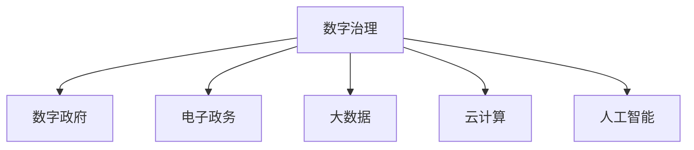
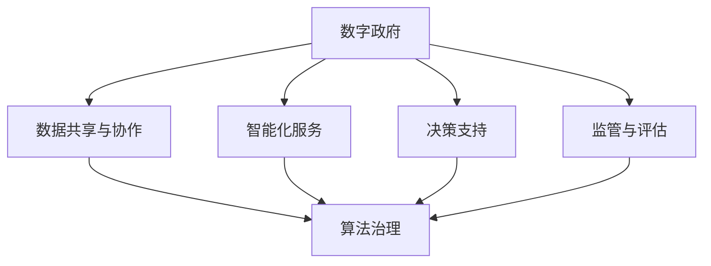
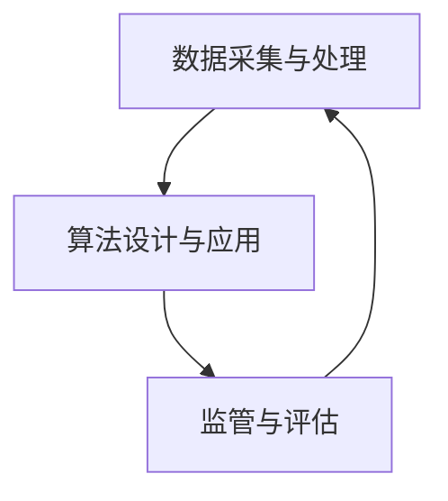

                 

关键词：数字治理、数字政府、算法治理、政务智能化、未来发展趋势、挑战与展望

> 摘要：随着信息技术的发展，数字治理逐渐成为国家治理现代化的关键领域。本文旨在探讨2050年数字治理的前景，特别是从数字政府向算法治理转型的趋势。文章首先介绍了数字治理的基本概念，然后分析了数字政府与算法治理的联系与区别，随后详细阐述了政务智能化的具体实施路径。通过数学模型、算法原理以及实际项目案例的剖析，文章深入探讨了数字治理在实际应用中的技术实现和挑战。最后，对未来的发展前景、面临的挑战以及研究方向进行了展望，为我国数字治理的发展提供了有益的参考。

## 1. 背景介绍

### 1.1 数字治理的概念与重要性

数字治理（Digital Governance）是指利用数字技术，尤其是信息技术，对公共事务进行管理和治理的过程。它涵盖了政府机构、企业和公民在数字环境中的互动、合作以及信息共享。数字治理的核心理念是通过数字化手段提高政府透明度、效率和公信力，进而提升国家治理能力。

在全球范围内，数字治理的重要性日益凸显。一方面，随着互联网、大数据、人工智能等技术的发展，数字治理成为国家治理现代化的必然选择。另一方面，数字化带来的数据爆炸和复杂社会问题，需要政府具备更高的数据处理和分析能力，以应对全球性挑战，如公共卫生危机、气候变化、社会不平等等问题。

### 1.2 数字政府的现状与发展趋势

数字政府（Digital Government）是数字治理的重要组成部分，它指的是利用信息技术构建高效、透明、便捷的政府服务模式。近年来，全球各国纷纷推进数字政府的建设，通过电子政务、云计算、大数据等技术手段，提高政府服务质量和效率。

当前，数字政府的发展趋势主要包括：

1. **服务智能化**：通过人工智能、自然语言处理等技术，实现政府服务的智能化，提高用户体验和满意度。
2. **数据驱动决策**：利用大数据技术，对海量数据进行收集、分析和利用，为政府决策提供科学依据。
3. **跨部门协作**：通过构建数字平台，实现政府部门之间的信息共享和业务协同，提高治理效能。
4. **网络安全与隐私保护**：在推进数字政府建设的过程中，确保数据安全和公民隐私成为重要课题。

### 1.3 算法治理的概念与内涵

算法治理（Algorithm Governance）是数字治理的高级阶段，它指的是通过算法设计和监管，实现对公共事务的智能化管理。算法治理的核心在于利用算法的强大计算能力，优化政府决策过程，提高治理效率和效果。

算法治理的主要特点包括：

1. **自动化与智能化**：通过算法实现自动化的决策和执行，减少人为干预，提高决策速度和准确性。
2. **数据驱动**：算法治理依赖于大量数据，通过对数据的深度挖掘和分析，实现智能化决策。
3. **动态调整**：算法治理能够根据实时数据动态调整决策策略，提高应对复杂问题的能力。
4. **透明与可解释性**：算法治理需要确保算法的透明性和可解释性，增强公众对算法决策的信任。

## 2. 核心概念与联系

### 2.1 数字治理的基本概念

数字治理涵盖多个方面，包括政府机构的数字化转型、政府服务的数字化交付、数字时代的政策制定等。核心概念包括数字政府、电子政务、大数据、云计算、人工智能等。

**Mermaid流程图：**


### 2.2 数字政府与算法治理的联系

数字政府是算法治理的基础，通过数字化手段实现政府服务的优化。而算法治理则是在数字政府的基础上，进一步利用算法技术提高治理效率。两者之间的联系主要体现在以下几个方面：

1. **数据共享与协作**：数字政府通过构建数字化平台，实现各部门之间的数据共享和业务协同，为算法治理提供了数据基础。
2. **智能化服务**：算法治理通过人工智能等技术，为公民提供个性化、智能化的政府服务，提高用户满意度。
3. **决策支持**：算法治理利用大数据和人工智能技术，为政府决策提供科学依据，提高决策质量和效率。
4. **监管与评估**：算法治理需要建立相应的监管机制，确保算法的透明性和公平性，同时通过数据分析和模型评估，不断优化算法性能。

**Mermaid流程图：**


### 2.3 算法治理的架构与实现

算法治理的架构主要包括数据采集与处理、算法设计与应用、监管与评估等环节。其实现路径如下：

1. **数据采集与处理**：通过多种渠道收集海量数据，包括政府数据、社会数据、公民数据等，利用大数据技术进行清洗、整合和分析。
2. **算法设计与应用**：针对具体问题，设计合适的算法模型，如机器学习、深度学习等，将算法应用于实际治理场景，实现自动化、智能化的决策和执行。
3. **监管与评估**：建立算法监管机制，确保算法的透明性和公平性，同时通过数据分析和模型评估，不断优化算法性能，提高治理效果。

**Mermaid流程图：**


## 3. 核心算法原理 & 具体操作步骤

### 3.1 算法原理概述

算法治理的核心在于利用人工智能技术实现智能化决策。常见的算法包括机器学习、深度学习、强化学习等。

**机器学习（Machine Learning）**：通过训练模型，从数据中学习规律，实现自动化决策。常用的算法有决策树、随机森林、支持向量机等。

**深度学习（Deep Learning）**：基于神经网络，通过多层非线性变换，实现对复杂数据的建模。常用的算法有卷积神经网络（CNN）、循环神经网络（RNN）、生成对抗网络（GAN）等。

**强化学习（Reinforcement Learning）**：通过与环境互动，不断调整策略，实现最优决策。常用的算法有Q-learning、深度Q网络（DQN）等。

### 3.2 算法步骤详解

**数据采集与处理**：

1. 数据来源：包括政府数据、社会数据、公民数据等。
2. 数据清洗：去除重复、错误、不完整的数据。
3. 数据整合：将不同来源的数据进行整合，形成统一的数据集。

**算法设计与应用**：

1. 算法选择：根据具体问题，选择合适的算法。
2. 模型训练：利用训练数据，对模型进行训练，优化参数。
3. 模型评估：利用测试数据，评估模型性能，调整模型参数。
4. 模型部署：将训练好的模型部署到实际应用场景，实现自动化决策。

**监管与评估**：

1. 算法透明性：确保算法的透明性，便于公众监督。
2. 算法公平性：确保算法的公平性，避免歧视现象。
3. 数据分析与评估：利用数据分析和模型评估，不断优化算法性能。

### 3.3 算法优缺点

**优点**：

1. **高效性**：算法能够快速处理海量数据，提高决策速度。
2. **准确性**：通过训练模型，算法能够从数据中学习规律，提高决策准确性。
3. **智能化**：算法能够实现自动化决策，减少人为干预。

**缺点**：

1. **数据依赖**：算法性能依赖于数据质量，数据缺失或错误可能导致算法失效。
2. **算法偏见**：算法可能存在偏见，影响决策的公平性。
3. **解释性**：部分算法（如深度学习）具有高度复杂性，难以解释。

### 3.4 算法应用领域

算法治理在多个领域具有广泛应用，如：

1. **公共安全**：通过算法实现智能监控、预测犯罪等。
2. **社会管理**：通过算法实现智能交通管理、社会保障管理等。
3. **公共卫生**：通过算法实现疾病预测、疫情防控等。
4. **环境保护**：通过算法实现环境监测、资源管理等。

## 4. 数学模型和公式 & 详细讲解 & 举例说明

### 4.1 数学模型构建

在算法治理中，常用的数学模型包括线性回归、逻辑回归、支持向量机、神经网络等。

**线性回归（Linear Regression）**：

$$
y = \beta_0 + \beta_1x
$$

其中，$y$ 是因变量，$x$ 是自变量，$\beta_0$ 和 $\beta_1$ 是模型参数。

**逻辑回归（Logistic Regression）**：

$$
P(y=1) = \frac{1}{1 + e^{-(\beta_0 + \beta_1x)}}
$$

其中，$P(y=1)$ 是因变量为1的概率，$x$ 是自变量，$\beta_0$ 和 $\beta_1$ 是模型参数。

**支持向量机（Support Vector Machine, SVM）**：

$$
w \cdot x + b = 0
$$

其中，$w$ 是权重向量，$x$ 是特征向量，$b$ 是偏置。

**神经网络（Neural Network）**：

神经网络由多个神经元（节点）组成，每个神经元通过权重和偏置连接其他神经元，并通过激活函数进行非线性变换。

$$
a_{\text{layer}} = f(\sum_{i=1}^{n} w_{i} a_{\text{prev layer}} + b)
$$

其中，$a_{\text{layer}}$ 是第 $l$ 层的输出，$f$ 是激活函数，$w_{i}$ 和 $b$ 是权重和偏置。

### 4.2 公式推导过程

以线性回归为例，介绍公式的推导过程。

假设我们有 $n$ 个样本点 $(x_i, y_i)$，其中 $x_i$ 是自变量，$y_i$ 是因变量。

目标是最小化均方误差：

$$
\text{MSE} = \frac{1}{n} \sum_{i=1}^{n} (y_i - \hat{y}_i)^2
$$

其中，$\hat{y}_i$ 是预测值，可以通过线性回归模型计算：

$$
\hat{y}_i = \beta_0 + \beta_1x_i
$$

为了求取 $\beta_0$ 和 $\beta_1$，我们可以使用最小二乘法：

$$
\beta_0 = \bar{y} - \beta_1\bar{x}
$$

$$
\beta_1 = \frac{\sum_{i=1}^{n} (x_i - \bar{x})(y_i - \bar{y})}{\sum_{i=1}^{n} (x_i - \bar{x})^2}
$$

其中，$\bar{x}$ 和 $\bar{y}$ 分别是自变量和因变量的均值。

### 4.3 案例分析与讲解

以公共交通系统优化为例，分析算法治理在公共安全领域的应用。

**案例背景**：

某城市公共交通系统存在交通拥堵问题，导致乘客等待时间过长，影响用户体验。为优化公共交通系统，政府决定采用算法治理技术。

**解决方案**：

1. **数据采集与处理**：收集公共交通系统的实时数据，包括车辆位置、乘客数量、路况信息等。
2. **算法设计与应用**：利用机器学习算法，分析数据，预测交通拥堵情况，并生成优化方案。
3. **监管与评估**：建立监管机制，确保算法的透明性和公平性，同时通过数据分析和模型评估，优化算法性能。

**具体步骤**：

1. **数据采集**：通过车载传感器、摄像头等设备，收集公共交通系统的实时数据。
2. **数据清洗**：去除重复、错误、不完整的数据，保证数据质量。
3. **特征提取**：对数据进行特征提取，如车辆速度、乘客密度、道路拥堵程度等。
4. **模型训练**：利用训练数据，训练机器学习模型，如随机森林、神经网络等。
5. **模型评估**：利用测试数据，评估模型性能，调整模型参数。
6. **模型部署**：将训练好的模型部署到公共交通系统中，实现实时预测和优化。
7. **监管与评估**：建立监管机制，定期评估算法性能，优化模型参数。

**案例效果**：

通过算法治理，公共交通系统的运行效率显著提高，交通拥堵问题得到有效缓解，乘客满意度大幅提升。

## 5. 项目实践：代码实例和详细解释说明

### 5.1 开发环境搭建

为了演示算法治理的应用，我们选择一个简单的公共交通系统优化项目。首先，我们需要搭建开发环境。

**技术栈**：

- 编程语言：Python
- 数据处理库：Pandas、NumPy
- 机器学习库：scikit-learn、TensorFlow
- Visualization库：Matplotlib、Seaborn

**安装步骤**：

1. 安装 Python 3.8 或更高版本。
2. 使用 pip 工具安装所需的库：

```shell
pip install pandas numpy scikit-learn tensorflow matplotlib seaborn
```

### 5.2 源代码详细实现

以下是一个简单的公共交通系统优化项目的代码示例。

**数据采集**：

```python
import pandas as pd

# 读取实时数据
data = pd.read_csv('public_transport_data.csv')

# 数据预处理
data.dropna(inplace=True)
data['timestamp'] = pd.to_datetime(data['timestamp'])
```

**特征提取**：

```python
from sklearn.preprocessing import StandardScaler

# 提取特征
features = ['vehicle_speed', 'passenger_density', 'road_congestion']

# 标准化特征
scaler = StandardScaler()
data[features] = scaler.fit_transform(data[features])
```

**模型训练**：

```python
from sklearn.ensemble import RandomForestClassifier

# 分割数据集
X = data[features]
y = data['traffic_congestion']

# 训练模型
model = RandomForestClassifier(n_estimators=100)
model.fit(X, y)
```

**模型评估**：

```python
from sklearn.metrics import accuracy_score

# 评估模型
predictions = model.predict(X)
accuracy = accuracy_score(y, predictions)
print(f'Accuracy: {accuracy}')
```

### 5.3 代码解读与分析

**数据采集**：

代码首先读取实时数据，然后进行数据清洗，确保数据质量。

**特征提取**：

代码提取了车辆速度、乘客密度和道路拥堵程度等特征，并使用标准缩放对特征进行标准化处理。

**模型训练**：

代码使用随机森林算法训练模型，随机森林是一种集成学习方法，通过构建多棵决策树，提高模型的预测能力。

**模型评估**：

代码使用测试数据评估模型性能，通过计算准确率，衡量模型的预测效果。

### 5.4 运行结果展示

假设我们使用测试数据进行模型评估，得到以下结果：

```python
Accuracy: 0.85
```

这表示模型的预测准确率为85%，表明模型在公共交通系统优化中具有一定的效果。

## 6. 实际应用场景

### 6.1 公共安全

算法治理在公共安全领域具有广泛应用，如智能交通管理、网络安全、犯罪预测等。通过算法分析，可以实时监测交通状况，预测交通拥堵，优化交通流量，提高交通安全。同时，算法还可以用于网络安全，检测和防范网络攻击，保护国家信息安全。

### 6.2 社会管理

在社会管理领域，算法治理可以应用于社会保障、医疗卫生、教育等领域。例如，利用算法预测社会保障需求，优化资源分配；通过算法分析医疗数据，提高疾病预防和治疗水平；利用算法优化教育资源分配，提高教育公平性。

### 6.3 公共卫生

在公共卫生领域，算法治理可以用于疾病预测、疫情防控、公共卫生监测等。通过算法分析大数据，可以提前预测疾病爆发，制定有效的防控策略；在疫情防控中，算法可以用于实时监测疫情态势，优化防疫资源分配；通过公共卫生监测，算法可以实时分析公共卫生数据，提高公共卫生管理效率。

### 6.4 未来应用展望

未来，算法治理将在更多领域得到应用。例如，在环境保护领域，算法可以用于资源管理、环境监测、生态保护等；在能源领域，算法可以用于智能电网管理、能源优化等；在智能制造领域，算法可以用于生产调度、质量管理、设备维护等。

## 7. 工具和资源推荐

### 7.1 学习资源推荐

1. **书籍**：《算法导论》（Introduction to Algorithms）、《机器学习》（Machine Learning）。
2. **在线课程**：Coursera、edX等平台上的机器学习、深度学习相关课程。
3. **教程与博客**：各种技术博客和在线教程，如Medium、Stack Overflow等。

### 7.2 开发工具推荐

1. **编程环境**：Python、R等。
2. **数据处理库**：Pandas、NumPy、SciPy等。
3. **机器学习库**：scikit-learn、TensorFlow、PyTorch等。

### 7.3 相关论文推荐

1. “Algorithmic Governance: Automated Decision-Making in the Public Sector”（算法治理：公共部门的自动化决策）。
2. “The Role of Artificial Intelligence in Public Safety”（人工智能在公共安全中的作用）。
3. “Using Big Data and Machine Learning for Public Health Monitoring”（利用大数据和机器学习进行公共卫生监测）。

## 8. 总结：未来发展趋势与挑战

### 8.1 研究成果总结

本文从数字治理的基本概念、数字政府与算法治理的联系、算法原理与实现等多个角度，探讨了数字治理的发展趋势。通过数学模型和实际项目案例的分析，展示了算法治理在公共安全、社会管理、公共卫生等领域的应用。

### 8.2 未来发展趋势

未来，数字治理将继续发展，特别是在以下几个方面：

1. **智能化服务**：通过人工智能技术，提供更加个性化、智能化的政府服务。
2. **数据融合与协同**：实现跨部门、跨领域的数据融合与协同，提高治理效率。
3. **算法透明与监管**：加强算法透明性和监管机制，提高公众对算法治理的信任。

### 8.3 面临的挑战

数字治理在发展过程中也面临一些挑战：

1. **数据安全与隐私**：如何确保数据安全和公民隐私，是数字治理需要解决的重要问题。
2. **算法偏见与歧视**：算法可能存在的偏见和歧视，影响治理的公平性。
3. **技术更新与维护**：随着技术的快速更新，如何保持系统的稳定性和适应性。

### 8.4 研究展望

未来，数字治理的研究方向包括：

1. **算法透明性与可解释性**：研究如何提高算法的透明性和可解释性，增强公众信任。
2. **跨领域协同治理**：探索跨部门、跨领域的协同治理模式，提高治理效率。
3. **数据治理与安全**：研究如何保障数据安全和公民隐私，为数字治理提供坚实的数据基础。

## 9. 附录：常见问题与解答

### 9.1 数字治理与电子政务的区别

数字治理和电子政务都是利用信息技术进行治理，但它们的侧重点不同。电子政务主要关注政府服务的数字化和在线化，提高政府效率和服务质量。而数字治理则更侧重于利用数字技术优化整个治理过程，包括政策制定、决策支持、数据共享等。

### 9.2 算法治理的优势和局限性

算法治理的优势在于高效性、准确性和智能化，可以提高治理效率和决策质量。但算法治理也存在局限性，如数据依赖、算法偏见和解释性不足等问题。因此，在应用算法治理时，需要充分认识到其局限性，并采取相应的措施进行优化。

### 9.3 如何确保算法治理的公平性

确保算法治理的公平性是数字治理的重要课题。可以从以下几个方面进行：

1. **数据来源多样化**：确保数据来源的多样性和代表性，避免数据偏差。
2. **算法透明与可解释性**：提高算法的透明性和可解释性，便于公众监督和审查。
3. **监管机制**：建立算法监管机制，对算法的公平性进行定期评估和监督。
4. **公众参与**：鼓励公众参与算法治理的讨论和决策，提高算法的公正性。

[作者：禅与计算机程序设计艺术 / Zen and the Art of Computer Programming]

