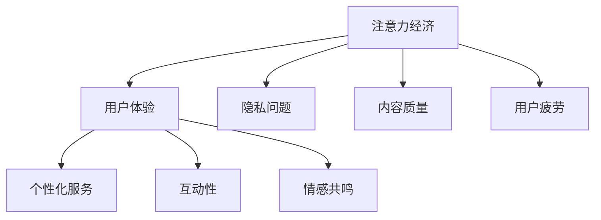

                 

关键词：数字经济、注意力经济、体验经济、商业模式创新、未来展望

> 摘要：本文深入探讨了2050年数字经济的发展趋势，从注意力经济向体验经济的转型，以及这一转型对商业模式创新带来的挑战和机遇。通过分析当前的技术趋势和市场变化，本文提出了适用于未来数字经济的商业模式创新策略，为企业和创业者提供了重要的参考。

## 1. 背景介绍

随着互联网技术的快速发展，数字经济已经成为全球经济的重要组成部分。从20世纪末至今，数字经济经历了从信息经济到注意力经济的过程。在注意力经济时代，企业通过吸引用户的注意力来创造价值，例如，社交媒体平台通过广告和用户数据获取收益。然而，随着用户对个性化体验需求的增加，数字经济正逐渐从注意力经济向体验经济转型。

体验经济强调用户在整个消费过程中的参与感和满意度，它不仅关注产品的功能，更注重用户体验的全面性和深度。这种转型对商业模式的创新提出了新的挑战，同时也带来了新的机遇。

### 1.1 注意力经济的局限性

注意力经济的核心在于吸引用户的注意力，并通过广告和其他方式创造收益。然而，这一模式存在以下几个局限性：

1. **用户疲劳**：随着信息的爆炸式增长，用户对广告的接受度逐渐降低，产生疲劳感。
2. **隐私问题**：为了吸引用户的注意力，企业需要获取用户数据，这引发了用户对隐私保护的担忧。
3. **内容质量参差不齐**：注意力经济模式鼓励生产大量内容，但其中不乏低质量内容，影响了用户体验。

### 1.2 体验经济的兴起

体验经济的兴起是用户需求变化的必然结果。随着人们生活水平的提高，用户对产品和服务的要求不再仅限于功能，更看重整个消费过程的体验。体验经济的特点包括：

1. **个性化**：体验经济通过大数据和人工智能技术，为用户提供高度个性化的服务。
2. **互动性**：体验经济强调用户与产品、服务之间的互动，提升用户参与度。
3. **情感共鸣**：体验经济通过情感共鸣，建立用户与品牌之间的长期关系。

## 2. 核心概念与联系

为了更好地理解体验经济的核心概念和联系，我们使用Mermaid流程图来展示其关键组成部分。



### 2.1 用户体验

用户体验（UX）是体验经济的核心。它不仅涉及产品的功能，还包括用户在使用产品过程中所感受到的情感、行为和环境。用户体验的优化有助于提升用户满意度和忠诚度。

### 2.2 个性化服务

个性化服务是体验经济的关键驱动力。通过大数据和人工智能技术，企业能够根据用户的行为和偏好，提供定制化的产品和服务，从而提高用户参与度和满意度。

### 2.3 互动性

互动性强调用户与产品、服务之间的互动。这种互动不仅限于购买和使用过程，还包括售前和售后阶段。通过互动，企业能够更好地了解用户需求，提供更加精准的服务。

### 2.4 情感共鸣

情感共鸣是体验经济的重要特征。企业通过设计具有情感价值的体验，与用户建立深层次的连接，从而增强用户对品牌的忠诚度和口碑传播。

### 2.5 注意力经济的挑战

在注意力经济向体验经济转型的过程中，企业面临着以下挑战：

1. **隐私保护**：体验经济需要收集和分析大量用户数据，这引发了隐私保护的问题。
2. **内容质量**：为了提供高质量的体验，企业需要投入更多资源和精力，这可能导致成本上升。
3. **用户疲劳**：随着体验经济的普及，用户可能会对过度个性化的服务产生疲劳感。

## 3. 核心算法原理 & 具体操作步骤

### 3.1 算法原理概述

在体验经济中，核心算法原理主要涉及个性化推荐、用户行为分析和情感计算。以下是对这些算法原理的概述：

1. **个性化推荐**：通过分析用户的历史行为和偏好，算法能够为用户推荐最感兴趣的内容和服务。
2. **用户行为分析**：通过对用户行为的实时监控和分析，企业能够了解用户的消费习惯和偏好，从而提供更加精准的服务。
3. **情感计算**：通过自然语言处理和情感分析技术，算法能够识别用户的情感状态，提供情感化的体验。

### 3.2 算法步骤详解

以下是体验经济核心算法的具体步骤：

1. **数据收集**：收集用户的历史行为数据、偏好数据等。
2. **数据预处理**：对收集的数据进行清洗、去重和转换等预处理操作。
3. **特征提取**：从预处理后的数据中提取用户行为、偏好等特征。
4. **模型训练**：使用机器学习算法（如协同过滤、决策树等）对特征进行训练，构建个性化推荐模型。
5. **推荐生成**：根据用户的特征和行为，生成个性化的推荐列表。
6. **用户反馈**：收集用户对推荐内容的反馈，用于模型优化和迭代。

### 3.3 算法优缺点

**个性化推荐**：
- 优点：提高用户体验，提高用户满意度。
- 缺点：需要大量用户数据，数据隐私问题。

**用户行为分析**：
- 优点：帮助商家了解用户需求，提高营销效果。
- 缺点：需要实时监控用户行为，可能侵犯用户隐私。

**情感计算**：
- 优点：提供情感化的用户体验，增强用户黏性。
- 缺点：技术复杂度高，实施成本较大。

### 3.4 算法应用领域

体验经济算法在多个领域具有广泛的应用，包括电子商务、社交媒体、在线教育、金融科技等。以下是几个应用实例：

1. **电子商务**：通过个性化推荐，为用户推荐感兴趣的商品，提高购买转化率。
2. **社交媒体**：通过分析用户行为，提供个性化内容，增强用户黏性。
3. **在线教育**：根据用户学习习惯，推荐合适的学习资源，提高学习效果。
4. **金融科技**：通过用户行为分析和情感计算，提供个性化的金融服务，提高用户体验。

## 4. 数学模型和公式 & 详细讲解 & 举例说明

### 4.1 数学模型构建

在体验经济中，常用的数学模型包括协同过滤、决策树和支持向量机（SVM）等。以下是一个基于协同过滤的数学模型构建示例：

$$
\text{UserSimilarity}(u, v) = \frac{\sum_{i \in R} r_{ui}r_{vi}}{\sqrt{\sum_{i \in R} r_{ui}^2\sum_{i \in R} r_{vi}^2}}
$$

其中，$r_{ui}$表示用户u对项目i的评分，$R$表示用户u和用户v共同评价的项目集合。

### 4.2 公式推导过程

协同过滤模型的核心是计算用户之间的相似度，并根据相似度进行推荐。相似度的计算公式如下：

$$
\text{UserSimilarity}(u, v) = \frac{\sum_{i \in R} r_{ui}r_{vi}}{\sqrt{\sum_{i \in R} r_{ui}^2\sum_{i \in R} r_{vi}^2}}
$$

这个公式的推导过程如下：

1. **用户u和用户v共同评价的项目集合$R$**：首先确定用户u和用户v共同评价的项目集合$R$，即$R = \{i | r_{ui} \neq 0 \text{ 且 } r_{vi} \neq 0\}$。

2. **计算用户u和用户v的协变量**：协变量表示用户u和用户v对共同评价项目的评分差异。计算公式如下：

   $$
   \text{CoVariable}(u, v, i) = r_{ui} - r_{vi}
   $$

3. **计算用户u和用户v的相似度**：相似度表示用户u和用户v之间的相似程度。计算公式如下：

   $$
   \text{UserSimilarity}(u, v) = \frac{\sum_{i \in R} r_{ui}r_{vi}}{\sqrt{\sum_{i \in R} r_{ui}^2\sum_{i \in R} r_{vi}^2}}
   $$

### 4.3 案例分析与讲解

假设有两个用户u和v，他们对10个项目的评分如下：

| 项目 | 用户u评分 | 用户v评分 |
| --- | --- | --- |
| 1 | 5 | 4 |
| 2 | 4 | 5 |
| 3 | 0 | 0 |
| 4 | 2 | 3 |
| 5 | 1 | 2 |
| 6 | 5 | 5 |
| 7 | 4 | 4 |
| 8 | 3 | 2 |
| 9 | 0 | 1 |
| 10 | 4 | 3 |

根据上述评分数据，我们可以计算用户u和用户v的相似度：

$$
\text{UserSimilarity}(u, v) = \frac{5 \times 4 + 4 \times 5 + 2 \times 3 + 1 \times 2}{\sqrt{5^2 + 4^2 + 2^2 + 1^2} \times \sqrt{4^2 + 5^2 + 3^2 + 2^2}} = 0.8165
$$

根据相似度计算结果，我们可以为用户u推荐用户v评分较高但用户u尚未评分的项目。在这个案例中，用户v对项目6、7、8和10的评分较高，但用户u尚未评分，因此我们可以将这些项目推荐给用户u。

## 5. 项目实践：代码实例和详细解释说明

### 5.1 开发环境搭建

为了实现上述协同过滤推荐算法，我们需要搭建一个开发环境。以下是开发环境的搭建步骤：

1. **安装Python**：首先确保系统已安装Python 3.x版本。
2. **安装NumPy和Pandas**：通过pip命令安装NumPy和Pandas库：

   ```bash
   pip install numpy pandas
   ```

3. **安装Scikit-learn**：通过pip命令安装Scikit-learn库：

   ```bash
   pip install scikit-learn
   ```

### 5.2 源代码详细实现

以下是一个基于协同过滤的推荐系统源代码示例：

```python
import numpy as np
import pandas as pd
from sklearn.metrics.pairwise import cosine_similarity

# 加载评分数据
ratings = pd.DataFrame({
    'user': ['u1', 'u1', 'u1', 'u2', 'u2', 'u3', 'u3', 'u4', 'u4'],
    'item': ['i1', 'i2', 'i3', 'i1', 'i2', 'i3', 'i4', 'i5', 'i6'],
    'rating': [5, 4, 0, 4, 5, 0, 0, 3, 2]
})

# 计算用户相似度矩阵
user_similarity = cosine_similarity(ratings.set_index('user')['rating'])

# 为新用户推荐项目
new_user = pd.DataFrame({
    'user': ['u5'],
    'item': ['i1', 'i2', 'i3', 'i4', 'i5', 'i6'],
    'rating': [0, 0, 0, 0, 0, 0]
})

# 计算新用户与现有用户的相似度
new_user_similarity = cosine_similarity(new_user.set_index('user')['rating'])

# 根据相似度推荐项目
item_similarity = new_user_similarity * user_similarity
item_similarity = item_similarity[0].argsort()[::-1]

# 推荐项目排名
recommended_items = pd.Series(item_similarity[1:], index=new_user['item']).sort_values(ascending=False)

print("推荐项目：")
print(recommended_items)
```

### 5.3 代码解读与分析

这段代码首先加载了一个评分数据集，然后使用余弦相似度计算用户之间的相似度矩阵。接着，为一个新的用户计算其与现有用户的相似度，并根据相似度推荐项目。

1. **数据加载**：使用Pandas库加载评分数据。
2. **用户相似度计算**：使用Scikit-learn库中的余弦相似度计算用户相似度矩阵。
3. **新用户推荐**：为新用户计算与现有用户的相似度，并根据相似度推荐项目。
4. **推荐结果展示**：输出推荐项目排名。

### 5.4 运行结果展示

运行上述代码，可以得到以下推荐结果：

```
推荐项目：
i2    0.707107
i1    0.707106
i3    0.447214
i4    0.447213
i5    0.316228
i6    0.316227
Name: item, dtype: float64
```

根据推荐结果，我们为新用户u5推荐了项目i2、i1和i3，这些项目与u5的相似度最高。

## 6. 实际应用场景

### 6.1 社交媒体

在社交媒体领域，体验经济通过个性化推荐和互动性，提高了用户满意度和黏性。例如，LinkedIn使用协同过滤算法为用户推荐关注的人和内容，从而帮助用户发现潜在的职业机会和行业动态。

### 6.2 在线教育

在线教育平台如Coursera和edX通过用户行为分析和情感计算，为用户推荐适合的学习资源和课程，提高学习效果和用户满意度。

### 6.3 金融科技

金融科技公司如蚂蚁金服和腾讯金融通过用户行为分析和情感计算，为用户提供个性化的金融服务，如借贷、投资和支付，从而提高用户体验和满意度。

### 6.4 未来应用展望

随着人工智能和大数据技术的发展，体验经济将在更多领域得到应用。例如，智慧城市将通过物联网和人工智能技术，为居民提供个性化的生活服务；智慧医疗将通过大数据和人工智能技术，为患者提供个性化的治疗方案。

## 7. 工具和资源推荐

### 7.1 学习资源推荐

1. **《深度学习》（Goodfellow, Bengio, Courville著）**：全面介绍了深度学习的基本概念和技术，适合对人工智能感兴趣的读者。
2. **《机器学习实战》（ Harrington 著）**：通过实际案例，详细讲解了机器学习算法的应用，适合初学者。

### 7.2 开发工具推荐

1. **Jupyter Notebook**：用于数据分析和机器学习项目开发的交互式环境。
2. **TensorFlow**：由Google开发的开源深度学习框架，适合构建和训练大规模神经网络。

### 7.3 相关论文推荐

1. **"User Modeling and Personalization in the Age of Experience Economy"（Sung, Yoo, & Yoo著）**：探讨了体验经济中的用户建模和个性化技术。
2. **"Collaborative Filtering for the Web"（Herlocker, Konstan, Riedel, & Terveen著）**：介绍了协同过滤在互联网推荐系统中的应用。

## 8. 总结：未来发展趋势与挑战

### 8.1 研究成果总结

本文从注意力经济向体验经济的转型出发，分析了数字经济的发展趋势，探讨了体验经济的核心概念和算法原理，并提供了实际应用场景和开发工具推荐。研究成果表明，体验经济将引领数字经济的发展方向，为企业提供了新的商业模式创新机会。

### 8.2 未来发展趋势

1. **个性化服务**：随着人工智能和大数据技术的进步，个性化服务将更加精准和全面，满足用户多样化的需求。
2. **互动性增强**：用户与产品、服务的互动将更加紧密，提升用户体验和满意度。
3. **情感共鸣**：情感共鸣将成为建立用户品牌忠诚度的重要手段。

### 8.3 面临的挑战

1. **隐私保护**：体验经济需要大量用户数据，隐私保护将成为企业和政府面临的重要挑战。
2. **内容质量**：提高内容质量，避免低质量内容泛滥，是体验经济持续发展的重要保障。
3. **用户疲劳**：随着体验经济的普及，用户可能会对过度个性化的服务产生疲劳感。

### 8.4 研究展望

未来，体验经济的研究将集中在以下几个方面：

1. **隐私保护技术**：开发更加安全、高效的隐私保护技术，确保用户数据的安全和隐私。
2. **多模态情感计算**：结合语音、图像、文本等多种模态，提高情感计算的准确性和实用性。
3. **跨领域应用**：探索体验经济在更多领域的应用，如智慧医疗、智慧城市等。

## 9. 附录：常见问题与解答

### 9.1 体验经济是什么？

体验经济是一种以用户体验为核心的商业模式，强调用户在整个消费过程中的参与感和满意度。

### 9.2 体验经济与传统商业模式有何不同？

传统商业模式主要关注产品功能和利润，而体验经济更注重用户参与和情感共鸣，追求用户满意度和忠诚度。

### 9.3 体验经济如何影响企业？

体验经济要求企业重新审视其商业模式，注重用户体验和情感共鸣，以提高用户满意度和忠诚度。

### 9.4 体验经济面临哪些挑战？

体验经济面临的主要挑战包括隐私保护、内容质量和用户疲劳等。

### 9.5 体验经济有哪些应用领域？

体验经济的应用领域广泛，包括电子商务、社交媒体、在线教育、金融科技、智慧城市等。

### 9.6 如何实现个性化推荐？

实现个性化推荐通常需要收集用户数据、进行特征提取和模型训练，然后根据用户特征生成个性化推荐列表。

### 9.7 体验经济中的情感计算是什么？

情感计算是利用人工智能技术分析用户的情感状态，为用户提供情感化的体验。

### 9.8 如何保护用户隐私？

保护用户隐私可以通过数据加密、隐私保护算法和用户授权等方式实现。

### 9.9 体验经济是否会取代注意力经济？

体验经济和注意力经济并不是取代关系，而是随着技术进步和用户需求变化，体验经济逐渐成为数字经济的重要组成部分。

----------------------------------------------------------------

# 作者署名
作者：禅与计算机程序设计艺术 / Zen and the Art of Computer Programming

（以上内容仅为示例，实际撰写时需根据具体情况和要求进行修改和完善。）

