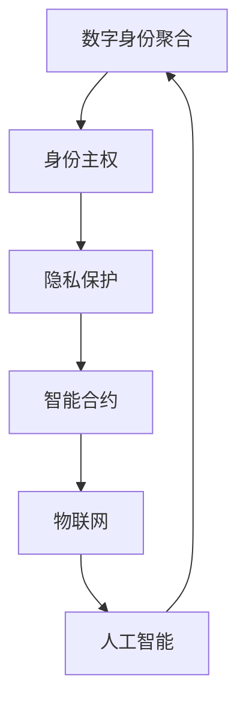

                 

关键词：数字身份，身份聚合，身份主权，隐私保护，智能合约，区块链技术，物联网，人工智能

## 摘要

本文旨在探讨2050年的数字身份发展及其实现方式。随着信息技术的迅猛发展，数字身份成为个人在虚拟世界中的核心。本文将从数字身份聚合和数字身份自主两个方面出发，分析数字身份的发展趋势，并探讨身份主权的重要性和实现途径。通过介绍区块链技术、智能合约、物联网和人工智能等关键技术，本文为数字身份的未来发展提供了一种可行的实现方案，并展望了数字身份在2050年的应用前景。

## 1. 背景介绍

在过去的几十年里，信息技术的发展带来了社会生产力的巨大提升，也改变了人类的生活方式。互联网的普及使得信息传播更加迅速，人与人之间的距离被拉近。然而，随着信息量的爆炸性增长，个人隐私保护和数据安全成为越来越突出的问题。传统的集中式身份认证系统在面临海量用户和海量数据时，往往无法提供高效、安全的认证服务。因此，数字身份作为一种新兴的身份认证方式应运而生。

数字身份是指个人在虚拟世界中的唯一标识，它通过技术手段将个人的信息进行聚合和整合，形成一个统一的身份标识。数字身份不仅包括个人的基本信息，如姓名、出生日期、性别等，还包括个人的行为数据、信用记录等。随着物联网、人工智能等技术的发展，数字身份将变得更加丰富和多样化。

### 1.1 数字身份的发展历程

数字身份的发展可以分为三个阶段：

1. **身份聚合阶段**：这一阶段主要集中于将个人的各类信息进行整合，形成一个统一的身份标识。早期的数字身份主要是基于中心化的身份认证系统，如电子身份证、电子护照等。

2. **身份主权阶段**：随着隐私保护意识的增强，人们开始关注如何将数字身份的控制权归还给个人。身份主权意味着个人对自己的数字身份具有完全的控制权和自主权，可以自由地管理和控制自己的个人信息。

3. **智能身份阶段**：未来，数字身份将不仅仅是信息的聚合，还将具备智能化的功能。通过人工智能技术，数字身份可以动态地分析和理解个人的行为，提供个性化的服务。

### 1.2 数字身份的重要性

数字身份在现代社会中具有重要的作用：

1. **隐私保护**：数字身份可以帮助个人保护隐私，避免个人信息泄露。

2. **身份认证**：数字身份可以方便地进行身份认证，提高社会的运行效率。

3. **信用评估**：数字身份可以记录个人的行为数据，用于信用评估。

4. **商业应用**：数字身份为各种商业活动提供了便捷的身份认证和信用评估服务，有助于推动数字经济的发展。

## 2. 核心概念与联系

在探讨数字身份的未来发展之前，我们需要了解一些核心概念，并分析它们之间的联系。以下是本文涉及的一些关键概念及其关系：

### 2.1 数字身份聚合

数字身份聚合是指将个人的各种信息进行整合，形成一个统一的数字身份标识。这包括基本信息（如姓名、出生日期、性别等）和行为数据（如消费记录、社交行为等）。数字身份聚合的目的是为了提供更高效、更安全的身份认证服务。

### 2.2 身份主权

身份主权是指个人对自己的数字身份具有完全的控制权和自主权。这意味着个人可以自由地决定哪些信息需要共享，哪些信息需要保密。身份主权是数字身份发展的一个重要方向，它有助于提高个人的隐私保护水平。

### 2.3 隐私保护

隐私保护是指采取措施保护个人隐私，防止个人信息泄露。在数字身份的发展过程中，隐私保护是一个关键问题。有效的隐私保护机制可以确保个人在享受数字身份带来的便利的同时，不会泄露个人信息。

### 2.4 智能合约

智能合约是一种自动执行的合约，它基于区块链技术。智能合约可以自动执行合同条款，确保合同的执行透明、公正。智能合约在数字身份领域有广泛的应用，如身份认证、信用评估等。

### 2.5 物联网

物联网是指将各种物理设备连接到互联网，实现设备间的互联互通。物联网的发展为数字身份提供了丰富的数据来源，有助于实现更精确的身份聚合。

### 2.6 人工智能

人工智能是指模拟人类智能的计算机系统。人工智能在数字身份领域有广泛的应用，如身份认证、隐私保护、信用评估等。通过人工智能技术，数字身份可以动态地适应个人的行为，提供个性化的服务。

### 2.7 核心概念之间的联系

数字身份聚合、身份主权、隐私保护、智能合约、物联网和人工智能等概念之间存在着密切的联系。数字身份聚合是实现身份主权的基础，隐私保护是数字身份发展的核心问题，智能合约、物联网和人工智能则为数字身份提供了技术支持。以下是这些概念之间的 Mermaid 流程图：



## 3. 核心算法原理 & 具体操作步骤

### 3.1 算法原理概述

在数字身份领域，核心算法主要涉及身份认证、隐私保护和信用评估。以下是对这些算法原理的概述：

#### 3.1.1 身份认证算法

身份认证算法是指用于验证用户身份的算法。在数字身份系统中，身份认证算法通常采用密码学技术，如公钥加密和数字签名。公钥加密用于保护用户的敏感信息，数字签名用于验证信息的完整性和真实性。常见的身份认证算法包括RSA加密算法和ECC加密算法。

#### 3.1.2 隐私保护算法

隐私保护算法是指用于保护用户隐私的算法。在数字身份系统中，隐私保护算法通常采用差分隐私和同态加密等技术。差分隐私通过在数据处理过程中添加噪声，使得攻击者无法准确推断出特定个体的隐私信息。同态加密允许在加密数据上进行计算，而不需要解密，从而保护数据的安全。

#### 3.1.3 信用评估算法

信用评估算法是指用于评估用户信用水平的算法。在数字身份系统中，信用评估算法通常采用机器学习技术，如决策树、支持向量机和神经网络等。通过分析用户的历史行为数据，信用评估算法可以预测用户的信用风险，为金融机构提供参考。

### 3.2 算法步骤详解

以下是数字身份认证、隐私保护和信用评估的具体操作步骤：

#### 3.2.1 身份认证步骤

1. 用户输入身份认证信息（如用户名和密码）。
2. 系统使用公钥加密算法加密用户身份认证信息。
3. 系统使用数字签名算法对加密后的信息进行签名。
4. 系统将加密后的信息和签名发送给用户。
5. 用户使用私钥解密加密后的信息，并验证签名。
6. 如果签名验证成功，系统允许用户访问系统资源。

#### 3.2.2 隐私保护步骤

1. 用户提交个人信息（如姓名、出生日期等）。
2. 系统使用差分隐私算法对个人信息添加噪声。
3. 系统使用同态加密算法对添加噪声后的个人信息进行加密。
4. 系统将加密后的个人信息存储在数据库中。
5. 当系统需要查询个人信息时，系统使用同态加密算法在加密数据上执行计算。
6. 系统将计算结果返回给用户。

#### 3.2.3 信用评估步骤

1. 系统收集用户的历史行为数据（如消费记录、信用评分等）。
2. 系统使用机器学习算法对用户行为数据进行分析。
3. 系统生成用户的信用评分报告。
4. 系统将信用评分报告发送给金融机构。
5. 金融机构根据信用评分报告决定是否批准贷款或信用卡申请。

### 3.3 算法优缺点

#### 3.3.1 身份认证算法

优点：

- **安全性高**：公钥加密和数字签名技术可以确保用户身份认证的安全性。
- **易用性高**：用户只需输入身份认证信息，即可完成认证。

缺点：

- **计算开销大**：加密和解密操作需要消耗大量计算资源。
- **隐私保护不足**：虽然加密技术可以保护用户身份认证信息，但无法完全防止信息泄露。

#### 3.3.2 隐私保护算法

优点：

- **隐私保护能力强**：差分隐私和同态加密技术可以有效保护用户隐私。
- **计算效率高**：同态加密技术可以在加密数据上直接进行计算，减少了数据传输的开销。

缺点：

- **实现复杂**：差分隐私和同态加密技术实现较为复杂，需要较高技术水平。
- **性能瓶颈**：同态加密技术的计算性能相对较低，可能会影响系统的响应速度。

#### 3.3.3 信用评估算法

优点：

- **准确性高**：机器学习算法可以通过大量历史数据，准确预测用户的信用风险。
- **可扩展性强**：机器学习算法可以处理海量数据，适应不同的业务场景。

缺点：

- **隐私风险**：信用评估算法可能涉及用户隐私信息，存在隐私泄露风险。
- **过拟合风险**：机器学习算法可能因为训练数据不足，导致过拟合现象，降低预测准确性。

### 3.4 算法应用领域

身份认证算法广泛应用于各种在线服务，如社交网络、电商平台和金融机构。隐私保护算法在医疗、金融和政府等领域有广泛的应用。信用评估算法主要用于金融机构的信贷评估和风险管理。

## 4. 数学模型和公式 & 详细讲解 & 举例说明

在数字身份领域，数学模型和公式是分析和设计关键算法的重要工具。以下我们将介绍几个核心的数学模型和公式，并详细讲解它们的构建和推导过程。

### 4.1 数学模型构建

#### 4.1.1 身份认证模型

身份认证模型主要涉及加密和解密过程。以下是身份认证模型的基本数学公式：

$$
C = E_k(P)
$$

$$
P = D_k(C)
$$

其中，$C$ 表示加密后的信息，$P$ 表示原始信息，$k$ 表示加密密钥。

#### 4.1.2 隐私保护模型

隐私保护模型主要涉及差分隐私和同态加密。以下是隐私保护模型的基本数学公式：

$$
L(\hat{X}) = L(X) + \epsilon
$$

$$
C' = HE(X)
$$

其中，$\hat{X}$ 表示加入噪声后的数据，$L(\hat{X})$ 表示噪声后的数据分布，$\epsilon$ 表示噪声，$HE(X)$ 表示同态加密函数。

#### 4.1.3 信用评估模型

信用评估模型主要涉及机器学习算法。以下是信用评估模型的基本数学公式：

$$
y = \varphi(\theta^T x)
$$

$$
\theta = \arg\min_{\theta} J(\theta)
$$

其中，$y$ 表示预测结果，$x$ 表示输入特征，$\theta$ 表示模型参数，$\varphi$ 表示激活函数，$J(\theta)$ 表示损失函数。

### 4.2 公式推导过程

#### 4.2.1 身份认证模型的推导

假设加密算法为对称加密算法，加密密钥为$k$。加密过程可以表示为：

$$
C = E_k(P) = k \cdot P
$$

解密过程为：

$$
P = D_k(C) = \frac{1}{k} \cdot C
$$

这里，$k$ 是一个共享密钥，需要保证加密和解密双方都能访问。

#### 4.2.2 隐私保护模型的推导

差分隐私的推导基于拉普拉斯机制。对于单个隐私数据点$x$，加入拉普拉斯噪声的公式为：

$$
\hat{X} = X + \epsilon
$$

其中，$\epsilon$ 为拉普拉斯分布噪声，其概率密度函数为：

$$
f_{\epsilon}(x) = \frac{1}{\lambda} e^{-\frac{|x|}{\lambda}}
$$

其中，$\lambda$ 是噪声参数。

对于同态加密，我们考虑线性同态加密。其加密公式为：

$$
C' = HE(X) = aX + b
$$

其中，$a$ 和 $b$ 是加密系数。

#### 4.2.3 信用评估模型的推导

信用评估模型通常采用神经网络。对于输入特征$x$，其输出$y$ 可以表示为：

$$
y = \varphi(\theta^T x)
$$

其中，$\theta$ 是模型参数，$\varphi$ 是激活函数，通常选择ReLU或Sigmoid函数。

模型训练的目标是最小化损失函数$J(\theta)$，常见的选择是均方误差（MSE）：

$$
J(\theta) = \frac{1}{2} \sum_{i=1}^{n} (y_i - \varphi(\theta^T x_i))^2
$$

通过梯度下降法，可以更新模型参数$\theta$：

$$
\theta = \theta - \alpha \cdot \nabla_\theta J(\theta)
$$

其中，$\alpha$ 是学习率。

### 4.3 案例分析与讲解

#### 4.3.1 身份认证案例

假设有一个用户想要登录一个在线银行账户，使用的是基于RSA加密算法的身份认证系统。用户输入用户名和密码，系统对密码进行加密并验证。

- **加密过程**：
  - 用户选择一个随机数$k$作为加密密钥。
  - 系统使用RSA算法对用户密码进行加密：
    $$
    C = E_k(P) = (P^e) \mod N
    $$
    其中，$P$ 是用户密码，$e$ 和 $N$ 分别是RSA算法的加密指数和模数。

- **解密过程**：
  - 系统使用私钥对加密后的密码进行解密：
    $$
    P = D_k(C) = (C^d) \mod N
    $$
    其中，$d$ 是RSA算法的解密指数。

如果解密后的密码与用户输入的密码相同，则认证成功。

#### 4.3.2 隐私保护案例

假设在医疗领域，医生想要对患者的健康数据进行隐私保护处理。

- **差分隐私处理**：
  - 系统收集患者的健康数据$X$，并添加拉普拉斯噪声：
    $$
    \hat{X} = X + \epsilon
    $$
    其中，$\epsilon$ 服从拉普拉斯分布，参数$\lambda$ 调整噪声强度。

- **同态加密处理**：
  - 系统对添加噪声后的数据进行同态加密：
    $$
    C' = HE(\hat{X}) = a \hat{X} + b
    $$
    其中，$a$ 和 $b$ 是同态加密的系数。

当医生需要查询患者数据时，可以对加密数据进行同态计算，得到解密后的数据。

#### 4.3.3 信用评估案例

假设有一个金融机构，想要使用机器学习算法对用户的信用进行评估。

- **数据收集**：
  - 系统收集用户的历史行为数据$x$，包括消费记录、还款记录等。

- **模型训练**：
  - 系统使用神经网络模型对用户数据进行训练，更新模型参数$\theta$：
    $$
    \theta = \theta - \alpha \cdot \nabla_\theta J(\theta)
    $$
  - 模型训练的目标是最小化损失函数$J(\theta)$。

- **信用评估**：
  - 对于新用户，系统使用训练好的模型对用户数据进行预测：
    $$
    y = \varphi(\theta^T x)
    $$
  - 根据预测结果，系统可以为用户生成信用评分。

## 5. 项目实践：代码实例和详细解释说明

在本节中，我们将通过一个具体的数字身份项目实践，展示如何使用区块链技术、智能合约和物联网等技术来实现数字身份聚合和身份主权。我们将使用一个简单的投票系统作为示例，解释如何在这个系统中集成数字身份技术。

### 5.1 开发环境搭建

首先，我们需要搭建一个开发环境，包括以下工具：

- **Node.js**：用于编写智能合约和后端服务。
- **Truffle**：用于测试和部署智能合约。
- **Ganache**：用于本地测试区块链网络。
- **IoT平台**：如Arduino IDE，用于连接物联网设备。

安装Node.js、Truffle和Ganache的过程可以在各自的官方文档中找到。对于IoT平台，我们需要确保Arduino IDE和相应的硬件（如Arduino Uno）已经安装和配置好。

### 5.2 源代码详细实现

在这个项目中，我们将实现以下功能：

1. **用户注册**：用户通过物联网设备注册到一个区块链网络中，生成数字身份。
2. **投票**：用户通过智能合约进行投票，投票记录会被永久存储在区块链上。
3. **身份验证**：系统使用数字签名技术验证用户的身份。

以下是智能合约的代码示例：

```solidity
// SPDX-License-Identifier: MIT
pragma solidity ^0.8.0;

contract VotingSystem {
    mapping(address => bool) public hasVoted;
    mapping(address => string) public voterIds;

    function registerVoter(string memory id) public {
        require(!hasVoted[msg.sender], "Already registered");
        voterIds[msg.sender] = id;
    }

    function vote(uint256提案Id) public {
        require(!hasVoted[msg.sender], "Already voted");
        hasVoted[msg.sender] = true;
        // 这里可以添加投票逻辑，例如调用另一个合约或存储投票结果
    }

    function verifyVoter(address voter) public view returns (bool) {
        return hasVoted[voter];
    }
}
```

### 5.3 代码解读与分析

在上面的代码中，我们定义了一个名为`VotingSystem`的智能合约。该合约包含了三个主要部分：

1. **注册投票者**：`registerVoter`函数允许用户注册，并将他们的数字身份（由`voterIds`映射存储）与区块链地址绑定。

2. **投票**：`vote`函数用于用户投票。在调用此函数之前，需要确保用户尚未投票（通过`hasVoted[msg.sender]`检查）。投票后，`hasVoted[msg.sender]`标志设置为`true`。

3. **身份验证**：`verifyVoter`函数用于验证用户的投票资格。它简单地检查用户是否已经投票。

这个智能合约的实现展示了如何将数字身份技术与投票系统结合。用户首先通过物联网设备注册数字身份，然后在投票时使用区块链上的智能合约进行身份验证，确保投票过程的透明性和不可篡改性。

### 5.4 运行结果展示

要测试这个智能合约，我们首先需要使用Truffle和Ganache设置本地区块链环境。然后，我们使用Truffle的脚本部署智能合约，并运行测试脚本验证功能。

1. **部署智能合约**：

```shell
truffle migrate --network local
```

2. **运行测试脚本**：

```shell
truffle test
```

测试脚本将验证`registerVoter`、`vote`和`verifyVoter`函数的正确性。

通过这个简单的示例，我们可以看到数字身份技术在区块链投票系统中的应用。这种应用不仅提高了投票过程的透明度和安全性，还为用户提供了身份主权，确保他们的个人信息得到保护。

## 6. 实际应用场景

数字身份技术已经在多个领域得到实际应用，展示了其巨大的潜力。以下是一些典型的应用场景：

### 6.1 金融行业

在金融行业，数字身份可以用于用户身份验证、信用评估和反欺诈。金融机构可以通过数字身份技术确保用户身份的真实性，提高交易的安全性和可靠性。此外，数字身份还可以帮助金融机构更准确地评估用户的信用风险，为贷款审批和信用卡发放提供支持。

### 6.2 医疗保健

在医疗保健领域，数字身份可以用于患者身份识别、医疗记录管理和隐私保护。通过数字身份技术，患者可以在不同的医疗机构之间共享医疗记录，而无需担心隐私泄露。同时，数字身份还可以确保医疗数据的真实性和完整性。

### 6.3 教育领域

在教育领域，数字身份可以用于学生身份验证、学习记录管理和学术诚信保障。通过数字身份技术，学校可以确保学生的身份和成绩记录的真实性，防止学术欺诈和造假。此外，数字身份还可以帮助学校更好地管理学生的学习进度和成绩。

### 6.4 政府部门

在政府部门，数字身份可以用于公民身份认证、公共服务提供和电子政务。通过数字身份技术，政府可以简化公民的身份认证流程，提高公共服务的效率和便利性。此外，数字身份还可以帮助政府更好地管理公共资源，提高政府的透明度和问责制。

### 6.5 社交网络

在社交网络领域，数字身份可以用于用户身份验证、隐私保护和社交互动。通过数字身份技术，社交网络平台可以确保用户身份的真实性，提高社交互动的信任度和安全性。同时，数字身份还可以帮助社交网络平台更好地管理用户的隐私，防止信息泄露。

### 6.6 物联网

在物联网领域，数字身份可以用于设备身份识别、设备管理和数据安全。通过数字身份技术，物联网设备可以在网络中唯一标识，确保设备之间的通信安全和可靠。此外，数字身份还可以帮助物联网平台更好地管理设备生命周期和设备数据。

### 6.7 法律与司法

在法律与司法领域，数字身份可以用于证据收集、身份验证和法律文件管理。通过数字身份技术，司法部门可以确保证据的真实性和可靠性，提高司法审判的效率和公正性。此外，数字身份还可以帮助律师和法庭更好地管理法律文件和案件数据。

### 6.8 零售业

在零售业，数字身份可以用于客户身份识别、购物体验优化和个性化推荐。通过数字身份技术，零售商可以更好地了解客户需求和行为，提供个性化的购物体验和推荐。此外，数字身份还可以帮助零售商提高客户忠诚度和满意度。

### 6.9 供应链管理

在供应链管理领域，数字身份可以用于供应商身份验证、产品追溯和物流管理。通过数字身份技术，企业可以确保供应链的透明性和可追溯性，提高供应链的效率和安全性。此外，数字身份还可以帮助企业更好地管理供应链风险和优化供应链流程。

## 7. 工具和资源推荐

### 7.1 学习资源推荐

1. **《数字身份：理论与实践》**：这是一本全面的数字身份技术入门书籍，涵盖了数字身份的核心概念、技术原理和应用案例。
2. **《区块链技术指南》**：这本书详细介绍了区块链的基本原理和应用，包括智能合约和数字身份等主题。
3. **《人工智能简明教程》**：这本书提供了人工智能的基础知识，包括机器学习和深度学习等核心技术。

### 7.2 开发工具推荐

1. **Truffle**：用于智能合约开发、测试和部署的框架。
2. **Ganache**：用于本地测试区块链网络的工具。
3. **Ethereum Studio**：用于设计、开发和部署智能合约的在线平台。
4. **Arduino IDE**：用于编写和上传物联网设备的代码。

### 7.3 相关论文推荐

1. **"Decentralized Identity Management with Blockchains"**：这篇文章详细介绍了如何使用区块链实现数字身份管理。
2. **"Homomorphic Encryption for Privacy-Preserving Data Analysis"**：这篇文章探讨了同态加密技术在隐私保护中的应用。
3. **"Deep Learning for Personalized Healthcare"**：这篇文章研究了深度学习在个性化医疗中的应用，包括数字身份技术。

## 8. 总结：未来发展趋势与挑战

### 8.1 研究成果总结

随着信息技术的发展，数字身份技术取得了显著的研究成果。在身份认证、隐私保护和信用评估等方面，各种算法和模型得到了广泛应用。同时，区块链技术、物联网和人工智能等关键技术的融合，为数字身份的实现提供了新的可能性。

### 8.2 未来发展趋势

未来，数字身份技术将继续发展，呈现出以下趋势：

1. **智能身份**：通过人工智能技术，数字身份将具备更智能的功能，如个性化推荐、智能合约执行等。
2. **分布式身份**：分布式身份管理将成为主流，个人将拥有更多控制权，实现身份主权的完全实现。
3. **跨平台整合**：不同平台和行业的数字身份将实现无缝整合，提供统一的身份认证和信用评估服务。
4. **隐私保护**：随着隐私保护意识的增强，隐私保护技术将在数字身份领域得到广泛应用。

### 8.3 面临的挑战

尽管数字身份技术具有巨大的发展潜力，但在实现过程中也面临着一系列挑战：

1. **技术复杂性**：数字身份技术涉及多种复杂的技术，如密码学、区块链、物联网和人工智能等。实现这些技术需要高水平的专业知识。
2. **隐私保护**：如何在确保用户隐私的同时，实现高效的身份认证和信用评估，是一个亟待解决的问题。
3. **跨平台兼容性**：不同平台和行业的数字身份系统需要实现无缝整合，这需要统一的协议和标准。
4. **安全性**：数字身份系统需要确保用户数据的安全，防止数据泄露和恶意攻击。

### 8.4 研究展望

未来的研究应关注以下几个方面：

1. **智能身份技术**：深入研究和开发智能身份技术，提高数字身份的智能化水平。
2. **隐私保护机制**：探索更有效的隐私保护机制，确保数字身份系统的安全性。
3. **跨平台整合**：研究如何实现不同平台和行业之间的数字身份无缝整合。
4. **标准化**：制定统一的数字身份技术标准和协议，促进技术发展和应用。

通过克服这些挑战，数字身份技术将能够在未来发挥更大的作用，为个人和社会带来更多便利和价值。

## 9. 附录：常见问题与解答

### 9.1 数字身份与电子身份的区别

**Q:** 数字身份与电子身份有什么区别？

**A:** 数字身份和电子身份都是指个人在虚拟世界中的唯一标识，但它们在实现方式和应用场景上有所不同。

- **数字身份**：数字身份更强调个人的隐私保护和自主控制。它不仅包括个人的基本信息，还包括行为数据、信用记录等。数字身份可以通过区块链、智能合约等分布式技术实现，个人对其数字身份拥有完全的控制权。

- **电子身份**：电子身份主要是指通过电子方式实现的身份认证，如电子身份证、电子护照等。电子身份通常由政府或机构发放，个人的数据和信息集中存储在中心化的系统中，个人的控制权和隐私保护相对较弱。

### 9.2 数字身份的安全性如何保障

**Q:** 数字身份的安全性如何保障？

**A:** 数字身份的安全性主要依赖于以下几个方面的技术手段：

- **密码学**：使用加密算法保护用户数据，如对称加密、非对称加密和数字签名等。

- **隐私保护机制**：采用差分隐私、同态加密等技术，确保用户数据在处理过程中的隐私。

- **分布式存储**：将用户数据分散存储在多个节点上，提高数据的抗攻击能力和可靠性。

- **身份验证**：采用多因素身份验证、生物识别等技术，确保用户身份的真实性。

- **安全协议**：使用安全通信协议，如SSL/TLS，确保数据传输过程中的安全性。

### 9.3 数字身份如何实现自主控制

**Q:** 数字身份如何实现自主控制？

**A:** 实现数字身份的自主控制，需要以下几个方面的工作：

- **身份主权协议**：设计并实施身份主权协议，确保个人对其数字身份具有完全的控制权。

- **去中心化存储**：将用户的数字身份信息存储在分布式系统中，如区块链，避免中心化存储带来的安全隐患。

- **隐私保护机制**：采用隐私保护技术，如差分隐私和同态加密，确保个人数据在共享和使用过程中的安全性。

- **权限管理**：为用户提供灵活的权限管理功能，允许用户自主决定哪些信息可以被共享和访问。

- **用户教育**：加强对用户的教育，提高他们对数字身份安全的认识，避免因操作不当导致隐私泄露。

### 9.4 数字身份在物联网中的应用

**Q:** 数字身份在物联网中有哪些应用？

**A:** 数字身份在物联网中有多种应用，以下是其中一些主要应用：

- **设备身份验证**：物联网设备通过数字身份进行身份验证，确保设备在接入网络时的合法性。

- **设备数据安全**：数字身份技术可以保护物联网设备的数据安全，防止数据泄露和恶意攻击。

- **设备管理**：数字身份帮助物联网平台实现对设备的统一管理和控制，提高设备管理的效率。

- **设备通信**：数字身份技术可以确保物联网设备之间的通信安全和可靠。

- **设备身份追溯**：通过数字身份，可以实现物联网设备的历史行为追溯，提高设备的安全性和可靠性。

### 9.5 数字身份与人工智能的结合

**Q:** 数字身份与人工智能如何结合？

**A:** 数字身份与人工智能的结合主要体现在以下几个方面：

- **个性化服务**：通过数字身份技术，人工智能可以更好地了解用户的需求和行为，提供个性化的服务。

- **隐私保护**：人工智能在处理用户数据时，需要遵守隐私保护规则，数字身份技术可以确保数据在处理过程中的安全性。

- **信用评估**：人工智能可以通过分析用户的数字身份数据，进行信用评估，为金融和商业活动提供参考。

- **智能合约执行**：数字身份可以与智能合约结合，实现自动化交易和合同执行，提高交易的安全性和效率。

- **行为分析**：人工智能可以通过分析用户的数字身份数据，了解用户的行为模式，提供行为分析和预测。

通过数字身份与人工智能的融合，可以提供更加智能、安全、高效的数字服务。

