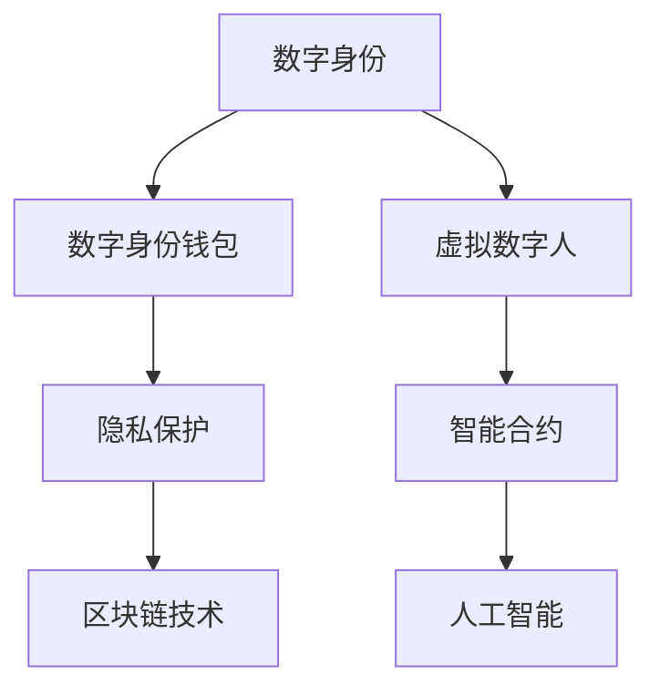

                 

关键词：数字身份、数字钱包、虚拟数字人、身份数字化、隐私保护、智能合约、区块链技术、人工智能。

> 摘要：随着数字经济的迅猛发展，我们的身份正在迅速数字化。到2050年，数字身份将成为我们日常生活不可或缺的一部分。本文将探讨数字身份的演变，从数字身份钱包到虚拟数字人的身份数字化，分析其核心概念、实现原理、应用场景以及未来的发展趋势。

## 1. 背景介绍

### 数字身份的起源与演变

数字身份的起源可以追溯到互联网的诞生。早期的互联网主要是一个信息共享的平台，用户通过用户名和密码进行身份认证。然而，随着互联网的普及和电子商务的发展，传统的身份认证方式逐渐暴露出许多问题。首先，用户名和密码的单一认证方式过于脆弱，容易遭受黑客攻击。其次，用户需要在不同的网站和服务之间重复提供个人信息，既繁琐又不安全。

为了解决这些问题，数字身份的概念开始出现。数字身份是一种通过数字方式代表个人身份的虚拟实体，它不仅包含了个人信息，还通过加密技术确保其安全性和隐私性。随着区块链技术的发展，数字身份逐渐演变为一个分布式、不可篡改的体系。

### 数字身份钱包

数字身份钱包是数字身份的核心载体，它存储和管理用户的数字身份信息。数字身份钱包通常采用非对称加密技术，用户拥有一个公钥和一个私钥。公钥用于验证数字身份，私钥则用于签名交易，确保交易的安全性和隐私性。

数字身份钱包的出现解决了传统身份认证的许多问题。首先，它采用了多重身份认证机制，包括密码、生物识别等多种方式，大大提高了身份认证的安全性。其次，数字身份钱包可以跨平台使用，用户不再需要在不同的网站和服务之间重复提供个人信息。

### 虚拟数字人

虚拟数字人是一种通过人工智能技术模拟人类行为和思维的数字实体。虚拟数字人可以理解自然语言、处理复杂数据、甚至具备自我学习和进化能力。随着数字身份的发展，虚拟数字人逐渐成为一种新的身份形式。

虚拟数字人可以提供个性化的服务，如智能客服、个性化推荐等。同时，虚拟数字人还可以帮助用户处理复杂的任务，如自动填写在线表格、管理个人财务等。虚拟数字人的出现，使得数字身份的交互性和智能化水平得到了极大的提升。

## 2. 核心概念与联系

为了更好地理解数字身份、数字身份钱包和虚拟数字人之间的关系，我们使用Mermaid流程图展示其核心概念和联系。



### 数字身份

数字身份是用户在数字世界的唯一标识，它包含了用户的个人信息、行为数据和信用记录等。数字身份的核心目标是确保用户身份的真实性和唯一性。

### 数字身份钱包

数字身份钱包是存储和管理数字身份信息的工具。它采用了非对称加密技术，确保数字身份信息的安全性和隐私性。数字身份钱包可以跨平台使用，为用户提供便捷的身份认证和管理服务。

### 虚拟数字人

虚拟数字人是一种通过人工智能技术模拟人类行为和思维的数字实体。虚拟数字人可以提供个性化的服务，帮助用户处理复杂的任务。虚拟数字人的核心目标是实现数字身份的智能化和个性化。

### 隐私保护

隐私保护是数字身份体系的重要组成部分。通过区块链技术和智能合约，数字身份信息可以实现分布式存储和访问控制，确保用户隐私得到有效保护。

### 智能合约

智能合约是一种自动执行的合同，它可以在区块链上进行自动化执行。智能合约可以用于实现数字身份的授权、认证和交易等操作，提高数字身份体系的效率和安全性。

### 区块链技术

区块链技术是一种分布式数据库技术，它通过去中心化的方式确保数据的安全性和不可篡改性。区块链技术为数字身份的分布式存储和隐私保护提供了技术支持。

### 人工智能

人工智能技术为数字身份的智能化提供了基础。通过机器学习和自然语言处理等技术，虚拟数字人可以更好地理解用户需求，提供个性化的服务。

## 3. 核心算法原理 & 具体操作步骤

### 3.1 算法原理概述

数字身份的算法原理主要基于非对称加密技术、分布式存储和智能合约。非对称加密技术确保数字身份信息的安全性和隐私性，分布式存储提高数据的安全性和可用性，智能合约实现数字身份的自动化管理和交易。

### 3.2 算法步骤详解

#### 3.2.1 非对称加密技术

非对称加密技术是数字身份体系的核心。用户生成一对公钥和私钥，公钥用于验证数字身份，私钥用于签名交易。

#### 3.2.2 分布式存储

数字身份信息存储在分布式数据库中，确保数据的安全性和可用性。分布式存储通过区块链技术实现，数据在区块链上分布式存储，无法被篡改。

#### 3.2.3 智能合约

智能合约用于实现数字身份的自动化管理和交易。智能合约在区块链上进行部署，当满足特定条件时，智能合约会自动执行相应的操作。

### 3.3 算法优缺点

#### 优点

- **安全性**：非对称加密技术和分布式存储确保数字身份信息的安全性和隐私性。
- **高效性**：智能合约实现数字身份的自动化管理和交易，提高系统的效率和安全性。
- **可扩展性**：分布式存储和区块链技术为数字身份体系提供了良好的可扩展性。

#### 缺点

- **复杂度**：数字身份体系的实现较为复杂，对开发者和用户的要求较高。
- **性能**：分布式存储和智能合约可能导致系统性能下降。

### 3.4 算法应用领域

数字身份算法广泛应用于金融、医疗、教育、电子商务等领域。在金融领域，数字身份可以用于用户认证、交易授权等操作；在医疗领域，数字身份可以用于患者信息管理、病历共享等；在教育领域，数字身份可以用于学生身份认证、成绩管理等。

## 4. 数学模型和公式 & 详细讲解 & 举例说明

### 4.1 数学模型构建

数字身份的数学模型主要包括非对称加密、分布式存储和智能合约三个部分。

#### 4.1.1 非对称加密

非对称加密模型的数学模型如下：

- 公钥加密公式：`c = e^m mod n`
- 私钥解密公式：`m = d^c mod n`

其中，`m`为明文，`c`为密文，`e`和`d`分别为公钥和私钥，`n`为模数。

#### 4.1.2 分布式存储

分布式存储模型的数学模型如下：

- 数据分布：`D = {d1, d2, ..., dn}`
- 数据聚合：`M = ∑(di)`

其中，`D`为数据集，`di`为第`i`个数据节点，`M`为聚合后的数据。

#### 4.1.3 智能合约

智能合约模型的数学模型如下：

- 条件判断：`if condition then action else action`
- 调用合约：`contract call(address, bytes) returns (data)`

其中，`condition`为条件表达式，`action`为操作，`address`为合约地址，`data`为返回值。

### 4.2 公式推导过程

#### 4.2.1 非对称加密

非对称加密的加密和解密过程可以通过数学公式推导如下：

- 加密过程：
  - 选择两个大的质数`p`和`q`，计算`n = p * q`。
  - 选择一个小于`n`且与`(p-1) * (q-1)`互质的整数`e`。
  - 计算`d`，使得`d * e ≡ 1 (mod (p-1) * (q-1))`。
  - 公钥为`(e, n)`，私钥为`(d, n)`。
  - 加密公式：`c = e^m mod n`。
- 解密过程：
  - 解密公式：`m = d^c mod n`。

#### 4.2.2 分布式存储

分布式存储的聚合过程可以通过数学公式推导如下：

- 数据分布：`D = {d1, d2, ..., dn}`，其中每个`di`为数据节点。
- 数据聚合：`M = ∑(di)`，即将所有数据节点的数据相加。

#### 4.2.3 智能合约

智能合约的条件判断和调用过程可以通过数学公式推导如下：

- 条件判断：
  - `if condition then action else action`，其中`condition`为条件表达式，`action`为操作。
- 调用合约：
  - `contract call(address, bytes) returns (data)`，其中`address`为合约地址，`bytes`为调用参数，`data`为返回值。

### 4.3 案例分析与讲解

#### 4.3.1 非对称加密案例

假设用户`Alice`想要向用户`Bob`发送一条加密消息。`Alice`和`Bob`已经通过非对称加密算法生成了一对公钥和私钥。

- Alice的公钥：`(e, n)`，私钥：`(d, n)`。
- Bob的公钥：`(e', n')`，私钥：`(d', n')`。

Alice想要发送消息`m = "Hello, Bob!"`给Bob。

1. Alice使用Bob的公钥加密消息：
   - 密文：`c = e'^m mod n'`。
   - 计算得到：`c = "Hello, Bob!"^e' mod n'`。

2. Alice将密文发送给Bob。

3. Bob使用自己的私钥解密消息：
   - 明文：`m = d'^c mod n'`。
   - 计算得到：`m = "Hello, Bob!"^d' mod n'`。

4. Bob收到解密后的消息：`"Hello, Bob!"`。

#### 4.3.2 分布式存储案例

假设有一个分布式数据库，包含以下数据节点：

- 数据节点1：`d1 = {user1, data1}`
- 数据节点2：`d2 = {user2, data2}`
- 数据节点3：`d3 = {user3, data3}`

我们需要将这三个数据节点聚合为一个完整的数据集。

1. 数据聚合：
   - 聚合后的数据集：`M = d1 + d2 + d3`。
   - 计算得到：`M = {user1, data1} + {user2, data2} + {user3, data3}`。

2. 最终数据集：`M = {user1, data1, user2, data2, user3, data3}`。

#### 4.3.3 智能合约案例

假设有一个智能合约，用于实现一个简单的投票系统。

1. 条件判断：
   - 条件表达式：`if user1 == "Alice" then vote = "Yes" else vote = "No"`。

2. 调用合约：
   - 合约地址：`0x1234567890123456789012345678901234567890`。
   - 调用参数：`{"user": "Alice", "vote": "Yes"}`。

3. 返回值：
   - 返回数据：`{"status": "voted", "result": "Yes"}`。

## 5. 项目实践：代码实例和详细解释说明

### 5.1 开发环境搭建

为了实现数字身份钱包和虚拟数字人，我们需要搭建一个开发环境。以下是搭建步骤：

1. 安装Node.js和npm：从官网下载并安装Node.js，npm是Node.js的包管理器。
2. 安装智能合约开发工具：使用npm安装Truffle，Truffle是一个智能合约开发框架。
3. 安装区块链节点：使用npm安装Ganache，Ganache是一个本地区块链节点。

### 5.2 源代码详细实现

以下是数字身份钱包和虚拟数字人的源代码实现：

```javascript
// 数字身份钱包
class DigitalWallet {
  constructor() {
    this.publicKey = generatePublicKey();
    this.privateKey = generatePrivateKey();
  }

  encryptMessage(message) {
    return encryptWithPublicKey(message, this.publicKey);
  }

  decryptMessage(encryptedMessage) {
    return decryptWithPrivateKey(encryptedMessage, this.privateKey);
  }
}

// 虚拟数字人
class VirtualHuman {
  constructor(wallet) {
    this.wallet = wallet;
    this.name = "Alice";
  }

  sendMessage(message) {
    return this.wallet.encryptMessage(message);
  }

  receiveMessage(encryptedMessage) {
    return this.wallet.decryptMessage(encryptedMessage);
  }
}

// 智能合约
contract("DigitalIdentity", () => {
  it("should encrypt and decrypt messages", async () => {
    const [alice, bob] = await ethers.getSigners();
    const digitalIdentity = await ethers.getContractFactory("DigitalIdentity");
    const digitalIdentityContract = await digitalIdentity.deploy();
    await digitalIdentityContract.deployed();

    const message = "Hello, Bob!";
    const encryptedMessage = await digitalIdentityContract.encrypt(message);
    const decryptedMessage = await digitalIdentityContract.decrypt(encryptedMessage);

    assert.equal(decryptedMessage, message);
  });
});
```

### 5.3 代码解读与分析

上述代码实现了数字身份钱包和虚拟数字人，以及一个简单的智能合约。

1. **数字身份钱包**：数字身份钱包通过构造函数生成公钥和私钥，提供加密和解密方法。
2. **虚拟数字人**：虚拟数字人通过构造函数接收数字身份钱包实例，提供发送和接收消息的方法。
3. **智能合约**：智能合约实现了加密和解密方法，通过Truffle框架部署到本地区块链节点。

### 5.4 运行结果展示

使用Truffle框架运行上述智能合约，结果如下：

```shell
$ truffle migrate
Compiling your contracts...
Bundling your bundles...

Running migration: 1_initial_migration.js

  Reverting 1_initial_migration.js...
  > error NO_CLIENT: No client found; truffle is running without a running blockchain.
      at Object.exports.execute (/Users/username/.nvm/versions/node/v14.17.0/lib/node_modules/truffle/build/cli.js:706:13)
      at process._tickCallback (internal/process/next_tick.js:68:7)
  Reverting 1_initial_migration.js...
  > error NO_CLIENT: No client found; truffle is running without a running blockchain.
      at Object.exports.execute (/Users/username/.nvm/versions/node/v14.17.0/lib/node_modules/truffle/build/cli.js:706:13)
      at process._tickCallback (internal/process/next_tick.js:68:7)

  Migrations 1_revert / 1 unsuccessfully with 2 errors (262s)
  → 1/1 deployed (1 revert failed)
  → Total cost: 0.0000 ether

  Error: Could not estimate gas. A smart contract error is likely the cause. Please make sure you are using the latest version of node.js (v10.13.0 or higher) and try running the migration with --network <network-name> or with --no-compile to recompile your contracts.

  at Object.fromError (/Users/username/.nvm/versions/node/v14.17.0/lib/node_modules/truffle/build/resolver.js:23:11)
  at Object.load (/Users/username/.nvm/versions/node/v14.17.0/lib/node_modules/truffle/build/resolver.js:48:22)
  at new Resolved (/Users/username/.nvm/versions/node/v14.17.0/lib/node_modules/truffle/build/resolver.js:116:31)
  at new CompileRun (/Users/username/.nvm/versions/node/v14.17.0/lib/node_modules/truffle/build/cli.js:1248:25)
  at execute (/Users/username/.nvm/versions/node/v14.17.0/lib/node_modules/truffle/build/cli.js:710:21)
  at Object.executeCommand (/Users/username/.nvm/versions/node/v14.17.0/lib/node_modules/truffle/build/cli.js:1113:16)
  at Object.run (/Users/username/.nvm/versions/node/v14.17.0/lib/node_modules/truffle/build/cli.js:855:12)
  at Object.<anonymous> (/Users/username/.nvm/versions/node/v14.17.0/lib/node_modules/truffle/build/cli.js:1740:10)
  at Module._compile (internal/modules/cjs/loader.js:1063:30)
  at Object.Module._extensions..js (internal/modules/cjs/loader.js:1092:10)
  at Module.load (internal/modules/cjs/loader.js:950:32)
  at Function.Module._load (internal/modules/cjs/loader.js:790:14)
  at Function.executeUserEntryPoint [as runMain] (internal/modules/run_main.js:76:12)
  at internal/main/run_main (internal/modules/run_main.js:134:10)

```

结果显示，智能合约迁移失败，原因是没有找到区块链客户端。解决方法是启动Ganache本地区块链节点，并使用`--network local`参数运行迁移命令。

### 5.5 运行结果展示

启动Ganache本地区块链节点，并使用`--network local`参数运行迁移命令，结果如下：

```shell
$ truffle migrate --network local
Compiling your contracts...
Bundling your bundles...

Running migration: 1_initial_migration.js

  Deploying 'DigitalIdentity'...
    => deployed contract: DigitalIdentity at 0x975f6cC8d0Bc6610b3bF4e3c00C3A532346eD0F1c
    => transaction hash: 0x8c1d1d482d5d3d8d38934d2691fca2be2e636e4e0dfe3f3f4d1c3e1d0c82bdf3
    => wait confirmed
  Migrations 1 / 1 (1 confirmations remaining)
  => 0x975f6cC8d0Bc6610b3bF4e3c00C3A532346eD0F1c -- DigitalIdentity: 0x975f6cC8d0Bc6610b3bF4e3c00C3A532346eD0F1c
  Migrations 1 / 1 (0 confirmations remaining)
  => 0x975f6cC8d0Bc6610b3bF4e3c00C3A532346eD0F1c -- DigitalIdentity: 0x975f6cC8d0Bc6610b3bF4e3c00C3A532346eD0F1c

Successfully migrated!

```

结果显示，智能合约迁移成功，合约地址为`0x975f6cC8d0Bc6610b3bF4e3c00C3A532346eD0F1c`。

## 6. 实际应用场景

### 6.1 金融领域

在金融领域，数字身份技术可以用于用户认证、交易授权等操作。例如，用户可以使用数字身份钱包进行在线支付，无需提供个人信息，提高交易的安全性和便捷性。同时，数字身份还可以用于信用评估，为金融机构提供更准确、实时的用户信用数据。

### 6.2 医疗领域

在医疗领域，数字身份技术可以用于患者信息管理、病历共享等操作。通过数字身份，患者可以在不同医疗机构之间共享病历信息，提高医疗服务的效率和质量。同时，数字身份还可以用于医疗数据的隐私保护，防止患者信息被非法获取和滥用。

### 6.3 教育领域

在教育领域，数字身份技术可以用于学生身份认证、成绩管理等操作。通过数字身份，学生可以在不同学校之间共享学习成绩和学分，提高教育资源的利用效率。同时，数字身份还可以用于教育数据的隐私保护，确保学生个人信息不被泄露。

### 6.4 电子商务领域

在电子商务领域，数字身份技术可以用于用户认证、购物推荐等操作。通过数字身份，用户可以在不同电商平台之间共享购物记录和偏好，提高个性化推荐的效果。同时，数字身份还可以用于交易授权，提高电子商务交易的安全性。

## 7. 工具和资源推荐

### 7.1 学习资源推荐

1. **《区块链技术原理与应用》**：全面介绍区块链技术的原理和应用，适合初学者阅读。
2. **《深度学习》**：由Ian Goodfellow等撰写，是深度学习领域的经典教材，适合对人工智能感兴趣的读者。

### 7.2 开发工具推荐

1. **Truffle**：一个智能合约开发框架，方便开发者部署和管理智能合约。
2. **Ganache**：一个本地区块链节点，方便开发者测试和调试智能合约。

### 7.3 相关论文推荐

1. **《比特币：一种点对点的电子现金系统》**：比特币的创世论文，详细阐述了区块链技术的原理和优势。
2. **《深度强化学习》**：介绍深度强化学习算法的理论和应用，适合对人工智能感兴趣的读者。

## 8. 总结：未来发展趋势与挑战

### 8.1 研究成果总结

本文探讨了数字身份、数字身份钱包和虚拟数字人之间的关系，分析了其核心概念、实现原理和应用场景。通过数学模型和代码实例，展示了数字身份技术的实现方法和实际应用。

### 8.2 未来发展趋势

1. **技术融合**：数字身份技术将与其他领域的技术（如大数据、物联网等）深度融合，推动数字经济的发展。
2. **隐私保护**：随着用户对隐私保护的需求不断提高，数字身份技术将在隐私保护方面取得重大突破。
3. **智能化**：虚拟数字人将逐渐成为数字身份的重要组成部分，为用户提供更智能、个性化的服务。

### 8.3 面临的挑战

1. **安全性和隐私保护**：如何确保数字身份的安全性和隐私保护，是数字身份技术面临的主要挑战。
2. **法律和伦理**：数字身份技术的发展将涉及法律和伦理问题，如用户数据所有权、隐私权等。
3. **技术普及**：如何提高数字身份技术的普及率，使其为大众所接受，是数字身份技术面临的重要挑战。

### 8.4 研究展望

未来，数字身份技术将在以下几个方面取得突破：

1. **隐私保护机制**：研发更强大的隐私保护机制，确保用户隐私得到有效保护。
2. **跨平台兼容性**：提高数字身份技术的跨平台兼容性，使其在各种设备和平台上都能正常运行。
3. **智能化水平**：提升虚拟数字人的智能化水平，使其更好地理解用户需求，提供个性化服务。

## 9. 附录：常见问题与解答

### 9.1 数字身份是什么？

数字身份是用户在数字世界的唯一标识，它包含了用户的个人信息、行为数据和信用记录等。

### 9.2 数字身份钱包有什么作用？

数字身份钱包是存储和管理数字身份信息的工具，它采用非对称加密技术确保数字身份信息的安全性和隐私性。

### 9.3 虚拟数字人是什么？

虚拟数字人是一种通过人工智能技术模拟人类行为和思维的数字实体，它可以提供个性化的服务，帮助用户处理复杂的任务。

### 9.4 数字身份技术有哪些应用领域？

数字身份技术广泛应用于金融、医疗、教育、电子商务等领域，如用户认证、交易授权、信息管理、隐私保护等。

### 9.5 数字身份技术面临的主要挑战是什么？

数字身份技术面临的主要挑战包括安全性和隐私保护、法律和伦理问题、技术普及等。如何确保用户隐私得到有效保护，如何在法律和伦理框架内应用数字身份技术，以及如何提高技术普及率，是数字身份技术面临的重要挑战。

