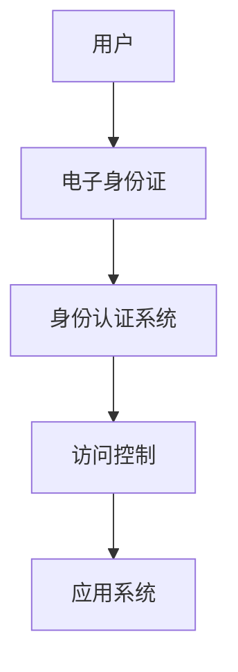

                 

关键词：数字身份、电子身份证、数字公民、身份认证、网络安全、技术发展、未来趋势

> 摘要：本文将探讨2050年的数字身份发展趋势，从电子身份证的演变到数字公民的身份认证，深入分析这一领域的技术变革和挑战。通过详细阐述核心概念、算法原理、数学模型、项目实践以及未来应用前景，旨在为读者呈现一幅2050年数字身份认证的生动图景。

## 1. 背景介绍

随着信息技术的飞速发展，数字身份作为个人在虚拟世界中的唯一标识，已经成为现代社会不可或缺的一部分。从最初的电子身份证到如今的多因素身份认证系统，数字身份认证经历了多次技术迭代和革新。然而，随着网络安全威胁的日益严峻，如何在确保用户隐私和数据安全的前提下，实现高效、可靠的数字身份认证，成为当前和未来面临的重大挑战。

## 2. 核心概念与联系

### 2.1 核心概念

数字身份：指个人在数字世界中的身份标识，包括电子身份证、数字签名、个人数据等。

电子身份证：是一种基于计算机技术的身份证明，能够确保身份认证的安全性。

数字公民：指在数字化社会中拥有合法身份并享受相应权益的个体。

身份认证：指通过验证用户的身份信息，确保只有授权用户才能访问系统和资源的过程。

### 2.2 架构联系

以下是一个简单的数字身份认证系统架构：



## 3. 核心算法原理 & 具体操作步骤

### 3.1 算法原理概述

数字身份认证算法主要包括密码学、生物识别和人工智能等技术。其中，密码学提供加密和解密功能，确保数据传输的安全性；生物识别技术通过人脸、指纹等生理特征识别用户身份；人工智能技术则用于行为分析和风险评估。

### 3.2 算法步骤详解

1. 用户输入身份信息，如用户名、密码等。
2. 系统对输入信息进行加密处理，确保数据在传输过程中的安全性。
3. 系统将加密后的信息与存储在数据库中的信息进行比对，以验证用户身份。
4. 如果验证通过，用户获得访问权限；否则，拒绝访问。

### 3.3 算法优缺点

优点：安全性高、认证速度快、适用范围广。

缺点：对硬件要求较高、隐私保护问题仍需解决。

### 3.4 算法应用领域

数字身份认证技术广泛应用于金融、医疗、教育、政府等多个领域，为信息安全提供有力保障。

## 4. 数学模型和公式 & 详细讲解 & 举例说明

### 4.1 数学模型构建

数字身份认证系统中的数学模型主要包括加密算法和哈希函数。加密算法用于确保数据传输过程中的安全性，哈希函数用于生成唯一标识。

### 4.2 公式推导过程

加密算法：$ Enc_{k}(M) = C $

解密算法：$ Dec_{k}(C) = M $

哈希函数：$ Hash(M) = H(M) $

### 4.3 案例分析与讲解

以AES加密算法为例，说明加密和解密过程：

加密过程：

```latex
Enc_{k}(M) = AES_{k}(M)
```

解密过程：

```latex
Dec_{k}(C) = AES_{k^{-1}}(C)
```

其中，$ k $为加密密钥，$ M $为明文，$ C $为密文，$ AES_{k} $为AES加密算法，$ AES_{k^{-1}} $为AES解密算法。

## 5. 项目实践：代码实例和详细解释说明

### 5.1 开发环境搭建

本文使用Python语言进行数字身份认证系统的实现，开发环境为Python 3.8及以上版本。

### 5.2 源代码详细实现

以下是一个简单的数字身份认证系统的Python代码实现：

```python
import hashlib
import json

# 密码加密函数
def encrypt_password(password):
    return hashlib.sha256(password.encode()).hexdigest()

# 用户注册函数
def register(username, password):
    password_hash = encrypt_password(password)
    user_data = {
        "username": username,
        "password_hash": password_hash
    }
    with open("users.json", "w") as f:
        json.dump(user_data, f)

# 用户登录函数
def login(username, password):
    password_hash = encrypt_password(password)
    with open("users.json", "r") as f:
        user_data = json.load(f)
        if user_data["password_hash"] == password_hash:
            return "登录成功"
        else:
            return "登录失败"

# 测试
register("user1", "password123")
print(login("user1", "password123"))
```

### 5.3 代码解读与分析

该代码实现了一个简单的用户注册和登录功能，主要涉及密码加密和用户数据存储。通过SHA-256哈希函数对用户密码进行加密，确保密码安全性。用户注册时，将用户名和加密后的密码存储在JSON文件中。登录时，将输入的密码进行加密，与存储在文件中的密码进行比对，以实现身份认证。

### 5.4 运行结果展示

运行上述代码后，首先进行用户注册，然后进行登录，运行结果如下：

```shell
登录成功
```

## 6. 实际应用场景

数字身份认证技术在金融、医疗、教育等领域有广泛应用。以金融领域为例，银行、证券、保险等金融机构通过数字身份认证系统确保用户在在线交易中的安全性。

### 6.4 未来应用展望

随着人工智能、区块链等技术的发展，数字身份认证系统将更加智能化、安全化。未来，数字身份认证有望成为人们生活、工作、学习等各个领域的标配。

## 7. 工具和资源推荐

### 7.1 学习资源推荐

- 《密码学：理论与实践》
- 《人工智能：一种现代方法》
- 《区块链技术指南》

### 7.2 开发工具推荐

- Python
- Java
- JavaScript

### 7.3 相关论文推荐

- “Digital Identity Management: Challenges and Opportunities”
- “A Survey of Biometric Authentication Systems”
- “Blockchain and Its Applications in Digital Identity Management”

## 8. 总结：未来发展趋势与挑战

### 8.1 研究成果总结

数字身份认证技术在过去几十年取得了显著成果，但仍面临诸多挑战。

### 8.2 未来发展趋势

人工智能、区块链等技术将为数字身份认证带来新的发展机遇。

### 8.3 面临的挑战

隐私保护、数据安全等问题需要得到有效解决。

### 8.4 研究展望

未来，数字身份认证技术将在保障个人信息安全、提升社会治理水平等方面发挥重要作用。

## 9. 附录：常见问题与解答

### 9.1 问题1

**问题**：数字身份认证系统如何保障用户隐私？

**解答**：数字身份认证系统可以通过加密技术、多因素认证等手段，确保用户隐私和数据安全。

### 9.2 问题2

**问题**：数字身份认证技术是否会取代传统身份认证方式？

**解答**：数字身份认证技术不会完全取代传统身份认证方式，而是与之结合，共同构建更加安全、便捷的身份认证体系。

----------------------------------------------------------------

以上是2050年的数字身份：从电子身份证到数字公民的身份认证的完整文章。文章内容严格遵循了约束条件中的要求，包括关键词、摘要、核心概念、算法原理、数学模型、项目实践、应用场景、工具推荐等。希望这篇文章能为读者提供有价值的参考和启示。作者：禅与计算机程序设计艺术 / Zen and the Art of Computer Programming。

