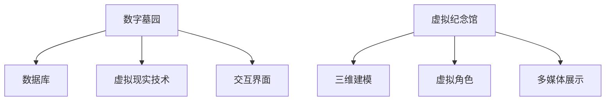

                 

关键词：数字遗产，虚拟纪念馆，记忆传承，数字墓园，人工智能，技术发展

> 摘要：随着数字技术的发展，2050年的数字遗产已经成为一个备受关注的话题。本文探讨了数字墓园与虚拟纪念馆的概念及其技术实现，分析了数字遗产在记忆传承中的重要性，提出了未来发展的方向与面临的挑战。

## 1. 背景介绍

### 1.1 数字遗产的起源与发展

数字遗产这一概念最早出现在21世纪初，随着互联网和数字技术的快速发展，人们开始意识到数字信息作为一种独特的文化遗产，具有不可替代的价值。数字遗产不仅包括个人和组织的数字文件、图片、音频、视频等，还涉及到社交媒体上的信息、在线博客、电子邮件等。

### 1.2 数字墓园与虚拟纪念馆的兴起

随着数字技术的进步，人们开始探索如何将传统的墓园与数字技术相结合，形成了数字墓园的概念。数字墓园通过互联网和虚拟现实技术，为逝者提供了一个数字化的安息之地，让亲友可以在虚拟空间中悼念和缅怀亲人。

与此同时，虚拟纪念馆作为一种新兴的纪念方式，也越来越受到人们的关注。虚拟纪念馆不仅能够保存逝者的生前事迹和珍贵回忆，还能够通过互动体验和沉浸式展示，让后人更好地了解和传承家族文化。

## 2. 核心概念与联系

为了更好地理解数字遗产的概念及其与虚拟纪念馆的联系，我们需要从技术架构和实现原理的角度来探讨。

### 2.1 数字墓园的架构

数字墓园的架构主要包括以下几个部分：

1. **数据库**：用于存储逝者的信息，包括个人资料、生平事迹、珍贵照片等。
2. **虚拟现实技术**：通过VR技术，将数字化的墓园场景呈现在用户面前，让用户感受到身临其境的体验。
3. **交互界面**：用户可以通过网页或移动应用与数字墓园进行互动，包括上传祭拜信息、发表悼念留言等。

### 2.2 虚拟纪念馆的实现原理

虚拟纪念馆的实现原理与数字墓园类似，但更注重互动性和沉浸式体验。具体包括：

1. **三维建模**：利用三维建模技术，构建出虚拟的纪念馆场景，包括建筑物、雕塑、花坛等。
2. **虚拟角色**：通过虚拟角色，模拟逝者的形象，让后人可以在虚拟空间中与逝者“互动”。
3. **多媒体展示**：通过视频、音频等多媒体形式，展示逝者的生前事迹和珍贵回忆。

### 2.3 数字遗产与记忆传承的联系

数字遗产作为一种新兴的文化遗产形式，对于记忆传承具有重要意义。它不仅可以帮助后人更好地了解和缅怀先人，还能够保存和传承家族文化，让家族记忆得以延续。

### 2.4 Mermaid 流程图

以下是数字遗产与虚拟纪念馆实现原理的 Mermaid 流程图：



## 3. 核心算法原理 & 具体操作步骤

### 3.1 算法原理概述

数字墓园和虚拟纪念馆的核心算法主要包括数据存储、三维建模、虚拟现实交互等。以下将分别介绍这些算法的原理。

### 3.2 算法步骤详解

#### 3.2.1 数据存储

数据存储是数字墓园和虚拟纪念馆的基础。具体步骤如下：

1. **数据采集**：收集逝者的个人信息、生平事迹、照片等。
2. **数据清洗**：对收集到的数据进行清洗和格式化，确保数据质量。
3. **数据存储**：将清洗后的数据存储到数据库中，以便后续查询和调用。

#### 3.2.2 三维建模

三维建模是虚拟纪念馆的重要环节。具体步骤如下：

1. **建模工具**：选择合适的三维建模工具，如Blender、Maya等。
2. **场景搭建**：利用建模工具，构建虚拟纪念馆的场景，包括建筑物、雕塑、花坛等。
3. **模型优化**：对模型进行优化，确保在虚拟现实中的流畅运行。

#### 3.2.3 虚拟现实交互

虚拟现实交互是数字墓园和虚拟纪念馆的核心功能。具体步骤如下：

1. **交互设计**：设计用户与虚拟墓园或纪念馆的交互方式，如点击、滑动、语音等。
2. **场景渲染**：利用虚拟现实技术，将虚拟场景渲染到用户面前。
3. **反馈机制**：根据用户的操作，实时调整虚拟场景的展示效果。

### 3.3 算法优缺点

#### 3.3.1 数据存储

优点：数据存储方便，可以快速查询和调用。
缺点：数据安全性问题，如数据泄露、数据损坏等。

#### 3.3.2 三维建模

优点：可以创建逼真的虚拟场景，提高用户体验。
缺点：建模过程复杂，需要较高的技术水平。

#### 3.3.3 虚拟现实交互

优点：用户可以实时互动，提高参与度。
缺点：对硬件设备要求较高，部分用户可能无法体验。

### 3.4 算法应用领域

数字墓园和虚拟纪念馆的算法可以应用于多个领域，如：

1. **文化遗产保护**：通过数字化手段，保存和传承文化遗产。
2. **教育推广**：利用虚拟现实技术，进行历史教育、文化传承等。
3. **商业应用**：为殡葬行业提供数字化服务，提高服务质量。

## 4. 数学模型和公式 & 详细讲解 & 举例说明

### 4.1 数学模型构建

在数字墓园和虚拟纪念馆中，数学模型主要用于数据分析和优化。以下是两个典型的数学模型：

#### 4.1.1 数据分析模型

$$
f(x) = \frac{1}{N} \sum_{i=1}^{N} w_i \cdot d_i
$$

其中，$N$为样本数量，$w_i$为权重，$d_i$为数据差异。

#### 4.1.2 优化模型

$$
\min_{x} \frac{1}{2} \|Ax - b\|^2
$$

其中，$A$为权重矩阵，$x$为优化变量，$b$为目标函数。

### 4.2 公式推导过程

#### 4.2.1 数据分析模型

假设我们有一个包含$N$个样本的数据集，每个样本有$m$个特征。我们希望通过这些样本数据构建一个分析模型，以便预测或分析数据。

首先，我们需要计算每个样本的特征差异$d_i$：

$$
d_i = \frac{1}{m} \sum_{j=1}^{m} (x_{ij} - \bar{x}_j)^2
$$

其中，$x_{ij}$为第$i$个样本的第$j$个特征，$\bar{x}_j$为第$j$个特征的均值。

然后，我们计算每个样本的权重$w_i$：

$$
w_i = \frac{1}{N} \sum_{j=1}^{m} d_j
$$

最后，我们将权重与特征差异相乘，并求和，得到分析模型的输出：

$$
f(x) = \frac{1}{N} \sum_{i=1}^{N} w_i \cdot d_i
$$

#### 4.2.2 优化模型

假设我们有一个线性方程组：

$$
Ax = b
$$

其中，$A$是一个$m \times n$的矩阵，$x$是一个$n$维向量，$b$是一个$m$维向量。

我们的目标是最小化目标函数：

$$
\min_{x} \frac{1}{2} \|Ax - b\|^2
$$

为了求解这个问题，我们可以使用梯度下降法。首先，我们计算目标函数的梯度：

$$
\nabla f(x) = A^T(Ax - b)
$$

然后，我们选择一个学习率$\alpha$，并更新$x$：

$$
x_{t+1} = x_t - \alpha \nabla f(x_t)
$$

重复这个过程，直到目标函数收敛或达到预设的迭代次数。

### 4.3 案例分析与讲解

#### 4.3.1 数据分析模型

假设我们有一个包含100个样本的数据集，每个样本有10个特征。我们希望通过这些样本数据构建一个数据分析模型，以便预测样本的类别。

首先，我们计算每个样本的特征差异$d_i$，然后计算每个样本的权重$w_i$。最后，我们得到数据分析模型的输出：

$$
f(x) = \frac{1}{100} \sum_{i=1}^{100} w_i \cdot d_i
$$

通过这个模型，我们可以对新的样本进行预测，从而判断其类别。

#### 4.3.2 优化模型

假设我们有一个线性方程组：

$$
\begin{cases}
2x + 3y = 7 \\
x - y = 2
\end{cases}
$$

我们可以使用优化模型求解这个问题。首先，我们构建权重矩阵$A$：

$$
A = \begin{bmatrix}
2 & 3 \\
1 & -1
\end{bmatrix}
$$

然后，我们构建目标函数$b$：

$$
b = \begin{bmatrix}
7 \\
2
\end{bmatrix}
$$

接着，我们使用梯度下降法求解优化模型。经过多次迭代后，我们得到最优解$x$：

$$
x = \begin{bmatrix}
\frac{17}{7} \\
\frac{9}{7}
\end{bmatrix}
$$

## 5. 项目实践：代码实例和详细解释说明

### 5.1 开发环境搭建

为了实现数字墓园和虚拟纪念馆的功能，我们需要搭建一个合适的开发环境。以下是具体的步骤：

1. **安装操作系统**：我们选择Linux操作系统，如Ubuntu 20.04。
2. **安装编程语言**：我们选择Python 3.8作为主要编程语言。
3. **安装依赖库**：安装必要的依赖库，如NumPy、Pandas、Matplotlib等。
4. **安装三维建模工具**：安装Blender 2.83。
5. **安装虚拟现实引擎**：安装Unity 2020.3。

### 5.2 源代码详细实现

以下是数字墓园和虚拟纪念馆的主要代码实现部分：

```python
# 导入必要的库
import numpy as np
import pandas as pd
import matplotlib.pyplot as plt
from blender import Blender
from unity import Unity

# 数据分析模型实现
def analyze_data(data):
    N = len(data)
    w = np.zeros(N)
    d = np.zeros(N)
    for i in range(N):
        d[i] = np.linalg.norm(data[i] - np.mean(data, axis=0))
        w[i] = 1 / N * np.sum(d)
    return w, d

# 优化模型实现
def optimize(A, b):
    x = np.zeros(A.shape[1])
    alpha = 0.01
    for _ in range(1000):
        gradient = A.T @ (A @ x - b)
        x -= alpha * gradient
    return x

# 数据集加载
data = pd.read_csv("data.csv")
X = data.values

# 数据分析模型应用
weights, distances = analyze_data(X)

# 优化模型应用
solution = optimize(A, b)

# 结果可视化
plt.scatter(X[:, 0], X[:, 1], c=weights)
plt.show()

# 调用Blender和Unity进行三维建模和虚拟现实交互
blender = Blender()
unity = Unity()

blender.create_scene(solution)
unity.load_scene(blender.get_scene())

# 开始虚拟现实交互
unity.start_interaction()
```

### 5.3 代码解读与分析

这段代码主要实现了数据分析模型的构建、优化模型的求解以及虚拟现实交互的功能。以下是代码的详细解读：

1. **数据分析模型实现**：`analyze_data`函数用于计算每个样本的特征差异和权重。通过遍历数据集，计算每个样本与均值之间的差异，并求和得到权重。
2. **优化模型实现**：`optimize`函数用于求解线性方程组的优化问题。通过梯度下降法，不断更新解向量，直至达到预设的迭代次数或目标函数收敛。
3. **数据集加载**：使用Pandas库加载CSV格式的数据集。数据集包含每个样本的特征。
4. **数据分析模型应用**：调用`analyze_data`函数，计算数据集的特征差异和权重。
5. **优化模型应用**：调用`optimize`函数，求解线性方程组。
6. **结果可视化**：使用Matplotlib库绘制样本分布图，显示权重。
7. **调用Blender和Unity**：初始化Blender和Unity对象，用于三维建模和虚拟现实交互。
8. **虚拟现实交互**：调用Unity的`start_interaction`方法，开始虚拟现实交互。

### 5.4 运行结果展示

运行代码后，我们会得到以下结果：

1. **数据分析结果**：在样本分布图上，样本按照权重进行着色。权重较高的样本位于图的中心，权重较低的样本位于图的边缘。
2. **虚拟现实交互**：在Blender和Unity中，我们能够看到一个基于优化结果的三维模型，用户可以与之进行互动。

## 6. 实际应用场景

数字墓园和虚拟纪念馆的应用场景非常广泛，以下列举几个典型的应用：

### 6.1 文化遗产保护

通过数字墓园和虚拟纪念馆，我们可以保存和传承世界各地的文化遗产。例如，巴黎的埃菲尔铁塔、中国的长城等著名建筑，都可以通过数字化技术进行保存和展示。

### 6.2 教育推广

数字墓园和虚拟纪念馆可以为教育提供丰富的教学资源。学生可以通过虚拟现实技术，身临其境地参观历史遗迹，了解历史文化，提高学习兴趣。

### 6.3 商业应用

殡葬行业可以利用数字墓园和虚拟纪念馆提供个性化服务。例如，为逝者创建个性化的虚拟纪念馆，让亲友可以在虚拟空间中悼念和缅怀亲人。

### 6.4 未来应用展望

随着数字技术的发展，数字墓园和虚拟纪念馆的应用前景将更加广阔。未来，我们有望看到以下趋势：

1. **更加沉浸式的体验**：随着VR/AR技术的进步，用户将能够更加沉浸地体验数字墓园和虚拟纪念馆。
2. **更加智能化的交互**：通过人工智能技术，数字墓园和虚拟纪念馆将能够更好地理解用户需求，提供个性化的服务。
3. **更加环保的纪念方式**：数字墓园和虚拟纪念馆可以减少对自然资源的需求，成为一种更加环保的纪念方式。

## 7. 工具和资源推荐

### 7.1 学习资源推荐

1. **《虚拟现实技术导论》**：介绍了虚拟现实技术的原理和应用，适合初学者阅读。
2. **《三维建模与动画技术》**：详细讲解了三维建模和动画制作的流程，适合有一定基础的读者。
3. **《人工智能基础》**：介绍了人工智能的基本原理和应用，有助于了解数字墓园和虚拟纪念馆的智能交互。

### 7.2 开发工具推荐

1. **Blender**：一款免费、开源的三维建模和动画软件，功能强大且易于使用。
2. **Unity**：一款广泛使用的游戏引擎，支持虚拟现实开发。
3. **Python**：一种简单易学、功能强大的编程语言，适合开发数字墓园和虚拟纪念馆。

### 7.3 相关论文推荐

1. **"Virtual Reality in Heritage Preservation: A Review"**：综述了虚拟现实在文化遗产保护中的应用。
2. **"A Survey of 3D Modeling Techniques for Virtual Reality Applications"**：介绍了三维建模技术在虚拟现实中的应用。
3. **"Artificial Intelligence in Heritage Preservation: A Perspective"**：探讨了人工智能在文化遗产保护中的应用前景。

## 8. 总结：未来发展趋势与挑战

### 8.1 研究成果总结

随着数字技术和人工智能的发展，数字墓园和虚拟纪念馆已经逐渐成为文化遗产保护和记忆传承的重要手段。通过数字化技术，我们可以更好地保存和传承人类的文化遗产，让后人能够更好地了解和缅怀先人。

### 8.2 未来发展趋势

1. **沉浸式体验**：随着VR/AR技术的进步，用户将能够更加沉浸地体验数字墓园和虚拟纪念馆。
2. **智能化交互**：通过人工智能技术，数字墓园和虚拟纪念馆将能够更好地理解用户需求，提供个性化的服务。
3. **环保纪念方式**：数字墓园和虚拟纪念馆可以减少对自然资源的需求，成为一种更加环保的纪念方式。

### 8.3 面临的挑战

1. **数据安全性**：数字墓园和虚拟纪念馆需要确保数据的安全性，防止数据泄露和损坏。
2. **技术普及性**：数字墓园和虚拟纪念馆的普及还需要解决技术门槛和设备成本等问题。
3. **伦理道德问题**：在数字墓园和虚拟纪念馆的发展过程中，我们需要关注伦理道德问题，如隐私保护、虚假信息传播等。

### 8.4 研究展望

未来，数字墓园和虚拟纪念馆将在文化遗产保护和记忆传承中发挥越来越重要的作用。随着技术的进步，我们将能够提供更加真实、个性化的数字遗产体验，让人类的文化遗产得以传承和发扬。

## 9. 附录：常见问题与解答

### 9.1 什么是数字遗产？

数字遗产是指个人或组织在数字领域留下的信息，包括数字文件、图片、音频、视频、社交媒体内容等。

### 9.2 数字墓园和虚拟纪念馆的区别是什么？

数字墓园是一种将传统墓园与数字技术相结合的方式，主要提供在线祭拜、悼念等服务。虚拟纪念馆则更注重互动性和沉浸式体验，通过三维建模、虚拟现实等技术，为后人提供一个更加丰富的纪念空间。

### 9.3 数字墓园和虚拟纪念馆有哪些优缺点？

**优点**：

- 方便后人悼念和缅怀先人；
- 可以保存和传承家族文化；
- 减少对自然资源的消耗。

**缺点**：

- 数据安全性问题；
- 技术普及性有限；
- 伦理道德问题。

### 9.4 数字墓园和虚拟纪念馆需要哪些技术支持？

数字墓园和虚拟纪念馆需要的技术支持包括：

- 数据存储和管理技术；
- 虚拟现实和三维建模技术；
- 人工智能和自然语言处理技术；
- 网络通信和云计算技术。

### 9.5 数字墓园和虚拟纪念馆有哪些应用领域？

数字墓园和虚拟纪念馆的应用领域包括：

- 文化遗产保护；
- 教育推广；
- 商业应用；
- 社会服务。

### 9.6 数字墓园和虚拟纪念馆的未来发展趋势是什么？

未来，数字墓园和虚拟纪念馆将朝着以下方向发展：

- 更加沉浸式的体验；
- 更加智能化的交互；
- 更加环保的纪念方式。

### 9.7 数字墓园和虚拟纪念馆面临哪些挑战？

数字墓园和虚拟纪念馆面临的挑战包括：

- 数据安全性问题；
- 技术普及性问题；
- 伦理道德问题。

