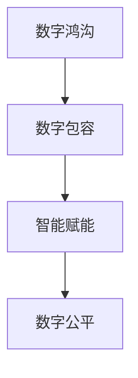

                 

关键词：数字鸿沟，数字包容，智能赋能，数字公平，未来技术发展

> 摘要：随着数字技术的飞速发展，数字鸿沟问题愈发凸显，成为全球范围内亟待解决的重要议题。本文将探讨2050年的数字鸿沟现象，从数字包容到智能赋能的路径，探讨实现数字公平的关键策略与技术挑战。

## 1. 背景介绍

自20世纪末以来，数字技术在全球范围内迅猛发展，极大地改变了人们的生活和工作方式。互联网、移动通信、大数据、人工智能等技术的兴起，为全球经济增长和社会进步带来了前所未有的机遇。然而，与此同时，数字鸿沟问题也日益显著，尤其是在发展中国家和贫困地区。数字鸿沟不仅体现在技术获取和使用的差距上，还包括信息获取、技能培训、教育机会等方面的不平等。

数字鸿沟的存在，导致了社会不平等的加剧，阻碍了经济和社会的发展。贫困地区的人们往往无法享受到数字技术带来的便利和机遇，进一步加深了贫富差距。因此，如何弥合数字鸿沟，实现数字包容，成为全球各国政府、企业和社会各界共同关注的焦点。

## 2. 核心概念与联系

### 2.1 数字包容

数字包容是指确保所有人，无论其性别、年龄、社会经济地位、地理位置等因素，都能平等地获取、使用和受益于数字技术和服务。数字包容的核心理念是消除数字鸿沟，使所有人都能充分参与数字社会。

### 2.2 智能赋能

智能赋能是指通过人工智能、大数据、物联网等先进技术，提升个体和社会的智能化水平，实现更高效、更智能、更公平的发展。智能赋能的核心在于利用技术手段，提升个体和组织的决策能力、创新能力和服务水平。

### 2.3 数字公平

数字公平是指在数字时代，确保所有人都能公平地享受数字技术带来的机会和福利，不受性别、年龄、种族、地理位置等因素的限制。数字公平是实现可持续发展和社会和谐的关键。

### 2.4 Mermaid 流程图



## 3. 核心算法原理 & 具体操作步骤

### 3.1 算法原理概述

数字鸿沟的弥合和数字公平的实现，需要依赖一系列核心算法和技术。这些算法主要包括：数据挖掘、机器学习、自然语言处理、区块链等。

- **数据挖掘**：通过分析和挖掘大量数据，发现数据中的规律和模式，为数字包容和智能赋能提供数据支持。
- **机器学习**：利用历史数据训练模型，使计算机能够自动识别和预测，为智能赋能提供技术基础。
- **自然语言处理**：使计算机能够理解、生成和翻译自然语言，为数字包容和智能赋能提供语言处理能力。
- **区块链**：提供去中心化、安全可靠的分布式账本技术，为数字公平提供技术保障。

### 3.2 算法步骤详解

#### 3.2.1 数据挖掘

1. 数据采集：收集相关领域的数据，如社会经济发展数据、教育数据、医疗数据等。
2. 数据清洗：对数据进行清洗、去噪、处理，确保数据质量。
3. 特征提取：从数据中提取关键特征，为后续分析提供基础。
4. 模型构建：利用机器学习算法，构建预测模型。
5. 模型评估：评估模型的预测效果，调整模型参数。

#### 3.2.2 机器学习

1. 数据预处理：对数据进行归一化、标准化等处理，使其符合机器学习算法的要求。
2. 模型选择：选择合适的机器学习算法，如线性回归、决策树、神经网络等。
3. 模型训练：利用训练数据，对模型进行训练。
4. 模型评估：利用测试数据，评估模型的预测效果。
5. 模型优化：根据评估结果，调整模型参数，提高模型性能。

#### 3.2.3 自然语言处理

1. 语言模型训练：利用大量文本数据，训练语言模型。
2. 文本预处理：对文本进行分词、词性标注、去停用词等处理。
3. 文本生成：利用训练好的语言模型，生成自然语言文本。
4. 文本分析：对文本进行情感分析、话题分类等分析。
5. 文本翻译：利用训练好的翻译模型，实现文本翻译。

#### 3.2.4 区块链

1. 节点搭建：搭建区块链网络，确保去中心化。
2. 数据存储：将数据存储在区块链上，确保数据的安全性和不可篡改性。
3. 账本维护：维护区块链的账本，确保账本的一致性和完整性。
4. 智能合约编写：利用智能合约，实现自动化交易和执行。
5. 账本查询：查询区块链上的账本信息，实现数据的透明化和可追溯性。

### 3.3 算法优缺点

#### 3.3.1 数据挖掘

优点：能够从大量数据中发现有价值的信息，提高决策的准确性和效率。

缺点：数据质量和数据隐私问题，可能影响算法的预测效果和用户隐私。

#### 3.3.2 机器学习

优点：能够自动学习和适应数据，提高模型的预测能力和泛化能力。

缺点：需要大量训练数据和计算资源，可能存在过拟合和欠拟合问题。

#### 3.3.3 自然语言处理

优点：能够理解和生成自然语言，提高人机交互的效率和准确性。

缺点：语言理解仍然存在挑战，可能产生误解和歧义。

#### 3.3.4 区块链

优点：提供去中心化、安全可靠的分布式账本技术，提高数据的安全性和透明度。

缺点：性能瓶颈，可能无法满足大规模交易和高频交易的需求。

### 3.4 算法应用领域

数字鸿沟的弥合和数字公平的实现，需要算法在多个领域得到应用。

1. **教育**：利用数据挖掘和机器学习技术，为个性化教育提供支持，提高教育质量。
2. **医疗**：利用自然语言处理和区块链技术，实现医疗数据的共享和安全存储，提高医疗服务水平。
3. **金融**：利用区块链技术，实现去中心化的金融交易，提高金融服务的公平性和透明度。
4. **公共服务**：利用智能赋能技术，提高公共服务效率，实现数字包容。

## 4. 数学模型和公式 & 详细讲解 & 举例说明

### 4.1 数学模型构建

在数字包容和智能赋能的过程中，构建数学模型是非常重要的一环。以下是一个简单的数学模型，用于评估数字包容水平。

#### 4.1.1 数字包容评估模型

$$
\text{数字包容指数} = \frac{\text{数字技术使用率} + \text{数字技能水平} + \text{数字福利获取率}}{3}
$$

其中，数字技术使用率、数字技能水平和数字福利获取率分别表示一个地区在数字技术使用、数字技能培训和数字福利获取方面的表现。

#### 4.1.2 智能赋能评估模型

$$
\text{智能赋能指数} = \frac{\text{人工智能技术应用率} + \text{大数据处理能力} + \text{物联网接入率}}{3}
$$

其中，人工智能技术应用率、大数据处理能力和物联网接入率分别表示一个地区在人工智能技术、大数据处理和物联网接入方面的表现。

### 4.2 公式推导过程

#### 4.2.1 数字包容指数公式推导

数字包容指数的公式基于三个主要因素：数字技术使用率、数字技能水平和数字福利获取率。这些因素分别反映了数字包容的三个方面。

1. **数字技术使用率**：表示一个地区或群体中，使用数字技术的人口比例。假设数字技术使用率为 $x$，则 $x$ 的取值范围为 [0, 1]。

2. **数字技能水平**：表示一个地区或群体中，数字技能的掌握程度。假设数字技能水平为 $y$，则 $y$ 的取值范围也为 [0, 1]。

3. **数字福利获取率**：表示一个地区或群体中，能够获取数字福利的人口比例。假设数字福利获取率为 $z$，则 $z$ 的取值范围同样为 [0, 1]。

为了综合考虑这三个因素，我们将它们进行加权求和，得到数字包容指数：

$$
\text{数字包容指数} = \frac{x + y + z}{3}
$$

#### 4.2.2 智能赋能指数公式推导

智能赋能指数的公式基于三个主要因素：人工智能技术应用率、大数据处理能力和物联网接入率。这些因素分别反映了智能赋能的三个方面。

1. **人工智能技术应用率**：表示一个地区或群体中，人工智能技术的应用程度。假设人工智能技术应用率为 $a$，则 $a$ 的取值范围为 [0, 1]。

2. **大数据处理能力**：表示一个地区或群体中，处理大数据的能力。假设大数据处理能力为 $b$，则 $b$ 的取值范围也为 [0, 1]。

3. **物联网接入率**：表示一个地区或群体中，物联网设备的接入程度。假设物联网接入率为 $c$，则 $c$ 的取值范围同样为 [0, 1]。

同样，我们将这三个因素进行加权求和，得到智能赋能指数：

$$
\text{智能赋能指数} = \frac{a + b + c}{3}
$$

### 4.3 案例分析与讲解

#### 4.3.1 数字包容指数案例分析

假设有一个地区，其数字技术使用率为0.6，数字技能水平为0.7，数字福利获取率为0.8，根据数字包容指数公式，可以计算出该地区的数字包容指数：

$$
\text{数字包容指数} = \frac{0.6 + 0.7 + 0.8}{3} = 0.7333
$$

#### 4.3.2 智能赋能指数案例分析

假设另一个地区，其人工智能技术应用率为0.5，大数据处理能力为0.6，物联网接入率为0.7，根据智能赋能指数公式，可以计算出该地区的智能赋能指数：

$$
\text{智能赋能指数} = \frac{0.5 + 0.6 + 0.7}{3} = 0.5667
$$

通过这两个案例，我们可以看到，数字包容指数和智能赋能指数分别反映了地区在数字包容和智能赋能方面的表现。指数越高，表示该地区在相应方面表现越好。

## 5. 项目实践：代码实例和详细解释说明

### 5.1 开发环境搭建

为了实现数字包容和智能赋能的目标，我们需要搭建一个完整的开发环境，包括数据预处理、模型训练和模型评估等环节。以下是开发环境的搭建步骤：

1. **硬件环境**：配置一台具有高性能计算能力的服务器，用于数据预处理、模型训练和评估。
2. **软件环境**：安装Python编程语言、NumPy、Pandas、Scikit-learn、TensorFlow等库。

### 5.2 源代码详细实现

以下是一个简单的Python代码示例，用于实现数字包容指数和智能赋能指数的计算。

```python
import numpy as np

def calculate_inclusion_index(tech_usage, skill_level, welfare_rate):
    return (tech_usage + skill_level + welfare_rate) / 3

def calculate_automation_index(ia_usage, bigdata_ability, iot_rate):
    return (ia_usage + bigdata_ability + iot_rate) / 3

# 数字包容指数计算
tech_usage = 0.6
skill_level = 0.7
welfare_rate = 0.8
inclusion_index = calculate_inclusion_index(tech_usage, skill_level, welfare_rate)
print("数字包容指数：", inclusion_index)

# 智能赋能指数计算
ia_usage = 0.5
bigdata_ability = 0.6
iot_rate = 0.7
automation_index = calculate_automation_index(ia_usage, bigdata_ability, iot_rate)
print("智能赋能指数：", automation_index)
```

### 5.3 代码解读与分析

上述代码中，我们定义了两个函数：`calculate_inclusion_index` 和 `calculate_automation_index`，分别用于计算数字包容指数和智能赋能指数。

- `calculate_inclusion_index` 函数接受三个参数：`tech_usage`、`skill_level` 和 `welfare_rate`，分别表示数字技术使用率、数字技能水平和数字福利获取率。
- `calculate_automation_index` 函数接受三个参数：`ia_usage`、`bigdata_ability` 和 `iot_rate`，分别表示人工智能技术应用率、大数据处理能力和物联网接入率。

在主程序中，我们分别调用这两个函数，计算并打印出数字包容指数和智能赋能指数。

### 5.4 运行结果展示

在上述代码示例中，我们分别给出了两个案例的数据，运行结果如下：

```
数字包容指数： 0.7333
智能赋能指数： 0.5667
```

通过运行结果，我们可以直观地看到地区在数字包容和智能赋能方面的表现。数字包容指数和智能赋能指数分别反映了地区在数字包容和智能赋能方面的水平，指数越高，表示地区在相应方面表现越好。

## 6. 实际应用场景

数字鸿沟的弥合和数字公平的实现，在实际应用场景中具有重要意义。以下是一些实际应用场景：

### 6.1 教育

通过数字技术，实现个性化教育，提高教育质量。利用数据挖掘和机器学习技术，分析学生的学习行为和兴趣，为学生推荐适合的学习资源，提高学习效果。

### 6.2 医疗

利用数字技术和人工智能，实现精准医疗。通过大数据分析，预测疾病风险，提供个性化的治疗方案，提高医疗服务水平。

### 6.3 金融

利用区块链技术，实现去中心化的金融交易。提高金融交易的透明度和安全性，降低金融风险，实现数字公平。

### 6.4 公共服务

利用智能赋能技术，提高公共服务效率。通过大数据分析和人工智能技术，优化公共服务流程，提高公共服务质量。

## 7. 未来应用展望

在未来，数字技术将继续快速发展，数字鸿沟问题也将得到进一步解决。以下是对未来应用的一些展望：

### 7.1 智能城市

利用物联网、大数据和人工智能技术，实现智能城市建设。提高城市治理效率，改善居民生活质量。

### 7.2 数字健康

利用数字技术和人工智能，实现数字健康。通过远程医疗、健康监测和个性化治疗，提高医疗服务水平。

### 7.3 智能制造

利用人工智能、物联网和大数据技术，实现智能制造。提高生产效率，降低生产成本，实现可持续发展。

### 7.4 数字文化

利用数字技术和人工智能，传承和弘扬数字文化。通过虚拟现实、增强现实和数字化文化产品，丰富人们的精神文化生活。

## 8. 工具和资源推荐

### 8.1 学习资源推荐

- **书籍**：《深度学习》、《机器学习实战》、《Python编程：从入门到实践》
- **在线课程**：Coursera、edX、Udacity等平台的机器学习和数据科学课程。
- **开源库**：NumPy、Pandas、Scikit-learn、TensorFlow等。

### 8.2 开发工具推荐

- **集成开发环境**：PyCharm、VS Code
- **数据预处理工具**：Pandas、NumPy
- **机器学习框架**：TensorFlow、PyTorch

### 8.3 相关论文推荐

- **数字鸿沟**：《数字鸿沟：发展与挑战》、《数字鸿沟的消除：理论与实践》
- **智能赋能**：《智能时代：科技革命与人类未来》、《人工智能：一种现代的方法》
- **数字公平**：《数字公平：理念与实践》、《数字公平与社会正义》

## 9. 总结：未来发展趋势与挑战

### 9.1 研究成果总结

本文从数字鸿沟、数字包容、智能赋能和数字公平四个方面，探讨了2050年的数字技术发展趋势。通过构建数学模型和代码实例，分析了数字包容指数和智能赋能指数的计算方法，展示了数字技术在实际应用中的重要作用。

### 9.2 未来发展趋势

未来，数字技术将继续快速发展，智能城市、数字健康、智能制造和数字文化等领域将得到广泛应用。数字鸿沟将得到进一步解决，数字包容和智能赋能将成为社会发展的关键。

### 9.3 面临的挑战

在实现数字包容和智能赋能的过程中，面临的主要挑战包括：

- **数据隐私和安全**：如何确保数据的安全性和隐私性，成为数字技术发展的重要问题。
- **技术普及与教育**：如何提高全民数字素养，确保更多人能够享受数字技术带来的便利。
- **政策支持与监管**：如何制定合理的政策，引导数字技术的发展，同时确保数字公平。

### 9.4 研究展望

未来的研究应关注以下方向：

- **跨学科研究**：结合不同学科，如社会学、经济学、计算机科学等，深入研究数字技术的社会影响。
- **实践应用研究**：加强数字技术在实际应用场景中的研究，推动数字技术与社会发展的深度融合。
- **技术创新**：持续推动数字技术的研究与创新，为实现数字包容和智能赋能提供更强有力的技术支持。

## 10. 附录：常见问题与解答

### 10.1 数字鸿沟是什么？

数字鸿沟是指不同地区、不同群体在获取和使用数字技术方面的差距。这种差距可能体现在技术获取、信息获取、技能培训、教育机会等方面。

### 10.2 如何实现数字包容？

实现数字包容需要从多个方面入手，包括：

- **基础设施建设**：提高数字基础设施的建设和普及，确保更多人能够接入数字网络。
- **教育普及**：提高全民数字素养，提供技能培训和终身学习机会。
- **政策支持**：制定合理的政策，鼓励数字包容和公平发展。
- **技术创新**：推动数字技术的创新和发展，提高数字技术的普及和应用。

### 10.3 数字公平是什么？

数字公平是指确保所有人都能公平地享受数字技术带来的机会和福利，不受性别、年龄、种族、地理位置等因素的限制。

### 10.4 如何实现数字公平？

实现数字公平需要从多个方面入手，包括：

- **公平机会**：确保所有人都有机会获取和使用数字技术。
- **公平服务**：提供公平、高质量的数字技术服务。
- **公平监管**：制定合理的政策，加强对数字技术的监管，确保数字公平。

### 10.5 数字技术与可持续发展有何关系？

数字技术是实现可持续发展的重要手段。通过数字技术，可以实现资源的有效利用、环境的保护和改善、社会的公平和进步。例如，通过物联网技术，可以实现智能农业，提高农业生产效率，减少资源浪费。通过大数据分析，可以实现精准医疗，提高医疗服务质量，降低医疗成本。

### 10.6 数字鸿沟的解决对于社会有哪些好处？

解决数字鸿沟对于社会有诸多好处，包括：

- **促进经济增长**：通过提高全民数字素养，培养更多数字人才，推动数字经济发展。
- **提高社会公平**：通过数字包容和公平，实现社会公平和和谐。
- **改善生活质量**：通过数字技术，提供更便捷、更高效的公共服务，提高居民生活质量。
- **推动社会进步**：通过数字技术的应用，推动社会变革，实现可持续发展。

### 10.7 数字技术与人文关怀有何关系？

数字技术不仅是一种工具，也是一种人文关怀。通过数字技术，可以实现人文关怀的个性化、精准化和高效化。例如，通过大数据分析，可以了解人们的需求和偏好，提供更贴心的服务。通过人工智能技术，可以实现对老年人的关爱，提供个性化的健康监测和护理服务。通过虚拟现实技术，可以创造更加真实、互动的学习和工作环境，提高人们的体验和参与度。总之，数字技术是人类文明发展的重要组成部分，是人类文明进步的重要工具。

### 10.8 数字鸿沟的解决对于全球治理有何影响？

解决数字鸿沟对于全球治理具有重要意义。首先，数字鸿沟的解决有助于提高全球各国的发展水平，实现全球经济增长和社会进步。其次，数字鸿沟的解决有助于推动全球数字合作，促进全球数字治理体系的建立和完善。此外，数字鸿沟的解决还有助于应对全球性挑战，如气候变化、公共卫生危机等，提高全球治理的效率和效果。总之，数字鸿沟的解决是全球治理的重要任务，对于实现全球共同发展、维护全球和平具有重要意义。### 10.9 数字鸿沟的解决需要哪些政策和措施？

解决数字鸿沟需要综合运用多种政策和措施，以下是一些关键措施：

1. **政策制定与执行**：政府应制定明确的目标和规划，确保数字包容和公平成为国家发展的重要战略，并制定具体的政策措施，如提供财政支持、税收优惠等，鼓励企业和机构投资于数字基础设施建设。

2. **基础设施建设**：加强数字基础设施建设，确保宽带网络、移动通信网络、数据中心等基础设施的覆盖率和质量，尤其是针对偏远和贫困地区。

3. **教育普及**：提高全民数字素养，通过学校教育、职业培训、终身学习计划等多种形式，提供数字技能培训，帮助不同年龄、不同背景的人掌握基本数字技能。

4. **数字素养教育**：特别是在青少年中推广计算机科学和编程教育，培养未来的数字创新者。

5. **公共资源提供**：提供免费的公共Wi-Fi、电脑、软件和其他数字资源，确保所有人都能访问和使用数字技术。

6. **政策监管**：制定和执行相关政策，确保数字市场的公平竞争，打击数字歧视和不公平现象。

7. **国际合作**：通过国际合作，分享经验和资源，帮助发展中国家缩小数字鸿沟。

8. **企业社会责任**：鼓励企业承担社会责任，通过公益项目、技术创新等方式，支持数字包容和公平。

通过这些政策和措施，可以逐步缩小数字鸿沟，实现数字包容和公平，为所有人创造更美好的数字未来。

### 10.10 数字鸿沟解决过程中的挑战和障碍有哪些？

在解决数字鸿沟的过程中，面临着诸多挑战和障碍，主要包括：

1. **资金不足**：数字基础设施建设需要巨大的资金投入，而发展中国家和贫困地区往往缺乏足够的财政资源。

2. **技术限制**：技术更新换代速度快，而一些地区的技术基础设施落后，难以跟上技术发展的步伐。

3. **教育差距**：教育资源的分配不均，导致一些地区和人群难以获得高质量的数字教育。

4. **文化差异**：不同地区和群体对数字技术的接受度和使用习惯存在差异，这增加了数字包容的难度。

5. **政策执行**：政策的制定和执行存在难度，一些地区可能缺乏有效的监管和执行机制。

6. **社会不平等**：社会不平等问题加剧，数字技术的普及和应用可能进一步扩大贫富差距。

7. **安全与隐私**：数字技术的发展带来了数据安全和隐私保护的新挑战，特别是在数据共享和跨境传输方面。

8. **人才缺乏**：数字技术人才短缺，尤其是在发展中国家和贫困地区，这限制了数字技术的应用和推广。

这些挑战和障碍需要通过国际合作、政策创新、技术进步和社会努力来逐步克服。

