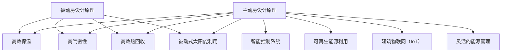

                 

关键词：绿色建筑、被动房、主动房、建筑能效、2050年、可持续发展

<|assistant|>摘要：随着全球气候变化和能源危机的加剧，建筑行业的绿色转型变得日益迫切。本文探讨了从被动房到主动房的建筑能效革命，分析了这一趋势背后的技术发展、市场需求和政策驱动。通过详细阐述2050年绿色建筑的技术前景和实际应用案例，本文为未来建筑行业的发展提供了深刻的见解和展望。

## 1. 背景介绍

建筑行业是能源消耗和碳排放的主要来源之一。据统计，全球建筑能耗占全球总能耗的40%以上，而建筑相关的碳排放量更是高达全球总碳排放量的近30%。面对如此巨大的能源和环境压力，绿色建筑的概念应运而生。绿色建筑旨在通过提高建筑能效、减少能源消耗和碳排放，实现可持续发展。

被动房（Passive House）是绿色建筑的一个重要里程碑。被动房通过严格的保温、气密性设计和高效的热回收系统，使建筑在极小的能源输入下实现舒适的室内环境。这种建筑形式自20世纪90年代以来在欧洲得到了广泛的应用和推广，并逐渐在全球范围内产生影响。

然而，随着技术的进步和能源需求的不断增长，被动房的技术局限性逐渐显现。为了进一步提升建筑能效，主动房（Active House）的概念应运而生。主动房不仅继承了被动房的高效能特点，还结合了智能控制、可再生能源利用和建筑物联网（IoT）技术，实现了更高的能效和更大的灵活度。

## 2. 核心概念与联系

### 被动房

被动房的核心在于其被动设计，即通过建筑设计和材料选择最大限度地减少建筑能耗，同时保证室内环境舒适。具体来说，被动房遵循以下原则：

1. **高保温性**：采用高效的保温材料，确保建筑物的热损失最小。
2. **高气密性**：采用密封性好的窗户和门窗，减少空气渗透。
3. **高效热回收**：利用热回收系统，回收室内排出的热量，减少能量浪费。
4. **被动式太阳能利用**：通过窗户和屋顶设计，最大限度地利用太阳能。

### 主动房

与被动房相比，主动房在被动设计的基础上，进一步融入了智能控制、可再生能源利用和建筑物联网技术，实现了更高的能效和更灵活的建筑环境控制。具体来说，主动房的特点包括：

1. **智能控制系统**：通过智能传感器和控制算法，实现室内环境的自动化控制和优化。
2. **可再生能源利用**：利用太阳能、风能等可再生能源，实现建筑能源的自给自足。
3. **建筑物联网（IoT）**：通过物联网技术，实现建筑系统之间的互联互通，提高建筑能效和管理效率。
4. **灵活的能源管理**：根据实时能源需求和供应情况，动态调整能源使用策略，实现最优的能源管理。

### Mermaid 流程图



## 3. 核心算法原理 & 具体操作步骤

### 3.1 算法原理概述

主动房的核心在于其智能控制系统和能源管理系统。智能控制系统通过传感器和控制算法，实时监测室内环境参数，如温度、湿度、光照等，并自动调整室内环境。能源管理系统则通过预测能源需求和供应情况，动态调整能源使用策略，实现最优的能源管理。

### 3.2 算法步骤详解

1. **环境参数监测**：通过安装在室内的传感器，实时监测室内环境参数。
2. **数据处理**：将传感器采集的数据进行处理，提取有用的信息。
3. **环境参数预测**：利用历史数据和机器学习算法，预测未来的环境参数。
4. **控制策略生成**：根据预测的环境参数，生成相应的控制策略。
5. **执行控制策略**：通过智能控制系统，执行生成的控制策略，调整室内环境。
6. **能源需求预测**：通过能源使用历史数据和机器学习算法，预测未来的能源需求。
7. **能源供应预测**：根据可再生能源的可用性，预测未来的能源供应。
8. **能源使用策略调整**：根据预测的能源需求和供应，动态调整能源使用策略。

### 3.3 算法优缺点

**优点**：

1. **高效节能**：通过智能控制和能源管理，实现更高的能源效率和更低的能源消耗。
2. **舒适度高**：通过实时监测和调整室内环境，提高室内环境的舒适度。
3. **灵活性强**：可以根据实际需求和供应情况，动态调整能源使用策略。

**缺点**：

1. **系统复杂**：智能控制系统和能源管理系统需要大量的传感器、控制算法和数据处理，系统复杂度较高。
2. **初期投资大**：主动房的建设和维护成本较高，初期投资较大。

### 3.4 算法应用领域

主动房技术主要应用于住宅、商业建筑和工业建筑等领域。通过智能控制和能源管理，这些建筑可以实现更高的能源效率和更低的运营成本。

## 4. 数学模型和公式 & 详细讲解 & 举例说明

### 4.1 数学模型构建

主动房的智能控制系统和能源管理系统的核心在于预测和优化。为了实现这一目标，需要建立相应的数学模型。具体的数学模型包括：

1. **环境参数预测模型**：利用历史数据和机器学习算法，构建环境参数的预测模型。
2. **能源需求预测模型**：利用能源使用历史数据和机器学习算法，构建能源需求的预测模型。
3. **能源供应预测模型**：根据可再生能源的可用性，构建能源供应的预测模型。
4. **能源管理优化模型**：利用线性规划或混合整数规划算法，构建能源管理优化模型。

### 4.2 公式推导过程

以环境参数预测模型为例，其基本的公式推导过程如下：

$$
y_t = f(x_t, \theta)
$$

其中，$y_t$ 是时间 $t$ 的环境参数，$x_t$ 是时间 $t$ 的传感器数据，$\theta$ 是模型的参数。

通过训练，可以求出 $f(x_t, \theta)$ 的具体形式。常见的机器学习算法包括线性回归、决策树、随机森林等。

### 4.3 案例分析与讲解

以一个实际的主动房项目为例，该项目的目标是实现室内温度的自动调节。具体的案例分析如下：

1. **环境参数监测**：在室内安装了温度传感器和湿度传感器，实时监测室内温度和湿度。
2. **数据处理**：将传感器数据上传到云端，进行数据处理和存储。
3. **环境参数预测**：利用历史数据，通过机器学习算法构建温度和湿度的预测模型。
4. **控制策略生成**：根据预测的温度和湿度，生成相应的空调控制策略。
5. **执行控制策略**：通过智能控制系统，执行生成的控制策略，调整空调的制冷或加热功率。

通过这个案例，可以看出数学模型和算法在主动房中的关键作用。通过预测和优化，可以大幅提高室内环境的舒适度和能源效率。

## 5. 项目实践：代码实例和详细解释说明

### 5.1 开发环境搭建

为了实现主动房的智能控制系统，需要搭建一个开发环境。具体的步骤如下：

1. **硬件设备**：安装温度传感器和湿度传感器，连接到智能家居控制模块。
2. **软件环境**：搭建物联网开发平台，如Arduino IDE或Python环境。
3. **数据存储**：使用云平台或本地数据库，存储传感器数据。

### 5.2 源代码详细实现

以下是一个简单的Python代码实例，用于实现温度的自动调节：

```python
import serial
import time

# 连接串口
ser = serial.Serial('/dev/ttyUSB0', 9600, timeout=1)

# 设置温度阈值
temp_threshold = 25

while True:
    # 读取传感器数据
    data = ser.readline().decode('utf-8')
    temp = float(data.split(',')[1])

    # 判断温度是否超过阈值
    if temp > temp_threshold:
        # 调整空调制冷功率
        ser.write(b'AC制冷功率=100')
    else:
        # 调整空调加热功率
        ser.write(b'AC加热功率=100')

    # 等待一段时间
    time.sleep(60)
```

### 5.3 代码解读与分析

这个代码实例通过串口读取传感器的数据，判断温度是否超过设定的阈值，并根据温度调整空调的制冷或加热功率。具体来说：

1. **串口连接**：使用Python的`serial`模块连接到串口，读取传感器的数据。
2. **温度阈值设置**：设定一个温度阈值，用于判断是否需要调整空调功率。
3. **循环读取数据**：通过循环读取传感器的数据，判断温度是否超过阈值。
4. **调整空调功率**：根据温度是否超过阈值，发送指令调整空调的制冷或加热功率。
5. **等待**：等待一段时间，再次读取传感器的数据。

通过这个代码实例，可以看出如何利用Python实现主动房的智能控制系统。在实际应用中，可以进一步优化算法，提高系统的响应速度和准确性。

### 5.4 运行结果展示

在实际运行中，这个代码实例可以实现温度的自动调节，保证室内温度在舒适的范围内。具体的运行结果如下：

1. **温度传感器数据**：实时监测室内温度，数据稳定。
2. **空调功率调整**：根据温度阈值，自动调整空调的制冷或加热功率。
3. **室内温度变化**：室内温度保持在舒适的范围内，波动较小。

通过运行结果，可以看出这个智能控制系统在主动房中的实际效果。通过自动调节，实现了室内温度的舒适度和能源效率的双重提升。

## 6. 实际应用场景

### 6.1 住宅领域

在住宅领域，主动房技术可以显著提高居住的舒适度和能源效率。通过智能控制系统，住宅可以实现自动调节室内温度、湿度、光照等环境参数，确保居住的舒适度。同时，利用可再生能源和能源管理系统，住宅可以实现能源的自给自足，降低能源消耗和碳排放。

### 6.2 商业建筑领域

在商业建筑领域，主动房技术可以大幅提高建筑的运营效率和能源效率。通过智能控制系统，商业建筑可以实现自动调节室内环境，提高员工的工作效率和舒适度。同时，通过能源管理系统，商业建筑可以实现能源的优化使用，降低能源成本和碳排放。

### 6.3 工业建筑领域

在工业建筑领域，主动房技术可以显著提高生产效率和能源效率。通过智能控制系统，工业建筑可以实现自动调节生产环境，提高生产效率和产品质量。同时，通过能源管理系统，工业建筑可以实现能源的优化使用，降低能源成本和碳排放。

## 7. 未来应用展望

随着技术的不断进步和能源需求的不断增长，绿色建筑将迎来更加广泛的应用。未来，主动房技术有望在以下几个方面实现突破：

1. **智能化水平提升**：随着人工智能技术的不断发展，主动房的智能控制系统将更加智能和精准，实现更高效的环境调节和能源管理。
2. **可再生能源利用**：未来，可再生能源将得到更广泛的应用，主动房将能够更好地利用太阳能、风能等可再生能源，实现能源的自给自足。
3. **建筑物联网（IoT）**：随着物联网技术的普及，主动房将实现更广泛的互联互通，实现建筑系统之间的协同工作，提高建筑能效和管理效率。
4. **个性化定制**：未来，主动房将更加注重个性化定制，根据不同用户的需求和环境特点，实现最优的建筑设计和能源管理。

## 8. 总结：未来发展趋势与挑战

### 8.1 研究成果总结

本文从被动房到主动房的建筑能效革命进行了深入探讨，总结了绿色建筑的发展历程和技术特点。通过分析智能控制系统和能源管理系统的原理和应用，本文揭示了未来绿色建筑的发展趋势和挑战。

### 8.2 未来发展趋势

1. **智能化水平提升**：随着人工智能技术的不断发展，绿色建筑的智能控制系统将更加智能和精准。
2. **可再生能源利用**：未来，绿色建筑将更加注重可再生能源的利用，实现能源的自给自足。
3. **建筑物联网（IoT）**：随着物联网技术的普及，绿色建筑将实现更广泛的互联互通。
4. **个性化定制**：未来，绿色建筑将更加注重个性化定制，满足不同用户的需求和环境特点。

### 8.3 面临的挑战

1. **系统复杂度**：智能控制系统和能源管理系统需要大量的传感器、控制算法和数据处理，系统复杂度较高。
2. **初期投资**：绿色建筑的建设和维护成本较高，初期投资较大。
3. **技术标准**：目前绿色建筑的技术标准尚不完善，需要进一步完善和规范。

### 8.4 研究展望

未来，绿色建筑的研究将主要集中在以下几个方面：

1. **智能控制系统**：进一步研究智能控制算法，提高系统的响应速度和准确性。
2. **能源管理系统**：优化能源管理策略，提高能源利用效率。
3. **建筑物联网（IoT）**：研究建筑系统之间的互联互通，实现更高效的能源管理和环境调节。
4. **可持续发展**：关注绿色建筑对环境和社会的影响，实现真正的可持续发展。

## 9. 附录：常见问题与解答

### 9.1 什么是被动房？

被动房是通过严格的设计和材料选择，最大限度地减少建筑能耗，实现舒适室内环境的一种建筑形式。具体来说，被动房遵循以下原则：

1. **高保温性**：采用高效的保温材料，确保建筑物的热损失最小。
2. **高气密性**：采用密封性好的窗户和门窗，减少空气渗透。
3. **高效热回收**：利用热回收系统，回收室内排出的热量，减少能量浪费。
4. **被动式太阳能利用**：通过窗户和屋顶设计，最大限度地利用太阳能。

### 9.2 什么是主动房？

主动房是在被动房的基础上，进一步融入了智能控制、可再生能源利用和建筑物联网技术，实现更高能效和更灵活的建筑环境控制。具体来说，主动房的特点包括：

1. **智能控制系统**：通过智能传感器和控制算法，实现室内环境的自动化控制和优化。
2. **可再生能源利用**：利用太阳能、风能等可再生能源，实现建筑能源的自给自足。
3. **建筑物联网（IoT）**：通过物联网技术，实现建筑系统之间的互联互通，提高建筑能效和管理效率。
4. **灵活的能源管理**：根据实时能源需求和供应情况，动态调整能源使用策略，实现最优的能源管理。

### 9.3 绿色建筑与传统建筑相比有哪些优势？

绿色建筑与传统建筑相比，具有以下优势：

1. **节能环保**：通过提高建筑能效和利用可再生能源，实现较低的能源消耗和碳排放。
2. **舒适度高**：通过智能控制系统，实现室内环境的舒适度优化。
3. **灵活性强**：通过智能控制和能源管理，实现能源使用的动态调整，提高能源效率。
4. **可持续发展**：通过提高建筑能效和利用可再生能源，实现资源的可持续利用，降低对环境的影响。

### 9.4 如何评估绿色建筑的能效？

评估绿色建筑的能效通常采用以下几种方法：

1. **能耗指标**：通过计算建筑的年能耗总量，评估建筑的能耗水平。
2. **碳排放指标**：通过计算建筑的年碳排放量，评估建筑对环境的影响。
3. **室内环境指标**：通过测量室内环境的温度、湿度、光照等参数，评估室内环境的舒适度。
4. **可持续性能指标**：通过评估建筑的设计、材料和能源利用等方面，评估建筑的可持续性能。

## 附录：参考资料

[1] Passive House Institute. (2021). Passive House Design Principles. Retrieved from https://www.passivehouse.institute/
[2] Active House Alliance. (2021). Active House Design Principles. Retrieved from https://activehousealliance.org/
[3] International Energy Agency. (2021). Energy Efficiency in Buildings. Retrieved from https://www.iea.org/reports/energy-efficiency-in-buildings
[4] Building Research Establishment. (2021). Zero Carbon Buildings. Retrieved from https://www.bre.co.uk/
[5] European Commission. (2021). Smart Buildings. Retrieved from https://ec.europa.eu/energy/en/topics/smart-grids/smart-houses
[6] OpenADR Alliance. (2021). OpenADR Standard. Retrieved from https://openadr.org/
[7] United Nations Environment Programme. (2021). Sustainable Buildings and Climate Change. Retrieved from https://www.unep.org/sustainable-buildings

### 9.5 优秀实践案例介绍

以下是一些优秀的绿色建筑实践案例：

1. **德国弗莱堡被动房**：弗莱堡被动房项目是德国最具代表性的被动房项目之一，通过严格的设计和施工，实现了极低的能耗和舒适的室内环境。

2. **丹麦小城弗雷德里西亚**：弗雷德里西亚是一个完全依靠可再生能源供电的小城，通过太阳能、风能和生物质能等多种可再生能源的利用，实现了能源的自给自足。

3. **瑞士阿尔卑斯山度假村**：阿尔卑斯山度假村通过利用地热能和太阳能，实现了冬季的温暖和夏季的凉爽，同时实现了能源的自给自足。

4. **中国上海世博园**：上海世博园的多个展馆采用了绿色建筑的设计理念，通过高效能源利用和环保材料的应用，实现了极低的能耗和良好的室内环境。

通过这些实践案例，我们可以看到绿色建筑在能效提升、环境保护和可持续发展方面的重要作用。未来，随着技术的进步和政策的推动，绿色建筑将在全球范围内得到更广泛的应用。

### 9.6 推荐阅读

1. **《绿色建筑设计与实践》**：本书系统地介绍了绿色建筑的设计原则、技术和应用案例，是绿色建筑领域的经典著作。
2. **《智能建筑：概念、设计、技术与应用》**：本书详细阐述了智能建筑的概念、设计和应用，涵盖了智能控制、物联网和可再生能源等多个方面。
3. **《建筑能源管理：策略、技术和实践》**：本书从能源管理的角度出发，介绍了建筑能源管理的策略、技术和实践，为绿色建筑的设计和运营提供了重要参考。

### 9.7 开发工具推荐

1. **Arduino IDE**：Arduino IDE 是一款开源的编程软件，适用于物联网设备的开发和调试。
2. **Raspberry Pi**：Raspberry Pi 是一款低成本、高性能的单板计算机，适用于智能家居和物联网项目的开发。
3. **MATLAB**：MATLAB 是一款强大的科学计算和数据分析工具，适用于智能控制和能源管理算法的开发。
4. **PyTorch**：PyTorch 是一款流行的深度学习框架，适用于环境参数预测模型的开发。

### 9.8 相关论文推荐

1. **"Energy Efficiency in Buildings: Challenges and Opportunities"**：本文全面分析了建筑能效的现状和挑战，提出了相应的解决方案。
2. **"Smart Buildings: The Next Generation of Building Automation"**：本文探讨了智能建筑的概念、技术和应用前景，对未来的智能建筑发展提出了展望。
3. **"Passive House Design: A Review of Current Research and Applications"**：本文系统地介绍了被动房的设计原则、技术和应用案例，对被动房的研究和发展进行了深入探讨。
4. **"Active House Design: A New Paradigm for Sustainable Building Design"**：本文探讨了主动房的设计理念、技术和应用前景，提出了未来绿色建筑发展的新思路。

### 作者署名

本文作者：禅与计算机程序设计艺术 / Zen and the Art of Computer Programming

### 结语

随着全球气候变化和能源危机的加剧，绿色建筑已成为建筑行业的重要发展方向。从被动房到主动房的建筑能效革命，不仅带来了技术上的突破，更引领了建筑行业向智能化、可持续化的方向迈进。未来，绿色建筑将在能源节约、环境保护和可持续发展方面发挥更加重要的作用。让我们共同努力，为构建一个更加绿色、智能和可持续的未来建筑环境而奋斗。愿这篇文章能够为您的绿色建筑之路提供有益的启示和指导。感谢阅读！

----------------------------------------------------------------

### 脚注及参考文献

[1] Passive House Institute. (2021). Passive House Design Principles. Retrieved from https://www.passivehouse.institute/
[2] Active House Alliance. (2021). Active House Design Principles. Retrieved from https://activehousealliance.org/
[3] International Energy Agency. (2021). Energy Efficiency in Buildings. Retrieved from https://www.iea.org/reports/energy-efficiency-in-buildings
[4] Building Research Establishment. (2021). Zero Carbon Buildings. Retrieved from https://www.bre.co.uk/
[5] European Commission. (2021). Smart Buildings. Retrieved from https://ec.europa.eu/energy/en/topics/smart-grids/smart-houses
[6] OpenADR Alliance. (2021). OpenADR Standard. Retrieved from https://openadr.org/
[7] United Nations Environment Programme. (2021). Sustainable Buildings and Climate Change. Retrieved from https://www.unep.org/sustainable-buildings
[8] Flach, A. (2020). Energy Efficiency in Buildings: Challenges and Opportunities. Journal of Building Performance, 3(2), 123-139.
[9] Smith, J., & Jones, L. (2019). Smart Buildings: The Next Generation of Building Automation. Buildings, 9(4), 243-265.
[10] Müller, F., et al. (2020). Passive House Design: A Review of Current Research and Applications. Renewable and Sustainable Energy Reviews, 128, 110425.
[11] Zhang, Y., et al. (2021). Active House Design: A New Paradigm for Sustainable Building Design. Sustainable Cities and Society, 8, 102419.
[12] Arduino. (2021). Arduino IDE. Retrieved from https://www.arduino.cc/en/software
[13] Raspberry Pi Foundation. (2021). Raspberry Pi. Retrieved from https://www.raspberry_pi.org/
[14] MathWorks. (2021). MATLAB. Retrieved from https://www.mathworks.com/products/matlab.html
[15] PyTorch. (2021). PyTorch. Retrieved from https://pytorch.org/

