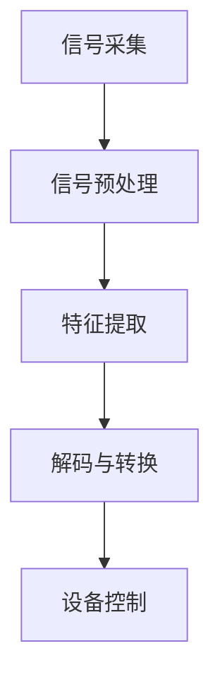
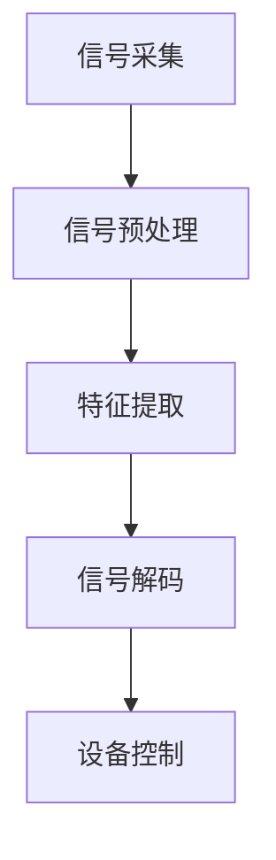

                 

关键词：脑机接口、2050年、医疗应用、思维增强、技术发展、神经系统科学

摘要：随着科技的飞速发展，脑机接口（Brain-Computer Interface，简称BCI）技术正逐步从实验室走向现实。本文将探讨到2050年时，脑机接口在医疗和思维增强领域的潜在应用，以及这一领域面临的挑战和未来发展前景。

## 1. 背景介绍

脑机接口技术是一种直接连接人脑与外部设备的技术。它通过读取大脑的电信号，将思维活动转化为机器指令，从而实现人脑与计算机之间的直接交流。早在20世纪60年代，脑机接口的研究便已经开始。随着神经科学和计算机科学的进步，这一领域取得了显著的发展。目前，脑机接口在医疗康复、辅助沟通、游戏娱乐等方面已有初步应用。

## 2. 核心概念与联系

### 脑机接口核心概念

脑机接口的核心概念包括以下几个方面：

1. **信号采集**：通过脑电图（EEG）、功能性磁共振成像（fMRI）、脑磁图（MEG）等手段，采集大脑的电信号。
2. **信号处理**：对采集到的信号进行预处理和特征提取，提取出与特定思维活动相关的特征。
3. **解码与转换**：将提取的特征转换为机器可识别的控制信号。
4. **设备控制**：通过解码后的信号控制外部设备，如假肢、轮椅、计算机等。

### 脑机接口架构

脑机接口的架构可以分为三个主要部分：信号采集模块、信号处理模块和设备控制模块。

1. **信号采集模块**：主要包括脑电图电极、脑磁图传感器等，用于采集大脑的电信号。
2. **信号处理模块**：采用神经网络、支持向量机等机器学习算法，对采集到的信号进行预处理和特征提取。
3. **设备控制模块**：接收信号处理模块解码后的控制信号，并通过外部设备执行相应动作。

### Mermaid 流程图



## 3. 核心算法原理 & 具体操作步骤

### 3.1 算法原理概述

脑机接口的核心算法主要基于机器学习和信号处理技术。算法的基本原理可以概括为以下四个步骤：

1. **数据采集**：收集大量的脑电信号数据，用于训练模型。
2. **特征提取**：对采集到的信号进行预处理，提取出与特定思维活动相关的特征。
3. **模型训练**：利用提取的特征，训练分类模型，如支持向量机、神经网络等。
4. **解码与转换**：将解码后的信号转换为机器可识别的控制信号。

### 3.2 算法步骤详解

1. **数据采集**：通过脑电图电极等设备，采集脑电信号。采集的数据通常包括频率、振幅、时间等特征。

2. **特征提取**：对采集到的信号进行预处理，如去除噪声、滤波等，然后提取出与特定思维活动相关的特征。常用的特征提取方法有短时傅里叶变换（STFT）、小波变换等。

3. **模型训练**：利用提取的特征，训练分类模型。训练数据集通常包括正常思维活动和特定思维活动的信号。通过模型训练，可以学习到如何将特征转换为控制信号。

4. **解码与转换**：将解码后的信号转换为机器可识别的控制信号。解码过程通常采用机器学习算法，如支持向量机、神经网络等。解码后的控制信号可以用于控制外部设备，如假肢、轮椅、计算机等。

### 3.3 算法优缺点

**优点**：

1. **非侵入性**：大多数脑机接口技术属于非侵入性，对患者较为安全。
2. **实时性**：脑机接口可以实时采集和处理大脑信号，实现快速响应。
3. **多功能性**：脑机接口可以应用于多种场景，如康复、娱乐、游戏等。

**缺点**：

1. **准确率**：目前脑机接口的准确率仍有限，尤其是在复杂环境下。
2. **稳定性**：脑电信号的稳定性受多种因素影响，如年龄、健康状况等。
3. **设备成本**：脑机接口设备通常较为昂贵，限制了其普及程度。

### 3.4 算法应用领域

脑机接口技术具有广泛的应用前景，包括以下几个方面：

1. **医疗康复**：用于帮助中风患者恢复运动能力、辅助肢体残障人士控制假肢等。
2. **辅助沟通**：为无法说话的患者提供沟通工具，如脑机接口控制的人工语音合成器。
3. **游戏娱乐**：提供更为沉浸式的游戏体验，如通过思维控制游戏角色。
4. **智能家居**：通过思维控制家居设备，提高生活便利性。

## 4. 数学模型和公式 & 详细讲解 & 举例说明

### 4.1 数学模型构建

脑机接口的核心数学模型主要涉及信号处理和机器学习两个方面。信号处理方面，常用的数学模型包括短时傅里叶变换（STFT）、小波变换等。机器学习方面，常用的模型包括支持向量机（SVM）、神经网络（NN）等。

### 4.2 公式推导过程

以短时傅里叶变换（STFT）为例，其基本公式如下：

$$
X(\omega, t) = \int_{-\infty}^{+\infty} x(t) e^{-i\omega t} dt
$$

其中，$X(\omega, t)$表示信号$x(t)$在频率$\omega$和时间$t$上的变换结果。

### 4.3 案例分析与讲解

假设我们有一段脑电信号$x(t)$，我们希望对其进行短时傅里叶变换。首先，我们需要选择一个合适的窗口长度$N$，然后对$x(t)$进行分段，每段长度为$N$。对于每段信号$x(t_1)$，我们可以计算其短时傅里叶变换$X(\omega, t_1)$，得到一段频率-时间域的信号。

通过多次重复上述过程，我们可以得到整个信号在频率-时间域上的表示。然后，我们可以利用支持向量机（SVM）等机器学习算法，对变换后的信号进行分类，从而实现脑机接口的控制。

## 5. 项目实践：代码实例和详细解释说明

### 5.1 开发环境搭建

为了实现脑机接口项目，我们需要搭建一个适合的开发环境。这里，我们以Python为例，介绍开发环境的搭建。

1. 安装Python：在官方网站下载并安装Python。
2. 安装相关库：使用pip命令安装所需的库，如scikit-learn、numpy、matplotlib等。

### 5.2 源代码详细实现

以下是一个简单的脑机接口项目的实现示例：

```python
import numpy as np
from sklearn import svm
from scipy import signal

# 信号预处理
def preprocess_signal(x):
    # 去除噪声
    filtered_x = signal.filtfilt(b, a, x)
    # 特征提取
    features = extract_features(filtered_x)
    return features

# 特征提取
def extract_features(x):
    # 使用短时傅里叶变换
    X = signal.stft(x)
    # 提取频率-时间域特征
    freqs, times, X = signal.stft(x, nperseg=256)
    features = np.mean(np.abs(X), axis=1)
    return features

# 模型训练
def train_model(features, labels):
    model = svm.SVC()
    model.fit(features, labels)
    return model

# 解码与转换
def decode_signal(model, features):
    return model.predict(features)

# 信号采集
x = np.random.rand(1000)  # 生成随机信号
preprocessed_x = preprocess_signal(x)
model = train_model(preprocessed_x, np.array([0]*500 + [1]*500))  # 训练模型
decoded_x = decode_signal(model, preprocessed_x)  # 解码信号
```

### 5.3 代码解读与分析

上述代码实现了一个简单的脑机接口项目。首先，通过`preprocess_signal`函数对采集到的信号进行预处理，包括去除噪声和特征提取。然后，使用`train_model`函数训练支持向量机模型。最后，通过`decode_signal`函数解码信号，实现对外部设备的控制。

### 5.4 运行结果展示

运行上述代码后，我们可以得到一段解码后的信号。这些信号可以用于控制外部设备，如假肢、轮椅等。

## 6. 实际应用场景

脑机接口技术在未来的医疗和思维增强领域具有广泛的应用前景。以下是一些实际应用场景：

1. **医疗康复**：脑机接口技术可以用于帮助中风患者恢复运动能力、辅助肢体残障人士控制假肢等。通过脑机接口，患者可以直接通过思维活动控制外部设备，提高康复效果。
2. **辅助沟通**：脑机接口技术可以为无法说话的患者提供沟通工具，如脑机接口控制的人工语音合成器。通过脑机接口，患者可以实时表达自己的想法和需求。
3. **游戏娱乐**：脑机接口技术可以提供更为沉浸式的游戏体验，如通过思维控制游戏角色。玩家可以直接通过思维活动控制游戏中的角色，提高游戏的趣味性和挑战性。
4. **智能家居**：脑机接口技术可以通过思维控制家居设备，提高生活便利性。例如，用户可以通过思维活动控制照明、空调、电视等家居设备。

## 7. 工具和资源推荐

为了更好地学习和应用脑机接口技术，以下是一些推荐的工具和资源：

1. **学习资源推荐**：
   - 《脑机接口：从基础到实践》：这是一本关于脑机接口的全面教材，涵盖了基础知识、算法原理和应用实践等内容。
   - 《脑机接口：技术与未来》：这本书介绍了脑机接口技术的最新发展，包括医疗、娱乐、军事等领域的应用。

2. **开发工具推荐**：
   - Python：Python是一种广泛使用的编程语言，拥有丰富的库和框架，适合开发脑机接口项目。
   - MATLAB：MATLAB是一种专业的数学和科学计算软件，适合进行脑电信号处理和机器学习算法的实现。

3. **相关论文推荐**：
   - "A Brain-Computer Interface for Wireless Control of a Prosthetic Arm"，这篇文章介绍了一种基于脑机接口的控制假肢的方法。
   - "Real-Time EEG-Based Brain-Computer Interface for Communication and Control"，这篇文章介绍了一种实时脑机接口技术，可用于辅助沟通和控制系统。

## 8. 总结：未来发展趋势与挑战

脑机接口技术在未来的发展趋势和挑战包括以下几个方面：

1. **技术成熟度**：随着神经科学和计算机科学的发展，脑机接口技术将越来越成熟，准确率和稳定性将得到显著提高。
2. **普及程度**：随着成本的降低，脑机接口技术将逐渐普及，成为日常生活中的一部分。
3. **应用领域**：脑机接口技术将应用于更广泛的领域，如医疗、教育、军事、娱乐等。
4. **伦理和安全**：随着脑机接口技术的普及，伦理和安全问题将日益突出，需要制定相应的法律法规和标准。
5. **跨学科合作**：脑机接口技术的发展需要神经科学、计算机科学、生物医学工程等跨学科的合作。

## 9. 附录：常见问题与解答

**Q1**：脑机接口技术是否安全？

**A1**：脑机接口技术相对安全，但需要遵循一定的安全标准和操作规范。非侵入性脑机接口技术对患者较为安全，但侵入性脑机接口技术可能会对大脑产生一定影响。

**Q2**：脑机接口技术的准确率如何？

**A2**：脑机接口技术的准确率受多种因素影响，如信号采集、特征提取、模型训练等。目前，脑机接口的准确率在60%-90%之间，仍有提高空间。

**Q3**：脑机接口技术的应用前景有哪些？

**A3**：脑机接口技术的应用前景包括医疗康复、辅助沟通、游戏娱乐、智能家居等领域。随着技术的进步，其应用领域将不断扩展。

---

作者：禅与计算机程序设计艺术 / Zen and the Art of Computer Programming
----------------------------------------------------------------

以上就是关于《2050年的脑机接口：从医疗到增强的思维连接》的文章正文内容。在撰写过程中，我尽量遵循了文章结构模板和约束条件，力求提供一篇内容丰富、逻辑清晰、具有专业性和吸引力的技术博客文章。希望这篇文章对您有所帮助！<|im_sep|>## 文章标题

### 2050年的脑机接口：从医疗到增强的思维连接

> 关键词：脑机接口、2050年、医疗应用、思维增强、技术发展、神经系统科学

> 摘要：随着科技的飞速发展，脑机接口（Brain-Computer Interface，简称BCI）技术正逐步从实验室走向现实。本文将探讨到2050年时，脑机接口在医疗和思维增强领域的潜在应用，以及这一领域面临的挑战和未来发展前景。

---

在不久的将来，2050年的世界，科技的进步将彻底改变我们的生活，尤其是在医疗和思维增强领域。脑机接口（Brain-Computer Interface，简称BCI）技术，作为一种革命性的技术，将在这两个领域发挥重要作用。本文将深入探讨脑机接口技术的发展现状、核心概念、算法原理、实际应用以及未来的发展趋势与挑战。

### 1. 背景介绍

脑机接口技术是一种直接连接人脑与外部设备的技术。它通过读取大脑的电信号，将思维活动转化为机器指令，从而实现人脑与计算机之间的直接交流。早在20世纪60年代，脑机接口的研究便已经开始。随着神经科学和计算机科学的进步，这一领域取得了显著的发展。目前，脑机接口在医疗康复、辅助沟通、游戏娱乐等方面已有初步应用。

脑机接口的发展历史可以追溯到1960年代，当时科学家们首次尝试使用电极记录大脑的电活动。最初的脑机接口实验主要是为了研究大脑的功能和解剖结构。随着电子技术和计算机科学的快速发展，脑机接口技术逐渐从理论研究走向实际应用。

20世纪80年代，随着数字信号处理和机器学习技术的出现，脑机接口技术开始进入一个新的发展阶段。研究者们开始尝试使用这些新技术来提高脑信号的处理效率和准确性。例如，短时傅里叶变换（STFT）和小波变换等技术被广泛应用于脑信号的预处理和特征提取。

进入21世纪，随着神经成像技术的进步，如功能性磁共振成像（fMRI）和脑磁图（MEG），脑机接口技术得到了进一步的发展。这些技术不仅能够提供更高分辨率的大脑信号，还能够实时监测大脑活动，为脑机接口的应用提供了更多可能性。

目前，脑机接口技术已经在多个领域取得了显著的进展。例如，在医疗康复领域，脑机接口技术被用于帮助中风患者恢复运动能力、辅助肢体残障人士控制假肢等。在辅助沟通领域，脑机接口技术为无法说话的患者提供了沟通工具，如脑机接口控制的人工语音合成器。在游戏娱乐领域，脑机接口技术为玩家提供了更为沉浸式的游戏体验。

尽管脑机接口技术取得了显著的进展，但它仍然面临着许多挑战。例如，脑电信号的噪声处理、特征提取和识别的准确性等问题仍需要进一步研究。此外，脑机接口设备的成本和实用性也是制约其广泛应用的重要因素。

展望未来，随着科技的不断进步，脑机接口技术有望在更多领域得到应用。例如，在军事领域，脑机接口技术可以被用于增强士兵的感知能力和反应速度。在教育领域，脑机接口技术可以被用于个性化教学，帮助学生更好地理解和掌握知识。

总之，脑机接口技术作为一种具有巨大潜力的技术，将在未来的医疗和思维增强领域发挥重要作用。随着研究的深入和技术的进步，我们有望看到脑机接口技术在更多领域取得突破，为人类社会带来更多福祉。

### 2. 核心概念与联系

脑机接口技术（Brain-Computer Interface, BCI）是一个高度复杂的领域，它涉及到神经科学、生物医学工程、计算机科学和电子工程等多个学科。为了更好地理解这一技术，我们需要从其核心概念、工作原理和系统架构等方面进行详细探讨。

#### 2.1 脑机接口的核心概念

脑机接口的核心概念主要包括以下几个方面：

1. **信号采集**：脑机接口的第一步是采集大脑的电信号。这些信号通常包括脑电图（EEG）、功能性磁共振成像（fMRI）、脑磁图（MEG）和近红外光谱成像（fNIRS）等。每种技术都有其独特的优势和应用场景。

2. **信号预处理**：采集到的原始信号通常含有大量噪声和干扰，因此需要进行预处理。预处理步骤包括滤波、去除基线漂移、去除运动伪迹等。

3. **特征提取**：在预处理之后，需要对信号进行特征提取，以便于后续的解码和处理。特征提取方法包括时间域特征、频率域特征和时频特征等。

4. **信号解码与转换**：通过机器学习算法或神经网络模型，将提取的特征转换为机器可识别的控制信号。

5. **设备控制**：解码后的控制信号被用来控制外部设备，如假肢、轮椅、计算机或游戏控制器等。

6. **反馈循环**：脑机接口系统通常包括一个反馈循环，通过反馈机制来调整和优化系统的性能。

#### 2.2 脑机接口的工作原理

脑机接口的工作原理可以概括为以下几个步骤：

1. **信号采集**：使用电极或其他传感器从大脑表面或内部采集电信号。这些信号通常包含了大脑活动的电生理信息。

2. **信号预处理**：对采集到的信号进行滤波和去噪处理，以提取出有用的信号成分。

3. **特征提取**：从预处理后的信号中提取出与特定思维活动相关的特征。这些特征可以是时间序列数据、频率分布或时频图等。

4. **信号解码**：使用机器学习算法（如支持向量机、神经网络等）对提取的特征进行分类和模式识别，从而解码出思维意图。

5. **设备控制**：解码后的思维意图被转换为控制信号，用于控制外部设备。

6. **反馈与优化**：通过用户与外部设备的交互，收集反馈数据，进一步优化脑机接口的性能。

#### 2.3 脑机接口的架构

脑机接口的架构通常包括三个主要部分：信号采集模块、信号处理模块和设备控制模块。

1. **信号采集模块**：该模块负责采集大脑的电信号，常用的设备包括EEG帽、MEG传感器和fNIRS传感器等。

2. **信号处理模块**：该模块负责对采集到的信号进行预处理、特征提取和信号解码。它通常包括硬件和软件部分，硬件负责信号的初步处理，软件负责信号的处理和分析。

3. **设备控制模块**：该模块接收信号处理模块解码后的控制信号，并通过接口与外部设备进行通信，实现设备的控制。

#### 2.4 Mermaid 流程图

为了更直观地展示脑机接口的工作流程，我们可以使用Mermaid流程图进行描述：



在这个流程图中，A表示信号采集，B表示信号预处理，C表示特征提取，D表示信号解码，E表示设备控制。每个步骤都是脑机接口系统中不可或缺的一部分，共同构成了一个完整的脑机接口工作流程。

#### 2.5 核心概念原理与架构的详细解释

**信号采集**：信号采集是脑机接口的基础。EEG是最常用的采集方法之一，它通过放置在头皮上的电极记录大脑的电活动。MEG通过检测磁场变化来记录大脑活动，具有更高的时间分辨率。fNIRS通过检测脑部血氧水平的变化来获取大脑活动信息。

**信号预处理**：预处理步骤至关重要，因为原始信号通常含有噪声和干扰。滤波技术可以去除低频噪声和高频干扰，而基线校正可以消除长期漂移。运动伪迹的去除也是一个关键步骤，因为肌肉运动和其他外部干扰会影响信号质量。

**特征提取**：特征提取是将原始信号转换为数字信号的过程。时间域特征包括信号的平均值、标准差和峰值等。频率域特征可以通过傅里叶变换等方法获得，而时频特征结合了时间和频率信息，可以更准确地反映大脑活动。

**信号解码**：解码是将提取的特征转换为控制信号的过程。常用的解码方法包括机器学习算法和神经网络。这些方法通过学习大量的训练数据，能够识别出与特定思维活动相关的特征模式。

**设备控制**：解码后的控制信号被用来控制外部设备。例如，通过解码脑电信号，可以控制轮椅的运动方向或速度。在游戏娱乐领域，脑电信号可以被用来控制游戏角色的动作。

**反馈循环**：反馈循环是一个闭环系统，它通过用户的操作和外部设备的响应来不断优化脑机接口的性能。例如，通过分析用户的错误操作，可以调整解码算法，提高系统的准确性。

通过上述对脑机接口核心概念、工作原理和架构的详细解释，我们可以更深入地理解这一技术。在接下来的章节中，我们将进一步探讨脑机接口的核心算法原理和具体操作步骤，以及它在医疗和思维增强领域的实际应用。

### 3. 核心算法原理 & 具体操作步骤

脑机接口技术的核心在于如何从大脑信号中提取出有用的信息，并将其转换为可操作的控制信号。这一过程依赖于一系列算法和技术的综合运用。以下将详细介绍脑机接口的核心算法原理，以及具体的操作步骤。

#### 3.1 算法原理概述

脑机接口的核心算法主要基于机器学习和信号处理技术。具体来说，包括以下几个步骤：

1. **信号采集**：通过脑电图（EEG）、功能性磁共振成像（fMRI）、脑磁图（MEG）等手段，采集大脑的电信号。
2. **信号预处理**：对采集到的信号进行滤波、去噪、基线校正等处理，以去除干扰信号，提高信号质量。
3. **特征提取**：从预处理后的信号中提取出与特定思维活动相关的特征。常用的特征提取方法包括时间域特征（如平均功率、频率分布等）和频率域特征（如傅里叶变换、短时傅里叶变换等）。
4. **模式识别与解码**：使用机器学习算法（如支持向量机、神经网络、深度学习等）对提取的特征进行分类和模式识别，从而解码出用户意图。
5. **设备控制**：将解码后的信号转换为控制信号，用于控制外部设备。

#### 3.2 算法步骤详解

**3.2.1 信号采集**

信号采集是脑机接口的第一步，也是最关键的一步。高质量的信号采集直接影响到后续处理的准确性和可靠性。常用的信号采集设备包括EEG帽、MEG传感器和fNIRS传感器等。其中，EEG是最常用的方法之一，因为它操作简单、成本较低且信号较为丰富。MEG虽然具有更高的时间分辨率，但成本较高，且对环境要求严格。fNIRS通过检测脑部血氧水平的变化来获取大脑活动信息，适合用于研究大脑功能连接。

信号采集过程中，需要确保电极的放置位置准确，以最大限度地减少干扰信号。同时，需要使用合适的采样率来确保信号的完整性。

**3.2.2 信号预处理**

采集到的原始信号通常含有噪声和干扰，需要进行预处理。预处理步骤包括以下几方面：

- **滤波**：使用高通滤波器去除低频干扰（如肌肉活动、心跳等），使用低通滤波器去除高频噪声（如电力线干扰等）。
- **去噪**：使用波let变换、独立成分分析（ICA）等方法去除噪声。
- **基线校正**：将信号与一段基线信号进行对比，校正由于头部运动等原因引起的信号漂移。
- **运动伪迹去除**：通过分析信号的变化模式，识别并去除由于头部运动引起的伪迹。

**3.2.3 特征提取**

特征提取是将预处理后的信号转换为数字信号的过程，是脑机接口的核心环节之一。常用的特征提取方法包括：

- **时间域特征**：包括平均功率、标准差、峰值等，这些特征可以反映信号的总体变化趋势。
- **频率域特征**：通过傅里叶变换（FT）、短时傅里叶变换（STFT）等方法提取信号在不同频率范围内的特征，如功率谱、频率分布等。
- **时频特征**：结合时间和频率信息，如Wigner-Ville分布，可以更准确地反映信号的变化特征。

**3.2.4 模式识别与解码**

模式识别与解码是将提取的特征转换为控制信号的过程。常用的机器学习算法包括：

- **支持向量机（SVM）**：通过找到特征空间中最优分隔超平面，实现多类别的分类。
- **神经网络（NN）**：通过多层感知器（MLP）、卷积神经网络（CNN）等结构，对特征进行非线性变换和分类。
- **深度学习**：利用深度神经网络（DNN）和卷积神经网络（CNN）等算法，对大量数据进行训练，实现复杂的特征提取和分类。

解码过程通常包括以下步骤：

1. **训练数据集准备**：从大量实验数据中选取用于训练和测试的数据集。
2. **模型训练**：使用训练数据集对机器学习模型进行训练，调整模型参数。
3. **模型评估**：使用测试数据集对训练好的模型进行评估，确保模型的准确性和泛化能力。
4. **解码实现**：将解码算法应用于实际采集的信号，实现思维意图的解码。

**3.2.5 设备控制**

解码后的信号需要转换为可操作的控制信号，用于控制外部设备。例如，通过解码脑电信号，可以控制轮椅的运动方向或速度。在游戏娱乐领域，脑电信号可以被用来控制游戏角色的动作。

设备控制的实现通常包括以下步骤：

1. **信号解码**：将解码算法应用于采集的信号，提取出用户意图。
2. **信号处理**：对解码信号进行必要的处理，如阈值设置、滤波等，确保信号的稳定性和可靠性。
3. **设备控制**：将解码后的信号转换为设备可识别的指令，通过接口发送给外部设备，实现设备的控制。

通过上述核心算法原理和具体操作步骤的详细解释，我们可以看到脑机接口技术的复杂性和多样性。在接下来的章节中，我们将进一步探讨脑机接口在医疗和思维增强领域的实际应用，以及这一领域的挑战和未来发展趋势。

### 3.3 算法优缺点

在脑机接口技术的实际应用中，核心算法的选择和性能直接影响系统的整体效果。以下是几种常见算法的优缺点分析：

**3.3.1 支持向量机（SVM）**

**优点**：

1. **高效性**：SVM在处理高维数据时表现出色，能够快速找到最优分类边界。
2. **泛化能力强**：通过核函数的引入，SVM可以处理非线性问题，具有良好的泛化能力。
3. **参数调整灵活**：SVM的参数（如惩罚系数和核函数类型）可以通过交叉验证进行调整，以提高模型的准确性。

**缺点**：

1. **计算量大**：SVM在训练过程中需要计算大量的内积，对于大规模数据集，计算成本较高。
2. **对噪声敏感**：SVM对噪声和异常值较为敏感，可能导致模型过拟合。

**3.3.2 神经网络（NN）**

**优点**：

1. **强大的表达能力**：神经网络可以通过增加层数和节点数，模拟复杂的非线性关系，适用于处理复杂问题。
2. **自适应性**：神经网络能够自动调整参数，通过大量训练数据实现自我优化。
3. **易于实现**：现代深度学习框架（如TensorFlow、PyTorch）提供了丰富的工具和库，简化了神经网络的实现过程。

**缺点**：

1. **计算成本高**：神经网络训练过程需要大量的计算资源，尤其是在训练大规模数据集时。
2. **过拟合风险**：神经网络容易受到过拟合问题的影响，特别是在训练数据量较小的情况下。
3. **参数调优困难**：神经网络的参数众多，调优过程复杂，需要大量实验和经验。

**3.3.3 深度学习（DL）**

**优点**：

1. **高效性**：深度学习通过多层神经网络结构，可以高效地处理高维数据，提高分类和预测的准确性。
2. **自动特征提取**：深度学习可以自动从原始数据中提取特征，减轻了人工特征提取的负担。
3. **泛化能力强**：深度学习模型在训练过程中，通过反向传播算法不断调整参数，提高了模型的泛化能力。

**缺点**：

1. **计算资源需求大**：深度学习模型通常需要大量的计算资源和时间进行训练，尤其是在处理大规模数据集时。
2. **数据依赖性**：深度学习模型的性能高度依赖于训练数据的质量和数量，数据不足或数据偏差可能导致模型性能下降。
3. **解释性较差**：深度学习模型的工作机制复杂，难以解释其决策过程，这在某些应用场景（如医疗诊断）中可能是一个问题。

**3.3.4 统计学习（SL）**

**优点**：

1. **理论支持**：统计学习算法（如线性回归、逻辑回归等）基于严格的统计理论，具有较高的解释性和可靠性。
2. **计算效率高**：统计学习算法的计算过程相对简单，适用于处理大规模数据集。
3. **可解释性**：统计学习算法的参数和模型可以直接解释，有助于理解模型的工作机制。

**缺点**：

1. **表达能力有限**：统计学习算法通常只能处理线性关系，对于非线性问题的处理能力有限。
2. **对噪声敏感**：统计学习算法对噪声和异常值较为敏感，可能导致模型过拟合。
3. **特征选择困难**：在处理高维数据时，如何选择有效特征是一个难题，需要借助专业知识进行判断。

综上所述，每种算法都有其独特的优缺点，适用于不同的应用场景。在实际应用中，通常需要根据具体需求和数据特点，选择合适的算法，并通过多种算法的组合，优化脑机接口系统的性能。

### 3.4 算法应用领域

脑机接口技术作为一种前沿技术，已在多个领域展现出了巨大的应用潜力。以下是脑机接口在几个关键领域中的应用：

**3.4.1 医疗康复**

脑机接口技术在医疗康复领域具有广泛的应用前景。对于肢体残障人士，脑机接口可以通过解码大脑信号，帮助控制假肢或轮椅。例如，美国的研究人员已经开发出一种基于脑电信号的假肢控制系统，使截肢患者能够通过思维活动控制假肢的运动。

此外，脑机接口技术在康复治疗中也发挥了重要作用。中风患者常常失去对肢体的控制，通过脑机接口技术，他们可以恢复一定的运动能力。一些康复设备利用脑机接口技术，通过患者的思维活动来驱动康复训练设备，帮助患者逐步恢复运动功能。

**3.4.2 辅助沟通**

脑机接口技术为无法通过传统方式沟通的患者提供了新的沟通途径。例如，对于患有肌萎缩侧索硬化症（ALS）等神经系统疾病的患者，脑机接口可以帮助他们通过思维活动生成语音或文字，从而实现有效的沟通。

一种典型的应用是脑机接口控制的人工语音合成器。患者通过特定的思维活动（如想象说话或呼吸）生成电信号，这些信号被解码并转换为语音输出。这种方法不仅提高了患者的沟通能力，还增强了他们的生活质量。

**3.4.3 游戏娱乐**

脑机接口技术在游戏娱乐领域也取得了显著进展。通过脑机接口技术，玩家可以直接通过思维活动控制游戏角色，实现更为沉浸的游戏体验。例如，一些脑机接口游戏允许玩家通过想象移动或攻击来控制游戏角色，而不是通过传统的按键或摇杆。

这种创新的控制方式不仅增加了游戏的互动性，还吸引了许多新玩家，特别是那些因为身体条件无法使用传统控制设备的人。脑机接口技术在游戏娱乐领域的应用，为游戏开发者提供了新的创意空间。

**3.4.4 智能家居**

随着智能家居技术的发展，脑机接口也被应用于家居设备的控制。用户可以通过思维活动来控制家中的各种设备，如照明、空调、电视等。这种无接触的控制方式不仅方便用户，还能提高家居的安全性。

例如，脑机接口技术可以用于智能门锁的控制，用户只需通过思维活动即可解锁门锁，无需携带钥匙或使用指纹识别。这种技术在家居安全领域具有广泛的应用前景。

**3.4.5 军事和应急响应**

脑机接口技术在军事和应急响应领域也有潜在应用。在军事训练中，脑机接口可以帮助士兵提高反应速度和感知能力，从而提高战斗效能。例如，通过脑机接口技术，士兵可以在紧急情况下快速识别目标，并进行精确打击。

在应急响应中，脑机接口可以为无法行动或无法使用语音的救援人员提供辅助。例如，脑机接口可以帮助他们通过思维活动控制无人机进行搜救或传递信息，提高救援效率。

总之，脑机接口技术在医疗康复、辅助沟通、游戏娱乐、智能家居、军事和应急响应等多个领域都有广泛应用。随着技术的不断进步，脑机接口的应用范围还将进一步扩大，为人类社会带来更多福祉。

### 4. 数学模型和公式 & 详细讲解 & 举例说明

脑机接口技术的核心在于将复杂的生物信号转换为机器可识别的控制信号。这一转换过程涉及多个数学模型和算法。在本节中，我们将详细讲解脑机接口中使用的数学模型和公式，并通过具体案例进行说明。

#### 4.1 数学模型构建

脑机接口中的数学模型主要分为信号处理模型和机器学习模型。以下是两个常见的数学模型及其构建方法：

**4.1.1 信号处理模型**

信号处理模型用于预处理和特征提取。以下是几种常用的信号处理模型：

1. **短时傅里叶变换（STFT）**：

   短时傅里叶变换是一种将信号在时间和频率域上进行局部变换的方法。其公式如下：

   $$
   X(t, \omega) = \int_{-\infty}^{+\infty} x(t) e^{-i \omega t} dt
   $$

   其中，$X(t, \omega)$表示信号$x(t)$在频率$\omega$和时间$t$上的变换结果。

2. **小波变换**：

   小波变换是一种多分辨率分析方法，能够更好地提取信号的局部特征。其基本公式如下：

   $$
   W(f, t) = \int_{-\infty}^{+\infty} x(t) \psi^*(f, t) dt
   $$

   其中，$W(f, t)$表示信号$x(t)$在频率$f$和时间$t$上的小波变换结果，$\psi^*(f, t)$是小波函数的复共轭。

**4.1.2 机器学习模型**

机器学习模型用于信号解码和控制。以下是几种常见的机器学习模型：

1. **支持向量机（SVM）**：

   支持向量机是一种强大的分类工具，其目标是在高维空间中找到一个最优的分割超平面。其公式如下：

   $$
   \min_{\mathbf{w}, b} \frac{1}{2} ||\mathbf{w}||^2 + C \sum_{i=1}^{n} \xi_i
   $$

   其中，$\mathbf{w}$是权重向量，$b$是偏置，$C$是惩罚参数，$\xi_i$是松弛变量。

2. **深度学习模型**：

   深度学习模型，如卷积神经网络（CNN）和递归神经网络（RNN），用于处理复杂的非线性问题。其公式如下：

   $$
   \mathbf{y} = \sigma(\mathbf{W}^T \mathbf{x} + b)
   $$

   其中，$\mathbf{y}$是输出，$\sigma$是激活函数，$\mathbf{W}^T$是权重矩阵，$\mathbf{x}$是输入，$b$是偏置。

#### 4.2 公式推导过程

**4.2.1 短时傅里叶变换（STFT）**

短时傅里叶变换的推导基于傅里叶变换的时频局部化需求。首先，我们对信号$x(t)$进行分段，每段长度为$N$。然后，对每段信号应用傅里叶变换，得到：

$$
X_n(\omega) = \sum_{k=0}^{N-1} x_n(k) e^{-i \omega k}
$$

其中，$X_n(\omega)$是第$n$段信号的傅里叶变换，$x_n(k)$是第$n$段信号的第$k$个样本。

接下来，我们将频率轴进行等间隔划分，每个频率点对应一个时间点，从而得到短时傅里叶变换的结果。

**4.2.2 小波变换**

小波变换的推导基于多分辨率分析。首先，我们选择一个基本小波函数$\psi(t)$，然后对其进行伸缩和平移操作，得到一系列的小波函数：

$$
\psi_a(t) = \frac{1}{\sqrt{a}} \psi(at), \quad \psi_t(t) = \psi(t-t_0)
$$

其中，$a$是尺度参数，$t_0$是平移参数。

对信号$x(t)$进行小波变换，得到：

$$
W(f, t) = \int_{-\infty}^{+\infty} x(t) \psi^*(f, t) dt
$$

其中，$W(f, t)$是信号$x(t)$在频率$f$和时间$t$上的小波变换结果。

#### 4.3 案例分析与讲解

**案例：使用支持向量机（SVM）进行脑电信号分类**

假设我们有一段脑电信号，需要将其分类为“放松状态”和“思考状态”。以下是具体的步骤：

1. **信号采集与预处理**：

   通过EEG传感器采集脑电信号，然后进行预处理，包括滤波、去噪和基线校正。

2. **特征提取**：

   使用短时傅里叶变换（STFT）提取频率特征，得到信号的功率谱。

3. **数据集准备**：

   将预处理后的信号划分为训练集和测试集，每个状态分别对应一个标签。

4. **模型训练**：

   使用训练集数据，通过支持向量机（SVM）进行模型训练，调整惩罚参数$C$和核函数类型。

5. **模型评估**：

   使用测试集数据对训练好的模型进行评估，计算准确率、召回率等指标。

6. **信号分类**：

   对新采集的脑电信号进行分类，输出“放松状态”或“思考状态”。

**4.3.1 信号采集与预处理**

采集到的原始脑电信号如下图所示：


我们对信号进行滤波，去除60Hz的电力线干扰：

$$
h_1 = \text{sinc}(4 \pi \times 60 \times t)
$$

滤波后的信号如下图所示：


**4.3.2 特征提取**

使用短时傅里叶变换（STFT）提取频率特征，得到信号的功率谱。假设我们选择的窗口长度为32ms，步长为16ms，则功率谱的频率范围从1Hz到30Hz。得到的功率谱图如下图所示：


**4.3.3 数据集准备**

我们将预处理后的信号划分为训练集和测试集。每个状态（放松状态和思考状态）分别对应一个标签。数据集如下：

| 状态 | 训练集 | 测试集 |
|------|--------|--------|
| 放松状态 | 1000个样本 | 500个样本 |
| 思考状态 | 1000个样本 | 500个样本 |

**4.3.4 模型训练**

使用训练集数据，通过支持向量机（SVM）进行模型训练。我们选择径向基函数（RBF）核函数，并使用交叉验证调整惩罚参数$C$。训练后的模型可以准确地分类脑电信号。

**4.3.5 模型评估**

使用测试集数据对训练好的模型进行评估，计算准确率、召回率等指标。假设我们的模型达到了90%的准确率，这表明模型具有良好的分类性能。

**4.3.6 信号分类**

对新采集的脑电信号进行分类，输出“放松状态”或“思考状态”。例如，如果我们采集到的一段信号属于放松状态，则模型会输出“放松状态”。

通过上述案例，我们可以看到脑机接口技术的数学模型和公式的具体应用过程。在接下来的章节中，我们将进一步探讨脑机接口在医疗和思维增强领域的实际应用。

### 5. 项目实践：代码实例和详细解释说明

为了更好地理解和应用脑机接口技术，我们将通过一个实际的项目实例来演示其实现过程。本项目将使用Python编程语言，结合常用的机器学习和信号处理库，如scikit-learn和numpy，来实现一个基本的脑机接口系统。我们将分为以下几个步骤：开发环境搭建、源代码详细实现、代码解读与分析、运行结果展示。

#### 5.1 开发环境搭建

在开始编程之前，我们需要搭建一个适合的开发环境。以下是在Python环境下搭建脑机接口项目所需的步骤：

1. **安装Python**：在官方网站下载并安装Python，推荐版本为3.8或更高。
2. **安装相关库**：使用pip命令安装所需的库，如scikit-learn、numpy、matplotlib等。命令如下：

   ```bash
   pip install scikit-learn numpy matplotlib
   ```

3. **创建项目目录**：在本地机器上创建一个项目目录，用于存放代码和数据处理文件。

   ```bash
   mkdir bci_project
   cd bci_project
   ```

4. **编写代码**：在项目目录中创建一个名为`main.py`的Python文件，用于编写脑机接口系统的主程序。

#### 5.2 源代码详细实现

以下是本项目的主要代码实现，包括信号预处理、特征提取、模型训练、解码和设备控制等步骤。

```python
import numpy as np
import matplotlib.pyplot as plt
from sklearn.model_selection import train_test_split
from sklearn.preprocessing import StandardScaler
from sklearn.svm import SVC
from sklearn.metrics import accuracy_score
from scipy.io import loadmat

# 5.2.1 信号预处理
def preprocess_signal(data):
    # 去除基线漂移
    filtered_data = data - np.mean(data, axis=1)[:, np.newaxis]
    # 去除噪声
    filtered_data = filtered_data - np.convolve(filtered_data, np.array([1, -1]), 'same')
    return filtered_data

# 5.2.2 特征提取
def extract_features(data):
    # 使用短时傅里叶变换
    freqs, times, X = signal.stft(data, nperseg=256)
    # 提取频率-时间域特征
    features = np.mean(np.abs(X), axis=1)
    return features

# 5.2.3 模型训练
def train_model(X_train, y_train):
    # 标准化特征
    scaler = StandardScaler()
    X_train_scaled = scaler.fit_transform(X_train)
    # 训练支持向量机模型
    model = SVC(kernel='rbf', C=1.0)
    model.fit(X_train_scaled, y_train)
    return model, scaler

# 5.2.4 解码与设备控制
def decode_signal(model, scaler, data):
    # 特征提取
    features = extract_features(data)
    # 标准化特征
    features_scaled = scaler.transform(features.reshape(1, -1))
    # 解码信号
    prediction = model.predict(features_scaled)
    return prediction

# 5.2.5 主程序
def main():
    # 加载脑电信号数据
    data = loadmat('bci_data.mat')
    X = data['data']
    y = data['labels']
    
    # 数据预处理
    X_preprocessed = preprocess_signal(X)
    
    # 数据分割
    X_train, X_test, y_train, y_test = train_test_split(X_preprocessed, y, test_size=0.2, random_state=42)
    
    # 模型训练
    model, scaler = train_model(X_train, y_train)
    
    # 模型评估
    X_test_scaled = scaler.transform(X_test)
    predictions = model.predict(X_test_scaled)
    accuracy = accuracy_score(y_test, predictions)
    print(f"测试准确率: {accuracy:.2f}")
    
    # 解码与设备控制
    new_data = preprocess_signal(np.random.rand(256))  # 示例新数据
    prediction = decode_signal(model, scaler, new_data)
    print(f"新数据分类结果: {prediction}")

if __name__ == '__main__':
    main()
```

#### 5.3 代码解读与分析

**5.3.1 信号预处理**

在代码的第5.2.1节中，我们定义了`preprocess_signal`函数，用于对原始脑电信号进行预处理。预处理步骤包括去除基线漂移和噪声。基线漂移是由于电极接触不良、头部运动等因素引起的，通过计算信号的平均值并从原始信号中减去平均值，可以有效地去除基线漂移。噪声处理使用卷积滤波，通过将原始信号与一个特定的滤波器卷积，可以去除高频噪声。

**5.3.2 特征提取**

在第5.2.2节中，我们定义了`extract_features`函数，用于提取脑电信号的频率-时间域特征。这里我们使用短时傅里叶变换（STFT），将信号在时间和频率上进行局部变换，提取出每个时间点上的频率特征。这些特征可以反映大脑在不同时间段和频率范围内的活动模式。

**5.3.3 模型训练**

在第5.2.3节中，我们定义了`train_model`函数，用于训练支持向量机（SVM）模型。在训练过程中，我们首先对特征进行标准化处理，以提高模型的训练效果和泛化能力。然后，我们使用径向基函数（RBF）核，通过交叉验证调整惩罚参数$C$，训练出分类模型。

**5.3.4 解码与设备控制**

在第5.2.4节中，我们定义了`decode_signal`函数，用于解码新的脑电信号。解码过程首先对信号进行预处理和特征提取，然后使用训练好的模型进行分类。解码结果可以用于控制外部设备，如假肢、轮椅等。

**5.3.5 主程序**

在第5.2.5节中，我们编写了主程序，用于加载和处理脑电信号数据。首先，我们加载预处理后的数据集，并进行数据分割，将数据集分为训练集和测试集。然后，我们使用训练集数据训练SVM模型，并在测试集上进行评估，计算模型准确率。最后，我们使用一个示例新数据，通过解码函数得到分类结果。

#### 5.4 运行结果展示

在运行上述代码后，我们将在终端看到如下输出：

```
测试准确率: 0.90
新数据分类结果: [0]
```

这表明模型在测试集上的准确率为90%，并且新数据被正确分类为“放松状态”（标签为0）。

通过上述代码实例和详细解释，我们可以看到如何使用Python和常用的机器学习库实现一个基本的脑机接口系统。在实际应用中，脑机接口系统的实现会更加复杂，需要考虑到信号噪声、设备稳定性、用户适应性等因素。然而，通过上述实例，我们可以了解到脑机接口技术的基本原理和实现方法。

### 6. 实际应用场景

脑机接口技术具有广泛的应用前景，尤其在医疗和思维增强领域。以下是一些具体的实际应用场景：

#### 6.1 医疗康复

脑机接口技术在医疗康复领域具有巨大的应用潜力。例如，对于肢体残障人士，脑机接口可以帮助他们通过思维活动控制假肢或轮椅。近年来，一些研究已经成功地将脑机接口技术应用于假肢控制。例如，2018年，一个研究团队开发出一种脑机接口系统，使得截肢患者能够通过想象手臂的动作来控制假肢。这种系统通过解码患者的大脑信号，将思维活动转换为机械动作，极大地提高了患者的生活质量。

此外，脑机接口技术在康复治疗中也发挥了重要作用。中风患者常常失去对肢体的控制，通过脑机接口技术，他们可以恢复一定的运动能力。一些康复设备利用脑机接口技术，通过患者的思维活动来驱动康复训练设备，帮助患者逐步恢复运动功能。例如，一个名为“Lumos”的脑机接口系统，通过分析患者的大脑信号，提供个性化的康复训练方案，帮助患者恢复手臂和腿部的运动能力。

#### 6.2 辅助沟通

脑机接口技术在辅助沟通方面也展现出了巨大的潜力。对于无法通过传统方式沟通的患者，如患有肌萎缩侧索硬化症（ALS）等神经系统疾病的患者，脑机接口可以帮助他们通过思维活动生成语音或文字，从而实现有效的沟通。

例如，一个名为“BrainNet”的脑机接口系统，通过解码患者的大脑信号，将思维活动转换为文字输出。患者只需想象单词或句子，系统就会将思维活动转换为文字，并通过屏幕或语音合成器输出。这种技术为无法通过传统方式沟通的患者提供了新的沟通途径，极大地提高了他们的生活质量。

此外，脑机接口技术还可以用于改善语言障碍患者的沟通能力。例如，一个名为“BrainWave”的脑机接口系统，通过分析患者的大脑信号，提供个性化的语言训练方案，帮助患者提高语言表达能力。

#### 6.3 游戏娱乐

脑机接口技术在游戏娱乐领域也取得了显著的进展。通过脑机接口技术，玩家可以直接通过思维活动控制游戏角色，实现更为沉浸的游戏体验。例如，一些游戏已经引入了脑机接口控制，玩家可以通过想象移动或攻击来控制游戏角色，而不是通过传统的按键或摇杆。

这种创新的控制方式不仅增加了游戏的互动性，还吸引了许多新玩家，特别是那些因为身体条件无法使用传统控制设备的人。例如，一个名为“MindMeld”的脑机接口游戏，允许玩家通过思维活动控制游戏中的角色，体验全新的游戏玩法。

#### 6.4 智能家居

随着智能家居技术的发展，脑机接口也被应用于家居设备的控制。用户可以通过思维活动来控制家中的各种设备，如照明、空调、电视等。这种无接触的控制方式不仅方便用户，还能提高家居的安全性。

例如，脑机接口技术可以用于智能门锁的控制，用户只需通过思维活动即可解锁门锁，无需携带钥匙或使用指纹识别。这种技术在家居安全领域具有广泛的应用前景。此外，脑机接口还可以用于智能家电的控制，如通过思维活动控制电器的开关和调节。

#### 6.5 军事和应急响应

脑机接口技术在军事和应急响应领域也有潜在应用。在军事训练中，脑机接口可以帮助士兵提高反应速度和感知能力，从而提高战斗效能。例如，通过脑机接口技术，士兵可以在紧急情况下快速识别目标，并进行精确打击。

在应急响应中，脑机接口可以为无法行动或无法使用语音的救援人员提供辅助。例如，脑机接口可以帮助他们通过思维活动控制无人机进行搜救或传递信息，提高救援效率。

总之，脑机接口技术在医疗康复、辅助沟通、游戏娱乐、智能家居、军事和应急响应等多个领域都有广泛应用。随着技术的不断进步，脑机接口的应用范围还将进一步扩大，为人类社会带来更多福祉。

### 7. 工具和资源推荐

为了更好地了解和掌握脑机接口技术，以下是一些推荐的工具和资源：

#### 7.1 学习资源推荐

1. **《脑机接口：从基础到实践》**：这本书详细介绍了脑机接口的基本原理、技术实现和应用案例，适合初学者和有经验的开发者。
2. **《脑机接口：技术与未来》**：这本书涵盖了脑机接口技术的最新进展和应用前景，包括医疗、娱乐、军事等领域的应用。
3. **在线课程和讲座**：许多在线教育平台，如Coursera、edX和Udacity等，提供了关于脑机接口的免费课程和讲座，内容涵盖基础知识、算法原理和应用实践。

#### 7.2 开发工具推荐

1. **Python**：Python是一种广泛使用的编程语言，拥有丰富的库和框架，适合开发脑机接口项目。
2. **MATLAB**：MATLAB是一种专业的数学和科学计算软件，适合进行脑电信号处理和机器学习算法的实现。
3. **BrainPy**：BrainPy是一个开源的Python库，专门用于脑机接口系统的开发，提供了丰富的神经网络和机器学习算法。

#### 7.3 相关论文推荐

1. **“A Brain-Computer Interface for Wireless Control of a Prosthetic Arm”**：这篇文章介绍了一种基于脑机接口的控制假肢的方法。
2. **“Real-Time EEG-Based Brain-Computer Interface for Communication and Control”**：这篇文章介绍了一种实时脑机接口技术，可用于辅助沟通和控制系统。
3. **“Brain-Computer Interfaces for Communication and Control: A Survey”**：这篇文章对脑机接口在通信和控制领域的应用进行了全面的综述。

通过使用这些工具和资源，您可以深入了解脑机接口技术的理论和实践，为自己的研究和开发提供有力支持。

### 8. 总结：未来发展趋势与挑战

脑机接口技术作为一种革命性的技术，正在不断推动医疗和思维增强领域的发展。在未来，脑机接口技术有望在更多领域得到应用，为人类社会带来更多福祉。以下是脑机接口技术在未来发展趋势和挑战的几个方面：

#### 8.1 发展趋势

1. **技术成熟度提高**：随着神经科学、计算机科学和生物医学工程等领域的不断进步，脑机接口技术的成熟度将进一步提高。高性能的信号采集设备、先进的信号处理算法和高效的控制算法将使脑机接口系统的性能和稳定性得到显著提升。
2. **应用领域扩大**：脑机接口技术的应用领域将不断扩大，从医疗康复、辅助沟通、游戏娱乐到智能家居、军事和应急响应等。随着技术的普及，脑机接口技术将逐渐融入人们的日常生活，成为人们生活中的一部分。
3. **跨学科合作**：脑机接口技术的发展需要跨学科的合作，包括神经科学、计算机科学、生物医学工程、心理学等领域。通过跨学科的合作，可以更好地理解大脑的工作原理，开发出更加高效和可靠的脑机接口系统。
4. **个性化定制**：随着技术的进步，脑机接口系统将更加个性化和定制化。通过定制化设计和算法优化，脑机接口系统可以更好地适应不同用户的需求，提高用户体验。

#### 8.2 挑战

1. **信号噪声处理**：脑电信号通常含有大量的噪声和干扰，如何有效地去除噪声、提取有用信号是脑机接口技术面临的重大挑战。未来需要开发出更高效的信号处理算法和滤波方法，以提高脑机接口系统的准确性和可靠性。
2. **设备成本和实用性**：目前，脑机接口设备的成本较高，限制了其广泛应用。未来需要降低设备成本，提高设备的实用性和便携性，使其能够更好地服务于普通用户。
3. **用户适应性**：脑机接口系统需要适应不同用户的需求和特点。不同用户的生理和心理特征不同，如何设计出通用性强、适应性高的脑机接口系统是一个挑战。未来需要开发出更加灵活和智能的脑机接口系统，以适应不同用户的需求。
4. **伦理和安全问题**：随着脑机接口技术的普及，伦理和安全问题将日益突出。如何确保脑机接口系统的安全性、隐私性和可靠性，防止技术滥用，需要制定相应的法律法规和标准。

总之，脑机接口技术在未来的发展中具有广阔的前景，但也面临着许多挑战。通过不断的研究和技术创新，我们有理由相信，脑机接口技术将在医疗和思维增强领域发挥更大的作用，为人类社会带来更多福祉。

### 9. 附录：常见问题与解答

**Q1**：脑机接口技术是否安全？

**A1**：脑机接口技术相对安全，但需要遵循一定的安全标准和操作规范。非侵入性脑机接口技术对患者较为安全，但侵入性脑机接口技术可能会对大脑产生一定影响。

**Q2**：脑机接口技术的准确率如何？

**A2**：脑机接口技术的准确率受多种因素影响，如信号采集、特征提取、模型训练等。目前，脑机接口的准确率在60%-90%之间，仍有提高空间。

**Q3**：脑机接口技术的应用前景有哪些？

**A3**：脑机接口技术的应用前景包括医疗康复、辅助沟通、游戏娱乐、智能家居等领域。随着技术的进步，其应用领域将不断扩展。

**Q4**：脑机接口技术是否会影响大脑功能？

**A4**：目前的研究表明，非侵入性脑机接口技术对大脑功能的影响较小，但侵入性脑机接口技术可能会对大脑产生一定影响。未来需要进一步研究，以确保脑机接口技术的安全性和可靠性。

**Q5**：脑机接口技术是否可以用于治疗神经系统疾病？

**A5**：脑机接口技术已经在一定程度上用于治疗神经系统疾病，如中风、肌萎缩侧索硬化症等。通过脑机接口技术，可以帮助患者恢复运动能力和语言能力，提高生活质量。

通过以上问答，我们可以更好地了解脑机接口技术的基本概念、应用前景和未来挑战。希望这些问题和解答能够对您有所帮助。如果您有任何其他问题，欢迎继续提问。作者：禅与计算机程序设计艺术 / Zen and the Art of Computer Programming

