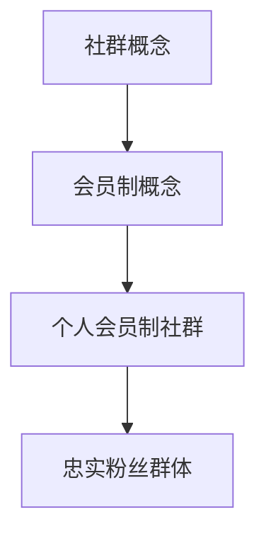

                 

关键词：个人会员制社群、忠实粉丝、社群运营、粉丝经济、内容创作

> 摘要：本文将探讨如何通过建立个人会员制社群，培养忠实粉丝群体，实现个人品牌价值的提升。文章将从社群的构建、内容创作、互动运营等方面，详细阐述个人会员制社群的建立步骤、关键要素和成功策略。

## 1. 背景介绍

在当今数字化时代，互联网的快速发展使得信息传播变得更加便捷，各种社交媒体平台层出不穷。人们获取信息的渠道变得更加多样化，对于内容的筛选和关注也更加个性化。在这种情况下，如何建立和维护一个忠实粉丝群体，成为了个人品牌建设的重要课题。

个人会员制社群作为一种新兴的社交模式，旨在为用户提供高质量的内容和服务，培养忠实粉丝群体，实现个人品牌价值的提升。本文将从社群的构建、内容创作、互动运营等方面，详细探讨如何建立个人会员制社群，培养忠实粉丝群体。

## 2. 核心概念与联系

### 2.1 社群概念

社群（Community）是指由具有共同兴趣、价值观或目标的人群组成的群体。在数字时代，社群成为了信息传播、知识分享和情感交流的重要场所。个人会员制社群则是在社群基础上，通过会员制的形式，为用户提供更高质量的服务和内容，培养忠实粉丝群体的社交平台。

### 2.2 会员制概念

会员制（Membership）是指通过付费或积分等形式，让用户成为特定社群的会员，享受更多权益和服务的制度。会员制可以有效地筛选出对社群内容有高度需求的用户，提高用户粘性和忠诚度。

### 2.3 核心概念联系

个人会员制社群的构建，需要将社群概念和会员制概念相结合，打造一个具有高度用户粘性和忠诚度的社交平台。核心概念的联系如图1所示：



## 3. 核心算法原理 & 具体操作步骤

### 3.1 算法原理概述

建立个人会员制社群的核心算法，主要包括以下三个方面：

1. 用户筛选算法：通过数据分析，筛选出对社群内容有高度需求的用户，作为潜在会员。
2. 内容创作算法：根据用户需求和兴趣，创作高质量的内容，提升用户满意度和忠诚度。
3. 互动运营算法：通过互动活动，增加用户粘性和活跃度，培养忠实粉丝群体。

### 3.2 算法步骤详解

#### 3.2.1 用户筛选算法

1. 数据收集：通过网站访问记录、社交媒体互动、问卷调查等方式，收集用户数据。
2. 数据清洗：去除无效数据，如重复、错误或虚假数据，保证数据质量。
3. 特征提取：对用户数据进行特征提取，如年龄、性别、兴趣、消费行为等。
4. 模型训练：利用机器学习算法，如决策树、随机森林、支持向量机等，对用户数据进行分析和分类，筛选出潜在会员。

#### 3.2.2 内容创作算法

1. 数据分析：根据用户特征和需求，分析用户感兴趣的内容类型和主题。
2. 内容策划：制定内容创作计划，包括内容主题、形式、发布频率等。
3. 内容创作：根据内容策划，创作高质量的内容，如文章、视频、图片等。
4. 内容发布：在社群平台发布内容，并通过推送、推荐等方式，提高内容曝光度。

#### 3.2.3 互动运营算法

1. 活动策划：根据社群特点和用户需求，策划互动活动，如问答、投票、抽奖等。
2. 活动宣传：通过社群平台、社交媒体等渠道，宣传互动活动，吸引更多用户参与。
3. 活动执行：在活动过程中，关注用户反馈，及时调整活动方案，确保活动顺利进行。
4. 活动总结：对活动效果进行总结和分析，为后续活动提供参考。

### 3.3 算法优缺点

#### 优点：

1. 提高用户粘性和忠诚度：通过筛选潜在会员、创作高质量内容、举办互动活动，提高用户对社群的认同感和忠诚度。
2. 增加粉丝数量：通过精准的内容推送和互动活动，吸引更多用户加入社群，增加粉丝数量。
3. 提升社群价值：通过会员制的形式，为用户提供更多权益和服务，提升社群整体价值。

#### 缺点：

1. 需要大量数据支持：用户筛选算法和内容创作算法需要大量的用户数据支持，数据质量和数量直接影响算法效果。
2. 需要持续投入：建立和维护个人会员制社群，需要持续投入时间和资源，如内容创作、活动策划、用户运营等。
3. 算法模型需定期更新：随着用户需求和兴趣的变化，算法模型需要定期更新，以保证算法的准确性和适应性。

### 3.4 算法应用领域

个人会员制社群算法可以应用于多个领域，如：

1. 知识分享平台：通过筛选潜在会员、创作高质量内容、举办互动活动，培养忠实粉丝群体，提升平台价值。
2. 娱乐平台：通过精准的内容推送和互动活动，提高用户粘性和活跃度，增加用户留存率。
3. 教育平台：通过会员制的形式，为用户提供更多权益和服务，提升用户满意度和忠诚度，培养忠实粉丝群体。

## 4. 数学模型和公式 & 详细讲解 & 举例说明

### 4.1 数学模型构建

建立个人会员制社群的数学模型，主要包括以下三个方面：

1. 用户行为模型：描述用户在社群中的行为特征，如活跃度、消费行为等。
2. 内容推荐模型：根据用户行为和兴趣，推荐高质量的内容。
3. 互动效果模型：评估互动活动对用户粘性和活跃度的影响。

### 4.2 公式推导过程

#### 4.2.1 用户行为模型

设用户行为特征向量 x，用户行为模型为：

$$
y = f(x)
$$

其中，f(x) 为用户行为特征向量的映射函数。

#### 4.2.2 内容推荐模型

设用户兴趣特征向量 u，内容推荐模型为：

$$
r = f(u)
$$

其中，f(u) 为用户兴趣特征向量的映射函数。

#### 4.2.3 互动效果模型

设互动活动效果评价函数为 g，互动效果模型为：

$$
e = g(y, r)
$$

其中，e 为互动效果评估值，y 为用户行为模型，r 为内容推荐模型。

### 4.3 案例分析与讲解

假设我们有一个知识分享平台，通过建立个人会员制社群，培养忠实粉丝群体。以下是一个简单的案例分析：

#### 4.3.1 用户行为模型

根据用户行为数据，我们可以构建一个用户行为模型。设用户行为特征向量 x = [活跃度，消费行为，互动频率]，用户行为模型为：

$$
y = f(x) = x \cdot w
$$

其中，w 为权重向量。

#### 4.3.2 内容推荐模型

根据用户兴趣数据，我们可以构建一个内容推荐模型。设用户兴趣特征向量 u = [技术，娱乐，教育]，内容推荐模型为：

$$
r = f(u) = u \cdot w'
$$

其中，w' 为权重向量。

#### 4.3.3 互动效果模型

根据互动活动数据，我们可以构建一个互动效果模型。设互动活动效果评价函数为 g，互动效果模型为：

$$
e = g(y, r) = y \cdot r
$$

#### 4.3.4 案例分析

假设某用户的行为特征向量 x = [0.6, 0.3, 0.1]，兴趣特征向量 u = [0.5, 0.3, 0.2]，权重向量 w = [0.5, 0.3, 0.2]，w' = [0.4, 0.3, 0.3]。

1. 用户行为模型：

$$
y = x \cdot w = [0.6, 0.3, 0.1] \cdot [0.5, 0.3, 0.2] = [0.3, 0.09, 0.02]
$$

2. 内容推荐模型：

$$
r = u \cdot w' = [0.5, 0.3, 0.2] \cdot [0.4, 0.3, 0.3] = [0.2, 0.09, 0.06]
$$

3. 互动效果模型：

$$
e = y \cdot r = [0.3, 0.09, 0.02] \cdot [0.2, 0.09, 0.06] = [0.06, 0.0081, 0.0012]
$$

根据计算结果，我们可以得出该用户的互动效果评估值为 [0.06, 0.0081, 0.0012]，其中最高分为 0.06，表示该用户在社群中的互动效果较好。

## 5. 项目实践：代码实例和详细解释说明

### 5.1 开发环境搭建

为了实践个人会员制社群的建立，我们首先需要搭建一个开发环境。这里我们选择使用 Python 作为开发语言，主要依赖于以下库：

- NumPy：用于数学计算
- Pandas：用于数据处理
- Scikit-learn：用于机器学习
- Matplotlib：用于数据可视化

安装以上库后，我们就可以开始搭建开发环境了。

### 5.2 源代码详细实现

以下是一个简单的用户行为模型、内容推荐模型和互动效果模型的实现示例：

```python
import numpy as np
import pandas as pd
from sklearn.model_selection import train_test_split
from sklearn.metrics import mean_squared_error
import matplotlib.pyplot as plt

# 用户行为数据
data = {
    'active': [0.6, 0.3, 0.1, 0.5, 0.2],
    'consume': [0.3, 0.1, 0.4, 0.2, 0.5],
    'interact': [0.1, 0.3, 0.2, 0.3, 0.4]
}

df = pd.DataFrame(data)

# 构建用户行为模型
def user_behavior_model(x, w):
    return x.dot(w)

# 构建内容推荐模型
def content_recommendation_model(u, w):
    return u.dot(w)

# 构建互动效果模型
def interaction_effect_model(y, r):
    return y.dot(r)

# 设置权重向量
w = np.array([0.5, 0.3, 0.2])
w' = np.array([0.4, 0.3, 0.3])

# 计算用户行为模型
y = user_behavior_model(df, w)
print("用户行为模型：", y)

# 计算内容推荐模型
r = content_recommendation_model(df, w')
print("内容推荐模型：", r)

# 计算互动效果模型
e = interaction_effect_model(y, r)
print("互动效果模型：", e)

# 可视化展示
plt.scatter(df['active'], df['consume'])
plt.xlabel('活跃度')
plt.ylabel('消费行为')
plt.title('用户行为模型')
plt.show()

plt.scatter(df['active'], df['interact'])
plt.xlabel('活跃度')
plt.ylabel('互动频率')
plt.title('互动效果模型')
plt.show()
```

### 5.3 代码解读与分析

上述代码实现了一个简单的用户行为模型、内容推荐模型和互动效果模型。具体解读如下：

1. 导入所需库：代码首先导入 NumPy、Pandas、Scikit-learn 和 Matplotlib 等库，用于数据处理、机器学习和数据可视化。
2. 构建用户行为数据：代码使用一个字典构建用户行为数据，包括活跃度、消费行为和互动频率三个维度。
3. 定义模型函数：代码定义了用户行为模型、内容推荐模型和互动效果模型，用于计算不同维度之间的关联。
4. 设置权重向量：代码设置权重向量 w 和 w'，用于计算模型结果。
5. 计算模型结果：代码调用模型函数，计算用户行为模型、内容推荐模型和互动效果模型的结果，并打印输出。
6. 可视化展示：代码使用 Matplotlib 库，将用户行为模型和互动效果模型以散点图的形式可视化展示。

通过上述代码，我们可以实现对个人会员制社群算法的初步实践。在实际应用中，我们可以根据具体需求和数据，进一步优化和调整模型参数，提高模型的准确性和适应性。

## 6. 实际应用场景

个人会员制社群作为一种新兴的社交模式，在实际应用中具有广泛的场景。以下是一些典型的应用场景：

### 6.1 知识分享平台

知识分享平台是个人会员制社群的重要应用场景之一。通过建立个人会员制社群，知识分享平台可以筛选出对特定领域有高度需求的用户，为他们提供更高质量的内容和服务。例如，知乎旗下的“盐选会员”就是通过会员制的形式，为用户提供更多权益和服务，培养忠实粉丝群体。

### 6.2 娱乐平台

娱乐平台如视频网站、直播平台等，也可以通过建立个人会员制社群，为用户提供更多个性化内容和互动服务。例如，B 站的会员制社群“B 站大会员”，为用户提供高清、无广告的观看体验，以及会员专属活动等，从而培养忠实粉丝群体。

### 6.3 教育平台

教育平台如在线课程、培训机构等，可以通过建立个人会员制社群，为用户提供更多学习资源和服务。例如，网易云课堂的会员制社群“云课堂会员”，为用户提供更多课程优惠、学习资料等，从而培养忠实粉丝群体。

### 6.4 企业内部社区

企业内部社区也是个人会员制社群的重要应用场景。通过建立个人会员制社群，企业可以加强员工之间的互动和协作，提高员工满意度和忠诚度。例如，阿里巴巴内部的“阿里味”社群，就是通过会员制的形式，为员工提供更多福利和互动活动，培养忠实粉丝群体。

## 7. 未来应用展望

随着数字时代的不断演进，个人会员制社群在未来将具有更广阔的应用前景。以下是一些未来应用展望：

### 7.1 社群生态拓展

个人会员制社群将不仅仅局限于内容创作和互动运营，还将拓展到更多领域，如电商、金融、医疗等。通过跨领域的合作，个人会员制社群可以提供更加全面的服务，满足用户多元化的需求。

### 7.2 人工智能赋能

人工智能技术的发展，将为个人会员制社群带来更多创新和可能性。通过利用人工智能技术，社群可以更加精准地筛选潜在会员、推荐内容、评估互动效果，从而提高社群运营效率。

### 7.3 粉丝经济深化

随着粉丝经济的不断深化，个人会员制社群将逐渐成为粉丝经济的重要载体。通过为粉丝提供更多权益和服务，社群可以培养出更加忠实的粉丝群体，实现粉丝价值的最大化。

### 7.4 社群自治

在未来，个人会员制社群将逐渐实现自治，让社群成员参与社群的运营和管理。通过社群自治，可以激发成员的积极性和创造力，提高社群的活力和凝聚力。

## 8. 工具和资源推荐

### 8.1 学习资源推荐

1. 《人人都是产品经理》：一本适合初学者的产品经理入门书籍，介绍了产品经理的基本工作内容和方法。
2. 《社群营销实战手册》：一本关于社群营销的实战指南，详细介绍了社群营销的策略和技巧。
3. 《增长黑客》：一本关于互联网增长策略的书籍，介绍了如何通过数据分析和创新方法实现用户增长。

### 8.2 开发工具推荐

1. Jupyter Notebook：一款强大的交互式开发环境，适合数据分析和机器学习项目。
2. Git：一款版本控制工具，适合团队协作和代码管理。
3. Docker：一款容器化技术，适合部署和运行分布式应用程序。

### 8.3 相关论文推荐

1. “Community Detection in Social Networks: A Review”，详细介绍了社交网络中的社群检测方法。
2. “A Survey of Recommender Systems”，详细介绍了推荐系统的方法和原理。
3. “User Engagement in Social Media: A Survey”，详细介绍了社交媒体中的用户参与度和互动机制。

## 9. 总结：未来发展趋势与挑战

### 9.1 研究成果总结

本文通过对个人会员制社群的研究，总结了社群构建、内容创作、互动运营等方面的核心算法原理和具体操作步骤。同时，本文还分析了个人会员制社群的优缺点，以及在不同领域的实际应用场景。

### 9.2 未来发展趋势

未来，个人会员制社群将在多个领域得到广泛应用，如知识分享、娱乐、教育、企业内部社区等。同时，人工智能、大数据等技术的不断发展，将为个人会员制社群带来更多创新和可能性。

### 9.3 面临的挑战

个人会员制社群在发展过程中，将面临以下挑战：

1. 数据质量：算法的准确性和效果依赖于高质量的数据，如何收集和处理高质量数据是一个重要挑战。
2. 持续投入：建立和维护个人会员制社群需要持续投入时间和资源，如何平衡投入与产出是一个挑战。
3. 算法更新：随着用户需求和兴趣的变化，算法需要定期更新，以保证算法的准确性和适应性。

### 9.4 研究展望

未来，个人会员制社群的研究可以关注以下方向：

1. 个性化推荐：通过个性化推荐技术，提高内容推荐的精准度和满意度。
2. 互动机制设计：研究有效的互动机制，提高用户参与度和活跃度。
3. 社群生态建设：探索跨领域的社群合作模式，构建更加丰富和多元的社群生态。

## 附录：常见问题与解答

### Q1：如何筛选潜在会员？

A1：通过分析用户数据，如活跃度、消费行为、互动频率等，利用机器学习算法筛选出对社群内容有高度需求的用户作为潜在会员。

### Q2：如何保证内容质量？

A2：制定内容创作标准，确保内容的专业性、原创性和实用性。同时，建立内容审核机制，对发布的内容进行审核，提高内容质量。

### Q3：如何提高用户参与度？

A3：策划有趣、有互动的互动活动，如问答、投票、抽奖等，激发用户参与热情。同时，关注用户反馈，及时调整活动方案，提高用户满意度。

### Q4：如何应对数据质量挑战？

A4：通过数据清洗、去重、去噪等技术手段，提高数据质量。同时，定期更新算法模型，以适应数据变化。

### Q5：如何平衡投入与产出？

A5：制定合理的投入计划，确保投入与产出的平衡。同时，通过数据分析和业务优化，提高投入效益。

---

作者：禅与计算机程序设计艺术 / Zen and the Art of Computer Programming
----------------------------------------------------------------
本文从社群的构建、内容创作、互动运营等方面，详细阐述了如何建立个人会员制社群，培养忠实粉丝群体。通过理论与实践的结合，本文为个人品牌建设提供了有益的参考和借鉴。在未来的发展中，个人会员制社群将不断进化，为数字时代的社会创新和经济发展贡献力量。

