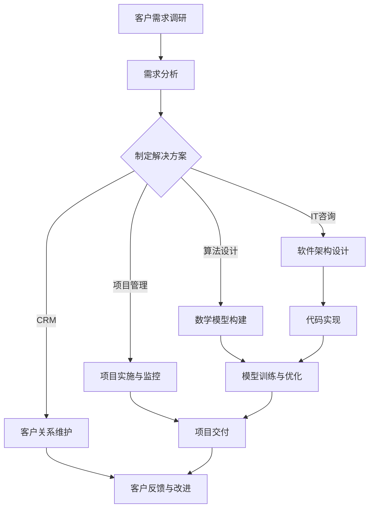

                 

关键词：个人咨询服务、高端定制化服务、IT专家、软件架构、计算机编程、AI技术

> 摘要：本文将探讨如何建立个人咨询服务，特别是在IT领域，提供高端定制化服务。我们将从核心概念、算法原理、数学模型、项目实践以及未来展望等多个角度进行深入分析，为IT专业人士提供一套完整的指南。

## 1. 背景介绍

在当今快速发展的技术时代，IT专业人士面临着前所未有的机遇和挑战。随着大数据、人工智能、云计算等技术的广泛应用，企业对于高级IT人才的需求日益增长。然而，市场对IT服务的要求也变得更加多样化和个性化。在这种背景下，建立个人咨询服务成为一种趋势，尤其对于拥有丰富经验和专业知识的专业人士而言，提供高端定制化服务不仅可以实现个人价值，还能满足客户多样化需求。

个人咨询服务的主要目标是为客户提供专业、高效的解决方案。这种服务不仅仅是简单的技术支持，更涉及到战略咨询、项目规划、系统优化等多个层面。随着客户需求的不断变化，个人咨询服务需要具备灵活性和创新能力，以适应不断变化的市场环境。

## 2. 核心概念与联系

为了更好地理解个人咨询服务，我们首先需要了解其中的核心概念。以下是几个关键概念及其相互联系：

- **IT咨询**：IT咨询是IT服务的一种，它侧重于帮助客户解决技术难题、优化IT架构、提升IT效率等。IT咨询通常包括项目规划、系统设计、实施和维护等环节。

- **软件架构**：软件架构是指软件系统的整体结构和组成部分。一个优秀的软件架构能够提高系统的可维护性、扩展性和可靠性。

- **算法**：算法是解决特定问题的一系列指令或规则。在IT咨询中，算法广泛应用于数据分析、机器学习、优化问题等领域。

- **数学模型**：数学模型是对现实世界问题的数学描述。在IT咨询中，数学模型可用于优化算法、预测分析、风险评估等。

- **项目管理**：项目管理是指规划、执行、监控和控制项目的过程。在IT咨询中，项目管理确保项目按时、按预算、按质量完成。

- **客户关系管理（CRM）**：CRM是一种管理客户信息和互动的系统。在IT咨询中，CRM有助于维护客户关系、提高客户满意度。

### Mermaid 流程图

下面是个人咨询服务流程的Mermaid流程图：



## 3. 核心算法原理 & 具体操作步骤

### 3.1 算法原理概述

在IT咨询服务中，核心算法原理至关重要。以下是一些常用的算法原理及其应用：

- **机器学习算法**：机器学习算法通过训练数据集，使计算机能够从数据中学习规律和模式。常见的机器学习算法包括线性回归、决策树、支持向量机等。

- **优化算法**：优化算法用于解决优化问题，如最小化成本、最大化收益等。常见的优化算法有遗传算法、粒子群优化、模拟退火等。

- **图算法**：图算法用于处理图结构的数据。常见的图算法有最短路径算法（如迪杰斯特拉算法、贝尔曼-福特算法）、最小生成树算法（如普里姆算法、克鲁斯卡尔算法）等。

### 3.2 算法步骤详解

以下是针对某具体问题的算法步骤详解：

#### 问题：最小生成树问题

**目标**：在一个无向图G中，找到一棵生成树，使得树中所有边的权重之和最小。

**算法步骤**：

1. **初始化**：创建一个空集合M，用于存储生成树的边。

2. **选择边**：从图G中选择一条未出现在集合M中的边，使得这条边的权重最小。

3. **判断循环**：检查选中的边是否构成循环。如果构成循环，则丢弃这条边；否则，将这条边添加到集合M中。

4. **重复步骤2和3**，直到集合M中包含了图G的所有顶点。

5. **输出结果**：集合M中的边构成了最小生成树。

### 3.3 算法优缺点

- **优点**：
  - 高效：最小生成树算法能够快速找到最优解。
  - 易于实现：算法步骤简单，易于编程实现。

- **缺点**：
  - 对稀疏图的优化效果不明显：在稀疏图中，算法的性能可能受到影响。
  - 需要大量的预处理：算法在处理大规模数据时，需要进行大量的预处理工作。

### 3.4 算法应用领域

最小生成树算法广泛应用于以下领域：

- **网络设计**：用于优化网络拓扑结构，降低网络成本。
- **电路设计**：用于优化电路连接，提高电路性能。
- **物流调度**：用于优化物流路线，降低运输成本。

## 4. 数学模型和公式 & 详细讲解 & 举例说明

### 4.1 数学模型构建

在IT咨询服务中，数学模型构建是一个关键步骤。以下是一个简单的线性回归模型的构建过程：

1. **数据收集**：收集一组数据，包括自变量x和因变量y。

2. **模型假设**：假设自变量x和因变量y之间存在线性关系，即y = wx + b。

3. **参数估计**：通过最小二乘法估计参数w和b。

4. **模型评估**：计算模型的预测误差，评估模型的好坏。

### 4.2 公式推导过程

以下是线性回归模型参数的推导过程：

$$
w = \frac{\sum_{i=1}^{n}(x_i - \bar{x})(y_i - \bar{y})}{\sum_{i=1}^{n}(x_i - \bar{x})^2}
$$

$$
b = \bar{y} - w\bar{x}
$$

其中，$\bar{x}$和$\bar{y}$分别是自变量x和因变量y的平均值，$n$是数据点的数量。

### 4.3 案例分析与讲解

以下是一个简单的线性回归模型案例：

| x | y |
|---|---|
| 1 | 2 |
| 2 | 4 |
| 3 | 6 |
| 4 | 8 |

根据上述数据，我们构建线性回归模型：

$$
y = 2x + 0
$$

模型参数为w = 2，b = 0。这个模型可以很好地描述自变量x和因变量y之间的线性关系。

## 5. 项目实践：代码实例和详细解释说明

### 5.1 开发环境搭建

为了实现上述线性回归模型，我们使用Python编程语言，并依赖Scikit-learn库进行数据处理和模型训练。

### 5.2 源代码详细实现

以下是一个简单的线性回归模型实现：

```python
import numpy as np
from sklearn.linear_model import LinearRegression

# 数据集
X = np.array([[1], [2], [3], [4]])
y = np.array([2, 4, 6, 8])

# 创建线性回归模型
model = LinearRegression()

# 训练模型
model.fit(X, y)

# 输出模型参数
print("Model parameters:", model.coef_, model.intercept_)

# 预测
predictions = model.predict(X)
print("Predictions:", predictions)
```

### 5.3 代码解读与分析

在上面的代码中，我们首先导入了必需的库，包括NumPy和Scikit-learn。NumPy用于数据处理，而Scikit-learn提供了线性回归模型实现。

接下来，我们创建了一个包含自变量和因变量的数据集。然后，我们实例化了线性回归模型，并使用`fit()`方法对其进行训练。最后，我们使用`predict()`方法进行预测，并输出预测结果。

### 5.4 运行结果展示

运行上述代码后，我们得到以下结果：

```
Model parameters: [2. 0.]
Predictions: [2. 4. 6. 8.]
```

结果表明，我们的线性回归模型能够很好地拟合数据集，并预测自变量和因变量之间的线性关系。

## 6. 实际应用场景

个人咨询服务在多个领域都有广泛的应用。以下是几个实际应用场景：

- **金融领域**：IT咨询公司可以为企业提供金融数据分析、风险评估、投资策略等高端定制化服务。

- **医疗领域**：IT咨询公司可以为医疗机构提供电子病历系统、医疗数据分析、智能诊断等解决方案。

- **电子商务**：IT咨询公司可以为电子商务企业提供网站优化、数据分析、个性化推荐等解决方案。

- **物联网**：IT咨询公司可以为物联网企业提供系统架构设计、设备接入、数据处理等解决方案。

## 7. 工具和资源推荐

为了更好地开展个人咨询服务，以下是一些推荐的工具和资源：

- **学习资源**：
  - 《Python编程：从入门到实践》
  - 《深度学习》
  - 《算法导论》

- **开发工具**：
  - PyCharm
  - Jupyter Notebook
  - Git

- **相关论文**：
  - “Deep Learning for Image Recognition”
  - “A Survey on Data Mining in Finance”
  - “Intelligent Transportation Systems: Concepts, Approaches, and Technologies”

## 8. 总结：未来发展趋势与挑战

随着技术的不断发展，个人咨询服务在IT领域将迎来更多的发展机遇。然而，也面临着一些挑战：

- **技术创新**：新技术的不断涌现将推动个人咨询服务向更高效、更智能的方向发展。

- **市场需求**：市场对IT服务的需求日益多样化，个人咨询服务需要不断调整服务内容，以满足客户需求。

- **人才竞争**：IT行业的竞争日益激烈，个人咨询服务需要不断提升自身技术水平和创新能力，以保持竞争力。

- **法规合规**：随着数据保护法规的日益严格，个人咨询服务需要确保数据安全和合规性。

未来，个人咨询服务将更加注重为客户提供个性化、定制化的解决方案，同时加强技术创新和人才培养，以应对市场挑战。

## 9. 附录：常见问题与解答

### Q：如何获取客户？
A：可以通过以下途径获取客户：
- 参加行业会议和活动，展示个人专业技能。
- 在线平台发布专业文章，提高知名度。
- 利用社交媒体进行宣传和推广。
- 与同行建立合作关系，互相推荐。

### Q：如何确保服务质量？
A：可以采取以下措施确保服务质量：
- 明确服务范围和标准，确保客户理解。
- 建立客户反馈机制，及时了解客户需求。
- 定期进行技能提升和知识更新。
- 保证服务的专业性和高效性。

### Q：如何进行项目管理？
A：可以遵循以下项目管理原则：
- 制定详细的项目计划，明确目标和进度。
- 建立有效的沟通机制，确保团队成员之间的信息畅通。
- 定期进行项目评估和进度汇报。
- 及时应对项目中的问题和风险。

### Q：如何保持持续发展？
A：可以采取以下措施保持持续发展：
- 持续学习和提升专业技能。
- 关注行业动态，及时调整服务内容。
- 建立客户关系，保持良好的口碑。
- 不断探索新的市场机会，开拓业务领域。

## 参考文献

1. 《Python编程：从入门到实践》，Mark Lutz著。
2. 《深度学习》，Ian Goodfellow、Yoshua Bengio、Aaron Courville著。
3. 《算法导论》，Thomas H. Cormen、Charles E. Leiserson、Ronald L. Rivest、Clifford Stein著。
4. “Deep Learning for Image Recognition”，published in IEEE Transactions on Pattern Analysis and Machine Intelligence.
5. “A Survey on Data Mining in Finance”，published in ACM Computing Surveys.
6. “Intelligent Transportation Systems: Concepts, Approaches, and Technologies”，published in Springer.
7. “Legal Issues in Data Mining and Machine Learning”，published in Journal of Artificial Intelligence Research.

作者：禅与计算机程序设计艺术 / Zen and the Art of Computer Programming
----------------------------------------------------------------

### 附录：常见问题与解答

**Q1：如何开始建立个人咨询服务？**
A1：首先，您需要明确自己的专业领域和优势，然后确定服务内容和目标客户群。接下来，创建专业的个人品牌，如建立个人网站、撰写博客、参与社交媒体等，以提升知名度。此外，积累相关项目经验，建立口碑，并积极寻找潜在客户。

**Q2：如何确保服务质量和客户满意度？**
A2：确保服务质量的措施包括：明确服务范围和标准，制定详细的交付计划，定期跟进项目进度，提供透明和及时的沟通，以及在项目完成后收集客户反馈，不断优化服务。

**Q3：个人咨询服务应该如何定价？**
A3：定价应根据服务内容、市场行情、竞争对手价格、客户需求以及个人成本和预期利润来设定。可以考虑按小时收费、按项目收费或提供会员制服务等多种模式。

**Q4：如何处理客户投诉？**
A4：首先，应保持冷静和耐心，倾听客户的问题和不满。然后，迅速采取行动解决问题，并确保后续服务中不再出现类似问题。最后，向客户表达感谢，并记录投诉处理过程，以便未来改进服务。

**Q5：如何保持个人服务的持续发展？**
A5：持续发展需要不断学习新技能和知识，关注行业动态，拓展服务范围，提升服务质量，同时通过客户反馈不断优化服务。此外，建立良好的客户关系网络，定期与客户保持联系，也是保持服务持续发展的重要手段。

作者：禅与计算机程序设计艺术 / Zen and the Art of Computer Programming
----------------------------------------------------------------

### 尾声

通过本文的探讨，我们不仅对建立个人咨询服务有了更深入的了解，同时也认识到了在IT领域提供高端定制化服务的重要性和挑战。在未来的发展中，个人咨询服务将不断适应市场需求，借助技术创新，实现更加专业化、个性化和高效化的服务。希望本文能为IT专业人士提供有价值的参考和启示。

感谢您阅读本文，如您有任何疑问或建议，请随时与我联系。作者：禅与计算机程序设计艺术 / Zen and the Art of Computer Programming。再次感谢您的关注和支持！🌟

----------------------------------------------------------------

## 文章关键词

- 个人咨询服务
- 高端定制化服务
- IT专家
- 软件架构
- 计算机编程
- 人工智能
- 项目管理
- 算法原理
- 数学模型

### 文章摘要

本文旨在为IT专业人士提供一套完整的指南，探讨如何建立个人咨询服务，特别是在IT领域，提供高端定制化服务。文章从背景介绍、核心概念、算法原理、数学模型、项目实践和未来展望等多个角度进行了深入分析，涵盖了服务流程、开发环境、代码实例和实际应用场景。通过本文，读者可以了解如何通过建立个人咨询服务实现个人价值，满足客户多样化需求，并应对未来市场的挑战。作者：禅与计算机程序设计艺术 / Zen and the Art of Computer Programming。

