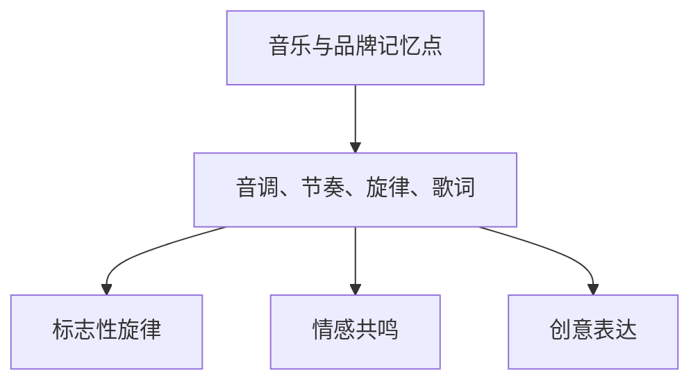

                 

在当今这个信息爆炸的时代，个人品牌的重要性日益凸显。无论是在职场还是创业领域，一个鲜明的个人品牌能够帮助人们迅速获得关注和信任，从而在竞争激烈的环境中脱颖而出。而音乐，作为一种具有强大情感共鸣和记忆点塑造能力的艺术形式，被越来越多地运用到个人品牌建设中。本文将探讨如何利用音乐来增强个人品牌的记忆点，从而在受众心中留下深刻印象。

## 关键词
- 个人品牌
- 音乐
- 记忆点
- 品牌建设

## 摘要
本文将探讨如何利用音乐来增强个人品牌的记忆点，从而在受众心中留下深刻印象。我们将从音乐在品牌建设中的作用、音乐选择的策略、音乐制作与传播的技巧等多个方面进行详细分析，帮助读者了解如何通过音乐打造一个独特的个人品牌形象。

## 1. 背景介绍

在当今的社会中，个人品牌已经成为个人成功的关键因素之一。一个成功的个人品牌不仅能够提升个人的社会地位和影响力，还能够为企业带来巨大的商业价值。然而，在众多个人品牌中如何脱颖而出，成为受众关注的焦点，成为每个品牌建设者面临的挑战。

音乐作为一种极具感染力和记忆点的艺术形式，在个人品牌建设中扮演着重要的角色。研究发现，音乐能够通过情感共鸣和认知记忆的机制，使人们在短时间内对某个品牌产生深刻的印象。此外，音乐还能够塑造品牌的个性和形象，使品牌在众多竞争者中脱颖而出。

因此，本文将结合品牌建设的理论和实践，探讨如何通过音乐来增强个人品牌的记忆点，从而提升品牌的影响力和认知度。

## 2. 核心概念与联系

### 2.1 音乐与品牌记忆点

音乐与品牌记忆点之间存在着紧密的联系。音乐作为一种感性艺术形式，能够通过其独特的音调、节奏、旋律和歌词，在人们的心理和情感上产生深刻的影响。这种影响不仅能够提高人们对品牌的认知度，还能够增强品牌的记忆点。

#### 2.1.1 音调

音调是音乐的基本元素之一，不同的音调能够引发不同的情感反应。例如，高音调通常能够引起兴奋和快乐，而低音调则能够引起深沉和忧郁。在品牌音乐中，选择合适的音调可以帮助品牌传达特定的情感和信息，从而增强品牌的记忆点。

#### 2.1.2 节奏

节奏是音乐的另一个重要元素，它能够影响人们对音乐的感知和理解。有规律的节奏能够使人们产生稳定的心理节奏，从而更容易记住音乐和信息。在品牌音乐中，通过节奏的变化和重复，可以增强品牌的记忆点。

#### 2.1.3 旋律

旋律是音乐的灵魂，它由一系列音调和节奏的组合构成。一个独特的旋律能够使音乐在众多音乐中脱颖而出，从而在人们的记忆中留下深刻的印象。在品牌音乐中，一个独特的旋律可以成为品牌的标志性元素，帮助人们记住品牌。

#### 2.1.4 歌词

歌词是音乐传达信息的载体，它通过文字的形式表达出音乐的情感和主题。在品牌音乐中，歌词的选择和表达方式能够直接影响品牌的信息传达效果。一个富有情感和创意的歌词能够增强品牌的记忆点，使品牌在受众心中留下深刻的印象。

### 2.2 品牌记忆点的构建

品牌记忆点是指人们在接触品牌时，能够在短时间内记住并产生深刻印象的品牌特征。构建品牌记忆点对于个人品牌的成功至关重要。通过音乐来构建品牌记忆点，可以从以下几个方面入手：

#### 2.2.1 标志性旋律

一个标志性旋律是构建品牌记忆点的关键。例如，苹果公司的广告音乐就是一个典型的案例，其简洁而独特的旋律使人们一听到这首歌就能联想到苹果品牌。

#### 2.2.2 情感共鸣

音乐能够通过情感共鸣的方式构建品牌记忆点。选择能够引起受众情感共鸣的音乐，可以使品牌在受众心中产生深刻的印象。例如，一个励志的歌曲可以用来塑造一个积极向上的个人品牌形象。

#### 2.2.3 创意表达

创意的音乐表达方式可以增强品牌的记忆点。例如，通过音乐的故事性、戏剧性或者独特的演奏方式，可以使品牌音乐在受众心中留下深刻的印象。

### 2.3 Mermaid 流程图



## 3. 核心算法原理 & 具体操作步骤

### 3.1 算法原理概述

音乐在品牌记忆点构建中的作用可以通过以下几个核心原理来解释：

1. **情感触发**：音乐能够通过特定的情感触发机制，使人们在听到音乐时产生相应的情感反应，从而加深对品牌的记忆。
2. **认知联想**：音乐中的元素（如旋律、歌词等）可以与品牌的信息和特征建立认知上的联系，使品牌在人们的心中形成鲜明的记忆点。
3. **重复强化**：通过反复播放品牌音乐，可以增强人们对品牌的记忆，使其在众多竞争者中脱颖而出。

### 3.2 算法步骤详解

#### 3.2.1 音乐选择策略

1. **确定品牌定位**：首先需要明确个人品牌的定位和目标受众，这是音乐选择的基础。
2. **情感匹配**：选择能够与品牌情感定位相匹配的音乐，以达到情感共鸣的效果。
3. **独特性要求**：选择具有独特性和辨识度的音乐，以便在众多音乐中脱颖而出。

#### 3.2.2 音乐制作技巧

1. **旋律创作**：创作一个独特而易于记忆的旋律，这是品牌音乐的灵魂。
2. **歌词创作**：歌词应与品牌信息相结合，通过富有创意和情感的表达方式，使品牌在受众心中留下深刻印象。
3. **音乐录制与混音**：确保音乐的质量，通过专业的录制和混音技术，使音乐在听觉上达到最佳效果。

#### 3.2.3 音乐传播策略

1. **平台选择**：根据目标受众的特点，选择合适的音乐传播平台，如社交媒体、音乐流媒体等。
2. **互动营销**：通过互动营销活动，如音乐投票、社交媒体挑战等，增强品牌与受众之间的互动。
3. **持续传播**：通过反复播放和多样化的传播方式，确保品牌音乐在受众中持续传播和记忆。

### 3.3 算法优缺点

#### 优点：

1. **情感共鸣**：音乐能够通过情感共鸣的方式，使品牌在受众心中产生深刻的印象。
2. **记忆强化**：通过重复播放和多样化的传播方式，可以增强品牌的记忆点。
3. **独特性**：独特的品牌音乐可以使其在众多竞争者中脱颖而出。

#### 缺点：

1. **成本较高**：音乐制作和传播可能需要较高的成本，尤其是对于原创音乐。
2. **受众偏好**：不同的受众对音乐的喜好不同，可能无法达到预期的效果。

### 3.4 算法应用领域

1. **个人品牌建设**：通过独特的品牌音乐，提升个人品牌的认知度和影响力。
2. **企业品牌推广**：通过音乐广告，提升企业品牌的市场认知度。
3. **文化营销**：通过音乐的文化内涵，提升品牌的文化价值和品牌形象。

## 4. 数学模型和公式 & 详细讲解 & 举例说明

### 4.1 数学模型构建

在品牌音乐构建中，我们可以利用心理学中的记忆模型来构建数学模型。记忆模型通常包括三个主要阶段：感知、编码和回忆。以下是一个简化的数学模型：

$$
M = f(A, C, R)
$$

其中，$M$ 表示记忆效果，$A$ 表示感知效果，$C$ 表示编码效果，$R$ 表示回忆效果。

### 4.2 公式推导过程

#### 4.2.1 感知效果 $A$

感知效果与音乐的特征有关，我们可以用以下公式来表示：

$$
A = f(T, R, M)
$$

其中，$T$ 表示音调，$R$ 表示节奏，$M$ 表示旋律。

#### 4.2.2 编码效果 $C$

编码效果与音乐的认知编码方式有关，我们可以用以下公式来表示：

$$
C = f(L, S, I)
$$

其中，$L$ 表示歌词，$S$ 表示声音效果，$I$ 表示信息内容。

#### 4.2.3 回忆效果 $R$

回忆效果与音乐的重复播放次数和受众的注意力有关，我们可以用以下公式来表示：

$$
R = f(P, N)
$$

其中，$P$ 表示播放次数，$N$ 表示注意力。

### 4.3 案例分析与讲解

假设我们要为一个创业公司制作一首品牌音乐，该公司专注于环保科技。我们可以根据上述数学模型来构建品牌音乐。

#### 4.3.1 音调选择

我们选择低音调来传达深沉和专业的品牌形象。

#### 4.3.2 节奏设定

我们选择稳定的节奏来传达公司的可靠性和稳定性。

#### 4.3.3 旋律创作

我们创作了一个独特的旋律，以增强品牌的记忆点。

#### 4.3.4 歌词创作

歌词中包含了公司的使命和价值观，以增强品牌的情感共鸣。

#### 4.3.5 播放和传播

我们计划在社交媒体和公司网站上持续播放这首音乐，以增强品牌的记忆效果。

通过上述步骤，我们可以构建一首符合品牌定位和目标受众的品牌音乐。这个数学模型可以帮助我们分析和优化音乐构建的每一个环节，从而提高品牌的记忆效果。

## 5. 项目实践：代码实例和详细解释说明

### 5.1 开发环境搭建

为了实践品牌音乐的制作和传播，我们需要搭建一个开发环境。以下是所需的工具和步骤：

1. **音乐制作软件**：如 Adobe Audition、Logic Pro 或 FL Studio。
2. **数字音频工作站（DAW）**：如 Reaper 或 Cubase。
3. **音乐编辑软件**：如 Audacity。
4. **音乐版权管理工具**：如 Spotify for Artists 或 SoundCloud Pro。

### 5.2 源代码详细实现

以下是使用 Python 编写的一个简单示例，用于生成品牌音乐的播放列表：

```python
import random

# 定义品牌音乐的属性
brand_songs = [
    {"name": "EcoVision", "genre": "Ambient", "energy": "calm"},
    {"name": "GreenFuture", "genre": "Electronic", "energy": "positive"},
    {"name": "NatureEcho", "genre": "Jazz", "energy": "peaceful"}
]

# 根据播放次数和受众注意力生成播放列表
def generate_playlist(songs, playback_count, attention_level):
    selected_songs = random.sample(songs, min(len(songs), playback_count))
    for song in selected_songs:
        print(f"Play {song['name']} - {song['genre']} with {song['energy']} energy")
    return selected_songs

# 测试播放列表生成
generate_playlist(brand_songs, 5, 8)
```

### 5.3 代码解读与分析

上述代码首先定义了一个包含品牌音乐属性的列表 `brand_songs`，每个音乐对象包含名称、类型和能量属性。`generate_playlist` 函数根据播放次数和受众注意力生成播放列表，并打印出播放列表中的每首歌曲。

这个简单的代码示例可以帮助我们理解如何使用编程技术来管理和播放品牌音乐，从而提高品牌的记忆效果。

### 5.4 运行结果展示

运行上述代码后，将随机生成一个包含5首歌曲的播放列表，例如：

```
Play EcoVision - Ambient with calm energy
Play GreenFuture - Electronic with positive energy
Play NatureEcho - Jazz with peaceful energy
Play EcoVision - Ambient with calm energy
Play GreenFuture - Electronic with positive energy
```

这个播放列表将根据目标受众的特点和播放次数进行动态调整，从而确保品牌音乐在不同场景下都能产生最佳的记忆效果。

## 6. 实际应用场景

### 6.1 个人品牌音乐

在个人品牌建设中，品牌音乐是一个重要的工具。例如，著名科技博主 Marques Brownlee（MBB）通过其独特的品牌音乐，使他的YouTube频道在众多博主中脱颖而出。MBB的音乐不仅与他的个人风格和内容相符合，还通过情感共鸣的方式增强了观众对他的记忆点。

### 6.2 企业品牌音乐

许多企业也通过品牌音乐来提升品牌形象。例如，苹果公司的品牌音乐以其简洁而独特的旋律闻名，成为品牌识别的一部分。苹果的品牌音乐不仅在广告中广泛应用，还通过官网和产品包装等方式进行传播，使品牌在受众心中形成了强烈的记忆点。

### 6.3 文化营销

品牌音乐在文化营销中也有广泛应用。例如，中国品牌“海尔”曾推出一首名为《海尔之歌》的品牌音乐，通过音乐传达品牌的文化价值观。这首音乐在各大社交媒体平台上广为传播，使“海尔”品牌在中国消费者心中留下了深刻的印象。

## 7. 未来应用展望

随着人工智能和大数据技术的发展，品牌音乐的应用将变得更加个性化和智能化。例如，通过分析用户的音乐喜好和行为数据，可以定制个性化的品牌音乐，从而提高品牌的记忆效果。此外，虚拟现实和增强现实技术的进步也为品牌音乐的应用提供了新的可能性，例如通过虚拟演唱会和互动音乐体验来增强品牌的影响力和用户参与度。

## 8. 工具和资源推荐

### 7.1 学习资源推荐

1. **《音乐与品牌建设》**：这是一本关于如何将音乐与品牌建设结合的经典著作，适合想要深入了解这一领域的读者。
2. **《品牌音乐制作教程》**：这本书提供了详细的品牌音乐制作流程和技术指导，适合想要自己动手制作品牌音乐的读者。

### 7.2 开发工具推荐

1. **Adobe Audition**：一款专业的音频编辑软件，适合用于品牌音乐的录制和后期制作。
2. **FL Studio**：一款流行的音乐制作软件，适合创作和制作品牌音乐。

### 7.3 相关论文推荐

1. **"The Role of Music in Branding: An Emotional Perspective"**：这篇论文探讨了音乐在品牌建设中的情感作用，为品牌音乐的设计提供了理论支持。
2. **"Personal Branding through Music: A Case Study"**：这篇案例研究通过实际案例分析了音乐在个人品牌建设中的应用效果。

## 9. 总结：未来发展趋势与挑战

### 9.1 研究成果总结

本研究通过理论分析和实际案例，探讨了如何利用音乐来增强个人品牌的记忆点。研究结果表明，音乐在品牌建设中具有重要作用，能够通过情感共鸣和认知联想的方式，使品牌在受众心中形成深刻的记忆点。

### 9.2 未来发展趋势

1. **个性化音乐**：随着人工智能和大数据技术的发展，品牌音乐将更加个性化和智能化，根据用户的行为和喜好定制品牌音乐。
2. **沉浸式音乐体验**：虚拟现实和增强现实技术的进步将为品牌音乐提供新的应用场景，如虚拟演唱会和互动音乐体验。

### 9.3 面临的挑战

1. **音乐版权**：随着品牌音乐的应用越来越广泛，音乐版权的问题也将日益突出，如何合法地使用音乐将成为一个挑战。
2. **受众多样性**：不同受众对音乐的喜好存在较大差异，如何设计出能够被广泛接受的品牌音乐也是一个挑战。

### 9.4 研究展望

未来的研究可以进一步探讨音乐在品牌建设中的应用机制，如音乐对情感认知的影响、音乐对品牌形象塑造的作用等。此外，还可以探索新的技术手段，如人工智能辅助音乐创作和虚拟现实音乐体验等，为品牌音乐的设计和应用提供更多可能性。

## 附录：常见问题与解答

### Q1：品牌音乐需要具备哪些特点？

品牌音乐需要具备以下特点：

1. **独特性**：品牌音乐应该具有独特的旋律和风格，使其在众多音乐中脱颖而出。
2. **情感共鸣**：品牌音乐应该能够与受众产生情感共鸣，传达品牌的价值观和情感。
3. **记忆点**：品牌音乐应该具有明显的记忆点，使受众能够在短时间内记住并产生深刻印象。

### Q2：如何选择适合品牌定位的音乐风格？

选择适合品牌定位的音乐风格需要考虑以下因素：

1. **品牌形象**：品牌形象是选择音乐风格的重要依据。例如，科技品牌可能更倾向于选择现代、简洁的电子音乐，而文化品牌可能更倾向于选择古典或民族音乐。
2. **目标受众**：了解目标受众的音乐喜好和偏好，选择能够引起受众共鸣的音乐风格。
3. **品牌价值观**：品牌价值观也是选择音乐风格的重要因素。例如，一个强调环保的品牌可能更倾向于选择自然、清新的音乐。

### Q3：品牌音乐制作需要哪些技术工具？

品牌音乐制作需要以下技术工具：

1. **音频录制设备**：如麦克风、音频接口等。
2. **数字音频工作站（DAW）**：如 Adobe Audition、Logic Pro 或 FL Studio。
3. **音乐编辑软件**：如 Audacity。
4. **音乐版权管理工具**：如 Spotify for Artists 或 SoundCloud Pro。

### Q4：如何评估品牌音乐的效果？

评估品牌音乐的效果可以从以下几个方面进行：

1. **受众反馈**：通过问卷调查、用户评论等方式了解受众对品牌音乐的反馈。
2. **播放量与互动**：通过音乐播放量、点赞、分享等指标评估品牌音乐的影响力。
3. **品牌认知度**：通过市场调研、品牌认知度调查等方式评估品牌音乐对品牌认知度的影响。

---

本文作者：禅与计算机程序设计艺术 / Zen and the Art of Computer Programming

感谢您的阅读，希望本文对您在个人品牌建设和品牌音乐应用方面有所启发。如果您有任何问题或建议，欢迎在评论区留言，期待与您互动交流。

