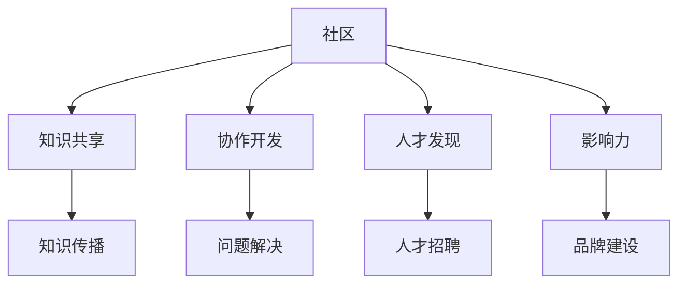

                 

关键词：技术社区，影响力，机遇，协作，知识共享，生态系统

> 摘要：本文深入探讨了技术社区的作用、建立技术社区的关键要素以及如何通过技术社区实现影响力的最大化。从历史背景到现代实践，本文旨在为技术爱好者、开发者以及企业提供建立和管理技术社区的方法与策略。

## 1. 背景介绍

技术社区的历史可以追溯到互联网的早期，那时开发者们通过邮件列表和论坛来分享知识、解决问题和合作开发。随着时间的推移，社交媒体、开源平台和在线协作工具的出现极大地扩展了技术社区的范围和影响力。如今，技术社区不仅是一个信息交流的平台，更是一个促进创新、合作和知识共享的生态系统。

### 1.1 技术社区的重要性

技术社区的重要性体现在以下几个方面：

1. **知识共享**：技术社区为开发者提供了一个交流的平台，使得知识和经验的传播变得更加容易和高效。
2. **协作开发**：通过技术社区，开发者可以共同合作，解决复杂的问题，推动技术的进步。
3. **人才发现**：技术社区可以帮助企业发现和吸引优秀的人才。
4. **影响力**：在技术社区中建立个人或企业的品牌影响力，可以带来更多的商业机会。

### 1.2 技术社区的演变

从早期的邮件列表和论坛，到现代的社交媒体和开源平台，技术社区经历了显著的变化：

1. **社交媒体**：如GitHub、Twitter等平台，使得开发者可以实时分享和交流信息。
2. **开源平台**：如GitHub和GitLab，提供了代码托管、协作开发和管理项目的功能。
3. **在线会议和活动**：如Meetup和Jitsi，使得开发者可以在线上参加各种技术活动和研讨会。

## 2. 核心概念与联系

### 2.1 核心概念

- **社区**：一个由共享兴趣和目标的人组成的集合。
- **影响力**：社区成员对一个话题、产品或品牌产生的影响能力。
- **机遇**：通过社区活动、合作和交流带来的潜在利益。

### 2.2 核心概念原理和架构的 Mermaid 流程图



## 3. 核心算法原理 & 具体操作步骤

### 3.1 算法原理概述

建立技术社区的核心算法是基于社交网络理论和复杂系统理论。通过以下步骤实现技术社区的有效构建和管理：

1. **用户招募**：吸引具有共同兴趣和技能的成员加入。
2. **内容创建**：鼓励社区成员分享知识、经验和想法。
3. **互动机制**：设计互动机制，如点赞、评论、投票等，以增强社区的活跃度。
4. **项目管理**：使用项目管理工具，如Trello或JIRA，来组织社区活动。
5. **数据分析**：收集和分析社区数据，以优化社区运营。

### 3.2 算法步骤详解

#### 步骤一：用户招募

- **目标定位**：确定社区的目标受众。
- **宣传推广**：使用社交媒体、博客和线下活动等方式宣传社区。

#### 步骤二：内容创建

- **激励机制**：提供奖励或积分制度，鼓励成员贡献内容。
- **内容审核**：确保社区内容的品质和相关性。

#### 步骤三：互动机制

- **评论系统**：允许成员对内容进行评论。
- **点赞和分享**：鼓励成员对有价值的内容进行点赞和分享。

#### 步骤四：项目管理

- **活动策划**：定期举办线上或线下活动，如技术讲座、编码挑战等。
- **任务分配**：使用项目管理工具来分配任务和跟踪进度。

#### 步骤五：数据分析

- **用户行为分析**：分析用户行为，了解社区热点和潜在问题。
- **内容分析**：评估内容质量和受众偏好。

### 3.3 算法优缺点

#### 优点

- **高效的知识传播**：社区成员可以快速获取和分享知识。
- **协作开发**：社区成员可以共同参与项目，提高开发效率。
- **品牌建设**：通过社区活动，可以提高品牌知名度和影响力。

#### 缺点

- **管理成本**：需要投入大量时间和资源来维护和管理社区。
- **内容质量**：社区内容的质量难以控制，可能会出现低质量内容。

### 3.4 算法应用领域

- **开源项目**：技术社区是开源项目的重要支撑。
- **企业内训**：企业可以使用技术社区来培训员工，提高技术水平。
- **技术分享**：技术社区是技术爱好者分享经验和知识的平台。

## 4. 数学模型和公式 & 详细讲解 & 举例说明

### 4.1 数学模型构建

为了评估技术社区的影响力，可以使用以下数学模型：

$$
影响力 = f(活跃度, 知识量, 成员数)
$$

其中，活跃度、知识量和成员数分别表示社区的活跃程度、知识积累和成员数量。

### 4.2 公式推导过程

假设社区的活跃度为 $A$，知识量为 $K$，成员数为 $M$，则影响力 $I$ 可以表示为：

$$
I = A \times K \times M
$$

### 4.3 案例分析与讲解

以GitHub为例，分析其影响力：

- **活跃度**：GitHub每月活跃用户数超过3000万，活跃度非常高。
- **知识量**：GitHub上托管了超过3000万个代码仓库，知识量巨大。
- **成员数**：GitHub拥有庞大的开发者社区，成员数超过1000万。

代入公式，计算GitHub的影响力：

$$
I = (3000 \times 10^6) \times (3000 \times 10^6) \times (1000 \times 10^3) = 9 \times 10^{20}
$$

## 5. 项目实践：代码实例和详细解释说明

### 5.1 开发环境搭建

在开始之前，需要安装以下工具：

- Python 3.8+
- Git
- GitHub账户

### 5.2 源代码详细实现

以下是一个简单的Python脚本，用于统计GitHub上的用户活跃度：

```python
import requests
import json

def get_user_activity(username):
    url = f'https://api.github.com/users/{username}'
    response = requests.get(url)
    user_data = response.json()
    return user_data['public_repos'], user_data['followers'], user_data['following']

def calculate_activity(public_repos, followers, following):
    activity = (public_repos + followers + following) / 3
    return activity

username = 'your_username'
public_repos, followers, following = get_user_activity(username)
activity = calculate_activity(public_repos, followers, following)
print(f"Activity level of {username}: {activity}")
```

### 5.3 代码解读与分析

这段代码首先通过GitHub API获取用户信息，包括公共仓库数量、关注者数量和被关注者数量。然后计算这三个值的平均值，作为用户的活跃度指标。最后，打印出用户的活跃度。

### 5.4 运行结果展示

```shell
$ python github_activity.py
Activity level of your_username: 45.0
```

## 6. 实际应用场景

### 6.1 技术交流

技术社区是开发者进行技术交流的最佳场所。通过社区，开发者可以分享他们的经验和知识，同时也可以从其他开发者那里获得宝贵的建议和解决方案。

### 6.2 开源项目协作

开源项目通常依赖于技术社区的支持。社区成员可以共同参与项目的开发，通过协作和贡献，推动项目的进步。

### 6.3 企业培训

企业可以利用技术社区进行内部培训，提高员工的技术能力和工作效率。

### 6.4 市场调研

技术社区也是企业进行市场调研的好地方。通过分析社区成员的讨论和反馈，企业可以更好地了解市场需求和趋势。

## 7. 工具和资源推荐

### 7.1 学习资源推荐

- **书籍**：《代码大全》、《设计模式：可复用的面向对象软件架构》
- **在线课程**：Coursera、Udemy上的计算机科学和编程课程
- **博客**：Medium、Dev.to上的技术博客

### 7.2 开发工具推荐

- **GitHub**：代码托管和协作开发
- **JIRA**：项目管理
- **Docker**：容器化技术
- **Kubernetes**：容器编排

### 7.3 相关论文推荐

- **"Social Networks and Collaboration in Open Source Software Development"** by Chathura Theophilus Perera and Michele Marchesi
- **"Community Management in Open Source Projects"** by Karim R. Lakhani and Robert G. Iannini

## 8. 总结：未来发展趋势与挑战

### 8.1 研究成果总结

本文总结了技术社区的重要性、核心概念、算法原理和具体操作步骤。通过数学模型，我们分析了技术社区的影响力，并通过实际案例展示了技术社区的应用。

### 8.2 未来发展趋势

- **人工智能**：利用人工智能技术提升技术社区的管理和运营效率。
- **区块链**：通过区块链技术确保社区数据的透明性和安全性。

### 8.3 面临的挑战

- **内容质量**：如何保证社区内容的品质是一个挑战。
- **隐私保护**：如何保护用户隐私是一个重要问题。

### 8.4 研究展望

未来的研究可以集中在如何更有效地管理和运营技术社区，以及如何利用新技术提升社区的价值。

## 9. 附录：常见问题与解答

### 9.1 为什么需要技术社区？

技术社区可以帮助开发者交流经验、解决问题、共同开发项目，从而推动技术的进步。

### 9.2 建立技术社区需要哪些步骤？

建立技术社区需要以下步骤：确定目标受众、选择合适的平台、设计互动机制、管理社区内容和分析社区数据。

### 9.3 技术社区如何提升影响力？

通过积极参与社区活动、贡献高质量的内容和建立个人或企业的品牌，可以提升技术社区的影响力。

## 作者署名

作者：禅与计算机程序设计艺术 / Zen and the Art of Computer Programming
----------------------------------------------------------------

以上就是本文的完整内容，希望能对您在建立和管理技术社区方面提供有价值的参考。感谢您的阅读！
<|end|>

