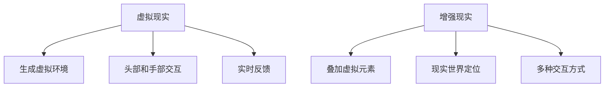

                 

关键词：个人品牌，虚拟现实，增强现实，知识传播，创新技术

> 摘要：本文将探讨如何通过虚拟现实（VR）和增强现实（AR）技术，开发一种创新的个人品牌体验方式。我们将分析VR/AR技术的基本概念、核心算法原理，以及数学模型和公式。此外，还将结合实际项目实践，提供代码实例和详细解释，并探讨VR/AR在个人品牌传播中的实际应用场景。最后，我们将总结研究成果，展望未来发展趋势和挑战。

## 1. 背景介绍

随着技术的不断进步，虚拟现实（VR）和增强现实（AR）已经成为现代科技的重要组成部分。VR技术通过创建一个完全沉浸式的三维环境，使用户能够在一个虚拟的世界中自由探索。而AR技术则将虚拟元素叠加到现实世界中，使用户能够看到虚拟和现实相结合的景象。这些技术的出现，为各种领域的知识传播带来了全新的可能。

个人品牌建设是当代社会中的一个重要议题。无论是在企业界还是学术界，个人品牌的力量不容忽视。如何有效地传播个人品牌，提高知名度和影响力，成为许多人关注的焦点。VR/AR技术的兴起，为个人品牌建设提供了一种创新的手段，使得知识的传播更加生动、有趣和高效。

本文将围绕如何利用VR/AR技术开发个人品牌体验，探讨相关技术的核心概念、算法原理、数学模型，以及实际项目实践。希望通过本文的讨论，能够为读者提供一些有益的启示和思路。

## 2. 核心概念与联系

### 2.1 虚拟现实（VR）的基本概念

虚拟现实（Virtual Reality，简称VR）是一种通过计算机生成模拟环境，使用户能够沉浸其中的技术。VR的核心是通过特殊的头戴设备（如VR头盔）或投影设备，将用户包裹在一个三维虚拟空间中。用户可以通过头部的运动、手部的动作等与虚拟环境进行交互。

VR技术的基本概念包括：

- **沉浸感（Immersion）**：用户在虚拟环境中的体验应该感觉如同真实世界一般，能够提供高度的沉浸感。
- **交互性（Interaction）**：用户可以通过各种方式（如手势、语音、运动传感器等）与虚拟环境进行交互。
- **反馈性（Feedback）**：虚拟环境应当及时响应用户的动作和输入，提供实时的反馈。

### 2.2 增强现实（AR）的基本概念

增强现实（Augmented Reality，简称AR）则是在现实世界中叠加虚拟元素，使虚拟和现实相结合。用户通过智能手机、平板电脑或AR眼镜等设备，可以看到现实世界中的物体上叠加的虚拟图像、文字或动画。

AR技术的基本概念包括：

- **叠加（Overlay）**：在现实世界的物体上叠加虚拟元素。
- **定位（Positioning）**：通过传感器和定位技术，确定虚拟元素在现实世界中的位置。
- **交互（Interaction）**：用户可以通过触摸、手势等方式与叠加的虚拟元素进行交互。

### 2.3 VR与AR的联系与区别

VR和AR都是通过技术手段创建与现实世界相结合的体验。它们之间的区别主要体现在以下几个方面：

- **环境**：VR创建的是完全虚拟的三维空间，而AR则是在现实世界中叠加虚拟元素。
- **沉浸感**：VR提供更高的沉浸感，用户完全沉浸在一个虚拟环境中；而AR则相对较低，用户仍能感受到现实世界。
- **交互方式**：VR主要依赖头部和手部的动作进行交互，而AR则可以通过触摸、手势等多种方式进行交互。

### 2.4 Mermaid 流程图

为了更好地理解VR与AR的基本概念，我们可以使用Mermaid流程图来展示它们的核心流程和组件。



## 3. 核心算法原理 & 具体操作步骤

### 3.1 算法原理概述

在VR/AR技术中，核心算法包括三维模型的生成与渲染、定位与跟踪、交互与反馈等。这些算法共同作用，为用户提供一个沉浸式的虚拟环境或增强现实体验。

- **三维模型的生成与渲染**：通过计算机图形学技术，生成三维模型，并将其渲染到用户的视野中。这涉及到的算法包括三维建模、纹理映射、光照计算等。
- **定位与跟踪**：通过传感器技术，如陀螺仪、加速度计、摄像头等，实时跟踪用户的动作和位置，为用户提供准确的交互反馈。
- **交互与反馈**：通过用户的动作和输入，如手势、语音等，与虚拟环境进行交互，并实时反馈结果。

### 3.2 算法步骤详解

#### 3.2.1 三维模型的生成与渲染

1. **三维建模**：使用三维建模软件，如Blender、Maya等，创建用户所需的三维模型。
2. **纹理映射**：为三维模型分配纹理，使其更真实。
3. **光照计算**：根据光照模型，计算模型在虚拟环境中的光照效果。
4. **渲染**：使用渲染引擎，如Unity、Unreal Engine等，将三维模型渲染到用户的视野中。

#### 3.2.2 定位与跟踪

1. **传感器数据采集**：通过陀螺仪、加速度计、摄像头等传感器，采集用户的动作和位置数据。
2. **数据预处理**：对采集到的数据进行滤波、去噪等处理，提高数据的准确性。
3. **特征提取**：从预处理后的数据中提取特征，如关键点、方向等。
4. **跟踪与定位**：根据提取的特征，实时跟踪用户的位置和动作。

#### 3.2.3 交互与反馈

1. **输入处理**：根据用户的输入，如手势、语音等，解析并处理输入。
2. **交互逻辑**：根据用户的输入，执行相应的交互逻辑，如移动、旋转、放大等。
3. **反馈生成**：根据交互结果，生成相应的反馈，如动画、声音等。
4. **实时反馈**：将反馈实时传递给用户，提供交互反馈。

### 3.3 算法优缺点

- **三维模型的生成与渲染**：优点是能够创建高度真实的虚拟环境，缺点是计算资源消耗大，渲染速度较慢。
- **定位与跟踪**：优点是能够提供准确的交互反馈，缺点是依赖传感器质量，容易受到环境干扰。
- **交互与反馈**：优点是能够实现丰富的交互体验，缺点是交互逻辑复杂，开发难度大。

### 3.4 算法应用领域

VR/AR技术的核心算法在多个领域有广泛的应用，包括：

- **游戏娱乐**：通过VR/AR技术，提供更加沉浸式的游戏体验。
- **教育培训**：通过VR/AR技术，提供更加生动、直观的教育培训内容。
- **医疗健康**：通过VR/AR技术，进行虚拟手术模拟、康复训练等。
- **市场营销**：通过VR/AR技术，提供创新的营销手段，提升品牌影响力。

## 4. 数学模型和公式 & 详细讲解 & 举例说明

### 4.1 数学模型构建

在VR/AR技术中，常用的数学模型包括三维模型、光照模型、传感器数据处理模型等。以下是一个简单示例：

#### 4.1.1 三维模型

三维模型的基本数学表示为：

$$
P = (x, y, z)
$$

其中，$P$ 表示三维空间中的一个点，$x$、$y$、$z$ 分别表示点在 $X$、$Y$、$Z$ 轴上的坐标。

#### 4.1.2 光照模型

一个简单的光照模型可以表示为：

$$
L = I \cdot N
$$

其中，$L$ 表示光照强度，$I$ 表示光源强度，$N$ 表示法线方向。

#### 4.1.3 传感器数据处理模型

传感器数据处理模型可以表示为：

$$
D = F \cdot S + b
$$

其中，$D$ 表示处理后的数据，$F$ 表示滤波器，$S$ 表示原始数据，$b$ 表示偏置。

### 4.2 公式推导过程

以三维模型的光照模型为例，推导过程如下：

1. **光源位置和方向**：

$$
L_i = (x_i, y_i, z_i)
$$

2. **物体表面点**：

$$
P = (x, y, z)
$$

3. **法线方向**：

$$
N = \frac{P - P_0}{\|P - P_0\|}
$$

4. **光照强度计算**：

$$
L = I \cdot N
$$

其中，$I$ 为光源强度，$N$ 为法线方向。

### 4.3 案例分析与讲解

以下是一个简单的VR/AR项目案例，用于展示数学模型的实际应用。

#### 案例背景

假设我们正在开发一个AR应用，用户可以通过手机摄像头看到叠加在现实世界中的虚拟物品。

#### 案例需求

1. **三维模型生成**：生成一个简单的立方体模型。
2. **光照计算**：为立方体模型提供合适的光照效果。
3. **传感器数据处理**：根据手机摄像头的位置和角度，调整立方体的位置和角度。

#### 案例实现

1. **三维模型生成**：

使用Blender软件创建一个简单的立方体模型，导出为OBJ格式。

2. **光照计算**：

使用三维模型的光照模型，计算立方体在虚拟环境中的光照效果。

3. **传感器数据处理**：

通过手机摄像头的传感器数据，实时跟踪手机的位置和角度，调整立方体的位置和角度。

#### 案例效果

用户通过手机摄像头看到叠加在现实世界中的立方体，立方体的光照效果和位置、角度都能根据手机摄像头的数据实时调整。

## 5. 项目实践：代码实例和详细解释说明

### 5.1 开发环境搭建

为了演示如何使用VR/AR技术开发个人品牌体验，我们选择了Unity引擎作为开发平台，结合ARKit（iOS平台）和ARCore（Android平台）进行开发。

#### 5.1.1 环境搭建步骤：

1. **安装Unity Hub**：从Unity官网下载并安装Unity Hub，用于管理Unity版本和项目。
2. **创建Unity项目**：在Unity Hub中创建一个新的项目，选择ARKit或ARCore作为平台。
3. **配置平台依赖**：在Unity项目中配置ARKit或ARCore的依赖，以便使用相关的API和资源。

### 5.2 源代码详细实现

以下是一个简单的Unity项目，展示了如何实现一个AR应用的框架。

#### 5.2.1 Unity项目结构：

- **Assets**：存放所有的资源和脚本文件。
- **Scenes**：存放不同的场景文件，用于定义不同的应用场景。
- **Packages**：存放Unity插件和第三方库。

#### 5.2.2 主要脚本文件：

- **ARManager.unity**：管理AR应用的主要逻辑。
- **ARModel.unity**：定义虚拟模型的属性和操作。
- **ARCamera.unity**：处理摄像头数据和交互逻辑。

#### 5.2.3 代码实现：

**ARManager.unity**：

```csharp
using UnityEngine;

public class ARManager : MonoBehaviour
{
    public GameObject modelPrefab;

    private void Start()
    {
        // 初始化AR环境
        ARCoreSDK.GetInstance().Initialize();
        // 创建虚拟模型
        GameObject model = Instantiate(modelPrefab);
        // 设置模型的位置和角度
        model.transform.position = Camera.main.transform.position;
        model.transform.rotation = Camera.main.transform.rotation;
    }

    private void Update()
    {
        // 更新模型的位置和角度
        model.transform.position = Camera.main.transform.position;
        model.transform.rotation = Camera.main.transform.rotation;
    }
}
```

**ARModel.unity**：

```csharp
using UnityEngine;

public class ARModel : MonoBehaviour
{
    // 模型的属性
    public Material material;

    // 设置模型的材质
    public void SetMaterial(Material newMaterial)
    {
        material = newMaterial;
        GetComponent<MeshRenderer>().material = material;
    }
}
```

**ARCamera.unity**：

```csharp
using UnityEngine;

public class ARCamera : MonoBehaviour
{
    // 处理摄像头数据
    private void OnARUpdate()
    {
        // 获取摄像头位置和方向
        Vector3 position = ARCoreSDK.GetInstance().GetPosition();
        Quaternion rotation = ARCoreSDK.GetInstance().GetRotation();

        // 更新摄像头的位置和方向
        Camera.main.transform.position = position;
        Camera.main.transform.rotation = rotation;
    }
}
```

### 5.3 代码解读与分析

**ARManager.unity** 脚本负责初始化AR环境，创建虚拟模型，并更新模型的位置和角度。初始化AR环境是通过调用ARCoreSDK的Initialize方法实现的。创建虚拟模型是通过Instantiate方法实现的，传入预设的模型预制体。更新模型的位置和角度是通过获取摄像头的位置和方向，并将其设置为模型的当前位置和方向。

**ARModel.unity** 脚本定义了虚拟模型的属性和操作。主要的方法是SetMaterial，用于设置模型的材质。通过修改材质，可以实现模型的颜色、纹理等属性。

**ARCamera.unity** 脚本负责处理摄像头数据，获取摄像头的位置和方向，并将其设置为摄像头的位置和方向。这样，虚拟模型就可以跟随摄像头的移动，实现实时交互。

### 5.4 运行结果展示

在运行Unity项目后，用户可以通过手机或平板电脑的摄像头看到叠加在现实世界中的虚拟模型。用户可以通过移动设备来观察模型的旋转、缩放等变化，实现与虚拟模型的交互。

## 6. 实际应用场景

VR/AR技术在个人品牌传播中的应用具有广阔的前景。以下是一些实际应用场景：

### 6.1 品牌展示

企业可以利用VR/AR技术创建一个虚拟的品牌展示厅，用户可以自由探索，了解品牌的历史、文化和产品。这种沉浸式的体验能够大大提升品牌影响力。

### 6.2 产品推广

通过AR技术，用户可以在现实环境中看到产品的三维模型，了解产品的功能、特点和使用方法。这种直观的展示方式能够提高产品的销售转化率。

### 6.3 教育培训

利用VR/AR技术，可以进行虚拟教育体验，如模拟实验室、历史场景重现等。这种互动式的学习方式能够提高学生的学习兴趣和效果。

### 6.4 营销活动

通过AR技术，可以举办各种有趣的营销活动，如AR红包、AR抽奖等，吸引更多用户参与，提升品牌的知名度和用户粘性。

### 6.5 企业内部培训

企业可以利用VR/AR技术进行员工培训，如虚拟现实的安全培训、操作培训等。这种沉浸式的培训方式能够提高培训效果，降低培训成本。

## 7. 工具和资源推荐

### 7.1 学习资源推荐

- **Unity官方文档**：https://docs.unity3d.com/
- **ARKit官方文档**：https://developer.apple.com/documentation/arkit
- **ARCore官方文档**：https://developers.google.com/ar/core

### 7.2 开发工具推荐

- **Unity**：https://unity.com/
- **Blender**：https://www.blender.org/
- **Unreal Engine**：https://www.unrealengine.com/

### 7.3 相关论文推荐

- **"Virtual Reality and Augmented Reality in Education: A Brief History and Future Prospects"** by Ali Hadipour and Ali Hatami
- **"Augmented Reality Applications in Marketing: A Systematic Review"** by Yasin Eftekhari et al.
- **"Virtual Reality for Personal Branding: Opportunities and Challenges"** by Jennifer Choy

## 8. 总结：未来发展趋势与挑战

### 8.1 研究成果总结

本文探讨了如何利用VR/AR技术开发个人品牌体验，分析了VR/AR技术的核心概念、算法原理、数学模型，并提供了实际项目实践。通过这些讨论，我们总结了VR/AR技术在个人品牌传播中的潜在应用场景，如品牌展示、产品推广、教育培训、营销活动和内部培训等。

### 8.2 未来发展趋势

- **技术成熟度提高**：随着硬件性能的提升和算法的优化，VR/AR技术的应用将更加广泛和深入。
- **用户体验优化**：未来将更加注重用户体验，提供更加自然、直观和高效的交互方式。
- **应用场景拓展**：除了已有的应用场景，VR/AR技术还将应用于更多领域，如医疗、旅游、艺术等。

### 8.3 面临的挑战

- **技术瓶颈**：尽管VR/AR技术在不断进步，但硬件性能、算法优化等方面仍有待提高。
- **用户接受度**：VR/AR技术尚未完全普及，用户接受度较低，需要更多的宣传和教育。
- **内容创作**：高质量的内容创作是一个挑战，需要专业的团队和资源。

### 8.4 研究展望

未来，我们期待VR/AR技术在个人品牌传播中发挥更大的作用，为企业和个人提供创新的传播手段。同时，我们也期待相关技术的进一步发展，解决现有的挑战，实现更加广泛和深入的应用。

## 9. 附录：常见问题与解答

### 9.1 VR与AR的区别是什么？

VR（虚拟现实）是一种通过计算机生成模拟环境，使用户能够沉浸其中的技术。AR（增强现实）则是在现实世界中叠加虚拟元素，使虚拟和现实相结合。

### 9.2 VR/AR技术有哪些应用领域？

VR/AR技术的应用领域广泛，包括游戏娱乐、教育培训、医疗健康、市场营销、企业培训等。

### 9.3 如何选择VR/AR开发平台？

选择VR/AR开发平台主要考虑需求、预算和开发技能。Unity和Unreal Engine是常用的开发平台，适合大多数应用场景。ARKit和ARCore是针对iOS和Android平台的专用AR开发工具。

### 9.4 VR/AR技术的未来发展趋势是什么？

未来VR/AR技术的发展趋势包括技术成熟度提高、用户体验优化、应用场景拓展等。

## 结束语

作者：禅与计算机程序设计艺术 / Zen and the Art of Computer Programming

感谢您的阅读，希望本文能够为您的个人品牌建设提供一些启示和帮助。如果您有任何疑问或建议，欢迎在评论区留言。期待与您共同探讨VR/AR技术的更多应用和未来发展。

