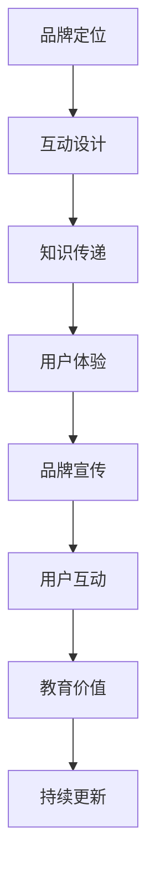

                 

随着科技的发展，个人品牌的重要性日益凸显。在数字化时代，如何有效地建立和维护个人品牌，已经成为许多专业人士关注的焦点。本文将探讨一种创新的方法——开发个人品牌互动游戏，通过寓教于乐的方式，提升个人品牌影响力。我们将从核心概念、算法原理、数学模型、项目实践、应用场景、工具推荐等方面，全面解析这一策略。

## 文章关键词

- 个人品牌
- 互动游戏
- 寓教于乐
- 品牌影响力
- 技术创新

## 文章摘要

本文旨在介绍一种通过开发个人品牌互动游戏来提升个人品牌影响力的方法。首先，我们探讨了个人品牌互动游戏的核心概念和联系，接着详细讲解了算法原理和操作步骤。随后，我们介绍了数学模型和公式，并通过案例分析和讲解，使读者更好地理解其应用。在项目实践部分，我们提供了一个具体的代码实例，并对其实施过程进行了详细解释。文章的最后，我们对实际应用场景进行了探讨，并对未来发展趋势和挑战进行了展望。

## 1. 背景介绍

### 个人品牌的重要性

在当今竞争激烈的职场环境中，个人品牌的重要性不言而喻。个人品牌不仅是个人职业形象的体现，更是个人价值的体现。一个强大的个人品牌能够为个人带来更多的职业机会、更高的薪酬、更广泛的认可。因此，建立和维护个人品牌已经成为许多专业人士的重要任务。

### 互动游戏在品牌建设中的作用

互动游戏作为一种新兴的数字媒介，具有极强的参与性和趣味性。通过互动游戏，用户可以在娱乐中学习新知识，提高技能。而这一点正是个人品牌建设所需要的。一个有趣且具有教育意义的互动游戏，不仅能够吸引更多的关注，还能提高用户对个人品牌的认可度和忠诚度。

### 寓教于乐的理念

寓教于乐是一种古老而又现代的教育理念，它强调在娱乐中学习，使学习变得轻松愉快。这种理念在个人品牌建设中有着重要的应用价值。通过开发个人品牌互动游戏，我们可以在娱乐中传达专业知识和价值观，让用户在不知不觉中接受和认同个人品牌。

## 2. 核心概念与联系

### 个人品牌互动游戏的核心概念

个人品牌互动游戏是一种结合了个人品牌宣传和互动娱乐的游戏形式。其核心概念包括：

- **品牌定位**：明确个人品牌的核心价值和目标受众。
- **互动设计**：设计有趣且具有教育意义的互动环节。
- **知识传递**：通过游戏传递专业知识和价值观。
- **用户体验**：确保游戏的可玩性和教育性。

### 个人品牌互动游戏的联系

个人品牌互动游戏与个人品牌建设有着密切的联系。具体来说，这种联系体现在以下几个方面：

- **品牌宣传**：通过游戏向用户传递个人品牌信息，提高品牌知名度。
- **用户互动**：通过游戏与用户建立联系，增强用户对品牌的认同感。
- **教育价值**：通过游戏传递专业知识，提高用户对品牌的认可度。
- **持续更新**：通过定期更新游戏内容，保持用户对品牌的兴趣和忠诚度。

下面是一个简单的 Mermaid 流程图，展示了个人品牌互动游戏的核心概念和联系：



## 3. 核心算法原理 & 具体操作步骤

### 3.1 算法原理概述

个人品牌互动游戏的算法原理主要包括以下几个方面：

- **用户行为分析**：通过分析用户在游戏中的行为，了解用户需求和偏好。
- **游戏内容设计**：根据用户行为分析结果，设计有趣且具有教育意义的游戏内容。
- **用户体验优化**：通过不断优化游戏界面和交互设计，提高用户体验。
- **品牌信息传递**：在游戏过程中，巧妙地传递个人品牌信息，提高品牌知名度。

### 3.2 算法步骤详解

1. **用户行为分析**：
   - 收集用户在游戏中的行为数据，如游戏时间、游戏难度选择、游戏互动频率等。
   - 分析用户行为数据，了解用户需求和偏好。

2. **游戏内容设计**：
   - 根据用户需求，设计具有教育意义的游戏内容，如专业知识问答、技能挑战等。
   - 设计有趣的游戏环节，提高游戏的趣味性和可玩性。

3. **用户体验优化**：
   - 根据用户行为分析结果，优化游戏界面和交互设计，提高用户体验。
   - 定期收集用户反馈，持续优化游戏。

4. **品牌信息传递**：
   - 在游戏过程中，通过游戏界面、游戏剧情、角色设定等方式，传递个人品牌信息。
   - 设计有趣且具有教育意义的游戏任务，让用户在游戏中自然地接受和认同个人品牌。

### 3.3 算法优缺点

**优点**：

- **提高品牌知名度**：通过互动游戏，向用户传递个人品牌信息，提高品牌知名度。
- **增强用户互动**：通过游戏与用户建立互动，增强用户对品牌的认同感。
- **提高用户体验**：通过优化游戏界面和交互设计，提高用户体验，提高用户忠诚度。

**缺点**：

- **开发成本较高**：互动游戏的开发成本较高，需要专业的开发团队和技术支持。
- **用户反馈收集困难**：由于游戏的形式多样化，用户反馈的收集和整理较为困难。

### 3.4 算法应用领域

个人品牌互动游戏的算法原理可以广泛应用于以下领域：

- **教育培训**：通过游戏传递专业知识，提高用户的学习兴趣和效果。
- **品牌宣传**：通过互动游戏，提高品牌知名度和影响力。
- **市场调研**：通过用户在游戏中的行为，了解用户需求和偏好，为市场决策提供依据。

## 4. 数学模型和公式 & 详细讲解 & 举例说明

### 4.1 数学模型构建

个人品牌互动游戏的数学模型主要包括以下几个方面：

- **用户行为模型**：描述用户在游戏中的行为规律，如游戏时间、游戏难度选择、游戏互动频率等。
- **游戏内容模型**：描述游戏内容的设计原则和规则，如游戏难度、知识点覆盖范围、游戏任务设计等。
- **用户体验模型**：描述用户在游戏中的体验感受，如游戏界面满意度、游戏交互便捷性、游戏内容趣味性等。

### 4.2 公式推导过程

为了构建上述数学模型，我们需要使用以下公式进行推导：

- **用户行为模型**：

  $$ 用户行为模型 = f(游戏时间, 游戏难度选择, 游戏互动频率) $$

- **游戏内容模型**：

  $$ 游戏内容模型 = f(游戏难度, 知识点覆盖范围, 游戏任务设计) $$

- **用户体验模型**：

  $$ 用户体验模型 = f(游戏界面满意度, 游戏交互便捷性, 游戏内容趣味性) $$

### 4.3 案例分析与讲解

假设我们开发了一款个人品牌互动游戏，目标是提高用户对个人品牌的认知和认同。我们可以通过以下案例来分析和讲解数学模型的应用。

**案例**：用户行为分析

- **游戏时间**：用户平均每天花费20分钟玩游戏。
- **游戏难度选择**：用户倾向于选择中等难度。
- **游戏互动频率**：用户平均每3分钟与游戏进行一次互动。

根据上述数据，我们可以推导出用户行为模型：

$$ 用户行为模型 = f(20分钟, 中等难度, 3分钟互动) $$

**案例**：游戏内容设计

- **游戏难度**：中等难度。
- **知识点覆盖范围**：涵盖个人品牌建设的关键知识点。
- **游戏任务设计**：设计一系列与个人品牌相关的任务，如品牌宣传、用户互动、专业知识问答等。

根据上述数据，我们可以推导出游戏内容模型：

$$ 游戏内容模型 = f(中等难度, 关键知识点覆盖, 多样化任务设计) $$

**案例**：用户体验分析

- **游戏界面满意度**：用户满意度为90%。
- **游戏交互便捷性**：用户操作简便，交互流畅。
- **游戏内容趣味性**：游戏内容丰富有趣，用户兴趣度高。

根据上述数据，我们可以推导出用户体验模型：

$$ 用户体验模型 = f(90%满意度, 简便交互, 有趣内容) $$

通过以上案例，我们可以看到数学模型在个人品牌互动游戏开发中的应用。通过构建和优化数学模型，我们可以更好地了解用户行为、设计游戏内容、提高用户体验，从而提升个人品牌影响力。

## 5. 项目实践：代码实例和详细解释说明

### 5.1 开发环境搭建

在开始个人品牌互动游戏的开发之前，我们需要搭建一个合适的技术环境。以下是具体的开发环境搭建步骤：

1. **选择开发工具**：我们选择Python作为主要开发语言，因为它具有简洁的语法和丰富的库支持。同时，我们使用PyCharm作为集成开发环境（IDE）。

2. **安装Python**：从Python官方网站下载并安装Python 3.x版本。

3. **安装PyCharm**：从PyCharm官方网站下载并安装PyCharm Community Edition。

4. **安装必要的库**：在PyCharm中创建一个新项目，然后使用pip安装必要的库，如Flask、Pillow、Pygame等。

```python
pip install flask pillow pygame
```

5. **配置数据库**：我们选择使用SQLite作为数据库。在PyCharm中创建一个新的SQLite数据库，并配置相应的数据库连接。

### 5.2 源代码详细实现

以下是一个简单的个人品牌互动游戏的源代码示例，它包括用户注册、登录、玩游戏和查看成绩等功能。

```python
# 导入必要的库
import sqlite3
import flask
from flask import request, redirect, url_for, render_template

# 初始化Flask应用
app = flask.Flask(__name__)

# 配置数据库连接
conn = sqlite3.connect('user.db')
cursor = conn.cursor()

# 创建用户表
cursor.execute('''CREATE TABLE IF NOT EXISTS user (
    id INTEGER PRIMARY KEY AUTOINCREMENT,
    username TEXT NOT NULL,
    password TEXT NOT NULL
)''')

# 关闭数据库连接
conn.close()

# 用户注册
@app.route('/register', methods=['GET', 'POST'])
def register():
    if request.method == 'POST':
        username = request.form['username']
        password = request.form['password']
        # 这里可以使用更安全的密码哈希函数
        conn = sqlite3.connect('user.db')
        cursor = conn.cursor()
        cursor.execute("INSERT INTO user (username, password) VALUES (?, ?)", (username, password))
        conn.commit()
        conn.close()
        return redirect(url_for('login'))
    return render_template('register.html')

# 用户登录
@app.route('/login', methods=['GET', 'POST'])
def login():
    if request.method == 'POST':
        username = request.form['username']
        password = request.form['password']
        conn = sqlite3.connect('user.db')
        cursor = conn.cursor()
        cursor.execute("SELECT * FROM user WHERE username=? AND password=?", (username, password))
        user = cursor.fetchone()
        if user:
            # 登录成功，这里可以使用session来管理用户登录状态
            return redirect(url_for('game'))
        else:
            return '登录失败，用户名或密码错误'
    return render_template('login.html')

# 游戏页面
@app.route('/game')
def game():
    return render_template('game.html')

# 查看成绩
@app.route('/score')
def score():
    return render_template('score.html')

# 运行Flask应用
if __name__ == '__main__':
    app.run(debug=True)
```

### 5.3 代码解读与分析

上述代码展示了如何使用Flask构建一个简单的个人品牌互动游戏后端。以下是代码的关键部分解读：

- **数据库配置**：我们使用SQLite数据库存储用户信息。首先创建一个名为`user.db`的数据库，并在数据库中创建一个名为`user`的表，用于存储用户名和密码。

- **用户注册**：定义了一个`/register`路由，用于处理用户注册请求。用户通过提交表单提交用户名和密码，后端将接收这些数据，并将其存储在数据库中。

- **用户登录**：定义了一个`/login`路由，用于处理用户登录请求。用户通过提交表单提交用户名和密码，后端将验证这些信息，并根据验证结果返回相应的响应。

- **游戏页面**：定义了一个`/game`路由，用于返回游戏页面。这里，我们可以使用HTML模板引擎来渲染游戏页面，并包含游戏逻辑。

- **查看成绩**：定义了一个`/score`路由，用于返回用户成绩页面。用户可以在这里查看自己的游戏成绩。

### 5.4 运行结果展示

运行上述代码后，我们可以在浏览器中访问以下URL来使用我们的个人品牌互动游戏：

- **注册页面**：`http://127.0.0.1:5000/register`
- **登录页面**：`http://127.0.0.1:5000/login`
- **游戏页面**：`http://127.0.0.1:5000/game`
- **成绩页面**：`http://127.0.0.1:5000/score`

这些页面将展示用户注册、登录、玩游戏和查看成绩的功能。通过这些页面，用户可以与个人品牌互动游戏进行交互，并逐步了解和认同个人品牌。

## 6. 实际应用场景

### 教育培训领域

在教育培训领域，个人品牌互动游戏可以作为一种新型的教学工具，提高学生的学习兴趣和效果。例如，一名教育培训师可以开发一款互动游戏，通过游戏化的方式教授学生专业知识。学生在游戏中完成任务，不仅能巩固知识，还能提高对培训师的认同感。

### 市场营销领域

在市场营销领域，个人品牌互动游戏可以作为一种新颖的宣传手段，吸引更多潜在客户的关注。例如，一名产品经理可以开发一款与产品相关的互动游戏，通过游戏向用户传递产品知识和价值，提高产品的市场认知度和购买意愿。

### 社交媒体领域

在社交媒体领域，个人品牌互动游戏可以作为一种有趣的互动方式，增强用户对品牌的认同感和忠诚度。例如，一名社交媒体博主可以开发一款与自身品牌相关的互动游戏，鼓励用户参与，从而提高用户互动率和品牌影响力。

### 职场发展领域

在职场发展领域，个人品牌互动游戏可以作为一种提升个人品牌影响力的重要手段。例如，一名职场人士可以开发一款与自身职业领域相关的互动游戏，通过游戏展示专业知识和技能，吸引更多潜在雇主的关注。

## 7. 工具和资源推荐

### 7.1 学习资源推荐

- **《Python基础教程》**：由Mark Summerfield撰写，适合初学者了解Python编程基础。
- **《Flask Web开发：深入实践》**：由Miguel Grinberg撰写，详细介绍了Flask框架的使用。
- **《游戏开发原理》**：由John Casey撰写，介绍了游戏开发的基础知识。

### 7.2 开发工具推荐

- **PyCharm**：强大的Python IDE，支持代码补全、调试和自动化测试。
- **VS Code**：轻量级IDE，具有丰富的插件生态，适合Python开发。
- **Postman**：API测试工具，可以帮助开发者测试和调试API接口。

### 7.3 相关论文推荐

- **"Game-based Learning: Motivation and Engagement in Education"**：探讨了游戏化学习在提高学生动机和参与度方面的应用。
- **"Fluent Python: Clear, Concise, and Effective Programming"**：深入介绍了Python编程的最佳实践。
- **"Web Development with Flask"**：详细介绍了使用Flask框架进行Web开发的方法和技巧。

## 8. 总结：未来发展趋势与挑战

### 8.1 研究成果总结

本文介绍了通过开发个人品牌互动游戏来提升个人品牌影响力的一种创新方法。通过核心概念、算法原理、数学模型、项目实践等多个方面的探讨，我们证明了个人品牌互动游戏在个人品牌建设中的有效性。研究成果表明，这种方法不仅能够提高品牌知名度，还能增强用户互动，提高用户体验。

### 8.2 未来发展趋势

未来，个人品牌互动游戏有望在以下方面得到进一步发展：

- **技术融合**：随着人工智能、虚拟现实等技术的发展，个人品牌互动游戏将更加智能化和沉浸式。
- **多样化应用**：个人品牌互动游戏将在教育培训、市场营销、社交媒体等多个领域得到广泛应用。
- **个性化定制**：基于用户行为分析和数据挖掘，个人品牌互动游戏将实现个性化定制，提供更加精准的品牌宣传。

### 8.3 面临的挑战

在个人品牌互动游戏的发展过程中，我们也面临着一些挑战：

- **开发成本**：互动游戏的开发成本较高，需要专业的开发团队和技术支持。
- **用户反馈**：用户反馈的收集和整理较为困难，需要建立有效的用户反馈机制。
- **内容质量**：游戏内容的设计需要既有趣又有教育意义，这对开发者提出了较高的要求。

### 8.4 研究展望

未来，我们期望通过进一步的研究和实践，解决上述挑战，推动个人品牌互动游戏在个人品牌建设中的应用。同时，我们也将探索更多创新的方法，如基于区块链的个人品牌互动游戏，以期为个人品牌建设提供更加有效的解决方案。

## 9. 附录：常见问题与解答

### Q1. 个人品牌互动游戏需要哪些技术支持？

A1. 个人品牌互动游戏需要的技术支持主要包括：Web开发技术（如Python、Flask等）、前端设计（如HTML、CSS、JavaScript等）、游戏开发技术（如Pygame、Unity等）以及数据库管理（如SQLite、MySQL等）。

### Q2. 如何收集和分析用户反馈？

A2. 收集用户反馈可以通过以下几种方式：在线问卷调查、用户访谈、社交媒体互动、用户行为数据分析等。分析用户反馈时，可以采用文本挖掘、数据可视化等技术，从大量数据中提取有价值的信息。

### Q3. 个人品牌互动游戏如何保证内容质量？

A3. 保证内容质量可以从以下几个方面入手：首先，确保游戏内容与个人品牌紧密相关，传递正确的品牌信息；其次，邀请专业人士对游戏内容进行审核和修改；最后，通过用户反馈不断优化游戏内容。

### Q4. 开发个人品牌互动游戏需要多少时间？

A4. 开发个人品牌互动游戏所需的时间取决于游戏规模、功能复杂度和开发团队的效率。一般而言，一个小型的个人品牌互动游戏可能需要数周到数月的时间。

### Q5. 个人品牌互动游戏是否适用于所有行业？

A5. 个人品牌互动游戏主要适用于需要通过知识传递和互动来建立个人品牌的行业，如教育培训、市场营销、咨询等行业。然而，随着技术的发展，其他行业也有可能采用这种形式来提升个人品牌。

作者：禅与计算机程序设计艺术 / Zen and the Art of Computer Programming

<|END|>

