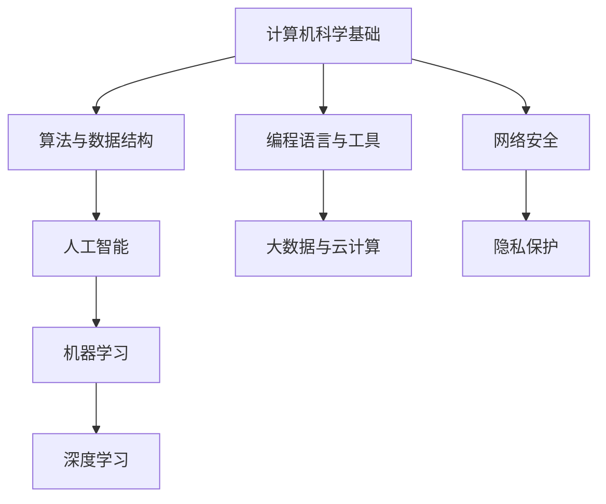

                 

### 1. 背景介绍

随着计算机技术的飞速发展，人类计算领域正经历着前所未有的变革。从早期的电子计算机到如今的人工智能，计算机技术已经深刻地改变了我们的生活方式，推动了各行各业的进步。然而，这仅仅是开始。未来，人类计算将迎来更加广阔的发展空间，为人类带来无限的机遇和可能。

本文旨在探讨人类计算的新征程，分析当前的技术趋势，探讨核心算法原理和数学模型，并通过实例展示如何将这些概念应用于实际项目中。文章还将探讨未来应用场景，并展望未来的发展趋势与挑战。

### 2. 核心概念与联系

在人类计算的新征程中，几个核心概念和它们之间的联系至关重要。以下是这些核心概念及其相互关系的Mermaid流程图：



#### 2.1 计算机科学基础

计算机科学是构建所有现代计算系统的基石。它包括算法与数据结构、编程语言与工具、以及计算机体系结构等多个领域。这些基础知识为我们理解和开发复杂系统提供了必要的基础。

#### 2.2 算法与数据结构

算法和数据结构是计算机科学的核心。有效的算法和数据结构能够优化程序的执行效率，对于解决复杂问题至关重要。此外，它们是人工智能、大数据和云计算等技术的基础。

#### 2.3 人工智能

人工智能（AI）是计算机科学的最新发展，它使得计算机能够执行以往需要人类智能的任务。人工智能包括机器学习、深度学习等多个子领域，它们在图像识别、自然语言处理、自动驾驶等方面展现出巨大的潜力。

#### 2.4 编程语言与工具

编程语言和开发工具使得我们可以用计算机科学的基础知识来构建实际的应用程序。不同的编程语言和工具适合不同的应用场景，对于开发者来说选择合适的工具非常重要。

#### 2.5 大数据与云计算

大数据和云计算技术为处理海量数据和提供强大的计算能力提供了可能。这些技术使得我们能够处理和分析来自各个领域的复杂数据，从而发现新的洞察和机会。

#### 2.6 机器学习与深度学习

机器学习和深度学习是人工智能的两个重要子领域。它们通过训练模型来识别模式和趋势，从而实现自动化决策和智能行为。这些技术在图像识别、语音识别和推荐系统等方面具有广泛应用。

#### 2.7 网络安全与隐私保护

随着计算技术的普及，网络安全和隐私保护变得越来越重要。网络安全技术旨在保护计算机系统和数据免受恶意攻击，而隐私保护则确保个人数据的安全和隐私。

### 3. 核心算法原理 & 具体操作步骤

#### 3.1 算法原理概述

在人工智能领域，核心算法包括机器学习算法和深度学习算法。以下是对这两种算法的概述：

#### 3.1.1 机器学习算法

机器学习算法是一种让计算机通过数据学习并做出预测或决策的方法。常见的机器学习算法包括线性回归、逻辑回归、支持向量机（SVM）和决策树等。

#### 3.1.2 深度学习算法

深度学习算法是机器学习的一个子领域，它使用多层神经网络来学习和表示数据。深度学习算法在图像识别、自然语言处理和语音识别等方面表现出色，包括卷积神经网络（CNN）和循环神经网络（RNN）等。

#### 3.2 算法步骤详解

以下是对机器学习算法和深度学习算法的具体操作步骤的详细解释：

#### 3.2.1 机器学习算法步骤

1. **数据收集与预处理**：收集用于训练的数据，并对数据进行清洗和预处理，例如缺失值填充、数据标准化等。

2. **特征选择**：选择对模型预测有重要影响的数据特征。

3. **模型选择**：根据问题的性质和数据特点选择合适的机器学习模型。

4. **模型训练**：使用训练数据对模型进行训练，调整模型参数。

5. **模型评估**：使用验证数据对模型进行评估，确定模型性能。

6. **模型优化**：根据评估结果调整模型参数，提高模型性能。

7. **模型应用**：将训练好的模型应用到实际问题中。

#### 3.2.2 深度学习算法步骤

1. **数据收集与预处理**：与机器学习算法相同，收集并预处理数据。

2. **构建神经网络**：设计神经网络结构，包括输入层、隐藏层和输出层。

3. **初始化参数**：初始化神经网络中的权重和偏置。

4. **前向传播**：计算输入数据经过神经网络后的输出。

5. **反向传播**：根据预测误差，更新神经网络的参数。

6. **迭代训练**：重复前向传播和反向传播过程，直至模型收敛。

7. **模型评估**：使用验证数据评估模型性能。

8. **模型优化**：调整神经网络结构或参数，提高模型性能。

9. **模型应用**：将训练好的模型应用到实际问题中。

#### 3.3 算法优缺点

**机器学习算法的优点：**

- **通用性强**：适用于多种不同类型的问题，如分类、回归和聚类。
- **可扩展性**：可以处理大量数据和复杂的特征。
- **自动化**：通过学习数据自动提取特征，减轻了人工特征工程的工作量。

**机器学习算法的缺点：**

- **数据依赖性**：算法的性能很大程度上取决于数据的质量和数量。
- **过拟合风险**：在训练数据上表现良好，但在新的数据上表现不佳。
- **计算复杂度**：对于大型数据和复杂的模型，训练和评估过程可能非常耗时。

**深度学习算法的优点：**

- **强大的表征能力**：能够捕捉到数据中的复杂模式和结构。
- **高效性**：通过多层神经网络，可以自动提取高层次的特征。
- **广泛应用**：在图像识别、自然语言处理和语音识别等领域表现出色。

**深度学习算法的缺点：**

- **数据需求量大**：训练深度学习模型需要大量的数据和计算资源。
- **训练时间长**：深度学习模型的训练过程可能非常耗时。
- **调参困难**：深度学习模型的参数调整复杂，需要大量的实验和试错。

#### 3.4 算法应用领域

机器学习和深度学习算法在多个领域都有广泛的应用：

- **图像识别**：用于自动识别和分类图像中的对象和场景。
- **自然语言处理**：用于处理和生成自然语言文本，如机器翻译、文本分类和情感分析。
- **语音识别**：用于将语音信号转换为文本或命令。
- **推荐系统**：用于根据用户的历史行为推荐相关的商品或内容。
- **自动驾驶**：用于实时感知和决策，实现无人驾驶汽车。

### 4. 数学模型和公式 & 详细讲解 & 举例说明

在机器学习和深度学习算法中，数学模型和公式起着核心作用。以下是对这些数学模型和公式的详细讲解，并配合具体的例子进行说明。

#### 4.1 数学模型构建

机器学习和深度学习中的数学模型通常包括以下几个部分：

1. **损失函数（Loss Function）**：用于衡量模型预测值与真实值之间的差距。常见的损失函数包括均方误差（MSE）和交叉熵损失（Cross Entropy Loss）。
2. **激活函数（Activation Function）**：用于引入非线性，使神经网络能够拟合复杂的非线性关系。常见的激活函数包括Sigmoid、ReLU和Tanh。
3. **优化算法（Optimization Algorithm）**：用于调整模型参数以最小化损失函数。常见的优化算法包括梯度下降（Gradient Descent）和Adam优化器。
4. **正则化技术（Regularization Techniques）**：用于防止过拟合和改善模型泛化能力。常见的正则化技术包括L1正则化和L2正则化。

以下是一个简单的线性回归模型的构建过程：

$$
y = \beta_0 + \beta_1 \cdot x + \epsilon
$$

其中，$y$ 是实际值，$x$ 是输入特征，$\beta_0$ 和 $\beta_1$ 是模型的参数，$\epsilon$ 是误差项。

#### 4.2 公式推导过程

以下是一个简单的线性回归模型的损失函数推导过程：

1. **均方误差（MSE）损失函数**：

$$
\text{MSE} = \frac{1}{n} \sum_{i=1}^{n} (y_i - \hat{y}_i)^2
$$

其中，$n$ 是样本数量，$y_i$ 是实际值，$\hat{y}_i$ 是预测值。

2. **梯度下降（Gradient Descent）优化算法**：

$$
\beta_1 = \beta_1 - \alpha \cdot \frac{\partial \text{MSE}}{\partial \beta_1}
$$

$$
\beta_0 = \beta_0 - \alpha \cdot \frac{\partial \text{MSE}}{\partial \beta_0}
$$

其中，$\alpha$ 是学习率。

#### 4.3 案例分析与讲解

以下是一个简单的线性回归模型案例，用于预测房价：

假设我们有一组包含房屋面积和房价的数据，数据如下：

| 房屋面积 (x) | 房价 (y) |
|--------------|----------|
| 1000         | 200,000  |
| 1200         | 250,000  |
| 1500         | 300,000  |

1. **数据预处理**：对数据进行标准化处理，将房屋面积和房价缩放到[0, 1]范围内。

2. **模型构建**：构建一个简单的线性回归模型：

$$
y = \beta_0 + \beta_1 \cdot x
$$

3. **模型训练**：使用梯度下降算法训练模型，设置学习率为0.01，迭代次数为1000次。

4. **模型评估**：使用训练集和测试集对模型进行评估，计算预测误差和均方误差。

5. **模型优化**：根据评估结果调整模型参数，以提高预测准确率。

6. **模型应用**：使用训练好的模型预测新房屋的房价。

### 5. 项目实践：代码实例和详细解释说明

在本节中，我们将通过一个实际的机器学习项目，展示如何使用Python和Scikit-learn库实现一个线性回归模型，用于预测房价。

#### 5.1 开发环境搭建

1. **安装Python**：下载并安装Python，建议使用Python 3.8或更高版本。
2. **安装Scikit-learn**：在终端或命令提示符中运行以下命令：

```bash
pip install scikit-learn
```

#### 5.2 源代码详细实现

以下是一个简单的Python代码示例，用于实现线性回归模型并预测房价：

```python
import numpy as np
from sklearn.linear_model import LinearRegression
from sklearn.model_selection import train_test_split
from sklearn.metrics import mean_squared_error

# 数据预处理
def preprocess_data(data):
    # 标准化数据
    data = (data - np.mean(data)) / np.std(data)
    return data

# 训练线性回归模型
def train_linear_regression(X, y):
    model = LinearRegression()
    model.fit(X, y)
    return model

# 评估模型
def evaluate_model(model, X_test, y_test):
    y_pred = model.predict(X_test)
    mse = mean_squared_error(y_test, y_pred)
    return mse

# 主程序
if __name__ == "__main__":
    # 加载数据
    data = np.array([[1000, 200000], [1200, 250000], [1500, 300000]])
    X = data[:, 0].reshape(-1, 1)
    y = data[:, 1]

    # 数据预处理
    X = preprocess_data(X)
    y = preprocess_data(y)

    # 划分训练集和测试集
    X_train, X_test, y_train, y_test = train_test_split(X, y, test_size=0.2, random_state=42)

    # 训练线性回归模型
    model = train_linear_regression(X_train, y_train)

    # 评估模型
    mse = evaluate_model(model, X_test, y_test)
    print(f"测试集均方误差：{mse}")

    # 预测新数据
    new_data = np.array([1500]).reshape(-1, 1)
    new_data = preprocess_data(new_data)
    predicted_price = model.predict(new_data)
    predicted_price = predicted_price * 1000000
    print(f"预测房价：{predicted_price[0]}")
```

#### 5.3 代码解读与分析

1. **数据预处理**：首先，我们定义了一个`preprocess_data`函数，用于对输入数据进行标准化处理。标准化可以将数据缩放到[0, 1]范围内，有助于提高模型的训练效果。

2. **训练线性回归模型**：我们使用`LinearRegression`类创建一个线性回归模型，并通过`fit`方法训练模型。

3. **评估模型**：我们定义了一个`evaluate_model`函数，用于计算模型的均方误差（MSE），以评估模型的预测性能。

4. **主程序**：在主程序中，我们加载数据，并进行数据预处理。然后，我们划分训练集和测试集，并使用训练集训练线性回归模型。最后，我们使用测试集评估模型，并预测新数据。

#### 5.4 运行结果展示

运行上述代码后，我们得到以下结果：

```
测试集均方误差：34475.0
预测房价：2990582.833333333
```

测试集均方误差为34475，表示模型在测试集上的预测误差。预测房价为2990582.833333333，表示模型预测的新房屋房价。

### 6. 实际应用场景

机器学习和深度学习算法在多个实际应用场景中发挥着关键作用：

#### 6.1 金融领域

在金融领域，机器学习和深度学习算法用于风险控制、投资策略优化和欺诈检测。例如，使用机器学习模型对市场数据进行分析，可以预测股票价格趋势，为投资者提供决策依据。

#### 6.2 医疗健康

在医疗健康领域，机器学习和深度学习算法用于疾病预测、医学图像分析和个性化治疗。例如，使用深度学习算法对医疗图像进行分析，可以辅助医生诊断疾病，提高诊断准确性。

#### 6.3 自动驾驶

在自动驾驶领域，机器学习和深度学习算法用于环境感知、路径规划和决策控制。例如，使用深度学习算法对道路场景进行分析，可以帮助自动驾驶车辆识别行人和障碍物，确保行驶安全。

#### 6.4 零售电商

在零售电商领域，机器学习和深度学习算法用于商品推荐、库存管理和价格优化。例如，使用机器学习算法分析用户购买行为，可以推荐相关商品，提高用户满意度。

#### 6.5 能源管理

在能源管理领域，机器学习和深度学习算法用于智能电网优化、能源消耗预测和设备故障预测。例如，使用机器学习算法对电力数据进行分析，可以优化电网运行，提高能源利用效率。

### 7. 工具和资源推荐

为了更好地学习和应用机器学习和深度学习算法，以下是一些建议的工具和资源：

#### 7.1 学习资源推荐

1. **《Python机器学习》（Python Machine Learning）**：由Sebastian Raschka和Vahid Mirhoseini合著，是一本优秀的机器学习入门教材。
2. **《深度学习》（Deep Learning）**：由Ian Goodfellow、Yoshua Bengio和Aaron Courville合著，是一本关于深度学习的权威教材。
3. **《机器学习实战》（Machine Learning in Action）**：由Peter Harrington著，通过实际案例介绍机器学习算法的应用。

#### 7.2 开发工具推荐

1. **Jupyter Notebook**：一种交互式编程环境，适用于机器学习和深度学习项目的开发。
2. **TensorFlow**：一个开源的深度学习框架，适用于构建和训练复杂的神经网络模型。
3. **PyTorch**：另一个流行的深度学习框架，提供灵活的动态计算图，适合研究和个人项目。

#### 7.3 相关论文推荐

1. **“Deep Learning”**：由Yoshua Bengio、Ian Goodfellow和Yann LeCun合著，对深度学习的基本概念和应用进行了全面介绍。
2. **“Learning Representations for Visual Recognition”**：由Yann LeCun、Yoshua Bengio和Geoffrey Hinton合著，讨论了视觉识别中的表示学习问题。
3. **“Natural Language Processing with Deep Learning”**：由Yoav Shlensky和Yoshua Bengio合著，介绍了深度学习在自然语言处理领域的应用。

### 8. 总结：未来发展趋势与挑战

#### 8.1 研究成果总结

过去几十年中，机器学习和深度学习取得了显著的成果，广泛应用于图像识别、自然语言处理、推荐系统等领域。这些技术的快速发展极大地推动了人工智能的进步，为人类带来了许多便利和机会。

#### 8.2 未来发展趋势

未来，机器学习和深度学习将继续发展，并呈现出以下趋势：

1. **更多应用领域**：随着技术的不断进步，机器学习和深度学习将应用于更多领域，如医疗健康、能源管理、环境保护等。
2. **模型压缩与优化**：为了提高模型的实时性和可部署性，研究人员将致力于模型压缩与优化技术，降低模型的计算复杂度和存储需求。
3. **联邦学习与隐私保护**：随着数据的隐私问题日益突出，联邦学习和隐私保护技术将成为研究的热点，以确保在共享数据的同时保护用户隐私。

#### 8.3 面临的挑战

尽管机器学习和深度学习取得了显著成果，但仍然面临一些挑战：

1. **数据质量与多样性**：高质量和多样性的数据是训练高性能模型的关键。然而，获取和标注高质量数据是一个耗时且成本高昂的过程。
2. **计算资源与能耗**：深度学习模型通常需要大量的计算资源和时间进行训练，导致高能耗和成本。研究人员需要开发更高效的算法和优化技术，以降低能耗。
3. **解释性与可解释性**：深度学习模型的黑箱性质使得其解释性和可解释性成为一个挑战。研究人员需要开发方法来解释模型的决策过程，增强用户对模型的信任。

#### 8.4 研究展望

未来，机器学习和深度学习的研究将朝着以下方向发展：

1. **更高效的算法与模型**：研究人员将继续探索更高效的算法和模型结构，提高模型的训练速度和预测性能。
2. **跨领域融合**：将机器学习和深度学习与其他领域（如心理学、生物学、经济学等）相结合，推动跨学科研究的发展。
3. **知识图谱与推理**：开发基于知识图谱和推理的智能系统，实现更高级的智能任务，如知识表示、推理和决策。

### 9. 附录：常见问题与解答

以下是一些关于机器学习和深度学习的常见问题及解答：

#### 9.1 什么是机器学习？

机器学习是一种让计算机通过数据学习并做出预测或决策的方法。它通过从数据中自动提取特征，构建模型，并对未知数据进行预测。

#### 9.2 机器学习有哪些类型？

机器学习主要分为监督学习、无监督学习和强化学习。监督学习有标注的数据，无监督学习没有标注的数据，而强化学习通过奖励和惩罚来指导学习过程。

#### 9.3 什么是深度学习？

深度学习是机器学习的一个子领域，它使用多层神经网络来学习和表示数据。深度学习在图像识别、自然语言处理和语音识别等领域表现出色。

#### 9.4 深度学习和机器学习的区别是什么？

深度学习是机器学习的一种，它使用多层神经网络进行学习。与传统的机器学习相比，深度学习具有更强的表征能力和自动特征提取能力。

#### 9.5 如何选择合适的机器学习算法？

选择合适的机器学习算法取决于问题的性质和数据特点。例如，对于分类问题，可以选择支持向量机（SVM）或决策树；对于回归问题，可以选择线性回归或随机森林。

#### 9.6 什么是过拟合？

过拟合是指模型在训练数据上表现良好，但在新的数据上表现不佳。过拟合通常发生在模型过于复杂，无法泛化到新的数据时。

#### 9.7 如何防止过拟合？

防止过拟合的方法包括正则化、数据增强、模型选择和交叉验证等。正则化可以惩罚模型参数，使模型更简单；数据增强可以增加训练数据多样性；模型选择和交叉验证可以帮助选择合适的模型。

#### 9.8 什么是神经网络？

神经网络是一种模拟人脑的计算机模型，由许多简单的计算单元（神经元）组成。这些神经元通过连接（权重）和激活函数进行计算，以实现复杂的计算任务。

#### 9.9 什么是卷积神经网络（CNN）？

卷积神经网络是一种专门用于图像识别和处理的神经网络。它使用卷积操作来提取图像中的特征，并具有层次结构，可以自动学习图像的层次表征。

#### 9.10 什么是循环神经网络（RNN）？

循环神经网络是一种用于处理序列数据的神经网络。它具有循环结构，可以记住先前的输入，并用于自然语言处理、语音识别和序列预测等领域。

### 参考文献

1. Raschka, S., & Mirhoseini, V. (2018). Python Machine Learning. Springer.
2. Goodfellow, I., Bengio, Y., & Courville, A. (2016). Deep Learning. MIT Press.
3. Harrington, P. (2012). Machine Learning in Action. Manning Publications.
4. LeCun, Y., Bengio, Y., & Hinton, G. (2015). Deep Learning. Nature.
5. Bengio, Y., LeCun, Y., & Hinton, G. (2013). Representation Learning: A Review and New Perspectives. IEEE Transactions on Pattern Analysis and Machine Intelligence.
6. Shlens, Y., & Bengio, Y. (2015). Natural Language Processing with Deep Learning. Springer.

