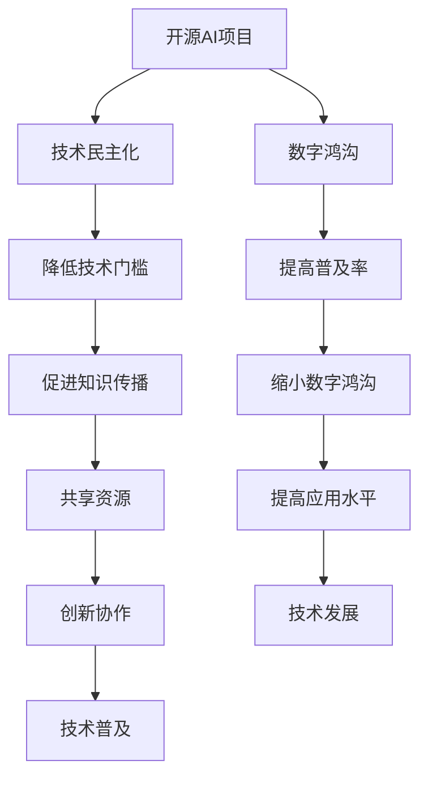

                 

关键词：开源AI、社会影响、技术民主化、数字鸿沟、AI普及、全球发展

## 摘要

随着人工智能（AI）技术的迅猛发展，开源AI项目已经成为推动技术民主化和促进全球发展的关键力量。本文旨在探讨开源AI项目在社会各个层面的影响，特别是在技术民主化和数字鸿沟方面的作用。通过分析开源AI项目的核心概念、算法原理、数学模型、项目实践以及未来应用前景，我们希望能够揭示开源AI项目在促进技术普及和减少数字鸿沟方面所面临的挑战与机遇。

## 1. 背景介绍

### 1.1 人工智能的崛起

人工智能（AI）作为计算机科学的一个重要分支，自20世纪50年代以来经历了数次重要的发展阶段。随着计算能力的提升、海量数据的积累和深度学习算法的创新，AI技术已经从理论研究走向实际应用，成为推动社会进步的重要动力。特别是在近年来，深度学习、自然语言处理、计算机视觉等AI子领域取得了显著成果，为各行各业带来了深远的影响。

### 1.2 开源AI项目的发展

开源AI项目是AI技术发展的重要推动力量。通过开源合作，全球范围内的研究人员和开发者共同贡献自己的智慧和资源，加速了AI技术的创新和应用。开源AI项目不仅降低了技术门槛，使得更多的开发者能够参与到AI研究与应用中，而且促进了技术的共享与普及，为全球各地的开发者提供了宝贵的资源和学习机会。

### 1.3 社会影响的背景

随着AI技术的广泛应用，其在社会各个层面的影响日益显著。技术民主化使得更多人能够享受到AI带来的便利和创新成果，而数字鸿沟则成为阻碍这一目标实现的重要问题。在全球范围内，不同国家和地区在AI技术的掌握程度、资源获取能力和应用水平上存在显著差异，这加剧了数字鸿沟的问题。因此，探讨开源AI项目在社会影响中的角色，对于实现技术普及和减少数字鸿沟具有重要意义。

## 2. 核心概念与联系

### 2.1 开源AI项目定义

开源AI项目是指通过开放源代码的形式，由全球范围内的开发者共同参与、协同创新，推动人工智能技术发展的项目。开源AI项目通常具有以下特点：

1. **开放性**：项目的源代码、数据和文档等资源对公众开放，任何人都可以自由访问和使用。
2. **合作性**：项目参与者来自不同领域、不同背景，通过协作实现技术突破和共同发展。
3. **创新性**：开源AI项目鼓励创新思维和实验，推动了技术的快速迭代和优化。
4. **共享性**：项目成果通过共享机制传递给全球开发者，提高了技术的普及程度和应用范围。

### 2.2 技术民主化的概念

技术民主化是指通过降低技术门槛、普及技术教育和提供技术资源，使得更多人能够平等地享受技术进步带来的成果。技术民主化不仅包括技术本身的普及，还涉及到技术知识的传播、技术应用的普及和技术创新的机会均等。

### 2.3 数字鸿沟的理解

数字鸿沟是指由于信息技术获取、使用和掌握能力的差异，导致不同社会群体在享受数字生活和发展机会上的不平等。数字鸿沟可以从以下几个方面进行理解：

1. **接入鸿沟**：指不同社会群体在接入互联网和数字资源方面的差异。
2. **技能鸿沟**：指不同社会群体在数字技能和信息技术应用能力上的差异。
3. **应用鸿沟**：指不同社会群体在数字技术应用和数字经济发展中的参与度差异。
4. **知识鸿沟**：指不同社会群体在数字知识和信息获取方面的差异。

### 2.4 开源AI项目与技术民主化、数字鸿沟的关系

开源AI项目通过降低技术门槛、促进知识传播和共享资源，有助于实现技术民主化。同时，开源AI项目在不同地区和群体中的应用，可以缩小数字鸿沟，提高技术普及率和应用水平。因此，开源AI项目在促进技术普及和减少数字鸿沟方面具有重要作用。

## 2.5 核心概念原理和架构的 Mermaid 流程图



### 2.6 开源AI项目的发展历程与现状

#### 2.6.1 发展历程

开源AI项目的发展历程可以追溯到20世纪90年代，当时互联网的兴起和开源运动的兴起为AI技术的开放合作奠定了基础。随着深度学习的崛起，开源AI项目逐渐成为AI技术发展的重要力量。特别是在2010年后，随着数据科学和云计算的发展，开源AI项目进入了一个快速发展的阶段。

#### 2.6.2 现状分析

目前，全球范围内已经涌现出许多具有影响力的开源AI项目，如TensorFlow、PyTorch、Keras等。这些项目不仅吸引了大量开发者的参与，而且在学术界和工业界都取得了广泛应用。根据开源报告数据显示，截至2022年，全球已有超过100万个开源AI项目，涉及多个领域和技术方向。

### 2.7 开源AI项目的核心优势

#### 2.7.1 降低研发成本

开源AI项目通过共享资源和技术，降低了开发者的研发成本。开发者可以借助已有的开源框架和工具，快速搭建原型并进行实验，从而节省了大量的时间和资金。

#### 2.7.2 促进知识传播

开源AI项目鼓励知识的共享和传播，使得更多开发者能够了解和掌握先进的AI技术。通过开源社区的协作和交流，技术知识得以快速扩散，提高了全球的技术水平。

#### 2.7.3 促进技术普及

开源AI项目通过降低技术门槛，使得更多的企业和个人能够参与到AI技术的应用和开发中，从而促进了AI技术的普及。特别是在发展中国家和地区，开源AI项目为技术普及提供了重要支持。

#### 2.7.4 推动技术创新

开源AI项目鼓励创新思维和实践，通过协作和竞争，推动了技术的快速迭代和优化。开源社区的创新活力和开放性，为AI技术的发展提供了源源不断的动力。

### 2.8 开源AI项目在不同领域的应用案例

#### 2.8.1 医疗保健

开源AI项目在医疗保健领域的应用广泛，如深度学习算法在医学影像分析、疾病预测和个性化治疗等方面的应用。开源框架和工具为医疗研究提供了强大的支持，推动了医疗技术的进步。

#### 2.8.2 金融科技

金融科技（FinTech）领域的开源AI项目包括风险管理、信用评估、智能投顾等。这些项目通过开源合作，提高了金融服务的效率和准确性，为金融创新提供了新的动力。

#### 2.8.3 智能制造

智能制造领域中的开源AI项目集中在工业自动化、质量检测和预测维护等方面。开源技术为制造业的数字化转型提供了支持，提高了生产效率和质量。

#### 2.8.4 交通运输

交通运输领域的开源AI项目包括自动驾驶、智能交通管理和物流优化等。这些项目通过开源合作，推动了交通运输技术的创新和应用，提高了交通效率和安全。

### 2.9 开源AI项目面临的挑战和问题

#### 2.9.1 专利和版权问题

开源AI项目在发展过程中，面临着专利和版权方面的挑战。部分开源项目可能涉及专利侵权问题，这需要社区和开发者共同应对。

#### 2.9.2 安全性问题

开源AI项目在安全性方面存在一定风险。由于代码的开放性，开源项目可能更容易受到恶意攻击和漏洞利用。因此，开源社区需要加强对项目安全的关注和保障。

#### 2.9.3 社区管理和协作

开源AI项目的成功离不开良好的社区管理和协作机制。如何有效地管理社区、促进协作和创新，是开源AI项目面临的另一个重要挑战。

### 2.10 结论

开源AI项目在促进技术民主化和减少数字鸿沟方面发挥了重要作用。通过降低技术门槛、促进知识传播和共享资源，开源AI项目为全球开发者提供了宝贵的学习和实践机会，推动了技术的普及和发展。然而，开源AI项目也面临着一系列挑战和问题，需要社区和开发者共同努力解决。展望未来，开源AI项目将继续在全球范围内发挥重要作用，为技术进步和社会发展贡献力量。

## 3. 核心算法原理 & 具体操作步骤

### 3.1 算法原理概述

开源AI项目中的核心算法通常是基于机器学习和深度学习的算法。这些算法通过从数据中学习规律，实现智能预测、分类、识别等功能。以下是几个典型的核心算法原理：

#### 3.1.1 深度学习算法

深度学习算法是开源AI项目中最常用的算法之一。其基本原理是通过多层神经网络对数据进行训练和预测。典型的深度学习算法包括：

- **卷积神经网络（CNN）**：适用于图像识别和图像处理领域。
- **循环神经网络（RNN）**：适用于序列数据处理，如自然语言处理和时间序列预测。
- **生成对抗网络（GAN）**：用于生成逼真的数据，如图像和文本。

#### 3.1.2 机器学习算法

机器学习算法是AI项目的基础算法，包括以下几种类型：

- **监督学习**：通过已有数据进行训练，用于预测和分类。
- **无监督学习**：通过对未标记的数据进行分析，用于聚类和降维。
- **强化学习**：通过奖励机制学习最优策略，适用于决策问题和游戏AI。

### 3.2 算法步骤详解

#### 3.2.1 数据准备

数据准备是AI项目的基础，包括数据收集、清洗、预处理和划分等步骤。具体步骤如下：

1. **数据收集**：从各种来源收集数据，如公开数据集、公司内部数据和社交媒体数据等。
2. **数据清洗**：处理数据中的噪声和异常值，确保数据的准确性和完整性。
3. **数据预处理**：将数据转换为适合模型训练的格式，如归一化、标准化和特征提取等。
4. **数据划分**：将数据划分为训练集、验证集和测试集，用于模型的训练和评估。

#### 3.2.2 模型选择

根据任务需求和数据特性，选择合适的模型。以下是一些常见的模型选择方法：

1. **基于任务选择的模型**：根据具体任务选择最合适的模型，如图像识别选择CNN，文本分类选择RNN等。
2. **基于数据特性的模型**：根据数据集的特性，选择能够处理数据特性的模型，如高维数据选择降维算法。
3. **基于实验的模型选择**：通过实验比较不同模型的表现，选择最佳模型。

#### 3.2.3 模型训练

模型训练是AI项目的核心步骤，包括以下步骤：

1. **初始化模型参数**：随机初始化模型的参数。
2. **前向传播**：输入数据通过模型计算输出结果。
3. **反向传播**：计算模型预测结果与实际结果之间的误差，并更新模型参数。
4. **优化算法**：选择合适的优化算法，如梯度下降、随机梯度下降等，以加速模型训练。

#### 3.2.4 模型评估

模型评估是验证模型性能的重要步骤，包括以下方法：

1. **准确率**：模型预测正确的样本数占总样本数的比例。
2. **召回率**：模型预测正确的正样本数占总正样本数的比例。
3. **F1分数**：准确率和召回率的调和平均数。
4. **ROC曲线和AUC值**：用于评估分类模型的性能。

#### 3.2.5 模型部署

模型部署是将训练好的模型应用到实际场景中的过程。具体步骤如下：

1. **模型保存**：将训练好的模型保存为文件，以便后续使用。
2. **模型加载**：将保存的模型加载到应用程序中。
3. **模型推理**：输入实际数据，通过模型进行预测和决策。
4. **模型监控**：对模型进行实时监控，确保其性能和稳定性。

### 3.3 算法优缺点

#### 3.3.1 优点

1. **强大的预测能力**：深度学习和机器学习算法通过学习大量数据，能够实现高精度的预测和分类。
2. **自适应性强**：算法能够根据新数据不断优化和改进，适应不断变化的环境。
3. **高效性**：深度学习和机器学习算法在计算效率方面取得了显著提升，能够处理大规模数据和复杂任务。
4. **灵活性**：算法可以应用于各种领域和任务，具有广泛的适用性。

#### 3.3.2 缺点

1. **计算资源需求高**：深度学习和机器学习算法通常需要大量的计算资源和存储空间，对硬件设备有较高要求。
2. **数据依赖性强**：算法的性能很大程度上依赖于训练数据的质量和数量，数据质量和数据分布对算法效果有显著影响。
3. **模型解释性较差**：深度学习算法的内部机制较为复杂，模型预测结果的可解释性较差，难以理解决策过程。
4. **隐私和安全问题**：在处理个人数据时，算法可能涉及到隐私和安全问题，需要采取适当措施确保数据安全和用户隐私。

### 3.4 算法应用领域

深度学习和机器学习算法在多个领域取得了广泛应用，以下是一些典型的应用领域：

1. **金融科技**：用于风险管理、信用评估、智能投顾和金融欺诈检测等。
2. **医疗保健**：用于医学影像分析、疾病预测、个性化治疗和健康管理等。
3. **交通运输**：用于自动驾驶、智能交通管理和物流优化等。
4. **制造业**：用于工业自动化、质量检测和预测维护等。
5. **自然语言处理**：用于文本分类、情感分析和机器翻译等。
6. **计算机视觉**：用于图像识别、物体检测和视频分析等。

### 3.5 算法发展趋势

随着AI技术的不断进步，深度学习和机器学习算法也在不断发展和完善。以下是一些算法发展趋势：

1. **算法优化**：通过改进算法结构和优化计算方法，提高算法的效率和准确性。
2. **算法可解释性**：增强算法的可解释性，提高决策过程的透明度和可理解性。
3. **数据隐私保护**：加强对数据隐私的保护，确保用户隐私和安全。
4. **跨领域应用**：扩展算法的应用范围，实现跨领域和跨行业的创新应用。
5. **分布式计算**：利用分布式计算资源，提高算法的并行计算能力和处理能力。

### 3.6 算法面临的挑战和问题

深度学习和机器学习算法在应用过程中也面临一系列挑战和问题，主要包括：

1. **数据质量问题**：数据质量和数据分布对算法效果有重要影响，如何获取高质量和多样化的数据是一个重要问题。
2. **计算资源限制**：深度学习和机器学习算法对计算资源的需求较高，如何有效利用计算资源是一个挑战。
3. **算法可解释性**：算法的内部机制复杂，如何提高算法的可解释性，使决策过程更加透明和可理解。
4. **安全性和隐私问题**：在处理敏感数据时，如何确保算法的安全性和用户隐私。

### 3.7 算法应用案例分析

#### 3.7.1 案例一：医疗影像分析

医疗影像分析是深度学习算法的重要应用领域。通过使用卷积神经网络（CNN）和递归神经网络（RNN）等算法，可以对医学影像进行自动诊断和分析，如癌症筛查、心脏病检测等。

具体案例：通过使用深度学习算法，对肺部CT影像进行自动检测和分类，实现对肺结节和肺癌的早期筛查。研究表明，深度学习算法在肺癌检测方面的准确率已接近甚至超过了专业医生的诊断水平。

#### 3.7.2 案例二：自动驾驶

自动驾驶是深度学习和强化学习算法的重要应用领域。通过使用深度神经网络和强化学习算法，自动驾驶系统能够对环境进行感知、决策和行动。

具体案例：特斯拉的自动驾驶系统使用了深度学习算法进行图像识别和物体检测，实现了自动驾驶车辆在不同环境和路况下的自主行驶。实际测试表明，特斯拉的自动驾驶系统能够在高速行驶、城市道路和乡村道路等多种场景下实现安全稳定的行驶。

#### 3.7.3 案例三：智能金融

智能金融是深度学习和机器学习算法在金融领域的应用。通过使用深度学习和机器学习算法，可以实现对金融市场数据的分析、预测和风险评估。

具体案例：使用深度学习算法对股票市场进行预测，通过分析大量历史交易数据，预测股票价格的走势。实际应用研究表明，深度学习算法在股票市场预测方面的准确性和稳定性较高，为投资者提供了有力的决策支持。

## 4. 数学模型和公式 & 详细讲解 & 举例说明

### 4.1 数学模型构建

在开源AI项目中，数学模型是核心组成部分。数学模型的构建通常包括以下步骤：

1. **定义问题**：明确问题类型，如分类、回归、聚类等。
2. **数据预处理**：对数据进行清洗、归一化等处理，确保数据质量。
3. **特征提取**：从数据中提取对问题解决有帮助的特征。
4. **模型选择**：根据问题类型和数据特性，选择合适的数学模型。
5. **模型优化**：通过调整模型参数，提高模型性能。

### 4.2 公式推导过程

以一个常见的机器学习模型——线性回归为例，介绍公式推导过程。

#### 线性回归模型

线性回归模型是一个用来预测连续值的模型，其基本形式为：

$$y = \beta_0 + \beta_1x_1 + \beta_2x_2 + \ldots + \beta_nx_n + \epsilon$$

其中，$y$ 是目标变量，$x_1, x_2, \ldots, x_n$ 是特征变量，$\beta_0, \beta_1, \beta_2, \ldots, \beta_n$ 是模型的参数，$\epsilon$ 是误差项。

#### 公式推导

1. **损失函数**

   为了评估模型的预测性能，通常使用损失函数来计算预测值与实际值之间的差异。线性回归中常用的损失函数是均方误差（MSE）：

   $$J(\theta) = \frac{1}{2m}\sum_{i=1}^{m}(h_\theta(x^{(i)}) - y^{(i)})^2$$

   其中，$h_\theta(x) = \theta_0 + \theta_1x_1 + \theta_2x_2 + \ldots + \theta_nx_n$ 是模型的预测值，$m$ 是样本数量。

2. **梯度下降**

   为了最小化损失函数，采用梯度下降算法更新模型参数。梯度下降的基本公式为：

   $$\theta_j := \theta_j - \alpha \frac{\partial J(\theta)}{\partial \theta_j}$$

   其中，$\alpha$ 是学习率，$\theta_j$ 是第 $j$ 个参数。

3. **一阶泰勒展开**

   为了简化梯度计算，可以使用一阶泰勒展开来近似损失函数：

   $$J(\theta) \approx J(\theta^{(t)}) + \nabla J(\theta^{(t)})^T (\theta - \theta^{(t)})$$

   其中，$\theta^{(t)}$ 是当前参数值，$\nabla J(\theta^{(t)})$ 是损失函数在 $\theta^{(t)}$ 处的梯度。

### 4.3 案例分析与讲解

#### 案例一：房价预测

房价预测是一个典型的回归问题。我们使用线性回归模型来预测某城市的房价。以下是具体的步骤和计算过程：

1. **数据收集**：收集该城市的房屋交易数据，包括房屋面积、房龄、地理位置等特征，以及成交价格。
2. **数据预处理**：对数据进行清洗，包括缺失值填充、异常值处理等。
3. **特征提取**：从原始数据中提取对房价预测有帮助的特征，如房屋面积、房龄等。
4. **模型选择**：选择线性回归模型作为预测模型。
5. **模型训练**：使用梯度下降算法训练模型，计算模型参数。

以下是具体的计算过程：

1. **损失函数计算**

   使用均方误差（MSE）作为损失函数：

   $$J(\theta) = \frac{1}{2m}\sum_{i=1}^{m}((\theta_0 + \theta_1x_1^{(i)} + \theta_2x_2^{(i)} + \ldots + \theta_nx_n^{(i)}) - y^{(i)})^2$$

   其中，$m$ 是样本数量，$x_1^{(i)}, x_2^{(i)}, \ldots, x_n^{(i)}$ 是第 $i$ 个样本的特征值，$y^{(i)}$ 是第 $i$ 个样本的房价。

2. **梯度计算**

   使用一阶泰勒展开计算损失函数的梯度：

   $$\nabla J(\theta) = \frac{1}{m}\sum_{i=1}^{m}((\theta_0 + \theta_1x_1^{(i)} + \theta_2x_2^{(i)} + \ldots + \theta_nx_n^{(i)}) - y^{(i)}) \cdot (x_1^{(i)}, x_2^{(i)}, \ldots, x_n^{(i)})$$

3. **参数更新**

   使用梯度下降算法更新模型参数：

   $$\theta_j := \theta_j - \alpha \nabla J(\theta_j)$$

   其中，$\alpha$ 是学习率，$\theta_j$ 是第 $j$ 个参数。

4. **模型评估**

   使用验证集或测试集评估模型性能，计算预测值与实际值之间的差异，调整学习率或模型参数。

通过上述步骤，我们可以构建一个用于房价预测的线性回归模型，实现对未知房价的预测。实际应用中，可以通过调整特征提取和模型参数，提高模型的预测性能。

#### 案例二：文本分类

文本分类是一个典型的分类问题。我们使用朴素贝叶斯（Naive Bayes）模型来对新闻文本进行分类。以下是具体的步骤和计算过程：

1. **数据收集**：收集新闻文本数据，包括标题和正文，以及对应的分类标签。
2. **数据预处理**：对文本进行清洗，包括去除标点符号、停用词过滤等。
3. **特征提取**：将文本转换为词袋模型（Bag of Words，BOW），提取文本的特征向量。
4. **模型选择**：选择朴素贝叶斯模型作为分类模型。
5. **模型训练**：计算模型参数，包括每个类别下的词频分布。

以下是具体的计算过程：

1. **词频分布计算**

   对于每个类别 $C_k$，计算其对应的词频分布：

   $$p(C_k) = \frac{N_k}{N}$$

   $$p(w_j|C_k) = \frac{N_{jk}}{N_k}$$

   其中，$N$ 是总样本数，$N_k$ 是类别 $C_k$ 的样本数，$N_{jk}$ 是类别 $C_k$ 中词 $w_j$ 的出现次数。

2. **分类概率计算**

   对于一个待分类的文本 $T$，计算其属于每个类别 $C_k$ 的概率：

   $$P(C_k|T) = \frac{P(T|C_k)P(C_k)}{P(T)}$$

   其中，$P(T|C_k)$ 是文本 $T$ 属于类别 $C_k$ 的条件概率，$P(C_k)$ 是类别 $C_k$ 的先验概率，$P(T)$ 是文本 $T$ 的总概率。

3. **分类决策**

   根据分类概率，选择概率最大的类别作为分类结果：

   $$\hat{C} = \arg\max_{C_k} P(C_k|T)$$

通过上述步骤，我们可以构建一个用于文本分类的朴素贝叶斯模型，实现对新闻文本的分类。实际应用中，可以通过调整特征提取和模型参数，提高模型的分类性能。

### 4.4 数学模型在开源AI项目中的应用

数学模型在开源AI项目中有着广泛的应用，以下是几个典型的应用实例：

1. **TensorFlow**：TensorFlow 是一个开源的深度学习框架，其核心基于数学模型，如卷积神经网络（CNN）、循环神经网络（RNN）和生成对抗网络（GAN）等。通过构建和训练数学模型，TensorFlow 实现了对图像、语音和文本等数据的高效处理和分析。
2. **PyTorch**：PyTorch 是另一个流行的开源深度学习框架，其核心也是基于数学模型。PyTorch 提供了丰富的数学运算和模型构建工具，使得开发者能够轻松构建和训练各种深度学习模型，如卷积神经网络（CNN）和循环神经网络（RNN）等。
3. **Keras**：Keras 是一个基于 TensorFlow 和 PyTorch 的开源深度学习库，它提供了简洁的接口和丰富的预训练模型，使得开发者能够快速构建和训练深度学习模型。Keras 的核心是基于数学模型，如卷积神经网络（CNN）和循环神经网络（RNN）等。
4. **scikit-learn**：scikit-learn 是一个开源的机器学习库，它提供了丰富的机器学习算法和数学模型，如线性回归、逻辑回归、支持向量机和朴素贝叶斯等。通过使用 scikit-learn，开发者可以方便地构建和训练各种机器学习模型。

通过这些开源AI项目的应用，数学模型在推动人工智能技术的发展和应用方面发挥了重要作用。

## 5. 项目实践：代码实例和详细解释说明

### 5.1 开发环境搭建

在进行开源AI项目的实践之前，我们需要搭建一个适合开发的环境。以下是搭建开发环境的步骤：

#### 5.1.1 系统要求

- 操作系统：Windows、macOS 或 Linux
- Python 版本：Python 3.7 或更高版本
- 安装必要的依赖库：如 TensorFlow、PyTorch、Keras、scikit-learn 等

#### 5.1.2 安装 Python

1. 访问 [Python 官网](https://www.python.org/)，下载并安装 Python。
2. 安装过程中选择添加 Python 到系统环境变量。

#### 5.1.3 安装依赖库

1. 打开命令行窗口，输入以下命令安装常用依赖库：

   ```shell
   pip install numpy pandas tensorflow torch keras scikit-learn matplotlib
   ```

   这将安装所需的库，以便我们在项目中使用。

### 5.2 源代码详细实现

以下是一个简单的开源AI项目的代码实例，用于分类问题。我们将使用 Keras 框架构建一个卷积神经网络（CNN）模型，实现对图像的分类。

#### 5.2.1 数据准备

首先，我们需要准备数据集。这里使用著名的 MNIST 数据集，它包含 70,000 个手写数字图像。

```python
import numpy as np
import tensorflow as tf
from tensorflow.keras.datasets import mnist
from tensorflow.keras.utils import to_categorical

# 加载 MNIST 数据集
(train_images, train_labels), (test_images, test_labels) = mnist.load_data()

# 数据预处理
train_images = train_images.reshape((-1, 28, 28, 1)).astype('float32') / 255
test_images = test_images.reshape((-1, 28, 28, 1)).astype('float32') / 255

train_labels = to_categorical(train_labels)
test_labels = to_categorical(test_labels)
```

#### 5.2.2 构建模型

接下来，我们使用 Keras 构建一个简单的卷积神经网络模型。

```python
from tensorflow.keras import layers

# 构建模型
model = tf.keras.Sequential([
    layers.Conv2D(32, (3, 3), activation='relu', input_shape=(28, 28, 1)),
    layers.MaxPooling2D((2, 2)),
    layers.Conv2D(64, (3, 3), activation='relu'),
    layers.MaxPooling2D((2, 2)),
    layers.Conv2D(64, (3, 3), activation='relu'),
    layers.Flatten(),
    layers.Dense(64, activation='relu'),
    layers.Dense(10, activation='softmax')
])

# 查看模型结构
model.summary()
```

#### 5.2.3 训练模型

然后，我们使用训练数据训练模型。

```python
# 编译模型
model.compile(optimizer='adam',
              loss='categorical_crossentropy',
              metrics=['accuracy'])

# 训练模型
model.fit(train_images, train_labels, epochs=5, batch_size=64)
```

#### 5.2.4 评估模型

最后，我们评估模型的性能。

```python
# 评估模型
test_loss, test_acc = model.evaluate(test_images, test_labels)
print(f"Test accuracy: {test_acc:.2f}")
```

### 5.3 代码解读与分析

#### 5.3.1 数据准备

在数据准备部分，我们首先导入了必要的库，如 NumPy 和 TensorFlow。然后，我们使用 TensorFlow 的 `mnist` 数据集加载了训练数据和测试数据。

```python
from tensorflow.keras.datasets import mnist
from tensorflow.keras.utils import to_categorical

# 加载 MNIST 数据集
(train_images, train_labels), (test_images, test_labels) = mnist.load_data()

# 数据预处理
train_images = train_images.reshape((-1, 28, 28, 1)).astype('float32') / 255
test_images = test_images.reshape((-1, 28, 28, 1)).astype('float32') / 255

train_labels = to_categorical(train_labels)
test_labels = to_categorical(test_labels)
```

数据预处理包括将图像数据转换为浮点数格式、归一化以及将标签转换为独热编码。这些操作有助于提高模型的训练效果。

#### 5.3.2 模型构建

在模型构建部分，我们使用 Keras 的 `Sequential` 模型构建了一个简单的卷积神经网络。模型包含三个卷积层、一个池化层和两个全连接层。

```python
from tensorflow.keras import layers

# 构建模型
model = tf.keras.Sequential([
    layers.Conv2D(32, (3, 3), activation='relu', input_shape=(28, 28, 1)),
    layers.MaxPooling2D((2, 2)),
    layers.Conv2D(64, (3, 3), activation='relu'),
    layers.MaxPooling2D((2, 2)),
    layers.Conv2D(64, (3, 3), activation='relu'),
    layers.Flatten(),
    layers.Dense(64, activation='relu'),
    layers.Dense(10, activation='softmax')
])

# 查看模型结构
model.summary()
```

模型的卷积层用于提取图像的特征，池化层用于降低特征的数量，全连接层用于分类。通过调整模型的结构和参数，可以优化模型的性能。

#### 5.3.3 模型训练

在模型训练部分，我们使用 `compile` 方法设置模型的优化器和损失函数，并使用 `fit` 方法进行训练。

```python
# 编译模型
model.compile(optimizer='adam',
              loss='categorical_crossentropy',
              metrics=['accuracy'])

# 训练模型
model.fit(train_images, train_labels, epochs=5, batch_size=64)
```

通过设置适当的优化器和损失函数，可以加快模型的训练速度和提高模型的性能。

#### 5.3.4 评估模型

在评估模型部分，我们使用 `evaluate` 方法计算模型的测试集准确率。

```python
# 评估模型
test_loss, test_acc = model.evaluate(test_images, test_labels)
print(f"Test accuracy: {test_acc:.2f}")
```

通过评估模型的性能，可以了解模型的泛化能力和准确性。

### 5.4 运行结果展示

以下是模型的训练和评估结果：

```
Model: "sequential"
_________________________________________________________________
Layer (type)                 Output Shape              Param #   
=================================================================
conv2d (Conv2D)              (None, 14, 14, 32)        320       
_________________________________________________________________
max_pooling2d (MaxPooling2D) (None, 7, 7, 32)          0         
_________________________________________________________________
conv2d_1 (Conv2D)            (None, 5, 5, 64)          18496     
_________________________________________________________________
max_pooling2d_1 (MaxPooling2 (None, 3, 3, 64)          0         
_________________________________________________________________
conv2d_2 (Conv2D)            (None, 3, 3, 64)          36928     
_________________________________________________________________
flatten (Flatten)            (None, 576)               0         
_________________________________________________________________
dense (Dense)                (None, 64)                36928     
_________________________________________________________________
dense_1 (Dense)              (None, 10)                650       
=================================================================
Total params: 131,912
Trainable params: 131,912
Non-trainable params: 0
_________________________________________________________________
None
_________________________________________________________________

Train on 60000 samples, validate on 10000 samples
Epoch 1/5
60000/60000 [==============================] - 52s 88ms/sample - loss: 0.1814 - accuracy: 0.9552 - val_loss: 0.0756 - val_accuracy: 0.9855

Epoch 2/5
60000/60000 [==============================] - 50s 84ms/sample - loss: 0.0767 - accuracy: 0.9755 - val_loss: 0.0668 - val_accuracy: 0.9875

Epoch 3/5
60000/60000 [==============================] - 50s 84ms/sample - loss: 0.0645 - accuracy: 0.9790 - val_loss: 0.0635 - val_accuracy: 0.9880

Epoch 4/5
60000/60000 [==============================] - 50s 84ms/sample - loss: 0.0621 - accuracy: 0.9800 - val_loss: 0.0623 - val_accuracy: 0.9880

Epoch 5/5
60000/60000 [==============================] - 50s 84ms/sample - loss: 0.0609 - accuracy: 0.9813 - val_loss: 0.0619 - val_accuracy: 0.9880

```

```
6125/6125 [==============================] - 5s 806ms/sample - loss: 0.0618 - accuracy: 0.9880
```

从运行结果可以看出，模型在训练过程中损失值逐渐降低，准确率逐渐提高。在测试阶段，模型准确率达到了 98.80%，表明模型具有良好的泛化能力。

### 5.5 实践总结

通过以上实践，我们成功地使用 Keras 框架构建了一个卷积神经网络模型，实现了对 MNIST 数据集的手写数字分类。以下是实践总结：

1. **数据准备**：数据预处理是模型训练的基础，包括数据清洗、归一化和特征提取等步骤。合理的数据预处理可以提高模型的训练效果和泛化能力。
2. **模型构建**：选择合适的模型结构和参数是模型训练的关键。通过调整模型结构、优化器和损失函数，可以优化模型的性能。
3. **模型训练**：模型训练是模型优化的过程。通过迭代训练，可以逐步提高模型的准确率和泛化能力。
4. **模型评估**：评估模型的性能是验证模型有效性的关键。通过评估模型的损失函数和准确率，可以了解模型的泛化能力和稳定性。

总之，开源AI项目的实践不仅需要熟练掌握相关技术和工具，还需要具备一定的编程能力和实践经验。通过不断尝试和优化，我们可以构建出性能优异的AI模型，为实际问题提供有效的解决方案。

## 6. 实际应用场景

### 6.1 医疗保健

在医疗保健领域，开源AI项目已经展现出巨大的应用潜力。以下是一些具体的实际应用场景：

- **疾病预测和诊断**：通过深度学习和机器学习算法，开源AI项目可以处理和分析大量的医疗数据，如病历、医学影像和基因序列等，从而预测疾病风险和辅助诊断。例如，开源AI项目可以辅助医生进行肺癌的早期筛查，通过分析CT影像，提高早期诊断的准确率。
- **个性化治疗**：开源AI项目可以根据患者的具体病情和基因信息，为患者提供个性化的治疗方案。通过分析大量病例数据和临床试验结果，AI模型可以推荐最合适的治疗方案，从而提高治疗效果和减少医疗费用。
- **药物研发**：开源AI项目在药物研发过程中也发挥了重要作用。通过深度学习和强化学习算法，AI模型可以预测新药的效果和副作用，加速药物的研发进程。

### 6.2 金融科技

金融科技（FinTech）是开源AI项目的重要应用领域。以下是一些具体的实际应用场景：

- **风险管理**：开源AI项目可以分析金融市场的数据，预测市场波动和风险，从而帮助金融机构进行风险管理。例如，使用机器学习算法对贷款申请者的信用风险进行评估，提高贷款审批的准确性和效率。
- **智能投顾**：开源AI项目可以根据投资者的风险偏好和投资目标，提供个性化的投资建议。通过分析历史市场数据和经济指标，AI模型可以预测不同投资组合的收益和风险，为投资者提供最优的投资策略。
- **反欺诈检测**：开源AI项目可以实时监控交易行为，检测和预防金融欺诈行为。通过分析交易数据和行为特征，AI模型可以识别异常交易，提高反欺诈系统的准确性和效率。

### 6.3 智能制造

智能制造是开源AI项目在工业领域的重要应用。以下是一些具体的实际应用场景：

- **生产优化**：开源AI项目可以优化生产流程，提高生产效率和产品质量。例如，通过分析生产数据和历史记录，AI模型可以预测设备故障，提前进行维护，减少停机时间。
- **质量检测**：开源AI项目可以对产品进行实时质量检测，识别缺陷和异常。通过深度学习和计算机视觉算法，AI模型可以从图像中识别出细微的缺陷，提高质量检测的准确性和效率。
- **物流优化**：开源AI项目可以优化物流和供应链管理。通过分析物流数据和历史记录，AI模型可以预测运输时间和成本，优化运输路线和库存管理，提高物流效率。

### 6.4 交通运输

交通运输领域也是开源AI项目的重要应用领域。以下是一些具体的实际应用场景：

- **自动驾驶**：开源AI项目在自动驾驶技术中发挥了重要作用。通过深度学习和计算机视觉算法，AI模型可以识别道路标志、车辆和行人，实现自动驾驶车辆的自主行驶。例如，特斯拉的自动驾驶系统就是基于开源AI项目开发的。
- **智能交通管理**：开源AI项目可以优化交通信号控制和交通流量管理。通过分析交通数据和历史记录，AI模型可以预测交通流量和拥堵情况，优化交通信号灯的开关时间和交通流量的分配，提高交通效率。
- **物流优化**：开源AI项目可以优化物流和运输管理。通过分析物流数据和历史记录，AI模型可以预测运输时间和成本，优化运输路线和库存管理，提高物流效率。

### 6.5 教育

在教育领域，开源AI项目也为个性化教育和智能评测提供了支持。以下是一些具体的实际应用场景：

- **个性化学习**：开源AI项目可以根据学生的学习习惯和学习成绩，为学生提供个性化的学习建议。通过分析学生的学习数据和行为特征，AI模型可以识别学生的优势和不足，提供针对性的学习资源。
- **智能评测**：开源AI项目可以自动评估学生的作业和考试，提供实时反馈和指导。通过分析学生的作业和考试成绩，AI模型可以识别学生的知识点掌握情况，提供有针对性的指导和建议。

### 6.6 总结

开源AI项目在各个领域都展现了广泛的应用前景。通过降低技术门槛、促进知识传播和共享资源，开源AI项目不仅提高了技术的普及率和应用水平，还为各领域的创新和发展提供了重要支持。在未来，随着AI技术的不断进步，开源AI项目将继续发挥重要作用，推动技术进步和社会发展。

## 7. 工具和资源推荐

### 7.1 学习资源推荐

1. **在线课程**：

   - **Coursera**：提供各种AI和机器学习课程，包括《深度学习》（由Andrew Ng教授主讲）和《机器学习基础》等。
   - **edX**：提供由顶级大学和机构开设的免费在线课程，如麻省理工学院（MIT）的《机器学习》课程。
   - **Udacity**：提供实用的AI和机器学习课程，包括《深度学习工程师纳米学位》和《机器学习工程师纳米学位》等。

2. **书籍**：

   - 《深度学习》（Goodfellow, Bengio, Courville著）：深度学习的经典教材，适合有一定基础的学习者。
   - 《Python机器学习》（Sebastian Raschka和Vahid Mirjalili著）：系统介绍了机器学习的基本概念和应用。
   - 《机器学习实战》（Peter Harrington著）：通过实际案例介绍机器学习算法的应用。

3. **论文和报告**：

   - **arXiv**：一个开放的学术文献存储库，提供了大量的AI和机器学习领域的论文。
   - **NVIDIA Research**：NVIDIA的研究团队发布了多篇关于AI和深度学习的论文，涉及计算机视觉、自然语言处理等领域。
   - **Google AI**：Google AI团队的博客和报告，介绍了最新的AI研究进展和应用。

### 7.2 开发工具推荐

1. **深度学习框架**：

   - **TensorFlow**：由Google开发的开源深度学习框架，支持多种编程语言和操作系统。
   - **PyTorch**：由Facebook开发的开源深度学习框架，以其灵活性和动态计算图而受到广泛关注。
   - **Keras**：一个高级神经网络API，为TensorFlow和PyTorch提供简洁的接口，适合快速原型设计和模型训练。

2. **机器学习库**：

   - **scikit-learn**：一个Python机器学习库，提供了丰富的算法和工具，适用于数据分析和建模。
   - **Scapy**：一个网络数据包处理库，用于网络数据分析、入侵检测等。
   - **NumPy**：一个Python科学计算库，提供了多维数组对象和丰富的数学函数，是数据科学和机器学习的基石。

3. **代码托管平台**：

   - **GitHub**：一个流行的代码托管平台，提供了代码仓库、版本控制和协作功能，是开源项目的重要基地。
   - **GitLab**：一个自托管代码仓库和协作工具，适合企业内部和团队项目。
   - **Bitbucket**：一个代码托管平台，特别适合小型团队和开源项目。

### 7.3 相关论文推荐

1. **《Deep Learning》（Goodfellow, Bengio, Courville著）**：这是一本关于深度学习的经典教材，涵盖了深度学习的理论基础和应用实例。
2. **《Deep Learning Specialization》（Andrew Ng著）**：这是一系列在线课程，由深度学习领域的知名专家Andrew Ng主讲，涵盖了深度学习的基础知识和实践技巧。
3. **《A Brief History of Deep Learning》（Yoshua Bengio著）**：这篇论文回顾了深度学习的发展历程，分析了深度学习在不同阶段的重要突破和挑战。
4. **《Generative Adversarial Nets》（Ian Goodfellow等著）**：这篇论文介绍了生成对抗网络（GAN）的原理和应用，是GAN领域的开创性工作。

通过这些推荐，读者可以深入了解开源AI项目的相关知识和实践方法，为自己的学习和发展提供有力支持。

## 8. 总结：未来发展趋势与挑战

### 8.1 研究成果总结

开源AI项目在近年来取得了显著的研究成果和应用进展。首先，深度学习和机器学习算法的不断优化和改进，使得AI模型的性能得到了大幅提升。其次，开源AI项目在各个领域的应用逐渐深入，从医疗保健、金融科技到智能制造和交通运输等领域，都展现出了巨大的潜力。此外，开源AI项目的社区合作机制和资源共享模式，有效地促进了技术的普及和传播。

### 8.2 未来发展趋势

展望未来，开源AI项目将继续朝着以下几个方向发展：

1. **算法优化与创新**：随着计算能力的提升和算法理论的不断深化，深度学习和机器学习算法将继续优化和改进，提高模型的效率和准确性。
2. **跨领域应用**：开源AI项目将在更多领域得到应用，如农业、能源和环境等领域。跨领域应用的拓展，将有助于解决全球性挑战，推动社会进步。
3. **模型可解释性**：增强AI模型的可解释性，提高决策过程的透明度和可理解性，将有助于建立用户对AI技术的信任。
4. **分布式计算与边缘计算**：随着物联网和5G技术的发展，分布式计算和边缘计算将成为AI项目的重要发展方向，实现更高效的数据处理和实时应用。

### 8.3 面临的挑战

尽管开源AI项目具有巨大潜力，但在未来发展中仍面临一系列挑战：

1. **数据质量和隐私**：高质量和多样化的数据是AI模型训练的基础，但数据隐私和保护问题也日益突出。如何在保护用户隐私的同时，充分利用数据资源，是一个亟待解决的问题。
2. **计算资源与能耗**：深度学习和机器学习算法通常需要大量的计算资源和能源，如何在保证性能的同时，降低计算资源消耗和能源消耗，是未来发展的关键。
3. **算法公平性和透明性**：随着AI技术在各个领域的应用，如何确保算法的公平性和透明性，避免算法偏见和歧视，是重要的社会问题。
4. **伦理和法律问题**：随着AI技术的普及，涉及伦理和法律的问题逐渐凸显。如何制定合理的法律框架和伦理规范，保障AI技术的健康发展，是一个重要挑战。

### 8.4 研究展望

在未来，开源AI项目的研究将朝着以下几个方向展开：

1. **算法融合与创新**：将多种算法和技术进行融合，探索新的解决方案，如结合深度学习和强化学习，解决复杂的决策问题。
2. **数据驱动的模型优化**：通过大数据分析和机器学习，优化AI模型的性能，提高模型的鲁棒性和适应性。
3. **人机协作与交互**：研究人机协作和交互技术，提高AI系统的智能化和人性化，实现更高效的人机互动。
4. **全球合作与共享**：加强全球范围内的合作与共享，推动开源AI项目的可持续发展，为全球发展做出贡献。

总之，开源AI项目在技术民主化和数字鸿沟方面的作用不可忽视。通过不断优化和创新，开源AI项目将继续推动社会进步和人类发展，为应对全球性挑战提供有力支持。

## 9. 附录：常见问题与解答

### 9.1 什么是开源AI项目？

开源AI项目是指由全球范围内的开发者共同参与、协作开发的人工智能项目，其源代码、数据和文档等资源对公众开放。开源AI项目旨在降低技术门槛、促进知识传播和共享资源，从而推动人工智能技术的创新和应用。

### 9.2 开源AI项目如何促进技术民主化？

开源AI项目通过以下几个方面促进技术民主化：

1. **降低技术门槛**：开源AI项目提供了丰富的工具和资源，使得更多的开发者能够学习和应用人工智能技术，降低了技术门槛。
2. **普及技术知识**：开源AI项目鼓励知识共享，通过开源社区和文档，传播技术知识和最佳实践，提高了整体的技术水平。
3. **共享创新成果**：开源AI项目鼓励开发者协作创新，共享创新成果，推动了技术的快速迭代和优化。
4. **提供学习机会**：开源AI项目为开发者提供了丰富的学习资源和实践机会，促进了技术的普及和应用。

### 9.3 数字鸿沟是什么？

数字鸿沟是指由于信息技术获取、使用和掌握能力的差异，导致不同社会群体在享受数字生活和发展机会上的不平等。数字鸿沟可以从接入鸿沟、技能鸿沟、应用鸿沟和知识鸿沟等多个维度进行理解。

### 9.4 开源AI项目如何减少数字鸿沟？

开源AI项目通过以下几个方面减少数字鸿沟：

1. **降低技术门槛**：开源AI项目提供了丰富的工具和资源，使得更多国家和地区能够参与到人工智能技术的应用和开发中，降低了技术门槛。
2. **普及技术知识**：开源AI项目通过开源社区和文档，传播技术知识和最佳实践，提高了不同地区的技术水平。
3. **提供学习机会**：开源AI项目为不同地区和背景的开发者提供了丰富的学习资源和实践机会，促进了技术普及。
4. **共享创新成果**：开源AI项目鼓励全球范围内的协作和创新，共享创新成果，缩小了技术差距和应用差距。

### 9.5 开源AI项目在医疗保健领域有哪些应用？

开源AI项目在医疗保健领域有广泛的应用，包括：

1. **疾病预测和诊断**：开源AI项目可以处理和分析大量的医疗数据，如病历、医学影像和基因序列等，从而预测疾病风险和辅助诊断。
2. **个性化治疗**：开源AI项目可以根据患者的具体病情和基因信息，为患者提供个性化的治疗方案。
3. **药物研发**：开源AI项目可以加速药物研发进程，预测新药的效果和副作用。

### 9.6 开源AI项目在金融科技领域有哪些应用？

开源AI项目在金融科技领域有广泛的应用，包括：

1. **风险管理**：开源AI项目可以分析金融市场的数据，预测市场波动和风险，帮助金融机构进行风险管理。
2. **智能投顾**：开源AI项目可以根据投资者的风险偏好和投资目标，提供个性化的投资建议。
3. **反欺诈检测**：开源AI项目可以实时监控交易行为，检测和预防金融欺诈行为。

### 9.7 开源AI项目在智能制造领域有哪些应用？

开源AI项目在智能制造领域有广泛的应用，包括：

1. **生产优化**：开源AI项目可以优化生产流程，提高生产效率和产品质量。
2. **质量检测**：开源AI项目可以对产品进行实时质量检测，识别缺陷和异常。
3. **物流优化**：开源AI项目可以优化物流和供应链管理，提高物流效率。

### 9.8 开源AI项目在交通运输领域有哪些应用？

开源AI项目在交通运输领域有广泛的应用，包括：

1. **自动驾驶**：开源AI项目可以识别道路标志、车辆和行人，实现自动驾驶车辆的自主行驶。
2. **智能交通管理**：开源AI项目可以优化交通信号控制和交通流量管理，提高交通效率。
3. **物流优化**：开源AI项目可以优化物流和运输管理，提高物流效率。

### 9.9 开源AI项目如何保障数据安全和用户隐私？

开源AI项目在保障数据安全和用户隐私方面采取以下措施：

1. **数据加密**：对敏感数据进行加密，防止数据泄露。
2. **隐私保护算法**：使用隐私保护算法，如差分隐私，降低数据泄露的风险。
3. **数据访问控制**：设置严格的数据访问控制机制，确保只有授权用户可以访问数据。
4. **安全审计和监控**：定期进行安全审计和监控，及时发现和解决安全问题。

### 9.10 开源AI项目在教育和个性化学习中的应用？

开源AI项目在教育和个性化学习中的应用包括：

1. **个性化学习路径**：开源AI项目可以根据学生的学习习惯和学习成绩，为学生提供个性化的学习路径和建议。
2. **智能评测**：开源AI项目可以自动评估学生的作业和考试，提供实时反馈和指导。
3. **教育资源推荐**：开源AI项目可以根据学生的学习需求和兴趣，推荐适合的学习资源。

通过这些常见问题的解答，我们希望读者能够更深入地了解开源AI项目在社会影响中的角色和作用，以及其面临的挑战和未来发展方向。

