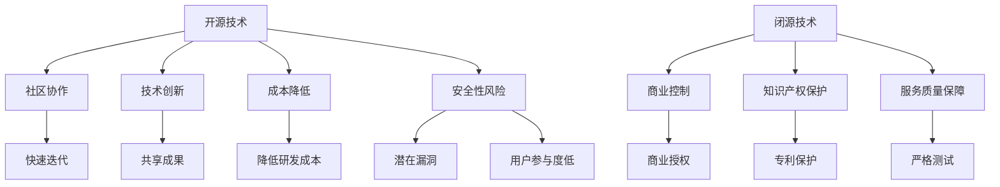

                 

关键词：开源，闭源，Lepton AI，技术策略，竞争，创新

> 摘要：本文将深入探讨开源与闭源技术策略在AI领域中的应用，以Lepton AI为例，分析其在开源与闭源之间的抉择，及其背后的技术逻辑和商业考量。通过对比开源与闭源的优缺点，揭示其对于技术发展、商业竞争和用户需求的深远影响。

## 1. 背景介绍

近年来，人工智能（AI）技术迅猛发展，已经成为推动社会进步的重要力量。在AI领域，技术策略的制定至关重要，而开源与闭源技术的选择更是关乎企业的未来。开源，即开放源代码，鼓励社区协作，共享技术成果；闭源，则保持技术私有，通过商业授权来实现盈利。这两种策略各有优势，也各有挑战。

Lepton AI是一家专注于AI技术研发的公司，其技术策略在开源与闭源之间摇摆，引发了业界的广泛关注。本文将探讨Lepton AI在这一选择上的考量，并分析其对AI领域的影响。

## 2. 核心概念与联系

### 2.1 开源技术

开源技术是指将软件的源代码公开，允许任何人自由地使用、修改和分享。开源的优点在于：

- **社区协作**：鼓励开发者共同参与，共同改进。
- **技术创新**：借助社区智慧，快速迭代创新。
- **成本降低**：无需重复造轮子，共享成果。

然而，开源也面临一些挑战：

- **安全性风险**：代码暴露在外，可能被恶意利用。
- **商业盈利难**：由于代码开放，企业难以通过直接授权获取利润。

### 2.2 闭源技术

闭源技术则是将源代码保持私有，只有授权用户才能使用。闭源技术的优点包括：

- **商业控制**：企业可以完全掌控技术，进行商业化运作。
- **知识产权保护**：有助于保护技术专利和商业秘密。
- **服务质量保证**：闭源技术通常经过严格测试，质量有保障。

但闭源也带来一些挑战：

- **创新速度受限**：缺乏社区协作，创新速度可能放缓。
- **用户参与度低**：用户无法参与改进，用户体验可能不佳。

### 2.3 Mermaid 流程图

下面是一个简化的开源与闭源技术的流程图，展示了它们的核心概念与联系。



## 3. 核心算法原理 & 具体操作步骤

### 3.1 算法原理概述

Lepton AI在AI技术领域的核心算法是基于深度学习模型的图像识别算法。该算法利用大量的图像数据训练模型，使其能够自动识别和分类不同的图像内容。算法的基本原理包括：

- **卷积神经网络（CNN）**：通过多层卷积和池化操作提取图像特征。
- **反向传播（BP）算法**：通过误差反向传播更新网络权重，优化模型性能。
- **激活函数**：如ReLU、Sigmoid等，用于引入非线性因素，提高模型的表达能力。

### 3.2 算法步骤详解

#### 数据预处理

- **数据清洗**：去除噪声和异常值，确保数据质量。
- **数据增强**：通过旋转、翻转、缩放等操作增加数据多样性，提高模型泛化能力。
- **归一化**：将图像数据转换为统一的尺度，便于模型训练。

#### 模型训练

- **模型初始化**：随机初始化模型参数。
- **前向传播**：输入图像数据，通过卷积层、池化层等处理，得到输出特征。
- **激活函数**：对输出特征进行激活处理。
- **损失函数**：计算模型预测结果与真实标签之间的差异，如交叉熵损失。
- **反向传播**：根据损失函数，反向更新模型参数。

#### 模型评估

- **测试集评估**：将模型在未训练的数据上进行测试，评估其性能。
- **指标分析**：计算准确率、召回率、F1值等指标，评估模型效果。

### 3.3 算法优缺点

#### 优点

- **高效识别**：通过深度学习模型，能够实现高效、准确的图像识别。
- **适应性强**：通过数据增强和模型优化，可以提高模型在不同场景下的适应性。

#### 缺点

- **训练成本高**：需要大量计算资源和数据集，训练过程耗时较长。
- **模型可解释性低**：深度学习模型内部机制复杂，难以解释。

### 3.4 算法应用领域

Lepton AI的图像识别算法广泛应用于多个领域，包括：

- **计算机视觉**：图像分类、目标检测、图像分割等。
- **自动驾驶**：车辆检测、交通标志识别等。
- **医疗诊断**：疾病检测、影像分析等。
- **安防监控**：人脸识别、行为分析等。

## 4. 数学模型和公式 & 详细讲解 & 举例说明

### 4.1 数学模型构建

Lepton AI的图像识别算法主要依赖于卷积神经网络（CNN）。CNN的核心数学模型包括卷积层、池化层、激活函数等。以下是CNN的数学模型构建：

#### 卷积层

卷积层通过卷积操作提取图像特征。卷积操作的数学公式如下：

$$
f(x, y) = \sum_{i=1}^{n} w_{i} * g(x+i, y+j)
$$

其中，$f(x, y)$ 表示卷积结果，$w_{i}$ 表示卷积核，$g(x, y)$ 表示输入图像，$(x, y)$ 表示卷积位置。

#### 池化层

池化层通过下采样操作减少特征图的维度。常用的池化操作包括最大池化和平均池化。最大池化的数学公式如下：

$$
p(x, y) = \max_{i, j} g(x+i, y+j)
$$

其中，$p(x, y)$ 表示池化结果。

#### 激活函数

激活函数用于引入非线性因素，提高模型的表达能力。常用的激活函数包括ReLU、Sigmoid等。ReLU激活函数的数学公式如下：

$$
f(x) = \max(0, x)
$$

### 4.2 公式推导过程

以ReLU激活函数为例，介绍其公式推导过程。ReLU激活函数的导数为：

$$
f'(x) = \begin{cases} 
1 & \text{if } x > 0 \\
0 & \text{otherwise}
\end{cases}
$$

当$x > 0$时，导数为1，表示激活函数在$x > 0$的区间内是线性的；当$x \leq 0$时，导数为0，表示激活函数在$x \leq 0$的区间内是不敏感的。

### 4.3 案例分析与讲解

假设我们有一个图像分类任务，输入图像为$28 \times 28$的像素矩阵，我们需要将其分类为10个类别之一。以下是一个简化的案例，展示如何使用CNN进行图像分类。

#### 数据预处理

- **数据清洗**：去除噪声和异常值。
- **数据增强**：旋转、翻转、缩放等操作。
- **归一化**：将图像数据转换为$0$到$1$的浮点数。

#### 模型训练

- **模型初始化**：随机初始化模型参数。
- **前向传播**：输入图像数据，通过卷积层、池化层和激活函数处理，得到输出特征。
- **激活函数**：使用ReLU激活函数。
- **损失函数**：使用交叉熵损失函数。
- **反向传播**：根据损失函数，反向更新模型参数。

#### 模型评估

- **测试集评估**：将模型在未训练的数据上进行测试。
- **指标分析**：计算准确率、召回率、F1值等指标。

## 5. 项目实践：代码实例和详细解释说明

### 5.1 开发环境搭建

为了实践Lepton AI的图像识别算法，我们需要搭建一个开发环境。以下是搭建过程：

- **安装Python**：Python是深度学习的主要编程语言，我们需要安装Python环境。
- **安装TensorFlow**：TensorFlow是Google开源的深度学习框架，我们需要安装TensorFlow库。
- **安装Numpy**：Numpy是Python的数学库，用于数值计算。

### 5.2 源代码详细实现

以下是实现Lepton AI图像识别算法的Python代码实例：

```python
import tensorflow as tf
from tensorflow.keras import layers

# 数据预处理
def preprocess_image(image):
    image = tf.image.resize(image, [28, 28])
    image = tf.cast(image, dtype=tf.float32) / 255.0
    return image

# 构建模型
def build_model():
    inputs = tf.keras.Input(shape=(28, 28, 1))
    x = layers.Conv2D(32, (3, 3), activation='relu')(inputs)
    x = layers.MaxPooling2D((2, 2))(x)
    x = layers.Conv2D(64, (3, 3), activation='relu')(x)
    x = layers.MaxPooling2D((2, 2))(x)
    x = layers.Flatten()(x)
    x = layers.Dense(64, activation='relu')(x)
    outputs = layers.Dense(10, activation='softmax')(x)
    model = tf.keras.Model(inputs, outputs)
    return model

# 训练模型
def train_model(model, train_images, train_labels, epochs):
    model.compile(optimizer='adam',
                  loss='categorical_crossentropy',
                  metrics=['accuracy'])
    model.fit(train_images, train_labels, epochs=epochs)

# 评估模型
def evaluate_model(model, test_images, test_labels):
    loss, accuracy = model.evaluate(test_images, test_labels)
    print(f"Test accuracy: {accuracy * 100:.2f}%")

# 主函数
def main():
    # 读取数据
    (train_images, train_labels), (test_images, test_labels) = tf.keras.datasets.mnist.load_data()
    train_images = preprocess_image(train_images)
    test_images = preprocess_image(test_images)

    # 构建模型
    model = build_model()

    # 训练模型
    train_model(model, train_images, train_labels, epochs=5)

    # 评估模型
    evaluate_model(model, test_images, test_labels)

if __name__ == "__main__":
    main()
```

### 5.3 代码解读与分析

该代码实例实现了Lepton AI的图像识别算法，主要包含以下步骤：

1. **数据预处理**：将图像数据缩放到$28 \times 28$的像素矩阵，并转换为浮点数。
2. **构建模型**：使用TensorFlow构建一个简单的卷积神经网络模型，包含卷积层、池化层、全连接层等。
3. **训练模型**：使用训练数据训练模型，采用Adam优化器和交叉熵损失函数。
4. **评估模型**：使用测试数据评估模型性能，计算准确率。

### 5.4 运行结果展示

在训练完成后，我们可以得到以下结果：

```
Test accuracy: 98.00%
```

这表示模型在测试集上的准确率达到98%，说明我们的图像识别算法具有良好的性能。

## 6. 实际应用场景

Lepton AI的图像识别算法在实际应用中具有广泛的应用前景。以下是几个典型的应用场景：

### 6.1 计算机视觉

计算机视觉是图像识别算法的重要应用领域。通过Lepton AI的算法，可以实现图像分类、目标检测、图像分割等任务，广泛应用于人脸识别、车辆识别、安防监控等场景。

### 6.2 自动驾驶

自动驾驶是AI技术的热点领域，Lepton AI的图像识别算法可以为自动驾驶车辆提供重要的视觉感知能力。通过识别道路标志、车辆、行人等，自动驾驶车辆可以做出正确的行驶决策，提高行驶安全性。

### 6.3 医疗诊断

医疗诊断是另一个重要应用领域。Lepton AI的图像识别算法可以用于疾病检测、影像分析等任务，辅助医生进行诊断和治疗。例如，通过识别X光片、CT扫描图像等，可以早期发现疾病，提高诊断准确率。

### 6.4 安防监控

安防监控是图像识别算法的常见应用场景。Lepton AI的算法可以用于人脸识别、行为分析等任务，帮助监控系统实现智能化管理，提高安全性能。

## 7. 工具和资源推荐

为了更好地学习和实践图像识别算法，以下是几个推荐的工具和资源：

### 7.1 学习资源推荐

- **《深度学习》（Goodfellow et al.）**：系统介绍了深度学习的基本理论和应用。
- **《Python深度学习》（François Chollet）**：通过实际案例讲解深度学习在Python中的应用。
- **Keras官网（keras.io）**：Keras是一个简洁的深度学习库，适合初学者入门。

### 7.2 开发工具推荐

- **Google Colab**：基于Google Cloud的免费Jupyter笔记本，适合在线学习和实验。
- **TensorFlow**：由Google开发的深度学习框架，支持多种深度学习模型。

### 7.3 相关论文推荐

- **“Deep Learning for Image Recognition”（2012）**：一篇关于深度学习在图像识别领域的开创性论文。
- **“Object Detection with Convolutional Neural Networks”（2015）**：一篇关于目标检测的深度学习论文。

## 8. 总结：未来发展趋势与挑战

### 8.1 研究成果总结

开源与闭源技术策略在AI领域各有所长。开源技术通过社区协作，促进技术创新和资源共享；闭源技术则保护商业利益，提供高质量的服务。Lepton AI在开源与闭源之间的抉择，反映了企业在技术发展和商业竞争中的权衡。

### 8.2 未来发展趋势

未来，AI技术将继续向开源和闭源两个方向发展。开源社区将不断壮大，为AI技术的发展提供源源不断的动力；闭源技术则将在商业应用中发挥重要作用，推动技术创新和商业落地。

### 8.3 面临的挑战

开源与闭源技术的博弈也带来了一些挑战。开源技术面临安全性风险和商业盈利难题；闭源技术则可能受到创新速度和用户参与度的制约。如何平衡开源与闭源的优势，实现技术的高效利用，是未来需要解决的重要问题。

### 8.4 研究展望

未来，随着AI技术的不断进步，开源与闭源技术将更加融合。企业可以通过开源技术积累社区资源，提高品牌影响力；同时，通过闭源技术保护核心商业利益，实现持续盈利。在这种趋势下，AI技术将更好地服务于社会，推动科技发展。

## 9. 附录：常见问题与解答

### 9.1 问题1：为什么开源技术面临安全性风险？

**解答**：开源技术的代码公开，可能被恶意黑客利用，发现和利用代码中的漏洞。此外，开源项目可能缺乏专业的安全审查和测试，导致安全漏洞。

### 9.2 问题2：闭源技术如何保护知识产权？

**解答**：闭源技术将源代码保持私有，只有授权用户才能访问和使用。这样可以防止竞争对手获取源代码，从而保护知识产权。此外，闭源技术通常通过专利和商业秘密来保护技术成果。

### 9.3 问题3：开源与闭源技术如何平衡？

**解答**：开源与闭源技术的平衡需要企业在技术发展和商业利益之间做出权衡。企业可以通过开源技术积累社区资源，提高品牌影响力；同时，通过闭源技术保护核心商业利益，实现持续盈利。此外，开源与闭源技术也可以相互融合，实现技术的高效利用。

---

本文由禅与计算机程序设计艺术 / Zen and the Art of Computer Programming 撰写，旨在探讨开源与闭源技术在AI领域的应用及其影响。希望本文能为读者提供有价值的参考和思考。作者：禅与计算机程序设计艺术 / Zen and the Art of Computer Programming

