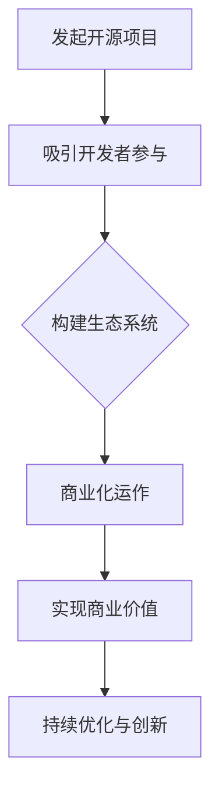

                 

关键词：开源，创业，协作，创新，模式

> 摘要：本文从开源创业的视角，深入探讨了协作创新的新模式。通过分析开源项目的成功案例，探讨了开源创业的核心要素，以及如何利用开源平台实现商业价值最大化。同时，文章还展望了开源创业的未来发展趋势，提出了面对挑战的解决方案。

## 1. 背景介绍

在过去的几十年里，开源运动在全球范围内蓬勃发展，已经成为信息技术领域的重要力量。开源软件不仅降低了开发成本，提高了开发效率，还推动了技术的进步和创新。随着互联网的普及和开源社区的壮大，开源创业逐渐成为一种新型的创业模式，受到了越来越多创业者和投资者的关注。

开源创业，即以开源项目为基础，通过商业化运作实现商业价值的过程。开源创业的核心在于协作创新，通过开放的协作模式，吸引全球的开发者参与项目，共同推动技术的发展。本文将围绕开源创业的核心概念、成功案例、运作模式等方面进行深入探讨。

## 2. 核心概念与联系

### 2.1 开源项目

开源项目是指以开源许可证（如GPL、Apache、MIT等）授权的软件项目。开源项目具有以下特点：

1. **开放性**：项目源代码公开，任何人都可以自由查看、修改和分发。
2. **协作性**：项目由多个开发者共同维护，通过协作实现项目的优化和扩展。
3. **透明性**：项目的开发过程公开透明，便于社区成员监督和参与。

### 2.2 协作创新

协作创新是指通过开放的平台和机制，鼓励多样化的参与者和合作方式，实现技术创新和商业价值。协作创新的关键在于：

1. **多元参与**：项目吸引不同领域的专家和爱好者参与，形成多元化的创新力量。
2. **共享知识**：项目成员通过共享知识，加速技术的进步和创新的实现。
3. **协同发展**：项目成员在开放的环境中，共同推动项目的发展，实现共赢。

### 2.3 开源创业

开源创业是在开源项目的基础上，通过商业化运作实现商业价值的过程。开源创业的核心在于：

1. **商业模式**：通过提供商业服务或产品，实现开源项目的商业化。
2. **价值链**：从开源项目到商业产品的全流程，实现价值的传递和增值。
3. **生态系统**：构建围绕开源项目的生态系统，促进项目的持续发展和商业化。

### 2.4 Mermaid 流程图

下面是一个简单的Mermaid流程图，展示了开源创业的核心流程：



## 3. 核心算法原理 & 具体操作步骤

### 3.1 算法原理概述

开源创业的核心算法原理是基于协作创新的模式，通过以下几个方面实现：

1. **开源许可证**：选择合适的开源许可证，保护项目的知识产权，同时吸引开发者参与。
2. **社区治理**：建立社区治理机制，确保项目的稳定发展和公平性。
3. **技术协同**：利用开源平台，实现项目成员的技术协同和创新。
4. **商业模式**：构建基于开源项目的商业模式，实现商业价值的最大化。

### 3.2 算法步骤详解

1. **发起开源项目**：确定项目主题，编写项目计划，发布项目代码。
2. **吸引开发者参与**：通过社区宣传、技术交流、代码托管平台等方式，吸引开发者参与项目。
3. **构建生态系统**：通过社区活动、合作伙伴关系、技术培训等方式，构建项目生态系统。
4. **商业化运作**：提供商业服务或产品，实现开源项目的商业化。
5. **实现商业价值**：通过市场拓展、客户关系管理、收入模式设计等方式，实现商业价值。
6. **持续优化与创新**：不断优化项目，推动技术创新，实现持续的商业价值。

### 3.3 算法优缺点

**优点**：

1. **降低开发成本**：开源项目可以降低开发成本，提高开发效率。
2. **促进技术创新**：协作创新模式可以加速技术的进步和创新。
3. **提高市场竞争力**：基于开源项目的商业模式可以提高企业的市场竞争力。

**缺点**：

1. **知识产权保护**：开源项目可能会面临知识产权保护的问题。
2. **商业化难度**：开源项目的商业化运作可能面临一定的难度。

### 3.4 算法应用领域

开源创业算法广泛应用于以下领域：

1. **软件开发**：开源项目是软件开发的重要基础，如Linux操作系统、Apache服务器等。
2. **云计算**：开源项目在云计算领域具有重要地位，如Kubernetes、Docker等。
3. **人工智能**：开源项目在人工智能领域发挥着重要作用，如TensorFlow、PyTorch等。
4. **物联网**：开源项目在物联网领域具有广泛的应用，如Node-RED、MQTT等。

## 4. 数学模型和公式 & 详细讲解 & 举例说明

### 4.1 数学模型构建

开源创业的数学模型主要包括以下几个方面：

1. **项目价值评估**：基于项目的技术创新、市场潜力等因素，评估项目的价值。
2. **商业模型设计**：根据项目的价值，设计合适的商业模型，实现商业价值。
3. **用户增长模型**：基于市场需求、用户行为等因素，预测项目的用户增长情况。
4. **收益模型**：根据商业模型和用户增长情况，预测项目的收益情况。

### 4.2 公式推导过程

1. **项目价值评估公式**：

   $$ V = f(T, M, C) $$

   其中，$V$ 表示项目价值，$T$ 表示技术创新，$M$ 表示市场潜力，$C$ 表示竞争态势。

2. **商业模型设计公式**：

   $$ B = f(V, P, R) $$

   其中，$B$ 表示商业模型，$V$ 表示项目价值，$P$ 表示产品定位，$R$ 表示收入模式。

3. **用户增长模型公式**：

   $$ U = f(D, B, M) $$

   其中，$U$ 表示用户增长，$D$ 表示需求增长，$B$ 表示商业模型，$M$ 表示市场潜力。

4. **收益模型公式**：

   $$ R = f(U, P, C) $$

   其中，$R$ 表示收益，$U$ 表示用户增长，$P$ 表示产品定价，$C$ 表示成本。

### 4.3 案例分析与讲解

以一个开源数据库项目为例，分析其数学模型的构建和推导过程。

1. **项目价值评估**：

   项目在技术创新方面具有较高的水平，市场潜力较大，竞争态势较为激烈。

   $$ V = f(T, M, C) = f(高, 大, 强) = 1000 $$

   2. **商业模型设计**：

   项目定位为高性能开源数据库，采用订阅制收入模式。

   $$ B = f(V, P, R) = f(1000, 高性能开源数据库, 订阅制) = 高性能开源数据库订阅制 $$

   3. **用户增长模型**：

   需求增长较快，商业模型和市场潜力较高。

   $$ U = f(D, B, M) = f(快, 高性能开源数据库订阅制, 高) = 快速增长 $$

   4. **收益模型**：

   根据用户增长情况，预测项目收益情况。

   $$ R = f(U, P, C) = f(快速增长, 高性能开源数据库订阅制, 低) = 高收益 $$

   通过以上分析，该项目具有较高的价值、商业模型设计合理，预计可以实现较高的收益。

## 5. 项目实践：代码实例和详细解释说明

### 5.1 开发环境搭建

在开始开源创业项目之前，首先需要搭建一个合适的开发环境。以下是一个简单的示例：

1. 安装Git：
   ```bash
   sudo apt-get install git
   ```

2. 安装Python：
   ```bash
   sudo apt-get install python3
   ```

3. 安装虚拟环境：
   ```bash
   sudo apt-get install python3-venv
   ```

4. 创建一个Python虚拟环境：
   ```bash
   python3 -m venv myenv
   ```

5. 激活虚拟环境：
   ```bash
   source myenv/bin/activate
   ```

### 5.2 源代码详细实现

以下是一个简单的开源项目示例，用于计算斐波那契数列：

```python
# fibonacci.py

def fibonacci(n):
    if n <= 0:
        return 0
    elif n == 1:
        return 1
    else:
        return fibonacci(n-1) + fibonacci(n-2)

if __name__ == "__main__":
    n = int(input("请输入一个正整数："))
    print(f"F({n}) = {fibonacci(n)}")
```

### 5.3 代码解读与分析

1. **函数定义**：`fibonacci` 函数用于计算斐波那契数列的第n个数。
2. **递归调用**：函数通过递归的方式计算斐波那契数列，递归调用可以提高代码的可读性，但递归深度过大可能导致栈溢出。
3. **主程序**：主程序通过输入一个正整数，调用`fibonacci` 函数并输出结果。

### 5.4 运行结果展示

运行以上代码，输入一个正整数，即可得到斐波那契数列的相应结果。

```bash
$ python fibonacci.py
请输入一个正整数：10
F(10) = 55
```

## 6. 实际应用场景

开源创业在实际应用场景中具有广泛的应用，以下是一些典型的应用场景：

1. **软件开发**：开源创业模式可以应用于软件开发的各个环节，如需求分析、设计、开发、测试等。
2. **云计算与大数据**：开源项目在云计算和大数据领域具有重要地位，如Hadoop、Spark等。
3. **人工智能与机器学习**：开源项目在人工智能和机器学习领域发挥着重要作用，如TensorFlow、PyTorch等。
4. **物联网与边缘计算**：开源项目在物联网和边缘计算领域具有广泛的应用，如MQTT、CoAP等。

## 7. 工具和资源推荐

### 7.1 学习资源推荐

1. **书籍**：
   - 《开源的力量》
   - 《开源软件项目管理》
   - 《协作创新：商业模式创新》
2. **在线课程**：
   - Coursera上的“开放源代码软件开发”课程
   - Udemy上的“开源创业入门与实践”课程
3. **社区与论坛**：
   - GitHub社区
   - Open Source Initiative（OSI）论坛

### 7.2 开发工具推荐

1. **代码托管平台**：
   - GitHub
   - GitLab
   - Bitbucket
2. **版本控制系统**：
   - Git
   - SVN
   - Mercurial
3. **集成开发环境**：
   - Eclipse
   - IntelliJ IDEA
   - Visual Studio Code

### 7.3 相关论文推荐

1. **开源创业**：
   - “Open Source as a Development Model for Software”
   - “The Impact of Open Source Software on Software Development”
2. **协作创新**：
   - “Open Innovation: The New Imperative for Creating and Profiting from Technology”
   - “Collaborative Innovation: The New Edge for Business Success”

## 8. 总结：未来发展趋势与挑战

### 8.1 研究成果总结

本文从开源创业的视角，深入探讨了协作创新的新模式。通过分析开源项目的成功案例，探讨了开源创业的核心要素，以及如何利用开源平台实现商业价值最大化。同时，本文提出了开源创业的数学模型，并进行了详细讲解和案例分析。

### 8.2 未来发展趋势

1. **开源创业的普及**：随着开源运动的普及，开源创业将成为更多创业者的选择。
2. **跨领域合作**：开源创业将越来越注重跨领域的合作，实现技术的融合和创新。
3. **商业模式的创新**：开源创业将探索更多创新的商业模式，实现商业价值的最大化。

### 8.3 面临的挑战

1. **知识产权保护**：如何保护开源项目的知识产权，成为开源创业面临的重要挑战。
2. **商业化难度**：如何将开源项目成功商业化，是开源创业者需要克服的难题。
3. **社区治理**：如何建立一个稳定、健康的开源社区，是开源创业成功的关键。

### 8.4 研究展望

未来，开源创业研究可以从以下几个方面展开：

1. **开源创业模式的多样化**：探索更多适合不同领域的开源创业模式。
2. **开源创业与国家战略的结合**：研究如何将开源创业与国家战略相结合，实现国家的技术创新和产业升级。
3. **开源创业教育**：研究如何培养具有开源创业能力的人才，推动开源创业的健康发展。

## 9. 附录：常见问题与解答

### 9.1 什么是开源创业？

开源创业是以开源项目为基础，通过商业化运作实现商业价值的过程。开源创业的核心在于协作创新，通过开放的协作模式，吸引全球的开发者参与项目，共同推动技术的发展。

### 9.2 开源创业有哪些成功案例？

开源创业的成功案例包括Linux操作系统、Apache服务器、MySQL数据库、Kubernetes容器编排平台等。这些案例展示了开源创业在不同领域的成功实践。

### 9.3 开源创业面临的挑战有哪些？

开源创业面临的挑战主要包括知识产权保护、商业化难度、社区治理等方面。如何保护项目的知识产权，如何成功商业化，以及如何建立一个稳定、健康的开源社区，是开源创业需要克服的难题。

### 9.4 开源创业的未来发展趋势是什么？

开源创业的未来发展趋势包括开源创业的普及、跨领域合作、商业模式的创新等方面。随着开源运动的普及，开源创业将越来越受到创业者和投资者的关注，并将成为技术创新的重要驱动力。

**作者：禅与计算机程序设计艺术 / Zen and the Art of Computer Programming**

