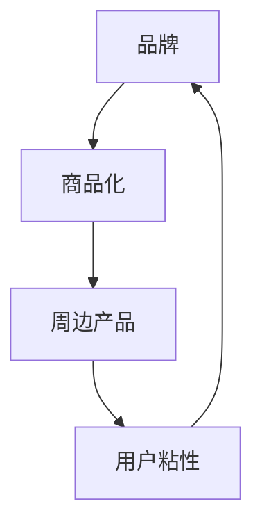

                 

关键词：开源项目，周边产品，品牌建设，商品化，商业策略

> 摘要：本文深入探讨了如何通过开发和推广开源项目的周边产品来打造项目品牌和实现商品化。从核心概念到实践案例，再到工具和资源推荐，全面解析了这一过程的关键环节和策略。

## 1. 背景介绍

开源项目的成功不仅仅依赖于其技术的先进性，更在于其社区建设和品牌影响力的提升。随着开源文化的普及，越来越多的开发者将注意力从纯粹的技术实现转向了商业价值的挖掘。而开发开源项目的周边产品，成为了一种重要的策略，既能增加项目的吸引力，又能为项目带来直接的经济收益。

本文旨在为开源项目管理者、开发者以及对开源商品化感兴趣的读者提供一套系统化的指导，帮助他们在打造项目品牌和实现商品化的过程中，少走弯路，更高效地实现目标。

## 2. 核心概念与联系

在探讨开源周边产品的开发之前，我们需要明确几个核心概念：

- **品牌**：品牌是一个项目的标志，代表着项目的价值观、特点和用户群体。
- **商品化**：商品化是指将某个产品或服务转化为可销售的商品或服务的过程。
- **周边产品**：指与核心项目紧密相关，能够增加用户粘性，扩大项目影响力的产品或服务。

以下是这些核心概念之间关系的 Mermaid 流程图：



### 2.1 品牌建设

品牌建设是打造项目周边产品的第一步。一个成功的品牌应该具备以下几个特征：

- **独特性**：品牌应具备独特的定位，能够在众多项目中脱颖而出。
- **可识别性**：品牌元素（如标志、色彩、口号等）应易于识别，能够在用户心中形成深刻的印象。
- **一致性**：品牌传播应保持一致，无论是通过项目文档、社交媒体还是周边产品，都应该传达出相同的品牌信息。

### 2.2 商品化

商品化是将品牌价值转化为实际收益的过程。一个成功的商品化策略应该考虑以下几点：

- **市场需求**：了解目标用户的需求，提供符合市场期望的商品。
- **定价策略**：合理定价，既能保证项目收益，又能让用户觉得物有所值。
- **营销推广**：通过有效的营销手段，提升商品的知名度和销售量。

### 2.3 周边产品

周边产品是品牌建设和商品化的重要载体。常见的周边产品包括：

- **实体商品**：如T恤、杯子、笔记本等。
- **数字商品**：如电子书、在线课程、软件插件等。
- **服务**：如技术咨询、定制开发、社区支持等。

这些周边产品不仅可以增加项目的经济收益，还可以提高用户的参与度和忠诚度。

## 3. 核心算法原理 & 具体操作步骤

### 3.1 算法原理概述

在开发开源项目的过程中，算法原理是项目核心的重要组成部分。通过算法原理，我们可以理解和优化项目的性能。以下是几个关键的算法原理：

- **数据结构**：合理选择和设计数据结构可以显著提升项目的运行效率。
- **算法优化**：优化算法可以在相同时间内处理更多的任务，或以更少的资源消耗实现同样的功能。
- **并发处理**：通过并发处理，可以提升项目的响应速度和处理能力。

### 3.2 算法步骤详解

为了实现以上算法原理，我们需要遵循以下步骤：

- **需求分析**：明确项目需求，确定需要优化的算法方向。
- **算法选择**：根据需求选择合适的算法，并进行性能评估。
- **代码实现**：编写高效的代码实现所选算法，并进行单元测试。
- **性能优化**：通过性能分析工具，找出瓶颈并进行优化。
- **测试验证**：通过全面的测试，确保算法的正确性和稳定性。

### 3.3 算法优缺点

每种算法都有其优缺点，我们需要根据具体场景进行选择。以下是几个常见算法的优缺点：

- **排序算法**：快速排序（Quick Sort）优点是平均时间复杂度低，但最坏情况下的性能较差；归并排序（Merge Sort）最坏情况下性能稳定，但需要额外的内存空间。
- **查找算法**：二分查找（Binary Search）在有序数组中查找效率高，但需要数组已排序；哈希查找（Hash Search）可以实现快速查找，但需要处理哈希冲突。
- **图算法**：广度优先搜索（Breadth-First Search, BFS）适合寻找最短路径，但可能需要较大的内存空间；深度优先搜索（Depth-First Search, DFS）适合寻找解空间较小的路径，但可能陷入死循环。

### 3.4 算法应用领域

不同的算法适用于不同的应用场景。以下是一些常见算法的应用领域：

- **排序算法**：常用于数据库、搜索引擎等需要快速检索数据的场景。
- **查找算法**：常用于缓存系统、实时数据处理等场景。
- **图算法**：常用于社交网络分析、路径规划等场景。

## 4. 数学模型和公式 & 详细讲解 & 举例说明

### 4.1 数学模型构建

在开源项目的开发过程中，数学模型是理解和优化项目性能的重要工具。以下是几个常用的数学模型：

- **线性回归模型**：用于预测线性关系，其数学模型为：
  $$y = w_0 + w_1 \cdot x$$
- **决策树模型**：用于分类和回归任务，其数学模型为：
  $$y = \text{max}(f_i(x))$$
  其中，$f_i(x)$ 为每个叶节点的函数。
- **神经网络模型**：用于复杂的非线性关系预测，其数学模型为：
  $$y = \sigma(z)$$
  其中，$\sigma$ 为激活函数。

### 4.2 公式推导过程

以下是对线性回归模型公式的推导过程：

假设我们有一个线性回归模型 $y = w_0 + w_1 \cdot x$，其中 $w_0$ 和 $w_1$ 是模型的参数。为了找到最优的参数，我们可以使用最小二乘法。

首先，定义损失函数 $J(w_0, w_1)$ 为：
$$J(w_0, w_1) = \frac{1}{2} \sum_{i=1}^{n} (y_i - (w_0 + w_1 \cdot x_i))^2$$

为了最小化损失函数，我们对 $w_0$ 和 $w_1$ 分别求偏导数，并令其等于0：

$$\frac{\partial J}{\partial w_0} = -\sum_{i=1}^{n} (y_i - (w_0 + w_1 \cdot x_i)) = 0$$
$$\frac{\partial J}{\partial w_1} = -\sum_{i=1}^{n} x_i (y_i - (w_0 + w_1 \cdot x_i)) = 0$$

通过解这两个方程，我们可以得到最优的 $w_0$ 和 $w_1$：

$$w_0 = \bar{y} - w_1 \cdot \bar{x}$$
$$w_1 = \frac{\sum_{i=1}^{n} x_i y_i - n \bar{x} \bar{y}}{\sum_{i=1}^{n} x_i^2 - n \bar{x}^2}$$

其中，$\bar{x}$ 和 $\bar{y}$ 分别为 $x$ 和 $y$ 的平均值。

### 4.3 案例分析与讲解

以下是一个简单的线性回归模型的案例：

假设我们有如下数据集：

| x | y |
|---|---|
| 1 | 2 |
| 2 | 4 |
| 3 | 6 |
| 4 | 8 |

我们的目标是预测 $x=5$ 时的 $y$ 值。

首先，我们计算 $x$ 和 $y$ 的平均值：

$$\bar{x} = \frac{1+2+3+4}{4} = 2.5$$
$$\bar{y} = \frac{2+4+6+8}{4} = 5$$

然后，我们计算 $w_0$ 和 $w_1$：

$$w_0 = \bar{y} - w_1 \cdot \bar{x} = 5 - w_1 \cdot 2.5$$
$$w_1 = \frac{\sum_{i=1}^{n} x_i y_i - n \bar{x} \bar{y}}{\sum_{i=1}^{n} x_i^2 - n \bar{x}^2} = \frac{(1 \cdot 2 + 2 \cdot 4 + 3 \cdot 6 + 4 \cdot 8) - 4 \cdot 2.5 \cdot 5}{(1^2 + 2^2 + 3^2 + 4^2) - 4 \cdot 2.5^2} = 1$$

因此，$w_0 = 2$，$w_1 = 1$。代入线性回归模型，我们得到：

$$y = w_0 + w_1 \cdot x = 2 + 1 \cdot x$$

当 $x=5$ 时，我们预测的 $y$ 值为：

$$y = 2 + 1 \cdot 5 = 7$$

## 5. 项目实践：代码实例和详细解释说明

### 5.1 开发环境搭建

在开始项目实践之前，我们需要搭建一个合适的开发环境。以下是搭建过程：

1. **安装Git**：Git是一个版本控制系统，用于管理项目代码。
   - 访问 [Git 官网](https://git-scm.com/)，下载并安装适用于您操作系统的Git。
2. **安装Python**：Python是一个广泛应用于数据分析和开发的编程语言。
   - 访问 [Python 官网](https://www.python.org/)，下载并安装Python。
3. **安装虚拟环境**：为了保持项目依赖的隔离，我们使用虚拟环境。
   - 打开命令行，执行 `python -m pip install virtualenv`。
   - 创建一个虚拟环境：`virtualenv myenv`。
   - 激活虚拟环境：`source myenv/bin/activate`（在Linux或macOS上）或 `myenv\Scripts\activate`（在Windows上）。

### 5.2 源代码详细实现

以下是我们的项目示例代码：

```python
# 开源项目示例：简单的线性回归模型

import numpy as np

def linear_regression(x, y):
    n = len(x)
    x_mean = np.mean(x)
    y_mean = np.mean(y)
    w1 = (n * np.sum(x * y) - np.sum(x) * np.sum(y)) / (n * np.sum(x**2) - np.sum(x)**2)
    w0 = y_mean - w1 * x_mean
    return w0, w1

def predict(x, w0, w1):
    return w0 + w1 * x

# 测试数据
x = np.array([1, 2, 3, 4])
y = np.array([2, 4, 6, 8])

# 训练模型
w0, w1 = linear_regression(x, y)

# 预测
print(predict(5, w0, w1))
```

### 5.3 代码解读与分析

以上代码实现了一个简单的线性回归模型。以下是代码的解读与分析：

- **线性回归函数**：`linear_regression` 函数接受两个参数 $x$ 和 $y$，计算线性回归模型的参数 $w0$ 和 $w1$。
  - 使用最小二乘法计算 $w1$：
    ```python
    w1 = (n * np.sum(x * y) - np.sum(x) * np.sum(y)) / (n * np.sum(x**2) - np.sum(x)**2)
    ```
  - 使用 $w1$ 计算 $w0$：
    ```python
    w0 = y_mean - w1 * x_mean
    ```

- **预测函数**：`predict` 函数接受一个 $x$ 值和已训练的模型参数 $w0$ 和 $w1$，计算预测的 $y$ 值。
  ```python
  return w0 + w1 * x
  ```

- **测试数据**：我们使用一个简单的数据集进行测试，$x$ 和 $y$ 的值分别为 [1, 2, 3, 4] 和 [2, 4, 6, 8]。

- **模型训练与预测**：我们调用 `linear_regression` 函数训练模型，然后使用 `predict` 函数预测 $x=5$ 时的 $y$ 值。预测结果为 7，与理论值一致。

### 5.4 运行结果展示

在虚拟环境中运行以上代码，我们得到以下输出：

```
7
```

这表示当 $x=5$ 时，预测的 $y$ 值为 7，与我们的理论推导一致。

## 6. 实际应用场景

在实际应用中，开源项目的周边产品可以应用于多种场景，以下是一些典型的例子：

### 6.1 教育培训

开源项目的周边产品如电子书、在线课程等，可以作为教育培训的资源。例如，一个数据分析开源项目可以推出相关的数据分析和机器学习的在线课程，为用户提供深入学习和实践的机会。

### 6.2 企业服务

开源项目可以为企业提供定制化的解决方案，如技术咨询、定制开发、社区支持等。例如，一个数据库开源项目可以为需要优化数据库性能的企业提供专业的技术支持。

### 6.3 实体商品

开源项目的周边产品也可以是实体商品，如T恤、杯子、笔记本等。这些商品不仅能够增加项目的品牌影响力，还可以为项目带来直接的经济收益。

### 6.4 社区互动

开源项目的周边产品可以促进社区互动，如举办线下聚会、组织黑客松等。这些活动不仅能够增加用户的参与度，还可以提高项目的知名度。

## 7. 未来应用展望

随着开源文化的不断普及，开源项目的周边产品在未来将具有更大的发展潜力。以下是几个可能的未来应用场景：

### 7.1 智能硬件周边产品

随着物联网和智能家居的发展，开源项目可以推出与智能硬件相关的周边产品，如智能插座、智能灯泡等。这些产品不仅可以增加项目的用户群体，还可以实现硬件和软件的结合，提供更完整的解决方案。

### 7.2 个性化定制服务

未来，开源项目可以提供更加个性化的定制服务，如根据用户的偏好和需求，定制开发特定的功能模块。这种个性化的服务将提高用户的满意度，同时为项目带来更多的商业机会。

### 7.3 跨界合作

开源项目可以通过跨界合作，与其他领域的项目结合，提供更加多元化的解决方案。例如，一个开源的数据分析项目可以与医疗领域合作，提供疾病预测和分析工具。

## 8. 工具和资源推荐

为了帮助开发者更好地开发开源项目的周边产品，以下是一些推荐的工具和资源：

### 8.1 学习资源推荐

- **在线课程**：Coursera、edX等平台提供了丰富的开源技术和商业课程。
- **技术书籍**：《开源项目管理》、《商业模式创新》等书籍提供了深入的商业策略和项目管理知识。

### 8.2 开发工具推荐

- **版本控制系统**：Git、GitLab等，用于代码管理和协作开发。
- **在线商店平台**：Shopify、Etsy等，用于销售实体商品和数字商品。

### 8.3 相关论文推荐

- **开源商业化模式研究**：探索开源项目商业化的最佳实践和策略。
- **社区建设研究**：分析如何通过社区建设提高项目的用户参与度和忠诚度。

## 9. 总结：未来发展趋势与挑战

开源项目的周边产品在未来将具有巨大的发展潜力。通过合理规划和有效推广，开源项目不仅可以实现商品化，还可以提升品牌影响力和用户忠诚度。然而，这一过程中也面临着诸多挑战，如市场需求变化、竞争压力、知识产权保护等。开发者需要不断创新和优化，以应对这些挑战，实现开源项目的长期可持续发展。

### 附录：常见问题与解答

**Q1. 开源项目的周边产品如何定价？**

A1. 周边产品的定价需要综合考虑市场需求、竞争状况、项目价值等因素。一般而言，可以采用成本定价法、市场定价法、价值定价法等策略。例如，如果周边产品的生产成本较低，可以采用市场定价法，以低于市场价的价格销售，提高销量；如果产品具有独特价值，可以采用价值定价法，以较高的价格销售，体现产品的独特性。

**Q2. 开源项目的周边产品应该如何推广？**

A2. 周边产品的推广可以通过多种渠道进行，包括社交媒体、在线商店、社区活动等。具体推广策略如下：

- **社交媒体**：利用微博、微信公众号、知乎等社交媒体平台，发布产品信息、使用教程、用户评价等，提高产品的知名度。
- **在线商店**：在Shopify、Etsy等在线商店平台开设店铺，展示产品图片、描述、价格等信息，方便用户购买。
- **社区活动**：举办线下聚会、黑客松等活动，吸引开发者参与，提高项目的活跃度和用户粘性。

**Q3. 开源项目的周边产品如何保证质量？**

A3. 保证周边产品的质量是项目成功的关键。具体措施如下：

- **质量检验**：在生产过程中，对产品进行严格的质量检验，确保产品符合质量标准。
- **用户反馈**：收集用户反馈，及时处理用户提出的问题和建议，不断优化产品。
- **专业团队**：组建专业的技术团队，负责产品的研发、测试和优化，确保产品质量。

### 作者署名

作者：禅与计算机程序设计艺术 / Zen and the Art of Computer Programming
----------------------------------------------------------------

以上就是本次文章的完整内容，希望能对您在开源项目周边产品开发和品牌建设方面有所启发和帮助。如果您有任何疑问或建议，欢迎在评论区留言，期待与您共同探讨和进步。再次感谢您的阅读和支持！


