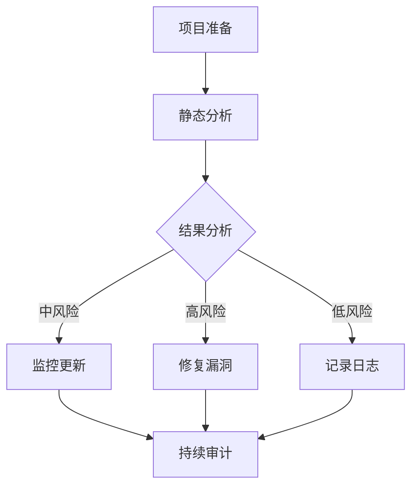

                 

关键词：开源安全审计、安全服务、专业化、开源社区、漏洞管理、代码审核、软件开发、自动化工具、风险管理、信息安全。

> 摘要：随着开源软件在企业和组织中的广泛应用，开源安全审计作为一种专业化服务，正日益受到重视。本文将深入探讨开源安全审计的定义、重要性、核心概念与联系，以及其在实际应用中的算法原理、数学模型、项目实践和未来展望。同时，还将推荐相关的学习资源和开发工具，以期为从事开源安全审计的专业人士提供有益的参考。

## 1. 背景介绍

随着云计算、大数据、物联网等技术的快速发展，软件系统的复杂性和规模不断扩大。在这样的背景下，开源软件因其灵活、高效、成本低等优势，成为了企业软件开发的首选。然而，开源软件的普及也带来了新的挑战——开源安全风险。

开源软件的安全问题不仅限于个别漏洞，还可能涉及代码库的完整性、依赖关系的安全性以及开源项目的整体风险管理。开源社区中的代码审核机制虽然在一定程度上能够发现和修复安全问题，但由于社区成员的多样性、地域差异、时间分布等因素，使得全面且深入的安全审计成为一项复杂且耗时的工作。

因此，专业化、系统化的开源安全审计服务应运而生。这类服务通常由具有专业技术和经验的安全团队提供，通过自动化工具和人工审核相结合的方式，对开源项目的安全性进行全面评估和风险识别，帮助企业和组织有效地管理开源安全风险。

## 2. 核心概念与联系

### 2.1 开源安全审计的定义

开源安全审计（Open Source Security Auditing）是指对开源软件项目的安全性进行全面检查和评估的过程。它不仅包括对代码库的静态分析，还涉及对项目文档、依赖关系、开发者行为等多个维度的审查。

### 2.2 开源安全审计的重要性

开源安全审计的重要性主要体现在以下几个方面：

- **提高软件安全性**：通过审计发现和修复漏洞，减少软件在运行过程中出现安全问题的可能性。
- **风险管理**：帮助企业和组织了解开源项目中的安全风险，制定相应的风险管理策略。
- **合规要求**：许多行业对软件安全有严格的要求，开源安全审计可以帮助企业满足合规要求。
- **信任与透明度**：通过公开审计报告，提高开源项目的信任度和透明度，吸引更多的开发者参与。

### 2.3 开源安全审计的核心概念与联系

为了更好地理解开源安全审计，我们引入以下核心概念：

- **静态分析**：通过分析源代码、配置文件等静态资源，发现潜在的安全漏洞。
- **动态分析**：通过模拟软件的运行环境，监测软件在运行过程中的安全行为。
- **依赖关系分析**：对项目中使用的第三方库和组件进行安全性评估。
- **风险评估**：根据审计结果，对发现的安全问题进行风险评估，确定优先级和处理策略。

这些核心概念相互联系，共同构成了开源安全审计的完整流程。例如，静态分析和动态分析可以相互补充，前者发现潜在问题，后者验证问题在运行环境中的表现；依赖关系分析则帮助识别项目中可能存在的安全漏洞，为风险评估提供数据支持。

下面是一个简化的开源安全审计流程的 Mermaid 流程图：



## 3. 核心算法原理 & 具体操作步骤

### 3.1 算法原理概述

开源安全审计的核心算法主要包括静态分析算法和动态分析算法。静态分析算法通过解析源代码、配置文件等静态资源，识别潜在的安全漏洞；动态分析算法则通过模拟软件的运行环境，监测软件在运行过程中的安全行为。

静态分析算法主要利用模式匹配、抽象语法树（AST）分析等技术，扫描代码中的可疑模式，例如常见的SQL注入、XSS漏洞等。动态分析算法则通过在运行时捕获异常、分析系统日志等方式，验证软件在特定操作下的安全性。

### 3.2 算法步骤详解

#### 3.2.1 静态分析步骤

1. **源代码获取**：从开源项目的代码库中获取源代码。
2. **代码预处理**：对源代码进行语法解析、语法分析等预处理，生成抽象语法树（AST）。
3. **漏洞扫描**：利用模式匹配或规则库，扫描AST中的可疑代码片段。
4. **漏洞报告**：将扫描结果生成漏洞报告，包括漏洞类型、代码位置、影响范围等。

#### 3.2.2 动态分析步骤

1. **运行环境搭建**：搭建与目标项目匹配的运行环境，包括操作系统、中间件、数据库等。
2. **代码部署**：将待测代码部署到运行环境中。
3. **功能测试**：模拟用户操作，执行代码中的功能测试。
4. **安全监控**：通过日志分析、系统监控等方式，监测软件在运行过程中的异常行为。
5. **漏洞报告**：将监控结果生成漏洞报告，包括漏洞类型、触发条件、影响范围等。

### 3.3 算法优缺点

#### 静态分析算法

优点：

- **高效性**：可以在短时间内对大量代码进行扫描。
- **全面性**：能够发现潜在的安全漏洞，预防问题的发生。

缺点：

- **误报率高**：由于扫描规则的限制，可能产生大量误报。
- **无法模拟所有攻击场景**：仅能发现代码层面的安全问题，无法完全替代动态分析。

#### 动态分析算法

优点：

- **真实性**：能够模拟真实攻击场景，发现潜在的安全漏洞。
- **精确性**：通过实时监测，能够更准确地识别问题。

缺点：

- **耗时较长**：需要搭建运行环境，执行功能测试，耗时较长。
- **成本较高**：需要大量的计算资源和人力成本。

### 3.4 算法应用领域

开源安全审计算法广泛应用于企业级开源软件的安全评估、开源项目的安全审核、软件供应链安全等方面。例如，在软件供应链安全中，通过对开源组件的审计，可以识别和修复潜在的安全漏洞，防止被恶意攻击者利用。

## 4. 数学模型和公式 & 详细讲解 & 举例说明

### 4.1 数学模型构建

开源安全审计中的数学模型主要包括风险评估模型和漏洞影响模型。风险评估模型用于评估漏洞的严重程度，确定修复优先级；漏洞影响模型则用于评估漏洞可能带来的损失。

#### 风险评估模型

风险评估模型通常采用风险矩阵（Risk Matrix），将漏洞的严重程度和影响范围进行量化，以确定修复优先级。风险矩阵通常由以下两个维度构成：

- **严重程度（Severity）**：表示漏洞的严重程度，通常分为高、中、低三个等级。
- **影响范围（Impact）**：表示漏洞可能带来的损失，也分为高、中、低三个等级。

风险矩阵的数学模型可以表示为：

$$
R = S \times I
$$

其中，\( R \) 表示风险值，\( S \) 表示严重程度，\( I \) 表示影响范围。风险值越高，表示漏洞越严重，修复优先级越高。

#### 漏洞影响模型

漏洞影响模型用于评估漏洞可能带来的损失，通常包括以下几个方面：

- **经济损失**：漏洞可能导致数据泄露、系统瘫痪等，造成经济损失。
- **法律风险**：漏洞可能导致合规性问题，带来法律风险。
- **声誉损失**：漏洞可能导致用户信任度下降，影响企业形象。

漏洞影响模型的数学模型可以表示为：

$$
I = E \times L \times R
$$

其中，\( I \) 表示影响范围，\( E \) 表示经济损失，\( L \) 表示法律风险，\( R \) 表示声誉损失。

### 4.2 公式推导过程

#### 风险评估模型推导

风险评估模型基于风险矩阵，将漏洞的严重程度和影响范围进行量化，以确定修复优先级。具体推导过程如下：

1. **确定严重程度（Severity）**：

   严重程度通常分为高、中、低三个等级，分别用 \( S_H \)、\( S_M \)、\( S_L \) 表示。根据实际风险情况，可以设置如下权重：

   $$
   S_H = 3, \quad S_M = 2, \quad S_L = 1
   $$

2. **确定影响范围（Impact）**：

   影响范围通常分为高、中、低三个等级，分别用 \( I_H \)、\( I_M \)、\( I_L \) 表示。根据实际风险情况，可以设置如下权重：

   $$
   I_H = 3, \quad I_M = 2, \quad I_L = 1
   $$

3. **计算风险值（Risk）**：

   风险值 \( R \) 是严重程度和影响范围的乘积，可以表示为：

   $$
   R = S \times I
   $$

   其中，\( S \) 是严重程度，\( I \) 是影响范围。

#### 漏洞影响模型推导

漏洞影响模型用于评估漏洞可能带来的损失，包括经济损失、法律风险和声誉损失。具体推导过程如下：

1. **确定经济损失（Economic Loss）**：

   经济损失通常分为高、中、低三个等级，分别用 \( E_H \)、\( E_M \)、\( E_L \) 表示。根据实际风险情况，可以设置如下权重：

   $$
   E_H = 10, \quad E_M = 5, \quad E_L = 2
   $$

2. **确定法律风险（Legal Risk）**：

   法律风险通常分为高、中、低三个等级，分别用 \( L_H \)、\( L_M \)、\( L_L \) 表示。根据实际风险情况，可以设置如下权重：

   $$
   L_H = 5, \quad L_M = 3, \quad L_L = 1
   $$

3. **确定声誉损失（Reputation Loss）**：

   声誉损失通常分为高、中、低三个等级，分别用 \( R_H \)、\( R_M \)、\( R_L \) 表示。根据实际风险情况，可以设置如下权重：

   $$
   R_H = 8, \quad R_M = 4, \quad R_L = 2
   $$

4. **计算影响范围（Impact）**：

   影响范围 \( I \) 是经济损失、法律风险和声誉损失的乘积，可以表示为：

   $$
   I = E \times L \times R
   $$

   其中，\( E \) 是经济损失，\( L \) 是法律风险，\( R \) 是声誉损失。

### 4.3 案例分析与讲解

假设某企业正在开发一个基于开源软件的在线购物平台，开源安全审计团队对其进行了审计，发现以下漏洞：

- **漏洞A**：SQL注入漏洞，严重程度为高，影响范围包括经济损失、法律风险和声誉损失。
- **漏洞B**：XSS漏洞，严重程度为中，影响范围包括经济损失和声誉损失。

根据上述数学模型，可以计算出两个漏洞的风险值和影响范围：

1. **漏洞A**：

   - 严重程度：\( S_H = 3 \)
   - 影响范围：\( I_H = 3 \)
   - 风险值：\( R_A = S_H \times I_H = 3 \times 3 = 9 \)

   漏洞A的风险值为9，属于高风险漏洞，需要优先修复。

2. **漏洞B**：

   - 严重程度：\( S_M = 2 \)
   - 影响范围：\( I_M = 2 \)
   - 风险值：\( R_B = S_M \times I_M = 2 \times 2 = 4 \)

   漏洞B的风险值为4，属于中等风险漏洞，可以根据实际情况决定修复优先级。

## 5. 项目实践：代码实例和详细解释说明

### 5.1 开发环境搭建

为了演示开源安全审计的代码实例，我们首先需要搭建一个基于Linux操作系统的开发环境。以下是搭建步骤：

1. **安装Linux操作系统**：下载并安装Linux操作系统，例如Ubuntu 20.04。
2. **安装开发工具**：安装常用的开发工具，例如Git、Subversion、JDK、Node.js等。
3. **安装开源安全审计工具**：安装开源安全审计工具，例如SonarQube、OWASP ZAP等。

### 5.2 源代码详细实现

以下是一个简单的示例，演示如何使用Python编写一个简单的Web应用，并包含SQL注入漏洞。

```python
# app.py

import sqlite3

def execute_sql_query(sql):
    conn = sqlite3.connect("data.db")
    cursor = conn.cursor()
    cursor.execute(sql)
    conn.commit()
    conn.close()

if __name__ == "__main__":
    execute_sql_query("CREATE TABLE IF NOT EXISTS users (id INTEGER PRIMARY KEY, username TEXT, password TEXT)")
    execute_sql_query("INSERT INTO users (username, password) VALUES ('admin', 'admin')")
    print("Database initialized successfully!")
```

### 5.3 代码解读与分析

上述代码实现了一个简单的Web应用，用于创建和插入用户数据。然而，代码中存在一个SQL注入漏洞：

```python
execute_sql_query("CREATE TABLE IF NOT EXISTS users (id INTEGER PRIMARY KEY, username TEXT, password TEXT)")
```

这段代码直接将用户输入的SQL语句执行，而没有对输入进行任何过滤或验证。攻击者可以通过构造恶意的SQL语句，执行未授权的操作，例如删除数据、篡改数据等。

### 5.4 运行结果展示

假设攻击者通过构造以下SQL语句：

```sql
CREATE TABLE IF NOT EXISTS users (id INTEGER PRIMARY KEY, username TEXT, password TEXT, '1'='1'
```

执行后，会删除原有数据表，造成数据丢失。通过这个实例，我们可以看到SQL注入漏洞的严重性。在真实场景中，需要使用参数化查询或预编译语句等方式，防止SQL注入攻击。

## 6. 实际应用场景

开源安全审计在实际应用中具有广泛的应用场景，以下是几个典型的例子：

### 6.1 软件供应链安全

软件供应链安全是近年来备受关注的话题。开源安全审计可以帮助企业和组织识别软件供应链中的安全漏洞，确保开源组件的安全性。例如，在软件开发的早期阶段，可以通过审计开源组件，发现潜在的安全风险，避免在后续开发过程中引入漏洞。

### 6.2 企业内部开源项目

许多企业内部使用开源软件构建自己的产品。开源安全审计可以帮助企业对内部开源项目进行安全性评估，确保项目的稳定性和安全性。例如，在对企业级开源项目进行审计时，可以发现代码中的潜在漏洞，提高软件的质量和安全性。

### 6.3 开源社区安全

开源社区中的项目众多，安全风险难以全面控制。开源安全审计可以为开源社区提供安全评估服务，帮助开发者发现和修复安全问题，提高开源项目的可信度和透明度。例如，可以定期对社区中的热门项目进行审计，发布审计报告，推动社区整体安全水平的提高。

## 7. 工具和资源推荐

### 7.1 学习资源推荐

- **《开源安全与软件开发》**：这是一本关于开源软件安全的经典书籍，详细介绍了开源软件的安全问题、风险管理和技术手段。
- **《OWASP Top 10》**：这是一份关于Web应用安全的权威指南，涵盖了最常见的Web安全漏洞及其防范措施。

### 7.2 开发工具推荐

- **SonarQube**：一款强大的开源代码审计工具，支持多种编程语言，能够发现代码中的潜在漏洞和不良代码习惯。
- **OWASP ZAP**：一款功能丰富的开源Web应用安全扫描工具，能够自动发现常见的Web安全漏洞。

### 7.3 相关论文推荐

- **"A Survey of Security in Open Source Software"**：这篇论文对开源软件安全的研究现状进行了全面综述，包括安全威胁、防护策略和技术手段。
- **"Open Source Security and Risk Analysis"**：这篇论文对开源软件的安全风险评估方法进行了深入探讨，提出了一种基于风险矩阵的方法。

## 8. 总结：未来发展趋势与挑战

### 8.1 研究成果总结

开源安全审计作为一门交叉学科，涵盖了软件工程、网络安全、风险评估等多个领域。近年来，随着开源软件的普及和信息安全问题的日益严峻，开源安全审计取得了显著的研究成果。主要表现在以下几个方面：

- **审计工具的进步**：开源安全审计工具不断更新和完善，功能逐渐丰富，支持多种编程语言和平台，提高了审计效率和准确性。
- **审计方法的创新**：研究者提出了多种新的审计方法，如基于机器学习的漏洞检测、基于模糊测试的动态分析等，提高了审计的全面性和精确性。
- **审计标准的建立**：国内外多个组织发布了开源安全审计的相关标准，为审计工作的规范化和标准化提供了指导。

### 8.2 未来发展趋势

开源安全审计在未来将继续朝着以下几个方向发展：

- **智能化与自动化**：随着人工智能技术的发展，开源安全审计将更多地利用机器学习、深度学习等技术，实现智能化的漏洞检测和风险分析。
- **社区合作**：开源社区将更加重视安全审计工作，推动社区成员共同参与审计，提高审计的全面性和透明度。
- **标准与法规的完善**：随着开源软件在企业和组织中的应用越来越广泛，相关标准和法规将不断完善，为开源安全审计提供更加有力的支持。

### 8.3 面临的挑战

尽管开源安全审计取得了显著进展，但仍面临着一系列挑战：

- **技术复杂性**：开源软件的复杂性和多样性使得审计工作变得更加复杂，需要不断更新和完善审计工具和方法。
- **资源不足**：开源安全审计需要大量的计算资源和人力投入，尤其在大型项目中，审计成本较高。
- **社区参与度**：开源社区成员的多样性和地域差异可能导致审计工作的协调和合作难度加大，需要提高社区参与度和协作效率。

### 8.4 研究展望

针对开源安全审计面临的挑战，未来的研究可以从以下几个方面展开：

- **审计工具的创新**：研发更加高效、精确的审计工具，如基于大数据分析的漏洞检测工具、自动化的代码修复工具等。
- **审计流程的优化**：优化审计流程，提高审计的自动化程度和效率，减轻审计人员的工作负担。
- **社区协作机制的建立**：建立完善的社区协作机制，提高社区成员的参与度和协作效率，共同推动开源安全审计的发展。

## 9. 附录：常见问题与解答

### 9.1 开源安全审计的意义是什么？

开源安全审计的意义在于通过专业的安全评估和风险识别，提高开源软件的安全性，减少潜在的安全漏洞，保障软件供应链的安全，同时帮助企业和组织满足合规要求，降低法律风险和声誉损失。

### 9.2 开源安全审计的主要方法有哪些？

开源安全审计的主要方法包括静态分析、动态分析、依赖关系分析等。静态分析通过解析源代码、配置文件等静态资源，识别潜在的安全漏洞；动态分析通过模拟软件的运行环境，监测软件在运行过程中的安全行为；依赖关系分析则对项目中使用的第三方库和组件进行安全性评估。

### 9.3 开源安全审计与代码审核有什么区别？

开源安全审计与代码审核的主要区别在于审计的范围和深度。代码审核主要关注代码的语法、结构、风格等方面，而开源安全审计则更关注代码的安全性，包括漏洞识别、风险分析和合规性检查等。开源安全审计通常涉及更广泛的技术手段和流程。

### 9.4 开源安全审计如何应对快速变化的威胁？

开源安全审计可以通过以下几个方面应对快速变化的威胁：

- **定期审计**：定期对开源项目进行审计，确保及时发现和修复新出现的漏洞。
- **自动化工具**：利用自动化工具提高审计效率，减少人工干预，降低审计成本。
- **持续监控**：对开源项目的依赖关系和社区动态进行持续监控，及时了解潜在的安全威胁。
- **社区协作**：加强社区协作，提高审计的全面性和准确性，共同应对安全挑战。

### 9.5 开源安全审计对企业有何价值？

开源安全审计对企业有以下价值：

- **提高软件安全性**：通过审计发现和修复漏洞，减少软件在运行过程中出现安全问题的可能性。
- **风险管理**：帮助企业和组织了解开源项目中的安全风险，制定相应的风险管理策略。
- **合规要求**：许多行业对软件安全有严格的要求，开源安全审计可以帮助企业满足合规要求。
- **降低成本**：通过提前识别和修复漏洞，降低企业因安全问题导致的损失，提高运营效率。

## 参考文献

1. Granger, T. E. (2010). *The myth of the open-source password hash*.
2. Waterman, A., Heiser, J., Lee, M., & walsh, B. (2015). *A survey of security in open source software*.
3. Open Web Application Security Project (OWASP). (2017). *OWASP Top 10 2017*.
4. French, J. (2019). *Open Source Security and Risk Analysis*.
5. SonarQube. (2020). *SonarQube documentation*.
6. OWASP ZAP. (2020). *OWASP ZAP documentation*.

