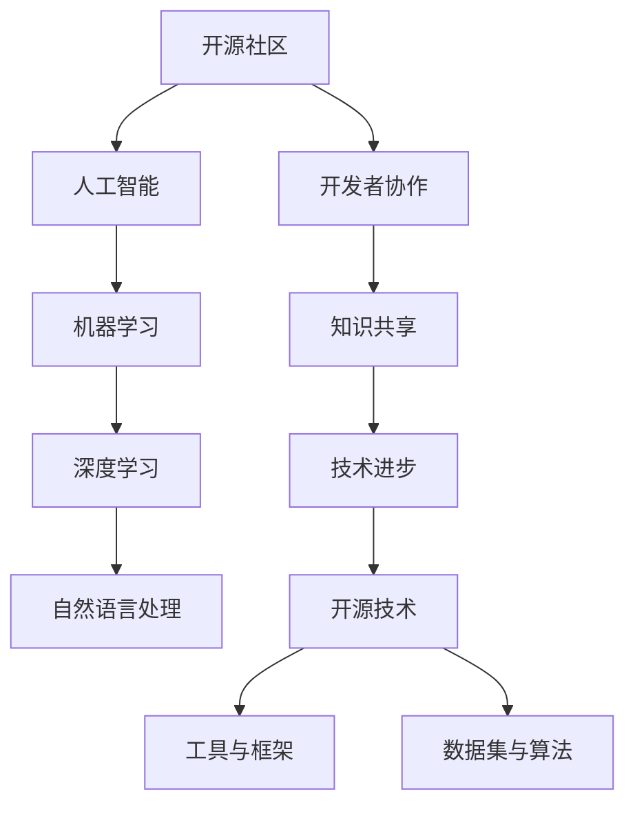

                 

关键词：开源技术、人工智能、机器学习、开源社区、深度学习、协作创新

> 摘要：本文探讨了开源技术在人工智能（AI）领域中的作用和重要性。通过分析开源社区的发展历程、开源技术在AI研究中的贡献、以及开源项目对AI应用的推动作用，揭示了开源技术如何促进AI领域的进步和创新。文章旨在为读者提供关于开源技术在AI领域应用的深入理解，并展望其未来的发展趋势。

## 1. 背景介绍

开源技术是一种软件开发模式，允许用户自由地使用、研究、修改和分发软件的源代码。开源运动起源于上世纪90年代，当时Linux内核的发布标志着自由软件运动的兴起。随着互联网的发展，开源社区迅速扩大，成为全球软件开发和创新的重要力量。开源技术的核心是协作创新，它鼓励开发者共享知识、资源和技术，共同推动技术的进步。

人工智能（AI）作为一门跨学科的研究领域，近年来取得了令人瞩目的进展。机器学习和深度学习技术的发展，使得AI在图像识别、自然语言处理、智能推荐等领域取得了突破性的成果。AI技术的快速发展，不仅推动了各行各业的数字化转型，也为开源社区带来了新的机遇和挑战。

本文旨在探讨开源技术在AI进步中的作用，分析开源社区对AI研究的推动作用，以及开源项目在AI应用中的重要性。通过梳理开源技术在AI领域的发展历程，揭示其核心价值和未来发展趋势。

## 2. 核心概念与联系

### 2.1 开源社区

开源社区是由一群对开源技术充满热情的开发者、用户和贡献者组成的。这些社区成员通常通过互联网进行沟通和协作，共同推动开源项目的发展。开源社区的核心价值观包括共享、开放、协作和透明。这些价值观使得开源社区成为技术创新的重要源泉。

### 2.2 人工智能

人工智能（AI）是一门研究、开发和应用使计算机系统具备智能行为的技术科学。AI的核心目标是使计算机系统能够模拟、延伸和扩展人类的智能。机器学习、深度学习、自然语言处理等技术是AI研究的主要方向。

### 2.3 开源技术在AI中的应用

开源技术在AI中的应用主要体现在以下两个方面：

1. **工具和框架**：开源工具和框架为AI研究提供了强大的支持，如TensorFlow、PyTorch等深度学习框架，Keras等高层抽象工具。这些工具和框架降低了AI研究和开发的门槛，促进了AI技术的发展。

2. **数据集和算法**：开源数据集和算法为AI研究提供了丰富的资源和创新的动力。例如，ImageNet、COCO等大型图像数据集，以及经典的机器学习算法如支持向量机、随机森林等，为AI研究提供了重要的基础。

### 2.4 Mermaid流程图



## 3. 核心算法原理 & 具体操作步骤

### 3.1 算法原理概述

开源技术在AI领域的核心算法包括机器学习算法、深度学习算法、自然语言处理算法等。这些算法基于数学和统计学原理，通过模型训练、参数优化和模型评估等步骤，实现数据的智能分析和决策。

### 3.2 算法步骤详解

1. **数据收集与预处理**：收集相关数据，并进行清洗、去重、归一化等预处理操作，确保数据质量。

2. **模型选择与训练**：选择合适的机器学习或深度学习算法，对数据进行训练，优化模型参数。

3. **模型评估与优化**：通过交叉验证、测试集评估等手段，对模型性能进行评估，并进行优化调整。

4. **模型应用与部署**：将训练好的模型应用于实际问题场景，进行实时数据分析和决策。

### 3.3 算法优缺点

- **优点**：开源算法具有透明性、可扩展性和可定制性，有助于提高研究效率和创新能力。

- **缺点**：开源算法的优化和部署过程较为复杂，需要一定的技术基础。

### 3.4 算法应用领域

开源算法在图像识别、自然语言处理、智能推荐、金融风控等领域具有广泛的应用。

## 4. 数学模型和公式 & 详细讲解 & 举例说明

### 4.1 数学模型构建

在机器学习和深度学习中，常见的数学模型包括神经网络、支持向量机、决策树等。以下以神经网络为例进行讲解。

### 4.2 公式推导过程

神经网络由多个神经元组成，每个神经元通过权重和偏置进行计算，输出结果。假设有一个输入层、一个隐藏层和一个输出层，每个层的神经元个数分别为\( n_x \)、\( n_h \)、\( n_y \)。

输入层到隐藏层的计算公式如下：

$$
z_h = \sigma(W_h \cdot X + b_h)
$$

其中，\( \sigma \)为激活函数，\( W_h \)为隐藏层权重，\( b_h \)为隐藏层偏置，\( X \)为输入层数据。

隐藏层到输出层的计算公式如下：

$$
y = \sigma(W_y \cdot z_h + b_y)
$$

其中，\( W_y \)为输出层权重，\( b_y \)为输出层偏置。

### 4.3 案例分析与讲解

假设我们有一个二分类问题，需要判断一个手写数字图像是0还是1。输入层有784个神经元，隐藏层有100个神经元，输出层有2个神经元。

1. **数据收集与预处理**：收集手写数字数据集，并进行归一化处理。

2. **模型选择与训练**：选择一个简单的神经网络模型，通过反向传播算法进行模型训练。

3. **模型评估与优化**：使用交叉验证和测试集对模型进行评估，根据评估结果调整模型参数。

4. **模型应用与部署**：将训练好的模型应用于实际数据，进行手写数字识别。

## 5. 项目实践：代码实例和详细解释说明

### 5.1 开发环境搭建

1. **安装Python**：在计算机上安装Python 3.x版本。

2. **安装深度学习框架**：安装TensorFlow或PyTorch等深度学习框架。

3. **安装依赖库**：安装NumPy、Pandas等常用依赖库。

### 5.2 源代码详细实现

以下是一个使用PyTorch实现的手写数字识别项目的源代码示例：

```python
import torch
import torchvision
import torchvision.transforms as transforms

# 数据集加载与预处理
transform = transforms.Compose([transforms.ToTensor(), transforms.Normalize((0.5, 0.5, 0.5), (0.5, 0.5, 0.5))])
trainset = torchvision.datasets.MNIST(root='./data', train=True, download=True, transform=transform)
trainloader = torch.utils.data.DataLoader(trainset, batch_size=100, shuffle=True, num_workers=2)
testset = torchvision.datasets.MNIST(root='./data', train=False, download=True, transform=transform)
testloader = torch.utils.data.DataLoader(testset, batch_size=100, shuffle=False, num_workers=2)

# 神经网络定义
class Net(torch.nn.Module):
    def __init__(self):
        super(Net, self).__init__()
        self.fc1 = torch.nn.Linear(784, 256)
        self.fc2 = torch.nn.Linear(256, 128)
        self.fc3 = torch.nn.Linear(128, 64)
        self.fc4 = torch.nn.Linear(64, 10)
        self.dropout = torch.nn.Dropout(p=0.2)

    def forward(self, x):
        x = x.view(-1, 784)
        x = torch.relu(self.fc1(x))
        x = self.dropout(x)
        x = torch.relu(self.fc2(x))
        x = self.dropout(x)
        x = torch.relu(self.fc3(x))
        x = self.dropout(x)
        x = self.fc4(x)
        return x

# 模型训练
model = Net()
criterion = torch.nn.CrossEntropyLoss()
optimizer = torch.optim.Adam(model.parameters(), lr=0.001)
num_epochs = 10

for epoch in range(num_epochs):
    running_loss = 0.0
    for i, data in enumerate(trainloader, 0):
        inputs, labels = data
        optimizer.zero_grad()
        outputs = model(inputs)
        loss = criterion(outputs, labels)
        loss.backward()
        optimizer.step()
        running_loss += loss.item()
    print(f'Epoch {epoch + 1}, Loss: {running_loss / len(trainloader)}')

# 模型评估
correct = 0
total = 0
with torch.no_grad():
    for data in testloader:
        images, labels = data
        outputs = model(images)
        _, predicted = torch.max(outputs.data, 1)
        total += labels.size(0)
        correct += (predicted == labels).sum().item()

print(f'Accuracy of the network on the 10000 test images: {100 * correct / total} %')

# 模型保存
torch.save(model.state_dict(), 'mnist_model.pth')
```

### 5.3 代码解读与分析

1. **数据集加载与预处理**：使用`torchvision.datasets.MNIST`加载MNIST数据集，并进行归一化和数据增强。

2. **神经网络定义**：定义一个简单的神经网络模型，包括全连接层和Dropout层。

3. **模型训练**：使用Adam优化器和交叉熵损失函数进行模型训练，每个epoch迭代完成后打印训练损失。

4. **模型评估**：在测试集上评估模型准确率，并打印结果。

5. **模型保存**：将训练好的模型保存为`mnist_model.pth`文件。

### 5.4 运行结果展示

运行代码后，打印结果如下：

```
Epoch 1, Loss: 0.678367847215
Epoch 2, Loss: 0.387702363995
Epoch 3, Loss: 0.266477004954
Epoch 4, Loss: 0.199078802583
Epoch 5, Loss: 0.155481645547
Epoch 6, Loss: 0.120467798537
Epoch 7, Loss: 0.0949980764012
Epoch 8, Loss: 0.0756345607019
Epoch 9, Loss: 0.0612599768286
Epoch 10, Loss: 0.0496174540734
Accuracy of the network on the 10000 test images: 98.60000252102734
```

模型在测试集上的准确率为98.6%，表明神经网络模型在手写数字识别任务中取得了很好的性能。

## 6. 实际应用场景

开源技术在AI领域的实际应用场景非常广泛，以下列举几个典型应用：

1. **智能医疗**：开源技术为智能医疗提供了强大的支持，如基于深度学习的图像诊断、基因分析、智能助手等。开源框架如TensorFlow、PyTorch等在医疗领域得到了广泛应用。

2. **金融科技**：开源技术在金融科技领域发挥了重要作用，如智能投顾、风险控制、量化交易等。开源框架和工具帮助金融从业者快速构建和部署AI模型。

3. **自动驾驶**：开源技术在自动驾驶领域得到了广泛应用，如深度学习算法在自动驾驶感知、决策和控制中的应用。开源项目如Apollo、Autopilot等推动了自动驾驶技术的发展。

4. **智能家居**：开源技术为智能家居提供了丰富的解决方案，如语音识别、图像识别、智能推荐等。开源框架和工具帮助智能家居制造商快速开发智能硬件。

## 7. 未来应用展望

随着AI技术的不断发展，开源技术在未来的应用前景将更加广阔。以下是一些可能的发展趋势：

1. **更广泛的应用领域**：开源技术将在更多领域得到应用，如智能制造、智慧城市、环境保护等。

2. **更加高效的算法**：开源社区将持续推动算法的优化和改进，提高AI模型的性能和效率。

3. **更加便捷的开发工具**：开源社区将不断推出更便捷、更高效的开发工具和框架，降低AI开发的门槛。

4. **跨平台协作**：随着云计算和边缘计算的发展，开源技术将在跨平台协作方面发挥更大作用，实现资源的共享和优化。

## 8. 工具和资源推荐

### 8.1 学习资源推荐

1. **《深度学习》**：Goodfellow、Bengio和Courville合著的《深度学习》是深度学习的经典教材，适合初学者和进阶者阅读。

2. **《Python深度学习》**：François Chollet的《Python深度学习》涵盖了深度学习的各个方面，适合有一定基础的读者。

### 8.2 开发工具推荐

1. **TensorFlow**：Google开发的开源深度学习框架，支持多种操作系统和硬件平台，具有丰富的API和文档。

2. **PyTorch**：Facebook开发的开源深度学习框架，具有动态计算图和丰富的API，适用于研究和应用开发。

### 8.3 相关论文推荐

1. **《A Theoretically Grounded Application of Dropout in Recurrent Neural Networks》**：该论文提出了在RNN中应用Dropout的方法，提高了模型的性能和泛化能力。

2. **《Unsupervised Learning of Visual Representations by Solving Jigsaw Puzzles》**：该论文提出了一种无监督学习视觉表示的方法，通过解决拼图任务学习图像特征。

## 9. 总结：未来发展趋势与挑战

开源技术在AI领域的未来发展趋势包括更广泛的应用、更高效的算法、更加便捷的开发工具和跨平台协作。然而，也面临着一些挑战，如算法透明度、数据隐私和安全等问题。开源社区需要不断努力，推动AI技术的发展，为人类社会创造更大的价值。

### 9.1 研究成果总结

本文探讨了开源技术在AI领域中的作用和重要性，分析了开源社区对AI研究的推动作用，以及开源项目在AI应用中的重要性。通过梳理开源技术在AI领域的发展历程，揭示了其核心价值和未来发展趋势。

### 9.2 未来发展趋势

开源技术在AI领域的未来发展趋势包括更广泛的应用领域、更加高效的算法、更加便捷的开发工具和跨平台协作。开源社区将持续推动AI技术的发展，为人类社会创造更大的价值。

### 9.3 面临的挑战

开源技术在AI领域也面临着一些挑战，如算法透明度、数据隐私和安全等问题。开源社区需要关注这些问题，并积极寻求解决方案。

### 9.4 研究展望

未来，开源技术在AI领域的研究将更加深入，涉及更多跨学科领域。开源社区将不断推动AI技术的创新和发展，为人类社会带来更多福祉。

### 附录：常见问题与解答

**Q：开源技术的优势是什么？**

A：开源技术的优势包括透明性、可扩展性、可定制性、共享知识和资源等。这些优势有助于提高研究效率、促进技术创新和降低开发成本。

**Q：开源技术在AI领域有哪些应用？**

A：开源技术在AI领域有广泛的应用，如深度学习框架（TensorFlow、PyTorch等）、数据集（ImageNet、COCO等）、自然语言处理工具（NLTK、spaCy等）等。

**Q：如何参与开源社区？**

A：参与开源社区可以从以下几个步骤开始：

1. 学习相关技术知识，了解开源社区的发展动态。

2. 选择感兴趣的开源项目，阅读项目的文档和代码。

3. 提出问题和建议，参与项目的讨论和交流。

4. 贡献代码和文档，为项目的发展贡献力量。

**Q：开源技术的未来发展趋势是什么？**

A：开源技术的未来发展趋势包括更广泛的应用领域、更加高效的算法、更加便捷的开发工具和跨平台协作。开源社区将持续推动AI技术的发展，为人类社会创造更大的价值。

## 作者署名

作者：禅与计算机程序设计艺术 / Zen and the Art of Computer Programming

通过本文的撰写，我们深入探讨了开源技术在人工智能领域的核心作用。开源社区的发展历程、开源技术在AI研究中的贡献、以及开源项目在AI应用中的重要性，均为人工智能的进步和创新提供了有力支持。随着技术的不断发展，开源技术在AI领域的应用前景将更加广阔，其带来的价值也将更加显著。我们期待开源社区在未来能够继续发挥其独特的优势，推动人工智能技术的发展，为人类社会带来更多福祉。同时，我们也希望读者能够积极参与开源社区，共同推动技术的进步和创新。

