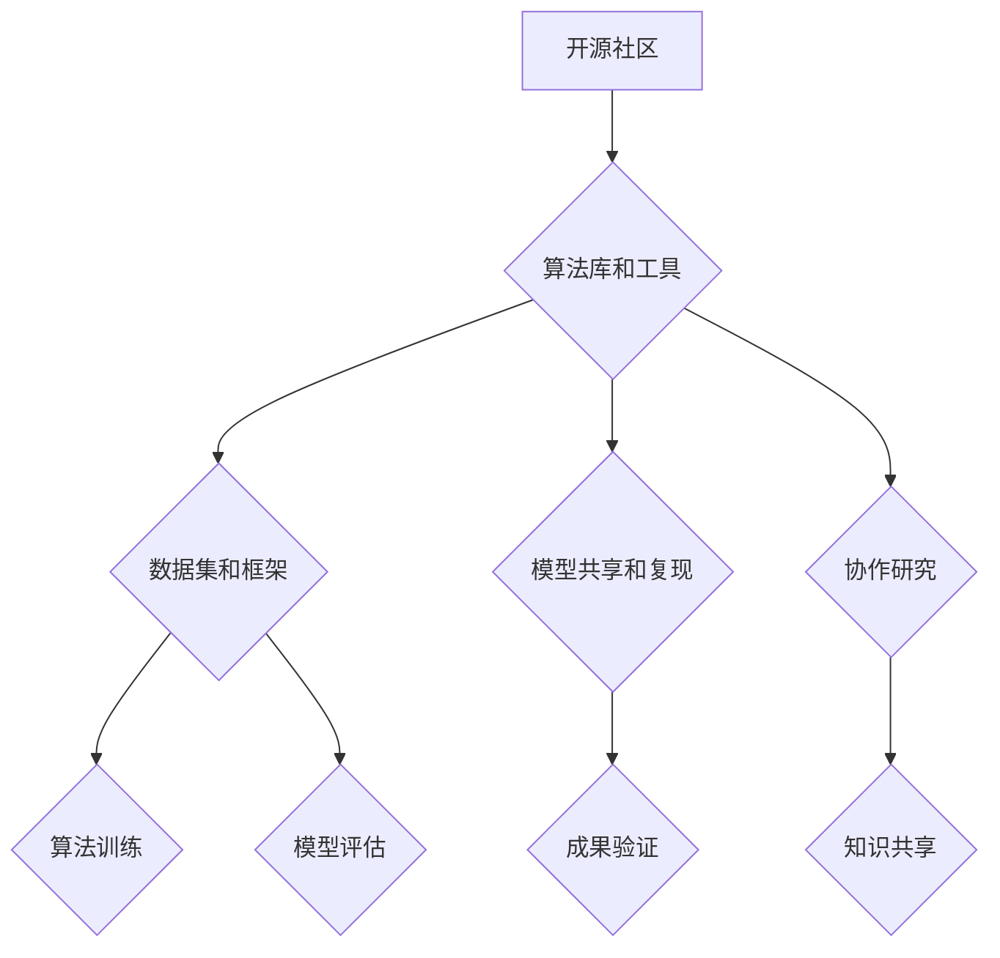

                 

关键词：开源技术、人工智能、AI进步、技术共享、合作创新

> 摘要：本文将探讨开源技术在推动人工智能（AI）领域进步中的作用。通过分析开源社区的发展、开源技术在AI研究中的广泛应用以及开源项目对于技术人才的培养，本文旨在揭示开源技术如何加速AI技术的创新和普及，为未来的AI发展提供新的视角和启示。

## 1. 背景介绍

开源技术（Open Source）指的是在一定的许可条件下，允许用户自由使用、学习、修改和分发软件的源代码。这种模式最早在1980年代由自由软件运动倡导，并在1990年代随着互联网的发展而迅速扩展。开源技术的核心在于共享和合作，它促进了全球范围内技术人才的交流和创新。

人工智能（AI）是一门涉及计算机科学、数学、神经科学等多个学科领域的交叉学科，旨在通过机器学习、深度学习等方法让计算机具备类似人类智能的能力。随着数据量的增长和计算能力的提升，AI技术在过去几十年中取得了飞速发展，并逐渐应用于各种领域，如医疗、金融、交通、娱乐等。

开源技术与AI技术相结合，不仅能够加速AI研究的进展，还能够促进AI技术的普及和应用。本文将详细探讨这一结合如何实现，以及它对AI领域带来的深远影响。

## 2. 核心概念与联系

### 2.1 开源社区的发展

开源社区是指一群共同致力于开源软件开发、维护和推广的志愿者组成的网络社区。这些社区通常具有以下几个特点：

1. **开放性**：开源社区鼓励任何有兴趣的人参与，无论是贡献代码、编写文档，还是提供反馈和改进建议。
2. **合作性**：社区成员通过合作和交流，共同推动项目的进展。
3. **共享性**：开源社区强调知识共享和知识积累，通过开放源代码和文档，使更多人能够学习和使用技术。
4. **透明性**：开源项目的开发过程通常是公开的，任何人都能够查看和监督代码的质量和进度。

开源社区的发展得益于互联网的普及和技术进步。互联网为开源社区提供了一个高效的沟通平台，使得全球的开发者可以轻松地交流想法、分享资源和协作开发。同时，云计算和大数据技术的出现，为开源项目提供了强大的计算支持和数据资源。

### 2.2 开源技术在AI研究中的应用

开源技术在AI研究中的应用主要体现在以下几个方面：

1. **算法库和工具**：许多AI算法的开源实现，如TensorFlow、PyTorch等，为研究人员提供了便捷的实验平台。这些工具不仅降低了AI研究的门槛，还促进了算法的创新和优化。

2. **数据集和框架**：开源社区提供了大量的数据集和框架，如ImageNet、COCO等，这些资源对于AI算法的训练和评估至关重要。同时，开源框架如Keras、Scikit-learn等，为研究人员提供了丰富的API和函数库，使得AI模型的开发更加高效。

3. **模型共享和复现**：开源技术使得AI模型的共享和复现变得容易，研究人员可以基于已有的模型进行改进和优化，从而加速AI研究的进展。

4. **协作研究**：开源社区鼓励协作研究，通过共享代码和数据，研究人员可以快速验证和交流研究成果，提高研究的效率和准确性。

### 2.3 Mermaid流程图

以下是一个简单的Mermaid流程图，展示了开源社区在AI研究中的一些关键环节：



## 3. 核心算法原理 & 具体操作步骤

### 3.1 算法原理概述

开源技术在AI研究中的一个核心贡献是提供了丰富的算法库和工具，这些工具涵盖了从基础算法到高级模型的各个方面。以下是一些典型的开源算法和工具：

1. **机器学习算法库**：如Scikit-learn、MLPack，提供了各种经典的机器学习算法，包括分类、回归、聚类等。
2. **深度学习框架**：如TensorFlow、PyTorch，这些框架提供了高效的计算引擎和丰富的API，支持深度神经网络的训练和推理。
3. **强化学习库**：如OpenAI Gym、Rllib，这些库提供了丰富的环境和算法，支持强化学习的研究和应用。

### 3.2 算法步骤详解

以TensorFlow为例，介绍深度学习模型开发的基本步骤：

1. **环境搭建**：安装TensorFlow和相关依赖库，配置计算资源。
2. **数据准备**：加载和处理数据集，进行数据清洗和预处理。
3. **模型定义**：定义深度学习模型，包括输入层、隐藏层和输出层。
4. **模型训练**：使用训练数据训练模型，通过反向传播和优化算法调整模型参数。
5. **模型评估**：使用测试数据评估模型性能，调整模型结构和参数。
6. **模型部署**：将训练好的模型部署到生产环境，进行实际应用。

### 3.3 算法优缺点

开源算法和工具的优点包括：

- **灵活性**：开源技术提供了丰富的选择，用户可以根据需求和场景自由选择和组合。
- **易用性**：开源工具通常具有良好的文档和社区支持，降低了学习和使用的门槛。
- **社区协作**：开源社区促进了知识的共享和技术的创新，有助于快速解决问题和改进算法。

然而，开源技术也存在一些缺点：

- **安全风险**：开源代码可能包含安全漏洞，需要用户自行评估和修复。
- **质量不一**：开源社区中存在质量参差不齐的代码和工具，用户需要自行筛选和验证。
- **依赖复杂**：开源项目可能依赖其他库和工具，增加了系统的复杂性和维护难度。

### 3.4 算法应用领域

开源技术在AI领域的应用非常广泛，包括但不限于：

- **图像识别和分类**：如人脸识别、物体检测等。
- **自然语言处理**：如文本分类、机器翻译、情感分析等。
- **语音识别和合成**：如语音识别、语音合成、语音控制等。
- **推荐系统**：如基于协同过滤和深度学习的推荐算法。
- **自动驾驶**：如用于目标检测、环境感知和路径规划的算法。

## 4. 数学模型和公式 & 详细讲解 & 举例说明

### 4.1 数学模型构建

在AI研究中，数学模型是核心，以下是一些常见的数学模型和公式：

- **线性回归模型**：$y = \beta_0 + \beta_1x_1 + ... + \beta_nx_n$
- **逻辑回归模型**：$P(y=1) = \frac{1}{1 + e^{-(\beta_0 + \beta_1x_1 + ... + \beta_nx_n)} }$
- **神经网络模型**：$a_{ij}^{(l)} = \sigma \left( \sum_{k} w_{ik}^{(l)} a_{kj}^{(l-1)} + b_{j}^{(l)} \right)$

### 4.2 公式推导过程

以线性回归模型为例，推导过程如下：

- **假设**：线性回归模型的形式为 $y = \beta_0 + \beta_1x_1 + ... + \beta_nx_n$
- **损失函数**：通常使用均方误差（MSE）作为损失函数，即 $J(\theta) = \frac{1}{2m} \sum_{i=1}^{m} (h_\theta (x^{(i)} ) - y^{(i)})^2$
- **梯度下降**：为了最小化损失函数，采用梯度下降算法更新模型参数，即 $\theta_j := \theta_j - \alpha \frac{\partial J(\theta)}{\partial \theta_j}$
- **推导过程**：通过对损失函数求偏导，可以得到梯度下降的具体更新公式

### 4.3 案例分析与讲解

以自然语言处理中的文本分类任务为例，介绍如何使用深度学习模型实现文本分类：

1. **数据准备**：收集和清洗文本数据，将文本转化为向量表示。
2. **模型构建**：使用循环神经网络（RNN）或长短期记忆网络（LSTM）构建文本分类模型。
3. **模型训练**：使用训练数据训练模型，通过反向传播更新模型参数。
4. **模型评估**：使用测试数据评估模型性能，调整模型结构和参数。
5. **模型部署**：将训练好的模型部署到生产环境，进行文本分类任务。

通过以上步骤，可以实现高效的文本分类任务，提高分类准确率。

## 5. 项目实践：代码实例和详细解释说明

### 5.1 开发环境搭建

以Python为例，介绍如何在本地搭建深度学习开发环境：

1. **安装Python**：下载并安装Python 3.7及以上版本。
2. **安装TensorFlow**：通过pip命令安装TensorFlow，例如 `pip install tensorflow`。
3. **安装其他依赖库**：如NumPy、Pandas等，通过pip命令安装。

### 5.2 源代码详细实现

以下是一个简单的深度学习模型实现示例：

```python
import tensorflow as tf
from tensorflow.keras.layers import Dense, Flatten
from tensorflow.keras.models import Sequential

# 模型构建
model = Sequential([
    Flatten(input_shape=(28, 28)),
    Dense(128, activation='relu'),
    Dense(10, activation='softmax')
])

# 模型编译
model.compile(optimizer='adam',
              loss='categorical_crossentropy',
              metrics=['accuracy'])

# 模型训练
model.fit(x_train, y_train, epochs=10, batch_size=32, validation_data=(x_test, y_test))

# 模型评估
model.evaluate(x_test, y_test)
```

### 5.3 代码解读与分析

- **模型构建**：使用Sequential模型堆叠层，包括Flatten层将图像展开为一维向量，Dense层实现全连接神经网络。
- **模型编译**：指定优化器、损失函数和评估指标，为模型训练做好准备。
- **模型训练**：使用fit函数训练模型，通过反向传播更新参数。
- **模型评估**：使用evaluate函数评估模型在测试数据上的性能。

### 5.4 运行结果展示

运行上述代码后，可以得到模型在测试数据上的准确率和损失值，从而评估模型性能。通过调整模型结构和训练参数，可以进一步提高模型性能。

## 6. 实际应用场景

### 6.1 开源技术在医疗领域的应用

开源技术在医疗领域具有广泛的应用，包括疾病预测、诊断辅助、个性化治疗等方面。以下是一些具体的案例：

- **疾病预测**：开源项目如PredictMD提供了多种疾病预测模型，如心血管疾病、糖尿病等。这些模型基于开源数据和算法，帮助医疗机构进行早期疾病预测和干预。
- **诊断辅助**：开源图像识别工具如TensorFlow和PyTorch在医学图像处理领域得到广泛应用。例如，使用深度学习模型对医学图像进行病变检测和诊断，辅助医生做出准确的诊断。
- **个性化治疗**：开源项目如OpenMRS和OpenELIS提供了医疗信息系统，支持患者数据的收集和管理，实现个性化治疗和疾病监测。

### 6.2 开源技术在金融领域的应用

开源技术在金融领域同样具有重要应用价值，包括风险管理、算法交易、智能投顾等方面。以下是一些具体案例：

- **风险管理**：开源项目如Open Risk提供了风险管理工具和模型，支持金融机构进行风险评估和管理。例如，使用开源模型对信贷风险进行预测，降低贷款违约率。
- **算法交易**：开源交易系统如OpenJacket和MetaTrader 5提供了算法交易工具，支持投资者进行高频交易和量化投资。这些系统集成了开源算法和数据分析工具，提高了交易的效率和准确性。
- **智能投顾**：开源项目如OpenInvest和OpenAI提供了智能投顾平台，使用机器学习算法为投资者提供个性化的投资建议。这些平台基于开源技术和大数据分析，实现了高效的资产配置和风险控制。

### 6.3 开源技术在自动驾驶领域的应用

开源技术在自动驾驶领域具有巨大的潜力，包括环境感知、路径规划、控制算法等方面。以下是一些具体案例：

- **环境感知**：开源项目如OpenCV和NDT（Narrowband Depth Truncation）提供了丰富的图像处理和三维重建工具，支持自动驾驶车辆对环境进行感知和建模。
- **路径规划**：开源项目如A*算法和RRT（Rapidly-exploring Random Trees）提供了高效的路径规划算法，支持自动驾驶车辆在复杂环境中进行自主导航。
- **控制算法**：开源项目如ROS（Robot Operating System）和CARLA（Common Roadscapes for Autonomous Driving）提供了控制算法和仿真平台，支持自动驾驶车辆的实时控制和测试。

## 7. 未来应用展望

### 7.1 开源技术趋势

随着人工智能技术的不断发展和开源社区的不断壮大，开源技术在AI领域的应用将呈现以下趋势：

- **模型即服务**：未来，越来越多的AI模型将采用“模型即服务”（MLOps）的方式提供，用户可以通过API直接调用这些模型，无需自行搭建和维护环境。
- **跨领域融合**：开源技术将促进不同领域之间的融合，如将医疗、金融、交通等领域的AI技术进行整合，实现跨领域的创新和应用。
- **数据安全与隐私保护**：开源技术将在数据安全和隐私保护方面发挥重要作用，通过区块链、联邦学习等技术实现数据的安全共享和隐私保护。

### 7.2 面临的挑战

尽管开源技术为AI发展带来了巨大机遇，但同时也面临一些挑战：

- **安全风险**：开源项目可能包含安全漏洞，需要用户进行严格的审查和测试。
- **质量控制**：开源社区中存在大量质量参差不齐的项目，用户需要自行筛选和评估。
- **知识产权**：开源技术可能涉及知识产权问题，需要在开源和商业应用之间找到平衡。

### 7.3 研究展望

为了应对上述挑战，未来的研究可以从以下几个方面展开：

- **自动化安全审查**：开发自动化工具，对开源项目进行安全审查和漏洞扫描，提高代码质量。
- **质量控制机制**：建立开源项目的质量评估和认证机制，确保项目的可靠性和安全性。
- **知识产权保护**：探索开源技术下的知识产权保护模式，促进开源和商业的协同发展。

## 8. 总结：未来发展趋势与挑战

开源技术在推动AI进步中发挥了重要作用，它不仅降低了AI研究的门槛，促进了技术的创新和普及，还为不同领域的应用提供了丰富的资源和工具。在未来，开源技术将继续在AI领域中发挥关键作用，推动AI技术的不断进步和应用。

然而，开源技术也面临一系列挑战，如安全风险、质量控制、知识产权等问题。为了应对这些挑战，我们需要加强开源项目的自动化安全审查、建立质量控制机制，同时探索知识产权保护模式，促进开源和商业的协同发展。

总之，开源技术是推动AI进步的重要力量，它不仅为研究人员提供了丰富的资源和工具，还促进了全球范围内的技术交流和合作。在未来，开源技术将继续为AI领域带来新的机遇和挑战，推动AI技术的不断创新和应用。

## 9. 附录：常见问题与解答

### 9.1 开源技术的优势和劣势分别是什么？

**优势**：
- **降低门槛**：开源技术降低了学习和使用高级技术的门槛，使得更多人能够参与AI研究。
- **合作创新**：开源社区促进了全球范围内的合作和知识共享，提高了研发效率。
- **灵活性**：用户可以根据需求和场景自由选择和组合开源工具和算法。

**劣势**：
- **安全风险**：开源代码可能包含安全漏洞，需要用户自行评估和修复。
- **质量不一**：开源社区中存在质量参差不齐的代码和工具，用户需要自行筛选和验证。
- **依赖复杂**：开源项目可能依赖其他库和工具，增加了系统的复杂性和维护难度。

### 9.2 如何选择合适的开源项目？

**建议**：
- **查看项目活跃度**：查看项目的GitHub或GitLab页面，关注项目的更新频率和用户反馈。
- **阅读文档和说明**：详细阅读项目的文档和说明，了解项目的功能和特性。
- **参考社区评价**：参考社区的评价和讨论，了解项目的可靠性和实用性。
- **小范围试用**：在实际项目中试用开源项目，评估其性能和适用性。

### 9.3 开源技术如何在企业和商业环境中应用？

**建议**：
- **定制化开发**：在开源项目的基础上进行定制化开发，满足企业的特定需求。
- **商业友好许可**：选择商业友好许可的开源项目，确保在商业应用中的合法合规。
- **风险管理**：对开源项目进行安全审查和风险评估，降低潜在的风险。
- **社区合作**：积极参与开源社区，与其他企业合作，共同推动开源项目的发展。

### 9.4 开源技术在医疗领域的具体应用案例有哪些？

**案例**：
- **疾病预测**：使用开源项目如PredictMD进行心血管疾病和糖尿病的预测。
- **诊断辅助**：使用开源工具如OpenCV和PyTorch对医学图像进行病变检测和诊断。
- **个性化治疗**：使用开源平台如OpenMRS和OpenELIS进行患者数据的收集和管理，实现个性化治疗。

### 9.5 开源技术在自动驾驶领域的挑战是什么？

**挑战**：
- **环境复杂性**：自动驾驶需要处理复杂和多变的交通环境，这给算法的鲁棒性提出了挑战。
- **数据隐私**：自动驾驶系统需要处理大量的敏感数据，如车辆位置和行驶轨迹，确保数据隐私和安全。
- **法规遵从**：自动驾驶系统需要符合各国和地区的法律法规，确保合法合规运行。

### 9.6 开源技术在金融领域的潜在风险有哪些？

**风险**：
- **技术漏洞**：开源技术可能包含安全漏洞，导致数据泄露或系统崩溃。
- **知识产权**：开源技术可能涉及知识产权问题，导致法律纠纷或版权侵权。
- **合规性**：开源技术可能不符合金融行业的合规要求，导致监管问题。

### 9.7 开源技术在教育和人才培养中的作用是什么？

**作用**：
- **教育资源**：开源技术为教育工作者和学生提供了丰富的学习资源，降低了学习成本。
- **实践机会**：开源项目为学生提供了实践机会，有助于将理论知识应用于实际项目中。
- **技术传承**：开源社区促进了技术的传承和创新，为下一代技术人才提供了平台。

### 9.8 开源技术如何推动人工智能的可持续发展？

**推动方式**：
- **降低研发成本**：开源技术降低了AI研究的门槛和成本，使得更多的机构和个人能够参与AI研究。
- **促进知识共享**：开源社区促进了全球范围内的知识共享和合作，加速了AI技术的发展和应用。
- **提高透明度**：开源技术提高了AI算法的透明度，有助于监管和伦理审查，推动AI的可持续发展。

### 9.9 开源技术在国际合作中的重要性是什么？

**重要性**：
- **知识共享**：开源技术促进了不同国家和地区之间的知识共享和交流，提高了全球技术发展水平。
- **技术创新**：国际合作的开源项目汇集了全球的智慧和资源，推动了AI技术的创新和应用。
- **经济合作**：开源技术促进了跨国企业和研究机构的合作，推动了全球经济的可持续发展。

### 9.10 开源技术如何促进可持续发展的社会和经济发展？

**促进方式**：
- **教育普及**：开源技术为教育普及提供了支持，提高了全民的科技素养，促进了社会的可持续发展。
- **科技创新**：开源技术促进了科技创新和应用，推动了社会经济的发展。
- **降低成本**：开源技术降低了技术研发和应用的门槛，使得更多的机构和个人能够参与到创新和应用中来，促进了经济的包容性增长。

## 作者署名

作者：禅与计算机程序设计艺术 / Zen and the Art of Computer Programming
----------------------------------------------------------------

至此，文章的撰写工作已经完成。本文通过深入探讨开源技术在推动人工智能（AI）进步中的作用，从背景介绍、核心概念、算法原理、数学模型、项目实践、实际应用场景、未来展望以及常见问题与解答等方面进行了全面阐述。希望本文能为读者提供对开源技术在AI领域作用的深入理解，并对未来的AI发展产生启示。

