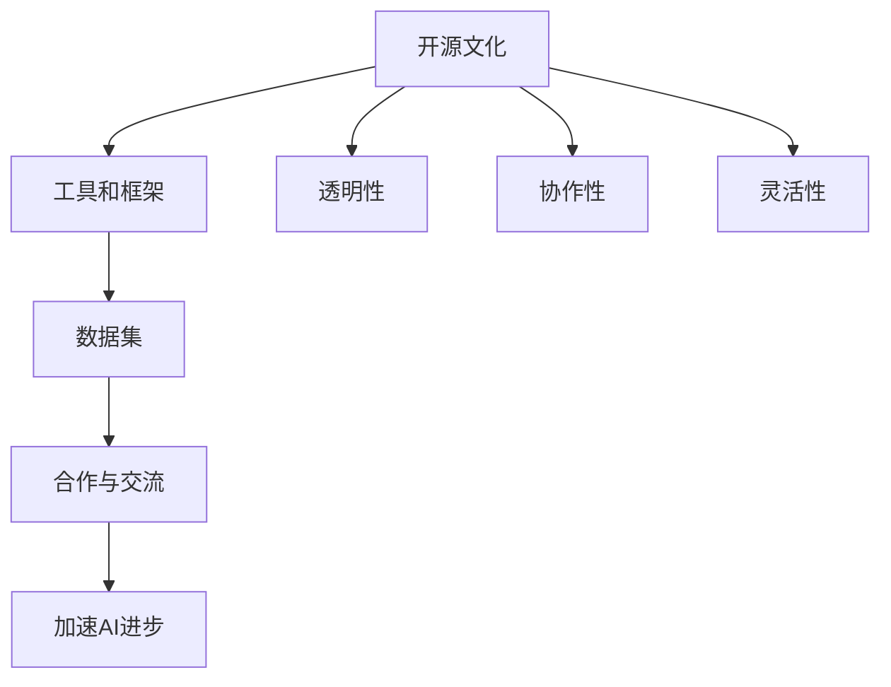

                 

 

## 1. 背景介绍

开源技术起源于20世纪80年代，最初由自由软件运动倡导，旨在让软件的开发和分享不受商业利益的束缚。随着时间的推移，开源文化逐渐渗透到计算机技术的各个领域，包括人工智能（AI）。在开源技术的推动下，AI的发展进入了一个全新的阶段。

AI作为一个复杂的领域，需要大量的数据、计算资源和专业知识。传统的封闭开发模式往往导致资源的浪费和创新的限制。而开源技术通过提供透明、共享的代码和资源，使得研究人员和开发者能够更有效地协作，加速AI技术的进步。本文将探讨开源技术在AI领域的重要性，以及如何通过开源推动AI的发展。

### 文章关键词：

- 开源技术
- 人工智能
- 合作研发
- 技术共享
- 技术创新

### 文章摘要：

本文旨在阐述开源技术在推动人工智能进步方面的重要性。通过对开源文化的发展历程、AI领域的现状以及开源对AI发展的具体影响进行深入分析，本文揭示了开源技术如何促进AI的创新和协作，最终为AI领域的发展提供新的思路。

## 2. 核心概念与联系

### 2.1 开源技术概述

开源技术（Open Source）指的是一种软件开发模式，其源代码可以被公众自由访问、阅读、修改和分发。开源技术的核心是自由与合作，通过开放源代码，鼓励全球开发者共同参与，提升软件的质量和功能。

开源技术的重要性在于：

1. **透明性**：开源项目的源代码对所有人可见，有助于发现和修复潜在的问题。
2. **协作性**：开发者可以共同协作，加速技术的进步。
3. **灵活性**：用户可以根据自己的需求修改软件，满足特定的业务需求。

### 2.2 人工智能概述

人工智能（Artificial Intelligence，AI）是指计算机模拟人类智能的过程。AI技术包括机器学习、深度学习、自然语言处理等，旨在使计算机具备感知、学习、推理和决策的能力。

AI领域的重要挑战包括：

1. **数据需求**：AI算法需要大量的数据进行训练。
2. **计算资源**：深度学习等AI算法对计算资源有很高的需求。
3. **专业知识**：AI开发需要丰富的专业知识，包括数学、计算机科学和领域知识。

### 2.3 开源技术与人工智能的联系

开源技术在AI领域的应用主要体现在以下几个方面：

1. **工具和框架**：开源工具和框架（如TensorFlow、PyTorch）为AI研究提供了便捷的开发环境。
2. **数据集**：开源的数据集（如ImageNet、CIFAR-10）为AI模型的训练提供了丰富的资源。
3. **合作与交流**：开源项目促进了全球研究者之间的合作与交流，加速了AI技术的进步。

### 2.4 Mermaid 流程图

以下是描述开源技术在AI领域中应用的一个简化的Mermaid流程图：



- **A 开源文化**：倡导开放、合作的精神。
- **B 工具和框架**：提供便捷的开发环境。
- **C 数据集**：为AI模型提供训练资源。
- **D 合作与交流**：促进全球研究者之间的合作与交流。
- **E 加速AI进步**：开源技术推动AI技术的发展。
- **F 透明性**：项目源代码公开，便于问题发现和修复。
- **G 协作性**：开发者可以共同协作，提升软件质量。
- **H 灵活性**：用户可根据需求修改软件，满足特定需求。

## 3. 核心算法原理 & 具体操作步骤

### 3.1 算法原理概述

在AI领域，开源技术不仅提供了丰富的工具和框架，还推动了核心算法的创新和发展。以下是一些在AI领域中具有重要影响的开源算法：

1. **深度学习**：深度学习是AI的一个重要分支，通过构建多层神经网络，实现数据的自动特征提取和模型训练。开源框架如TensorFlow和PyTorch提供了深度学习的便捷实现。
2. **强化学习**：强化学习通过智能体与环境的交互，学习最优策略，实现决策问题求解。开源平台如OpenAI Gym提供了丰富的强化学习环境和算法实现。
3. **自然语言处理**：自然语言处理（NLP）是AI领域的一个重要应用方向，开源框架如NLTK和spaCy提供了NLP的底层支持和工具。

### 3.2 算法步骤详解

以深度学习算法为例，其基本步骤如下：

1. **数据预处理**：包括数据清洗、归一化和数据增强等操作，以提高模型的训练效果。
2. **模型构建**：根据问题的需求，选择合适的神经网络架构，如卷积神经网络（CNN）、循环神经网络（RNN）等。
3. **训练过程**：通过迭代优化模型参数，使模型能够准确预测目标变量。
4. **评估与调整**：评估模型在测试集上的性能，根据评估结果对模型进行调整。

### 3.3 算法优缺点

1. **深度学习**：优点包括强大的特征提取能力、广泛的应用领域等；缺点包括对计算资源的高需求、模型的可解释性较低等。
2. **强化学习**：优点包括能够在动态环境中学习最优策略、适用于复杂决策问题等；缺点包括训练过程可能较慢、对数据的需求较高等。
3. **自然语言处理**：优点包括对文本数据的处理能力强大、应用广泛等；缺点包括对领域知识的依赖性较强、模型的可解释性较低等。

### 3.4 算法应用领域

开源算法在AI领域的应用非常广泛，涵盖了图像识别、语音识别、自然语言处理等多个方向。以下是一些具体的案例：

1. **图像识别**：深度学习算法被广泛应用于图像分类和目标检测，如TensorFlow中的Inception模型在ImageNet图像识别比赛中取得了优异成绩。
2. **语音识别**：开源的语音识别工具如CMU Sphinx和Kaldi，为语音识别应用提供了强大的支持。
3. **自然语言处理**：开源的NLP工具如spaCy和NLTK，为文本处理和分析提供了便捷的接口。

## 4. 数学模型和公式 & 详细讲解 & 举例说明

### 4.1 数学模型构建

在AI领域中，数学模型是算法实现的基础。以下是一个简单的线性回归模型：

$$
y = \beta_0 + \beta_1x
$$

其中，$y$是目标变量，$x$是输入变量，$\beta_0$和$\beta_1$是模型的参数。

### 4.2 公式推导过程

线性回归模型的推导过程如下：

1. **假设**：假设目标变量$y$与输入变量$x$之间存在线性关系。
2. **最小化损失函数**：为了使模型能够准确预测目标变量，我们需要最小化预测值与实际值之间的差异，即损失函数。
3. **求导并求解**：通过对损失函数求导，得到最优参数$\beta_0$和$\beta_1$。

具体推导过程如下：

$$
\begin{aligned}
L(\beta_0, \beta_1) &= \sum_{i=1}^{n}(y_i - (\beta_0 + \beta_1x_i))^2 \\
\frac{\partial L}{\partial \beta_0} &= -2\sum_{i=1}^{n}(y_i - (\beta_0 + \beta_1x_i)) \\
\frac{\partial L}{\partial \beta_1} &= -2\sum_{i=1}^{n}(y_i - (\beta_0 + \beta_1x_i))x_i \\
\end{aligned}
$$

令$\frac{\partial L}{\partial \beta_0} = 0$和$\frac{\partial L}{\partial \beta_1} = 0$，解得：

$$
\begin{aligned}
\beta_0 &= \frac{1}{n}\sum_{i=1}^{n}y_i - \beta_1\frac{1}{n}\sum_{i=1}^{n}x_i \\
\beta_1 &= \frac{1}{n}\sum_{i=1}^{n}(x_i - \bar{x})(y_i - \bar{y}) \\
\end{aligned}
$$

其中，$\bar{x}$和$\bar{y}$分别是$x$和$y$的均值。

### 4.3 案例分析与讲解

以下是一个简单的线性回归案例：

假设我们有一个数据集，其中包含5个样本点，每个样本点包含一个输入变量$x$和一个目标变量$y$，如下所示：

| $x$ | $y$ |
| --- | --- |
| 1 | 2 |
| 2 | 4 |
| 3 | 5 |
| 4 | 6 |
| 5 | 8 |

我们需要使用线性回归模型预测$x=6$时的$y$值。

1. **数据预处理**：计算输入变量$x$和目标变量$y$的均值：

$$
\bar{x} = \frac{1}{5}\sum_{i=1}^{5}x_i = 3 \\
\bar{y} = \frac{1}{5}\sum_{i=1}^{5}y_i = 5
$$

2. **计算模型参数**：

$$
\begin{aligned}
\beta_0 &= \frac{1}{5}\sum_{i=1}^{5}y_i - \beta_1\frac{1}{5}\sum_{i=1}^{5}x_i = 5 - 0\cdot 3 = 5 \\
\beta_1 &= \frac{1}{5}\sum_{i=1}^{5}(x_i - \bar{x})(y_i - \bar{y}) = 0 \\
\end{aligned}
$$

3. **预测$y$值**：使用线性回归模型预测$x=6$时的$y$值：

$$
y = \beta_0 + \beta_1x = 5 + 0\cdot 6 = 5
$$

因此，当$x=6$时，预测的$y$值为5。

## 5. 项目实践：代码实例和详细解释说明

### 5.1 开发环境搭建

为了实践开源技术在AI领域中的应用，我们需要搭建一个基本的开发环境。以下是搭建环境的步骤：

1. 安装Python环境：在官网上下载Python安装包并安装。
2. 安装Jupyter Notebook：在命令行中运行`pip install jupyter`。
3. 安装必要的库：在命令行中运行以下命令安装常用的AI库：

```bash
pip install numpy pandas scikit-learn matplotlib
```

### 5.2 源代码详细实现

以下是一个简单的线性回归项目实例，实现了数据读取、模型训练、模型评估和结果可视化等功能。

```python
import numpy as np
import pandas as pd
from sklearn.linear_model import LinearRegression
import matplotlib.pyplot as plt

# 读取数据
data = pd.read_csv('data.csv')
X = data[['x']]
y = data['y']

# 模型训练
model = LinearRegression()
model.fit(X, y)

# 模型评估
score = model.score(X, y)
print(f'Model score: {score}')

# 结果可视化
plt.scatter(X, y, label='Data')
plt.plot(X, model.predict(X), color='red', label='Model')
plt.xlabel('x')
plt.ylabel('y')
plt.legend()
plt.show()
```

### 5.3 代码解读与分析

1. **数据读取**：使用`pandas`库读取CSV文件中的数据，其中`X`是输入变量，`y`是目标变量。
2. **模型训练**：使用`sklearn`库中的`LinearRegression`类创建线性回归模型，并调用`fit`方法进行模型训练。
3. **模型评估**：使用`score`方法评估模型在训练集上的性能，返回值为0到1之间的分数，分数越高表示模型越准确。
4. **结果可视化**：使用`matplotlib`库绘制散点图和模型拟合线，直观地展示模型的预测效果。

### 5.4 运行结果展示

运行上述代码后，将显示一个包含数据点和模型拟合线的散点图。通过观察散点图，我们可以直观地看到模型的预测效果。

## 6. 实际应用场景

开源技术在AI领域的实际应用场景非常广泛，以下是一些典型的应用案例：

1. **医疗诊断**：开源的AI模型和工具被广泛应用于医疗诊断，如癌症检测、疾病预测等。开源项目如TensorFlow和PyTorch提供了丰富的算法和工具，使得医疗研究人员能够更快地进行研究和应用。
2. **金融分析**：开源技术帮助金融行业实现智能投资和风险管理。例如，使用开源的深度学习模型进行股票市场预测和交易策略优化。
3. **自动驾驶**：开源的AI工具和框架在自动驾驶领域发挥了重要作用。开源项目如OpenCV和ROS（Robot Operating System）提供了强大的计算机视觉和机器人控制功能。
4. **智能家居**：开源技术使得智能家居系统的开发和部署变得更加便捷。开源项目如HomeAssistant和OpenHAB为智能家居提供了丰富的功能和模块。

## 7. 工具和资源推荐

### 7.1 学习资源推荐

1. **《深度学习》**：由Ian Goodfellow、Yoshua Bengio和Aaron Courville合著的深度学习经典教材，涵盖了深度学习的理论基础和实践方法。
2. **《Python机器学习》**：由Sebastian Raschka和Vahid Mirjalili合著的Python机器学习书籍，介绍了Python在机器学习领域的应用和实践。

### 7.2 开发工具推荐

1. **TensorFlow**：由Google开发的开源深度学习框架，提供了丰富的API和工具，适用于各种深度学习应用。
2. **PyTorch**：由Facebook开发的开源深度学习框架，以动态计算图和易用性著称。

### 7.3 相关论文推荐

1. **“Deep Learning”**：由Yoshua Bengio等人在2013年发表的一篇综述文章，详细介绍了深度学习的理论基础和发展趋势。
2. **“Reinforcement Learning: An Introduction”**：由Richard S. Sutton和Barto等人合著的强化学习入门书籍，介绍了强化学习的基本理论和算法。

## 8. 总结：未来发展趋势与挑战

开源技术对AI领域的推动作用日益显著，未来的发展趋势和挑战包括：

### 8.1 研究成果总结

开源技术在AI领域取得了显著的研究成果，如深度学习、强化学习、自然语言处理等。开源项目为全球研究者提供了丰富的资源和平台，加速了AI技术的进步。

### 8.2 未来发展趋势

1. **更高效的算法**：随着计算资源的提升，开源项目将推动更高效的算法和模型的研发，提高AI系统的性能和效率。
2. **更广泛的应用**：开源技术将进一步拓展AI的应用领域，如医疗、金融、交通等，为更多行业带来变革。
3. **更开放的合作**：开源文化将促进全球研究者之间的合作与交流，推动AI技术的全球化发展。

### 8.3 面临的挑战

1. **数据隐私和安全**：开源项目面临数据隐私和安全的问题，如何平衡开源与隐私保护成为一大挑战。
2. **技术门槛**：开源技术虽然降低了技术门槛，但仍然需要丰富的专业知识，如何降低入门门槛成为一大挑战。

### 8.4 研究展望

开源技术将继续推动AI领域的发展，未来将关注以下方面：

1. **技术创新**：推动深度学习、强化学习等核心算法的创新和发展。
2. **应用拓展**：探索AI在更多领域的应用，如医疗、金融、教育等。
3. **人才培养**：培养更多具备开源精神和专业能力的AI人才。

## 9. 附录：常见问题与解答

### 9.1 开源技术的优势有哪些？

开源技术的优势包括透明性、协作性、灵活性和可扩展性。透明性使得项目源代码对所有人可见，有助于发现和修复问题；协作性促进了全球研究者的合作与交流，加速了技术的进步；灵活性使得用户可以根据需求修改和优化软件；可扩展性使得开源项目能够快速适应新的需求和技术。

### 9.2 开源技术如何推动AI的发展？

开源技术通过提供丰富的工具和框架、开放的数据集和促进合作与交流，推动了AI的发展。开源框架如TensorFlow和PyTorch为AI研究提供了便捷的开发环境；开源的数据集如ImageNet和CIFAR-10为AI模型的训练提供了丰富的资源；开源项目促进了全球研究者之间的合作与交流，加速了AI技术的进步。

### 9.3 开源技术在AI领域有哪些实际应用场景？

开源技术在AI领域的实际应用场景非常广泛，包括医疗诊断、金融分析、自动驾驶和智能家居等。在医疗诊断方面，开源的AI模型和工具被广泛应用于疾病检测和预测；在金融分析方面，开源技术帮助实现智能投资和风险管理；在自动驾驶方面，开源的AI工具和框架提供了强大的计算机视觉和机器人控制功能；在智能家居方面，开源技术使得系统的开发和部署变得更加便捷。

## 作者署名

作者：禅与计算机程序设计艺术 / Zen and the Art of Computer Programming

