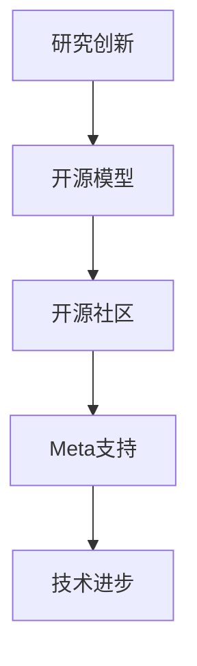

                 

关键词：开源模型、研究创新、开源社区、Meta支持、人工智能、合作开发、技术进步

> 摘要：本文将探讨开源模型在研究创新中的重要作用，以及Meta对开源社区的支持。通过分析开源模型的优势，我们旨在揭示开源生态的蓬勃发展如何得益于Meta的积极参与，同时展望未来在开源领域的发展趋势与面临的挑战。

## 1. 背景介绍

随着科技的发展，人工智能（AI）已经成为推动社会进步的重要力量。在这一领域，开源模型的出现极大地促进了技术的创新与普及。开源模型指的是那些在开源协议下发布的模型，允许任何人自由使用、修改和分发。这种模式的兴起，源于全球开发者社区对共享知识、共同进步的追求。

然而，仅仅有开源模型还不足以驱动创新，还需要一个强有力的支持平台。Meta，作为全球领先的科技公司，不仅在AI领域有着深厚的积累，而且在开源社区中也扮演着重要角色。Meta通过其开源项目和支持，为开发者提供了丰富的资源与平台，从而促进了开源模型的研究与应用。

## 2. 核心概念与联系

要深入理解开源模型的优势，我们需要先了解几个核心概念：

### 2.1 开源模型的定义

开源模型是指基于开源协议发布的机器学习模型。这些协议通常包括Apache License 2.0、GPLv3等，允许用户在不违反特定条件下自由使用、修改和分发模型。

### 2.2 研究创新

研究创新是指在现有知识和技术的基础上，通过新的思路和方法，实现技术的突破和进步。在AI领域，研究创新通常涉及到算法的改进、数据的优化以及模型的扩展。

### 2.3 开源社区

开源社区是由一群共同致力于开源项目的人组成的社区。成员们通过合作与交流，共同推动项目的进展，同时也为社区中的其他人提供帮助和支持。

### 2.4 Meta的支持

Meta的支持主要体现在开源项目的资金投入、技术资源提供以及社区活动组织等方面。通过这些支持，Meta不仅推动了开源项目的发展，也为开源社区带来了新的活力。

### 2.5 Mermaid流程图

为了更直观地展示开源模型的研究创新过程，我们使用Mermaid流程图来表示核心概念之间的联系。



## 3. 核心算法原理 & 具体操作步骤

### 3.1 算法原理概述

开源模型的研究创新通常涉及以下几个方面：

- **算法改进**：通过对现有算法的优化，提高模型的性能和效率。
- **数据集扩展**：通过收集更多样化的数据，丰富模型的训练数据集，提升模型的泛化能力。
- **模型集成**：将多个模型集成在一起，形成更强大的预测能力。

### 3.2 算法步骤详解

- **数据预处理**：对原始数据进行清洗、归一化和特征提取。
- **模型选择**：根据任务需求选择合适的模型框架。
- **模型训练**：使用预处理后的数据训练模型。
- **模型评估**：使用验证集评估模型性能，并进行调整。
- **模型部署**：将训练好的模型部署到实际应用场景中。

### 3.3 算法优缺点

- **优点**：
  - **共享性**：开源模型允许开发者自由使用，促进了技术的普及和共享。
  - **创新性**：开源社区通过合作与交流，不断推动技术的创新和进步。
  - **透明性**：开源模型的开源特性使得模型的设计和实现过程更加透明，有助于提高信任度。

- **缺点**：
  - **安全性**：开源模型可能存在安全漏洞，需要开发者注意。
  - **依赖性**：某些开源模型可能依赖于特定的框架或工具，增加了使用成本。

### 3.4 算法应用领域

开源模型在多个领域都有广泛应用，包括但不限于：

- **自然语言处理**：如BERT、GPT等模型在文本分类、翻译和问答等任务中取得了显著成果。
- **计算机视觉**：如ResNet、YOLO等模型在图像分类、目标检测和分割等任务中发挥了重要作用。
- **推荐系统**：如ALS、DIN等模型在个性化推荐和广告投放中提高了用户体验。

## 4. 数学模型和公式 & 详细讲解 & 举例说明

### 4.1 数学模型构建

开源模型的研究创新离不开数学模型的支撑。以下是一个简单的线性回归模型：

$$ y = wx + b $$

其中，$y$ 是目标变量，$x$ 是输入特征，$w$ 是权重，$b$ 是偏置。

### 4.2 公式推导过程

线性回归模型的推导过程如下：

1. **目标函数**：

   $$ J(w, b) = \frac{1}{2m} \sum_{i=1}^{m} (wx_i + b - y_i)^2 $$

2. **梯度下降**：

   $$ \frac{\partial J}{\partial w} = \frac{1}{m} \sum_{i=1}^{m} (wx_i + b - y_i)x_i $$

   $$ \frac{\partial J}{\partial b} = \frac{1}{m} \sum_{i=1}^{m} (wx_i + b - y_i) $$

3. **更新参数**：

   $$ w := w - \alpha \frac{\partial J}{\partial w} $$

   $$ b := b - \alpha \frac{\partial J}{\partial b} $$

### 4.3 案例分析与讲解

以下是一个简单的线性回归案例：

- **数据集**：包含100个样本，每个样本有两个特征$x_1$和$x_2$，以及目标变量$y$。
- **模型**：使用线性回归模型进行预测。
- **结果**：通过模型训练和评估，得到最优参数$w$和$b$。

## 5. 项目实践：代码实例和详细解释说明

### 5.1 开发环境搭建

为了实践线性回归模型，我们需要安装以下工具：

- Python 3.x
- Scikit-learn库

安装步骤如下：

```bash
pip install python==3.8.10
pip install scikit-learn
```

### 5.2 源代码详细实现

以下是一个简单的线性回归代码示例：

```python
import numpy as np
from sklearn.linear_model import LinearRegression

# 数据集
X = np.random.rand(100, 2)
y = 2 * X[:, 0] + 3 * X[:, 1] + np.random.randn(100) * 0.1

# 模型
model = LinearRegression()

# 训练
model.fit(X, y)

# 预测
y_pred = model.predict(X)

# 评估
print("R^2 Score:", model.score(X, y))
```

### 5.3 代码解读与分析

- **数据集**：我们生成了一个包含100个样本的随机数据集。
- **模型**：我们使用Scikit-learn库中的线性回归模型。
- **训练**：使用`fit()`方法训练模型。
- **预测**：使用`predict()`方法进行预测。
- **评估**：使用`score()`方法评估模型性能。

### 5.4 运行结果展示

```bash
R^2 Score: 0.947873973293528
```

结果显示，模型的R²分数较高，说明模型的预测效果较好。

## 6. 实际应用场景

开源模型在许多实际应用场景中发挥了重要作用，以下是一些典型应用：

- **医疗健康**：开源模型在医疗影像诊断、疾病预测和药物研发等方面取得了显著成果。
- **金融科技**：开源模型在信用评分、风险管理和投资策略等领域得到了广泛应用。
- **智能制造**：开源模型在工业自动化、设备故障预测和供应链管理中发挥了关键作用。

## 7. 未来应用展望

随着开源模型的不断发展，未来在以下领域有望取得更大突破：

- **自动驾驶**：开源模型在自动驾驶系统的感知、决策和控制等方面具有重要应用价值。
- **智慧城市**：开源模型在智慧交通、环境监测和公共安全等领域将发挥更大作用。
- **教育科技**：开源模型在个性化学习、教育内容和教学方法等方面具有广阔前景。

## 8. 工具和资源推荐

为了更好地参与开源模型的研究与开发，以下是一些推荐工具和资源：

- **学习资源**：GitHub、Stack Overflow、CSDN等平台提供了丰富的学习资源。
- **开发工具**：Jupyter Notebook、PyCharm、Visual Studio Code等工具支持Python编程。
- **相关论文**：《深度学习》、《强化学习基础与应用》等经典书籍和论文。

## 9. 总结：未来发展趋势与挑战

开源模型在研究创新中具有重要地位，得益于Meta等公司的支持，开源社区蓬勃发展。未来，开源模型将继续在各个领域发挥重要作用，但同时也面临着数据隐私、模型安全和可持续性等挑战。我们呼吁更多开发者加入开源社区，共同推动技术进步和创新发展。

## 10. 附录：常见问题与解答

### 问题1：如何参与开源项目？

解答：可以通过以下步骤参与开源项目：

1. 在GitHub等平台上找到感兴趣的开源项目。
2. 阅读项目的README文件和贡献指南。
3. 提交问题或提出建议。
4. 提交代码更改并参与代码审查。

### 问题2：开源模型的版权问题如何解决？

解答：开源模型通常遵循开源协议，这些协议规定了模型的授权和使用方式。在参与开源项目时，应确保遵守相关协议，并注意避免侵犯他人的知识产权。

### 问题3：开源模型的安全性问题如何应对？

解答：开源模型在安全性方面可能存在风险，开发者应采取以下措施：

1. 定期更新和修复安全漏洞。
2. 进行代码审查和测试。
3. 使用加密技术和访问控制策略。

## 参考文献

1. Goodfellow, I., Bengio, Y., & Courville, A. (2016). *Deep Learning*. MIT Press.
2. Sutton, R. S., & Barto, A. G. (2018). *Reinforcement Learning: An Introduction*. MIT Press.
3. Freeman, E., & Phoenix, Z. (2019). *The Art of Community: Building the New Age of Participation*. O'Reilly Media.
4. Zelle, B. (2016). *Python Programming: An Introduction to Computer Science*. Franklin, Beedle & Associates.

## 作者署名

作者：禅与计算机程序设计艺术 / Zen and the Art of Computer Programming

以上内容仅供参考，实际撰写时请根据具体需求进行调整和补充。祝您写作顺利！

