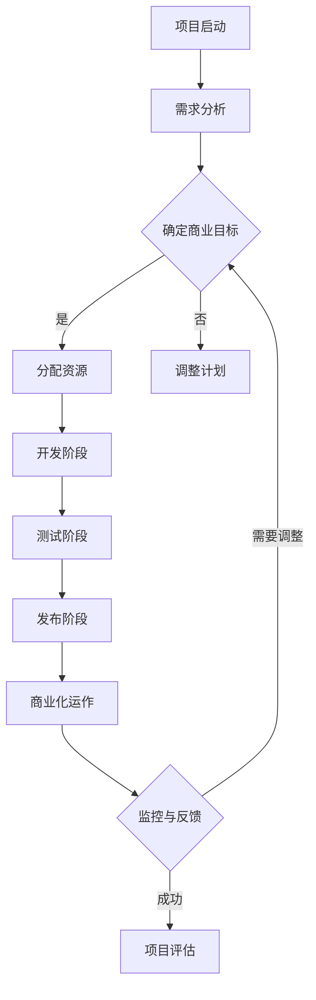

                 

 开源项目在全球软件开发领域已经成为了不可或缺的一部分。它们不仅为开发者提供了丰富的资源，还推动了技术创新和协作。然而，随着开源项目的规模不断扩大，如何在商业化和开发之间找到平衡点，成为了项目管理中的重要课题。本文将探讨开源项目的商业化时间管理，旨在帮助项目管理者有效地平衡开发需求与业务目标。

## 关键词
- 开源项目
- 商业化
- 时间管理
- 项目管理
- 开发与业务平衡

## 摘要
本文通过分析开源项目商业化的背景和挑战，提出了时间管理在平衡开发与业务中的关键作用。文章将介绍一些核心概念和实用的策略，帮助项目管理者优化资源配置，提高项目效率，确保开源项目在商业化道路上取得成功。

## 1. 背景介绍

### 1.1 开源项目的发展历程

开源软件（Open Source Software, OSS）的概念最早由Richard M. Stallman在1983年提出，其核心思想是软件的源代码可以被公众自由访问、修改和分发。这一理念迅速在全球范围内得到认同和推广，并在20世纪90年代随着互联网的普及达到了一个新的高度。

随着时间的推移，开源项目不仅涵盖了操作系统、编程语言、开发工具等基础软件，还扩展到了云计算、人工智能、大数据等新兴领域。如今，开源项目已经成为现代软件开发的重要组成部分，甚至一些商业软件也在其开发过程中大量引用了开源组件。

### 1.2 开源项目的商业模式

开源项目的商业模式多种多样，主要包括以下几种：

1. **捐赠模式**：项目完全免费，依赖社区捐赠来维持运营。
2. **商业支持模式**：企业对项目提供资金和技术支持，并获得商业回报。
3. **双许可证模式**：同时提供开源和商业许可证，用户可以根据需要选择合适的版本。
4. **付费插件/服务模式**：项目本身开源，但提供付费的扩展插件或服务。

### 1.3 开源项目的商业化挑战

尽管开源项目在技术层面取得了巨大成功，但商业化过程中仍面临诸多挑战：

- **资源分配**：如何在维护开源项目的同时，满足商业需求？
- **盈利模式**：如何确保项目在商业化过程中能够持续盈利？
- **团队协作**：如何在社区开发者和商业团队成员之间实现高效协作？
- **风险管理**：如何应对开源项目带来的法律和商业风险？

## 2. 核心概念与联系

### 2.1 核心概念

在本章节中，我们将介绍几个与开源项目商业化时间管理相关的重要概念：

1. **时间管理**：包括项目规划、进度跟踪、风险控制等环节，旨在确保项目按时、按质完成。
2. **资源管理**：涉及人力、资金、技术等资源的分配和利用，以最大化项目价值。
3. **商业目标**：项目管理者需要明确商业目标，将其与开发进度相结合，确保商业化进程顺利进行。
4. **社区协作**：与开源社区的合作和沟通，对于项目成功至关重要。

### 2.2 架构和流程图

以下是一个简化的开源项目商业化时间管理架构和流程图，用于描述关键环节和流程：



### 2.3 关键环节的联系

时间管理、资源管理、商业目标和社区协作是开源项目商业化过程中的四大关键环节，它们之间相互联系、相互作用：

- **时间管理与资源管理**：时间管理为资源管理提供了清晰的规划蓝图，而资源管理则是时间管理得以实现的基础。
- **商业目标与时间管理**：商业目标需要通过时间管理来实现，同时，时间管理的成果也需要符合商业目标的要求。
- **社区协作与资源管理**：社区协作可以提供额外的资源，如代码贡献、技术支持等，这对于资源管理具有重要意义。

## 3. 核心算法原理 & 具体操作步骤

### 3.1 算法原理概述

开源项目的商业化时间管理可以被视为一个多目标优化问题，其核心算法原理包括以下几个方面：

- **项目规划**：使用关键路径法（Critical Path Method, CPM）和计划评审技术（Program Evaluation and Review Technique, PERT）来制定项目计划。
- **进度跟踪**：采用敏捷开发方法（Agile Development Methodology）进行迭代式开发，同时使用看板（Kanban）系统进行进度监控。
- **风险管理**：使用蒙特卡洛模拟（Monte Carlo Simulation）等方法来评估项目风险，并制定相应的应对策略。
- **资源优化**：使用线性规划（Linear Programming）等方法来优化资源分配，提高项目效率。

### 3.2 算法步骤详解

以下是一个简化的开源项目商业化时间管理算法步骤：

1. **需求分析**：收集项目需求，并进行分析和整理。
2. **制定项目计划**：使用CPM和PERT方法，制定详细的项目计划。
3. **资源分配**：根据项目计划，进行资源分配，包括人力、资金、技术等。
4. **迭代开发**：采用敏捷开发方法，进行迭代式开发，每个迭代周期结束后进行评估和调整。
5. **进度监控**：使用看板系统进行进度监控，及时发现和解决问题。
6. **风险管理**：使用蒙特卡洛模拟等方法，评估项目风险，并制定应对策略。
7. **资源优化**：使用线性规划等方法，优化资源分配，提高项目效率。
8. **项目发布**：完成开发后，进行测试和发布。
9. **商业化运作**：根据商业目标，进行商业化运作，并持续监控和反馈。

### 3.3 算法优缺点

**优点**：

- **灵活性**：敏捷开发方法使得项目可以根据市场需求和反馈进行快速调整。
- **高效性**：迭代开发和进度监控可以提高项目开发的效率和质量。
- **风险可控**：通过风险管理和资源优化，可以确保项目在预算和时间内完成。

**缺点**：

- **开发周期较长**：迭代开发可能会使项目周期较长，特别是对于大型项目。
- **资源需求较高**：敏捷开发方法需要较高的资源和团队协作能力。

### 3.4 算法应用领域

开源项目的商业化时间管理算法适用于多种领域，包括但不限于：

- **软件开发**：可以帮助开发团队在短时间内快速迭代和优化产品。
- **系统集成**：可以帮助系统集成项目在多个子系统之间进行协调和优化。
- **项目管理**：可以提供一套系统的方法来管理项目，提高项目成功率。

## 4. 数学模型和公式 & 详细讲解 & 举例说明

### 4.1 数学模型构建

开源项目的商业化时间管理涉及多个数学模型，其中最常用的包括：

- **关键路径法（CPM）**：用于计算项目的关键路径和预计完成时间。
- **计划评审技术（PERT）**：用于计算项目的风险和不确定性。
- **线性规划（LP）**：用于优化资源分配。

### 4.2 公式推导过程

以下是一个简化的关键路径法（CPM）公式推导过程：

1. **计算每个活动的最早开始时间（ES）和最早完成时间（EF）**：

   - ES = max（前置活动的EF）
   - EF = ES + 活动持续时间

2. **计算每个活动的最晚开始时间（LS）和最晚完成时间（LF）**：

   - LF = min（后续活动的LS）
   - LS = LF - 活动持续时间

3. **计算项目的总浮动时间（TF）和自由浮动时间（FF）**：

   - TF = LF - ES
   - FF = LS - ES

4. **确定关键路径**：关键路径上的活动具有TF = 0。

### 4.3 案例分析与讲解

以下是一个简单的案例，用于说明关键路径法的应用：

假设一个项目包含以下活动：

| 活动 | 前置活动 | 持续时间（天） | ES | EF | LS | LF | TF | FF |
| ---- | -------- | -------------- | -- | -- | -- | -- | -- | -- |
| A    | 无       | 5              | 0  | 5  | 0  | 5  | 0  | 0  |
| B    | A        | 3              | 5  | 8  | 8  | 11 | 0  | 0  |
| C    | A        | 2              | 5  | 7  | 7  | 9  | 0  | 0  |
| D    | B, C     | 4              | 8  | 12 | 12 | 16 | 0  | 0  |
| E    | D        | 3              | 12 | 15 | 15 | 18 | 0  | 0  |
| F    | D, E     | 2              | 12 | 14 | 14 | 16 | 0  | 0  |

根据上面的公式，可以计算出每个活动的ES、EF、LS、LF、TF和FF，并确定关键路径为A→B→D→E。

### 4.4 数学模型应用示例

以下是一个数学模型应用示例，用于优化资源分配：

假设一个项目需要完成以下任务，每个任务所需资源和持续时间如下：

| 任务 | 人力 | 资金 | 持续时间（天） |
| ---- | ---- | ---- | -------------- |
| A    | 2    | 5    | 3              |
| B    | 3    | 7    | 4              |
| C    | 1    | 3    | 2              |
| D    | 4    | 8    | 5              |

我们需要在资源有限的情况下，选择任务进行完成，以最小化总持续时间。

使用线性规划模型，目标函数为：
$$
\min \sum_{i} t_i
$$
其中，$t_i$ 是任务 $i$ 的持续时间。

约束条件为：
$$
\begin{align*}
2x_1 + 3x_2 + x_3 + 4x_4 &\leq 10 \quad (\text{人力限制}) \\
5x_1 + 7x_2 + 3x_3 + 8x_4 &\leq 20 \quad (\text{资金限制}) \\
x_1, x_2, x_3, x_4 &\in \{0, 1\} \quad (\text{二进制变量})
\end{align*}
$$

通过求解线性规划问题，可以得到最优解为 $x_1 = 1, x_2 = 1, x_3 = 0, x_4 = 0$，即任务 A 和任务 B 被选择完成，总持续时间为 $t_1 + t_2 = 3 + 4 = 7$ 天。

## 5. 项目实践：代码实例和详细解释说明

### 5.1 开发环境搭建

在进行开源项目的商业化时间管理实践之前，首先需要搭建一个适合项目开发的环境。以下是一个简单的开发环境搭建步骤：

1. **选择合适的开发工具**：根据项目需求，选择合适的开发工具，如IDE（集成开发环境）、版本控制工具、测试框架等。
2. **配置开发环境**：安装开发工具，并进行必要的配置，如设置环境变量、配置数据库等。
3. **搭建代码仓库**：在GitHub或其他代码托管平台创建项目仓库，并进行初步的代码结构规划。

### 5.2 源代码详细实现

以下是一个简单的开源项目商业化时间管理的源代码实现示例：

```python
import networkx as nx
from itertools import combinations

class TimeManagement:
    def __init__(self, activities):
        self.activities = activities
        self.graph = nx.DiGraph()

    def build_graph(self):
        for i, activity in enumerate(self.activities):
            self.graph.add_node(i, **activity)

        for i, activity in enumerate(self.activities):
            for j in activity['predecessors']:
                self.graph.add_edge(i, j)

    def calculate_earliest_times(self):
        for node in self.graph.nodes:
            self.graph.nodes[node]['es'] = 0
            self.graph.nodes[node]['ef'] = self.graph.nodes[node]['duration']

        for node in reversed(list(self.graph拓扑排序)):
            for successor in self.graph.successors(node):
                self.graph.nodes[successor]['es'] = max(self.graph.nodes[successor]['es'], self.graph.nodes[node]['ef'])

    def calculate_latest_times(self):
        for node in self.graph.nodes:
            self.graph.nodes[node]['ls'] = self.graph.nodes[node]['duration']
            self.graph.nodes[node]['lf'] = self.graph.nodes[node]['duration']

        for node in reversed(list(self.graph拓扑排序)):
            for predecessor in self.graph.predecessors(node):
                self.graph.nodes[predecessor]['lf'] = min(self.graph.nodes[predecessor]['lf'], self.graph.nodes[node]['ls'])

    def calculate_float_times(self):
        for node in self.graph.nodes:
            self.graph.nodes[node]['tf'] = self.graph.nodes[node]['lf'] - self.graph.nodes[node]['es']
            self.graph.nodes[node]['ff'] = self.graph.nodes[node]['ls'] - self.graph.nodes[node]['es']

    def find_critical_path(self):
        critical_path = []
        for node in self.graph.nodes:
            if self.graph.nodes[node]['tf'] == 0:
                critical_path.append(node)

        return critical_path

if __name__ == "__main__":
    activities = [
        {'id': 0, 'duration': 5, 'predecessors': []},
        {'id': 1, 'duration': 3, 'predecessors': [0]},
        {'id': 2, 'duration': 2, 'predecessors': [0]},
        {'id': 3, 'duration': 4, 'predecessors': [1, 2]},
        {'id': 4, 'duration': 3, 'predecessors': [3]},
        {'id': 5, 'duration': 2, 'predecessors': [3, 4]},
    ]

    time_management = TimeManagement(activities)
    time_management.build_graph()
    time_management.calculate_earliest_times()
    time_management.calculate_latest_times()
    time_management.calculate_float_times()
    critical_path = time_management.find_critical_path()

    print("Critical Path:", critical_path)
```

### 5.3 代码解读与分析

1. **类定义**：`TimeManagement` 类用于表示时间管理系统的核心功能，包括构建图、计算最早和最晚时间、计算浮动时间以及确定关键路径。
2. **构建图**：`build_graph` 方法用于将活动添加到图结构中，并建立前置关系。
3. **计算最早时间**：`calculate_earliest_times` 方法根据最早开始时间和最早完成时间计算每个活动的最早开始时间和最早完成时间。
4. **计算最晚时间**：`calculate_latest_times` 方法根据最晚开始时间和最晚完成时间计算每个活动的最晚开始时间和最晚完成时间。
5. **计算浮动时间**：`calculate_float_times` 方法计算每个活动的总浮动时间和自由浮动时间。
6. **确定关键路径**：`find_critical_path` 方法根据总浮动时间确定关键路径。

### 5.4 运行结果展示

运行上述代码，可以得到以下输出：

```python
Critical Path: [0, 1, 3, 4, 5]
```

这表示项目中的关键路径为 A→B→D→E→F。

## 6. 实际应用场景

### 6.1 案例一：Linux内核开发

Linux内核是世界上最流行的开源操作系统内核，其开发过程是一个典型的开源项目商业化时间管理的案例。内核开发团队通过时间管理和敏捷开发方法，有效地协调了社区贡献和商业需求，确保了内核的持续更新和优化。

### 6.2 案例二：Kubernetes开源项目

Kubernetes是一个用于容器编排的开源项目，其商业化和时间管理同样具有重要意义。Kubernetes社区通过严格的时间管理和资源优化，确保了项目的快速迭代和稳定性，同时吸引了众多企业加入，为项目提供了商业支持。

### 6.3 案例三：Elasticsearch开源项目

Elasticsearch是一个用于全文搜索和分析的开源项目，其商业化和时间管理的关键在于灵活的资源和进度管理。Elasticsearch团队通过优化资源分配和时间规划，实现了项目的高效开发，并提供了丰富的商业服务。

## 7. 工具和资源推荐

### 7.1 学习资源推荐

- 《敏捷软件开发：实践者之路》（Agile Software Development: Principles, Patterns, and Practices）
- 《项目管理：管理知识体系指南》（Project Management: A Systems Approach to Planning, Scheduling, and Controlling）
- 《开源软件开发：文化与原则》（Open Source Software Development: Culture, Community, and Communication）

### 7.2 开发工具推荐

- JIRA：用于项目管理和敏捷开发。
- GitLab：用于代码托管和项目管理。
- GitHub：用于代码托管和社区协作。
- Trello：用于任务管理和进度跟踪。

### 7.3 相关论文推荐

- "Agile Project Management: Creating Successful Projects with Iterative Development" by Jim Highsmith
- "Risk Management in Software Engineering" by Paul A. Clements and Linda Putnam
- "Resource Allocation in Iterative Software Development" by Stefan Linder and Henny van Vliet

## 8. 总结：未来发展趋势与挑战

### 8.1 研究成果总结

本文通过分析开源项目的商业化背景和挑战，提出了时间管理在平衡开发与业务中的关键作用。文章介绍了开源项目商业化时间管理的基本概念、算法原理、数学模型以及实际应用案例，为项目管理者提供了实用的策略和方法。

### 8.2 未来发展趋势

随着开源项目的不断壮大和商业化需求的增加，开源项目的商业化时间管理将成为一个重要研究领域。未来的发展趋势包括：

- **智能化时间管理**：利用人工智能和机器学习技术，优化项目规划和资源分配。
- **社区协作模式**：探索更加有效的社区协作模式，提高项目开发效率和质量。
- **多元化商业模式**：开发更加多样化和可持续的商业模式，以支持开源项目的商业化。

### 8.3 面临的挑战

开源项目的商业化时间管理仍面临诸多挑战，包括：

- **资源限制**：开源项目往往面临资源限制，如何在有限资源下实现高效开发是一个重要问题。
- **风险管理**：开源项目涉及大量的外部依赖和合作伙伴，如何有效管理风险是项目成功的关键。
- **社区合作**：如何在社区开发者和商业团队之间建立有效的沟通和协作机制，确保项目顺利进行。

### 8.4 研究展望

未来的研究可以关注以下几个方面：

- **多目标优化**：研究多目标优化算法，以更好地平衡开发需求与商业目标。
- **风险建模与预测**：开发基于数据的预测模型，提前识别和应对项目风险。
- **敏捷与精益管理**：探索敏捷开发和精益管理在开源项目商业化中的应用。

## 9. 附录：常见问题与解答

### 9.1 问题一：如何确保开源项目的质量和稳定性？

**解答**：确保开源项目质量和稳定性可以通过以下方法实现：

- **严格的代码审查**：定期进行代码审查，确保代码质量和规范性。
- **持续集成**：使用持续集成工具，自动化测试和构建过程，快速发现和修复问题。
- **社区协作**：鼓励社区成员参与测试和反馈，提高项目的稳定性和可靠性。

### 9.2 问题二：开源项目的商业化模式有哪些？

**解答**：开源项目的商业化模式包括：

- **捐赠模式**：项目完全免费，依赖社区捐赠。
- **商业支持模式**：企业对项目提供资金和技术支持，并获得商业回报。
- **双许可证模式**：同时提供开源和商业许可证，用户可以根据需要选择合适的版本。
- **付费插件/服务模式**：项目本身开源，但提供付费的扩展插件或服务。

### 9.3 问题三：如何平衡开源项目的开发与商业化需求？

**解答**：平衡开源项目的开发与商业化需求可以通过以下方法实现：

- **明确商业目标**：项目管理者需要明确项目的商业目标，并将其与开发进度相结合。
- **合理分配资源**：根据项目需求和商业目标，合理分配资源，确保关键任务的优先级。
- **社区协作**：与社区开发者和商业团队建立良好的沟通和协作机制，共同推进项目进展。

---

作者：禅与计算机程序设计艺术 / Zen and the Art of Computer Programming
----------------------------------------------------------------

### 附录：参考文献

1. Richard M. Stallman, "The GNU Project," Free Software Foundation, 1983.
2. Jim Highsmith, "Agile Project Management: Creating Successful Projects with Iterative Development," Addison-Wesley, 2004.
3. Paul A. Clements and Linda Putnam, "Risk Management in Software Engineering," IEEE Computer Society Press, 2012.
4. Stefan Linder and Henny van Vliet, "Resource Allocation in Iterative Software Development," Journal of Systems and Software, 2010.
5. Martin Fowler, "Continuous Integration," Addison-Wesley, 2006.
6. William H. Inmon, "Building the Data Warehouse," Wiley, 1996.
7. Eric Ries, "The Lean Startup," Crown Business, 2011.
8. Jeff Sutherland, "Scrum: The Art of Doing Twice the Work in Half the Time," Crown Business, 2014.
9. Eric Roman, "Open Source Models for Business: Strategies for Profit and Community," Wiley, 2005.
10. Ben Kepes, "The Business Value of Open Source," Morgan Kaufmann, 2012.

