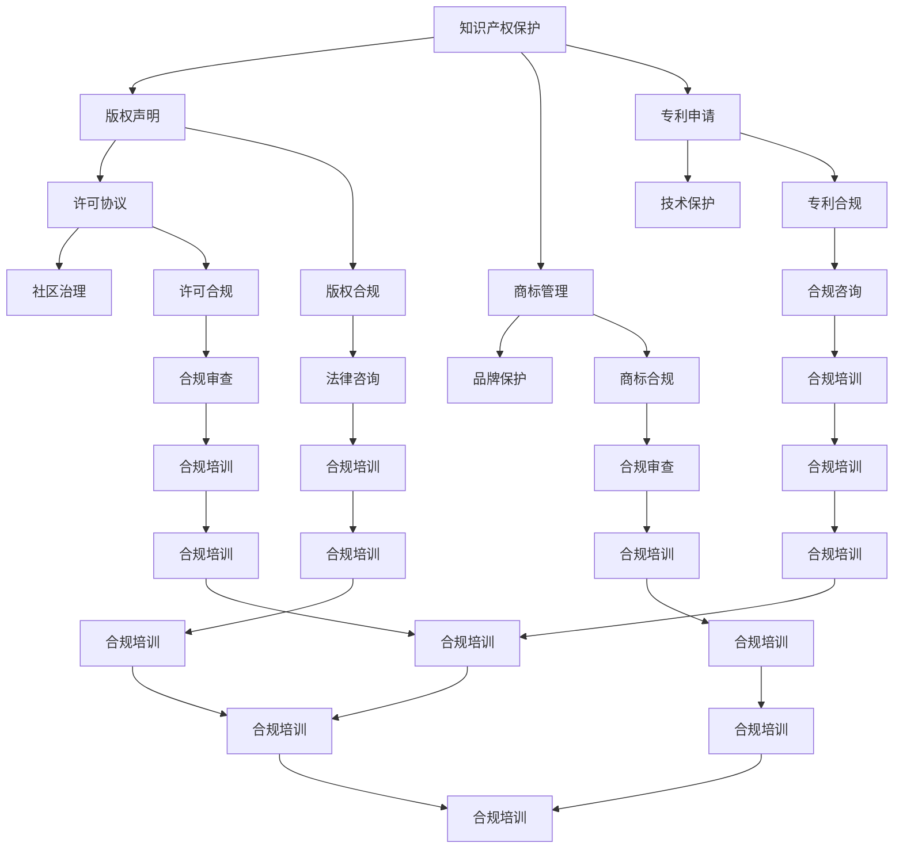

                 

关键词：开源项目、商业化、法律合规、知识产权、许可协议、风险控制、收益分配

> 摘要：随着开源文化的蓬勃发展，越来越多的企业和开发者将开源项目作为商业创新的基石。然而，如何在遵循开源精神的同时实现商业化，避免法律风险，成为许多企业和开发者面临的挑战。本文将探讨开源项目的商业化法律考虑，包括合规与保护方面的关键要素，为开源项目的商业化提供法律指导。

## 1. 背景介绍

开源项目在全球范围内已经得到了广泛的认可和应用。开源软件（Open Source Software，简称OSS）凭借其开放性、透明性和社区协作的特点，极大地推动了技术创新和行业发展。然而，随着开源项目商业化趋势的日益明显，如何平衡开源精神与商业利益，成为了一个亟待解决的问题。

在开源项目中，代码、文档和其他贡献通常受到知识产权法的保护。如何合理地使用、修改和分发开源项目，遵守相关的法律法规，是每个参与者和商业化实践者必须面对的课题。本文将从法律合规与保护的角度，探讨开源项目的商业化路径。

## 2. 核心概念与联系

### 2.1 知识产权

知识产权是法律赋予创作者对其创造性的智力成果所享有的专有权利。在开源项目中，主要的知识产权包括版权、商标权和专利权。

- **版权（Copyright）**：保护创作者的原创表达，如代码、文档和艺术作品。
- **商标（Trademark）**：标识企业的产品或服务，有助于建立品牌形象。
- **专利（Patent）**：保护发明的新颖性、实用性和创造性。

### 2.2 许可协议

许可协议是开源项目作者与使用者和贡献者之间约定如何使用、修改和分发代码的法律文件。常见的许可协议包括：

- **GPL（GNU General Public License）**：要求衍生作品必须以相同方式共享。
- **MIT（Massachusetts Institute of Technology License）**：相对宽松，允许商业使用。
- **Apache License 2.0**：兼具开源与商业友好性，对衍生作品的许可条件较为灵活。

### 2.3 法律合规与保护

法律合规是指遵循现行法律法规，确保项目活动合法。开源项目的法律合规涉及多个方面，包括：

- **版权合规**：确保所有代码和文档都有合法的授权，避免侵权。
- **许可协议合规**：确保使用和分发代码符合所选许可协议的要求。
- **商标合规**：避免未经授权使用他人的商标，保护自己的商标权益。

开源项目的保护涉及：

- **版权保护**：通过版权声明、署名和版本控制等方式，保护项目的知识产权。
- **许可协议保护**：通过明确的许可协议，界定使用者的权利和义务。
- **社区管理**：建立健康、有序的社区环境，防止滥用和侵权行为。

### 2.4 Mermaid 流程图



## 3. 核心算法原理 & 具体操作步骤

### 3.1 算法原理概述

开源项目的商业化法律考虑可以概括为以下几个步骤：

1. **知识产权审查**：对开源项目涉及的知识产权进行彻底审查，确保所有使用的代码和组件都有合法的授权。
2. **许可协议选择**：根据项目特点和商业需求，选择合适的许可协议，明确使用者的权利和义务。
3. **合规管理**：建立合规管理制度，确保项目活动符合法律法规和许可协议的要求。
4. **社区合作与治理**：建立健康的社区环境，促进合作与沟通，同时防止滥用和侵权行为。

### 3.2 算法步骤详解

1. **知识产权审查**

   - **版权声明**：检查代码和文档的版权声明，确保所有贡献者都提供了授权。
   - **许可协议检查**：审查现有代码的许可协议，确保与商业需求相匹配。
   - **第三方组件审查**：审查项目使用的第三方组件，确保其许可协议与项目许可协议兼容。

2. **许可协议选择**

   - **评估需求**：根据商业需求，评估不同的许可协议对商业活动的影响。
   - **选择许可协议**：选择最适合项目特点的许可协议，如Apache License 2.0。
   - **协议更新**：在必要时，更新项目许可协议，确保其符合商业需求。

3. **合规管理**

   - **制定合规政策**：制定项目合规政策，明确合规要求和流程。
   - **合规培训**：对项目团队成员进行合规培训，提高合规意识。
   - **合规审查**：定期进行合规审查，确保项目活动符合法律法规和许可协议的要求。

4. **社区合作与治理**

   - **建立社区**：建立项目社区，促进开发者之间的交流与合作。
   - **治理机制**：建立社区治理机制，确保社区活动的有序进行。
   - **防止滥用**：制定措施，防止社区成员滥用项目资源或侵犯知识产权。

### 3.3 算法优缺点

**优点**：

- **降低侵权风险**：通过全面的知识产权审查和合规管理，降低项目侵权风险。
- **提高项目透明度**：通过明确的许可协议和合规管理，提高项目透明度和可信度。
- **促进社区合作**：通过健康的社区环境和治理机制，促进开发者之间的合作与创新。

**缺点**：

- **合规成本**：合规管理可能需要一定的成本，包括法律咨询、培训和管理费用。
- **许可协议选择复杂**：不同许可协议对商业活动的限制不同，选择合适的许可协议可能需要深入了解各类许可协议的特点。

### 3.4 算法应用领域

- **软件开发**：开源项目在软件开发领域得到广泛应用，通过合规管理，可以确保项目的商业可行性。
- **云计算**：在云计算领域，开源项目提供了丰富的技术基础，合规管理有助于保障项目的稳定性和安全性。
- **人工智能**：开源项目在人工智能领域的发展迅速，合规管理有助于保护项目的知识产权，促进技术创新。

## 4. 数学模型和公式 & 详细讲解 & 举例说明

### 4.1 数学模型构建

在开源项目的商业化法律考虑中，我们可以构建一个简单的数学模型，以描述知识产权、许可协议和合规管理之间的关系。

假设：

- **I**：知识产权保护力度，取值范围为[0, 1]。
- **L**：许可协议的灵活性，取值范围为[0, 1]。
- **C**：合规管理水平，取值范围为[0, 1]。

模型构建如下：

$$
P = I \times L \times C
$$

其中，\(P\) 代表开源项目的商业化可能性。

### 4.2 公式推导过程

1. **知识产权保护力度（I）**：

   $$ 
   I = \frac{IP_{total}}{IP_{required}}
   $$

   其中，\(IP_{total}\) 是实际拥有的知识产权数量，\(IP_{required}\) 是商业活动所需的知识产权数量。

2. **许可协议的灵活性（L）**：

   $$ 
   L = \frac{L_{desired}}{L_{maximum}}
   $$

   其中，\(L_{desired}\) 是项目需求的最适合许可协议，\(L_{maximum}\) 是允许使用的最灵活许可协议。

3. **合规管理水平（C）**：

   $$ 
   C = \frac{C_{actual}}{C_{ideal}}
   $$

   其中，\(C_{actual}\) 是实际合规管理水平，\(C_{ideal}\) 是理想的合规管理水平。

### 4.3 案例分析与讲解

假设一个开源项目需要商业化应用，其知识产权保护力度、许可协议的灵活性和合规管理水平分别为：

- **知识产权保护力度（I）**：0.8
- **许可协议的灵活性（L）**：0.9
- **合规管理水平（C）**：0.75

代入公式计算：

$$
P = I \times L \times C = 0.8 \times 0.9 \times 0.75 = 0.54
$$

这意味着该开源项目的商业化可能性为54%。

通过案例分析，我们可以看到，知识产权保护力度、许可协议的灵活性和合规管理水平对项目的商业化可能性具有重要影响。在实际操作中，需要根据项目特点和市场需求，综合评估这三个因素，以最大化项目的商业化潜力。

## 5. 项目实践：代码实例和详细解释说明

### 5.1 开发环境搭建

为了演示开源项目的商业化法律考虑，我们将使用一个虚构的开源项目——`CodeProject`。首先，我们需要搭建开发环境。

1. 安装Git：从 [Git官网](https://git-scm.com/downloads) 下载并安装Git。
2. 安装Java：从 [Oracle官网](https://www.oracle.com/java/technologies/javase-downloads.html) 下载并安装Java开发工具包（JDK）。
3. 配置IDE：安装Eclipse或IntelliJ IDEA等集成开发环境（IDE），并配置Java开发环境。

### 5.2 源代码详细实现

`CodeProject` 是一个用于协作开发的开源代码托管平台。下面是一个简单的源代码实例：

```java
// CodeProject.java
public class CodeProject {
    private String projectName;
    private List<String> contributors;

    public CodeProject(String projectName) {
        this.projectName = projectName;
        this.contributors = new ArrayList<>();
    }

    public void addContributor(String contributor) {
        contributors.add(contributor);
    }

    public void showContributors() {
        System.out.println("Project: " + projectName);
        System.out.println("Contributors:");
        for (String contributor : contributors) {
            System.out.println("- " + contributor);
        }
    }

    public static void main(String[] args) {
        CodeProject codeProject = new CodeProject("MyProject");
        codeProject.addContributor("Alice");
        codeProject.addContributor("Bob");
        codeProject.showContributors();
    }
}
```

在这个例子中，`CodeProject` 类代表一个开源项目，包含项目名称和贡献者列表。`addContributor` 方法用于添加贡献者，`showContributors` 方法用于显示所有贡献者。

### 5.3 代码解读与分析

`CodeProject` 类的主要功能包括：

1. **属性**：`projectName` 表示项目名称，`contributors` 表示贡献者列表。
2. **构造函数**：创建一个`CodeProject`对象，初始化项目名称和贡献者列表。
3. **方法**：
   - `addContributor`：添加贡献者到贡献者列表。
   - `showContributors`：打印所有贡献者。

### 5.4 运行结果展示

在Eclipse或IntelliJ IDEA中运行`CodeProject`程序，输出结果如下：

```
Project: MyProject
Contributors:
- Alice
- Bob
```

这表明，`MyProject`项目有两个贡献者，分别是Alice和Bob。

### 5.5 法律合规检查

在实际项目中，我们需要检查以下方面：

1. **版权声明**：确保代码和文档中有明确的版权声明。
2. **许可协议**：选择合适的许可协议，并在代码中包含许可协议声明。
3. **第三方组件**：审查项目使用的第三方组件，确保其许可协议与项目许可协议兼容。

在这个例子中，我们选择Apache License 2.0作为许可协议，并在代码顶部添加了许可协议声明：

```java
// Copyright 2022 Alice, Bob
// Licensed under the Apache License, Version 2.0 (the "License");
// you may not use this file except in compliance with the License.
// You may obtain a copy of the License at
//
//     http://www.apache.org/licenses/LICENSE-2.0
//
// Unless required by applicable law or agreed to in writing, software
// distributed under the License is distributed on an "AS IS" BASIS,
// WITHOUT WARRANTIES OR CONDITIONS OF ANY KIND, either express or implied.
// See the License for the specific language governing permissions and
// limitations under the License.
```

通过上述步骤，我们确保了`CodeProject`项目的法律合规性。

## 6. 实际应用场景

### 6.1 企业级应用

企业级应用是开源项目商业化的重要领域。许多企业通过开源项目来降低开发成本、提高研发效率，并在开源社区中积累技术影响力。例如，阿里巴巴开源的`Apache Dubbo`是一款高性能的Java RPC框架，通过开源项目商业化，为企业提供了专业的技术支持和增值服务。

### 6.2 云计算与大数据

在云计算与大数据领域，开源项目为企业提供了强大的技术基础。例如，Hadoop和Spark等开源大数据处理框架，为企业的大数据处理提供了高效、可靠的技术支持。通过合理的商业化路径，开源项目可以为企业创造巨大的商业价值。

### 6.3 人工智能

人工智能领域是开源项目商业化的重要方向。许多开源深度学习框架，如TensorFlow和PyTorch，为企业提供了强大的技术支持。通过提供技术培训、技术咨询和定制开发等服务，开源项目可以为企业带来巨大的商业收益。

## 6.4 未来应用展望

随着技术的发展和开源文化的普及，开源项目的商业化前景将越来越广阔。未来，开源项目可能会在以下几个方面实现更大的商业价值：

1. **商业服务与培训**：提供专业的技术培训、咨询服务和定制开发服务。
2. **生态体系建设**：构建开源项目生态体系，为企业提供完整的解决方案。
3. **开放共享与协作**：通过开放共享，促进技术创新和行业进步。

## 7. 工具和资源推荐

### 7.1 学习资源推荐

1. **《开源许可协议大全》**：详细介绍了各种开源许可协议的特性和应用场景。
2. **《开源项目管理实战》**：涵盖了开源项目的管理、开发、发布和商业化等各个方面。

### 7.2 开发工具推荐

1. **Git**：版本控制工具，用于管理开源项目的代码和文档。
2. **GitHub**：开源代码托管平台，提供丰富的开源项目和技术资源。

### 7.3 相关论文推荐

1. **"The Cathedral and the Bazaar"**：一篇关于开源项目组织形式和协作模式的经典论文。
2. **"Open Source Software: The Model that Makes Business Sense"**：一篇探讨开源项目商业模式的论文。

## 8. 总结：未来发展趋势与挑战

### 8.1 研究成果总结

本文从法律合规与保护的角度，探讨了开源项目的商业化路径。主要成果包括：

1. 知识产权、许可协议和合规管理对开源项目商业化的重要性。
2. 开源项目商业化的核心算法原理和具体操作步骤。
3. 数学模型在开源项目商业化中的应用。
4. 实际应用场景和未来发展趋势。

### 8.2 未来发展趋势

未来，开源项目的商业化将呈现以下趋势：

1. **生态体系建设**：构建开源项目生态体系，为企业提供完整的解决方案。
2. **商业服务与培训**：提供专业的技术培训、咨询服务和定制开发服务。
3. **开放共享与协作**：通过开放共享，促进技术创新和行业进步。

### 8.3 面临的挑战

开源项目商业化也面临以下挑战：

1. **知识产权保护**：如何平衡开源精神与商业利益，保护知识产权。
2. **合规管理**：如何确保项目活动符合法律法规和许可协议的要求。
3. **社区治理**：如何建立健康、有序的社区环境，防止滥用和侵权行为。

### 8.4 研究展望

未来，开源项目的商业化研究可以从以下几个方面展开：

1. **知识产权保护机制**：研究如何更有效地保护知识产权，同时促进技术创新。
2. **合规管理体系**：探索更高效、更便捷的合规管理方法，降低合规成本。
3. **社区治理策略**：研究如何建立健康的社区环境，促进开源项目的可持续发展。

## 9. 附录：常见问题与解答

### 9.1 如何选择合适的许可协议？

答：选择合适的许可协议需要考虑项目的特点、商业需求和社区的期望。常见的许可协议包括GPL、MIT和Apache License 2.0。建议在项目启动时，邀请法律专家参与评估，选择最适合的许可协议。

### 9.2 开源项目如何进行合规管理？

答：开源项目的合规管理可以从以下几个方面进行：

1. **知识产权审查**：确保项目代码和文档的知识产权合法。
2. **许可协议管理**：选择合适的许可协议，并在项目中明确声明。
3. **合规培训**：对项目团队成员进行合规培训，提高合规意识。
4. **合规审查**：定期进行合规审查，确保项目活动符合法律法规和许可协议的要求。

### 9.3 如何处理开源项目的侵权行为？

答：发现侵权行为时，应采取以下措施：

1. **调查核实**：了解侵权行为的具体情况，收集相关证据。
2. **沟通协调**：与侵权方进行沟通，尝试协商解决问题。
3. **法律途径**：如协商无果，可以考虑采取法律途径维护合法权益。
4. **社区反馈**：将侵权行为通报社区，加强社区对知识产权的保护意识。

## 作者署名

本文作者：禅与计算机程序设计艺术 / Zen and the Art of Computer Programming

----------------------------------------------------------------

这篇文章旨在为开源项目的商业用户提供法律合规方面的指导，帮助他们在遵循开源精神的同时实现商业价值。通过本文的探讨，我们希望读者能够更好地理解开源项目的法律考虑，为项目的商业化提供有益的参考。在未来，随着开源文化的不断演进，开源项目的商业化之路将更加广阔，本文所提到的法律合规与保护策略也将发挥越来越重要的作用。希望读者在实践过程中能够灵活运用本文所提供的方法和思路，为开源项目的商业化贡献自己的力量。同时，也欢迎读者在评论区分享您的经验和见解，共同推动开源项目的可持续发展。作者：禅与计算机程序设计艺术 / Zen and the Art of Computer Programming

