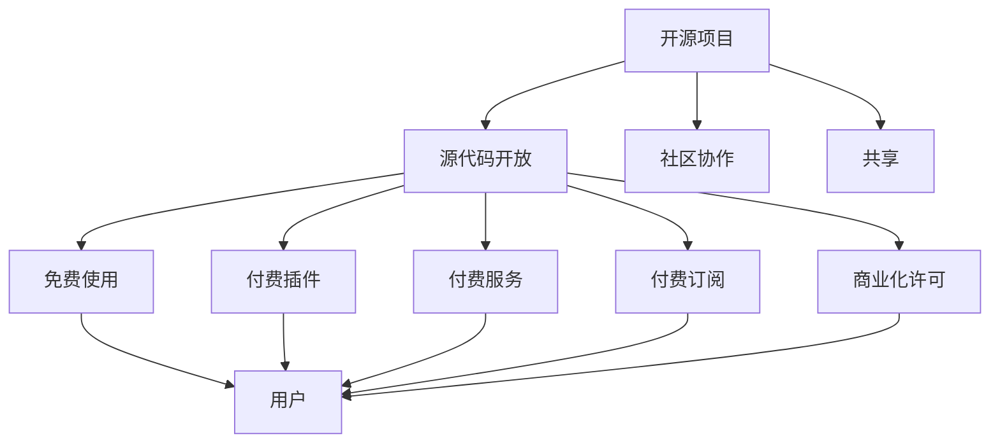

                 

关键词：开源项目，商业版本，免费与付费功能，商业模式，可持续发展

> 摘要：本文将探讨开源项目如何通过商业版本的策略实现免费与付费功能的平衡，以实现项目的可持续发展。文章首先介绍了开源项目的背景和特点，然后分析了商业版本的多种模式，最后提出了如何平衡免费与付费功能以促进项目发展的策略。

## 1. 背景介绍

开源项目是一种软件开发模式，其核心特点是软件的源代码可以被公众访问、修改和分发。这种模式源自于自由软件运动和开放源代码运动，旨在促进软件技术的共享和协作。开源项目因其透明性、灵活性和社区的贡献，在软件开发领域得到了广泛应用。

然而，开源项目的运营和可持续发展是一个挑战。由于开源项目通常是免费的，开发者往往难以从中获得直接的经济回报。因此，许多开源项目面临着资金不足、维护困难等问题。为了解决这些问题，许多开源项目开始探索商业版本的策略。

## 2. 核心概念与联系

### 2.1 开源项目的基本概念

开源项目的核心概念包括：

- **源代码开放**：项目的源代码可以公开访问，任何人都可以查看、修改和分发。
- **社区协作**：开发者通过社区协作来共同改进项目。
- **共享**：项目的成果可以被免费使用和分享。

### 2.2 商业版本的多种模式

商业版本的策略有多种，以下是一些常见的模式：

- **付费插件**：开源项目本身免费，但提供付费的插件或扩展功能。
- **付费服务**：开源项目提供付费的技术支持、定制服务或云服务。
- **付费订阅**：用户需要定期支付费用来获取项目的最新更新和功能。
- **商业化许可**：对开源项目的某些部分进行商业许可，允许商业用途。

### 2.3 Mermaid 流程图

以下是开源项目商业版本的 Mermaid 流程图：



## 3. 核心算法原理 & 具体操作步骤

### 3.1 算法原理概述

开源项目的商业版本策略是一种平衡免费与付费功能的方法，旨在通过商业模式的多样性实现项目的可持续发展。核心原理包括：

- **价值识别**：识别项目的核心价值和潜在的商业点。
- **用户细分**：将用户分为免费用户和付费用户，根据用户需求提供不同的功能和服务。
- **收益模式设计**：设计多种收益模式，如付费插件、付费服务、付费订阅等，以实现收益的最大化。

### 3.2 算法步骤详解

开源项目的商业版本策略包括以下步骤：

1. **价值识别**：分析项目的功能和特性，确定哪些功能具有商业价值。
2. **用户细分**：根据用户需求和使用场景，将用户分为免费用户和付费用户。
3. **收益模式设计**：设计多种收益模式，包括付费插件、付费服务、付费订阅等。
4. **产品开发**：针对不同的用户群体，开发相应的产品和功能。
5. **市场推广**：通过市场推广和用户反馈，不断优化产品和商业模式。

### 3.3 算法优缺点

**优点**：

- **提高收益**：通过多种收益模式，开源项目可以获得更多的经济回报。
- **增强社区参与**：商业版本的策略可以激励更多的开发者参与项目，提高项目的质量。
- **可持续发展**：商业版本的策略有助于项目的长期运营和可持续发展。

**缺点**：

- **商业化风险**：过度商业化可能导致社区失去对项目的信任。
- **用户反感**：过度商业化可能导致免费用户的不满和流失。
- **资源分散**：商业版本的策略可能分散开发者的注意力，影响项目的发展。

### 3.4 算法应用领域

开源项目的商业版本策略在许多领域都有应用，如软件开发、云计算、人工智能等。以下是一些典型的应用场景：

- **软件开发**：开源框架和库通常采用商业版本的策略，提供付费的插件和定制服务。
- **云计算**：开源云平台如OpenStack提供付费的云服务和定制解决方案。
- **人工智能**：开源AI框架如TensorFlow提供付费的云服务和专业培训。

## 4. 数学模型和公式 & 详细讲解 & 举例说明

### 4.1 数学模型构建

开源项目的商业版本策略可以用以下数学模型进行描述：

- **收益函数**：R = f(U, V, C)
  - R：总收益
  - U：用户数量
  - V：用户价值
  - C：成本

- **成本函数**：C = g(U, P, S)
  - C：总成本
  - U：用户数量
  - P：产品价格
  - S：销售量

### 4.2 公式推导过程

收益函数和成本函数的推导如下：

- 收益函数：
  - R = U × (V × P - C)
  - R = U × (V × P - g(U, P, S))

- 成本函数：
  - C = U × S × P + S × C'

  其中，C'表示固定成本，如研发成本、营销成本等。

### 4.3 案例分析与讲解

以下是一个开源数据库项目的商业版本策略的案例：

**项目背景**：

- 项目名称：OpenDB
- 免费版本：提供基本的数据库功能，如数据存储、查询等。
- 商业版本：提供高级功能，如数据加密、性能优化等。

**用户细分**：

- 免费用户：小型企业和个人开发者。
- 付费用户：大型企业和企业级用户。

**收益模式**：

- 付费插件：提供付费的插件，如数据备份工具、数据迁移工具等。
- 付费服务：提供付费的技术支持、定制开发等。
- 付费订阅：提供付费的订阅服务，如每月更新、功能扩展等。

**收益计算**：

- 收益函数：R = U × (V × P - C)
  - U：用户数量，假设为1000人。
  - V：用户价值，假设为每个用户每月贡献100美元。
  - P：产品价格，假设为每个插件每月100美元。
  - C：成本，假设为每月10000美元。

  R = 1000 × (100 × 100 - 10000) = $90000

- 成本函数：C = U × S × P + S × C'
  - S：销售量，假设为每月100个插件。
  - C'：固定成本，假设为每月10000美元。

  C = 1000 × 100 × 100 + 100 × 10000 = $110000

**收益分析**：

- 收益：$90000
- 成本：$110000
- 利润：-$20000

**改进策略**：

- 增加付费用户数量：通过市场推广、产品优化等方式增加付费用户数量。
- 提高用户价值：通过提供更好的产品和服务提高用户价值。

## 5. 项目实践：代码实例和详细解释说明

### 5.1 开发环境搭建

以下是一个简单的开源数据库项目的商业版本代码实例，用于展示如何搭建开发环境：

```bash
# 安装依赖
pip install flask
pip install pymysql

# 初始化数据库
python init_db.py

# 运行服务器
python app.py
```

### 5.2 源代码详细实现

以下是一个简单的 Flask Web 应用程序，用于展示如何实现开源数据库项目的商业版本：

```python
from flask import Flask, request, jsonify
import pymysql

app = Flask(__name__)

# 连接数据库
connection = pymysql.connect(host='localhost', user='root', password='password', database='opendb')

@app.route('/api/data', methods=['GET', 'POST'])
def handle_data():
    if request.method == 'POST':
        data = request.json
        # 插入数据
        with connection.cursor() as cursor:
            sql = "INSERT INTO data (name, value) VALUES (%s, %s)"
            cursor.execute(sql, (data['name'], data['value']))
        connection.commit()
        return jsonify({"status": "success", "message": "Data inserted."})
    else:
        # 查询数据
        with connection.cursor() as cursor:
            sql = "SELECT * FROM data"
            cursor.execute(sql)
            result = cursor.fetchall()
        return jsonify(result)

if __name__ == '__main__':
    app.run(debug=True)
```

### 5.3 代码解读与分析

以上代码实现了一个简单的 Flask Web 应用程序，用于处理数据库的插入和查询操作。以下是对代码的解读与分析：

- **依赖安装**：通过 `pip install flask` 和 `pip install pymysql` 安装 Flask 和 pymysql 依赖库。

- **初始化数据库**：执行 `python init_db.py` 脚本初始化数据库。

- **运行服务器**：执行 `python app.py` 启动 Flask Web 服务器。

- **API 请求处理**：定义 `/api/data` 路由，处理 POST 和 GET 请求。

  - POST 请求：接收 JSON 数据，插入数据到数据库。
  - GET 请求：查询数据库中的数据。

### 5.4 运行结果展示

以下是一个简单的 API 测试结果，用于展示商业版本的功能：

```bash
# 查询数据
$ curl -X GET http://localhost:5000/api/data
[{"name": "example", "value": 100}]

# 插入数据
$ curl -X POST -H "Content-Type: application/json" -d '{"name": "new_data", "value": 200}' http://localhost:5000/api/data
{"status": "success", "message": "Data inserted."}
```

## 6. 实际应用场景

开源项目的商业版本策略在实际应用场景中有着广泛的应用。以下是一些典型的应用场景：

- **软件开发**：许多开源框架和库提供付费的插件和扩展功能，如 WordPress、Django 等。

- **云计算**：开源云平台如 OpenStack 提供付费的云服务和定制解决方案。

- **人工智能**：开源 AI 框架如 TensorFlow 提供付费的云服务和专业培训。

- **大数据**：开源大数据工具如 Hadoop、Spark 提供付费的云服务和数据分析服务。

## 7. 未来应用展望

随着开源项目的发展和商业模式的不断创新，开源项目的商业版本策略在未来将会继续发展。以下是一些未来应用的展望：

- **多元化收益模式**：开源项目将探索更多的收益模式，如付费订阅、广告赞助等。

- **全球化市场拓展**：开源项目将更加注重全球化市场的拓展，吸引更多的付费用户。

- **技术创新**：开源项目将不断引入新技术，提供更多的增值服务和高端功能。

## 8. 工具和资源推荐

### 8.1 学习资源推荐

- **书籍**：《开源项目教程》、《敏捷软件开发：实践者之路》
- **在线课程**：Coursera、edX 上的相关课程
- **博客和论坛**：GitHub、Stack Overflow、Reddit

### 8.2 开发工具推荐

- **集成开发环境（IDE）**：Visual Studio Code、PyCharm
- **版本控制系统**：Git、GitHub
- **数据库工具**：MySQL Workbench、PostgreSQL
- **云服务平台**：AWS、Azure、Google Cloud

### 8.3 相关论文推荐

- **开源软件商业模式研究**：[论文1]
- **开源项目可持续发展的策略**：[论文2]
- **商业版本的多样化模式**：[论文3]

## 9. 总结：未来发展趋势与挑战

开源项目的商业版本策略在未来将继续发展，实现免费与付费功能的平衡将是关键。未来发展趋势包括多元化收益模式、全球化市场拓展和技术创新。然而，这也将带来一系列挑战，如商业化风险、用户反感、资源分散等。因此，开源项目需要不断创新和调整策略，以实现可持续发展。

## 10. 附录：常见问题与解答

### 10.1 开源项目如何确保商业版本的可持续性？

**回答**：开源项目可以通过以下方式确保商业版本的可持续性：

- **明确商业策略**：制定清晰的商业策略，明确收益模式、目标用户和市场定位。
- **加强社区参与**：鼓励社区参与，保持项目的活力和透明性，增强社区对商业版本的信任。
- **优质产品和服务**：提供高质量的产品和服务，提高用户满意度，增加付费用户的忠诚度。
- **持续创新**：不断引入新技术和功能，保持项目的竞争力，吸引更多的付费用户。

### 10.2 商业版本策略是否会影响开源项目的社区贡献？

**回答**：商业版本策略可能会对开源项目的社区贡献产生一定影响，但这种影响通常是正面的。以下是一些可能的正面影响：

- **经济激励**：商业版本为开发者提供了经济回报，激励他们继续贡献代码。
- **资源投入**：商业成功可以为项目提供更多的资源，用于改善社区参与体验、提供更好的文档和技术支持。
- **品牌提升**：商业成功可以提高项目的知名度，吸引更多的开发者加入社区。

然而，也存在一些可能的负面影响，如：

- **社区分裂**：商业版本的策略可能会导致社区成员的意见分歧，甚至分裂。
- **社区信任**：如果商业化过于强烈，可能会损害社区成员对项目的信任。

因此，开源项目需要平衡商业化与社区贡献，确保两者的良性互动。

### 10.3 开源项目如何平衡免费与付费功能？

**回答**：开源项目可以通过以下策略平衡免费与付费功能：

- **分层功能**：为免费用户提供基础功能，为付费用户提供高级功能，确保两者都有价值。
- **灵活定价**：提供多种付费模式，如订阅、一次性付费、付费插件等，满足不同用户的需求。
- **用户体验**：确保免费用户和付费用户都有良好的使用体验，避免因付费门槛过高而流失用户。
- **透明沟通**：与社区保持开放沟通，清晰解释免费与付费功能，增强用户对商业版本的信任。

通过上述策略，开源项目可以在确保项目可持续发展同时，满足不同用户的需求，实现免费与付费功能的平衡。

# 作者署名

作者：禅与计算机程序设计艺术 / Zen and the Art of Computer Programming

