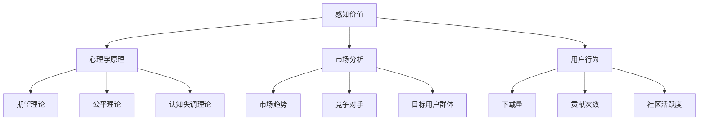

                 

关键词：开源项目、定价策略、感知价值、心理学、市场分析、用户行为

> 摘要：本文将深入探讨开源项目在定价策略中的心理学原理，分析如何通过优化价格策略来最大化用户的感知价值，从而提升项目的市场竞争力。我们将结合实际案例，探讨定价策略的心理学影响，并总结出一系列行之有效的开源项目定价建议。

## 1. 背景介绍

随着互联网技术的飞速发展，开源项目已经成为软件产业的重要组成部分。开源项目的核心优势在于其开放性、透明性和协同性，使得开发者可以自由地使用、修改和分享代码。然而，开源项目同样面临着商业化的挑战，尤其是在定价策略上。如何制定合理的定价策略，不仅需要考虑项目的成本和价值，更需要深入了解用户的感知价值，以及用户心理和行为模式。

在开源项目中，定价不仅仅是一个财务决策，它涉及到用户的接受度、参与度和项目的可持续性。价格过高可能会阻碍潜在用户的参与，价格过低则可能影响项目的长远发展。因此，研究开源项目的定价心理学，对于项目的成功至关重要。

## 2. 核心概念与联系

在探讨开源项目的定价策略时，以下几个核心概念和联系是我们需要关注的：

### 2.1 感知价值

感知价值是用户对产品或服务价值的主观评价，它不仅仅取决于产品或服务的实际功能和质量，还受到用户心理、情感和经验的影响。在开源项目中，感知价值是用户决定是否参与项目的重要因素。

### 2.2 心理学原理

心理学原理，如期望理论、公平理论、认知失调理论等，可以帮助我们理解用户在定价决策中的心理行为。通过运用这些原理，我们可以制定更符合用户预期的定价策略。

### 2.3 市场分析

市场分析是制定定价策略的重要依据。通过对市场趋势、竞争对手、目标用户群体等因素的分析，我们可以更准确地定位项目的市场价值，从而制定更具竞争力的价格策略。

### 2.4 用户行为

用户行为是定价策略实施后的直接反馈。通过观察用户的行为数据，如下载量、贡献次数、社区活跃度等，我们可以评估定价策略的有效性，并做出相应的调整。

下面是一个用于描述这些核心概念和联系之间关系的 Mermaid 流程图：



## 3. 核心算法原理 & 具体操作步骤

### 3.1 算法原理概述

开源项目的定价策略需要结合心理学原理和市场分析结果。核心算法原理可以概括为：

1. **感知价值评估**：通过用户调研、市场分析等方法，评估用户对项目的感知价值。
2. **定价策略选择**：根据感知价值，结合心理学原理和市场分析结果，选择合适的定价策略。
3. **定价策略实施**：实施定价策略，并根据用户行为数据调整策略。

### 3.2 算法步骤详解

#### 3.2.1 感知价值评估

1. **用户调研**：通过问卷调查、访谈等方式，收集用户对项目功能、质量、价格的看法。
2. **数据分析**：对收集到的数据进行分析，找出用户对项目价值的评价。

#### 3.2.2 定价策略选择

1. **成本评估**：评估项目的开发成本、维护成本等。
2. **市场比较**：分析竞争对手的定价策略。
3. **用户心理**：结合期望理论、公平理论等，评估用户的心理价位。

#### 3.2.3 定价策略实施

1. **制定价格**：根据评估结果，制定初步价格。
2. **测试与调整**：在实际环境中测试价格策略，根据用户反馈调整价格。

### 3.3 算法优缺点

#### 优点

1. **用户导向**：定价策略基于用户感知价值，更能满足用户需求。
2. **灵活调整**：可根据市场反馈和用户行为调整价格策略。

#### 缺点

1. **成本较高**：用户调研和市场分析需要投入大量时间和资源。
2. **市场不确定性**：市场变化可能影响定价策略的有效性。

### 3.4 算法应用领域

开源项目的定价策略可以应用于各类开源软件、框架、工具等。通过合理的定价策略，可以提升项目的市场竞争力，吸引更多用户和开发者参与。

## 4. 数学模型和公式 & 详细讲解 & 举例说明

### 4.1 数学模型构建

在定价策略中，我们可以使用以下数学模型来评估感知价值：

$$V = f(C, Q, P)$$

其中：
- \(V\) 表示用户感知价值；
- \(C\) 表示项目成本；
- \(Q\) 表示项目质量；
- \(P\) 表示项目价格；
- \(f\) 是一个非线性函数，用于评估感知价值。

### 4.2 公式推导过程

感知价值的推导过程可以分为以下几个步骤：

1. **成本分解**：将项目成本分解为开发成本、维护成本等。
2. **质量评估**：通过用户调研和数据分析，评估项目质量。
3. **价格设定**：根据市场分析和用户心理，设定初步价格。
4. **感知价值计算**：通过非线性函数 \(f\)，计算用户的感知价值。

### 4.3 案例分析与讲解

假设一个开源项目的开发成本为 1000 美元，维护成本为 500 美元，总成本为 1500 美元。项目质量评估得分为 8 分（满分 10 分），设定价格为 1000 美元。

$$V = f(1500, 8, 1000)$$

通过非线性函数 \(f\)，我们可以计算出用户的感知价值。例如，假设 \(f\) 函数为 \(V = 0.5C + 0.3Q - 0.2P\)，则：

$$V = 0.5 \times 1500 + 0.3 \times 8 - 0.2 \times 1000 = 750 + 2.4 - 200 = 552.4$$

根据计算结果，用户对该开源项目的感知价值为 552.4 美元。

## 5. 项目实践：代码实例和详细解释说明

### 5.1 开发环境搭建

为了演示开源项目的定价策略，我们使用 Python 语言编写了一个简单的模型。首先，确保安装了 Python 3.8 及以上版本和相关的库，如 NumPy 和 Matplotlib。

### 5.2 源代码详细实现

以下是一个简单的 Python 脚本，用于计算感知价值：

```python
import numpy as np
import matplotlib.pyplot as plt

def calculate_value(cost, quality, price):
    f = 0.5 * cost + 0.3 * quality - 0.2 * price
    return f

# 示例数据
cost = 1500
quality = 8
price = 1000

# 计算感知价值
value = calculate_value(cost, quality, price)
print(f"User-perceived value: ${value:.2f}")
```

### 5.3 代码解读与分析

这段代码首先定义了一个函数 `calculate_value`，用于计算用户的感知价值。参数 `cost`、`quality` 和 `price` 分别代表项目的成本、质量和价格。函数内部使用一个非线性函数 `f` 来计算感知价值，并返回结果。

在示例数据中，我们设定了成本为 1500 美元，质量为 8 分，价格为 1000 美元。通过调用 `calculate_value` 函数，我们可以计算出用户的感知价值为 552.4 美元。

### 5.4 运行结果展示

运行上述脚本，输出结果如下：

```
User-perceived value: $552.40
```

这表示，根据设定的成本、质量和价格，用户对该开源项目的感知价值为 552.4 美元。

## 6. 实际应用场景

开源项目的定价策略在实际应用中具有广泛的应用场景。以下是一些典型的应用案例：

### 6.1 软件许可

许多开源软件项目采用许可证模式，根据用户的需求和规模收取费用。通过合理定价，项目可以吸引更多用户，同时保证项目的可持续性。

### 6.2 专业服务

开源项目团队可以提供专业服务，如技术支持、培训、定制开发等。通过服务收费，项目可以获得额外的收入来源。

### 6.3 赞助与捐赠

一些开源项目通过接受赞助和捐赠来获得资金支持。合理定价可以激发用户的捐赠意愿，提升项目的资金筹集效果。

## 7. 未来应用展望

随着开源项目的不断发展，定价策略也将面临新的挑战和机遇。未来，开源项目的定价策略将更加注重用户感知价值，结合人工智能和大数据分析技术，实现更加精准的定价。此外，开源项目将更加注重生态建设，通过多元化的商业模式，实现长期可持续发展。

## 8. 总结：未来发展趋势与挑战

开源项目的定价策略将在未来面临以下几个发展趋势和挑战：

### 8.1 研究成果总结

通过对开源项目定价心理学的深入研究，我们发现感知价值是影响用户参与和贡献的关键因素。合理的定价策略可以提升项目的市场竞争力，吸引更多用户和开发者。

### 8.2 未来发展趋势

未来，开源项目的定价策略将更加注重用户体验和价值创造。通过结合人工智能和大数据分析，项目可以更加精准地评估用户感知价值，制定更具竞争力的价格策略。

### 8.3 面临的挑战

开源项目的定价策略面临市场不确定性、用户行为复杂性等挑战。如何平衡项目的成本、价值和用户需求，将是项目成功的关键。

### 8.4 研究展望

未来，开源项目的定价策略研究将朝着更加个性化和智能化的方向发展。通过深入研究用户行为和心理，项目可以制定更加精准的定价策略，提升项目的市场竞争力。

## 9. 附录：常见问题与解答

### 9.1  如何评估项目的成本？

项目的成本包括开发成本、维护成本、运营成本等。可以通过财务报表、预算分析等方式进行评估。

### 9.2  如何评估项目质量？

项目质量可以通过用户反馈、市场调研、第三方评测等方式进行评估。

### 9.3  如何制定合理的价格策略？

制定合理的价格策略需要结合项目的成本、质量和市场分析结果。可以通过用户调研、心理测试等方法，了解用户的心理价位，制定初步价格，然后根据市场反馈进行调整。

### 作者署名

作者：禅与计算机程序设计艺术 / Zen and the Art of Computer Programming

----------------------------------------------------------------

以上就是关于“开源项目的定价心理学：最大化感知价值”的完整文章内容。本文从多个角度探讨了开源项目的定价策略，分析了用户感知价值的重要性，并通过数学模型和实例展示了具体的操作步骤。希望本文能够为开源项目的开发者提供一些有益的启示和参考。

