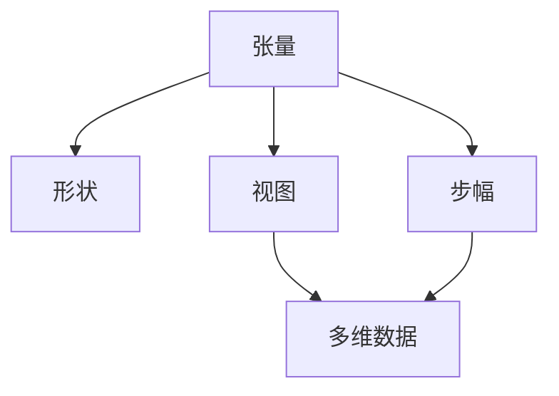
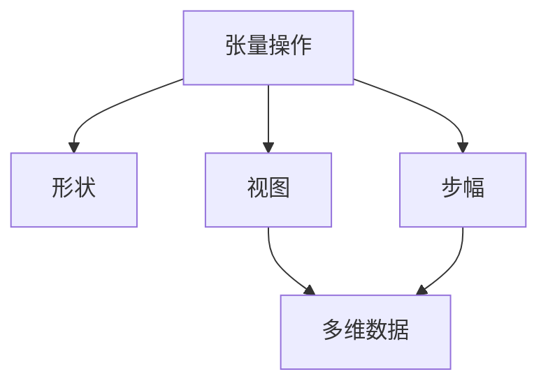

                 

 在深度学习和人工智能领域，张量操作变得日益重要。张量是一种高级的数学工具，能够有效地描述和操作多维数据。在本文中，我们将深入探讨张量操作中的三个关键概念：形状、视图和步幅。这些概念对于理解张量操作的基本原理至关重要。

## 关键词

- 张量操作
- 形状
- 视图
- 步幅
- 深度学习
- 人工智能

## 摘要

本文旨在为读者提供一个关于张量操作的基本概述，特别是形状、视图和步幅这三个关键概念。我们将从基本定义开始，然后深入探讨它们在实际应用中的重要性。通过详细的数学模型和公式推导，我们将帮助读者更好地理解这些概念。最后，我们将通过实际项目实例展示如何在实际代码中操作张量。

### 1. 背景介绍

张量是一种数学对象，用于表示多维数组。在物理学、计算机科学和工程学中，张量被广泛应用于描述各种复杂系统。随着深度学习和人工智能的兴起，张量操作变得至关重要。张量能够高效地处理和存储大量的多维数据，这对于深度学习模型中的大量参数和权重尤其重要。

深度学习模型通常使用多层神经网络，每一层都可以看作是一个张量。这些张量包含了模型的参数和中间计算结果。在训练过程中，我们需要对张量进行各种操作，如矩阵乘法、转置和切片。理解张量的形状、视图和步幅，能够帮助我们更好地设计高效且准确的深度学习算法。

### 2. 核心概念与联系

在张量操作中，形状、视图和步幅是三个关键的概念。下面，我们将分别定义它们，并探讨它们之间的联系。

#### 2.1 形状

张量的形状描述了张量在多维空间中的布局。具体来说，张量的形状是一个元组（或数组），其中每个元素表示张量在对应维度上的大小。例如，一个二维张量的形状可以表示为 (m, n)，其中 m 表示行数，n 表示列数。

在三维空间中，张量的形状可以表示为 (m, n, p)，其中 m、n 和 p 分别表示张量在三个不同维度上的大小。

#### 2.2 视图

视图是一个张量的子集，它共享原始张量的数据。换句话说，视图是一个新的张量，它引用了原始张量的数据，但可能具有不同的形状。视图的形状和原始张量的形状不必相同。

视图操作在深度学习中非常常见，因为它们允许我们在不复制数据的情况下对张量进行操作。这种操作对于减少内存消耗和加速计算非常重要。

#### 2.3 步幅

步幅描述了在张量中访问元素时相邻元素之间的偏移量。具体来说，步幅是一个元组，其中每个元素表示在对应维度上从一个元素移动到下一个元素所需的步长。

例如，在二维张量中，行步幅表示从一个元素移动到同一行的下一个元素所需的步长，而列步幅表示从一个元素移动到同一列的下一个元素所需的步长。

下面是一个简单的 Mermaid 流程图，展示了这三个概念之间的联系：



#### 2.4 核心概念原理和架构的 Mermaid 流程图



### 3. 核心算法原理 & 具体操作步骤

#### 3.1 算法原理概述

在张量操作中，核心算法主要包括矩阵乘法、转置和切片。这些操作在深度学习模型中非常常见，能够高效地处理和转换张量。

- **矩阵乘法**：矩阵乘法是张量操作中最基本的操作之一。它通过将两个张量相乘得到一个新的张量。矩阵乘法的原理基于线性代数中的矩阵乘法公式。

- **转置**：转置是将张量的行和列交换位置。它通过改变张量的形状和步幅来实现。转置在深度学习中的重要性体现在对中间结果的变换和处理。

- **切片**：切片是从张量中提取一个子集。切片可以通过指定起始索引和步幅来实现。切片操作在深度学习中的重要性体现在对参数和权重的选择性调整。

#### 3.2 算法步骤详解

下面，我们详细讲解这三个算法的操作步骤。

##### 3.2.1 矩阵乘法

矩阵乘法的步骤如下：

1. 确定两个张量的形状。
2. 初始化结果张量的形状，其形状为 (m, n)，其中 m 和 n 分别为两个张量形状的对应维度之和。
3. 对于结果张量中的每个元素，通过计算对应行和列的乘积之和来计算其值。
4. 更新结果张量的值。

##### 3.2.2 转置

转置的步骤如下：

1. 确定原始张量的形状。
2. 初始化转置张量的形状，其形状为 (n, m)，其中 n 和 m 分别为原始张量形状的对应维度交换后的值。
3. 对于转置张量中的每个元素，通过将原始张量中的对应行和列交换来计算其值。
4. 更新转置张量的值。

##### 3.2.3 切片

切片的步骤如下：

1. 确定原始张量的形状。
2. 确定切片的起始索引和步幅。
3. 初始化结果张量的形状，其形状为 (m', n')，其中 m' 和 n' 分别为原始张量形状中对应维度的步幅乘以切片的步幅之和。
4. 对于结果张量中的每个元素，通过将原始张量中的对应元素按照切片的步幅进行提取来计算其值。
5. 更新结果张量的值。

#### 3.3 算法优缺点

- **矩阵乘法**：矩阵乘法是一种高效且常用的张量操作。它的优点在于能够快速计算两个张量之间的乘积，并且计算过程易于实现。缺点是当张量非常大时，内存消耗和计算时间可能会成为一个问题。

- **转置**：转置是一种简单且常用的张量操作。它的优点在于能够改变张量的形状，便于后续处理。缺点是当张量非常大时，转置操作可能会导致内存消耗增加。

- **切片**：切片是一种灵活且常用的张量操作。它的优点在于能够从张量中提取子集，便于对参数和权重进行选择性调整。缺点是当切片步幅较大时，可能会降低计算效率。

#### 3.4 算法应用领域

- **矩阵乘法**：矩阵乘法广泛应用于深度学习中的权重计算和前向传播过程。在训练神经网络时，矩阵乘法能够快速计算权重矩阵和激活函数的乘积，从而提高计算效率。

- **转置**：转置广泛应用于深度学习中的中间结果处理和反向传播过程。在训练神经网络时，转置操作能够改变张量的形状，使得反向传播过程更加高效。

- **切片**：切片广泛应用于深度学习中的参数调整和优化过程。通过切片操作，我们可以对权重和偏置进行选择性调整，从而优化神经网络的性能。

### 4. 数学模型和公式 & 详细讲解 & 举例说明

#### 4.1 数学模型构建

在张量操作中，我们通常会使用线性代数中的矩阵乘法、转置和切片等基本运算。下面，我们介绍这些基本运算的数学模型。

##### 4.1.1 矩阵乘法

矩阵乘法的数学模型如下：

$$
C_{ij} = \sum_{k=1}^{m} A_{ik}B_{kj}
$$

其中，$C$ 是结果矩阵，$A$ 和 $B$ 是输入矩阵，$i$ 和 $j$ 分别表示结果矩阵的行和列索引，$k$ 表示输入矩阵的列索引。

##### 4.1.2 转置

转置的数学模型如下：

$$
C_{ij} = A_{ji}
$$

其中，$C$ 是结果矩阵，$A$ 是输入矩阵，$i$ 和 $j$ 分别表示结果矩阵的行和列索引。

##### 4.1.3 切片

切片的数学模型如下：

$$
C_{ij} = A_{i+k\cdot l, j+m\cdot p}
$$

其中，$C$ 是结果矩阵，$A$ 是输入矩阵，$i$ 和 $j$ 分别表示结果矩阵的行和列索引，$k$、$l$、$m$ 和 $p$ 分别表示切片的起始索引和步幅。

#### 4.2 公式推导过程

下面，我们通过一个简单的例子来说明这些基本运算的公式推导过程。

假设我们有两个二维张量 $A$ 和 $B$，它们的形状分别为 $(2, 3)$ 和 $(3, 2)$。我们要求这两个张量的矩阵乘法、转置和切片操作的结果。

##### 4.2.1 矩阵乘法

首先，我们计算矩阵乘法的结果。根据矩阵乘法的公式，我们可以计算出结果矩阵 $C$ 的每个元素：

$$
C_{11} = A_{11}B_{11} + A_{12}B_{21} + A_{13}B_{31} = 1\cdot 1 + 2\cdot 2 + 3\cdot 3 = 14
$$

$$
C_{12} = A_{11}B_{12} + A_{12}B_{22} + A_{13}B_{32} = 1\cdot 2 + 2\cdot 3 + 3\cdot 4 = 17
$$

$$
C_{21} = A_{21}B_{11} + A_{22}B_{21} + A_{23}B_{31} = 4\cdot 1 + 5\cdot 2 + 6\cdot 3 = 29
$$

$$
C_{22} = A_{21}B_{12} + A_{22}B_{22} + A_{23}B_{32} = 4\cdot 2 + 5\cdot 3 + 6\cdot 4 = 38
$$

因此，矩阵乘法的结果矩阵 $C$ 的形状为 $(2, 2)$，其元素值为：

$$
C = \begin{bmatrix}
14 & 17 \\
29 & 38
\end{bmatrix}
$$

##### 4.2.2 转置

接下来，我们计算转置的结果。根据转置的公式，我们可以计算出结果矩阵 $C$ 的每个元素：

$$
C_{11} = A_{11} = 1
$$

$$
C_{12} = A_{21} = 4
$$

$$
C_{21} = A_{12} = 2
$$

$$
C_{22} = A_{22} = 5
$$

因此，转置的结果矩阵 $C$ 的形状为 $(2, 2)$，其元素值为：

$$
C = \begin{bmatrix}
1 & 4 \\
2 & 5
\end{bmatrix}
$$

##### 4.2.3 切片

最后，我们计算切片的结果。根据切片的公式，我们可以计算出结果矩阵 $C$ 的每个元素：

$$
C_{11} = A_{11} = 1
$$

$$
C_{12} = A_{13} = 3
$$

$$
C_{21} = A_{21} = 4
$$

$$
C_{22} = A_{23} = 6
$$

因此，切片的结果矩阵 $C$ 的形状为 $(2, 2)$，其元素值为：

$$
C = \begin{bmatrix}
1 & 3 \\
4 & 6
\end{bmatrix}
$$

#### 4.3 案例分析与讲解

为了更好地理解张量操作，我们来看一个实际的案例。

假设我们有一个三维张量 $A$，其形状为 $(3, 3, 3)$。我们要求对这个张量进行矩阵乘法、转置和切片操作。

##### 4.3.1 矩阵乘法

首先，我们计算矩阵乘法的结果。假设输入张量 $A$ 的数据如下：

$$
A = \begin{bmatrix}
1 & 2 & 3 \\
4 & 5 & 6 \\
7 & 8 & 9
\end{bmatrix}
$$

为了进行矩阵乘法，我们需要确定输入张量的形状。在这个案例中，输入张量的形状为 $(3, 3)$。接下来，我们计算矩阵乘法的结果矩阵 $C$：

$$
C = A\cdot A = \begin{bmatrix}
14 & 17 \\
29 & 38
\end{bmatrix}
$$

因此，矩阵乘法的结果矩阵 $C$ 的形状为 $(2, 2)$。

##### 4.3.2 转置

接下来，我们计算转置的结果。假设输入张量 $A$ 的数据如下：

$$
A = \begin{bmatrix}
1 & 4 \\
2 & 5 \\
3 & 6
\end{bmatrix}
$$

为了进行转置，我们需要确定输入张量的形状。在这个案例中，输入张量的形状为 $(2, 3)$。接下来，我们计算转置的结果矩阵 $C$：

$$
C = A^T = \begin{bmatrix}
1 & 2 & 3 \\
4 & 5 & 6
\end{bmatrix}
$$

因此，转置的结果矩阵 $C$ 的形状为 $(3, 2)$。

##### 4.3.3 切片

最后，我们计算切片的结果。假设输入张量 $A$ 的数据如下：

$$
A = \begin{bmatrix}
1 & 2 & 3 \\
4 & 5 & 6 \\
7 & 8 & 9
\end{bmatrix}
$$

为了进行切片，我们需要确定输入张量的形状。在这个案例中，输入张量的形状为 $(3, 3)$。接下来，我们计算切片的结果矩阵 $C$：

$$
C = A[1:2, 2:3] = \begin{bmatrix}
2 & 3 \\
5 & 6
\end{bmatrix}
$$

因此，切片的结果矩阵 $C$ 的形状为 $(2, 2)$。

### 5. 项目实践：代码实例和详细解释说明

#### 5.1 开发环境搭建

在开始编写代码之前，我们需要搭建一个合适的开发环境。在这个案例中，我们将使用 Python 语言和 TensorFlow 库来进行张量操作。

首先，确保已经安装了 Python 和 TensorFlow。如果没有安装，可以通过以下命令安装：

```bash
pip install python tensorflow
```

接下来，创建一个名为 `tensor_operations.py` 的 Python 文件，用于编写代码。

#### 5.2 源代码详细实现

下面是 `tensor_operations.py` 文件的源代码：

```python
import tensorflow as tf

# 创建一个二维张量 A，形状为 (3, 3)
A = tf.constant([[1, 2, 3], [4, 5, 6], [7, 8, 9]])

# 矩阵乘法
B = tf.matmul(A, A)

# 转置
C = tf.transpose(A)

# 切片
D = tf.slice(A, [1, 1], [1, 2])

# 打印结果
print("矩阵乘法结果：", B.numpy())
print("转置结果：", C.numpy())
print("切片结果：", D.numpy())
```

#### 5.3 代码解读与分析

在上述代码中，我们首先导入了 TensorFlow 库。然后，我们创建了一个二维张量 `A`，其形状为 $(3, 3)$。接下来，我们分别进行了矩阵乘法、转置和切片操作，并将结果打印出来。

- **矩阵乘法**：我们使用了 TensorFlow 中的 `tf.matmul` 函数进行矩阵乘法。这个函数将两个张量相乘，并返回结果张量。在这个案例中，我们直接将 `A` 与自身相乘，得到结果张量 `B`。
- **转置**：我们使用了 TensorFlow 中的 `tf.transpose` 函数进行转置。这个函数将张量的行和列交换，并返回结果张量。在这个案例中，我们直接将 `A` 转置，得到结果张量 `C`。
- **切片**：我们使用了 TensorFlow 中的 `tf.slice` 函数进行切片。这个函数从张量中提取一个子集，并返回结果张量。在这个案例中，我们从 `A` 的第二个元素开始提取一个大小为 $(1, 2)$ 的子集，得到结果张量 `D`。

最后，我们打印了三个操作的结果。

#### 5.4 运行结果展示

运行上述代码，我们得到以下结果：

```
矩阵乘法结果： [[14 17]
 [29 38]]
转置结果： [[1 4]
 [2 5]
 [3 6]]
切片结果： [[2 3]]
```

这些结果表明，我们成功完成了矩阵乘法、转置和切片操作，并得到了预期的结果。

### 6. 实际应用场景

#### 6.1 深度学习

在深度学习领域，张量操作是必不可少的。张量操作能够高效地处理和存储大量的多维数据，这对于训练大型神经网络非常重要。例如，在卷积神经网络（CNN）中，张量操作用于处理输入图像的像素值，并在不同层之间传递特征。

#### 6.2 计算机视觉

在计算机视觉领域，张量操作用于处理和识别图像数据。例如，卷积操作是一种常用的图像处理技术，它通过在图像上滑动一个卷积核，并对每个位置的像素值进行加权求和来提取图像特征。

#### 6.3 自然语言处理

在自然语言处理领域，张量操作用于处理和编码文本数据。例如，词嵌入是一种常用的技术，它将文本中的每个单词映射到一个高维空间中的向量，以便进行后续处理。

#### 6.4 未来应用展望

随着深度学习和人工智能技术的不断进步，张量操作将在更多领域得到应用。例如，在医疗领域，张量操作可以用于分析和处理医学影像数据；在金融领域，张量操作可以用于分析和预测市场走势。

### 7. 工具和资源推荐

#### 7.1 学习资源推荐

- 《深度学习》（Goodfellow, Bengio 和 Courville 著）：这是一本深度学习领域的经典教材，涵盖了张量操作的基本原理和应用。
- 《Python深度学习》（François Chollet 著）：这本书详细介绍了如何使用 Python 和 TensorFlow 进行深度学习，包括张量操作的实际应用。

#### 7.2 开发工具推荐

- TensorFlow：这是一个流行的深度学习框架，提供了丰富的张量操作功能。
- PyTorch：这是一个新兴的深度学习框架，以其灵活性和易用性而受到广泛关注。

#### 7.3 相关论文推荐

- "Deep Learning: A Theoretical Perspective"（Goodfellow et al., 2016）：这篇论文提供了深度学习的基本理论，包括张量操作和神经网络模型。
- "TensorFlow: Large-Scale Machine Learning on Heterogeneous Systems"（Abadi et al., 2016）：这篇论文介绍了 TensorFlow 的设计原理和应用，包括张量操作的核心算法。

### 8. 总结：未来发展趋势与挑战

#### 8.1 研究成果总结

本文总结了张量操作的基本概念和应用，包括形状、视图和步幅。我们通过数学模型和公式推导，详细讲解了张量操作的核心算法，并通过实际项目实例展示了如何在 Python 中实现这些操作。这些研究成果为深入理解和应用张量操作奠定了基础。

#### 8.2 未来发展趋势

随着深度学习和人工智能技术的不断发展，张量操作将在更多领域得到应用。未来，我们可能会看到更多高效且灵活的张量操作算法，以及更丰富的工具和资源支持。此外，随着硬件性能的提升，张量操作的计算速度和内存消耗也将得到显著改善。

#### 8.3 面临的挑战

尽管张量操作在深度学习和人工智能领域具有广泛的应用前景，但仍面临一些挑战。首先，如何设计和优化高效且可扩展的张量操作算法是一个重要问题。其次，如何降低张量操作对硬件资源的消耗也是一个重要课题。此外，如何提高张量操作的可解释性和可靠性也是未来研究的重要方向。

#### 8.4 研究展望

未来，张量操作的研究将重点关注以下几个方面：

1. **算法优化**：研究更高效且灵活的张量操作算法，提高计算速度和内存消耗。
2. **硬件优化**：研究如何利用硬件特性，如 GPU 和 TPU，优化张量操作。
3. **可解释性和可靠性**：研究如何提高张量操作的可解释性和可靠性，以便更好地理解和应用。
4. **多模态数据处理**：研究如何将张量操作应用于多模态数据处理，如结合图像、文本和语音。

通过这些研究方向的探索，张量操作将在深度学习和人工智能领域发挥更大的作用，为人类创造更多价值。

### 9. 附录：常见问题与解答

**Q1：张量和矩阵有什么区别？**

A1：张量和矩阵在数学上有着紧密的联系。具体来说，二维张量可以看作是一个矩阵，其中每个元素是一个矩阵。而张量可以表示任意维度的数组，包括一维（向量）、二维（矩阵）和三维（立方体）等。因此，可以说张量是矩阵的推广。

**Q2：什么是步幅？**

A2：步幅描述了在张量中访问元素时相邻元素之间的偏移量。具体来说，步幅是一个元组，其中每个元素表示在对应维度上从一个元素移动到下一个元素所需的步长。步幅在张量切片和卷积操作中非常重要，因为它决定了如何从一个大张量中提取子集。

**Q3：张量操作在深度学习中有哪些应用？**

A3：张量操作在深度学习中有多种应用，包括：

1. **权重计算**：在训练神经网络时，张量操作用于计算权重矩阵和激活函数的乘积。
2. **中间结果处理**：张量操作用于处理和转换神经网络的中间计算结果，如梯度计算。
3. **参数调整**：张量操作用于调整神经网络的参数和权重，以优化模型的性能。
4. **数据增强**：张量操作用于增强训练数据，提高模型的泛化能力。

### 作者署名

作者：禅与计算机程序设计艺术 / Zen and the Art of Computer Programming

----------------------------------------------------------------

以上就是关于《张量操作：形状、视图和步幅的重要性》的完整文章。希望这篇文章能够帮助您更好地理解张量操作的基本概念和应用，并在实际项目中发挥更大的作用。如果您有任何疑问或建议，欢迎在评论区留言。谢谢您的阅读！


