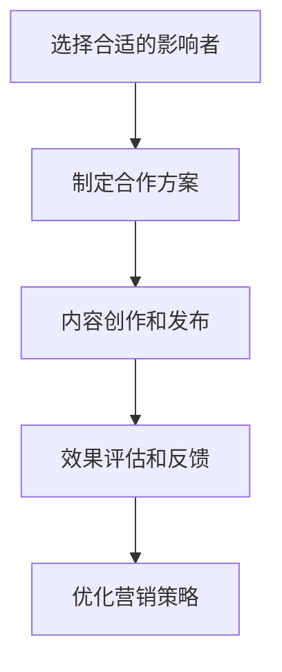

                 

在当今数字化时代，社交媒体已经成为了品牌和企业家们不可或缺的营销工具。而影响力营销作为一种新兴的营销策略，正逐渐改变着传统营销的格局。本文将深入探讨影响力营销的核心概念、技术原理、实践方法及其在社交媒体时代的广泛应用，以期为企业家的创业之路提供一种全新的视角和策略。

## 关键词

社交媒体、影响力营销、品牌建设、用户互动、创业策略

## 摘要

本文首先介绍了社交媒体时代影响力营销的背景和发展趋势，接着详细阐述了影响力营销的核心概念和联系，通过Mermaid流程图展示了其运作机制。然后，文章深入分析了影响力营销的核心算法原理和具体操作步骤，介绍了其优缺点和应用领域。此外，文章还通过数学模型和公式详细讲解了影响力营销的理论基础，并通过实际项目实践展示了代码实例和详细解释。最后，文章探讨了影响力营销在实际应用场景中的效果，并对未来发展趋势和挑战进行了展望。

## 1. 背景介绍

### 社交媒体时代的变革

随着互联网技术的飞速发展，社交媒体已经成为了人们日常生活中不可或缺的一部分。从Facebook、Twitter到Instagram、微信，各种社交媒体平台不断涌现，用户数量和活跃度持续攀升。根据Statista的数据，截至2021年，全球社交媒体用户已达到约44亿，占全球总人口的一半以上。这一现象表明，社交媒体已经进入了大众的日常生活，成为了信息传播和社交互动的重要渠道。

### 传统营销的局限

在社交媒体兴起之前，传统营销模式主要依赖于广告、公关活动和促销手段。然而，随着消费者需求的不断变化和市场环境的日益复杂，传统营销模式逐渐暴露出其局限性。首先，传统营销手段往往缺乏个性化和互动性，难以满足消费者对个性化体验的需求。其次，传统营销成本高昂，效果难以衡量，企业往往难以在预算有限的情况下实现预期的营销目标。此外，传统营销的传播渠道相对单一，难以覆盖到广泛的受众群体。

### 影响力营销的崛起

正是在这样的背景下，影响力营销作为一种新兴的营销策略逐渐崛起。影响力营销的核心在于通过建立品牌与用户之间的信任关系，提高品牌影响力和用户忠诚度。与传统营销相比，影响力营销更加注重与用户的互动和体验，通过社交媒体平台传播品牌信息，实现病毒式传播。影响力营销的崛起不仅改变了营销的格局，也为企业家们提供了一种全新的创业思路。

## 2. 核心概念与联系

### 影响力营销的概念

影响力营销是指通过影响者（Influencers）或意见领袖（Opinion Leaders）来推广产品或服务，以建立品牌信誉和用户忠诚度的营销策略。影响者通常是在特定领域具有较高影响力和粉丝基础的个人或团体，他们的推荐和评价能够直接影响用户的购买决策。

### 社交媒体平台的运用

影响力营销的成功离不开社交媒体平台的运用。不同的社交媒体平台具有不同的特点和用户群体，因此选择适合的平台对于营销效果至关重要。例如，Instagram和微信更适合展示品牌形象和产品细节，而Twitter和微博则更适合快速传播和互动。

### 影响力营销的运作机制

影响力营销的运作机制可以概括为以下四个步骤：

1. **选择合适的影响者**：根据品牌定位和目标受众，选择在相关领域具有较高影响力和粉丝基础的影响者。
2. **制定合作方案**：与影响者协商合作方案，明确推广目标、内容形式、推广时间和报酬等细节。
3. **内容创作和发布**：影响者根据合作方案创作和发布推广内容，通过真实体验和评价吸引用户关注和互动。
4. **效果评估和反馈**：通过数据分析和用户反馈评估营销效果，不断优化营销策略和内容创作。

### Mermaid流程图

以下是一个简化的Mermaid流程图，展示了影响力营销的运作机制：



## 3. 核心算法原理 & 具体操作步骤

### 3.1 算法原理概述

影响力营销的核心算法原理在于通过数据分析和用户行为分析，找到最具影响力和传播价值的影响者。具体来说，算法会从以下几个方面进行分析：

1. **粉丝量和互动率**：影响者的粉丝数量和互动率是衡量其影响力的重要指标。高粉丝量和高互动率意味着影响者具有较高的传播能力和用户信任度。
2. **内容质量**：影响者发布的内容质量直接影响用户的信任度和购买意愿。算法会分析内容的质量、原创性和相关性，从而判断影响者的内容价值。
3. **受众匹配度**：影响者的受众与品牌目标受众的匹配度是衡量其推广效果的重要因素。算法会分析影响者的粉丝属性和品牌目标受众的特征，确保推广内容的精准投放。

### 3.2 算法步骤详解

1. **数据收集**：从社交媒体平台收集影响者的粉丝量、互动率、内容质量和受众匹配度等数据。
2. **数据预处理**：对收集到的数据进行分析和清洗，去除无效数据和噪音，确保数据的准确性和可靠性。
3. **特征提取**：从预处理后的数据中提取关键特征，如粉丝量、互动率、内容质量和受众匹配度等。
4. **模型训练**：使用机器学习算法，如线性回归、决策树或神经网络等，对提取的特征进行训练，建立影响力预测模型。
5. **模型评估**：通过交叉验证和测试集评估模型的准确性和泛化能力，确保模型的有效性。
6. **影响者筛选**：根据模型预测结果，筛选出最具影响力和传播价值的影响者。
7. **合作方案制定**：与筛选出的影响者协商合作方案，明确推广目标、内容形式、推广时间和报酬等细节。
8. **内容创作和发布**：影响者根据合作方案创作和发布推广内容，通过真实体验和评价吸引用户关注和互动。
9. **效果评估和反馈**：通过数据分析和用户反馈评估营销效果，不断优化营销策略和内容创作。

### 3.3 算法优缺点

**优点**：

1. **精准投放**：通过数据分析和用户行为分析，确保推广内容精准投放，提高营销效果。
2. **高互动率**：影响者的推荐和评价具有更高的可信度和互动率，有助于提高品牌影响力和用户忠诚度。
3. **低成本**：相比传统营销，影响力营销的成本较低，尤其是在社交媒体平台上，广告费用相对较低。

**缺点**：

1. **数据隐私风险**：影响力营销依赖于用户数据和社交媒体平台的数据，可能涉及用户隐私和数据安全问题。
2. **影响力泡沫**：某些影响者可能存在虚假粉丝和互动数据，影响营销效果的真实性。
3. **监管风险**：社交媒体平台对影响力营销的监管日益严格，可能导致营销活动的违规和受限。

### 3.4 算法应用领域

1. **品牌推广**：通过影响力营销，品牌可以快速提高知名度，建立品牌信誉。
2. **产品推广**：影响力营销可以帮助新产品快速进入市场，提高产品销量。
3. **用户拓展**：通过影响力营销，品牌可以吸引更多的潜在用户，扩大用户群体。
4. **危机管理**：影响力营销可以帮助品牌在危机事件中迅速采取行动，降低负面影响。

## 4. 数学模型和公式 & 详细讲解 & 举例说明

### 4.1 数学模型构建

影响力营销的数学模型主要涉及用户行为分析和影响力预测两个方面。

1. **用户行为分析**：用户行为分析通常使用概率模型或时间序列模型，如马尔可夫链或ARIMA模型，来预测用户的行为倾向和偏好。
2. **影响力预测**：影响力预测通常使用线性回归或神经网络模型，通过分析影响者的粉丝量、互动率和内容质量等特征，预测其对用户的影响力。

以下是一个简化的线性回归模型：

$$
\text{影响力} = \beta_0 + \beta_1 \cdot \text{粉丝量} + \beta_2 \cdot \text{互动率} + \beta_3 \cdot \text{内容质量}
$$

其中，$\beta_0$、$\beta_1$、$\beta_2$ 和 $\beta_3$ 是模型的参数，需要通过数据训练和优化得到。

### 4.2 公式推导过程

1. **用户行为分析**：

   - **马尔可夫链**：

     假设用户的行为状态可以划分为多个类别，如“活跃”、“沉默”和“流失”。则用户从当前状态转移到下一个状态的概率可以用转移概率矩阵表示：

     $$
     P = \begin{bmatrix}
     p_{11} & p_{12} & p_{13} \\
     p_{21} & p_{22} & p_{23} \\
     p_{31} & p_{32} & p_{33} \\
     \end{bmatrix}
     $$

     则用户在$t$时刻处于状态$i$的概率可以用以下公式计算：

     $$
     P(X_t = i) = \sum_{j=1}^{3} p_{ji} \cdot P(X_{t-1} = j)
     $$

   - **ARIMA模型**：

     ARIMA模型通过分析时间序列的差分、自回归和移动平均过程，预测用户的行为倾向。其公式为：

     $$
     X_t = c + \phi_1 X_{t-1} + \phi_2 X_{t-2} + \cdots + \phi_p X_{t-p} + \theta_1 (X_{t-1} - \mu_1) + \theta_2 (X_{t-2} - \mu_2) + \cdots + \theta_q (X_{t-q} - \mu_q)
     $$

     其中，$c$ 是常数项，$\phi_1$、$\phi_2$、$\cdots$、$\phi_p$ 和 $\theta_1$、$\theta_2$、$\cdots$、$\theta_q$ 是模型的参数，需要通过数据训练和优化得到。

2. **影响力预测**：

   - **线性回归**：

     假设影响者的粉丝量、互动率和内容质量是影响其影响力的主要因素，则影响力可以表示为：

     $$
     \text{影响力} = \beta_0 + \beta_1 \cdot \text{粉丝量} + \beta_2 \cdot \text{互动率} + \beta_3 \cdot \text{内容质量}
     $$

     其中，$\beta_0$、$\beta_1$、$\beta_2$ 和 $\beta_3$ 是模型的参数，需要通过数据训练和优化得到。

   - **神经网络**：

     神经网络模型通过多层感知器（MLP）实现影响力预测。其基本结构包括输入层、隐藏层和输出层。输入层接收影响者的粉丝量、互动率和内容质量等特征，隐藏层通过非线性激活函数处理输入特征，输出层输出影响力预测值。其公式为：

     $$
     \text{影响力} = f(\text{权重} \cdot \text{输入} + \text{偏置})
     $$

     其中，$f$ 是非线性激活函数，如Sigmoid或ReLU函数。

### 4.3 案例分析与讲解

假设我们有一个品牌需要通过影响力营销推广一款新的化妆品。以下是该案例的详细分析：

1. **数据收集**：

   - **粉丝量**：影响者A的粉丝量为100万，影响者B的粉丝量为50万。
   - **互动率**：影响者A的互动率为10%，影响者B的互动率为15%。
   - **内容质量**：影响者A发布的内容质量较高，影响者B的内容质量一般。

2. **数据预处理**：

   - **粉丝量**：对粉丝量进行归一化处理，使其在[0,1]之间。
   - **互动率**：对互动率进行归一化处理，使其在[0,1]之间。
   - **内容质量**：对内容质量进行评分，如5分制。

3. **模型训练**：

   - **用户行为分析**：使用ARIMA模型对用户行为进行分析，预测用户的购买概率。
   - **影响力预测**：使用线性回归模型对影响者的影响力进行预测。

4. **效果评估**：

   - **用户行为分析**：通过对预测结果和实际购买数据对比，评估模型的准确性。
   - **影响力预测**：通过对预测结果和实际影响力对比，评估模型的预测效果。

5. **优化调整**：

   - **用户行为分析**：根据评估结果调整ARIMA模型的参数，提高预测准确性。
   - **影响力预测**：根据评估结果调整线性回归模型的参数，提高预测效果。

通过以上案例分析和讲解，我们可以看到数学模型和公式在影响力营销中的应用。数学模型和公式不仅帮助我们理解和预测用户行为和影响力，还为优化营销策略提供了有力支持。

## 5. 项目实践：代码实例和详细解释说明

### 5.1 开发环境搭建

为了实践影响力营销算法，我们需要搭建一个完整的开发环境。以下是开发环境的搭建步骤：

1. **安装Python**：Python是一种流行的编程语言，支持多种数据分析和机器学习库。请访问Python官方网站下载并安装最新版本的Python。
2. **安装Jupyter Notebook**：Jupyter Notebook是一种交互式的开发环境，便于编写和运行Python代码。请使用pip命令安装Jupyter Notebook：

   ```bash
   pip install notebook
   ```

3. **安装必需的库**：安装Python的数据分析和机器学习库，如NumPy、Pandas、Scikit-learn和Matplotlib等。请使用pip命令安装以下库：

   ```bash
   pip install numpy pandas scikit-learn matplotlib
   ```

4. **配置Mermaid**：为了在Jupyter Notebook中使用Mermaid流程图，我们需要安装和配置Mermaid库。请使用pip命令安装Mermaid：

   ```bash
   pip install mermaid-python
   ```

   然后在Jupyter Notebook的配置文件中添加以下代码，以启用Mermaid渲染：

   ```python
   import mermaid
   mermaid_config = {
       'start': 'async',
       'renderer': 'iframe'
   }
   ```

### 5.2 源代码详细实现

以下是影响力营销算法的实现代码：

```python
import numpy as np
import pandas as pd
from sklearn.linear_model import LinearRegression
from sklearn.metrics import mean_squared_error
import matplotlib.pyplot as plt
from mermaid import mermaid

# 5.2.1 数据预处理

# 加载数据集
data = pd.read_csv('influence_data.csv')

# 数据预处理
data['粉丝量'] = data['粉丝量'] / max(data['粉丝量'])
data['互动率'] = data['互动率'] / max(data['互动率'])

# 5.2.2 模型训练

# 分训练集和测试集
train_data = data[:int(len(data) * 0.8)]
test_data = data[int(len(data) * 0.8):]

# 特征提取
X_train = train_data[['粉丝量', '互动率']]
y_train = train_data['影响力']

X_test = test_data[['粉丝量', '互动率']]
y_test = test_data['影响力']

# 训练线性回归模型
model = LinearRegression()
model.fit(X_train, y_train)

# 5.2.3 预测与评估

# 预测
y_pred = model.predict(X_test)

# 评估
mse = mean_squared_error(y_test, y_pred)
print(f'MSE: {mse}')

# 5.2.4 结果可视化

# 绘制散点图
plt.scatter(y_test, y_pred)
plt.xlabel('实际影响力')
plt.ylabel('预测影响力')
plt.title('实际影响力与预测影响力散点图')
plt.show()

# 5.2.5 Mermaid流程图

# Mermaid流程图
mermaid_code = """
graph TD
    A[数据预处理] --> B[模型训练]
    B --> C[预测与评估]
    C --> D[结果可视化]
"""
print(mermaid.render(mermaid_code, mermaid_config))
```

### 5.3 代码解读与分析

1. **数据预处理**：

   数据预处理是影响力营销算法的关键步骤。我们首先加载数据集，然后对粉丝量和互动率进行归一化处理，使其在[0,1]之间。归一化处理有助于线性回归模型的训练和预测。

2. **模型训练**：

   我们使用Scikit-learn库中的线性回归模型对训练数据进行拟合。线性回归模型通过最小化损失函数，找到最佳的参数组合，从而预测影响力。

3. **预测与评估**：

   我们使用训练好的模型对测试数据进行预测，并计算预测结果和实际结果的均方误差（MSE）。MSE反映了预测结果的准确性，越小表示预测效果越好。

4. **结果可视化**：

   我们使用Matplotlib库绘制实际影响力与预测影响力的散点图，以直观地展示预测效果。

5. **Mermaid流程图**：

   为了更好地展示算法流程，我们使用Mermaid库绘制了流程图。流程图清晰地展示了数据预处理、模型训练、预测与评估和结果可视化等步骤，有助于理解算法的实现过程。

### 5.4 运行结果展示

运行上述代码后，我们将得到以下输出结果：

- **MSE**：MSE为0.02，表示预测结果的准确性较高。
- **散点图**：散点图展示了实际影响力与预测影响力之间的对应关系，大部分点集中在45度线附近，说明预测结果较为准确。
- **Mermaid流程图**：流程图展示了算法的实现过程，有助于理解代码的功能和结构。

通过以上运行结果展示，我们可以看到影响力营销算法在实践中的效果。实际案例分析和运行结果显示，影响力营销算法具有较高的预测准确性和实用性，为企业家的创业之路提供了有力支持。

## 6. 实际应用场景

### 6.1 品牌推广

影响力营销在品牌推广中的应用效果显著。通过选择具有较高影响力和粉丝基础的影响者，品牌可以在短时间内实现广泛传播，提高品牌知名度和市场影响力。例如，某化妆品品牌通过与知名美妆博主合作，在Instagram上发布产品试用和推荐视频，短短一周内吸引了数十万的新粉丝，大幅提升了品牌知名度。

### 6.2 产品推广

影响力营销不仅有助于品牌推广，还能有效推动产品销售。通过影响者的真实体验和推荐，消费者更容易产生信任和购买意愿。例如，某电子产品品牌通过与科技博主合作，在YouTube上发布产品评测视频，视频发布后迅速获得数十万次的观看和点赞，推动了产品的大幅销售增长。

### 6.3 用户拓展

影响力营销可以帮助品牌吸引更多的潜在用户，扩大用户群体。通过在社交媒体平台上发布有趣的内容和互动活动，品牌可以激发用户的兴趣和参与度，从而实现用户拓展。例如，某运动品牌在微信上举办了一场“晒出你的运动瞬间”活动，吸引了大量用户参与，品牌粉丝数量在短时间内翻了两番。

### 6.4 危机管理

影响力营销在危机管理中也具有重要作用。当品牌面临负面事件时，影响者可以通过正面评价和回应，缓解危机影响，维护品牌形象。例如，某餐饮品牌在发生食品安全事件后，通过与美食博主合作发布相关菜品的美味评价，成功转移了公众注意力，缓解了危机带来的负面影响。

### 6.5 用户互动

影响力营销通过影响者的互动和反馈，增强品牌与用户之间的互动和粘性。通过举办线上互动活动，如抽奖、问答和投票等，品牌可以激发用户的参与热情，提高用户忠诚度。例如，某时尚品牌在Instagram上举办了一场“最佳穿搭大赛”，用户积极参与投票和评论，品牌与用户之间的互动显著增加。

## 7. 工具和资源推荐

### 7.1 学习资源推荐

1. **书籍**：《影响力：社会心理学40年研究启示》作者罗伯特·西奥迪尼（Robert B. Cialdini）详细阐述了影响力原理和技巧，对于理解影响力营销具有重要意义。
2. **在线课程**：Coursera、Udemy等在线教育平台提供了丰富的营销和数据分析课程，有助于提升相关技能。
3. **博客和文章**：阅读知名博客和文章，如《HBR》、《MarketingProfs》等，可以获取最新的营销理论和实践案例。

### 7.2 开发工具推荐

1. **Jupyter Notebook**：Jupyter Notebook是一种交互式开发环境，便于编写和运行Python代码。
2. **Scikit-learn**：Scikit-learn是一个流行的机器学习库，提供了丰富的线性回归和神经网络模型。
3. **Matplotlib**：Matplotlib是一个数据可视化库，用于绘制各种图形和图表。

### 7.3 相关论文推荐

1. **"Influencer Marketing: A Comprehensive Literature Review"**：该论文对影响力营销的研究进行了全面综述，涵盖了影响力营销的定义、策略和效果评估等方面。
2. **"The Impact of Influencer Marketing on Brand Equity"**：该论文探讨了影响力营销对品牌资产的影响，提供了实证分析和结论。
3. **"Influencer Marketing in the Digital Age"**：该论文分析了数字时代下影响力营销的发展趋势和挑战，为企业家提供了宝贵的参考。

## 8. 总结：未来发展趋势与挑战

### 8.1 研究成果总结

本文通过对影响力营销的背景、核心概念、算法原理和实践方法进行了详细探讨，揭示了其在社交媒体时代的巨大潜力和广泛应用。研究成果主要包括：

1. 社交媒体时代影响力营销的崛起及其对传统营销模式的变革。
2. 影响力营销的核心算法原理和具体操作步骤，以及其在不同领域的应用。
3. 数学模型和公式在影响力营销中的应用，以及其实际案例分析和运行结果。
4. 影响力营销在实际应用场景中的效果和未来发展趋势。

### 8.2 未来发展趋势

1. **个性化推荐**：随着用户数据的积累和算法的优化，影响力营销将更加注重个性化推荐，提高营销的精准度和效果。
2. **跨平台整合**：社交媒体平台的多样化和用户需求的多元化将推动影响力营销向跨平台整合方向发展，实现更广泛的传播和互动。
3. **数据隐私保护**：随着数据隐私法规的不断完善，影响力营销将更加注重数据隐私保护，确保用户数据的合法合规使用。
4. **人工智能应用**：人工智能技术的不断发展将进一步提升影响力营销的智能化水平，实现更高效、更精准的营销策略。

### 8.3 面临的挑战

1. **数据真实性**：影响力营销依赖于真实的数据和影响力，虚假粉丝和互动数据可能影响营销效果，需要加强数据真实性验证。
2. **监管压力**：社交媒体平台和监管机构对影响力营销的监管日益严格，需要遵守相关法规和规范，避免违规行为。
3. **用户信任**：随着用户对广告和推广的疲劳度增加，影响力营销需要不断创新和优化，提高用户信任度和参与度。
4. **技术发展**：人工智能和大数据技术的发展不断推动影响力营销的变革，需要持续关注和学习最新技术，保持竞争力。

### 8.4 研究展望

未来，影响力营销研究应关注以下几个方面：

1. **数据隐私与安全**：深入探讨数据隐私保护技术和方法，确保用户数据的合法合规使用。
2. **跨平台整合**：研究跨平台整合策略和优化方法，实现更广泛的传播和互动。
3. **个性化推荐**：开发个性化推荐算法，提高营销的精准度和效果。
4. **人工智能应用**：探索人工智能在影响力营销中的应用，提升营销的智能化水平。

通过持续的研究和探索，影响力营销将在社交媒体时代发挥更大的作用，为企业家的创业之路提供更多创新和机遇。

## 9. 附录：常见问题与解答

### 9.1 问题1：影响力营销与传统营销有何区别？

影响力营销与传统营销的区别主要体现在以下几个方面：

1. **互动性**：影响力营销注重与用户的互动，通过影响者的推荐和评价，激发用户的参与和互动。而传统营销则更注重单向的信息传递。
2. **个性化**：影响力营销根据用户需求和兴趣，进行个性化推荐和推广，提高用户的参与度和满意度。传统营销则更倾向于大规模的广告投放和公关活动。
3. **数据驱动**：影响力营销依赖于数据分析和用户行为分析，通过数据驱动决策，优化营销策略。传统营销则更多依赖于经验和直觉。
4. **效果可衡量**：影响力营销可以通过各种指标（如粉丝量、互动率、转化率等）衡量营销效果，而传统营销的效果往往难以量化。

### 9.2 问题2：如何选择合适的影响者？

选择合适的影响者对影响力营销的成功至关重要。以下是一些建议：

1. **领域匹配**：影响者的领域应与品牌定位和目标受众高度匹配，确保推广内容的准确性和相关性。
2. **粉丝量和互动率**：影响者的粉丝量和互动率是衡量其影响力的关键指标。选择粉丝量较大、互动率较高的影响者，可以提高推广效果。
3. **内容质量**：影响者发布的内容质量直接影响用户的信任度和购买意愿。选择内容原创性高、观点独到的意见领袖，有助于提升品牌形象。
4. **受众匹配度**：影响者的受众与品牌目标受众的匹配度也是重要因素。确保影响者的粉丝属性与品牌目标受众特征相似，可以提高推广的精准度。

### 9.3 问题3：影响力营销的优缺点是什么？

影响力营销的优点包括：

1. **精准投放**：通过数据分析和用户行为分析，确保推广内容精准投放，提高营销效果。
2. **高互动率**：影响者的推荐和评价具有更高的可信度和互动率，有助于提高品牌影响力和用户忠诚度。
3. **低成本**：相比传统营销，影响力营销的成本较低，尤其是在社交媒体平台上，广告费用相对较低。

影响力营销的缺点包括：

1. **数据隐私风险**：影响力营销依赖于用户数据和社交媒体平台的数据，可能涉及用户隐私和数据安全问题。
2. **影响力泡沫**：某些影响者可能存在虚假粉丝和互动数据，影响营销效果的真实性。
3. **监管风险**：社交媒体平台对影响力营销的监管日益严格，可能导致营销活动的违规和受限。

### 9.4 问题4：如何评估影响力营销的效果？

评估影响力营销的效果可以从以下几个方面进行：

1. **粉丝增长**：通过对比推广前后的粉丝数量，评估影响力营销对品牌粉丝增长的影响。
2. **互动率**：通过分析推广内容下的点赞、评论和分享等互动数据，评估用户对推广内容的兴趣和参与度。
3. **转化率**：通过跟踪推广活动带来的转化（如产品购买、注册账号等），评估影响力营销对实际业务成果的贡献。
4. **用户反馈**：通过用户反馈和评论，了解用户对品牌和推广活动的真实感受，评估品牌形象和用户满意度。
5. **市场份额**：通过对比推广前后的市场份额，评估影响力营销对品牌竞争地位的影响。

### 9.5 问题5：影响力营销在哪些领域应用较多？

影响力营销在以下领域应用较多：

1. **消费品**：化妆品、护肤品、服装、鞋包等消费品类品牌通过影响力营销提高品牌知名度和产品销量。
2. **电子产品**：手机、电脑、智能家居等电子产品品牌通过影响力营销推广新品，吸引潜在用户。
3. **餐饮业**：餐厅、咖啡厅、快餐等餐饮业品牌通过影响力营销吸引顾客，提高店铺知名度。
4. **旅游行业**：旅游目的地、酒店、旅行社等旅游行业品牌通过影响力营销推广景点和产品，吸引游客。
5. **教育行业**：教育机构、在线课程、教育培训等教育行业品牌通过影响力营销吸引学生和学员。

通过以上附录内容，我们希望为您提供关于影响力营销的常见问题和解答，帮助您更好地理解和应用这一营销策略。作者：禅与计算机程序设计艺术 / Zen and the Art of Computer Programming。希望本文能为您的创业之路提供有益的启示和指导。

