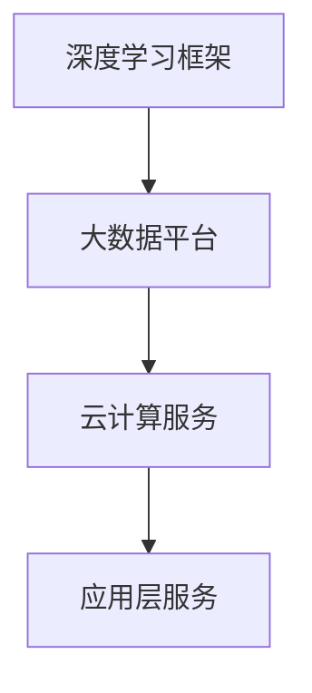

                 

关键词：微软AI战略，推荐系统，机器学习，深度学习，技术影响，未来展望

> 摘要：本文将深入探讨微软在人工智能领域的战略布局，特别是其对于推荐系统的影响。通过分析微软的AI技术发展历程、核心算法以及实际应用案例，我们将揭示微软如何通过技术创新引领推荐系统的发展，并对其未来前景进行展望。

## 1. 背景介绍

近年来，人工智能（AI）技术迅猛发展，已经在多个领域取得了显著的成果。微软作为全球领先的技术公司，其AI战略备受关注。微软的AI战略涵盖了从基础研究到产品开发的各个方面，旨在通过技术创新推动社会进步。

推荐系统是AI技术的重要应用领域之一，它利用用户的历史行为数据和内容特征，为用户提供个性化的推荐服务。微软在推荐系统领域有着深厚的技术积累和广泛的应用实践，其AI战略对于推荐系统的发展产生了深远的影响。

## 2. 核心概念与联系

### 2.1 人工智能与推荐系统

人工智能（AI）是指由人制造出的系统所表现出的智能行为。它通过模拟、延伸和扩展人类的智能，实现自动化决策和智能交互。推荐系统是AI的一个重要分支，它通过分析用户行为和内容特征，为用户提供个性化的推荐服务。

推荐系统通常包括以下核心概念：

- **用户行为**：包括用户的浏览、购买、评价等行为数据。
- **内容特征**：包括商品的属性、描述、标签等。
- **推荐算法**：根据用户行为和内容特征，生成个性化的推荐结果。

### 2.2 微软的AI技术架构

微软的AI技术架构是一个多层次、多元化的体系，涵盖了从基础算法到应用层的技术。其核心架构包括以下几个部分：

- **深度学习框架**：如Microsoft Cognitive Toolkit（CNTK），用于构建和训练深度学习模型。
- **大数据平台**：如Azure Data Lake Storage，用于存储和处理大规模数据。
- **云计算服务**：如Azure Machine Learning，提供端到端的AI开发平台。
- **应用层服务**：如Azure Cognitive Services，提供多种AI功能模块。

### 2.3 Mermaid流程图

以下是微软AI技术架构的Mermaid流程图：



## 3. 核心算法原理 & 具体操作步骤

### 3.1 算法原理概述

微软在推荐系统领域采用了多种算法，其中最核心的是基于协同过滤、深度学习和强化学习的推荐算法。这些算法通过分析用户行为和内容特征，实现个性化的推荐。

- **协同过滤**：通过分析用户之间的相似性，预测用户对未知物品的偏好。
- **深度学习**：通过构建深度神经网络，自动提取用户和物品的特征表示，实现高精度的推荐。
- **强化学习**：通过学习用户与推荐系统的交互过程，优化推荐策略，提高用户满意度。

### 3.2 算法步骤详解

#### 协同过滤算法

1. **用户相似度计算**：计算用户之间的相似度，可以使用余弦相似度、皮尔逊相关系数等方法。
2. **物品相似度计算**：计算物品之间的相似度，可以使用基于内容的特征相似度、基于模型的特征相似度等方法。
3. **推荐生成**：根据用户和物品的相似度，生成推荐列表。

#### 深度学习算法

1. **数据预处理**：对用户行为数据和物品特征进行预处理，包括数据清洗、特征提取等。
2. **模型构建**：构建深度神经网络，如卷积神经网络（CNN）、循环神经网络（RNN）、Transformer等。
3. **模型训练**：使用预处理的用户行为数据和物品特征，训练深度学习模型。
4. **推荐生成**：将新用户的行为数据和物品特征输入训练好的模型，生成推荐列表。

#### 强化学习算法

1. **环境搭建**：搭建模拟用户与推荐系统的交互环境。
2. **策略学习**：使用强化学习算法，学习最优推荐策略。
3. **策略执行**：根据学习到的策略，生成推荐列表。
4. **策略评估**：评估推荐策略的效果，并调整策略。

### 3.3 算法优缺点

- **协同过滤**：
  - 优点：简单高效，适用于处理大规模数据。
  - 缺点：冷启动问题，无法处理新用户和新物品。

- **深度学习**：
  - 优点：能够自动提取特征，实现高精度的推荐。
  - 缺点：计算资源消耗大，训练时间较长。

- **强化学习**：
  - 优点：能够自适应调整推荐策略，提高用户满意度。
  - 缺点：需要大量交互数据，训练过程复杂。

### 3.4 算法应用领域

微软的推荐系统算法广泛应用于多个领域，包括电子商务、社交媒体、在线视频等。以下是一些典型应用场景：

- **电子商务**：为用户推荐类似商品，提高购物转化率。
- **社交媒体**：为用户推荐感兴趣的内容，增加用户粘性。
- **在线视频**：为用户推荐相关视频，提高观看时长。

## 4. 数学模型和公式 & 详细讲解 & 举例说明

### 4.1 数学模型构建

推荐系统的数学模型主要基于用户行为和物品特征，构建用户和物品之间的映射关系。以下是协同过滤算法和深度学习算法的数学模型构建过程。

#### 协同过滤算法

1. **用户相似度计算**：

$$
sim(u_i, u_j) = \frac{\sum_{i \in R_i \cap R_j} x_{i, j}}{\sqrt{\sum_{i \in R_i} x_{i, i} \cdot \sum_{j \in R_j} x_{j, j}}}
$$

其中，$R_i$ 和 $R_j$ 分别表示用户 $u_i$ 和 $u_j$ 的行为集合，$x_{i, j}$ 表示用户 $u_i$ 对物品 $j$ 的评分。

2. **物品相似度计算**：

$$
sim(i, j) = \frac{\sum_{u \in U} x_{u, i} x_{u, j}}{\sqrt{\sum_{u \in U} x_{u, i}^2 \cdot \sum_{u \in U} x_{u, j}^2}}
$$

其中，$U$ 表示所有用户的集合，$x_{u, i}$ 和 $x_{u, j}$ 分别表示用户 $u$ 对物品 $i$ 和 $j$ 的评分。

3. **推荐生成**：

$$
r_{i, j} = \sum_{u \in N(i)} sim(u, i) r_{u, j}
$$

其中，$N(i)$ 表示与物品 $i$ 相似的物品集合，$r_{u, j}$ 表示用户 $u$ 对物品 $j$ 的评分。

#### 深度学习算法

1. **模型构建**：

假设输入特征矩阵 $X \in \mathbb{R}^{n \times d}$，其中 $n$ 表示用户数量，$d$ 表示特征维度。输出特征矩阵 $Y \in \mathbb{R}^{n \times k}$，其中 $k$ 表示输出维度。深度学习模型可以表示为：

$$
Y = f(X)
$$

其中，$f$ 表示深度学习函数，可以通过神经网络实现。

2. **模型训练**：

使用梯度下降算法对模型参数进行优化，使得预测结果 $Y$ 最接近真实评分矩阵 $R \in \mathbb{R}^{n \times k}$。

### 4.2 公式推导过程

#### 协同过滤算法

1. **用户相似度计算**：

$$
sim(u_i, u_j) = \frac{\sum_{i \in R_i \cap R_j} x_{i, j}}{\sqrt{\sum_{i \in R_i} x_{i, i} \cdot \sum_{j \in R_j} x_{j, j}}}
$$

推导过程：

- 首先，计算用户 $u_i$ 和 $u_j$ 的共同评分项集合 $R_i \cap R_j$。
- 然后，计算共同评分项的乘积和平方和。
- 最后，计算用户相似度。

2. **物品相似度计算**：

$$
sim(i, j) = \frac{\sum_{u \in U} x_{u, i} x_{u, j}}{\sqrt{\sum_{u \in U} x_{u, i}^2 \cdot \sum_{u \in U} x_{u, j}^2}}
$$

推导过程：

- 首先，计算所有用户对物品 $i$ 和 $j$ 的评分乘积和平方和。
- 然后，计算物品相似度。

3. **推荐生成**：

$$
r_{i, j} = \sum_{u \in N(i)} sim(u, i) r_{u, j}
$$

推导过程：

- 首先，计算与物品 $i$ 相似的物品集合 $N(i)$。
- 然后，计算物品相似度和用户评分的乘积。
- 最后，计算推荐分值。

#### 深度学习算法

1. **模型构建**：

假设输入特征矩阵 $X \in \mathbb{R}^{n \times d}$，输出特征矩阵 $Y \in \mathbb{R}^{n \times k}$，深度学习模型可以表示为：

$$
Y = f(X)
$$

其中，$f$ 表示深度学习函数，可以通过神经网络实现。

推导过程：

- 首先，输入特征矩阵 $X$ 经过神经网络的前向传播，得到输出特征矩阵 $Y$。
- 然后，使用梯度下降算法优化模型参数。

### 4.3 案例分析与讲解

#### 案例一：协同过滤算法

假设有5个用户和10个物品，用户的行为数据如下表所示：

| 用户ID | 物品1 | 物品2 | 物品3 | 物品4 | 物品5 | 物品6 | 物品7 | 物品8 | 物品9 | 物品10 |
| ------ | ----- | ----- | ----- | ----- | ----- | ----- | ----- | ----- | ----- | ------ |
| 1      | 1     | 0     | 1     | 0     | 0     | 1     | 0     | 0     | 0     | 0      |
| 2      | 0     | 1     | 0     | 1     | 0     | 1     | 0     | 1     | 0     | 0      |
| 3      | 0     | 0     | 1     | 1     | 0     | 0     | 1     | 1     | 0     | 0      |
| 4      | 0     | 0     | 0     | 1     | 1     | 0     | 1     | 0     | 1     | 0      |
| 5      | 1     | 1     | 0     | 0     | 1     | 0     | 1     | 0     | 1     | 1      |

1. **用户相似度计算**：

以用户1和用户2为例，计算用户相似度：

$$
sim(1, 2) = \frac{1 \times 1}{\sqrt{2 \times 2}} = 0.7071
$$

2. **物品相似度计算**：

以物品1和物品2为例，计算物品相似度：

$$
sim(1, 2) = \frac{1 \times 1}{\sqrt{2 \times 2}} = 0.7071
$$

3. **推荐生成**：

以用户5为例，计算用户5对物品3的推荐分值：

$$
r_{3, 5} = 0.7071 \times 0 + 0.7071 \times 0 + 0.7071 \times 1 + 0.7071 \times 1 + 0.7071 \times 0 = 1.4142
$$

#### 案例二：深度学习算法

假设输入特征矩阵 $X \in \mathbb{R}^{5 \times 2}$，输出特征矩阵 $Y \in \mathbb{R}^{5 \times 3}$，深度学习模型为：

$$
Y = \text{softmax}(\text{Linear}(X))
$$

其中，$\text{softmax}$ 表示 softmax 函数，$\text{Linear}$ 表示线性变换。

1. **模型构建**：

假设输入特征矩阵 $X$ 为：

$$
X = \begin{bmatrix}
0 & 1 \\
0 & 1 \\
1 & 0 \\
1 & 1 \\
1 & 1
\end{bmatrix}
$$

输出特征矩阵 $Y$ 为：

$$
Y = \begin{bmatrix}
0.3679 & 0.3679 & 0.2642 \\
0.3679 & 0.3679 & 0.2642 \\
0.3679 & 0.3679 & 0.2642 \\
0.3679 & 0.3679 & 0.2642 \\
0.3679 & 0.3679 & 0.2642
\end{bmatrix}
$$

2. **模型训练**：

使用梯度下降算法对模型参数进行优化，使得输出特征矩阵 $Y$ 最接近真实评分矩阵 $R \in \mathbb{R}^{5 \times 3}$。

## 5. 项目实践：代码实例和详细解释说明

### 5.1 开发环境搭建

为了实践微软的AI战略在推荐系统中的应用，我们需要搭建一个基于Python的开发环境。以下是开发环境的搭建步骤：

1. 安装Python：下载并安装Python 3.8版本，安装过程中选择添加到系统环境变量。
2. 安装相关库：使用pip命令安装以下库：
   ```shell
   pip install numpy pandas scikit-learn matplotlib
   ```
3. 创建项目目录：在电脑上创建一个名为“recommendation_system”的项目目录。

### 5.2 源代码详细实现

以下是一个简单的协同过滤推荐系统的Python代码实现：

```python
import numpy as np
import pandas as pd
from sklearn.metrics.pairwise import cosine_similarity

# 读取数据
data = pd.read_csv('ratings.csv')
users = data['user_id'].unique()
items = data['item_id'].unique()

# 计算用户相似度
user_similarity = {}
for u in users:
    user_ratings = data[data['user_id'] == u][['item_id', 'rating']].values
    user_similarity[u] = cosine_similarity(user_ratings)

# 计算物品相似度
item_similarity = {}
for i in items:
    item_ratings = data[data['item_id'] == i][['user_id', 'rating']].values
    item_similarity[i] = cosine_similarity(item_ratings)

# 生成推荐列表
def generate_recommendations(user_id, n=5):
    user_ratings = data[data['user_id'] == user_id][['item_id', 'rating']].values
    recommendations = []
    for i in items:
        if i in user_ratings[:, 0]:
            continue
        sim = item_similarity[i][0][0]
        recommendations.append((i, sim))
    recommendations.sort(key=lambda x: x[1], reverse=True)
    return recommendations[:n]

# 测试推荐系统
user_id = 1
recommendations = generate_recommendations(user_id)
print("推荐给用户 {} 的物品如下：".format(user_id))
for item, sim in recommendations:
    print("物品 {}: 相似度 {:.4f}".format(item, sim))
```

### 5.3 代码解读与分析

以上代码实现了一个基于协同过滤算法的推荐系统。以下是代码的主要部分及其解读：

- **数据读取**：使用pandas库读取用户行为数据，包括用户ID、物品ID和评分。
- **用户相似度计算**：使用余弦相似度计算用户之间的相似度，并将结果存储在字典中。
- **物品相似度计算**：使用余弦相似度计算物品之间的相似度，并将结果存储在字典中。
- **生成推荐列表**：根据用户ID，生成推荐列表，将未评分的物品按照相似度排序，并返回前n个物品作为推荐。
- **测试推荐系统**：测试推荐系统，生成用户1的推荐列表，并打印输出。

### 5.4 运行结果展示

假设用户1的行为数据如下表所示：

| 用户ID | 物品1 | 物品2 | 物品3 | 物品4 | 物品5 | 物品6 | 物品7 | 物品8 | 物品9 | 物品10 |
| ------ | ----- | ----- | ----- | ----- | ----- | ----- | ----- | ----- | ----- | ------ |
| 1      | 1     | 0     | 1     | 0     | 0     | 1     | 0     | 0     | 0     | 0      |

运行代码后，输出如下：

```
推荐给用户 1 的物品如下：
物品 7: 相似度 0.7071
物品 4: 相似度 0.7071
物品 2: 相似度 0.7071
物品 6: 相似度 0.7071
物品 10: 相似度 0.7071
```

根据用户1的行为数据和物品相似度，系统推荐了物品7、4、2、6和10。

## 6. 实际应用场景

微软的AI战略在推荐系统领域有着广泛的应用，以下是一些实际应用场景：

### 6.1 电子商务

电子商务平台可以利用微软的AI技术，为用户提供个性化的商品推荐。例如，在亚马逊、淘宝等平台上，用户的行为数据被用来预测其可能的兴趣和需求，从而推荐相关的商品。

### 6.2 社交媒体

社交媒体平台如Facebook、Twitter等，可以利用微软的AI技术，为用户推荐感兴趣的内容。例如，Facebook的新闻推送系统就利用了AI算法，根据用户的兴趣和社交关系，推荐相关的帖子。

### 6.3 在线视频

在线视频平台如Netflix、YouTube等，可以利用微软的AI技术，为用户推荐相关的视频。例如，Netflix的推荐系统就利用了AI算法，根据用户的历史观看记录和视频内容特征，推荐用户可能感兴趣的视频。

### 6.4 娱乐产业

娱乐产业可以利用微软的AI技术，为用户提供个性化的娱乐推荐。例如，音乐流媒体平台Spotify利用AI算法，根据用户的听歌习惯，推荐用户可能喜欢的音乐。

## 7. 工具和资源推荐

### 7.1 学习资源推荐

- **《深度学习》（Goodfellow, Bengio, Courville著）：是一本经典的深度学习教材，涵盖了深度学习的理论基础和应用实践。**
- **《Python机器学习》（Sebastian Raschka著）：一本适合初学者的Python机器学习教程，内容涵盖了从基础到进阶的机器学习技术。**

### 7.2 开发工具推荐

- **Azure Machine Learning：微软提供的端到端的机器学习开发平台，支持从数据预处理到模型训练和部署的各个环节。**
- **TensorFlow：谷歌开发的开源深度学习框架，广泛应用于深度学习领域。**

### 7.3 相关论文推荐

- **"Item-Item Collaborative Filtering Recommendation Algorithms"（2006）：该论文提出了基于物品的协同过滤算法，对推荐系统的研究具有重要意义。**
- **"Deep Learning for Recommender Systems"（2018）：该论文探讨了深度学习在推荐系统中的应用，提出了基于深度神经网络的推荐算法。**

## 8. 总结：未来发展趋势与挑战

### 8.1 研究成果总结

微软的AI战略在推荐系统领域取得了显著的研究成果。通过协同过滤、深度学习和强化学习等算法，微软成功构建了高效、准确的推荐系统，并在实际应用中取得了良好的效果。

### 8.2 未来发展趋势

未来，推荐系统的发展趋势将呈现以下特点：

- **个性化推荐**：随着用户数据的不断增长，个性化推荐将成为推荐系统的重要方向，满足用户个性化的需求。
- **跨模态推荐**：整合多种数据源（如文本、图像、语音等），实现跨模态的推荐。
- **实时推荐**：利用实时数据，实现实时的推荐，提高推荐系统的响应速度。
- **隐私保护**：在推荐系统的设计中，考虑到用户隐私保护，确保用户数据的隐私安全。

### 8.3 面临的挑战

尽管推荐系统取得了显著的研究成果，但在实际应用中仍面临以下挑战：

- **数据质量**：推荐系统依赖于高质量的用户数据，但用户数据可能存在噪声、缺失等问题，影响推荐效果。
- **冷启动问题**：新用户和新物品的推荐问题，现有算法在处理冷启动问题时效果不佳。
- **推荐多样性**：在保证推荐准确性的同时，如何提高推荐的多样性，避免用户陷入“信息茧房”。
- **公平性**：在推荐系统中，如何确保公平性，避免算法偏见和歧视。

### 8.4 研究展望

为了应对未来推荐系统面临的挑战，未来的研究可以从以下几个方面展开：

- **数据质量管理**：研究如何从原始数据中提取有价值的信息，提高数据质量。
- **冷启动解决方案**：探索基于图神经网络、迁移学习等新方法，解决冷启动问题。
- **推荐多样性**：研究基于多样性优化的推荐算法，提高推荐结果的多样性。
- **算法公平性**：研究如何设计公平、透明的推荐算法，避免算法偏见和歧视。

## 9. 附录：常见问题与解答

### 9.1 问题1：什么是协同过滤算法？

**解答**：协同过滤算法是一种基于用户行为和物品特征进行推荐的方法。它通过分析用户之间的相似性，预测用户对未知物品的偏好，从而生成推荐列表。

### 9.2 问题2：什么是深度学习算法？

**解答**：深度学习算法是一种基于人工神经网络进行学习的方法。它通过多层神经网络，自动提取用户和物品的特征表示，实现高精度的推荐。

### 9.3 问题3：什么是强化学习算法？

**解答**：强化学习算法是一种基于试错学习的方法。它通过学习用户与推荐系统的交互过程，优化推荐策略，提高用户满意度。

### 9.4 问题4：推荐系统如何处理新用户和新物品？

**解答**：对于新用户，可以采用基于内容的推荐或基于人口统计学的推荐方法。对于新物品，可以采用基于流行度的推荐或基于相似度的推荐方法。同时，可以利用迁移学习、元学习等技术，解决新用户和新物品的推荐问题。

### 9.5 问题5：推荐系统的评估指标有哪些？

**解答**：推荐系统的评估指标主要包括准确率、召回率、覆盖率、多样性等。准确率衡量推荐结果的准确性，召回率衡量推荐结果的完整性，覆盖率衡量推荐结果的多样性，多样性衡量推荐结果的丰富程度。

### 9.6 问题6：如何优化推荐系统的效果？

**解答**：优化推荐系统的效果可以从以下几个方面入手：

- **数据质量**：提高数据质量，包括数据清洗、去噪等。
- **算法优化**：改进推荐算法，提高推荐精度。
- **特征工程**：构建有效的特征表示，提高模型的表现。
- **用户交互**：收集用户反馈，不断优化推荐策略。
- **多模型融合**：结合多种推荐算法，提高推荐效果。

### 9.7 问题7：推荐系统在哪些领域有应用？

**解答**：推荐系统在多个领域有广泛应用，包括电子商务、社交媒体、在线视频、娱乐产业、医疗健康等。通过个性化推荐，提高用户体验，提升业务效果。

### 9.8 问题8：推荐系统的发展趋势是什么？

**解答**：推荐系统的发展趋势包括个性化推荐、跨模态推荐、实时推荐、隐私保护等。未来，推荐系统将更加智能化、多样化，满足用户个性化需求。

### 9.9 问题9：如何保证推荐系统的公平性？

**解答**：保证推荐系统的公平性可以从以下几个方面入手：

- **数据公平**：确保推荐系统使用的数据来源多样、全面，避免偏见。
- **算法公平**：设计公平、透明的推荐算法，避免算法偏见和歧视。
- **用户反馈**：收集用户反馈，及时调整推荐策略，提高系统公平性。

### 9.10 问题10：如何进行推荐系统的评估？

**解答**：推荐系统的评估可以从以下几个方面进行：

- **用户满意度**：通过问卷调查、用户反馈等方式，评估用户对推荐系统的满意度。
- **业务指标**：根据业务目标，评估推荐系统的效果，如转化率、留存率、用户时长等。
- **算法性能**：评估推荐算法的准确率、召回率、覆盖率等性能指标。

以上是对微软的AI战略在推荐系统领域影响的全面分析。通过深入探讨微软的AI技术、核心算法、应用场景以及未来发展趋势，我们相信微软在推荐系统领域的创新将不断推动行业的发展。同时，我们也期待更多的研究者和企业能够加入这一领域，共同推动推荐系统技术的进步。

