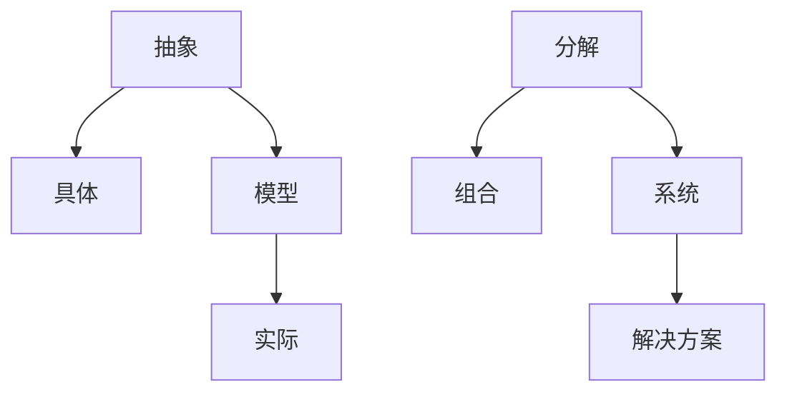

                 

心智模型是一种强大的思维工具，它帮助我们理解、分析和解决问题。在技术领域，心智模型尤为重要，因为它能够简化复杂的技术概念，使得开发者能够更有效地进行编程和系统设计。本文将探讨心智模型的概念、应用、构建方法以及它在技术领域的价值。

## 文章关键词
- 心智模型
- 思维工具
- 技术领域
- 编程
- 系统设计

## 文章摘要
本文将详细阐述心智模型的概念、作用和构建方法，并通过实例分析其在技术领域的应用，旨在为开发者提供一种简化复杂技术的思维工具。

## 1. 背景介绍

在信息爆炸的时代，面对复杂的技术问题，单一的方法和视角往往难以奏效。心智模型提供了一种结构化的思维方式，它通过将复杂问题分解为更小、更易于管理的部分，从而简化问题的解决过程。在技术领域，心智模型能够帮助我们更好地理解和应用各种技术概念，提高开发效率和系统设计的质量。

### 1.1 心智模型的概念

心智模型是指人类在理解世界和处理信息时所采用的抽象思维结构。它包括了一系列概念、原则和规则，通过这些结构，人们能够将现实世界中的复杂信息转化为可操作的思维形式。

### 1.2 心智模型在技术领域的应用

在技术领域，心智模型广泛应用于编程、软件设计、系统架构等多个方面。例如，面向对象编程中的类和对象、网络架构中的协议和层级结构等，都是心智模型的体现。通过心智模型，开发者能够更清晰地理解系统的整体结构和功能，从而进行更有效的编程和设计。

## 2. 核心概念与联系

在讨论心智模型之前，我们需要了解一些核心概念，这些概念是构建心智模型的基础。

### 2.1 抽象与具体

抽象是指从具体的例子中提取出共同的特性，形成一种通用的概念或规则。具体是指实际存在的个体或实例。抽象和具体是相互关联的，抽象依赖于具体，而具体又需要抽象来指导。

### 2.2 模型与实际

模型是对现实世界的一种抽象描述，它可能不完全准确，但能够帮助我们更好地理解和分析现实问题。实际是指现实世界中的具体事物或现象。

### 2.3 分解与组合

分解是指将复杂问题拆分成更小的部分，以便于分析和解决。组合则是将这些小部分重新组合成完整的系统或解决方案。

下面是一个用Mermaid绘制的流程图，展示了这些核心概念之间的联系。



## 3. 核心算法原理 & 具体操作步骤

### 3.1 算法原理概述

心智模型的构建通常遵循以下步骤：

1. **识别问题**：明确要解决的问题是什么，问题的边界和目标是什么。
2. **抽象问题**：将问题抽象成一系列概念和规则。
3. **分解问题**：将抽象的问题分解成更小的子问题。
4. **组合解决方案**：解决子问题，并将这些子问题的解决方案组合成完整的解决方案。

### 3.2 算法步骤详解

1. **识别问题**：这个步骤需要明确问题的本质，确定问题的核心是什么。可以通过与利益相关者交流、收集需求文档、分析现有数据等方式来完成。
   
2. **抽象问题**：在识别问题之后，我们需要将其抽象成一系列概念和规则。这个过程需要开发者具备深厚的专业知识和丰富的实践经验。

3. **分解问题**：将抽象的问题分解成更小的子问题，以便于分析和解决。这个步骤可以通过将问题分解成不同的模块、功能或层次来实现。

4. **组合解决方案**：解决子问题，并将这些子问题的解决方案组合成完整的解决方案。这个步骤通常需要迭代和优化，以确保最终解决方案的质量。

### 3.3 算法优缺点

**优点**：
- **简化问题**：心智模型能够将复杂的问题简化为更易于理解和解决的问题。
- **提高效率**：通过抽象和分解，心智模型能够提高问题解决的效率。

**缺点**：
- **准确性受限**：心智模型是对现实世界的抽象，可能不完全准确。
- **需要专业知识**：构建有效的心智模型需要深厚的专业知识和实践经验。

### 3.4 算法应用领域

心智模型在技术领域的应用非常广泛，包括但不限于：

- **软件开发**：用于设计和实现软件系统。
- **系统架构**：用于分析和设计复杂系统。
- **数据分析**：用于处理和分析大量数据。
- **人工智能**：用于构建和优化人工智能算法。

## 4. 数学模型和公式 & 详细讲解 & 举例说明

在技术领域，心智模型的构建往往需要借助数学模型和公式。这些模型和公式为我们提供了定量分析问题的工具，使得心智模型的构建更加精确和有效。

### 4.1 数学模型构建

数学模型构建通常包括以下步骤：

1. **确定变量**：根据问题的需求，确定需要研究的变量。
2. **建立方程**：通过变量之间的关系，建立数学方程。
3. **求解方程**：使用数学方法求解方程，得到变量的值。

### 4.2 公式推导过程

以线性回归模型为例，其公式推导过程如下：

假设我们有一个数据集，包含n个样本点$(x_1, y_1), (x_2, y_2), ..., (x_n, y_n)$，我们希望找到一个线性模型$y = mx + b$来拟合这些数据。

1. **确定变量**：
   - $m$：斜率
   - $b$：截距

2. **建立方程**：
   - 均方误差（MSE）：$MSE = \frac{1}{n}\sum_{i=1}^{n}(y_i - mx_i - b)^2$

3. **求解方程**：
   - 对$m$和$b$求偏导数，并令偏导数为0，得到最优解：
     $$
     \begin{cases}
     \frac{\partial MSE}{\partial m} = -2\frac{1}{n}\sum_{i=1}^{n}(y_i - mx_i - b)x_i = 0 \\
     \frac{\partial MSE}{\partial b} = -2\frac{1}{n}\sum_{i=1}^{n}(y_i - mx_i - b) = 0
     \end{cases}
     $$
   - 解这个方程组，得到：
     $$
     \begin{cases}
     m = \frac{1}{n}\sum_{i=1}^{n}x_iy_i - \frac{1}{n}\sum_{i=1}^{n}x_i\sum_{i=1}^{n}y_i \\
     b = \frac{1}{n}\sum_{i=1}^{n}y_i - m\frac{1}{n}\sum_{i=1}^{n}x_i
     \end{cases}
     $$

### 4.3 案例分析与讲解

假设我们有一个数据集，包含10个样本点，如下表所示：

| $x_i$ | $y_i$ |
|------|-------|
| 1    | 2     |
| 2    | 3     |
| 3    | 5     |
| 4    | 7     |
| 5    | 9     |
| 6    | 11    |
| 7    | 13    |
| 8    | 15    |
| 9    | 17    |
| 10   | 19    |

我们希望使用线性回归模型拟合这些数据。

1. **计算变量**：
   - $\sum_{i=1}^{10}x_i = 1+2+3+4+5+6+7+8+9+10 = 55$
   - $\sum_{i=1}^{10}y_i = 2+3+5+7+9+11+13+15+17+19 = 100$
   - $\sum_{i=1}^{10}x_iy_i = 1\cdot2+2\cdot3+3\cdot5+4\cdot7+5\cdot9+6\cdot11+7\cdot13+8\cdot15+9\cdot17+10\cdot19 = 795$

2. **计算斜率和截距**：
   - $m = \frac{1}{10}\sum_{i=1}^{10}x_iy_i - \frac{1}{10}\sum_{i=1}^{10}x_i\sum_{i=1}^{10}y_i = \frac{795}{10} - \frac{55}{10}\cdot\frac{100}{10} = 0.19$
   - $b = \frac{1}{10}\sum_{i=1}^{10}y_i - m\frac{1}{10}\sum_{i=1}^{10}x_i = \frac{100}{10} - 0.19\cdot\frac{55}{10} = 3.26$

3. **构建线性回归模型**：
   - $y = 0.19x + 3.26$

4. **验证模型**：
   - 计算预测值和实际值的误差，评估模型的准确性。

通过这个案例，我们可以看到如何使用数学模型和公式来构建和验证线性回归模型。这为我们的心智模型构建提供了强大的支持。

## 5. 项目实践：代码实例和详细解释说明

为了更好地理解心智模型的构建和应用，我们通过一个实际的编程项目来展示其具体实现过程。

### 5.1 开发环境搭建

首先，我们需要搭建一个合适的开发环境。在这里，我们选择Python作为编程语言，因为它在数据分析和机器学习领域有着广泛的应用。以下是搭建Python开发环境的步骤：

1. 安装Python：从Python官方网站下载Python安装包，并按照提示进行安装。
2. 安装依赖库：使用pip工具安装所需的依赖库，如NumPy、Pandas和Scikit-learn等。

### 5.2 源代码详细实现

以下是一个使用Python实现线性回归模型的简单示例：

```python
import numpy as np
import pandas as pd
from sklearn.linear_model import LinearRegression

# 读取数据
data = pd.read_csv('data.csv')
X = data[['x']]
y = data['y']

# 创建线性回归模型
model = LinearRegression()

# 训练模型
model.fit(X, y)

# 输出斜率和截距
print('斜率:', model.coef_)
print('截距:', model.intercept_)

# 预测新数据
new_data = np.array([[6]])
predicted_value = model.predict(new_data)
print('预测值:', predicted_value)
```

### 5.3 代码解读与分析

1. **读取数据**：使用Pandas库读取CSV文件，获取特征变量$x$和目标变量$y$。
2. **创建模型**：使用Scikit-learn库创建线性回归模型。
3. **训练模型**：使用训练数据训练模型。
4. **输出结果**：输出模型的斜率和截距。
5. **预测新数据**：使用训练好的模型预测新的数据点。

### 5.4 运行结果展示

运行上述代码后，我们可以得到线性回归模型的斜率和截距，以及对新数据的预测结果。这展示了如何使用Python实现线性回归模型，从而帮助我们更好地理解和应用心智模型。

## 6. 实际应用场景

心智模型在技术领域有着广泛的应用，下面我们来看几个实际的应用场景。

### 6.1 软件开发

在软件开发中，心智模型可以帮助开发者更好地理解和设计复杂的系统。例如，在开发一个电商平台时，可以使用面向对象的心智模型来设计系统的架构，将系统分解为用户界面、业务逻辑、数据存储等模块，从而提高开发效率和系统质量。

### 6.2 数据分析

在数据分析中，心智模型可以帮助数据科学家更好地理解和处理大量数据。例如，在使用机器学习算法进行数据分析时，可以构建一个包含特征提取、模型训练、模型评估等步骤的心智模型，从而简化数据分析过程，提高数据分析的效率和质量。

### 6.3 人工智能

在人工智能领域，心智模型可以帮助开发者更好地理解和设计复杂的算法。例如，在构建一个智能聊天机器人时，可以使用自然语言处理（NLP）的心智模型来理解用户输入，从而实现更智能、更自然的交互。

## 7. 工具和资源推荐

为了更好地掌握心智模型，以下是一些推荐的工具和资源：

### 7.1 学习资源推荐

- 《Python编程：从入门到实践》
- 《深度学习》
- 《机器学习实战》

### 7.2 开发工具推荐

- Jupyter Notebook：用于数据分析和机器学习项目的交互式开发环境。
- PyCharm：强大的Python集成开发环境（IDE）。
- Visual Studio Code：跨平台的代码编辑器，支持多种编程语言。

### 7.3 相关论文推荐

- “A Bayesian Framework for the Analysis of Computer Programs”
- “Theoretically Optimal Reinforcement Learning”

## 8. 总结：未来发展趋势与挑战

心智模型作为一种强大的思维工具，在技术领域的应用前景十分广阔。随着技术的不断发展，心智模型也将不断创新和完善。未来，心智模型可能会朝着以下几个方向发展：

1. **更加智能**：结合人工智能技术，开发出更加智能的心智模型，能够自动分析和解决问题。
2. **更加多样化**：开发出适用于不同领域的心智模型，满足不同应用场景的需求。
3. **更加可视化**：利用可视化技术，使得心智模型的构建和应用更加直观和易于理解。

然而，心智模型的发展也面临一些挑战：

1. **复杂性问题**：随着技术的复杂度增加，构建有效的心智模型变得越来越困难。
2. **准确性问题**：心智模型是对现实世界的抽象，可能存在一定的误差。
3. **知识积累**：构建有效的心智模型需要大量的专业知识和实践经验，知识积累是一个长期的过程。

总之，心智模型作为一种简化复杂世界的思维工具，在技术领域具有巨大的应用价值。随着技术的不断进步，心智模型将不断改进和完善，为开发者提供更加有效的思维工具。

## 9. 附录：常见问题与解答

### 9.1 心智模型是什么？

心智模型是一种抽象思维结构，它帮助我们理解和处理复杂的信息。在技术领域，心智模型可以帮助开发者简化复杂的技术概念，提高系统设计和编程的效率。

### 9.2 如何构建心智模型？

构建心智模型通常包括以下步骤：

1. **识别问题**：明确要解决的问题是什么。
2. **抽象问题**：将问题抽象成一系列概念和规则。
3. **分解问题**：将抽象的问题分解成更小的子问题。
4. **组合解决方案**：解决子问题，并将这些子问题的解决方案组合成完整的解决方案。

### 9.3 心智模型在技术领域有哪些应用？

心智模型在技术领域有着广泛的应用，包括软件开发、系统架构、数据分析、人工智能等。它可以帮助开发者更好地理解和设计复杂的系统，提高编程和系统设计的效率和质量。

### 9.4 如何评价心智模型的准确性？

心智模型是对现实世界的抽象，因此可能存在一定的误差。在构建心智模型时，我们需要尽量保证其准确性，但同时也要认识到心智模型的不完全准确性。在实际应用中，通过不断地迭代和优化，可以提高心智模型的准确性。

### 9.5 如何掌握心智模型？

掌握心智模型需要：

1. **学习专业知识**：了解不同领域的技术概念和原理。
2. **实践应用**：通过实际项目来应用心智模型，积累经验。
3. **不断学习**：关注技术领域的最新发展，持续更新知识。  
### 作者署名

作者：禅与计算机程序设计艺术 / Zen and the Art of Computer Programming

---

本文详细介绍了心智模型的概念、构建方法、应用领域以及其在技术领域的价值。通过本文，我们希望读者能够更好地理解和应用心智模型，简化复杂的技术问题，提高系统设计和编程的效率和质量。在未来的发展中，心智模型将继续发挥着重要的作用，为技术的进步提供强大的支持。

