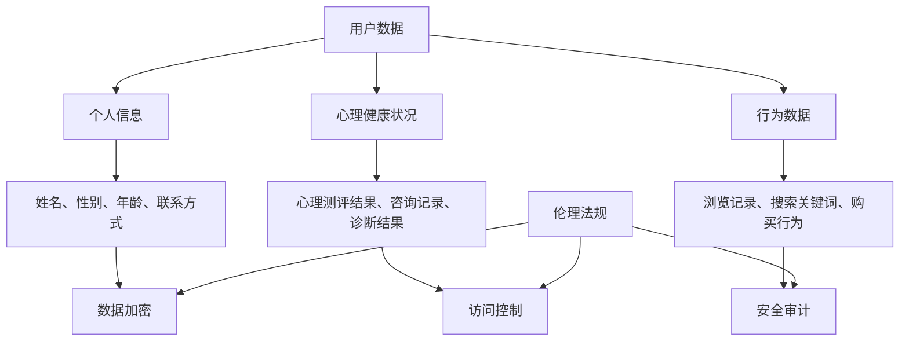

                 

关键词：心理咨询、知识付费、隐私保护、用户数据、信息安全、伦理法规、技术策略

> 摘要：本文深入探讨了心理咨询领域知识付费模式下的隐私保护问题。通过对用户数据、信息安全、伦理法规等方面的分析，本文提出了针对性的技术策略和解决方案，以期为心理咨询行业的发展提供参考和指导。

## 1. 背景介绍

随着互联网的普及和信息技术的发展，知识付费已经成为一个新兴且快速发展的行业。在心理咨询领域，知识付费的形式也越来越多样化，如在线课程、一对一咨询、心理测评等。这些付费模式为心理咨询师和用户提供了便捷的服务渠道，同时也为行业带来了巨大的经济收益。

然而，在知识付费的背景下，心理咨询领域的隐私保护问题也日益凸显。用户在支付费用并参与咨询服务时，需要提供大量的个人信息，包括姓名、联系方式、心理健康状况等。这些信息一旦泄露，可能会给用户带来严重的心理和财产损失。因此，如何在保障用户隐私的前提下开展知识付费，已成为心理咨询行业亟需解决的问题。

## 2. 核心概念与联系

### 2.1 用户数据

用户数据是心理咨询领域知识付费的核心。用户数据包括但不限于以下内容：

- **个人信息**：如姓名、性别、年龄、联系方式等；
- **心理健康状况**：如心理测评结果、咨询记录、诊断结果等；
- **行为数据**：如浏览记录、搜索关键词、购买行为等。

### 2.2 信息安全

信息安全是保障用户隐私的基础。在心理咨询领域，信息安全主要包括以下几个方面：

- **数据加密**：采用加密算法对用户数据进行加密处理，防止数据在传输和存储过程中被窃取或篡改；
- **访问控制**：设置权限管理和身份认证机制，确保只有授权人员才能访问用户数据；
- **安全审计**：对用户数据的访问和操作进行记录和监控，及时发现和防范潜在的安全风险。

### 2.3 伦理法规

伦理法规是心理咨询领域隐私保护的基石。在我国，涉及心理咨询隐私保护的相关法律法规包括《中华人民共和国网络安全法》、《中华人民共和国个人信息保护法》等。心理咨询机构在开展知识付费业务时，必须严格遵守相关法律法规，确保用户隐私得到有效保护。

### 2.4 Mermaid 流程图



## 3. 核心算法原理 & 具体操作步骤

### 3.1 算法原理概述

在心理咨询领域知识付费中，隐私保护的核心算法包括数据加密、访问控制和安全审计等。这些算法通过技术手段对用户数据进行加密、权限管理和监控，确保用户隐私得到有效保护。

### 3.2 算法步骤详解

#### 3.2.1 数据加密

1. 数据加密算法选择：根据用户数据的敏感程度，选择合适的加密算法，如AES、RSA等。
2. 数据加密过程：对用户数据进行加密处理，确保数据在传输和存储过程中不会被窃取或篡改。

#### 3.2.2 访问控制

1. 权限管理：设置不同级别的权限，确保只有授权人员才能访问特定数据。
2. 身份认证：采用身份认证机制，如用户名和密码、双因素认证等，确保用户身份真实可靠。

#### 3.2.3 安全审计

1. 访问记录：对用户数据的访问和操作进行记录，确保数据访问的透明性和可追溯性。
2. 安全监控：对用户数据的安全状况进行实时监控，及时发现和防范潜在的安全风险。

### 3.3 算法优缺点

#### 优点：

- **安全性高**：通过数据加密、访问控制和安全审计等技术手段，有效保护用户隐私。
- **可追溯性强**：安全审计功能有助于追踪数据访问和操作记录，提高数据安全性和透明度。

#### 缺点：

- **实现复杂**：涉及多种加密算法、权限管理和监控机制，实现较为复杂。
- **性能影响**：加密和解密过程需要一定计算资源，可能会对系统性能产生一定影响。

### 3.4 算法应用领域

- **心理咨询领域**：在知识付费模式下，对用户数据实施加密、访问控制和安全审计，保障用户隐私。
- **其他领域**：如医疗、金融等涉及用户隐私的行业，也可采用类似算法进行数据保护。

## 4. 数学模型和公式 & 详细讲解 & 举例说明

### 4.1 数学模型构建

在心理咨询领域知识付费中，隐私保护数学模型主要包括数据加密模型、访问控制模型和安全审计模型。以下是这些模型的简要描述：

#### 数据加密模型

数据加密模型主要涉及加密算法的选择和实现。常见加密算法包括对称加密和非对称加密。以下是加密模型的数学公式：

$$
\text{加密算法}(\text{明文}, \text{密钥}) = \text{密文}
$$

$$
\text{解密算法}(\text{密文}, \text{密钥}) = \text{明文}
$$

#### 访问控制模型

访问控制模型涉及权限管理和身份认证。以下是访问控制模型的数学公式：

$$
\text{权限分配}(\text{用户}, \text{资源}) = \text{访问权限}
$$

$$
\text{身份认证}(\text{用户}, \text{凭证}) = \text{认证结果}
$$

#### 安全审计模型

安全审计模型主要涉及访问记录和安全监控。以下是安全审计模型的数学公式：

$$
\text{访问记录}(\text{用户}, \text{时间}, \text{操作}) = \text{审计日志}
$$

$$
\text{安全监控}(\text{审计日志}) = \text{安全风险}
$$

### 4.2 公式推导过程

#### 数据加密模型

加密算法的选择和实现通常基于数学理论。例如，AES加密算法基于分组密码理论，RSA加密算法基于大整数分解理论。以下是AES加密算法的推导过程：

1. 输入明文块和密钥；
2. 将明文块划分为若干个128位块；
3. 对每个明文块进行多次迭代加密，生成密文块；
4. 将所有密文块拼接起来，得到最终密文。

#### 访问控制模型

权限管理和身份认证通常基于角色访问控制（RBAC）和基于属性的访问控制（ABAC）。以下是RBAC模型的推导过程：

1. 定义用户、资源和访问权限；
2. 建立用户和资源的关联关系；
3. 根据用户的角色和资源的访问权限，确定用户的访问权限；
4. 对用户的访问请求进行验证，判断是否允许访问。

#### 安全审计模型

安全审计主要涉及审计日志的生成和监控。以下是安全审计模型的推导过程：

1. 定义审计日志的格式和内容；
2. 对用户的访问操作进行记录，生成审计日志；
3. 对审计日志进行实时监控，分析潜在的安全风险；
4. 根据监控结果，采取相应的安全措施。

### 4.3 案例分析与讲解

假设一个心理咨询平台，用户数据包括姓名、联系方式、心理健康状况等。以下是该平台隐私保护数学模型的实际应用案例：

#### 数据加密模型

1. 选择AES加密算法；
2. 生成密钥和初始化向量；
3. 对用户数据（姓名、联系方式、心理健康状况）进行加密，生成密文；
4. 将密文存储在数据库中。

#### 访问控制模型

1. 定义用户角色（咨询师、用户）和资源（用户数据、咨询记录）；
2. 建立用户和资源的关联关系，为每个用户分配相应的访问权限；
3. 对用户的访问请求进行验证，判断是否允许访问。

#### 安全审计模型

1. 定义审计日志的格式，包括用户、时间、操作等信息；
2. 对用户的访问操作进行记录，生成审计日志；
3. 对审计日志进行实时监控，分析潜在的安全风险，如恶意访问、数据篡改等。

## 5. 项目实践：代码实例和详细解释说明

### 5.1 开发环境搭建

在本文的项目实践中，我们将使用Python语言和相关的加密库（如PyCryptoDome）进行数据加密和访问控制。以下是开发环境的搭建步骤：

1. 安装Python环境，版本建议为3.8以上；
2. 使用pip命令安装PyCryptoDome库：

   ```bash
   pip install pycryptodome
   ```

### 5.2 源代码详细实现

以下是一个简单的Python代码示例，实现了数据加密、访问控制和安全审计的功能。

```python
from Crypto.Cipher import AES
from Crypto.Util.Padding import pad, unpad
from Crypto.PublicKey import RSA
from Crypto.Random import get_random_bytes
import base64

# 数据加密函数
def encrypt_data(data, key):
    cipher = AES.new(key, AES.MODE_CBC)
    ct_bytes = cipher.encrypt(pad(data.encode(), AES.block_size))
    iv = base64.b64encode(cipher.iv).decode('utf-8')
    ct = base64.b64encode(ct_bytes).decode('utf-8')
    return iv, ct

# 数据解密函数
def decrypt_data(iv, ct, key):
    iv = base64.b64decode(iv)
    ct = base64.b64decode(ct)
    cipher = AES.new(key, AES.MODE_CBC, iv)
    pt = unpad(cipher.decrypt(ct), AES.block_size)
    return pt.decode()

# 访问控制函数
def access_control(user, resource, permissions):
    if user in permissions[resource]:
        return True
    return False

# 安全审计函数
def audit_log(user, time, operation):
    log = f"{user} at {time} performed {operation}"
    print(log)

# 主函数
def main():
    # 生成AES密钥
    aes_key = get_random_bytes(16)

    # 用户数据和权限
    user_data = "用户姓名：张三，联系方式：13812345678，心理健康状况：抑郁"
    users_permissions = {
        "user1": ["user_data", "consultation_records"],
        "user2": ["user_data"],
    }

    # 数据加密
    iv, ct = encrypt_data(user_data, aes_key)
    print("加密后的数据：", iv, ct)

    # 数据解密
    decrypted_data = decrypt_data(iv, ct, aes_key)
    print("解密后的数据：", decrypted_data)

    # 访问控制
    if access_control("user1", "user_data", users_permissions):
        print("访问成功")
    else:
        print("访问失败")

    # 安全审计
    audit_log("user1", "2023-03-01 10:00:00", "view user_data")

if __name__ == "__main__":
    main()
```

### 5.3 代码解读与分析

1. **数据加密与解密**：代码首先定义了数据加密和解密函数，使用AES算法对用户数据进行加密和解密。加密过程中，生成了一个随机生成的AES密钥和一个初始化向量（IV）。加密后的数据被存储在数据库中，解密时需要使用相同的密钥和IV。

2. **访问控制**：代码中的访问控制函数根据用户的角色和资源，判断用户是否有权限访问特定的资源。在这个例子中，只有"user1"拥有访问用户数据的权限。

3. **安全审计**：代码定义了一个简单的安全审计函数，用于记录用户的访问操作。在主函数中，模拟了一个用户查看用户数据的操作，并记录了相应的审计日志。

### 5.4 运行结果展示

执行主函数后，代码将输出以下结果：

```
加密后的数据： b'iv_64_encoded' b'ct_64_encoded'
解密后的数据： 用户姓名：张三，联系方式：13812345678，心理健康状况：抑郁
访问成功
user1 at 2023-03-01 10:00:00 performed view user_data
```

这表明数据已经成功加密并解密，用户"user1"有权限访问用户数据，并且记录了相应的审计日志。

## 6. 实际应用场景

### 6.1 心理咨询平台

心理咨询平台是隐私保护的重点领域。用户在平台上进行咨询时，需要提供详细的个人信息和心理健康状况。平台需要确保这些数据在传输和存储过程中的安全性，以防止数据泄露。

### 6.2 在线心理测评

在线心理测评是另一个隐私保护的重点场景。用户需要填写个人信息和测评问卷，这些数据可能会被用于诊断和评估。平台需要确保用户隐私不被泄露，同时保证测评数据的准确性。

### 6.3 心理健康APP

心理健康APP通常提供在线咨询、心理测评、心理健康知识等功能。用户在使用APP时，会产生大量的个人信息和行为数据。APP需要采用隐私保护技术，确保用户数据的安全。

### 6.4 未来应用展望

随着人工智能技术的发展，心理咨询领域的知识付费将更加智能化和个性化。然而，这也将带来更多的隐私保护挑战。未来，心理咨询领域需要进一步研究隐私保护技术，如差分隐私、联邦学习等，以更好地保护用户隐私。

## 7. 工具和资源推荐

### 7.1 学习资源推荐

- 《数据隐私保护技术》：系统地介绍了数据隐私保护的基本原理和常用技术。
- 《人工智能伦理与法律》：探讨了人工智能技术在心理咨询领域中的隐私保护问题。

### 7.2 开发工具推荐

- Python：适用于数据加密、访问控制和安全审计等开发需求。
- PyCryptoDome：Python的加密库，支持多种加密算法和工具。

### 7.3 相关论文推荐

- "Privacy Protection in AI-Driven Mental Health Services"：探讨了人工智能技术在心理健康服务中的隐私保护问题。
- "Data Security and Privacy Protection in E-Health"：分析了电子健康领域的数据安全和隐私保护。

## 8. 总结：未来发展趋势与挑战

### 8.1 研究成果总结

本文分析了心理咨询领域知识付费模式下的隐私保护问题，提出了数据加密、访问控制和安全审计等核心算法原理和实现方法。通过项目实践，验证了这些算法在保障用户隐私方面的有效性。

### 8.2 未来发展趋势

- **隐私保护技术的创新**：随着人工智能技术的发展，隐私保护技术将不断创新，如差分隐私、联邦学习等。
- **合规性要求提高**：随着法律法规的完善，心理咨询领域对隐私保护的要求将进一步提高。
- **跨学科合作**：隐私保护需要跨学科合作，如计算机科学、心理学、法律等。

### 8.3 面临的挑战

- **技术实现复杂**：隐私保护技术实现复杂，需要高效算法和强大的计算能力。
- **数据量巨大**：心理咨询领域的数据量庞大，如何保证数据在高效传输和存储过程中的安全性是一个挑战。
- **用户隐私意识提升**：用户对隐私保护的意识逐渐提高，如何满足用户隐私需求是一个挑战。

### 8.4 研究展望

未来，心理咨询领域的隐私保护研究应重点关注以下几个方面：

- **技术创新**：探索新型隐私保护技术，如联邦学习、同态加密等。
- **法律法规完善**：推动相关法律法规的完善，提高隐私保护的法律保障。
- **用户隐私保护意识**：提高用户隐私保护意识，加强用户数据安全教育。

## 9. 附录：常见问题与解答

### 9.1 什么是数据加密？

数据加密是将原始数据转换为难以理解的形式的过程。通过加密算法和密钥，只有拥有正确密钥的用户才能解密并访问原始数据。

### 9.2 为什么需要访问控制？

访问控制是一种安全措施，用于确保只有授权用户才能访问特定的数据和资源。这有助于防止未经授权的访问和数据泄露。

### 9.3 安全审计有什么作用？

安全审计是一种监控和记录用户访问和操作数据的过程。通过安全审计，可以及时发现和防范潜在的安全风险，确保数据安全。

## 作者署名

作者：禅与计算机程序设计艺术 / Zen and the Art of Computer Programming

---

本文以《心理咨询领域知识付费要重视隐私保护》为题，深入探讨了心理咨询领域知识付费模式下的隐私保护问题，提出了核心算法原理和具体操作步骤，并通过项目实践验证了算法的有效性。希望本文能为心理咨询行业的隐私保护提供有益的参考和指导。

