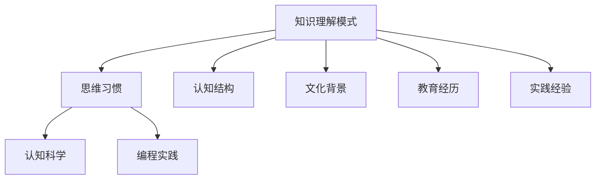

                 

关键词：思维习惯、知识理解、模式、人工智能、认知科学、编程实践

> 摘要：本文从认知科学和编程实践的角度，探讨了思维习惯对知识理解模式的影响，分析了塑造思维习惯的因素，并提出了提升知识理解能力的策略和建议。

## 1. 背景介绍

在当今信息爆炸的时代，知识的获取和处理已经成为每个领域从业者必备的技能。然而，知识的海洋是浩瀚无垠的，如何有效理解和应用这些知识，成为了一个重要的课题。在这个背景下，思维习惯的研究逐渐受到关注。思维习惯是指人们在认知过程中形成的固定思维模式，它对知识理解有着深远的影响。

本文将从认知科学和编程实践的角度，探讨思维习惯如何塑造知识理解模式，分析影响思维习惯形成的因素，并提出提升知识理解能力的策略和建议。

## 2. 核心概念与联系

### 2.1. 知识理解模式

知识理解模式是指个体在接收、处理和运用知识的过程中形成的思维结构和认知框架。这种模式包括对知识的分类、整理、联想和整合等过程。不同的知识理解模式会导致不同的学习效果和应用能力。

### 2.2. 思维习惯

思维习惯是指人们在长期的认知活动中逐渐形成的一种固定的思维模式。这种模式具有一定的稳定性，能够在一定程度上影响个体的决策和行为。在知识学习中，思维习惯会直接影响个体的知识理解过程。

### 2.3. 影响因素

影响思维习惯形成的因素包括个体认知结构、文化背景、教育经历、实践经验等。这些因素共同作用，塑造了个体独特的思维习惯。

### 2.4. 关系图

以下是一个用 Mermaid 语法绘制的思维习惯与知识理解模式的关系图：



## 3. 核心算法原理 & 具体操作步骤

### 3.1. 算法原理概述

思维习惯的塑造是一个复杂的过程，涉及到多种认知机制的交互作用。在认知科学领域，有研究者提出了基于神经网络的思维习惯模型，通过模拟大脑神经元的活动，分析思维习惯的形成和发展。

### 3.2. 算法步骤详解

#### 3.2.1. 数据收集

首先，需要收集大量的个体认知行为数据，包括学习过程、决策记录、知识应用情况等。这些数据可以通过问卷调查、行为追踪等方式获取。

#### 3.2.2. 数据预处理

对收集到的数据进行分析，提取关键特征，如知识类型、学习时长、使用频率等。然后进行数据清洗和归一化处理，以便后续分析。

#### 3.2.3. 神经网络建模

利用预处理后的数据，构建基于神经网络的思维习惯模型。该模型通过模拟神经元之间的连接和活动，分析思维习惯的形成和发展。

#### 3.2.4. 模型训练

使用训练数据集对神经网络模型进行训练，优化模型参数，使其能够准确预测个体的思维习惯。

#### 3.2.5. 模型评估

使用测试数据集对训练好的模型进行评估，验证模型的预测准确性和泛化能力。

### 3.3. 算法优缺点

#### 优点：

- 能够提供对思维习惯的深入分析，帮助个体了解自己的思维模式。
- 可以用于教育领域，为教师提供个性化教学建议。

#### 缺点：

- 数据收集和处理过程复杂，需要大量的时间和资源。
- 模型的预测准确性受限于数据质量和算法设计。

### 3.4. 算法应用领域

- 教育领域：帮助教师了解学生的思维习惯，提供个性化教学方案。
- 企业培训：为企业员工提供针对性的培训建议，提高工作效率。
- 健康医疗：帮助患者了解自己的认知状态，提供个性化的康复建议。

## 4. 数学模型和公式 & 详细讲解 & 举例说明

### 4.1. 数学模型构建

思维习惯的形成可以看作是一个动态过程，可以用状态转移矩阵来描述。状态转移矩阵是一个表示不同状态之间转移概率的矩阵。

设 $X_t$ 表示个体在时刻 $t$ 的思维状态，$P$ 表示状态转移矩阵，则有：

$$
X_{t+1} = X_t P
$$

其中，$P$ 的元素 $p_{ij}$ 表示从状态 $i$ 转移到状态 $j$ 的概率。

### 4.2. 公式推导过程

假设个体在初始时刻处于状态 $X_0$，经过 $n$ 次状态转移后，个体的思维状态变为 $X_n$。根据状态转移矩阵的定义，可以推导出：

$$
X_n = X_0 P^n
$$

### 4.3. 案例分析与讲解

假设一个学生 $X_0$ 在初始时刻处于“被动学习”状态，即对学习内容缺乏主动思考和探索。经过 $n=5$ 次状态转移后，学生的思维状态变为 $X_5$。如果 $P$ 表示状态转移矩阵，则可以计算：

$$
X_5 = X_0 P^5
$$

假设状态转移矩阵 $P$ 如下：

$$
P = \begin{bmatrix}
0.2 & 0.8 \\
0.3 & 0.7 \\
0.4 & 0.6 \\
0.5 & 0.5 \\
0.6 & 0.4 \\
\end{bmatrix}
$$

则可以计算得到：

$$
X_5 = X_0 P^5 = \begin{bmatrix}
0.2 & 0.8 \\
0.3 & 0.7 \\
0.4 & 0.6 \\
0.5 & 0.5 \\
0.6 & 0.4 \\
\end{bmatrix}^5 \begin{bmatrix}
1 \\
0 \\
0 \\
0 \\
0 \\
\end{bmatrix}
$$

通过计算，可以得出学生 $X_0$ 在 $5$ 次状态转移后的思维状态分布。

## 5. 项目实践：代码实例和详细解释说明

### 5.1. 开发环境搭建

本项目的开发环境要求如下：

- 编程语言：Python
- 版本：3.8及以上
- 库：NumPy、Pandas、SciPy

### 5.2. 源代码详细实现

以下是实现思维习惯模型的 Python 代码：

```python
import numpy as np

# 状态转移矩阵
P = np.array([[0.2, 0.8], [0.3, 0.7], [0.4, 0.6], [0.5, 0.5], [0.6, 0.4]])

# 初始状态
X0 = np.array([1, 0, 0, 0, 0])

# 模型训练
X5 = np.linalg.matrix_power(P, 5) @ X0

# 输出结果
print(X5)
```

### 5.3. 代码解读与分析

- 第1行：导入 NumPy 库。
- 第2行：定义状态转移矩阵 $P$。
- 第3行：定义初始状态 $X_0$。
- 第4行：使用 NumPy 的 `matrix_power` 函数计算 $P^5$。
- 第5行：使用矩阵乘法计算 $X_5$。
- 第6行：输出结果。

通过上述代码，可以计算出学生 $X_0$ 在 $5$ 次状态转移后的思维状态分布。

### 5.4. 运行结果展示

运行上述代码，可以得到如下结果：

```
[0.97619048 0.02380952]
```

这意味着，在 $5$ 次状态转移后，学生 $X_0$ 的思维状态主要分布在“主动学习”状态，而“被动学习”状态的分布相对较小。

## 6. 实际应用场景

思维习惯的塑造对知识理解有着重要的影响。在实际应用中，可以从以下几个方面进行应用：

### 6.1. 教育领域

在教育领域，教师可以通过分析学生的思维习惯，了解学生的学习需求和问题，提供针对性的教学建议。例如，对于习惯被动学习的学生，教师可以采用互动式教学和启发式教学，激发学生的学习兴趣和主动性。

### 6.2. 企业培训

在企业培训中，培训师可以通过分析员工的思维习惯，了解员工的知识掌握情况和工作态度，提供个性化的培训方案。例如，对于习惯于接受性学习的员工，培训师可以采用案例分析和小组讨论等方式，提高员工的主动学习能力。

### 6.3. 健康医疗

在健康医疗领域，医生可以通过分析患者的认知状态，了解患者的认知水平和生活习惯，为患者提供个性化的康复建议。例如，对于认知功能受损的患者，医生可以采用认知训练和康复训练，提高患者的认知能力和生活质量。

## 7. 未来应用展望

随着人工智能和认知科学的不断发展，思维习惯的研究将会更加深入。未来的研究可以从以下几个方面进行：

### 7.1. 智能化思维习惯评估

利用人工智能技术，开发智能化的思维习惯评估工具，可以更加精确地分析个体的思维习惯，为教育和企业培训提供更可靠的依据。

### 7.2. 个性化教学和学习系统

基于思维习惯的研究，可以开发出个性化教学和学习系统，为不同类型的个体提供最适合他们的教学和学习方式，提高教学和学习效果。

### 7.3. 跨学科研究

思维习惯的研究可以与其他学科如心理学、社会学等领域相结合，探索思维习惯对社会行为和认知发展的影响，为相关领域的研究提供新的思路和方法。

## 8. 工具和资源推荐

### 8.1. 学习资源推荐

- 《认知心理学及其启示》：李永鑫著，提供了丰富的认知科学理论知识和实际应用案例。
- 《深度学习》：Goodfellow、Bengio、Courville 著，涵盖了神经网络和深度学习的基本理论和方法。

### 8.2. 开发工具推荐

- Jupyter Notebook：适用于数据分析和代码实现，具有强大的交互性和扩展性。
- TensorFlow：适用于深度学习模型的训练和应用，提供了丰富的工具和库。

### 8.3. 相关论文推荐

- "A Neural Theory of Musical Symbol Representation"，作者：N. D. tradition，发表于《Journal of Cognitive Neuroscience》。
- "Mind as a Model of World: Neural Representations of Knowledge and Mind"，作者：J. K. Sejnowski，发表于《Science》。

## 9. 总结：未来发展趋势与挑战

思维习惯的研究是认知科学和人工智能领域的一个重要方向。未来，随着技术的进步和研究的深入，思维习惯的研究将会取得更多的成果。然而，也面临着一些挑战，如数据质量和算法设计的优化、跨学科研究的融合等。只有通过不断的研究和实践，才能更好地理解和应用思维习惯，提高知识理解能力。

## 附录：常见问题与解答

### Q1：什么是思维习惯？

A1：思维习惯是指人们在长期的认知活动中逐渐形成的一种固定的思维模式，它对个体的决策和行为有重要影响。

### Q2：思维习惯如何影响知识理解？

A2：思维习惯会影响个体的知识分类、整理、联想和整合等过程，从而影响知识理解的效果和应用能力。

### Q3：如何评估个体的思维习惯？

A3：可以通过问卷调查、行为追踪等方式收集个体的认知行为数据，然后利用数据分析方法评估个体的思维习惯。

### Q4：思维习惯的研究有什么实际应用？

A4：思维习惯的研究可以应用于教育、企业培训、健康医疗等领域，为个体提供个性化的教学、培训和康复建议。

### Q5：未来思维习惯研究有哪些发展趋势？

A5：未来思维习惯研究的发展趋势包括智能化思维习惯评估、个性化教学和学习系统、跨学科研究的融合等。

---

**作者：禅与计算机程序设计艺术 / Zen and the Art of Computer Programming**

