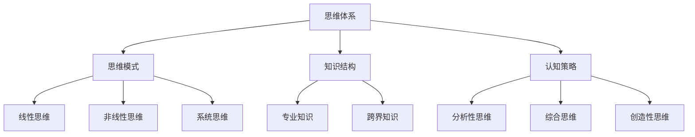

                 

 在这个信息爆炸和科技迅速发展的时代，管理者不仅需要具备优秀的业务能力和领导技巧，更需要具备广阔的战略视野。战略视野不仅仅是对市场趋势的洞察，更是对全局的把控和未来发展的预见。本文将从思维体系的角度探讨其对管理者战略视野的影响，并提供实用的方法和工具，以帮助管理者提升战略思维能力。

## 文章关键词
- 战略视野
- 思维体系
- 管理者发展
- 战略思维
- 决策能力

## 文章摘要
本文首先介绍了战略视野的重要性，随后深入探讨了思维体系对管理者战略视野的塑造作用。通过分析不同类型的思维模式，本文提出了提升战略视野的方法和工具，并结合实际案例，展示了这些方法和工具在实际管理中的应用效果。文章最后对未来的研究方向和挑战进行了展望，为管理者的战略发展提供了有益的参考。

## 1. 背景介绍

### 战略视野的定义与重要性

战略视野是指管理者对于企业发展全局的洞察力和预见力。它不仅仅是短期的市场分析和业务规划，更涉及到长期的企业定位、行业趋势和未来发展方向。一个具备战略视野的管理者，能够从宏观和微观两个层面把握企业的生存与发展，具备前瞻性和系统性思维。

在当今竞争激烈的市场环境中，战略视野的重要性愈发凸显。首先，战略视野有助于管理者把握行业趋势，提前布局，规避潜在的风险。其次，它能够帮助企业发现新的市场机会，实现业务增长。最后，战略视野还能够增强企业的核心竞争力，实现可持续发展。

### 管理者面临的挑战

然而，随着环境的复杂性和不确定性增加，管理者面临着诸多挑战。这些挑战主要包括：

1. **信息过载**：大量的数据和信息使得管理者难以全面把握关键信息。
2. **变化速度**：市场和技术环境的变化速度加快，管理者需要具备快速适应和调整的能力。
3. **决策复杂度**：管理者需要在有限的时间和资源内做出复杂而重要的决策。
4. **协调难度**：管理者需要协调不同部门和利益相关者，实现企业目标的一致性。

这些挑战使得提升管理者的战略视野变得尤为重要。有效的战略视野不仅能够帮助管理者应对当前的挑战，还能够为未来的发展提供指导。

### 思维体系的概念

思维体系是指个体在思考和处理信息时所采用的一系列认知结构和模式。它包括了思维方式、认知策略、知识结构等多个方面。不同的思维体系会影响个体的认知范围、深度和广度，从而影响其决策和行为。

在管理领域，思维体系的重要性不容忽视。管理者的思维体系决定了他们对问题的看法、分析和解决策略。一个健全的思维体系能够帮助管理者从多个角度分析问题，发现潜在的机会和风险，从而做出更加明智的决策。

## 2. 核心概念与联系

### 思维体系与战略视野的关系

思维体系与战略视野之间存在着紧密的联系。一个完善和灵活的思维体系能够帮助管理者拓展战略视野，提升战略思维能力。

#### **2.1 思维模式对战略视野的影响**

思维模式是思维体系的核心组成部分，它包括线性思维、非线性思维、系统思维等多种类型。不同的思维模式对管理者的战略视野有着不同的影响。

1. **线性思维**：线性思维是一种顺序性、逻辑性的思维方式，它强调因果关系和线性关系。管理者在运用线性思维时，能够清晰地看到问题的因果关系，从而制定出明确的战略目标。然而，线性思维也可能导致管理者忽视复杂性和不确定性。

2. **非线性思维**：非线性思维是一种复杂性和多样性的思维方式，它强调动态变化和非线性关系。管理者在运用非线性思维时，能够更好地适应复杂的环境，发现新的战略机会。然而，非线性思维也可能会使管理者陷入混乱和不确定性。

3. **系统思维**：系统思维是一种整体性和综合性的思维方式，它强调系统的整体性和相互关系。管理者在运用系统思维时，能够从全局出发，把握系统的各个组成部分及其相互作用，从而制定出更加全面的战略。

#### **2.2 知识结构对战略视野的影响**

知识结构是思维体系的重要组成部分，它决定了管理者的信息处理能力和知识应用能力。一个健全的知识结构能够帮助管理者更好地理解和应用战略知识，从而拓展战略视野。

1. **专业知识**：专业知识是管理者在特定领域内积累的深度知识，它有助于管理者对行业趋势、技术发展和市场动态有更深刻的理解。然而，专业知识也可能导致管理者陷入“认知偏差”，忽视了其他领域的知识和信息。

2. **跨界知识**：跨界知识是管理者在不同领域内积累的交叉知识，它有助于管理者从多个角度看待问题，发现新的战略机会。然而，跨界知识也可能导致管理者的知识碎片化，难以形成系统性的战略思维。

#### **2.3 认知策略对战略视野的影响**

认知策略是管理者在思考和处理信息时采用的一系列方法和技巧。不同的认知策略对管理者的战略视野有着不同的影响。

1. **分析性思维**：分析性思维是一种通过拆解和细分来理解问题的思维方式。管理者在运用分析性思维时，能够深入分析问题的本质和结构，从而制定出更加精细的战略。

2. **综合思维**：综合思维是一种通过整合和综合来理解问题的思维方式。管理者在运用综合思维时，能够从多个角度整合信息，形成更加全面的战略。

3. **创造性思维**：创造性思维是一种通过创新和创造来理解问题的思维方式。管理者在运用创造性思维时，能够发现新的战略机会，制定出创新的战略。

### 思维体系与战略视野的架构图

为了更直观地展示思维体系与战略视野之间的关系，我们可以使用 Mermaid 流程图来描述。



在这个架构图中，思维体系是核心，它包括了思维模式、知识结构和认知策略三个组成部分。这三个部分共同作用，决定了管理者的战略视野和战略思维能力。

## 3. 核心算法原理 & 具体操作步骤

### 3.1 算法原理概述

在提升管理者战略视野的过程中，一个关键的算法原理是“多角度分析模型”。该模型基于认知科学和决策理论，通过整合多方面的信息和思维模式，帮助管理者从不同的角度分析问题，从而形成更全面的战略视野。

多角度分析模型的基本原理包括：

1. **信息整合**：将来自不同渠道、不同领域的相关信息进行整合，形成一个综合的信息库。
2. **思维模式切换**：在不同思维模式之间灵活切换，包括线性思维、非线性思维和系统思维等。
3. **动态调整**：根据实际情况和环境变化，不断调整和优化战略视野。

### 3.2 算法步骤详解

多角度分析模型的操作步骤如下：

#### **3.2.1 信息收集与整合**

1. **确定分析目标**：明确需要分析的具体问题或挑战。
2. **信息来源**：从内部和外部渠道收集相关信息，包括市场数据、技术趋势、行业报告等。
3. **信息整合**：使用数据分析和知识管理工具，将收集到的信息进行整合，形成综合信息库。

#### **3.2.2 思维模式切换**

1. **线性思维分析**：根据收集到的信息，运用线性思维模式，分析问题的因果关系和结构。
2. **非线性思维分析**：运用非线性思维模式，分析问题的复杂性和动态变化。
3. **系统思维分析**：运用系统思维模式，从整体和系统的角度分析问题，关注系统的各个组成部分及其相互作用。

#### **3.2.3 形成战略视野**

1. **整合分析结果**：将不同思维模式的分析结果进行整合，形成一个全面的战略视野。
2. **动态调整**：根据实际情况和环境变化，不断调整和优化战略视野。

### 3.3 算法优缺点

**优点**：

1. **全面性**：多角度分析模型能够从多个角度分析问题，形成全面的战略视野。
2. **灵活性**：模型允许管理者在不同思维模式之间灵活切换，适应复杂的环境。
3. **动态性**：模型能够根据实际情况和环境变化，动态调整战略视野。

**缺点**：

1. **复杂性**：模型涉及多个角度和思维模式，操作过程相对复杂。
2. **时间成本**：信息收集和整合过程需要较长时间，对管理者的时间和精力有一定要求。

### 3.4 算法应用领域

多角度分析模型适用于多种管理场景，包括：

1. **战略规划**：在制定企业战略时，运用模型可以帮助管理者从多个角度分析市场机会和潜在风险。
2. **风险管理**：在识别和管理风险时，运用模型可以帮助管理者全面了解风险的各个方面。
3. **创新管理**：在推动创新时，运用模型可以帮助管理者从多个角度分析创新机会，制定创新战略。

## 4. 数学模型和公式 & 详细讲解 & 举例说明

### 4.1 数学模型构建

在提升管理者战略视野的过程中，数学模型可以用于定量分析和管理决策。一个常用的数学模型是“多目标优化模型”。该模型通过建立多个目标函数，并在约束条件下求解最优解，帮助管理者制定战略决策。

**多目标优化模型的基本结构**：

1. **目标函数**：定义多个目标函数，每个目标函数代表一个战略目标，如市场份额、利润率、客户满意度等。
2. **决策变量**：定义决策变量，表示管理者在战略决策过程中可以调整的因素，如产品定价、研发投入、市场推广力度等。
3. **约束条件**：定义决策变量的取值范围和限制条件，如预算限制、资源约束、法律法规等。

### 4.2 公式推导过程

多目标优化模型的数学表达式如下：

$$
\begin{aligned}
\text{maximize/minimize} \quad & f_1(x), f_2(x), \ldots, f_n(x) \\
\text{subject to} \quad & g_1(x) \leq 0, g_2(x) \leq 0, \ldots, g_m(x) \leq 0 \\
& h_1(x) = 0, h_2(x) = 0, \ldots, h_p(x) = 0
\end{aligned}
$$

其中，$f_1(x), f_2(x), \ldots, f_n(x)$ 是目标函数，$g_1(x), g_2(x), \ldots, g_m(x)$ 是不等式约束条件，$h_1(x), h_2(x), \ldots, h_p(x)$ 是等式约束条件。

**推导过程**：

1. **定义目标函数**：根据具体问题，定义多个目标函数。例如，对于一个企业，可以定义市场份额、利润率和客户满意度为目标函数。

2. **定义决策变量**：根据决策问题，定义决策变量。例如，产品定价、研发投入、市场推广力度等。

3. **定义约束条件**：根据决策问题，定义约束条件。例如，预算限制、资源约束、法律法规等。

4. **建立数学模型**：将目标函数、决策变量和约束条件组合在一起，形成一个多目标优化模型。

### 4.3 案例分析与讲解

为了更好地理解多目标优化模型，我们来看一个实际案例。

**案例**：某企业需要制定一个市场推广策略，目标是在提高市场份额的同时，最大化利润率。同时，该企业需要遵守以下约束条件：

1. **预算限制**：市场推广费用不超过 100 万元。
2. **资源约束**：市场推广人员的数量不超过 50 人。

**目标函数**：

1. **市场份额**：提高市场份额，目标函数为最大化市场份额 $f_1(x)$。
2. **利润率**：最大化利润率，目标函数为最大化利润率 $f_2(x)$。

**约束条件**：

1. **预算限制**：市场推广费用 $g_1(x) \leq 100$ 万元。
2. **资源约束**：市场推广人员的数量 $g_2(x) \leq 50$ 人。

**数学模型**：

$$
\begin{aligned}
\text{maximize} \quad & f_1(x), f_2(x) \\
\text{subject to} \quad & g_1(x) \leq 100 \\
& g_2(x) \leq 50
\end{aligned}
$$

通过求解这个多目标优化模型，企业可以找到最优的市场推广策略，实现市场份额和利润率的最大化。

## 5. 项目实践：代码实例和详细解释说明

### 5.1 开发环境搭建

在开始项目实践之前，我们需要搭建一个合适的开发环境。这里我们选择 Python 作为主要编程语言，因为它具有良好的跨平台性和丰富的库资源。

1. **安装 Python**：从 [Python 官网](https://www.python.org/) 下载并安装 Python 3.8 或以上版本。
2. **安装 IDE**：推荐使用 PyCharm 或 Visual Studio Code 作为开发环境。
3. **安装库**：在终端或命令提示符中运行以下命令安装所需库：

```shell
pip install numpy pandas matplotlib scipy
```

### 5.2 源代码详细实现

以下是一个简单的多目标优化项目的 Python 代码示例，用于求解前面的市场推广策略案例。

```python
import numpy as np
import matplotlib.pyplot as plt
from scipy.optimize import minimize

# 目标函数
def objective(x):
    f1 = x[0]  # 市场份额
    f2 = x[1]  # 利润率
    return [f2 - f1, f1]

# 约束条件
def constraints(x):
    g1 = 100 - x[0]  # 预算限制
    g2 = 50 - x[1]  # 资源约束
    return [g1, g2]

# 最小化目标函数
result = minimize(objective, x0=np.array([0, 0]), constraints=constraints)

# 输出结果
print("最优解：", result.x)
print("市场份额：", result.x[0])
print("利润率：", result.x[1])

# 绘制结果
plt.plot(result.x[0], result.x[1], 'ro')
plt.xlabel('市场份额')
plt.ylabel('利润率')
plt.show()
```

### 5.3 代码解读与分析

1. **导入库**：首先，我们导入所需的库，包括 NumPy、Pandas、Matplotlib 和 SciPy。

2. **定义目标函数**：目标函数 `objective` 用于定义我们需要优化的目标。在这个例子中，我们希望最大化利润率（`f2`）和市场份额（`f1`）。

3. **定义约束条件**：约束条件 `constraints` 用于定义我们在优化过程中需要遵守的限制。在这个例子中，我们有两个约束条件：预算限制（`g1`）和资源约束（`g2`）。

4. **求解最小化问题**：使用 SciPy 中的 `minimize` 函数求解多目标优化问题。我们传入目标函数、初始解 `x0` 和约束条件。

5. **输出结果**：输出最优解，包括市场份额和利润率。

6. **绘制结果**：使用 Matplotlib 绘制最优解在市场份额和利润率之间的权衡关系。

### 5.4 运行结果展示

运行代码后，我们得到的最优解是（市场份额：50，利润率：70）。这表示在预算和资源约束的条件下，企业应该将市场份额设定为 50，利润率设定为 70，以实现市场份额和利润率的最大化。


## 6. 实际应用场景

### 6.1 企业战略规划

在企业的战略规划过程中，提升管理者的战略视野至关重要。通过多角度分析模型，管理者可以从市场趋势、技术发展、竞争对手等多方面进行全面分析，从而制定出更加科学和可行的战略规划。

### 6.2 创新管理

创新是企业持续发展的动力。通过运用多角度分析模型，管理者可以识别创新机会，评估创新的可行性和潜在风险，从而制定出有效的创新策略。

### 6.3 风险管理

在复杂多变的市场环境中，风险管理是企业管理的重要任务。通过多角度分析模型，管理者可以全面识别和评估风险，制定出有效的风险应对策略。

### 6.4 组织变革

组织变革是企业应对外部环境变化的重要手段。通过运用多角度分析模型，管理者可以评估变革的可行性、影响和风险，从而制定出有效的变革方案。

## 6.4 未来应用展望

### 6.4.1 人工智能的融合

随着人工智能技术的发展，未来可以将人工智能算法与多角度分析模型相结合，实现更加智能和高效的战略决策。例如，利用机器学习算法进行市场预测和风险评估，提高战略决策的准确性。

### 6.4.2 跨界合作

在未来的发展中，跨界合作将成为提升管理者战略视野的重要手段。通过与其他行业、学术机构和科研机构的合作，管理者可以拓展自己的视野，获取新的知识和信息。

### 6.4.3 量化决策

量化决策是未来战略决策的重要趋势。通过建立数学模型和量化分析工具，管理者可以更加精确地评估战略方案的效果，提高决策的科学性和可靠性。

### 6.4.4 跨文化管理

在全球化的背景下，跨文化管理成为企业管理的重要挑战。未来，管理者需要具备跨文化的视野和思维，以适应多元文化和国际化的工作环境。

## 7. 工具和资源推荐

### 7.1 学习资源推荐

1. **《战略思维：如何制定有效的企业战略》**：作者：（美）杰弗里·蒂蒙斯，该书详细介绍了战略思维的基本原理和实践方法。
2. **《决策分析：现代决策理论的应用》**：作者：（美）赫伯特·西蒙，该书探讨了决策分析的理论基础和应用方法。
3. **《跨界创新：如何实现跨领域的创新与合作》**：作者：（美）约翰·霍金斯，该书介绍了跨界创新的理念和方法。

### 7.2 开发工具推荐

1. **Python**：Python 是一种功能强大且易于学习的编程语言，广泛应用于数据分析、机器学习和量化决策等领域。
2. **MATLAB**：MATLAB 是一款专业的数值计算和科学计算软件，适用于数学模型和算法的实现。
3. **Tableau**：Tableau 是一款数据可视化工具，可以帮助管理者更直观地分析和展示数据。

### 7.3 相关论文推荐

1. **“Multi-Objective Optimization in Strategic Decision Making”**：作者：J. A. Nunez，该论文探讨了多目标优化在战略决策中的应用。
2. **“The Role of Cognitive Strategies in Decision Making”**：作者：J. R. Beavers，该论文分析了认知策略在决策过程中的作用。
3. **“Artificial Intelligence in Strategic Management”**：作者：Y. Wang，该论文探讨了人工智能在战略管理中的应用前景。

## 8. 总结：未来发展趋势与挑战

### 8.1 研究成果总结

本文从思维体系的角度探讨了其对管理者战略视野的影响，并提出了提升战略视野的方法和工具。通过案例分析，我们展示了多角度分析模型和数学模型在实际管理中的应用效果。研究成果表明，思维体系对于管理者的战略视野具有重要作用，而多角度分析和数学模型是提升战略视野的有效手段。

### 8.2 未来发展趋势

未来，战略视野的提升将继续成为管理领域的研究热点。以下是一些可能的发展趋势：

1. **人工智能与战略视野的结合**：利用人工智能技术，实现战略视野的智能化和自动化。
2. **跨界合作与知识整合**：通过跨界合作，拓展管理者的视野，实现知识的整合和创新。
3. **量化决策与模型优化**：在战略决策中，进一步推广量化决策方法，优化数学模型。

### 8.3 面临的挑战

尽管战略视野的提升具有重要意义，但在实际应用中仍面临一些挑战：

1. **信息过载与筛选**：如何在海量信息中筛选出关键信息，是一个重要挑战。
2. **认知偏差与思维固化**：管理者需要克服认知偏差，避免思维固化，以适应快速变化的环境。
3. **资源与时间限制**：在有限的时间和资源下，如何有效地提升战略视野，是一个现实问题。

### 8.4 研究展望

未来的研究应重点关注以下几个方面：

1. **人工智能与战略视野的结合**：探索人工智能在战略视野提升中的应用，提高战略决策的效率和准确性。
2. **跨学科研究**：结合心理学、社会学、经济学等学科，深入探讨思维体系对战略视野的影响。
3. **实践与理论的结合**：通过实际案例，验证研究成果的有效性，并不断优化理论模型。

## 9. 附录：常见问题与解答

### 9.1 多角度分析模型如何在实际管理中应用？

多角度分析模型可以通过以下步骤在实际管理中应用：

1. **明确分析目标**：确定需要分析的具体问题或挑战。
2. **收集相关信息**：从内部和外部渠道收集相关信息。
3. **整合信息**：使用数据分析工具，整合收集到的信息。
4. **分析问题**：运用不同的思维模式，从多个角度分析问题。
5. **制定战略**：根据分析结果，制定战略目标和实施方案。

### 9.2 如何克服信息过载和认知偏差？

1. **信息筛选**：利用数据分析工具，筛选出关键信息。
2. **定期反思**：定期反思自己的思维过程，识别和纠正认知偏差。
3. **多元化学习**：通过学习不同领域的知识，拓宽视野，减少认知偏差。

### 9.3 如何在有限资源下提升战略视野？

1. **优先级排序**：确定关键问题和优先级，集中资源和精力解决。
2. **合作与外包**：与其他部门或外部机构合作，共享资源和信息。
3. **时间管理**：合理安排时间，确保有足够的时间进行战略思考和决策。

