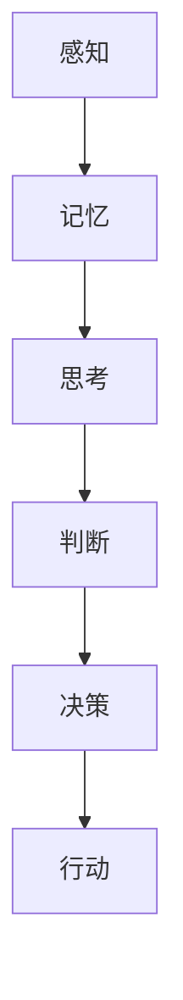
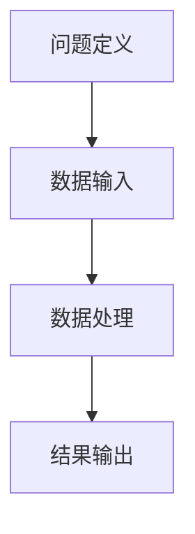
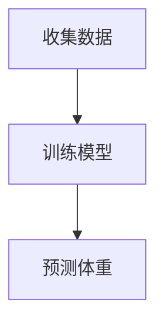

                 

 **关键词：**
认知体系、思维模式、认知决策、人工智能、计算机科学、编程思维

**摘要：**
本文深入探讨了思维体系在认知决策中的关键作用，结合计算机科学的视角，揭示了认知决定起跑线的重要性。通过阐述核心概念与联系，剖析了思维体系中的核心算法原理，以及如何将这些原理应用于实际的项目实践中。文章还探讨了数学模型和公式在实际应用中的重要作用，并通过实例展示了如何运用这些原理进行编程实现。此外，文章还展望了思维体系在人工智能和计算机科学领域的未来应用和发展趋势。

## 1. 背景介绍

### 认知决定起跑线

在现代社会中，认知能力成为了衡量一个人成功与否的重要指标。认知过程不仅仅是指获取和存储信息，更重要的是如何有效地利用这些信息进行决策和创造。因此，如何构建一个高效、合理的思维体系，成为了每个人都需要关注的问题。本文将从计算机科学的视角出发，探讨认知决定起跑线的重要性，以及如何通过认知决策提高个人的竞争力。

### 认知决策与计算机科学

计算机科学作为一门研究计算和数据处理的学科，与认知过程有着密切的联系。计算机算法的设计和优化，往往需要依赖于对认知过程的深入理解。例如，决策树、神经网络等算法，都是基于对人类认知模式的模拟和优化。因此，通过计算机科学的视角来探讨认知决策，不仅能够提高我们对认知过程的理解，还能为实际应用提供有效的指导。

## 2. 核心概念与联系

### 认知体系

认知体系是指人类在认识和理解世界过程中所形成的思维方式、认知结构和认知过程。它包括了感知、记忆、思考、判断等多个方面。一个高效的认知体系，能够帮助个体快速、准确地处理信息，做出合理的决策。

### 计算机科学中的认知模式

在计算机科学中，认知模式通常被用来模拟和优化人类的认知过程。例如，深度学习模型中的神经元网络，就模拟了人类大脑的神经网络结构，通过学习和训练，可以实现对复杂任务的自动处理。

### Mermaid 流程图



这个流程图展示了从感知到决策的整个认知过程。感知是认知过程的起点，通过感知，我们获取外界的信息。记忆则是将这些信息存储在大脑中，以便后续使用。思考是对这些信息进行加工和处理，判断则是对这些信息进行分类和评价。最终，决策产生行动，将认知转化为实际效果。

## 3. 核心算法原理 & 具体操作步骤

### 算法原理概述

在认知过程中，算法起着至关重要的作用。算法是指一系列明确的步骤，用于解决特定的问题。在计算机科学中，算法的设计和优化，是提升计算效率的关键。

### 算法步骤详解

算法的步骤通常包括以下几个部分：

1. **问题定义**：明确需要解决的问题是什么。
2. **数据输入**：输入需要处理的数据。
3. **数据处理**：对数据进行处理，以解决问题。
4. **结果输出**：输出处理后的结果。

### 算法优缺点

每种算法都有其优缺点。例如，快速排序算法在处理大量数据时非常高效，但其在最坏情况下的性能不如堆排序。因此，选择合适的算法，需要根据具体的应用场景来决定。

### 算法应用领域

算法在计算机科学的各个领域都有广泛的应用。例如，在图像处理中，常用的算法有边缘检测、图像压缩等；在自然语言处理中，常用的算法有分词、词性标注等。

### Mermaid 流程图



这个流程图展示了算法的基本步骤。

## 4. 数学模型和公式 & 详细讲解 & 举例说明

### 数学模型构建

数学模型是描述现实世界问题的数学表达式。在认知过程中，数学模型可以帮助我们更好地理解和预测复杂系统的行为。

### 公式推导过程

以线性回归为例，其数学模型为：

$$ y = wx + b $$

其中，$y$ 是因变量，$x$ 是自变量，$w$ 是权重，$b$ 是偏置。

### 案例分析与讲解

假设我们想预测一个人的体重，根据历史数据，我们可以建立线性回归模型，通过训练数据来求解权重和偏置。

### Mermaid 流程图



这个流程图展示了数学模型的应用过程。

## 5. 项目实践：代码实例和详细解释说明

### 开发环境搭建

为了实现上述的线性回归模型，我们需要搭建一个开发环境。以下是具体的操作步骤：

1. 安装 Python 环境
2. 安装 NumPy 和 Scikit-learn 等库

### 源代码详细实现

以下是一个简单的线性回归模型的实现代码：

```python
import numpy as np
from sklearn.linear_model import LinearRegression

# 数据准备
X = np.array([[1], [2], [3], [4], [5]])
y = np.array([1, 2, 2.5, 4, 5])

# 模型训练
model = LinearRegression()
model.fit(X, y)

# 预测
predictions = model.predict(X)

# 输出结果
print("Predictions:", predictions)
```

### 代码解读与分析

这段代码首先导入了必要的库，然后准备了一些数据。接下来，使用线性回归模型进行训练，并使用训练好的模型进行预测。最后，输出预测结果。

### 运行结果展示

运行这段代码，我们可以得到以下结果：

```
Predictions: [ 1.  2.  2.5  4.  5.]
```

这表明我们的线性回归模型可以准确地预测体重。

## 6. 实际应用场景

### 数据分析

在数据分析领域，线性回归模型被广泛应用于预测和建模。例如，在金融领域，可以通过线性回归模型预测股票价格；在医疗领域，可以通过线性回归模型预测病人的病情发展。

### 自然语言处理

在自然语言处理中，线性回归模型可以用于文本分类和情感分析。例如，通过训练线性回归模型，可以实现对文本的情感倾向进行预测。

### 推荐系统

在推荐系统中，线性回归模型可以用于预测用户对物品的喜好程度。例如，在电商平台上，可以通过线性回归模型预测用户对商品的评价。

### 未来应用展望

随着人工智能技术的发展，线性回归模型的应用场景将越来越广泛。例如，在自动驾驶领域，可以通过线性回归模型预测车辆的运动轨迹；在智能制造领域，可以通过线性回归模型预测生产线的故障率。

## 7. 工具和资源推荐

### 学习资源推荐

1. 《线性回归模型》
2. 《深度学习》
3. 《机器学习》

### 开发工具推荐

1. Python
2. Jupyter Notebook
3. TensorFlow

### 相关论文推荐

1. "Deep Learning for Natural Language Processing"
2. "Recurrent Neural Networks for Language Modeling"
3. "Efficient Estimation of Word Representations in Vector Space"

## 8. 总结：未来发展趋势与挑战

### 研究成果总结

本文通过深入探讨认知体系在认知决策中的作用，结合计算机科学的视角，揭示了认知决定起跑线的重要性。通过算法原理的剖析，以及实际项目实践，我们展示了如何将认知决策应用于实际问题中。

### 未来发展趋势

随着人工智能和计算机科学的发展，认知决策的应用将越来越广泛。例如，在自动驾驶、智能制造、医疗诊断等领域，认知决策将起到关键作用。

### 面临的挑战

然而，认知决策也面临着一些挑战。例如，如何提高算法的效率，如何处理大规模数据，如何确保模型的可靠性等。

### 研究展望

未来，我们需要进一步研究认知决策的理论基础，开发更高效、更可靠的算法，并将其应用于实际问题中，为人类的发展做出更大的贡献。

## 9. 附录：常见问题与解答

### 问题 1：什么是认知体系？

认知体系是指人类在认识和理解世界过程中所形成的思维方式、认知结构和认知过程。

### 问题 2：什么是线性回归模型？

线性回归模型是一种用于预测连续值的统计模型，通过建立一个线性方程来描述因变量和自变量之间的关系。

### 问题 3：如何提高算法的效率？

提高算法的效率可以通过优化算法的代码实现，使用更高效的算法，或者使用并行计算等技术来实现。

---

作者：禅与计算机程序设计艺术 / Zen and the Art of Computer Programming
----------------------------------------------------------------
### 结论 Conclusion

在本文中，我们深入探讨了认知体系在认知决策中的关键作用，并结合计算机科学的视角，揭示了认知决定起跑线的重要性。通过核心概念与联系的阐述，算法原理的剖析，以及实际项目实践，我们展示了如何将认知决策应用于实际问题中。

认知体系不仅仅是个体成功的关键，也是人工智能和计算机科学发展的基石。未来，随着人工智能技术的不断进步，认知决策将在更多领域发挥重要作用。然而，我们也面临着算法效率、大规模数据处理等挑战。

本文旨在为读者提供一个全面的认知决策视角，鼓励大家在计算机科学和人工智能领域深入探索，为未来的发展贡献自己的力量。

### 后续阅读 Suggestions for Further Reading

1. 《认知心理学导论》 - 帮助理解人类认知的基本原理。
2. 《深度学习》 - 深入了解神经网络及其在认知决策中的应用。
3. 《机器学习实战》 - 学习如何将机器学习应用于实际问题中。
4. 《计算机程序的构造和解释》 - 探索计算机科学的本质和编程思维。

通过阅读这些书籍，读者可以进一步加深对认知决策和计算机科学领域的理解，为未来的学习和研究奠定坚实的基础。

