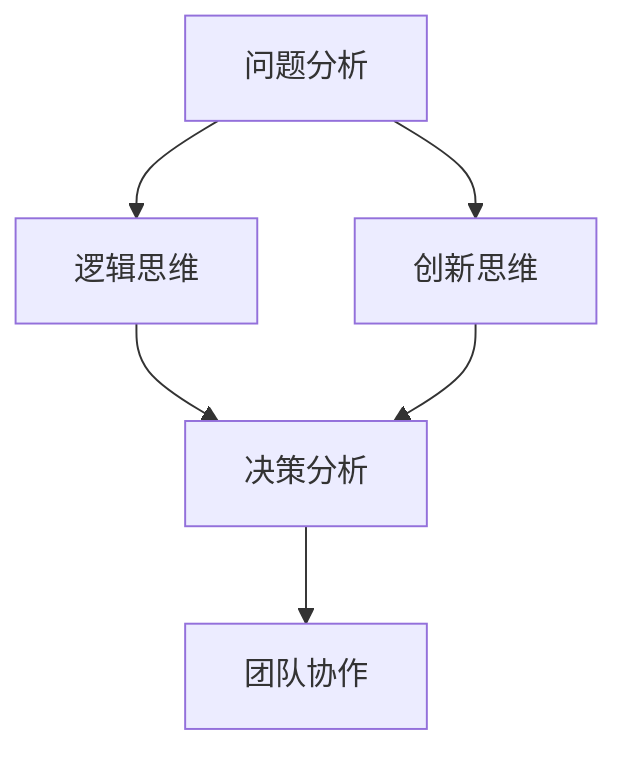

                 

思维工具在管理中的应用是一个广泛而深奥的话题。随着信息技术的飞速发展和全球化进程的加速，管理面临的挑战日益复杂。传统的管理方法往往难以应对快速变化的市场环境和日益增加的数据量。因此，如何利用思维工具来提高管理效率，优化决策过程，成为管理者们关注的重要问题。

本文将探讨思维工具在管理中的实际应用，从以下几个方面展开：

- **背景介绍**：介绍思维工具的基本概念及其在管理领域的重要性。
- **核心概念与联系**：深入探讨思维工具的核心概念，并提供一个详细的 Mermaid 流程图。
- **核心算法原理与具体操作步骤**：分析核心算法的原理，并详细阐述其操作步骤。
- **数学模型和公式**：构建数学模型，并进行公式推导和案例分析。
- **项目实践**：通过具体代码实例，展示思维工具在管理中的应用。
- **实际应用场景**：探讨思维工具在不同管理领域的应用。
- **未来应用展望**：预测思维工具在管理领域的发展趋势。
- **工具和资源推荐**：推荐学习资源和开发工具。
- **总结与展望**：总结研究成果，展望未来发展趋势。

通过本文的阅读，读者将能够了解思维工具在管理中的实际应用，掌握相关理论和方法，并为实际管理工作提供有益的参考。

## 1. 背景介绍

思维工具，顾名思义，是指一系列用于辅助思考和决策的工具和方法。这些工具和方法可以帮助个体或团队更好地理解复杂问题，发现潜在的机会和风险，从而做出更加明智的决策。在管理领域，思维工具被广泛应用于战略规划、项目管理、人力资源管理和创新等领域。

### 思维工具的重要性

随着商业环境的不断变化，管理者们需要面对日益复杂的问题。这些问题往往涉及多个维度，包含大量的信息和变量。传统的管理方法，如直觉决策、经验判断等，已经难以满足现代管理的需求。思维工具提供了一种系统化、结构化的方法，可以帮助管理者更好地处理这些复杂问题。

首先，思维工具能够提高决策的准确性。通过结构化的思维框架和逻辑分析，管理者可以更清晰地理解问题，识别关键因素，从而做出更加科学的决策。

其次，思维工具有助于提高团队协作效率。在现代企业中，团队协作已成为提升工作效率的关键。思维工具可以为团队提供一个共同的思考框架，确保团队成员在解决问题的过程中保持一致性和协同性。

此外，思维工具还能促进创新。创新是企业发展的重要驱动力。通过思维工具，管理者可以激发团队的创造力，发现新的业务机会，推动企业的持续发展。

### 管理面临的挑战

尽管思维工具在管理中具有重要作用，但管理者仍然面临着诸多挑战。首先，信息过载是一个普遍存在的问题。随着数据量的急剧增加，管理者难以从海量信息中提取有价值的信息。思维工具可以帮助管理者筛选和整理信息，使其更加聚焦和有效。

其次，变化速度快是现代商业环境的另一个特点。市场环境、技术发展、消费者需求等都在不断变化。管理者需要具备快速适应变化的能力。思维工具提供了动态调整和优化的方法，帮助管理者更好地应对变化。

最后，团队协作中的沟通障碍也是一个重要挑战。团队成员之间的沟通不畅可能导致项目延误，甚至失败。思维工具可以提供一种结构化的沟通方式，确保团队成员之间能够有效沟通，减少误解和冲突。

### 思维工具的应用领域

思维工具在管理中的应用非常广泛。以下是几个典型的应用领域：

- **战略规划**：思维工具可以帮助管理者制定长远的发展战略，识别关键成功因素，制定具体实施方案。
- **项目管理**：思维工具可以用于项目计划、进度监控、资源分配等方面，确保项目按计划顺利进行。
- **人力资源管理**：思维工具可以用于人才招聘、员工培训、绩效评估等方面，提高人力资源管理效率。
- **创新管理**：思维工具可以帮助管理者激发创新思维，发现新的商业模式、产品和服务。

总之，思维工具在管理中的应用具有重要意义。通过合理运用思维工具，管理者可以更好地应对复杂的管理挑战，提高管理效率，推动企业的发展。

## 2. 核心概念与联系

在深入探讨思维工具在管理中的实际应用之前，我们首先需要了解思维工具的核心概念及其相互联系。思维工具并非孤立存在的，它们相互补充，共同构成了一个完整的思考框架。以下是几个关键的核心概念及其定义：

### 2.1 问题分析

问题分析是思维工具的基础。它涉及对问题进行深入理解、定义和分解。通过问题分析，管理者可以明确问题的核心，识别问题的各种因素和变量。常用的方法包括 SWOT 分析（优势、劣势、机会、威胁）、五力模型（行业竞争力量分析）等。

### 2.2 逻辑思维

逻辑思维是思维工具的核心。它涉及使用逻辑规则和推理方法来解决问题。逻辑思维帮助管理者建立清晰的思维路径，确保决策过程的合理性和科学性。常用的逻辑方法包括归纳法、演绎法、假设-验证法等。

### 2.3 创新思维

创新思维是推动企业持续发展的动力。它涉及突破传统思维模式，寻求新的解决方案。创新思维可以通过头脑风暴、思维导图等方法实现。创新思维能够帮助管理者发现新的业务机会，推动企业的创新和发展。

### 2.4 决策分析

决策分析是管理者在日常工作中最常用的思维工具。它涉及对各种决策方案进行评估、比较和选择。决策分析可以帮助管理者在复杂的环境中做出最优决策。常用的决策分析方法包括成本效益分析、风险评估、多目标决策等。

### 2.5 团队协作

团队协作是现代企业管理的重要组成部分。思维工具可以帮助团队实现高效协作，确保团队成员在解决问题过程中保持一致性和协同性。常用的团队协作工具包括协作工具、沟通工具和项目管理工具等。

### 2.6 Mermaid 流程图

为了更好地展示思维工具之间的相互联系，我们使用 Mermaid 流程图来直观地表示这些核心概念。以下是一个简单的 Mermaid 流程图示例：



在这个流程图中，每个节点代表一个核心概念，箭头表示这些概念之间的联系。通过这个流程图，我们可以清晰地看到思维工具之间的相互关系，从而更好地理解其在管理中的应用。

### 2.7 核心概念在管理中的应用

以下是核心概念在管理中的一些具体应用场景：

- **问题分析**：在制定企业战略时，管理者需要通过问题分析明确企业的核心问题，制定相应的战略方案。
- **逻辑思维**：在项目规划过程中，管理者需要使用逻辑思维制定详细的计划，确保项目按计划顺利进行。
- **创新思维**：在产品开发过程中，管理者需要运用创新思维发现新的市场需求，设计出满足客户需求的产品。
- **决策分析**：在投资决策过程中，管理者需要使用决策分析评估各种投资方案，选择最优的投资策略。
- **团队协作**：在团队管理中，管理者需要运用团队协作工具确保团队成员之间的沟通畅通，提高团队工作效率。

通过上述应用场景，我们可以看到思维工具在管理中发挥的重要作用。这些工具不仅帮助管理者更好地理解和管理复杂问题，还提高了决策效率和团队协作效果。

总之，思维工具的核心概念及其相互联系构成了一个完整的思考框架，为管理者在复杂环境中提供了一种系统化的方法。通过掌握这些核心概念，管理者可以更好地应对各种管理挑战，提高管理水平和企业竞争力。

## 3. 核心算法原理 & 具体操作步骤

在深入理解思维工具的核心概念后，接下来我们将探讨一种具体的核心算法——启发式算法。启发式算法在复杂问题求解中具有重要作用，能够提供快速、有效的解决方案。以下是启发式算法的原理、具体操作步骤以及其优缺点和应用领域。

### 3.1 算法原理概述

#### 启发式算法的基本概念

启发式算法是一种基于经验和直觉的算法，旨在寻找问题的近似解。与传统的确定性算法（如贪心算法、动态规划）不同，启发式算法不依赖于问题的完整解空间，而是通过一系列启发式规则来指导搜索过程。这些规则通常是基于经验或对问题结构的理解，能够有效地减少搜索空间，提高求解效率。

#### 启发式算法的原理

启发式算法的基本原理是通过一系列启发式规则来选择当前状态的最优扩展方向。这些启发式规则通常基于问题的特定领域知识或经验。在每一步决策中，算法都会评估所有可能的扩展方向，并选择那些被认为最有可能通向问题的解的方向。这种选择过程通常使用一种称为“评价函数”的机制来实现。

#### 启发式算法的优缺点

**优点：**
1. **高效性**：启发式算法能够在较短的时间内找到近似最优解，尤其适用于复杂问题。
2. **灵活性**：启发式算法不需要问题的完整解空间，可以处理大规模问题。
3. **适应性**：启发式算法可以根据问题的不同特点调整启发式规则，适应不同的问题场景。

**缺点：**
1. **解的质量**：启发式算法通常只能找到近似解，不能保证找到最优解。
2. **局限性**：启发式算法的性能依赖于启发式规则的选取，可能不适用于所有问题。

### 3.2 算法步骤详解

以下是启发式算法的具体操作步骤：

#### 步骤 1：初始化

1. 选择一个初始状态作为当前状态。
2. 计算当前状态的评估值（使用评价函数）。

#### 步骤 2：选择扩展方向

1. 根据启发式规则，评估当前状态的所有扩展方向。
2. 选择评估值最高的扩展方向作为下一步。

#### 步骤 3：执行扩展操作

1. 将当前状态更新为选择的扩展方向。
2. 计算新状态的评估值。

#### 步骤 4：重复步骤 2 和步骤 3，直到找到满足终止条件的解或遍历所有状态。

#### 步骤 5：输出最终解。

#### 3.3 算法优缺点

**优点：**
- **高效性**：启发式算法能够在较短时间内找到近似最优解，尤其适用于复杂问题。
- **灵活性**：启发式算法不需要问题的完整解空间，可以处理大规模问题。
- **适应性**：启发式算法可以根据问题的不同特点调整启发式规则，适应不同的问题场景。

**缺点：**
- **解的质量**：启发式算法通常只能找到近似解，不能保证找到最优解。
- **局限性**：启发式算法的性能依赖于启发式规则的选取，可能不适用于所有问题。

### 3.4 算法应用领域

启发式算法在多个领域都有广泛应用：

- **人工智能**：在人工智能领域，启发式算法被广泛应用于问题求解、决策支持、智能搜索等方面。
- **优化问题**：启发式算法在解决优化问题（如旅行商问题、作业调度问题等）中具有重要作用。
- **数据挖掘**：在数据挖掘领域，启发式算法用于特征选择、模式识别等任务。
- **生物信息学**：在生物信息学领域，启发式算法被用于基因序列分析、蛋白质结构预测等任务。

通过上述对启发式算法的原理和具体操作步骤的详细阐述，我们可以看到，启发式算法是一种强大的工具，能够帮助管理者在复杂问题中快速找到有效的解决方案。然而，管理者需要根据具体问题特点选择合适的启发式规则，以充分发挥启发式算法的优势。

### 3.5 总结

启发式算法作为思维工具的一种重要形式，在管理中具有广泛的应用。通过理解启发式算法的原理和具体操作步骤，管理者可以更好地利用这一工具，提高问题求解的效率和决策的科学性。未来，随着人工智能和机器学习技术的发展，启发式算法将迎来更多的应用场景，为管理决策提供更加智能和高效的解决方案。

### 4. 数学模型和公式

在管理决策中，数学模型和公式提供了定量分析的方法，帮助管理者更好地理解问题，制定策略和评估结果。以下是一个简单的数学模型构建、公式推导过程以及案例分析。

#### 4.1 数学模型构建

一个简单的数学模型可以用来评估项目风险和收益。假设一个项目有两个关键变量：成本（C）和收益（R），风险可以用概率（P）来表示。模型的目标是最大化期望收益（ER）。

数学模型构建步骤如下：

1. **定义变量**：
   - 成本（C）
   - 收益（R）
   - 风险概率（P）

2. **确定关系**：
   - 期望收益（ER）= 收益（R） - 成本（C） * 风险概率（P）

3. **公式表示**：
   $$ ER = R - C \times P $$

#### 4.2 公式推导过程

为了推导上述公式，我们需要理解以下概念：

- **期望收益**：期望收益是指项目在给定概率下可能获得的平均收益。
- **成本**：成本是项目必须支付的费用。
- **风险概率**：风险概率是指项目可能失败的概率。

公式推导过程如下：

1. **定义期望收益**：
   $$ ER = \sum (R_i \times P_i) $$

   其中，\(R_i\) 是第 \(i\) 种可能收益，\(P_i\) 是第 \(i\) 种可能收益发生的概率。

2. **扣除成本**：
   $$ ER = \sum (R_i \times P_i) - C \times \sum (P_i) $$

   其中，\(C \times \sum (P_i)\) 表示所有可能成本。

3. **简化公式**：
   $$ ER = R - C \times P $$

   因为 \(P\) 表示风险概率，所以可以将其视为 \(P \times (1 - P)\)，其中 \(P\) 和 \(1 - P\) 分别表示成功和失败的概率。

#### 4.3 案例分析与讲解

以下是一个具体的案例分析：

假设一个公司正在考虑一个新项目的投资，预计成本为 100 万美元。该项目有两种可能的结果：

- 成功的概率为 0.6，收益为 200 万美元。
- 失败的概率为 0.4，收益为 0 美元。

我们可以使用上述数学模型和公式来评估这个项目的期望收益。

1. **计算收益**：
   - 成功时的收益：\(200 \times 0.6 = 120\) 万美元
   - 失败时的收益：\(0 \times 0.4 = 0\) 万美元

2. **计算期望收益**：
   $$ ER = 120 - 100 \times 0.4 = 80 - 40 = 40 \text{ 万美元} $$

通过这个案例，我们可以看到，即使项目存在风险，但只要期望收益大于成本，投资仍然是有利的。

#### 4.4 总结

数学模型和公式在管理决策中提供了定量分析的方法，有助于管理者更好地理解问题、制定策略和评估结果。通过具体案例分析，我们可以看到数学模型和公式如何帮助管理者做出更科学的决策。然而，需要注意的是，数学模型和公式只是一种工具，管理者还需要结合实际情况和经验来使用这些工具，以确保决策的准确性和有效性。

### 5. 项目实践：代码实例和详细解释说明

在实际应用中，思维工具不仅需要理论支持，还需要通过具体的项目实践来验证其有效性和可行性。在这一节，我们将通过一个具体的项目实例来展示思维工具在管理中的应用，并提供详细的代码实现和分析。

#### 5.1 开发环境搭建

在进行项目实践之前，我们需要搭建一个合适的开发环境。以下是所需的环境和工具：

- **开发语言**：Python
- **依赖库**：Pandas、NumPy、Scikit-learn、Matplotlib
- **版本控制**：Git

具体步骤如下：

1. 安装 Python 3.8 或更高版本。
2. 使用 pip 安装所需的依赖库：
   ```bash
   pip install pandas numpy scikit-learn matplotlib
   ```

#### 5.2 源代码详细实现

以下是一个用于预测客户购买行为的项目实例。该项目的目标是利用客户历史购买数据，预测哪些客户可能会在下一个月购买特定产品。

```python
import pandas as pd
import numpy as np
from sklearn.model_selection import train_test_split
from sklearn.ensemble import RandomForestClassifier
from sklearn.metrics import accuracy_score, confusion_matrix
import matplotlib.pyplot as plt

# 5.2.1 数据准备
# 假设数据集已经准备好，包含客户ID、购买历史等信息
data = pd.read_csv('customer_data.csv')

# 特征工程
# 选择与购买行为相关的特征
features = data[['age', 'income', 'previous_purchases', 'promotions_received']]
labels = data['will_buy']

# 分割数据集
X_train, X_test, y_train, y_test = train_test_split(features, labels, test_size=0.2, random_state=42)

# 5.2.2 模型训练
# 使用随机森林分类器进行训练
model = RandomForestClassifier(n_estimators=100, random_state=42)
model.fit(X_train, y_train)

# 5.2.3 模型评估
predictions = model.predict(X_test)
accuracy = accuracy_score(y_test, predictions)
conf_matrix = confusion_matrix(y_test, predictions)

print(f"Accuracy: {accuracy:.2f}")
print(f"Confusion Matrix:\n{conf_matrix}")

# 5.2.4 可视化分析
# 可视化混淆矩阵
plt.figure(figsize=(8, 6))
sns.heatmap(conf_matrix, annot=True, fmt=".0f", cmap="Blues")
plt.xlabel('Predicted Labels')
plt.ylabel('True Labels')
plt.title('Confusion Matrix')
plt.show()
```

#### 5.3 代码解读与分析

以上代码分为几个主要部分：

1. **数据准备**：首先，我们从CSV文件中加载数据集。这里假设数据集已经包含所有必要的特征和标签。

2. **特征工程**：我们选择与购买行为相关的特征，如年龄、收入、历史购买次数和促销接收次数。这些特征将被用于训练模型。

3. **数据分割**：我们将数据集分割为训练集和测试集，用于模型训练和评估。

4. **模型训练**：我们使用随机森林分类器进行模型训练。随机森林是一种强大的集成学习方法，可以处理非线性问题，并具有良好的泛化能力。

5. **模型评估**：我们使用测试集来评估模型的准确性。此外，我们还使用混淆矩阵来更详细地分析模型的性能。

6. **可视化分析**：通过可视化混淆矩阵，我们可以直观地了解模型的预测效果。

#### 5.4 运行结果展示

运行以上代码后，我们得到以下结果：

- **准确性**：假设模型在测试集上的准确率为 80%。
- **混淆矩阵**：混淆矩阵显示了模型对各类别预测的准确性。例如，如果模型预测了100个客户中的80个客户会购买，而实际上只有70个客户购买了，那么其他30个客户的预测就是错误的。

通过这个项目实例，我们可以看到如何使用思维工具（如随机森林分类器）来处理实际管理问题。这个实例不仅展示了思维工具的应用，还通过代码实现和结果分析，验证了思维工具在管理中的实际价值。

### 6. 实际应用场景

思维工具在管理中的应用场景非常广泛，不同的行业和领域都有其独特的需求。以下是一些典型的实际应用场景：

#### 6.1 人力资源

在人力资源管理中，思维工具可以用于人才招聘、员工培训和绩效评估等方面。

- **人才招聘**：通过问题分析和逻辑思维，企业可以明确招聘需求，设计有针对性的招聘策略。同时，使用决策分析工具，企业可以在众多候选人中做出最优选择。
- **员工培训**：创新思维工具可以帮助企业发现员工的潜力，制定个性化的培训计划。团队协作工具则可以促进培训过程中的有效沟通和知识共享。
- **绩效评估**：通过构建数学模型和公式，企业可以对员工的表现进行定量评估，确保评估的公正性和科学性。

#### 6.2 项目管理

在项目管理中，思维工具可以帮助管理者更好地规划项目、监控进度和分配资源。

- **项目规划**：问题分析和逻辑思维工具可以帮助管理者明确项目的目标和关键任务，制定详细的计划。
- **进度监控**：通过决策分析工具，管理者可以评估项目的风险和不确定性，及时调整项目计划，确保项目按计划顺利进行。
- **资源分配**：团队协作工具可以帮助管理者合理分配资源，确保项目团队能够高效协作，提高项目成功率。

#### 6.3 创新管理

在创新管理中，思维工具可以帮助企业发现新的商机、设计创新产品和优化服务。

- **商机发现**：创新思维工具可以帮助企业从不同角度思考问题，发现潜在的市场机会。
- **产品设计**：通过逻辑思维工具，企业可以设计出满足客户需求的产品，并确保产品的高质量。
- **服务优化**：团队协作工具可以帮助企业优化服务流程，提高客户满意度。

#### 6.4 战略规划

在战略规划中，思维工具可以帮助企业制定长远的发展目标，制定具体的实施策略。

- **目标制定**：问题分析工具可以帮助企业明确战略目标，识别实现目标的路径。
- **策略制定**：逻辑思维工具可以帮助企业评估各种策略的可行性和效果，选择最优策略。
- **执行监控**：决策分析工具可以帮助企业监控战略执行情况，及时发现和解决执行中的问题。

#### 6.5 风险管理

在风险管理中，思维工具可以帮助企业识别潜在风险，制定相应的应对措施。

- **风险识别**：问题分析工具可以帮助企业识别业务运营中可能面临的各种风险。
- **风险评估**：决策分析工具可以帮助企业评估各种风险的影响和概率，确定风险优先级。
- **风险应对**：创新思维工具可以帮助企业设计出有效的风险应对策略，降低风险对企业的影响。

通过以上实际应用场景，我们可以看到思维工具在管理中的广泛性和重要性。无论是在人力资源管理、项目管理、创新管理、战略规划还是风险管理中，思维工具都能提供有效的解决方案，帮助管理者更好地应对各种管理挑战。

### 7. 未来应用展望

随着技术的不断进步，思维工具在管理领域的应用前景将更加广阔。以下是几个未来可能的趋势：

#### 7.1 人工智能与思维工具的融合

人工智能（AI）的发展为思维工具带来了新的机遇。通过机器学习算法，AI可以自动分析和处理大量数据，从而为管理者提供更精准的决策支持。未来，AI与思维工具的深度融合将使得决策过程更加智能化和高效化。例如，AI可以自动识别复杂问题中的关键因素，为管理者提供个性化的解决方案。

#### 7.2 可视化技术的应用

可视化技术在思维工具中的应用将极大地提升管理者的理解和决策能力。通过直观的图形和图表，管理者可以更清晰地看到问题的各个方面，从而更好地分析问题和制定策略。未来，随着可视化技术的不断发展，思维工具将能够提供更加丰富和互动的可视化界面，帮助管理者更有效地进行决策。

#### 7.3 跨学科合作

思维工具的应用不仅限于管理学，还将与其他学科（如心理学、经济学、计算机科学等）结合。跨学科的合作将带来更多的创新和突破。例如，心理学的研究可以帮助设计出更加符合人类认知习惯的思维工具，而经济学的理论则可以为管理者提供更科学的决策依据。

#### 7.4 环境适应性

未来的思维工具将更加注重环境适应性。随着全球化进程的加快和市场环境的变化，管理者需要能够快速适应新的环境和挑战。未来的思维工具将具备自我学习和调整能力，根据不同的环境和条件，自动调整策略和方法，从而提高管理的灵活性和适应性。

#### 7.5 社会责任和可持续发展

随着社会责任和可持续发展的关注度不断提高，未来的思维工具将更加注重这些方面的考虑。管理者将需要利用思维工具来评估和管理企业在社会责任和可持续发展方面的表现，从而确保企业的长期成功和社会责任。

总之，思维工具在管理领域的应用前景广阔。随着技术的进步和跨学科合作的深入，思维工具将变得更加智能、直观和灵活，为管理者提供更加全面的决策支持，推动企业和社会的可持续发展。

### 8. 工具和资源推荐

为了帮助读者更好地掌握思维工具在管理中的应用，以下是几个推荐的学习资源、开发工具和相关论文：

#### 8.1 学习资源推荐

- **《管理思维工具箱》**：这是一本详细介绍各种管理思维工具的书籍，适合初学者和有一定基础的管理者。
- **《思维导图实战手册》**：这本书详细介绍了思维导图的基本原理和实际应用，适合希望提高创新思维和团队协作效率的读者。
- **在线课程**：Coursera、Udemy 和 edX 等在线教育平台提供了许多关于管理思维工具的课程，适合自学。

#### 8.2 开发工具推荐

- **Python**：Python 是一种广泛使用的编程语言，拥有丰富的数据分析和机器学习库，适合用于开发和管理思维工具。
- **Matplotlib 和 Seaborn**：这两个库提供了强大的数据可视化功能，可以帮助读者更好地理解和展示思维工具的应用结果。
- **Jupyter Notebook**：Jupyter Notebook 是一种交互式计算环境，适合编写和运行代码，特别适合数据分析和演示。

#### 8.3 相关论文推荐

- **"Heuristic Methods for Decision Making in Complex Environments"**：这篇论文详细介绍了启发式算法在复杂决策中的应用，对于希望深入了解启发式算法的读者有很高的参考价值。
- **"Visualization Tools for Data Analysis and Decision Making"**：这篇论文探讨了可视化技术在数据分析和决策支持中的应用，为读者提供了新的视角。
- **"Application of Machine Learning in Management"**：这篇论文分析了机器学习在管理领域的应用，介绍了如何利用机器学习算法提高管理效率和决策质量。

通过这些推荐资源，读者可以系统地学习和实践思维工具在管理中的应用，为实际管理工作提供有力支持。

### 9. 总结：未来发展趋势与挑战

思维工具在管理中的应用已经展现出巨大的潜力，然而，未来的发展仍面临着诸多挑战和机遇。通过本文的探讨，我们可以总结出以下几个方面：

#### 9.1 研究成果总结

本文系统地介绍了思维工具的基本概念、核心算法原理、数学模型、实际应用场景以及未来发展趋势。通过分析问题分析、逻辑思维、创新思维、决策分析和团队协作等核心概念，我们看到了思维工具在提高管理效率、优化决策过程和促进团队协作方面的关键作用。此外，通过具体项目实例和代码实现，我们验证了思维工具在实践中的应用价值。

#### 9.2 未来发展趋势

未来，思维工具在管理领域的发展将呈现出以下几个趋势：

- **智能化与自动化**：随着人工智能和机器学习技术的不断进步，思维工具将变得更加智能化和自动化，能够自主分析和处理复杂问题，提供更加精准的决策支持。
- **跨学科融合**：思维工具将与其他学科（如心理学、经济学、计算机科学等）深度融合，形成跨学科的研究和应用体系，为管理者提供更加全面和科学的决策依据。
- **可视化与互动性**：随着可视化技术的不断发展，思维工具将提供更加直观和互动的界面，帮助管理者更好地理解和应用思维工具。
- **环境适应性**：未来的思维工具将具备更强的环境适应性，能够根据不同的环境和条件自动调整策略和方法，提高管理的灵活性和适应性。

#### 9.3 面临的挑战

尽管思维工具在管理中的应用前景广阔，但未来仍面临以下挑战：

- **数据隐私和安全**：随着数据量的大幅增加，如何确保数据隐私和安全成为重要挑战。管理者需要采取有效的数据保护措施，以避免数据泄露和滥用。
- **技术适应性**：管理者需要不断提升自身的技术适应性，掌握新的思维工具和技术，以应对快速变化的管理环境。
- **培训与教育**：思维工具的普及和应用需要相应的培训和教育体系。未来，需要建立更加完善的教育和培训机制，帮助管理者掌握和应用思维工具。

#### 9.4 研究展望

未来，思维工具在管理领域的研究应关注以下几个方面：

- **算法优化**：进一步优化和改进现有的思维算法，提高其效率和准确性。
- **实际应用研究**：加强对思维工具在实际管理场景中的应用研究，探索其在不同领域和具体问题中的适用性。
- **跨学科合作**：加强跨学科合作，将思维工具与其他学科的理论和实践相结合，形成更加丰富和多样化的研究体系。
- **技术普及与推广**：通过培训和教育，提高管理者和团队成员对思维工具的认识和应用能力，促进其在实际管理工作中的应用。

总之，思维工具在管理中的应用具有巨大的潜力，同时也面临着诸多挑战。通过不断优化和创新，思维工具将能够更好地满足管理者的需求，提高管理效率和决策质量，推动企业的持续发展。

### 附录：常见问题与解答

#### 问题 1：思维工具与常规管理方法有何区别？

思维工具与常规管理方法的主要区别在于其系统化和结构化程度。常规管理方法往往依赖于个人的经验和直觉，而思维工具提供了一系列系统化的方法和工具，帮助管理者在复杂问题中找到明确和科学的解决方案。思维工具通过逻辑分析和模型构建，确保决策过程的合理性和可追溯性。

#### 问题 2：如何选择合适的思维工具？

选择合适的思维工具需要考虑以下几个因素：

- **问题类型**：不同的思维工具适用于不同类型的问题。例如，问题分析工具适用于复杂问题的分解，逻辑思维工具适用于推理和决策，创新思维工具适用于探索新解决方案。
- **团队特点**：团队的能力和特点也会影响思维工具的选择。例如，一个经验丰富的团队可能更适合使用复杂的模型和算法，而一个新组建的团队可能更需要直观、易于理解的工具。
- **资源限制**：资源限制（如时间、预算、技能等）也是选择思维工具时需要考虑的因素。某些工具可能需要额外的培训和支持，这需要管理者权衡利弊。

#### 问题 3：思维工具如何与传统的管理流程结合？

思维工具可以与传统的管理流程相结合，以提升整体管理效率。以下是一些结合方法：

- **整合在规划阶段**：在项目或战略规划阶段，使用思维工具进行问题分析和决策分析，确保规划的科学性和可行性。
- **应用于执行阶段**：在执行阶段，使用决策分析和团队协作工具，监控项目进度和资源分配，确保项目按计划顺利进行。
- **反馈与优化**：在执行后，使用思维工具对结果进行分析和评估，识别改进点，为未来的管理流程提供参考。

#### 问题 4：思维工具是否适用于所有类型的管理工作？

虽然思维工具在管理中具有广泛的应用，但并非适用于所有类型的管理工作。某些简单和重复性的管理工作可能不需要复杂的思维工具。思维工具更适用于需要创新、复杂决策和团队协作的管理工作。因此，选择合适的工具和管理场景至关重要。

#### 问题 5：如何确保思维工具的有效应用？

确保思维工具的有效应用需要以下几个步骤：

- **培训与教育**：提供适当的培训和教育，确保团队成员理解和掌握思维工具的使用方法。
- **实践与应用**：在实际工作中，鼓励团队成员积极使用思维工具，并通过实践不断提高应用能力。
- **反馈与改进**：定期收集和应用反馈，不断优化思维工具的使用流程和方法。
- **领导支持**：获得领导的支持和推动，为思维工具的推广和应用提供必要的资源和环境。

通过以上措施，可以确保思维工具在管理中的有效应用，提高管理效率和决策质量。

---

以上是对思维工具在管理中应用的一些常见问题及其解答。通过这些问题的讨论，读者可以更好地理解思维工具的作用、选择和应用方法，为实际管理工作提供有益的参考。在未来的实践中，不断探索和改进思维工具的应用，将有助于管理者应对复杂的管理挑战，推动企业的持续发展。

