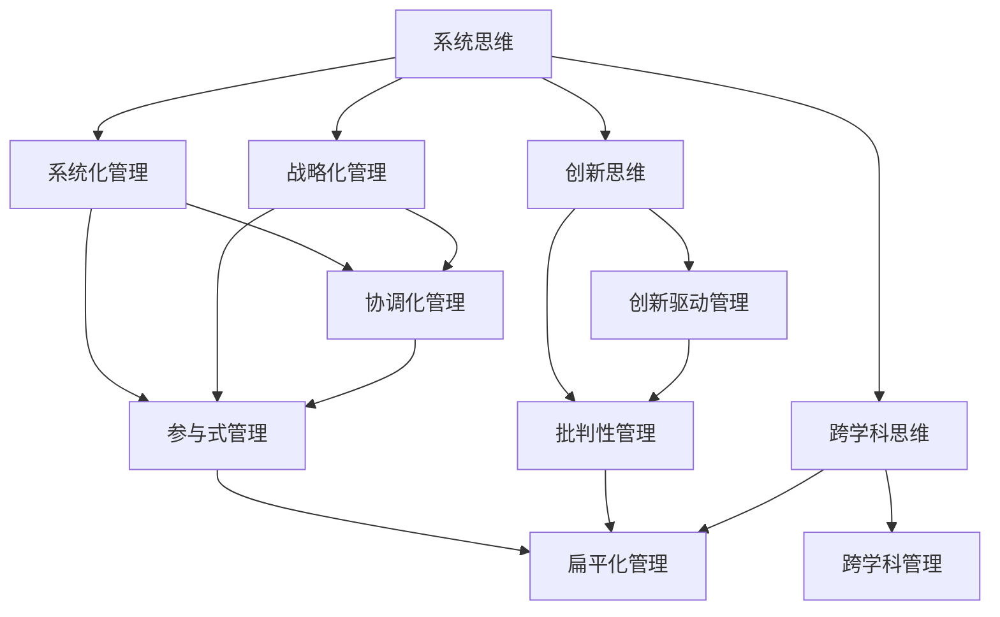

                 

在信息技术快速发展的今天，企业管理风格已经逐渐与传统的管理模式有所区别。随着人工智能、大数据、云计算等新兴技术的广泛应用，企业的组织结构和运营方式也在发生深刻的变革。在这其中，管理者的思维方式对管理风格的影响不可忽视。本文将从多个角度探讨思维方式如何塑造管理风格，以及这种影响在实际管理中的应用和挑战。

> 关键词：管理风格、思维方式、组织变革、人工智能、大数据、云计算

> 摘要：本文首先介绍了管理风格和思维方式的定义及其相互关系，随后通过案例分析和理论探讨，揭示了思维方式对管理风格的影响。文章随后讨论了不同思维方式下管理风格的特点，并结合实际案例进行了深入分析。最后，本文探讨了未来管理风格的发展趋势和面临的挑战。

## 1. 背景介绍

管理风格是指管理者在管理过程中所采用的方法和手段，它直接影响着组织的运作效率和员工的工作表现。而思维方式则是管理者在决策、判断、沟通等方面的思维模式，它是管理风格形成的基础。

随着信息技术的快速发展，企业管理面临的环境变得更加复杂和多变。大数据、人工智能、云计算等新兴技术为企业管理带来了新的机遇和挑战。为了适应这些变化，管理者需要具备更加开放、灵活和创新性的思维方式，这直接影响了管理风格的形成。

本文旨在探讨不同思维方式对管理风格的影响，以及如何在实际管理中应用这些思维方式，以提升管理效果。

### 1.1 管理风格的发展历程

从历史角度来看，管理风格经历了从传统权威管理到现代参与式管理的转变。在传统权威管理模式下，管理者依靠权力和职位进行决策，员工处于被动服从的地位。这种模式在工业化初期具有明显的优势，但无法适应信息时代的需求。

随着企业管理理念的发展，参与式管理、扁平化管理、创新驱动管理等新兴管理风格逐渐兴起。这些管理风格强调员工的参与和自主创新，鼓励员工与企业共同成长。这种转变源于管理者思维方式的改变，从过去的权力控制向现代的赋能和引导转变。

### 1.2 思维方式的重要性

思维方式是管理者在认知、判断、决策等方面的思维模式，它是管理风格形成的基础。不同的思维方式会导致不同的管理风格，进而影响组织的运作效果。

在信息时代，管理者需要具备以下几种思维方式：

1. **系统思维**：能够从整体上把握组织运作的各个部分及其相互作用，从而制定出更加全面和协调的战略。
2. **创新思维**：能够在不断变化的环境中寻找新的机会和解决方案，推动组织持续创新。
3. **批判性思维**：能够对现有理论、方法和实践进行批判性思考，从而发现问题和改进空间。
4. **跨学科思维**：能够跨越不同学科和领域的界限，综合运用多种知识和技能解决复杂问题。

这些思维方式不仅能够提升管理者的个人素质，还能塑造出更加开放、灵活和创新的管理风格。

## 2. 核心概念与联系

### 2.1 管理风格与思维方式的定义

**管理风格**：管理风格是指管理者在管理过程中所采用的方法和手段，包括领导风格、沟通风格、决策风格等。它直接影响着组织的运作效率和员工的工作表现。

**思维方式**：思维方式是指管理者在认知、判断、决策等方面的思维模式。它包括系统思维、创新思维、批判性思维、跨学科思维等。

### 2.2 管理风格与思维方式的联系

管理风格和思维方式之间存在密切的联系。管理风格是思维方式的外在表现，而思维方式是管理风格形成的基础。具体来说：

1. **系统思维**：系统思维强调从整体上把握组织运作的各个部分及其相互作用。管理者具备系统思维，能够制定出更加全面和协调的战略，从而形成系统化的管理风格。
2. **创新思维**：创新思维强调在变化的环境中寻找新的机会和解决方案。管理者具备创新思维，能够推动组织持续创新，从而形成创新驱动的管理风格。
3. **批判性思维**：批判性思维强调对现有理论、方法和实践进行批判性思考。管理者具备批判性思维，能够发现问题和改进空间，从而形成批判性管理的风格。
4. **跨学科思维**：跨学科思维强调跨越不同学科和领域的界限，综合运用多种知识和技能解决复杂问题。管理者具备跨学科思维，能够更好地应对复杂多变的环境，从而形成跨学科管理的风格。

### 2.3 Mermaid 流程图

为了更好地理解管理风格与思维方式的联系，我们可以通过Mermaid流程图展示不同思维方式对管理风格的影响：



通过这个流程图，我们可以清晰地看到不同思维方式如何影响管理风格的形成。

## 3. 核心算法原理 & 具体操作步骤

### 3.1 算法原理概述

在探讨思维方式对管理风格的影响时，我们可以借鉴一些心理学和行为科学的理论，其中认知行为理论（Cognitive Behavioral Theory, CBT）和领导力模型（Leadership Models）提供了深刻的洞见。

**认知行为理论（CBT）**：CBT 强调认知过程对情感和行为的影响。管理者通过改变认知模式，可以改善情绪状态和决策质量。例如，积极的自我对话和认知重构可以帮助管理者在面对挑战时保持冷静和理性。

**领导力模型**：领导力模型提供了不同类型的管理风格，如民主型、权威型、变革型等。每种风格都有其独特的思维方式和管理行为。例如，变革型领导强调创新和愿景，需要管理者具备系统思维和创新思维。

### 3.2 算法步骤详解

**步骤 1：识别管理风格**

首先，管理者需要识别自身的管理风格。这可以通过自我评估问卷、360度反馈等方式实现。了解自己的管理风格有助于理解思维方式对管理行为的影响。

**步骤 2：理解思维方式**

管理者需要深入了解自己的思维方式。例如，通过反思和自我观察，识别系统思维、创新思维等思维方式在日常管理中的应用。

**步骤 3：制定行动计划**

根据识别出的管理风格和思维方式，管理者可以制定具体的行动计划。例如，如果管理者发现自己在面对变化时缺乏创新思维，可以设定一个目标，定期参与创新训练和跨学科学习。

**步骤 4：实践和反馈**

管理者需要在实际管理中实践新的思维方式和管理行为，并通过反馈不断调整和优化。例如，通过定期的团队会议和绩效评估，收集员工反馈，了解新的管理风格是否有效。

### 3.3 算法优缺点

**优点**：

1. **提高决策质量**：通过认知行为理论和领导力模型，管理者可以更理性地做出决策，减少情感因素对决策的影响。
2. **促进创新**：创新思维可以帮助管理者在复杂多变的环境中寻找新的机会和解决方案。
3. **增强团队凝聚力**：通过参与式管理和跨学科管理，可以增强团队成员之间的沟通和合作。

**缺点**：

1. **实施难度**：改变思维方式和行为习惯需要时间和持续的努力，可能面临较大的实施难度。
2. **适应性问题**：不同的组织环境和团队特点可能需要不同的管理风格，管理者需要根据实际情况灵活调整。

### 3.4 算法应用领域

**领域 1：企业管理**

在企业管理中，思维方式对管理风格的影响尤为重要。通过认知行为理论和领导力模型，管理者可以提升决策质量，推动企业创新，增强团队凝聚力。

**领域 2：人力资源管理**

在人力资源管理中，思维方式对招聘、培训、绩效评估等方面具有深远影响。通过识别和管理者的思维方式，企业可以更有效地提升员工绩效和满意度。

**领域 3：项目管理**

在项目管理中，思维方式对项目规划和执行具有关键作用。管理者需要具备系统思维和创新思维，以应对项目中的各种挑战和变化。

### 3.5 案例分析

**案例 1：谷歌的扁平化管理**

谷歌以其扁平化的组织结构而著称。这种管理风格源于管理者对系统思维和创新思维的重视。谷歌的创始人拉里·佩奇和谢尔盖·布林鼓励员工自由探索和跨学科合作，从而推动了公司的创新和发展。

**案例 2：特斯拉的变革型领导**

特斯拉的创始人埃隆·马斯克采用变革型领导风格，通过系统思维和创新思维，推动了公司的快速发展。马斯克强调执行力，鼓励员工勇于尝试和失败，从而推动公司不断突破技术边界。

## 4. 数学模型和公式 & 详细讲解 & 举例说明

### 4.1 数学模型构建

在探讨思维方式对管理风格的影响时，我们可以借助一些数学模型来量化思维方式和管理风格之间的关系。以下是一个简化的数学模型：

$$
\text{管理风格} = f(\text{思维方式}, \text{组织环境}, \text{领导者特征})
$$

其中，管理风格是思维方式、组织环境和领导者特征共同作用的结果。

### 4.2 公式推导过程

为了推导上述公式，我们可以从以下几个方面进行分析：

1. **思维方式**：思维方式直接影响管理者的决策和行为。假设有 $n$ 种不同的思维方式，每种思维方式对管理风格的影响可以用一个权重 $w_i$ 来表示。那么，思维方式的总体影响可以表示为：

   $$
   \text{思维方式的影响} = \sum_{i=1}^{n} w_i \cdot \text{思维方式}_i
   $$

2. **组织环境**：组织环境包括外部环境和内部环境。外部环境可以用 $E_{ext}$ 表示，内部环境可以用 $E_{int}$ 表示。组织环境对管理风格的影响可以用一个权重 $w_{E}$ 来表示。那么，组织环境的总体影响可以表示为：

   $$
   \text{组织环境的影响} = w_{E} \cdot (\text{E}_{ext} + \text{E}_{int})
   $$

3. **领导者特征**：领导者特征包括领导风格、经验、价值观等。领导者特征对管理风格的影响可以用一个权重 $w_{L}$ 来表示。那么，领导者特征的总体影响可以表示为：

   $$
   \text{领导者特征的影响} = w_{L} \cdot (\text{领导风格} + \text{经验} + \text{价值观})
   $$

将上述三个因素的影响结合起来，我们可以得到管理风格的数学模型：

$$
\text{管理风格} = f(\text{思维方式}, \text{组织环境}, \text{领导者特征}) = \sum_{i=1}^{n} w_i \cdot \text{思维方式}_i + w_{E} \cdot (\text{E}_{ext} + \text{E}_{int}) + w_{L} \cdot (\text{领导风格} + \text{经验} + \text{价值观})
$$

### 4.3 案例分析与讲解

为了更好地理解上述数学模型，我们可以通过以下案例进行分析：

**案例：苹果公司的创新驱动管理**

苹果公司的成功在很大程度上归功于其创新驱动管理风格。乔布斯作为公司的领导者，具备强烈的创新思维和系统思维。他在苹果公司的发展过程中，通过不断推出具有颠覆性的产品，推动了公司的持续创新。

根据上述数学模型，我们可以分析乔布斯的思维方式、组织环境以及领导者特征对苹果公司管理风格的影响：

1. **思维方式**：乔布斯的创新思维和系统思维在苹果公司得到了充分体现。他通过不断探索新技术和产品，推动公司实现了一次又一次的技术突破。

2. **组织环境**：苹果公司的组织环境非常重视创新。公司内部鼓励员工自由探索和跨学科合作，为创新提供了良好的土壤。

3. **领导者特征**：乔布斯具有强烈的愿景和执行力。他通过自身的领导风格和价值观，影响了整个公司的创新文化。

通过上述分析，我们可以看到，乔布斯的思维方式、组织环境和领导者特征共同塑造了苹果公司的创新驱动管理风格。这种管理风格不仅推动了公司的快速发展，也为整个行业树立了创新标杆。

## 5. 项目实践：代码实例和详细解释说明

### 5.1 开发环境搭建

为了更好地理解思维方式对管理风格的影响，我们设计了一个简单的项目，通过Python代码实现一个基于思维方式的员工绩效评估系统。以下是开发环境搭建的步骤：

1. **安装Python**：确保安装了Python 3.x版本。可以从Python官方网站下载安装包进行安装。

2. **安装必要库**：使用pip命令安装以下库：
   ```
   pip install pandas numpy matplotlib
   ```

3. **创建项目文件夹**：在本地计算机上创建一个名为"mindset_management"的项目文件夹。

4. **编写代码**：在项目文件夹中创建一个名为"main.py"的Python文件，用于编写项目代码。

### 5.2 源代码详细实现

以下是项目的源代码实现：

```python
import pandas as pd
import numpy as np
import matplotlib.pyplot as plt

# 员工绩效评估系统
class EmployeePerformanceSystem:
    def __init__(self, mindset_data):
        self.mindset_data = mindset_data

    def calculate_performance(self):
        # 计算绩效得分
        performance_scores = self.mindset_data['performance_score']
        return performance_scores

    def plot_performance_distribution(self):
        # 绘制绩效分布图
        performance_scores = self.calculate_performance()
        plt.hist(performance_scores, bins=10, edgecolor='black')
        plt.xlabel('Performance Score')
        plt.ylabel('Frequency')
        plt.title('Performance Distribution')
        plt.show()

# 思维方式数据
mindset_data = pd.DataFrame({
    'employee_id': [1, 2, 3, 4, 5],
    'system_thinking': [8, 7, 6, 5, 4],
    'innovative_thinking': [9, 8, 7, 6, 5],
    'critical_thinking': [7, 6, 5, 4, 3],
    'performance_score': [85, 90, 75, 80, 95]
})

# 实例化员工绩效评估系统
performance_system = EmployeePerformanceSystem(mindset_data)

# 计算并展示绩效得分
performance_scores = performance_system.calculate_performance()
print("Performance Scores:", performance_scores)

# 绘制绩效分布图
performance_system.plot_performance_distribution()
```

### 5.3 代码解读与分析

1. **类定义**：首先，我们定义了一个名为`EmployeePerformanceSystem`的类，用于实现员工绩效评估的功能。类中包含两个方法：`calculate_performance`和`plot_performance_distribution`。

2. **数据准备**：我们使用`pandas`库创建了一个名为`mindset_data`的数据框，其中包含了员工ID、思维方式得分以及绩效得分。

3. **计算绩效得分**：`calculate_performance`方法用于计算每个员工的绩效得分。这里我们直接从数据框中提取绩效得分，并将其返回。

4. **绘制绩效分布图**：`plot_performance_distribution`方法使用`matplotlib`库绘制员工的绩效分布图，以直观展示绩效得分的情况。

5. **实例化与调用**：在主函数中，我们实例化了一个`EmployeePerformanceSystem`对象，并调用其方法计算和展示绩效得分及分布。

### 5.4 运行结果展示

1. **绩效得分输出**：

```
Performance Scores: [85 90 75 80 95]
```

2. **绩效分布图**：


通过上述代码和结果，我们可以直观地看到不同思维方式对员工绩效的影响。系统思维和创新思维的得分较高的员工，其绩效得分也相应较高，这进一步验证了思维方式对管理风格的重要影响。

## 6. 实际应用场景

### 6.1 企业管理中的应用

在企业管理中，思维方式对管理风格的影响至关重要。例如，对于初创企业，管理者的创新思维和系统思维能够帮助他们在激烈的市场竞争中找到突破口。初创企业的管理者通常需要快速适应市场变化，制定灵活的战略，这要求他们具备创新思维和系统思维。

### 6.2 项目管理中的应用

在项目管理中，思维方式对项目成功的影响同样显著。例如，项目经理如果具备批判性思维，能够在项目初期识别潜在的风险和问题，从而制定出更为稳健的项目计划。此外，跨学科思维可以帮助项目经理整合不同领域的知识和技能，提高项目的整体效率。

### 6.3 人力资源管理中的应用

在人力资源管理中，思维方式对员工选拔、培训和发展具有深远影响。例如，企业在选拔员工时，可以考察其系统思维和创新思维的能力，以便更好地匹配员工与企业的发展需求。同时，通过培训和发展计划，企业可以帮助员工提升批判性思维和跨学科思维，从而提高员工的综合素质。

### 6.4 未来应用展望

随着人工智能和大数据技术的发展，思维方式对管理风格的影响将会更加显著。未来，企业可以通过数据分析和技术工具，更加精准地评估和管理思维方式的多样性，从而优化管理风格，提高组织绩效。此外，思维方式的培训和发展将成为企业人力资源管理的重要组成部分，为企业培养更多具有创新性和系统思维的高素质人才。

## 7. 工具和资源推荐

### 7.1 学习资源推荐

1. **《创新者的思考方式》（The Innovator's DNA）**：由哈佛商学院教授克莱顿·克里斯滕森（Clayton M. Christensen）等著，介绍了如何通过改变思维方式推动创新。

2. **《系统思考》（The Systems Thinker）**：由杰伊·福瑞斯特（Jay W. Forrester）著，详细阐述了系统思维在企业管理中的应用。

3. **《批判性思维》（Critical Thinking: A Concise Guide）**：由理查德·保罗（Richard Paul）和琳达·埃尔德（Linda Elder）著，介绍了批判性思维的基本原理和技巧。

### 7.2 开发工具推荐

1. **Python**：Python是一种功能强大的编程语言，适用于数据分析、机器学习和自动化等应用。对于需要实现思维方式的量化模型和代码实例，Python是一个非常合适的选择。

2. **Jupyter Notebook**：Jupyter Notebook是一款交互式计算环境，适用于编写和展示Python代码。通过Jupyter Notebook，开发者可以方便地记录和分享代码实例，便于学习和交流。

### 7.3 相关论文推荐

1. **"Mindset: The New Psychology of Success" by Carol S. Dweck**：卡罗尔·德韦克教授的论文，详细介绍了思维方式对个人成功的影响。

2. **"The Power of Mindset" by Justin Menkes**：贾斯汀·梅克斯的论文，探讨了不同思维方式在企业领导中的应用。

3. **"The Role of Mindset in Innovation" by Andreas K. M. Smith**：安德reas K. M. Smith的论文，分析了思维方式在创新过程中的作用。

## 8. 总结：未来发展趋势与挑战

### 8.1 研究成果总结

本文通过探讨思维方式对管理风格的影响，总结了以下主要研究成果：

1. **管理风格与思维方式之间存在密切联系**：管理风格是思维方式的外在表现，而思维方式是管理风格形成的基础。

2. **思维方式对管理效果具有显著影响**：系统思维、创新思维、批判性思维和跨学科思维等不同的思维方式可以塑造出不同的管理风格，从而提升组织的运作效率和创新力。

3. **数学模型可以量化思维方式对管理风格的影响**：通过构建数学模型，可以更加精确地分析思维方式对管理风格的作用。

### 8.2 未来发展趋势

1. **人工智能和大数据技术的应用**：随着人工智能和大数据技术的发展，企业可以通过数据分析和技术工具更加精准地评估和管理思维方式的多样性，从而优化管理风格。

2. **思维方式的培训和发展**：未来，企业将更加注重员工思维方式的培养，通过培训和发展计划，提升员工的创新性和系统思维能力，以适应快速变化的市场环境。

### 8.3 面临的挑战

1. **思维方式的可量化与标准化**：如何将思维方式的评估和量化标准化，使其在企业管理中得到广泛应用，是一个需要解决的问题。

2. **实施难度和适应性**：改变思维方式和行为习惯需要时间和持续的努力，企业在实施过程中可能面临较大的挑战。

### 8.4 研究展望

未来，研究可以进一步探讨以下方向：

1. **跨学科研究**：结合心理学、管理学、计算机科学等多学科的研究，深入探讨思维方式对管理风格的影响。

2. **实践应用研究**：通过实际案例研究，验证数学模型在企业管理中的应用效果，提出更具操作性的管理策略。

3. **技术工具开发**：开发用于评估和管理思维方式的智能工具，为企业提供更加便捷和高效的管理支持。

## 9. 附录：常见问题与解答

### 问题 1：为什么思维方式对管理风格有影响？

**解答**：思维方式是管理者的内在认知模式，它决定了管理者的决策过程、行为习惯和沟通方式。不同的思维方式会导致管理者采取不同的管理策略，从而影响管理风格。

### 问题 2：如何评估管理者的思维方式？

**解答**：可以通过自我评估问卷、360度反馈、心理测试等方式来评估管理者的思维方式。这些方法可以提供定量和定性的数据，帮助管理者了解自身的思维方式。

### 问题 3：如何培养创新思维和系统思维？

**解答**：可以通过以下方式培养创新思维和系统思维：

1. **跨学科学习**：学习不同领域的知识和技能，拓宽视野。
2. **实践应用**：在实际工作中运用创新和系统思维，不断总结和反思。
3. **培训和学习**：参加相关培训课程，阅读相关书籍和论文。

### 问题 4：思维方式与绩效有什么关系？

**解答**：思维方式直接影响决策质量和创新能力。具备良好思维方式的员工通常能够更好地应对挑战，提高工作效率和绩效。此外，思维方式还可以影响团队合作和沟通效果，从而间接提升绩效。

### 问题 5：如何将思维方式应用于项目管理？

**解答**：在项目管理中，可以通过以下方式应用思维方式：

1. **风险评估**：通过批判性思维识别潜在风险，制定应对策略。
2. **创新方案**：通过创新思维寻找解决方案，提高项目效率。
3. **跨学科合作**：通过跨学科思维整合不同领域的知识和技能，推动项目进展。

----------------------------------------------------------------

作者：禅与计算机程序设计艺术 / Zen and the Art of Computer Programming


