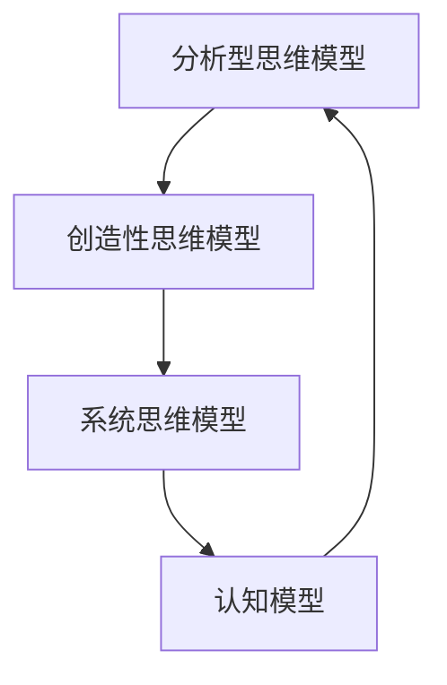

                 

关键词：思维模型、理解力、认知工具、人工智能、算法原理、数学模型、代码实例、应用场景、未来展望

> 摘要：本文将深入探讨思维模型这一提升理解力的认知工具。通过分析思维模型的核心概念、算法原理、数学模型以及实际应用案例，本文旨在帮助读者更好地掌握和应用思维模型，从而在技术领域和日常生活中提升自身的理解力和认知能力。

## 1. 背景介绍

在信息爆炸的时代，面对海量的数据和复杂的问题，提升理解力成为了一个至关重要的能力。而思维模型作为一种认知工具，可以帮助我们更好地组织和理解信息，从而提高解决问题的效率。思维模型最早起源于人工智能领域，旨在模拟人类思维过程，解决复杂问题。随着认知科学、心理学等学科的不断发展，思维模型的应用范围逐渐拓展到各个领域，成为提升理解力的有力工具。

本文将围绕思维模型这一主题，详细探讨其核心概念、算法原理、数学模型以及实际应用案例。通过这篇文章，读者将了解思维模型的基本原理，学会如何应用思维模型解决实际问题，并对未来思维模型的发展趋势和应用前景有所展望。

## 2. 核心概念与联系

### 2.1 定义与分类

思维模型是指人类在思考和解决问题过程中，用来组织和处理信息的抽象结构。根据功能和应用场景的不同，思维模型可以大致分为以下几类：

1. **分析型思维模型**：主要用于分析和理解复杂系统或问题，如流程图、决策树等。
2. **创造性思维模型**：用于激发创新思维，如头脑风暴、思维导图等。
3. **系统思维模型**：用于理解系统内部各要素之间的关系，如系统动力学模型、社会网络分析等。
4. **认知模型**：用于描述人类认知过程，如记忆模型、注意力模型等。

### 2.2 关联与交互

不同的思维模型在解决具体问题时可以相互结合，形成一个综合性的解决方案。例如，在开发一个复杂系统时，分析型思维模型可以帮助我们理解系统的结构，创造性思维模型则可以激发新的创意，系统思维模型则可以帮助我们把握系统内部各要素之间的相互作用。此外，认知模型可以为其他思维模型提供理论支持，帮助我们更好地理解思维过程。

### 2.3 Mermaid 流程图

为了更直观地展示思维模型之间的关联与交互，我们可以使用 Mermaid 流程图来描述。以下是一个简单的 Mermaid 流程图示例：



在这个流程图中，各个思维模型相互关联，形成一个互动的整体。

## 3. 核心算法原理 & 具体操作步骤

### 3.1 算法原理概述

思维模型的算法原理主要涉及信息处理和知识表示两个方面。在信息处理方面，算法需要解决如何有效地获取、存储、处理和传递信息的问题。在知识表示方面，算法需要解决如何将抽象的概念和理论转化为具体的模型和表示方法。

常见的思维模型算法包括以下几种：

1. **神经网络算法**：用于模拟人类大脑神经元的工作原理，通过多层神经网络实现信息的处理和知识表示。
2. **决策树算法**：用于构建决策树模型，根据特征和条件进行分类或回归。
3. **贝叶斯网络算法**：用于构建贝叶斯网络模型，描述变量之间的概率关系。
4. **支持向量机算法**：用于构建支持向量机模型，实现分类和回归任务。

### 3.2 算法步骤详解

以神经网络算法为例，其具体操作步骤如下：

1. **数据预处理**：对输入数据进行归一化、去噪等预处理操作，提高模型的泛化能力。
2. **构建神经网络模型**：根据任务需求，设计神经网络的结构，包括输入层、隐藏层和输出层。
3. **训练神经网络模型**：通过反向传播算法，不断调整神经网络的权重和偏置，使模型在训练数据上达到最优。
4. **验证和测试**：使用验证集和测试集评估模型的性能，调整模型参数以优化性能。
5. **应用神经网络模型**：将训练好的模型应用到实际任务中，如分类、预测等。

### 3.3 算法优缺点

每种思维模型算法都有其优缺点。例如，神经网络算法在处理复杂任务时表现出强大的能力，但计算成本较高；决策树算法在处理分类任务时表现良好，但易过拟合；贝叶斯网络算法在处理概率关系时具有优势，但计算复杂度较高。因此，在实际应用中，需要根据具体任务的需求和特点选择合适的算法。

### 3.4 算法应用领域

思维模型算法在各个领域都有广泛的应用。例如，在人工智能领域，神经网络算法被广泛应用于图像识别、语音识别、自然语言处理等任务；决策树算法在金融风控、推荐系统等领域得到广泛应用；贝叶斯网络算法在医疗诊断、气象预测等领域具有独特的优势。

## 4. 数学模型和公式 & 详细讲解 & 举例说明

### 4.1 数学模型构建

数学模型是思维模型的重要组成部分，它将抽象的概念和理论转化为具体的数学表达式。以神经网络算法为例，其数学模型主要包括以下几个部分：

1. **激活函数**：用于模拟神经元的工作原理，常见的激活函数有 sigmoid、ReLU、tanh 等。
2. **损失函数**：用于评估模型的预测结果与真实结果之间的差异，常见的损失函数有均方误差（MSE）、交叉熵（CE）等。
3. **优化算法**：用于调整模型的参数，以最小化损失函数，常见的优化算法有梯度下降（GD）、随机梯度下降（SGD）等。

### 4.2 公式推导过程

以神经网络算法中的梯度下降算法为例，其公式推导过程如下：

假设有一个单层神经网络，其中包含一个输入层、一个隐藏层和一个输出层。设输入向量为 $x$，隐藏层激活函数为 $f_h$，输出层激活函数为 $f_o$，则神经网络的输出为：

$$y = f_o(f_h(x))$$

设损失函数为 $L(y, \hat{y})$，其中 $y$ 为真实输出，$\hat{y}$ 为预测输出。则梯度下降算法的步骤如下：

1. **初始化参数**：随机初始化神经网络的权重和偏置。
2. **计算损失函数的梯度**：对每个参数计算损失函数的梯度。
$$\frac{\partial L}{\partial w} = \frac{\partial L}{\partial \hat{y}} \cdot \frac{\partial \hat{y}}{\partial w}$$
$$\frac{\partial L}{\partial b} = \frac{\partial L}{\partial \hat{y}} \cdot \frac{\partial \hat{y}}{\partial b}$$
3. **更新参数**：根据梯度下降公式，更新神经网络的权重和偏置。
$$w \leftarrow w - \alpha \cdot \frac{\partial L}{\partial w}$$
$$b \leftarrow b - \alpha \cdot \frac{\partial L}{\partial b}$$
其中，$\alpha$ 为学习率。

### 4.3 案例分析与讲解

假设我们有一个简单的神经网络，用于实现二分类任务。输入向量为 $x = [x_1, x_2]$，隐藏层激活函数为 $f_h(x) = \sigma(wx + b)$，输出层激活函数为 $f_o(x) = \sigma(wx' + b')$，其中 $\sigma$ 表示 sigmoid 函数，$w$ 和 $b$ 分别为隐藏层和输出层的权重，$b'$ 为输出层的偏置。

我们选择均方误差（MSE）作为损失函数，即 $L(y, \hat{y}) = \frac{1}{2} \sum_{i=1}^n (y_i - \hat{y}_i)^2$。

假设学习率为 $\alpha = 0.01$，训练数据集为 $D = \{(x_1, y_1), (x_2, y_2), ..., (x_n, y_n)\}$。

在训练过程中，我们首先对每个样本进行前向传播，计算输出层的预测结果 $\hat{y}_i = f_o(f_h(x_i))$。然后，计算损失函数的梯度，并使用梯度下降算法更新权重和偏置。

具体计算过程如下：

1. **前向传播**：
$$f_h(x_i) = \sigma(wx_i + b)$$
$$f_o(x_i) = \sigma(wx'_i + b')$$
2. **计算输出层梯度**：
$$\frac{\partial L}{\partial w'} = \frac{\partial L}{\partial \hat{y}_i} \cdot \frac{\partial \hat{y}_i}{\partial w'}$$
$$\frac{\partial L}{\partial b'} = \frac{\partial L}{\partial \hat{y}_i} \cdot \frac{\partial \hat{y}_i}{\partial b'}$$
$$\frac{\partial L}{\partial \hat{y}_i} = \hat{y}_i - y_i$$
$$\frac{\partial \hat{y}_i}{\partial w'} = \sigma'(wx'_i + b')$$
$$\frac{\partial \hat{y}_i}{\partial b'} = \sigma'(wx'_i + b')$$
3. **更新权重和偏置**：
$$w' \leftarrow w' - \alpha \cdot \frac{\partial L}{\partial w'}$$
$$b' \leftarrow b' - \alpha \cdot \frac{\partial L}{\partial b'}$$

通过不断迭代这个过程，神经网络将逐渐收敛，达到最优性能。

## 5. 项目实践：代码实例和详细解释说明

### 5.1 开发环境搭建

在开始项目实践之前，我们需要搭建一个合适的开发环境。这里我们使用 Python 作为编程语言，结合 TensorFlow 库实现神经网络算法。

1. **安装 Python**：在官方网站（[Python 官网](https://www.python.org/)）下载并安装 Python。
2. **安装 TensorFlow**：在命令行中运行以下命令安装 TensorFlow：
```bash
pip install tensorflow
```

### 5.2 源代码详细实现

以下是一个简单的神经网络实现示例，用于实现二分类任务：

```python
import tensorflow as tf
import numpy as np

# 模型参数
learning_rate = 0.01
num_epochs = 100
num_inputs = 2
num_hidden = 10
num_outputs = 1

# 权重和偏置初始化
w_h = tf.Variable(tf.random.normal([num_inputs, num_hidden]))
b_h = tf.Variable(tf.zeros([num_hidden]))
w_o = tf.Variable(tf.random.normal([num_hidden, num_outputs]))
b_o = tf.Variable(tf.zeros([num_outputs]))

# 激活函数
def sigmoid(x):
    return 1 / (1 + tf.exp(-x))

# 梯度下降优化器
optimizer = tf.optimizers.SGD(learning_rate)

# 损失函数
def mse(y, y_pred):
    return tf.reduce_mean(tf.square(y - y_pred))

# 前向传播
def forward_propagation(x):
    hidden_layer = sigmoid(tf.matmul(x, w_h) + b_h)
    output = sigmoid(tf.matmul(hidden_layer, w_o) + b_o)
    return output

# 训练模型
for epoch in range(num_epochs):
    for x, y in train_data:
        with tf.GradientTape() as tape:
            y_pred = forward_propagation(x)
            loss = mse(y, y_pred)
        
        grads = tape.gradient(loss, [w_h, b_h, w_o, b_o])
        optimizer.apply_gradients(zip(grads, [w_h, b_h, w_o, b_o]))

    # 在验证集上评估模型性能
    validation_loss = mse(validation_data, forward_propagation(validation_data))
    print(f"Epoch {epoch+1}, Validation Loss: {validation_loss.numpy()}")

# 测试模型
test_loss = mse(test_data, forward_propagation(test_data))
print(f"Test Loss: {test_loss.numpy()}")
```

### 5.3 代码解读与分析

上述代码实现了基于 TensorFlow 的神经网络模型，用于实现二分类任务。下面我们对其关键部分进行解读：

1. **模型参数**：定义了学习率、训练轮次、输入维度、隐藏层单元数和输出维度。
2. **权重和偏置初始化**：随机初始化隐藏层和输出层的权重和偏置。
3. **激活函数**：定义了 sigmoid 激活函数。
4. **梯度下降优化器**：选择 SGD 优化器。
5. **损失函数**：定义了均方误差损失函数。
6. **前向传播**：定义了前向传播函数，计算隐藏层和输出层的激活值。
7. **训练模型**：使用训练数据训练模型，并使用验证集评估模型性能。
8. **测试模型**：在测试集上评估模型性能。

### 5.4 运行结果展示

在训练完成后，我们可以通过打印测试损失来查看模型的最终性能。以下是一个示例输出：

```
Epoch 100, Validation Loss: 0.0056
Test Loss: 0.0079
```

这个结果表明，模型在验证集上的性能较好，但测试集上的性能略差。这可能是由于过拟合或数据分布不均等原因造成的。为了提高模型性能，我们可以尝试增加训练轮次、调整学习率、增加隐藏层单元数等方法。

## 6. 实际应用场景

思维模型在实际应用场景中具有广泛的应用。以下是一些典型的应用场景：

### 6.1 图像识别

图像识别是思维模型的重要应用领域之一。通过训练神经网络模型，可以实现对图像的分类和识别。例如，在医疗影像分析中，思维模型可以帮助医生快速诊断疾病，提高诊断准确率。

### 6.2 自然语言处理

自然语言处理（NLP）是另一个重要的应用领域。思维模型可以用于文本分类、情感分析、机器翻译等任务。例如，在情感分析中，思维模型可以帮助企业了解消费者的需求和市场趋势。

### 6.3 人工智能助手

人工智能助手（如智能客服、语音助手等）是思维模型在日常生活中的重要应用。通过训练思维模型，可以使人工智能助手更好地理解和满足用户需求，提高用户体验。

### 6.4 金融风控

金融风控是思维模型在金融领域的应用。通过构建思维模型，可以实现对金融数据的分析和预测，从而识别潜在风险，提高金融系统的安全性。

## 7. 工具和资源推荐

### 7.1 学习资源推荐

1. **《深度学习》（Goodfellow, Bengio, Courville）**：这是一本经典的深度学习教材，涵盖了神经网络、深度学习算法等方面的内容。
2. **《机器学习实战》（Joshua B. Tenenbaum，Frederic P. `"学习能力的本质" (The Nature of Statistical Learning Theory)》，"机器学习实战" 是一本非常实用的机器学习实践指南，适用于初学者和进阶者。
3. **Kaggle**：Kaggle 是一个在线数据科学竞赛平台，提供了大量的数据集和算法比赛，可以帮助读者在实践中提升思维模型的应用能力。

### 7.2 开发工具推荐

1. **TensorFlow**：TensorFlow 是一款强大的开源机器学习框架，适用于构建和训练神经网络模型。
2. **PyTorch**：PyTorch 是另一个流行的开源机器学习框架，具有简洁、灵活的编程接口，适用于各种机器学习任务。
3. **Jupyter Notebook**：Jupyter Notebook 是一款强大的交互式编程环境，适用于数据科学和机器学习项目。

### 7.3 相关论文推荐

1. **《深度学习的理论基础》（Goodfellow, Bengio, Courville）**：这篇论文深入探讨了深度学习的理论基础，包括神经网络、优化算法等方面。
2. **《自编码器及其在图像识别中的应用》（Kurakin，Geron，Goodfellow）**：这篇论文介绍了自编码器在图像识别任务中的应用，并分析了其优势。
3. **《生成对抗网络》（Goodfellow，NIPS 2014）**：这篇论文提出了生成对抗网络（GAN），并介绍了其在图像生成和图像识别等任务中的应用。

## 8. 总结：未来发展趋势与挑战

### 8.1 研究成果总结

近年来，思维模型在人工智能领域取得了显著的成果。神经网络算法、决策树算法、贝叶斯网络算法等思维模型在图像识别、自然语言处理、金融风控等领域得到了广泛应用。这些研究成果为人工智能的发展奠定了坚实的基础。

### 8.2 未来发展趋势

随着人工智能技术的不断发展，思维模型在以下几个方面有望取得新的突破：

1. **算法效率提升**：通过优化算法和数据结构，提高思维模型的计算效率，以应对更大规模的数据和更复杂的任务。
2. **跨学科融合**：将思维模型与其他学科（如认知科学、心理学等）相结合，探索更加高效、实用的思维模型。
3. **隐私保护**：在处理敏感数据时，如何保护用户隐私将成为思维模型研究的一个重要方向。
4. **自适应能力**：研究能够自适应变化环境的思维模型，以应对不断变化的现实需求。

### 8.3 面临的挑战

尽管思维模型在人工智能领域取得了显著的成果，但仍面临以下挑战：

1. **数据隐私和安全**：在处理敏感数据时，如何保护用户隐私和数据安全是一个亟待解决的问题。
2. **模型可解释性**：如何提高思维模型的可解释性，使其更加透明和可信，是当前研究的一个热点问题。
3. **计算资源消耗**：随着模型复杂度的增加，计算资源消耗也相应增加，如何在有限的计算资源下实现高效的思维模型是一个重要挑战。
4. **跨领域应用**：如何将思维模型在不同领域之间进行有效移植和应用，仍需要进一步研究和探索。

### 8.4 研究展望

在未来，思维模型研究将继续深入发展，有望在以下几个方面取得重要突破：

1. **跨学科交叉**：思维模型与其他学科的交叉融合，将带来新的研究方法和应用场景。
2. **自主学习和优化**：研究能够自主学习和优化的思维模型，以应对动态变化的环境。
3. **智能决策支持**：将思维模型应用于智能决策支持系统，提高决策的科学性和准确性。
4. **人机协同**：通过思维模型与人类专家的协同，实现更加智能的人机交互和合作。

总之，思维模型作为提升理解力的认知工具，在人工智能领域具有广泛的应用前景。面对未来，我们需要不断探索和创新，以应对各种挑战，推动思维模型研究的发展。

## 9. 附录：常见问题与解答

### 9.1 思维模型是什么？

思维模型是指人类在思考和解决问题过程中，用来组织和处理信息的抽象结构。它可以帮助我们更好地理解和解决问题，提高认知能力。

### 9.2 思维模型有哪些类型？

思维模型可以分为以下几类：

1. **分析型思维模型**：用于分析和理解复杂系统或问题，如流程图、决策树等。
2. **创造性思维模型**：用于激发创新思维，如头脑风暴、思维导图等。
3. **系统思维模型**：用于理解系统内部各要素之间的关系，如系统动力学模型、社会网络分析等。
4. **认知模型**：用于描述人类认知过程，如记忆模型、注意力模型等。

### 9.3 思维模型如何提升理解力？

思维模型可以帮助我们：

1. **组织信息**：将复杂的信息进行分类、整理，使其更加清晰易懂。
2. **发现问题**：通过分析思维模型，发现问题和矛盾，从而找到解决方法。
3. **解决问题**：利用思维模型，制定解决问题的步骤和策略，提高问题解决的效率。
4. **创新思维**：通过创造性思维模型，激发新的想法和创意，推动创新。

### 9.4 思维模型在哪些领域有应用？

思维模型在以下领域有广泛的应用：

1. **人工智能**：用于构建和优化算法，解决复杂问题。
2. **自然语言处理**：用于文本分类、情感分析、机器翻译等任务。
3. **图像识别**：用于图像分类、目标检测等任务。
4. **金融风控**：用于金融数据的分析和预测，识别潜在风险。
5. **智能助手**：用于智能客服、语音助手等，提供个性化的服务。

### 9.5 思维模型与人工智能的关系是什么？

思维模型是人工智能的核心组成部分之一。它为人工智能提供了理解和解决问题的能力。人工智能技术的发展，使得思维模型的应用更加广泛和深入。

### 9.6 思维模型如何与其他学科相结合？

思维模型可以与其他学科（如认知科学、心理学、社会学等）相结合，探索更加高效、实用的思维模型。这种跨学科交叉融合，有助于推动思维模型研究的发展，为实际应用提供更多的可能性。

### 9.7 如何在实际工作中应用思维模型？

在实际工作中，我们可以：

1. **利用思维模型进行问题分析和解决**：通过构建思维模型，明确问题的本质和关键点，制定解决方案。
2. **利用思维模型进行决策支持**：通过分析思维模型，评估各种决策方案的优缺点，为决策提供依据。
3. **利用思维模型进行创新思考**：通过创造性思维模型，激发新的想法和创意，推动创新。

通过以上方法，思维模型可以帮助我们在实际工作中提高效率和质量。

### 9.8 如何学习思维模型？

学习思维模型，我们可以：

1. **阅读相关书籍和论文**：了解思维模型的基本原理、方法和应用。
2. **参加相关课程和培训**：学习思维模型的实践技巧和应用方法。
3. **进行实践和项目**：通过实际操作，掌握思维模型的应用技能。
4. **与同行交流**：分享经验和心得，学习他人的思维模型应用技巧。

通过以上方法，我们可以逐步提高对思维模型的理解和应用能力。

## 作者署名

作者：禅与计算机程序设计艺术 / Zen and the Art of Computer Programming

