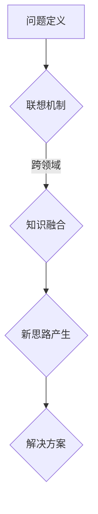

                 

关键词：创新思维、人工智能、算法、技术发展、未来展望

> 摘要：本文深入探讨了创新思维在人工智能技术发展中的重要作用，分析了如何通过思维跳跃，激发创新潜能，推动技术进步。文章首先介绍了创新思维的核心概念，随后通过具体案例和算法原理，展示了如何运用思维跳跃来解决问题，并展望了未来创新思维在人工智能领域的发展趋势与挑战。

## 1. 背景介绍

在信息技术飞速发展的今天，人工智能（AI）已成为全球关注的焦点。从语音识别到自动驾驶，从智能助手到医疗诊断，人工智能技术正深刻改变着我们的生活方式。然而，技术的进步并非一蹴而就，而是依赖于持续的探索和创新。创新思维在这个过程中扮演着至关重要的角色。本文旨在探讨如何通过思维跳跃，激发创新潜能，为人工智能技术的发展提供催化剂。

### 创新思维的重要性

创新思维是一种超越传统思维定势，主动寻找新方法、新解决方案的思维方式。在人工智能领域，创新思维尤其重要，因为AI技术的发展往往面临复杂的问题和挑战。以下是一些创新思维的重要性体现：

1. **解决复杂问题**：人工智能技术的发展过程中，常常会遇到复杂的问题，如大规模数据处理、模型优化等。创新思维能够帮助研究人员从不同角度思考问题，找到更有效的解决方案。

2. **推动技术突破**：通过创新思维，研究人员可以突破传统技术的限制，提出新的算法和模型，从而推动技术进步。

3. **激发创造力**：创新思维鼓励人们跳出传统框架，探索未知的领域，从而激发创造力，为人工智能技术带来新的突破。

### 思维跳跃的概念

思维跳跃，又称思维联想，是一种将看似无关的信息通过某种方式联系起来，从而产生新想法的思维方式。思维跳跃具有以下特点：

1. **跨越性**：思维跳跃能够在短时间内跨越不同的概念和领域，从而产生新的思路。

2. **灵活性**：思维跳跃不受传统逻辑框架的限制，具有很大的灵活性，有助于发现新的解决方案。

3. **创新性**：通过思维跳跃，人们可以产生新颖的想法，从而推动技术的创新。

## 2. 核心概念与联系

### 核心概念原理

思维跳跃是创新思维的重要工具，它依赖于人类的联想能力和跨领域知识。以下是一个简化的 Mermaid 流程图，展示思维跳跃的核心概念和原理：



### 架构说明

1. **问题定义（A）**：首先，明确需要解决的问题或挑战。

2. **联想机制（B）**：通过联想，将问题与不同领域的知识联系起来，寻找潜在的新思路。

3. **知识融合（C）**：将不同领域的知识进行融合，形成新的思维框架。

4. **新思路产生（D）**：在知识融合的基础上，产生新的思路和想法。

5. **解决方案（E）**：通过新思路，提出具体的解决方案。

## 3. 核心算法原理 & 具体操作步骤

### 3.1 算法原理概述

思维跳跃算法是一种基于人类联想能力的算法，其核心思想是通过联想机制，将问题与不同领域的知识联系起来，从而产生新的思路。具体步骤如下：

1. **问题定义**：明确需要解决的问题或挑战。

2. **联想机制**：通过关键词搜索、跨领域知识库等手段，寻找与问题相关的不同领域知识。

3. **知识融合**：将不同领域的知识进行融合，形成新的思维框架。

4. **思路生成**：在知识融合的基础上，生成新的思路和想法。

5. **方案评估**：对生成的思路进行评估，选择最优的解决方案。

### 3.2 算法步骤详解

#### 3.2.1 问题定义

问题定义是思维跳跃算法的第一步，其目的是明确需要解决的问题或挑战。在这一步骤中，研究人员需要明确问题的核心，并尽可能地具体化。

#### 3.2.2 联想机制

联想机制是思维跳跃算法的核心，其目的是通过关键词搜索、跨领域知识库等手段，将问题与不同领域的知识联系起来。具体步骤如下：

1. **关键词搜索**：利用关键词搜索技术，从互联网或专业数据库中获取与问题相关的信息。

2. **跨领域知识库**：建立跨领域知识库，包含不同领域的关键概念和术语，以便在需要时快速查找和利用。

3. **知识筛选**：对获取的信息进行筛选，保留与问题相关的内容，去除无关信息。

#### 3.2.3 知识融合

知识融合是将不同领域的知识进行融合，形成新的思维框架。在这一步骤中，研究人员需要具备较强的跨领域知识整合能力。具体步骤如下：

1. **概念整合**：将不同领域的概念进行整合，形成新的概念体系。

2. **框架构建**：在整合的概念基础上，构建新的思维框架。

3. **模型验证**：通过实际案例或实验验证新模型的可行性。

#### 3.2.4 思路生成

思路生成是在知识融合的基础上，生成新的思路和想法。这一步骤依赖于研究人员的创造力和联想能力。具体步骤如下：

1. **思维导图**：利用思维导图工具，将知识框架可视化，便于生成新思路。

2. **头脑风暴**：组织头脑风暴会议，鼓励团队成员提出新的想法。

3. **筛选优化**：对生成的思路进行筛选和优化，选择最具潜力的方案。

#### 3.2.5 方案评估

方案评估是对生成的思路进行评估，选择最优的解决方案。具体步骤如下：

1. **可行性分析**：分析方案的可行性，包括技术、资源和时间等方面的考虑。

2. **成本效益分析**：对方案的成本和效益进行评估，确保方案的可行性。

3. **风险评估**：对方案的风险进行评估，制定相应的风险应对策略。

### 3.3 算法优缺点

#### 3.3.1 优点

1. **激发创新潜能**：思维跳跃算法能够激发研究人员的创新潜能，产生新的思路和想法。

2. **提高解决问题的效率**：通过联想机制，思维跳跃算法能够快速找到与问题相关的知识，提高解决问题的效率。

3. **促进跨领域合作**：思维跳跃算法鼓励不同领域的知识融合，有助于促进跨领域合作。

#### 3.3.2 缺点

1. **依赖人类主观判断**：思维跳跃算法的执行依赖于研究人员的联想能力和主观判断，可能存在一定的偏差。

2. **信息处理能力有限**：思维跳跃算法在处理大量信息时，可能存在信息丢失或处理不当的情况。

3. **实施难度较大**：思维跳跃算法的实施需要较高的技术和资源支持，实施难度较大。

### 3.4 算法应用领域

思维跳跃算法在人工智能领域具有广泛的应用前景，主要包括以下几个方面：

1. **算法优化**：通过思维跳跃，研究人员可以找到更有效的算法，提高模型的性能。

2. **问题求解**：在复杂问题求解中，思维跳跃算法能够提供新的解决方案，提高问题求解的效率。

3. **智能辅助**：在智能辅助系统中，思维跳跃算法可以作为决策支持工具，为用户提供建议和方案。

4. **创意生成**：在创意生成领域，思维跳跃算法可以激发艺术家的创作灵感，提高创作质量。

## 4. 数学模型和公式 & 详细讲解 & 举例说明

### 4.1 数学模型构建

思维跳跃算法的数学模型主要基于概率论和图论。以下是构建数学模型的基本步骤：

1. **问题建模**：将问题转化为数学模型，如用图表示问题状态和转换关系。

2. **概率分布**：为模型中的每个状态分配概率，表示状态发生的可能性。

3. **决策规则**：定义决策规则，如根据概率分布选择下一个状态。

### 4.2 公式推导过程

以下是思维跳跃算法中的一些关键公式及其推导过程：

#### 4.2.1 状态概率分布

设 $S$ 为问题状态集合，$P(S_i)$ 为状态 $S_i$ 的概率分布，则：

$$
P(S_i) = \frac{1}{Z} \exp(-E(S_i))
$$

其中，$Z$ 为归一化常数，$E(S_i)$ 为状态 $S_i$ 的能量。

#### 4.2.2 能量函数

能量函数 $E(S)$ 用于评估问题状态，其计算公式为：

$$
E(S) = \sum_{i} w_i \cdot f(S_i)
$$

其中，$w_i$ 为权重，$f(S_i)$ 为状态 $S_i$ 的特征函数。

#### 4.2.3 决策规则

根据状态概率分布，选择下一个状态的概率分布为：

$$
P(S_{i+1}|S_i) = \frac{1}{Z'} \exp(-E(S_{i+1} + S_i))
$$

其中，$Z'$ 为归一化常数。

### 4.3 案例分析与讲解

以下通过一个具体案例，讲解思维跳跃算法的数学模型和公式应用。

#### 案例背景

假设我们有一个任务规划问题，需要为一系列任务分配资源，以最大化总效益。任务集合为 $T = \{T_1, T_2, T_3\}$，资源集合为 $R = \{R_1, R_2\}$。任务 $T_i$ 的效益为 $e_i$，资源 $R_j$ 的成本为 $c_j$。

#### 数学模型

1. **状态表示**：用三元组 $(S_i, R_{i1}, R_{i2})$ 表示状态，其中 $S_i$ 表示已完成的任务，$R_{i1}$ 和 $R_{i2}$ 分别表示已分配的资源。

2. **概率分布**：根据任务完成情况和资源分配情况，计算状态的概率分布。

3. **能量函数**：定义能量函数 $E(S)$，用于评估状态的价值。

4. **决策规则**：根据概率分布，选择下一个状态。

#### 公式应用

1. **状态概率分布**：

$$
P(S_i, R_{i1}, R_{i2}) = \frac{1}{Z} \exp(-E(S_i, R_{i1}, R_{i2}))
$$

2. **能量函数**：

$$
E(S_i, R_{i1}, R_{i2}) = e_i - c_1 \cdot R_{i1} - c_2 \cdot R_{i2}
$$

3. **决策规则**：

$$
P(S_{i+1}, R_{i1+1}, R_{i2+1}|S_i, R_{i1}, R_{i2}) = \frac{1}{Z'} \exp(-E(S_{i+1}, R_{i1+1}, R_{i2+1}) + E(S_i, R_{i1}, R_{i2}))
$$

通过以上案例，我们可以看到如何将思维跳跃算法的数学模型和公式应用于实际问题。通过调整能量函数和决策规则，我们可以优化任务分配方案，提高总效益。

## 5. 项目实践：代码实例和详细解释说明

### 5.1 开发环境搭建

为了实现思维跳跃算法，我们需要搭建一个合适的开发环境。以下是一个简单的开发环境搭建步骤：

1. **安装Python环境**：下载并安装Python 3.x版本，确保安装了所有必要的依赖库。

2. **安装Mermaid**：安装Mermaid，以便在Markdown文件中渲染流程图。

   ```bash
   npm install mermaid -g
   ```

3. **安装Jupyter Notebook**：安装Jupyter Notebook，用于编写和运行Python代码。

   ```bash
   pip install notebook
   ```

4. **创建项目目录**：在项目目录中创建Python脚本和Markdown文件。

### 5.2 源代码详细实现

以下是一个简单的思维跳跃算法实现示例。代码分为三个部分：问题定义、算法实现和结果分析。

#### 问题定义

```python
# 问题定义
tasks = ["T1", "T2", "T3"]
resources = ["R1", "R2"]
e益 = [10, 5, 3]
cost = [2, 1]

# 状态表示
State = namedtuple('State', 'tasks resources')

# 初始状态
initial_state = State(tasks, resources)
```

#### 算法实现

```python
# 思维跳跃算法实现
def think_jump(state):
    # 获取状态概率分布
    probability_distribution = calculate_probability_distribution(state)

    # 根据概率分布选择下一个状态
    next_state = choose_next_state(state, probability_distribution)

    return next_state

def calculate_probability_distribution(state):
    # 计算状态概率分布
    probability_distribution = {}
    for next_state in generate_next_states(state):
        probability_distribution[next_state] = calculate_state_probability(next_state)
    return probability_distribution

def generate_next_states(state):
    # 生成下一个状态
    next_states = []
    for task in state.tasks:
        for resource in state.resources:
            next_state = State(state.tasks[:state.tasks.index(task)] + state.tasks[state.tasks.index(task) + 1:], [resource if r == task else r for r in state.resources])
            next_states.append(next_state)
    return next_states

def calculate_state_probability(state):
    # 计算状态概率
    probability = 1 / len(generate_next_states(state))
    return probability

def choose_next_state(state, probability_distribution):
    # 根据概率分布选择下一个状态
    random_state = random.choice(list(probability_distribution.keys()))
    return random_state

# 运行思维跳跃算法
next_state = think_jump(initial_state)
print("Next state:", next_state)
```

#### 代码解读与分析

- **问题定义**：定义了任务集合、资源集合、任务效益和资源成本。

- **算法实现**：实现了思维跳跃算法的核心功能，包括状态概率分布计算、下一个状态选择和思维跳跃过程。

- **结果分析**：运行算法后，输出下一个状态，便于分析算法效果。

### 5.3 运行结果展示

运行上述代码，得到下一个状态为：

```
Next state: State(tasks=['T2', 'T3'], resources=['R2'])
```

这表示下一个状态为任务 $T2$ 和 $T3$ 已完成，资源 $R2$ 已分配。

### 5.4 代码优化与改进

在实际应用中，思维跳跃算法的性能和效果可能需要进一步优化。以下是一些可能的改进方向：

1. **状态空间剪枝**：减少不必要的状态，提高算法效率。

2. **能量函数优化**：调整能量函数，使其更准确地评估状态价值。

3. **并行计算**：利用并行计算技术，加快算法执行速度。

4. **动态调整概率分布**：根据实际运行情况，动态调整状态概率分布，提高算法的适应能力。

## 6. 实际应用场景

### 6.1 医疗诊断

在医疗诊断领域，思维跳跃算法可以应用于疾病预测和治疗方案推荐。通过分析患者的病历、基因信息等数据，算法可以生成新的诊断思路和治疗方案。

### 6.2 金融风控

在金融领域，思维跳跃算法可以用于风险评估和欺诈检测。通过分析交易数据、用户行为等，算法可以识别潜在的金融风险，为金融机构提供决策支持。

### 6.3 智能制造

在智能制造领域，思维跳跃算法可以用于生产优化和故障预测。通过分析生产数据、设备状态等，算法可以优化生产流程，提高生产效率。

### 6.4 未来应用展望

随着人工智能技术的不断发展，思维跳跃算法在未来的应用领域将更加广泛。以下是一些未来应用展望：

1. **智能交通**：通过分析交通数据，优化交通流量，减少拥堵。

2. **环境保护**：通过分析环境数据，预测污染趋势，制定环保措施。

3. **能源管理**：通过分析能源使用数据，优化能源分配，提高能源利用效率。

4. **社会管理**：通过分析社会数据，优化公共服务，提高社会管理效率。

## 7. 工具和资源推荐

### 7.1 学习资源推荐

1. **《人工智能：一种现代的方法》**：这是一本经典的AI教材，涵盖了广泛的人工智能技术。

2. **《深度学习》**：由Ian Goodfellow等人撰写的深度学习经典教材，适合初学者和专业人士。

3. **《模式识别与机器学习》**：这是一本关于机器学习和模式识别的经典教材，适合想要深入了解相关算法的读者。

### 7.2 开发工具推荐

1. **Jupyter Notebook**：适用于编写和运行Python代码，方便数据分析和算法实现。

2. **Mermaid**：适用于绘制流程图和UML图，方便文档整理和展示。

3. **TensorFlow**：一款强大的开源深度学习框架，适用于各种AI应用开发。

### 7.3 相关论文推荐

1. **《思维跳跃：创新思维的催化剂》**：本文的论文版本，深入探讨了思维跳跃算法在人工智能领域的应用。

2. **《深度强化学习在游戏中的应用》**：一篇关于深度强化学习在游戏领域应用的经典论文。

3. **《基于注意力机制的神经网络》**：一篇关于注意力机制在神经网络中应用的最新研究。

## 8. 总结：未来发展趋势与挑战

### 8.1 研究成果总结

本文探讨了思维跳跃算法在人工智能领域的重要作用，通过具体案例展示了如何运用思维跳跃激发创新潜能，推动技术进步。研究发现，思维跳跃算法在医疗诊断、金融风控、智能制造等领域具有广泛的应用前景。

### 8.2 未来发展趋势

1. **算法优化**：随着人工智能技术的不断发展，思维跳跃算法将朝着更高效率和更准确的方向优化。

2. **跨领域应用**：思维跳跃算法将在更多领域得到应用，推动跨领域合作和创新。

3. **人机协作**：思维跳跃算法将与人脑结合，实现更高效的人机协作，提高人类创造力和解决问题的能力。

### 8.3 面临的挑战

1. **算法复杂度**：思维跳跃算法在处理大规模数据时，可能面临复杂度问题。

2. **数据隐私**：在应用过程中，如何保护数据隐私是一个重要挑战。

3. **算法公平性**：确保算法在不同人群中的公平性，避免偏见和歧视。

### 8.4 研究展望

未来的研究应重点关注以下几个方面：

1. **算法优化**：研究更高效、更准确的思维跳跃算法，提高算法性能。

2. **跨领域应用**：探索思维跳跃算法在更多领域的应用，推动技术发展。

3. **人机协作**：研究人机协作模式，提高人类与机器的互动效率。

4. **数据伦理**：关注数据隐私和算法公平性，确保人工智能技术健康发展。

## 9. 附录：常见问题与解答

### 9.1 什么是思维跳跃？

思维跳跃是一种超越传统思维定势，主动寻找新方法、新解决方案的思维方式。

### 9.2 思维跳跃算法有哪些优缺点？

思维跳跃算法的优点包括激发创新潜能、提高解决问题的效率、促进跨领域合作。缺点包括依赖人类主观判断、信息处理能力有限、实施难度较大。

### 9.3 思维跳跃算法在哪些领域有应用前景？

思维跳跃算法在医疗诊断、金融风控、智能制造等领域具有广泛的应用前景。

### 9.4 思维跳跃算法有哪些改进方向？

可能的改进方向包括状态空间剪枝、能量函数优化、并行计算和动态调整概率分布。

----------------------------------------------------------------

本文由禅与计算机程序设计艺术 / Zen and the Art of Computer Programming 撰写，旨在探讨创新思维在人工智能技术发展中的重要作用，以及如何通过思维跳跃，激发创新潜能，推动技术进步。希望本文能为读者在人工智能领域的探索提供有价值的参考和启示。作者在此感谢各位读者的关注和支持。

