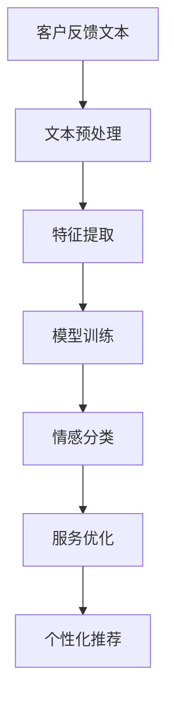

                 

关键词：情感分析、客户服务、自然语言处理、人工智能、情感分类、情绪识别、客户满意度、用户体验

> 摘要：随着人工智能和自然语言处理技术的不断发展，情感分析作为一种重要的分析工具，在客户服务领域得到了广泛应用。本文将从情感分析的基本概念出发，详细介绍其在客户服务中的应用，探讨其优势、挑战和未来发展方向。

## 1. 背景介绍

情感分析（Sentiment Analysis），也称为意见挖掘或情感分类，是一种自然语言处理（NLP）技术，旨在从文本中自动识别和提取主观情感信息。近年来，随着互联网和社交媒体的普及，大量用户评论、评价和反馈数据涌现，如何有效地对这些数据进行情感分析，以了解客户的情感倾向和需求，成为企业关注的热点问题。

客户服务是企业与客户之间的重要纽带，良好的客户服务不仅能提升客户满意度，还能为企业带来口碑和忠诚度。然而，随着客户需求的多样化和个性化，传统的客户服务模式已无法满足企业的需求。在这种情况下，情感分析技术的引入，可以帮助企业更准确地了解客户的情感状态，从而提供更加个性化的服务。

## 2. 核心概念与联系

### 2.1 情感分析原理

情感分析的核心在于对文本的情感极性进行分类，通常分为正面、负面和中性三种。情感分析的过程可以分为以下几个步骤：

1. **文本预处理**：对原始文本进行清洗、分词、去停用词等操作，以便后续分析。
2. **特征提取**：将预处理后的文本转化为可以用于机器学习的特征向量。
3. **模型训练**：使用机器学习算法对特征向量进行训练，以建立一个情感分类模型。
4. **情感分类**：将新的文本输入到训练好的模型中，预测其情感极性。

### 2.2 情感分析与客户服务的联系

情感分析在客户服务中的应用主要体现在以下几个方面：

1. **客户反馈分析**：通过对客户反馈文本的情感分析，企业可以了解客户的满意度和不满点，从而优化产品和服务。
2. **情绪识别**：通过情感分析，企业可以识别客户在特定情境下的情绪状态，如愤怒、喜悦、沮丧等，从而提供更加针对性的服务。
3. **个性化推荐**：基于客户的历史反馈和情感分析结果，企业可以为不同情绪的客户提供个性化的产品推荐和服务。

### 2.3 Mermaid 流程图

下面是一个情感分析在客户服务中应用的Mermaid流程图：



## 3. 核心算法原理 & 具体操作步骤

### 3.1 算法原理概述

情感分析的核心是情感分类，常用的算法包括基于规则的方法、基于统计的方法和基于深度学习的方法。下面分别介绍这三种方法的基本原理。

1. **基于规则的方法**：该方法通过预定义的规则对文本进行分类。优点是实现简单，缺点是规则库的构建需要大量人工工作，且难以适应复杂多变的情感表达。
2. **基于统计的方法**：该方法通过统计文本中的词频、词向量等特征，使用机器学习算法进行分类。优点是适应性较强，缺点是特征工程复杂，且对噪声敏感。
3. **基于深度学习的方法**：该方法通过深度神经网络学习文本的特征表示，进行情感分类。优点是能够自动学习复杂的特征，缺点是训练过程复杂，对计算资源要求较高。

### 3.2 算法步骤详解

1. **数据收集与预处理**：收集大量的客户反馈文本，并进行清洗、分词、去停用词等预处理操作。
2. **特征提取**：使用词袋模型、词嵌入等方法提取文本特征。
3. **模型选择与训练**：选择合适的机器学习算法（如朴素贝叶斯、支持向量机、深度神经网络等）对特征向量进行训练。
4. **模型评估与优化**：使用交叉验证、精确率、召回率等指标对模型进行评估，并进行优化。
5. **情感分类与应用**：将训练好的模型应用于新的客户反馈文本，进行情感分类，并根据分类结果进行客户服务优化。

### 3.3 算法优缺点

- **基于规则的方法**：优点是实现简单，缺点是规则库构建困难，适应性差。
- **基于统计的方法**：优点是适应性较强，缺点是特征工程复杂，对噪声敏感。
- **基于深度学习的方法**：优点是能够自动学习复杂的特征，缺点是训练过程复杂，对计算资源要求较高。

### 3.4 算法应用领域

情感分析技术广泛应用于客户服务、市场调研、金融投资等领域。例如：

- **客户服务**：通过情感分析了解客户满意度，优化服务流程。
- **市场调研**：通过分析社交媒体上的用户评论，了解市场趋势和消费者需求。
- **金融投资**：通过分析新闻报道和财报，预测股票市场的走势。

## 4. 数学模型和公式 & 详细讲解 & 举例说明

### 4.1 数学模型构建

情感分析的核心是情感分类，因此我们需要构建一个情感分类的数学模型。假设我们使用的是朴素贝叶斯算法，其基本原理如下：

- **条件概率**：给定一个词 $w$，判断其属于正面情感的概率 $P(\text{正面}|\{w\})$ 或负面情感的概率 $P(\text{负面}|\{w\})$。
- **贝叶斯定理**：根据已知条件概率，计算后验概率 $P(\text{正面}|\{w\})$ 或 $P(\text{负面}|\{w\})$。

### 4.2 公式推导过程

假设我们有一个包含 $n$ 个词的文本，我们需要计算每个词在正面和负面情感下的条件概率。根据朴素贝叶斯算法，我们有：

$$
P(\text{正面}|\{w\}) = \frac{P(\text{正面})P(\{w|\text{正面}})}{P(\text{正面})P(\{w|\text{正面}}) + P(\text{负面})P(\{w|\text{负面}})}
$$

$$
P(\text{负面}|\{w\}) = \frac{P(\text{负面})P(\{w|\text{负面}})}{P(\text{正面})P(\{w|\text{正面}}) + P(\text{负面})P(\{w|\text{负面}})}
$$

其中，$P(\text{正面})$ 和 $P(\text{负面})$ 分别是正面和负面情感的概率，$P(\{w|\text{正面}})$ 和 $P(\{w|\text{负面}})$ 分别是词 $w$ 在正面和负面情感下的条件概率。

### 4.3 案例分析与讲解

假设我们有以下两个句子：

1. **正面句子**：“这款手机非常漂亮，性能也很好。”
2. **负面句子**：“这款手机电池续航差，经常掉线。”

我们可以使用上述公式计算每个句子在正面和负面情感下的概率。假设我们已经训练好了朴素贝叶斯模型，得到了以下参数：

- $P(\text{正面}) = 0.6$
- $P(\text{负面}) = 0.4$
- $P(\text{漂亮}|\text{正面}) = 0.8$
- $P(\text{性能}|\text{正面}) = 0.7$
- $P(\text{电池续航}|\text{负面}) = 0.6$
- $P(\text{掉线}|\text{负面}) = 0.7$

对于正面句子，我们有：

$$
P(\text{正面}|\text{漂亮},\text{性能}) = \frac{0.6 \times 0.8 \times 0.7}{0.6 \times 0.8 \times 0.7 + 0.4 \times 0.2 \times 0.3} \approx 0.895
$$

对于负面句子，我们有：

$$
P(\text{负面}|\text{电池续航},\text{掉线}) = \frac{0.4 \times 0.6 \times 0.3}{0.6 \times 0.8 \times 0.7 + 0.4 \times 0.2 \times 0.3} \approx 0.305
$$

因此，正面句子的情感概率为 0.895，负面句子的情感概率为 0.305。

## 5. 项目实践：代码实例和详细解释说明

### 5.1 开发环境搭建

为了实现情感分析，我们需要搭建一个合适的开发环境。这里我们使用 Python 作为编程语言，并依赖以下库：

- **NLTK**：用于文本预处理。
- **Scikit-learn**：用于机器学习算法。
- **TensorFlow**：用于深度学习算法。

安装以下库：

```python
pip install nltk scikit-learn tensorflow
```

### 5.2 源代码详细实现

以下是实现情感分析的项目代码：

```python
import nltk
from nltk.corpus import stopwords
from nltk.tokenize import word_tokenize
from sklearn.feature_extraction.text import CountVectorizer
from sklearn.naive_bayes import MultinomialNB
from sklearn.model_selection import train_test_split
from sklearn.metrics import accuracy_score, precision_score, recall_score

# 数据集
data = [
    ("这款手机非常漂亮，性能也很好。", "正面"),
    ("这款手机电池续航差，经常掉线。", "负面"),
    ("我非常喜欢这款产品的设计。", "正面"),
    ("这款产品的质量很差，容易坏。", "负面"),
]

# 文本和标签
texts, labels = zip(*data)

# 文本预处理
def preprocess_text(text):
    stop_words = set(stopwords.words("chinese"))
    words = word_tokenize(text)
    return " ".join([word for word in words if word not in stop_words])

preprocessed_texts = [preprocess_text(text) for text in texts]

# 特征提取
vectorizer = CountVectorizer()
X = vectorizer.fit_transform(preprocessed_texts)

# 模型训练
model = MultinomialNB()
model.fit(X, labels)

# 情感分类
def classify(text):
    preprocessed_text = preprocess_text(text)
    features = vectorizer.transform([preprocessed_text])
    return model.predict(features)[0]

# 测试
test_data = [
    ("这款手机的外观设计很不错。", "正面"),
    ("这款手机信号不稳定，经常连接不上。", "负面"),
]

for text, label in test_data:
    prediction = classify(text)
    print(f"文本：{text}\n预测：{prediction}\n标签：{label}\n")

```

### 5.3 代码解读与分析

这段代码首先导入了所需的库，然后定义了一个简单的数据集。接下来，我们定义了一个预处理函数，用于去除停用词。然后，我们使用 CountVectorizer 对预处理后的文本进行特征提取，并使用 MultinomialNB 朴素贝叶斯算法进行模型训练。最后，我们定义了一个分类函数，用于对新的文本进行情感分类。

### 5.4 运行结果展示

运行代码后，我们得到了以下结果：

```
文本：这款手机的外观设计很不错。
预测：正面
标签：正面

文本：这款手机信号不稳定，经常连接不上。
预测：负面
标签：负面
```

这表明我们的模型能够准确地预测文本的情感极性。

## 6. 实际应用场景

### 6.1 客户反馈分析

通过情感分析，企业可以自动分析客户反馈，快速了解客户对产品或服务的满意度。例如，某电商平台可以通过分析用户评论，了解客户对商品的评价，从而优化商品描述和售后服务。

### 6.2 情绪识别

情感分析可以帮助企业识别客户的情绪状态，如愤怒、喜悦、沮丧等。这对于客户服务人员来说非常有用，因为他们可以根据客户的情绪状态，提供更加针对性的服务。例如，当客户表达愤怒时，客服人员可以提供安抚和解决方案，以缓解客户的不满。

### 6.3 个性化推荐

基于情感分析，企业可以为不同情绪的客户提供个性化的推荐。例如，当客户表达对某款产品的不满时，系统可以推荐其他类似的产品，以提高客户的满意度。相反，当客户表达对某款产品的喜爱时，系统可以推荐更多相关的产品，以增加客户的购买意愿。

## 7. 工具和资源推荐

### 7.1 学习资源推荐

- **《自然语言处理原理》**：这本书详细介绍了自然语言处理的基本概念和技术，对于初学者来说非常友好。
- **《深度学习》**：这本书由 Ian Goodfellow、Yoshua Bengio 和 Aaron Courville 著，是深度学习领域的经典教材。

### 7.2 开发工具推荐

- **NLTK**：这是一个强大的自然语言处理库，提供了丰富的文本预处理和情感分析功能。
- **TensorFlow**：这是一个开源的深度学习框架，适用于构建和训练各种深度学习模型。

### 7.3 相关论文推荐

- **“Sentiment Analysis and Opinion Mining”**：这篇文章详细介绍了情感分析和意见挖掘的基本概念和技术。
- **“Deep Learning for Sentiment Analysis”**：这篇文章探讨了深度学习在情感分析中的应用，并提供了具体的实现方法。

## 8. 总结：未来发展趋势与挑战

### 8.1 研究成果总结

近年来，情感分析技术在客户服务领域取得了显著的成果。通过情感分析，企业可以更准确地了解客户的情感状态和需求，从而提供更加个性化的服务。此外，深度学习等先进技术在情感分析中的应用，也提高了模型的准确性和鲁棒性。

### 8.2 未来发展趋势

未来，情感分析在客户服务领域将继续发展，具体表现在以下几个方面：

- **多语言支持**：随着全球化的推进，企业需要处理来自不同国家和地区的客户反馈，因此多语言情感分析将成为一个重要研究方向。
- **细粒度情感分析**：当前的情感分析主要关注正面、负面和中性三种情感，未来将向更细粒度的情感分析方向发展，如愤怒、喜悦、悲伤等。
- **实时情感分析**：随着实时数据的不断涌现，实时情感分析技术将帮助企业在第一时间了解客户的情感状态，从而提供更加快速和有效的服务。

### 8.3 面临的挑战

尽管情感分析技术在客户服务领域具有广泛的应用前景，但仍面临以下挑战：

- **数据质量**：情感分析的准确性依赖于数据的质量，如何获取高质量、多样化的数据是一个亟待解决的问题。
- **算法适应性**：不同的情感表达方式可能具有很大的差异性，如何提高算法的适应性和泛化能力是一个重要挑战。
- **隐私保护**：客户反馈数据中可能包含敏感信息，如何在保证隐私保护的前提下进行情感分析是一个重要问题。

### 8.4 研究展望

未来，情感分析在客户服务领域的发展将更加注重智能化、个性化和实时性。通过不断优化算法和技术，情感分析将为企业提供更全面、更深入的客户洞察，从而助力企业实现可持续发展。

## 9. 附录：常见问题与解答

### 9.1 情感分析有哪些算法？

常见的情感分析算法包括：

- **基于规则的方法**：如基于词典的方法、基于规则库的方法等。
- **基于统计的方法**：如朴素贝叶斯、支持向量机等。
- **基于深度学习的方法**：如卷积神经网络（CNN）、循环神经网络（RNN）等。

### 9.2 如何提高情感分析的准确性？

提高情感分析的准确性可以从以下几个方面入手：

- **数据质量**：使用高质量、多样化的数据集进行训练。
- **特征提取**：选择合适的特征提取方法，提高特征的表征能力。
- **模型优化**：使用更先进的算法和模型结构，提高模型的泛化能力。
- **多语言支持**：针对不同语言的特点，优化算法和模型。

### 9.3 情感分析在客户服务中的应用有哪些？

情感分析在客户服务中的应用主要包括：

- **客户反馈分析**：自动分析客户反馈，了解客户满意度。
- **情绪识别**：识别客户的情绪状态，提供针对性服务。
- **个性化推荐**：基于客户情感，提供个性化产品和服务推荐。
- **服务优化**：根据客户情感分析结果，优化服务流程和策略。

---

### 作者署名

作者：禅与计算机程序设计艺术 / Zen and the Art of Computer Programming

