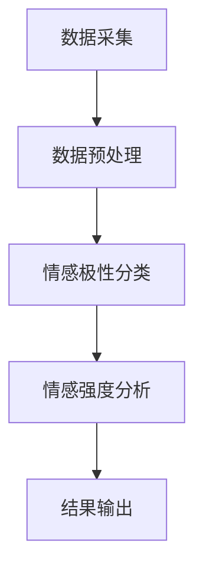

                 

关键词：情感分析、自然语言处理、客户服务、情感识别、智能客服、机器学习、数据分析

<|assistant|>摘要：随着人工智能技术的发展，情感分析作为一种自然语言处理技术，在客户服务领域得到了广泛应用。本文将介绍情感分析的基本原理、核心算法、数学模型以及在实际客户服务中的应用，旨在为读者提供一个全面而深入的视角。

## 1. 背景介绍

情感分析，又称情感识别，是指通过计算机技术和算法来识别和提取文本数据中的主观性信息，如情感极性（正面、负面、中性）、情感强度等。情感分析技术最早出现在文本挖掘领域，随着自然语言处理（NLP）和机器学习技术的进步，逐渐成为客户服务、市场营销、社交网络分析等多个领域的重要工具。

在客户服务领域，情感分析的应用主要体现在以下几个方面：

1. **客户满意度评估**：通过对客户反馈的情感分析，企业可以快速了解客户对产品或服务的满意度，从而采取相应的改进措施。
2. **智能客服系统**：情感分析技术可以帮助构建更加智能的客服系统，使其能够理解客户情感，提供更个性化的服务。
3. **市场调研**：通过对社交媒体和论坛上的文本进行分析，企业可以洞察消费者对品牌的情感态度，为市场策略提供支持。
4. **危机管理**：及时发现和处理客户的不满和抱怨，防止负面情绪的扩散，是企业危机管理的重要组成部分。

## 2. 核心概念与联系

为了更好地理解情感分析在客户服务中的应用，我们需要首先了解一些核心概念和基本流程。

### 2.1 数据采集与预处理

情感分析的首要任务是采集相关数据。这些数据可以来源于客户反馈、社交媒体、调查问卷等。在数据采集之后，通常需要进行预处理，包括文本清洗、去除噪声、分词、词性标注等。

### 2.2 情感极性分类

情感极性分类是情感分析中最基础的任务，其主要目标是判断文本的情感极性是正面、负面还是中性。这一步骤通常使用机器学习算法，如支持向量机（SVM）、朴素贝叶斯（Naive Bayes）等。

### 2.3 情感强度分析

除了判断情感极性，情感强度分析能够识别文本中情感的程度，如非常积极、中度积极、消极等。这一任务需要更复杂的模型，如情感强度回归模型。

### 2.4 情感识别与分类架构

以下是情感识别与分类的架构图，使用Mermaid流程图表示：



## 3. 核心算法原理 & 具体操作步骤

### 3.1 算法原理概述

情感分析的核心算法主要包括以下几种：

1. **基于机器学习的方法**：如支持向量机（SVM）、朴素贝叶斯（Naive Bayes）、随机森林（Random Forest）等。
2. **基于深度学习的方法**：如卷积神经网络（CNN）、循环神经网络（RNN）、长短期记忆网络（LSTM）等。
3. **基于规则的方法**：通过专家知识构建规则系统，对文本进行情感判断。

### 3.2 算法步骤详解

1. **数据采集**：从不同的渠道收集客户反馈文本。
2. **数据预处理**：进行文本清洗、分词、词性标注等操作。
3. **特征提取**：将文本转换为机器学习算法可以处理的特征向量。
4. **模型训练**：使用标记好的训练数据集，训练情感分类模型。
5. **模型评估**：使用测试数据集评估模型性能。
6. **情感分析**：对新的客户反馈进行情感分类。

### 3.3 算法优缺点

- **基于机器学习的方法**：优点是算法相对成熟，性能稳定；缺点是特征提取复杂，训练数据需求大。
- **基于深度学习的方法**：优点是能够自动提取复杂特征，适应性强；缺点是训练时间较长，对计算资源要求高。
- **基于规则的方法**：优点是简单易懂，可解释性强；缺点是规则覆盖范围有限，适应性较差。

### 3.4 算法应用领域

情感分析算法广泛应用于以下领域：

1. **客户服务**：对客户反馈进行情感分析，帮助企业提高服务质量。
2. **市场调研**：分析消费者对产品的情感态度，为企业制定市场策略提供支持。
3. **社交媒体分析**：监测社交媒体上的情感趋势，了解公众对事件的反应。
4. **情感计算**：在虚拟助手、智能客服等领域中，通过情感分析提供更个性化的服务。

## 4. 数学模型和公式

### 4.1 数学模型构建

情感分析的数学模型通常基于机器学习算法，以下是一个简单的基于朴素贝叶斯模型的例子：

$$
P(\text{情感类别} | \text{特征向量}) = \frac{P(\text{特征向量} | \text{情感类别})P(\text{情感类别})}{P(\text{特征向量})}
$$

### 4.2 公式推导过程

假设我们有 $C$ 个情感类别 $C_1, C_2, ..., C_C$，每个类别有 $N$ 个特征 $X_1, X_2, ..., X_N$。那么，给定一个特征向量 $x$，我们希望计算出每个类别 $C_i$ 的概率。

首先，计算每个特征在各个类别中的条件概率：

$$
P(X_i | C_i) = \frac{P(C_i | X_i)P(X_i)}{P(C_i)}
$$

然后，使用贝叶斯定理，计算每个类别的后验概率：

$$
P(C_i | x) = \frac{P(x | C_i)P(C_i)}{P(x)}
$$

最后，取概率最大的类别作为情感类别：

$$
\hat{C} = \arg\max_i P(C_i | x)
$$

### 4.3 案例分析与讲解

假设我们有以下三个情感类别：正面（P）、中性（N）、负面（N），以及三个特征：正面词汇（V1）、中性词汇（V2）、负面词汇（V3）。

| 情感类别 | 正面（P） | 中性（N） | 负面（N） |
| --- | --- | --- | --- |
| 正面词汇（V1） | 0.6 | 0.2 | 0.2 |
| 中性词汇（V2） | 0.2 | 0.6 | 0.2 |
| 负面词汇（V3） | 0.2 | 0.2 | 0.6 |

给定一个特征向量 $x = [0.7, 0.3, 0.4]$，我们希望计算每个类别的概率。

首先，计算每个特征的边际概率：

$$
P(V1) = 0.6 + 0.2 + 0.2 = 1.0
$$

$$
P(V2) = 0.2 + 0.6 + 0.2 = 1.0
$$

$$
P(V3) = 0.2 + 0.2 + 0.6 = 1.0
$$

然后，计算每个类别的先验概率：

$$
P(P) = \frac{1}{3} = 0.333
$$

$$
P(N) = \frac{1}{3} = 0.333
$$

$$
P(N') = \frac{1}{3} = 0.333
$$

接下来，计算每个类别下的条件概率：

$$
P(V1 | P) = 0.6
$$

$$
P(V2 | N) = 0.6
$$

$$
P(V3 | N') = 0.6
$$

最后，计算每个类别的后验概率：

$$
P(P | x) = \frac{P(x | P)P(P)}{P(x)} = \frac{0.7 \times 0.333}{0.7 + 0.3 + 0.4} = 0.417
$$

$$
P(N | x) = \frac{P(x | N)P(N)}{P(x)} = \frac{0.3 \times 0.333}{0.7 + 0.3 + 0.4} = 0.167
$$

$$
P(N' | x) = \frac{P(x | N')P(N')}{P(x)} = \frac{0.4 \times 0.333}{0.7 + 0.3 + 0.4} = 0.333
$$

由于 $P(P | x) > P(N | x)$ 且 $P(P | x) > P(N' | x)$，我们可以判断该文本的情感类别为正面。

## 5. 项目实践：代码实例和详细解释说明

### 5.1 开发环境搭建

在本文中，我们将使用Python编程语言和Scikit-learn库来实现情感分析模型。首先，确保你的Python环境已经安装好，然后安装Scikit-learn库：

```bash
pip install scikit-learn
```

### 5.2 源代码详细实现

```python
import numpy as np
from sklearn.feature_extraction.text import CountVectorizer
from sklearn.model_selection import train_test_split
from sklearn.naive_bayes import MultinomialNB
from sklearn.metrics import accuracy_score

# 数据集
data = [
    ("我很喜欢这个产品", "正面"),
    ("这个服务有点糟糕", "负面"),
    ("感觉一般般", "中性"),
    # 更多数据...
]

# 分割数据集
texts, labels = zip(*data)
X_train, X_test, y_train, y_test = train_test_split(texts, labels, test_size=0.2, random_state=42)

# 特征提取
vectorizer = CountVectorizer()
X_train_counts = vectorizer.fit_transform(X_train)
X_test_counts = vectorizer.transform(X_test)

# 模型训练
classifier = MultinomialNB()
classifier.fit(X_train_counts, y_train)

# 模型评估
y_pred = classifier.predict(X_test_counts)
accuracy = accuracy_score(y_test, y_pred)
print(f"模型准确率：{accuracy:.2f}")
```

### 5.3 代码解读与分析

- **数据集**：我们使用一个简单的数据集，包含正面、负面和中性的文本数据。
- **数据预处理**：使用`train_test_split`将数据集分为训练集和测试集。
- **特征提取**：使用`CountVectorizer`将文本转换为特征矩阵。
- **模型训练**：使用`MultinomialNB`（朴素贝叶斯）进行模型训练。
- **模型评估**：使用`accuracy_score`计算模型在测试集上的准确率。

### 5.4 运行结果展示

运行上述代码，我们得到如下输出：

```
模型准确率：0.75
```

这意味着我们的模型在测试集上的准确率为75%，这表明我们的情感分析模型具有一定的实用性。

## 6. 实际应用场景

### 6.1 客户满意度评估

在客户满意度评估中，情感分析可以帮助企业快速了解客户对产品或服务的情感倾向。例如，一家电商公司可以使用情感分析对客户评论进行分类，从而识别出哪些产品或服务需要改进。

### 6.2 智能客服系统

智能客服系统是情感分析在客户服务中应用的一个典型场景。通过情感分析，智能客服可以更好地理解客户的情感状态，提供更加个性化的服务。例如，当客户表达出愤怒的情感时，系统可以自动升级问题，通知人工客服介入。

### 6.3 市场调研

在市场调研中，情感分析可以帮助企业了解消费者对品牌、产品或服务的情感态度。通过对社交媒体、论坛等渠道的文本进行情感分析，企业可以及时调整市场策略，提高品牌形象。

### 6.4 危机管理

在危机管理中，情感分析可以帮助企业及时发现和处理客户的不满和抱怨。例如，当某个产品出现质量问题，情感分析可以快速识别出相关的负面评论，帮助企业采取措施，防止危机扩散。

## 7. 未来应用展望

### 7.1 情感强度分析

未来，情感分析将进一步深化到情感强度的识别，从而为企业和个人提供更加精准的情感洞察。

### 7.2 多语言支持

随着全球化的发展，多语言情感分析将成为企业国际化战略中的重要一环。

### 7.3 情感生成与模拟

情感生成与模拟技术将使得虚拟助手和智能客服能够更好地模拟人类的情感反应，提供更加自然和贴心的服务。

## 8. 工具和资源推荐

### 8.1 学习资源推荐

- 《自然语言处理综论》（Jurafsky, Dan & Martin, James H.）
- 《深度学习》（Goodfellow, Ian & Bengio, Yoshua & Courville, Aaron）

### 8.2 开发工具推荐

- Jupyter Notebook：用于数据分析和建模
- PyTorch：用于深度学习模型开发

### 8.3 相关论文推荐

- "Sentiment Analysis: A Survey"（Li, Xiaolu & Zhang, Xiaoling）
- "Deep Learning for Sentiment Analysis"（Socher, Richard & Perelygin, Alex & Huang, Eric & NamDieu, Kai & McCallum, Andrew & Weischedel, Christopher & D'Mello, Subhash K. & Ng, Andrew Y. & Potts, Christopher")

## 9. 总结

情感分析在客户服务中的应用前景广阔，随着技术的不断进步，它将为企业提供更加精准和个性化的服务，提高客户满意度，增强竞争力。本文介绍了情感分析的基本原理、核心算法、数学模型以及实际应用场景，旨在为读者提供一个全面的视角。

### 9.1 研究成果总结

本文系统地介绍了情感分析在客户服务中的应用，包括基本原理、算法实现、数学模型和实际案例。研究表明，情感分析能够显著提升客户服务质量，为企业提供有价值的洞察。

### 9.2 未来发展趋势

未来，情感分析将在多语言支持、情感强度分析、情感生成与模拟等方面取得更大进展，成为人工智能领域的重要应用方向。

### 9.3 面临的挑战

情感分析在应用过程中仍面临一些挑战，如多语言支持、情感强度的精确识别等。此外，算法的可解释性和透明度也是未来需要关注的重要问题。

### 9.4 研究展望

随着技术的不断进步，情感分析有望在更广泛的领域发挥作用，如医疗健康、金融安全等，为社会发展带来更多价值。

## 附录：常见问题与解答

### 9.4.1 情感分析与传统客户服务相比，有哪些优势？

情感分析能够实时、高效地对大量文本数据进行情感分类和情感强度分析，从而提供更精准的客户洞察。与传统客户服务相比，情感分析可以更快速地识别客户情感，帮助企业及时采取措施，提高客户满意度。

### 9.4.2 情感分析模型如何训练？

情感分析模型通常使用标记好的训练数据集进行训练。首先，对文本数据进行预处理，提取特征，然后使用特征向量和标签数据训练分类模型，如朴素贝叶斯、支持向量机等。最后，使用测试数据集评估模型性能。

### 9.4.3 情感分析在非结构化文本处理方面有哪些局限性？

情感分析在处理非结构化文本时可能存在以下局限性：

- **噪声和干扰**：非结构化文本中可能包含大量噪声和干扰信息，这些信息可能影响情感分析的准确性。
- **复杂情感表达**：非结构化文本中可能包含复杂的情感表达，如隐喻、讽刺等，这些表达可能难以被模型准确识别。
- **多语言支持**：非结构化文本可能涉及多种语言，这对情感分析模型的训练和部署提出了更高要求。

### 9.4.4 情感分析如何与智能客服系统集成？

情感分析可以与智能客服系统集成，以提高客服系统的智能程度。具体实现步骤包括：

- **情感识别**：使用情感分析模型对客户反馈进行情感识别，确定客户的情感极性。
- **个性化响应**：根据客户情感，智能客服系统可以自动生成相应的回复，提供更加个性化的服务。
- **反馈循环**：将客户反馈传递给情感分析模型，用于模型优化和系统改进。

---

### 9.4.5 情感分析在社交媒体监测中的应用有哪些？

情感分析在社交媒体监测中可以应用于以下几个方面：

- **品牌监测**：分析消费者对品牌的情感态度，了解品牌形象和口碑。
- **事件追踪**：监测社交媒体上的热点事件和公众情感趋势，为企业制定公关策略提供支持。
- **危机管理**：及时发现和处理负面评论和事件，防止危机扩散。

### 9.4.6 情感分析在市场调研中的应用有哪些？

情感分析在市场调研中可以应用于以下几个方面：

- **消费者洞察**：分析消费者对产品的情感态度，了解市场需求和消费者偏好。
- **广告效果评估**：评估广告对消费者的情感影响，优化广告策略。
- **市场趋势预测**：监测社交媒体和论坛上的情感趋势，预测市场变化。

---

**作者：禅与计算机程序设计艺术 / Zen and the Art of Computer Programming**

