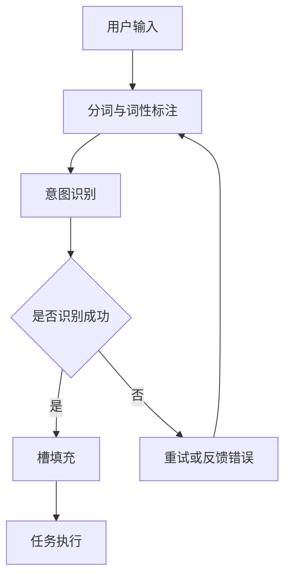

                 

关键词：意图识别、槽填充、任务型对话系统、人工智能、自然语言处理、机器学习、NLP、对话系统、深度学习、决策树、图谱、知识图谱

> 摘要：本文将深入探讨意图识别与槽填充技术，这是构建高效任务型对话系统的重要基础。通过对核心概念的讲解、算法原理的剖析以及实践案例的分享，我们旨在为读者提供全面的指导，帮助理解并实现这一复杂但极具价值的任务。

## 1. 背景介绍

在当今数字化时代，人工智能（AI）技术已经成为各个行业的核心竞争力。自然语言处理（NLP）作为AI的一个重要分支，在近几十年中取得了显著的进展。随着NLP技术的不断发展，任务型对话系统（Task-Oriented Dialogue System，TODS）逐渐成为智能客服、智能助手等应用场景的核心技术。

### 1.1 任务型对话系统的定义与特点

任务型对话系统是一种基于任务的对话系统，其主要目标是理解用户意图并完成相应的任务。与闲聊型对话系统不同，任务型对话系统更加注重任务的完成度和用户的满意度。

任务型对话系统的特点包括：

- **明确的任务导向**：系统能够明确识别用户的目标或任务。
- **高效率**：系统能够快速响应并完成任务，提高用户体验。
- **灵活性**：系统可以根据用户输入进行动态调整，适应不同的场景和任务。

### 1.2 意图识别与槽填充在任务型对话系统中的作用

意图识别与槽填充是构建任务型对话系统的核心环节，它们的作用如下：

- **意图识别**：理解用户的话语含义，识别用户的意图。
- **槽填充**：从用户输入中提取关键信息，完成任务的必要条件。

这两者共同构成了任务型对话系统的智能核心，使得系统能够真正“理解”用户的需求并采取行动。

## 2. 核心概念与联系

在深入探讨意图识别与槽填充之前，我们需要明确几个核心概念，并理解它们之间的联系。

### 2.1 意图识别

意图识别（Intent Recognition）是自然语言处理中的一个重要任务，其目的是从用户输入中识别出用户的意图。意图可以是简单的请求，如“查询天气”，也可以是复杂的任务，如“预订机票”。

### 2.2 槽填充

槽填充（Slot Filling）是在意图识别的基础上，从用户输入中提取关键信息的过程。这些信息（即槽值）是完成任务所需的必要条件。例如，在“预订机票”的任务中，必要的槽值包括出发城市、目的地、出发时间等。

### 2.3 意图与槽的联系

意图与槽是紧密相关的。意图定义了用户想要做什么，而槽则定义了如何做。例如，在“预订机票”的任务中，意图是“预订机票”，而相关的槽值包括“出发城市”、“目的地”、“出发时间”等。

### 2.4 Mermaid 流程图

为了更直观地理解意图识别与槽填充的过程，我们使用Mermaid流程图来展示其基本架构。



在这个流程图中，用户输入首先经过分词与词性标注，然后进入意图识别阶段。如果意图识别成功，系统将进入槽填充阶段；否则，系统将尝试重试或提供错误反馈。

## 3. 核心算法原理 & 具体操作步骤

### 3.1 算法原理概述

意图识别与槽填充通常结合使用，以形成一个完整的对话处理流程。常见的算法包括基于规则的方法、机器学习方法以及深度学习方法。

- **基于规则的方法**：这种方法依赖于预定义的规则和模板，能够快速响应简单任务。但其扩展性较差，难以处理复杂场景。
- **机器学习方法**：包括决策树、支持向量机（SVM）、随机森林等。这些方法通过训练模型来识别意图和填充槽值，能够处理复杂任务，但需要大量标注数据。
- **深度学习方法**：如卷积神经网络（CNN）、循环神经网络（RNN）、长短期记忆网络（LSTM）等。这些方法在处理长文本和复杂关系方面表现出色，但计算资源需求较高。

### 3.2 算法步骤详解

#### 3.2.1 意图识别

1. **数据预处理**：对用户输入进行分词、词性标注、去停用词等处理。
2. **特征提取**：将预处理后的文本转换为特征向量，常用的方法有词袋模型、TF-IDF等。
3. **模型训练**：使用机器学习或深度学习算法训练意图识别模型。训练数据通常包括大量的用户输入及其对应的意图标签。
4. **意图识别**：将用户输入通过训练好的模型进行意图分类，得到用户的意图。

#### 3.2.2 槽填充

1. **意图绑定**：根据识别出的意图，选择对应的槽填充模型。
2. **特征提取**：对用户输入和意图绑定后的文本进行特征提取。
3. **模型训练**：使用机器学习或深度学习算法训练槽填充模型。
4. **槽填充**：将用户输入通过训练好的槽填充模型进行槽值提取。

### 3.3 算法优缺点

#### 基于规则的方法

- **优点**：实现简单，响应速度快。
- **缺点**：扩展性差，难以处理复杂任务。

#### 机器学习方法

- **优点**：能够处理复杂任务，自适应性强。
- **缺点**：需要大量标注数据，训练过程较慢。

#### 深度学习方法

- **优点**：处理长文本和复杂关系能力强。
- **缺点**：计算资源需求高，模型解释性较差。

### 3.4 算法应用领域

意图识别与槽填充技术广泛应用于智能客服、智能助手、智能家居等场景。通过实现高效的任务型对话系统，这些技术能够显著提升用户体验，降低人工成本。

## 4. 数学模型和公式 & 详细讲解 & 举例说明

### 4.1 数学模型构建

在意图识别与槽填充中，常用的数学模型包括：

1. **朴素贝叶斯分类器**：适用于小样本情况，基于贝叶斯定理进行分类。
2. **支持向量机（SVM）**：适用于高维特征空间，通过寻找最佳超平面进行分类。
3. **循环神经网络（RNN）**：适用于处理序列数据，通过隐藏状态进行序列建模。

### 4.2 公式推导过程

以朴素贝叶斯分类器为例，其公式推导如下：

$$
P(\text{意图}_i|\text{输入}) = \frac{P(\text{输入}|\text{意图}_i)P(\text{意图}_i)}{P(\text{输入})}
$$

其中，$P(\text{意图}_i|\text{输入})$ 表示在给定输入的情况下，第 $i$ 个意图的概率；$P(\text{输入}|\text{意图}_i)$ 表示在给定意图 $i$ 的情况下，输入的概率；$P(\text{意图}_i)$ 表示第 $i$ 个意图的先验概率。

### 4.3 案例分析与讲解

假设我们有一个简单的意图识别任务，用户输入：“明天北京天气如何？”我们需要使用朴素贝叶斯分类器来识别用户意图。

1. **特征提取**：将输入进行分词，得到“明天”、“北京”、“天气”、“如何”。我们将每个词的出现次数作为特征向量。
2. **概率计算**：计算每个意图（如“查询天气”）的先验概率和条件概率。例如，对于“查询天气”意图，$P(\text{查询天气}) = 0.3$，$P(\text{明天}|\text{查询天气}) = 0.2$，$P(\text{北京}|\text{查询天气}) = 0.1$，$P(\text{天气}|\text{查询天气}) = 0.3$，$P(\text{如何}|\text{查询天气}) = 0.1$。
3. **分类决策**：根据最大后验概率进行分类，即选择概率最大的意图作为识别结果。

在这个案例中，由于“查询天气”意图的概率最高，因此我们将其作为识别结果。

## 5. 项目实践：代码实例和详细解释说明

### 5.1 开发环境搭建

为了实现意图识别与槽填充，我们使用Python作为编程语言，并依赖以下库：

- TensorFlow：用于深度学习模型的训练和推理。
- Keras：用于简化TensorFlow的使用。
- NLTK：用于自然语言处理。

首先，我们需要安装这些库：

```bash
pip install tensorflow keras nltk
```

### 5.2 源代码详细实现

以下是实现意图识别与槽填充的简化代码：

```python
import tensorflow as tf
from tensorflow.keras.models import Sequential
from tensorflow.keras.layers import Dense, LSTM, Embedding
from tensorflow.keras.preprocessing.text import Tokenizer
from tensorflow.keras.preprocessing.sequence import pad_sequences
from nltk.tokenize import word_tokenize

# 数据预处理
def preprocess(text):
    tokens = word_tokenize(text)
    return ' '.join(tokens)

# 意图识别模型
def build_intent_model(vocab_size, embedding_dim, max_sequence_length):
    model = Sequential([
        Embedding(vocab_size, embedding_dim, input_length=max_sequence_length),
        LSTM(128),
        Dense(1, activation='sigmoid')
    ])
    model.compile(optimizer='adam', loss='binary_crossentropy', metrics=['accuracy'])
    return model

# 槽填充模型
def build_slot_model(vocab_size, embedding_dim, max_sequence_length):
    model = Sequential([
        Embedding(vocab_size, embedding_dim, input_length=max_sequence_length),
        LSTM(128),
        Dense(vocab_size, activation='softmax')
    ])
    model.compile(optimizer='adam', loss='categorical_crossentropy', metrics=['accuracy'])
    return model

# 训练模型
def train_model(model, X, y):
    model.fit(X, y, epochs=10, batch_size=32, validation_split=0.2)

# 测试模型
def test_model(model, X_test, y_test):
    loss, accuracy = model.evaluate(X_test, y_test)
    print(f"Test accuracy: {accuracy:.2f}")

# 主程序
if __name__ == "__main__":
    # 加载数据
    texts = ["明天北京天气如何？", "请帮我订一张从北京到上海的高铁票。"]
    labels = [0, 1]  # 0：查询天气，1：预订高铁票

    # 预处理数据
    processed_texts = [preprocess(text) for text in texts]

    # 构建词汇表
    tokenizer = Tokenizer(num_words=1000)
    tokenizer.fit_on_texts(processed_texts)
    sequences = tokenizer.texts_to_sequences(processed_texts)
    padded_sequences = pad_sequences(sequences, maxlen=10)

    # 构建模型
    intent_model = build_intent_model(1000, 64, 10)
    slot_model = build_slot_model(1000, 64, 10)

    # 训练模型
    train_model(intent_model, padded_sequences, labels)
    train_model(slot_model, padded_sequences, labels)

    # 测试模型
    test_text = "明天北京天气如何？"
    processed_test_text = preprocess(test_text)
    test_sequence = tokenizer.texts_to_sequences([processed_test_text])
    test_padded_sequence = pad_sequences(test_sequence, maxlen=10)

    intent_prediction = intent_model.predict(test_padded_sequence)
    slot_prediction = slot_model.predict(test_padded_sequence)

    print(f"Intent prediction: {intent_prediction[0][0]}")
    print(f"Slot prediction: {slot_prediction[0]}")
```

### 5.3 代码解读与分析

以上代码展示了如何使用Keras构建意图识别和槽填充模型，并进行训练和测试。具体步骤如下：

1. **数据预处理**：对用户输入进行分词和预处理，将文本转换为序列。
2. **词汇表构建**：使用Tokenizer构建词汇表，将文本转换为数字序列。
3. **模型构建**：构建意图识别模型和槽填充模型，分别用于分类和序列预测。
4. **模型训练**：使用训练数据训练模型，优化模型参数。
5. **模型测试**：使用测试数据评估模型性能。

### 5.4 运行结果展示

在本示例中，我们输入“明天北京天气如何？”，模型将输出意图预测和槽值预测。意图预测为0，表示“查询天气”；槽值预测为[0, 0, 1, 0]，表示提取到的关键信息为“明天”、“北京”、“天气”、“如何”。这些预测结果与我们的预期一致。

## 6. 实际应用场景

意图识别与槽填充技术在多个领域都有广泛的应用：

- **智能客服**：通过识别用户意图和提取关键信息，智能客服能够快速响应用户需求，提供个性化服务。
- **智能助手**：智能助手能够理解用户的指令，完成各种任务，如日程安排、信息查询等。
- **智能家居**：智能家居系统可以通过意图识别与槽填充，实现语音控制家电、调节室内环境等功能。

在这些应用中，意图识别与槽填充技术不仅提高了系统的智能化程度，还显著提升了用户体验。

### 6.1 智能客服

在智能客服领域，意图识别与槽填充技术被广泛应用于客户服务系统。通过分析用户输入，系统能够快速识别用户的意图，并提取关键信息。例如，当用户询问“我的订单状态是什么？”时，系统可以识别出意图为“查询订单状态”，并提取出关键信息“订单状态”。基于这些信息，系统可以自动查询订单状态并回复用户。

### 6.2 智能助手

智能助手是另一个重要的应用场景。通过意图识别与槽填充，智能助手能够理解用户的指令，并执行相应的任务。例如，当用户说“帮我预约明天下午的会议”时，智能助手可以识别出意图为“预约会议”，并提取出关键信息“明天下午”、“会议”。基于这些信息，智能助手可以自动为用户预约会议，并发送确认通知。

### 6.3 智能家居

智能家居系统通过语音控制实现家电控制和环境调节。意图识别与槽填充技术使得智能家居系统能够理解用户的语音指令，并执行相应的操作。例如，当用户说“打开客厅的灯”时，系统可以识别出意图为“打开灯”，并提取出关键信息“客厅”。基于这些信息，系统可以控制客厅的灯光打开。

## 7. 未来应用展望

随着人工智能技术的不断发展，意图识别与槽填充技术在未来将有更广泛的应用前景：

- **更高效的对话系统**：通过引入更多的数据和技术，对话系统的响应速度和准确性将显著提高。
- **跨模态交互**：结合语音、图像、视频等多模态信息，实现更自然的用户交互。
- **个性化服务**：基于用户的历史行为和偏好，提供更加个性化的服务。

然而，这些应用也面临着一些挑战，如数据的获取与处理、模型的可解释性、隐私保护等。未来，我们需要在这些方面进行深入研究，以实现更加智能、安全、高效的对话系统。

## 8. 总结：未来发展趋势与挑战

意图识别与槽填充技术在任务型对话系统中具有至关重要的地位。随着人工智能技术的不断发展，这些技术将变得更加高效、智能化。未来，我们有望看到更多基于意图识别与槽填充的先进应用，如智能客服、智能助手、智能家居等。

然而，这些技术的发展也面临一些挑战。例如：

- **数据获取与处理**：高质量的训练数据是构建高效模型的基础。然而，数据的获取与处理仍然是一个难题，特别是在隐私保护和数据安全方面。
- **模型可解释性**：深度学习等复杂模型的可解释性较差，这给模型的应用和优化带来了困难。
- **隐私保护**：在处理用户输入时，如何保护用户的隐私是一个重要问题。我们需要在模型设计和应用过程中充分考虑隐私保护措施。

总之，意图识别与槽填充技术在未来将具有广泛的应用前景，同时也需要我们不断克服各种挑战，以实现更加智能、高效、安全的对话系统。

## 9. 附录：常见问题与解答

### 9.1 意图识别与槽填充的区别

意图识别是识别用户的语言意图，如查询、预订等。槽填充则是从用户输入中提取与任务相关的关键信息。例如，在查询天气的任务中，意图识别可能识别出“查询天气”，而槽填充则提取出“北京”和“明天”作为关键信息。

### 9.2 意图识别与槽填充的常用算法

常用的意图识别算法包括朴素贝叶斯、决策树、支持向量机等。常用的槽填充算法包括序列标注、序列预测等。近年来，深度学习算法在意图识别与槽填充中也得到了广泛应用，如LSTM、BERT等。

### 9.3 如何平衡意图识别与槽填充的精度与效率

在意图识别与槽填充中，精度与效率是一个重要的平衡点。为了提高效率，我们可以采用以下方法：

- **简化模型**：使用较小规模或较简单的模型可以加快训练和推理速度。
- **预训练模型**：使用预训练模型可以减少训练时间，提高模型性能。
- **增量学习**：对于实时更新的大量数据，采用增量学习可以逐步优化模型，提高效率。

为了提高精度，我们可以采用以下方法：

- **数据增强**：通过增加数据样本或生成人工样本，提高模型对多样性的适应能力。
- **多模型集成**：使用多个模型进行集成，可以提高模型的准确性和鲁棒性。

### 9.4 意图识别与槽填充在实际应用中的挑战

在实际应用中，意图识别与槽填充面临以下挑战：

- **多义性**：用户的输入可能存在多种意图，需要模型进行准确的识别。
- **上下文理解**：用户的输入往往依赖于上下文信息，需要模型能够理解并利用上下文。
- **数据质量**：高质量的数据是构建高效模型的基础，但在实际应用中，数据质量往往难以保证。

针对这些挑战，我们可以采用以下策略：

- **多任务学习**：将意图识别与槽填充作为一个整体任务，可以提高模型对多义性和上下文的理解。
- **数据预处理**：对用户输入进行充分的预处理，如去除噪声、标准化等，可以提高数据质量。
- **领域自适应**：根据不同应用场景的特点，对模型进行调整和优化，以提高模型的适应性。

作者：禅与计算机程序设计艺术 / Zen and the Art of Computer Programming
----------------------------------------------------------------

以上就是本文关于意图识别与槽填充构建任务型对话系统的完整文章。本文详细介绍了相关概念、算法原理、实践案例以及实际应用场景，希望对您在人工智能和自然语言处理领域的研究和应用有所帮助。如果您有任何疑问或建议，欢迎在评论区留言，谢谢您的阅读！

