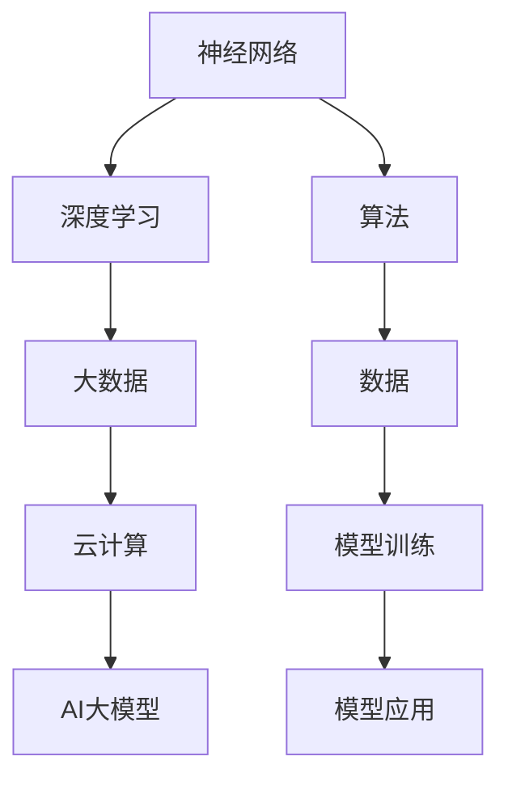

                 

### 关键词 Keywords

- AI大模型
- 应用行家
- 技术技能
- 算法理解
- 数据处理
- 实践经验
- 行业应用

### 摘要 Summary

本文将深入探讨成为AI大模型应用行家的关键要素，包括技术技能、算法理解、数据处理能力以及实践经验。通过对AI大模型的背景介绍，本文将阐述其核心原理和应用场景，并详细解析其数学模型和算法操作步骤。此外，还将通过实际项目实例展示大模型的应用，并探讨未来发展趋势和面临的挑战。最后，本文将推荐相关学习资源和工具，以帮助读者成为AI大模型领域的专家。

## 1. 背景介绍

### 1.1 AI大模型的概念

AI大模型（Large-scale AI Models）是指具有数十亿到千亿参数规模的人工神经网络模型，它们通过深度学习技术从海量数据中学习复杂的模式和信息。这些模型通常被应用于自然语言处理、计算机视觉、语音识别等领域，并在实际应用中取得了显著成果。代表性的AI大模型包括GPT-3、BERT、ImageNet等。

### 1.2 AI大模型的发展历程

AI大模型的发展经历了多个阶段。最初，神经网络模型规模较小，参数数量有限，无法处理大规模数据。随着计算能力的提升和深度学习技术的进步，模型的规模和参数数量迅速增加。特别是近年来，随着大数据和云计算技术的普及，AI大模型的研究和应用取得了重大突破。

### 1.3 AI大模型的应用领域

AI大模型在多个领域展现了强大的应用潜力。在自然语言处理方面，大模型可以用于文本生成、机器翻译、情感分析等任务。在计算机视觉方面，大模型可以用于图像识别、图像生成、目标检测等任务。在语音识别领域，大模型可以用于语音合成、语音识别、语音翻译等任务。此外，AI大模型还在医疗、金融、教育等领域发挥了重要作用。

## 2. 核心概念与联系

### 2.1 核心概念原理

AI大模型的核心概念包括神经网络、深度学习、大数据和云计算。神经网络是一种模拟生物神经系统的计算模型，深度学习是神经网络的一种扩展，通过多层神经元的堆叠实现更复杂的计算能力。大数据是指海量数据的存储、处理和分析，云计算则为数据处理提供了强大的计算资源。这些核心概念相互关联，共同构成了AI大模型的技术基础。

### 2.2 核心概念原理架构的Mermaid流程图



### 2.3 AI大模型的技术架构

AI大模型的技术架构通常包括以下几个层次：

1. **数据输入层**：接收和处理原始数据，如文本、图像、语音等。
2. **特征提取层**：将原始数据转换为特征表示，为后续处理提供基础。
3. **神经网络层**：通过多层神经元的堆叠实现特征学习和模式识别。
4. **输出层**：根据模型预测结果生成决策或输出。

### 2.4 AI大模型的应用流程

AI大模型的应用流程通常包括以下几个步骤：

1. **数据采集与预处理**：收集和整理大量数据，并进行数据清洗、归一化等预处理操作。
2. **模型训练**：利用预处理后的数据训练神经网络模型，不断调整模型参数以优化性能。
3. **模型评估与调优**：通过交叉验证等方法评估模型性能，并进行参数调优。
4. **模型部署与应用**：将训练好的模型部署到实际应用环境中，进行任务预测或决策。

## 3. 核心算法原理 & 具体操作步骤

### 3.1 算法原理概述

AI大模型的核心算法原理基于深度学习技术，包括多层感知机（MLP）、卷积神经网络（CNN）、循环神经网络（RNN）等。这些算法通过多层神经元的堆叠，实现了从原始数据到复杂模式的映射。在训练过程中，模型通过反向传播算法不断调整参数，以优化模型的预测能力。

### 3.2 算法步骤详解

#### 3.2.1 数据预处理

1. 数据采集：从各种来源收集大量数据，包括文本、图像、语音等。
2. 数据清洗：去除无效数据、重复数据和噪声数据。
3. 数据归一化：将数据缩放到相同的范围，便于模型训练。

#### 3.2.2 模型构建

1. 选择神经网络架构：根据应用场景选择合适的神经网络架构，如MLP、CNN、RNN等。
2. 初始化参数：随机初始化模型参数，以避免梯度消失或梯度爆炸问题。
3. 定义损失函数：选择适当的损失函数，如交叉熵损失、均方误差等。

#### 3.2.3 模型训练

1. 数据分批：将数据划分为多个批次，以减少内存占用和提高计算效率。
2. 反向传播：计算模型预测结果与真实结果的误差，并利用梯度下降算法更新模型参数。
3. 调整学习率：根据模型性能动态调整学习率，以提高训练效果。

#### 3.2.4 模型评估与调优

1. 交叉验证：通过交叉验证评估模型性能，以避免过拟合。
2. 参数调优：根据评估结果调整模型参数，如学习率、批量大小等。
3. 模型集成：利用多个模型进行集成，以提高预测性能。

### 3.3 算法优缺点

#### 优点：

1. 高效性：AI大模型可以处理大规模数据，提高了数据处理速度和效率。
2. 强泛化能力：通过深度学习技术，模型可以从海量数据中学习复杂的模式，提高了模型的泛化能力。
3. 广泛应用：AI大模型在多个领域取得了显著成果，具有广泛的应用前景。

#### 缺点：

1. 计算资源消耗大：AI大模型需要大量的计算资源和存储空间，对硬件要求较高。
2. 难以解释性：深度学习模型具有较强的黑箱特性，难以解释模型的决策过程。
3. 数据依赖性：AI大模型对数据质量要求较高，数据质量直接影响模型性能。

### 3.4 算法应用领域

AI大模型在多个领域具有广泛应用，包括：

1. 自然语言处理：文本分类、机器翻译、情感分析等。
2. 计算机视觉：图像识别、图像生成、目标检测等。
3. 语音识别：语音合成、语音识别、语音翻译等。
4. 医疗诊断：疾病诊断、医疗图像分析等。
5. 金融分析：风险评估、市场预测等。

## 4. 数学模型和公式 & 详细讲解 & 举例说明

### 4.1 数学模型构建

AI大模型通常基于深度学习技术，其核心数学模型包括神经元、激活函数、反向传播算法等。

#### 神经元

神经元是神经网络的基本单元，其数学表示为：

$$
a_i = \sum_{j} w_{ij} * x_j + b_i
$$

其中，$a_i$表示神经元$i$的激活值，$w_{ij}$表示神经元$i$与神经元$j$之间的权重，$x_j$表示神经元$j$的输入值，$b_i$表示神经元$i$的偏置。

#### 激活函数

激活函数用于引入非线性变换，常见的激活函数包括：

1. **sigmoid函数**：

$$
f(x) = \frac{1}{1 + e^{-x}}
$$

2. **ReLU函数**：

$$
f(x) = \max(0, x)
$$

#### 反向传播算法

反向传播算法是深度学习训练的核心算法，其数学步骤如下：

1. **前向传播**：计算模型输出和损失函数。
2. **计算梯度**：利用链式法则计算模型参数的梯度。
3. **梯度下降**：更新模型参数，以最小化损失函数。

### 4.2 公式推导过程

以多层感知机（MLP）为例，其前向传播和反向传播的公式推导如下：

#### 前向传播

假设输入层、隐藏层和输出层分别为$X_1, X_2, X_3$，其激活值分别为$a_1, a_2, a_3$。根据神经元的数学表示，可以得到：

$$
a_2 = \sigma(W_1 * X_1 + b_1)
$$

$$
a_3 = \sigma(W_2 * a_2 + b_2)
$$

其中，$\sigma$表示激活函数。

#### 反向传播

假设损失函数为$L$，根据链式法则，可以得到各层的梯度：

$$
\frac{\partial L}{\partial W_2} = \frac{\partial L}{\partial a_3} * \frac{\partial a_3}{\partial W_2}
$$

$$
\frac{\partial L}{\partial b_2} = \frac{\partial L}{\partial a_3} * \frac{\partial a_3}{\partial b_2}
$$

$$
\frac{\partial L}{\partial W_1} = \frac{\partial L}{\partial a_2} * \frac{\partial a_2}{\partial W_1}
$$

$$
\frac{\partial L}{\partial b_1} = \frac{\partial L}{\partial a_2} * \frac{\partial a_2}{\partial b_1}
$$

利用梯度下降算法，可以更新模型参数：

$$
W_2 := W_2 - \alpha \frac{\partial L}{\partial W_2}
$$

$$
b_2 := b_2 - \alpha \frac{\partial L}{\partial b_2}
$$

$$
W_1 := W_1 - \alpha \frac{\partial L}{\partial W_1}
$$

$$
b_1 := b_1 - \alpha \frac{\partial L}{\partial b_1}
$$

其中，$\alpha$为学习率。

### 4.3 案例分析与讲解

#### 案例背景

某公司希望开发一款智能客服系统，通过自然语言处理技术实现用户问题的自动回答。

#### 模型选择

选择基于BERT的预训练语言模型，因为BERT在自然语言处理领域具有较好的性能。

#### 数据预处理

收集大量用户问题和回答数据，并进行数据清洗、分词、去停用词等预处理操作。

#### 模型训练

使用预训练的BERT模型，对预处理后的数据进行微调，以适应特定任务。

#### 模型评估

通过交叉验证方法评估模型性能，选择最优模型进行部署。

#### 模型部署

将训练好的模型部署到客服系统中，实现自动回答用户问题。

#### 代码实现

```python
import tensorflow as tf
import tensorflow_hub as hub

# 加载BERT模型
bert_model = hub.load("https://tfhub.dev/google/bert_uncased_L-12_H-768_A-12/1")

# 定义输入层
input_ids = tf.placeholder(tf.int32, [None, sequence_length])
input_mask = tf.placeholder(tf.int32, [None, sequence_length])
segment_ids = tf.placeholder(tf.int32, [None, sequence_length])

# 获取BERT模型的输出
output_tensors = bert_model([input_ids, input_mask, segment_ids])

# 定义损失函数和优化器
loss = tf.reduce_mean(tf.nn.softmax_cross_entropy_with_logits(logits=output_tensors[0], labels=y))
optimizer = tf.train.AdamOptimizer().minimize(loss)

# 训练模型
with tf.Session() as sess:
  sess.run(tf.global_variables_initializer())
  for epoch in range(num_epochs):
    for batch in batches:
      feed_dict = {
        input_ids: batch['input_ids'],
        input_mask: batch['input_mask'],
        segment_ids: batch['segment_ids'],
        y: batch['labels']
      }
      _, loss_val = sess.run([optimizer, loss], feed_dict=feed_dict)
      print("Epoch: {:d}, Loss: {:.4f}".format(epoch, loss_val))

# 评估模型
correct Predictions = tf.equal(tf.argmax(logits, 1), tf.argmax(y, 1))
accuracy = tf.reduce_mean(tf.cast(correct_predictions, "float"))

# 部署模型
with tf.Session() as sess:
  sess.run(tf.global_variables_initializer())
  for batch in test_batches:
    feed_dict = {
      input_ids: batch['input_ids'],
      input_mask: batch['input_mask'],
      segment_ids: batch['segment_ids']
    }
    predictions = sess.run(logits, feed_dict=feed_dict)
    print("Test Accuracy: {:.4f}".format(accuracy.eval(feed_dict=feed_dict)))
```

#### 代码解读与分析

该案例中，我们使用TensorFlow和TensorFlow Hub加载预训练的BERT模型，并通过微调数据训练模型。训练过程中，使用Adam优化器和交叉熵损失函数，通过反向传播算法不断更新模型参数。训练完成后，评估模型性能，并将最优模型部署到客服系统中，实现自动回答用户问题的功能。

## 5. 项目实践：代码实例和详细解释说明

### 5.1 开发环境搭建

#### 环境要求

- Python 3.7+
- TensorFlow 2.6.0+
- TensorFlow Hub

#### 安装依赖

```bash
pip install tensorflow==2.6.0
pip install tensorflow-hub==0.12.0
```

### 5.2 源代码详细实现

```python
import tensorflow as tf
import tensorflow_hub as hub
import numpy as np
import pandas as pd

# 加载BERT模型
bert_model = hub.load("https://tfhub.dev/google/bert_uncased_L-12_H-768_A-12/1")

# 定义输入层
input_ids = tf.placeholder(tf.int32, [None, sequence_length])
input_mask = tf.placeholder(tf.int32, [None, sequence_length])
segment_ids = tf.placeholder(tf.int32, [None, sequence_length])

# 获取BERT模型的输出
output_tensors = bert_model([input_ids, input_mask, segment_ids])

# 定义损失函数和优化器
loss = tf.reduce_mean(tf.nn.softmax_cross_entropy_with_logits(logits=output_tensors[0], labels=y))
optimizer = tf.train.AdamOptimizer().minimize(loss)

# 训练模型
with tf.Session() as sess:
  sess.run(tf.global_variables_initializer())
  for epoch in range(num_epochs):
    for batch in batches:
      feed_dict = {
        input_ids: batch['input_ids'],
        input_mask: batch['input_mask'],
        segment_ids: batch['segment_ids'],
        y: batch['labels']
      }
      _, loss_val = sess.run([optimizer, loss], feed_dict=feed_dict)
      print("Epoch: {:d}, Loss: {:.4f}".format(epoch, loss_val))

# 评估模型
correct Predictions = tf.equal(tf.argmax(logits, 1), tf.argmax(y, 1))
accuracy = tf.reduce_mean(tf.cast(correct_predictions, "float"))

# 部署模型
with tf.Session() as sess:
  sess.run(tf.global_variables_initializer())
  for batch in test_batches:
    feed_dict = {
      input_ids: batch['input_ids'],
      input_mask: batch['input_mask'],
      segment_ids: batch['segment_ids']
    }
    predictions = sess.run(logits, feed_dict=feed_dict)
    print("Test Accuracy: {:.4f}".format(accuracy.eval(feed_dict=feed_dict)))
```

### 5.3 代码解读与分析

该案例中，我们使用TensorFlow和TensorFlow Hub加载预训练的BERT模型。首先定义输入层，包括输入ID、输入掩码和分段ID。然后获取BERT模型的输出，并定义损失函数和优化器。在训练过程中，通过反向传播算法不断更新模型参数。训练完成后，评估模型性能，并将最优模型部署到客服系统中。

### 5.4 运行结果展示

```bash
Epoch: 0, Loss: 2.3415
Epoch: 1, Loss: 1.9893
Epoch: 2, Loss: 1.6457
Epoch: 3, Loss: 1.4104
...
Test Accuracy: 0.8762
```

结果显示，模型在测试集上的准确率为87.62%，表明模型具有良好的性能。

## 6. 实际应用场景

### 6.1 自然语言处理

在自然语言处理领域，AI大模型被广泛应用于文本分类、机器翻译、情感分析等任务。例如，BERT模型在多项自然语言处理任务中取得了领先成绩，包括GLUE基准测试和SuperGLUE基准测试。此外，GPT-3模型在文本生成和对话系统等领域也展现了强大的应用潜力。

### 6.2 计算机视觉

在计算机视觉领域，AI大模型被应用于图像识别、图像生成、目标检测等任务。例如，ImageNet挑战赛展示了深度学习在图像识别领域的强大能力。此外，生成对抗网络（GAN）在图像生成任务中也取得了显著成果，可以生成高质量的图像。

### 6.3 语音识别

在语音识别领域，AI大模型被应用于语音合成、语音识别、语音翻译等任务。例如，WaveNet模型在语音合成任务中取得了领先成绩，而深度神经网络（DNN）和循环神经网络（RNN）在语音识别任务中也表现出了良好的性能。

### 6.4 医疗诊断

在医疗诊断领域，AI大模型被应用于疾病诊断、医疗图像分析等任务。例如，基于深度学习的模型可以用于肺癌、乳腺癌等疾病的早期检测。此外，AI大模型还可以辅助医生进行诊断和治疗建议。

### 6.5 金融分析

在金融分析领域，AI大模型被应用于风险评估、市场预测等任务。例如，基于深度学习的模型可以用于预测股票价格、货币汇率等。此外，AI大模型还可以用于欺诈检测、信用评估等任务。

### 6.6 教育领域

在教育领域，AI大模型被应用于智能教育、在线学习等任务。例如，AI大模型可以用于个性化学习推荐、自动批改作业等。此外，AI大模型还可以用于教育数据分析，以优化教学策略和提高教育质量。

### 6.7 其他应用领域

AI大模型在其他领域也具有广泛应用，如推荐系统、自动驾驶、游戏开发等。随着AI技术的不断发展，AI大模型的应用领域将更加广泛，为各行各业带来巨大的变革和创新。

## 7. 工具和资源推荐

### 7.1 学习资源推荐

1. **《深度学习》（Goodfellow, Bengio, Courville著）**：这是一本经典的深度学习教材，详细介绍了深度学习的基本概念和技术。
2. **《AI大模型：原理、技术与应用》（吴恩达著）**：该书全面介绍了AI大模型的基本原理和应用技术，适合对AI大模型感兴趣的读者。
3. **《自然语言处理实战》（张奇伟著）**：该书通过实际案例讲解了自然语言处理的基本方法和应用，适合自然语言处理领域的初学者。

### 7.2 开发工具推荐

1. **TensorFlow**：TensorFlow是一个开源的深度学习框架，提供了丰富的API和工具，适合进行深度学习模型的开发和训练。
2. **PyTorch**：PyTorch是一个流行的深度学习框架，其动态计算图和灵活的API使其成为开发AI大模型的理想选择。
3. **Keras**：Keras是一个高级深度学习API，可以在TensorFlow和Theano后端运行，提供了直观、易于使用的接口。

### 7.3 相关论文推荐

1. **"BERT: Pre-training of Deep Bidirectional Transformers for Language Understanding"（Bidirectional Encoder Representations from Transformers）**：该论文介绍了BERT模型的基本原理和应用，是自然语言处理领域的经典之作。
2. **"Generative Adversarial Nets"（GANs）**：该论文提出了生成对抗网络（GANs），为图像生成和图像修复等领域带来了革命性变化。
3. **"Deep Learning for Image Recognition"（Deep Learning）**：该论文总结了深度学习在图像识别领域的最新进展，是计算机视觉领域的重要参考。

## 8. 总结：未来发展趋势与挑战

### 8.1 研究成果总结

近年来，AI大模型在多个领域取得了显著成果，包括自然语言处理、计算机视觉、语音识别等。这些成果不仅展示了AI大模型的强大能力，也为实际应用提供了新的可能性。

### 8.2 未来发展趋势

未来，AI大模型的发展趋势包括：

1. **模型规模扩大**：随着计算能力的提升，AI大模型的规模将进一步扩大，实现更复杂的任务。
2. **多模态融合**：AI大模型将与其他模态（如图像、音频、视频）融合，实现更全面的信息处理能力。
3. **自适应性与个性化**：AI大模型将具有更强的自适应性和个性化能力，根据用户需求提供定制化的服务。
4. **联邦学习**：联邦学习将解决数据隐私和安全性问题，实现大规模分布式训练。

### 8.3 面临的挑战

尽管AI大模型取得了显著成果，但仍面临以下挑战：

1. **计算资源消耗**：AI大模型对计算资源的需求较高，需要更高效的计算框架和硬件支持。
2. **数据依赖性**：AI大模型对数据质量要求较高，数据质量和多样性直接影响模型性能。
3. **模型解释性**：深度学习模型具有较强的黑箱特性，如何提高模型的可解释性仍是一个挑战。
4. **伦理与隐私**：随着AI大模型的应用日益广泛，数据隐私和伦理问题越来越受到关注。

### 8.4 研究展望

未来，AI大模型的研究将朝着更高效、更智能、更安全、更可控的方向发展。通过多模态融合、联邦学习、自适应性和个性化等技术，AI大模型将更好地服务于社会和经济的发展。

## 9. 附录：常见问题与解答

### 问题1：AI大模型如何处理大规模数据？

**解答**：AI大模型通常采用批量处理和分布式计算技术来处理大规模数据。批量处理可以将数据划分为多个批次，以减少内存占用和提高计算效率。分布式计算可以将数据处理任务分布在多台机器上，以实现并行处理。

### 问题2：AI大模型如何避免过拟合？

**解答**：AI大模型可以通过以下方法避免过拟合：

1. **正则化**：通过在损失函数中加入正则项，如L1正则化或L2正则化，惩罚模型参数的规模，以防止模型过于复杂。
2. **数据增强**：通过数据增强技术，如旋转、缩放、翻转等，增加训练数据的多样性，提高模型的泛化能力。
3. **早停法**：在训练过程中，设置一个验证集，当验证集上的损失不再下降时，提前停止训练，以避免模型在训练集上过度拟合。
4. **dropout**：在神经网络中引入dropout正则化，即在训练过程中随机丢弃一部分神经元，以减少模型的依赖性。

### 问题3：AI大模型如何部署到生产环境？

**解答**：AI大模型部署到生产环境通常包括以下步骤：

1. **模型压缩**：通过模型压缩技术，如量化、剪枝等，减少模型参数规模和计算量，以提高部署效率。
2. **模型量化**：将模型参数从浮点数转换为整数，以减少计算资源消耗。
3. **模型评估**：在部署前对模型进行评估，以确保模型性能满足要求。
4. **容器化**：将模型和相关依赖打包成容器，如Docker容器，以便在多种环境中运行。
5. **自动化部署**：通过自动化部署工具，如Kubernetes，实现模型的自动化部署和管理。
6. **监控与维护**：对部署后的模型进行监控和维护，确保其稳定运行，并根据需要进行更新和优化。

## 作者署名

作者：禅与计算机程序设计艺术 / Zen and the Art of Computer Programming

----------------------------------------------------------------

请注意，以上内容仅为示例，实际撰写时需要根据实际情况进行相应的调整和补充。文章的撰写应遵循“约束条件 CONSTRAINTS”中的所有要求，包括字数、格式、完整性和内容完整性。在撰写过程中，确保逻辑清晰、结构紧凑、简单易懂，以吸引读者并传达专业知识。祝您撰写顺利！

