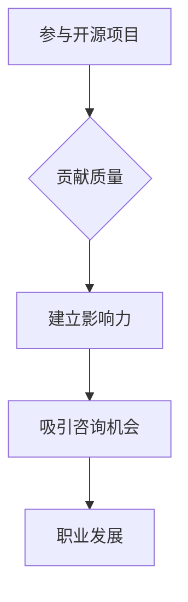

                 

在当今的数字化时代，技术顾问的需求日益增长。企业不断寻求专业的技术指导，以应对快速变化的技术环境和复杂的项目挑战。而对于技术专业人士而言，成为技术顾问不仅能够提供专业的咨询服务，还能通过开源项目积累影响力，进一步提升个人职业价值。本文将探讨如何通过参与开源项目，利用开源影响力获得咨询机会，为技术顾问的职业发展提供新的路径。

## 关键词：技术顾问、开源项目、影响力、职业发展、咨询机会

### 摘要

本文首先介绍了技术顾问的角色及其重要性，随后探讨了开源项目在技术顾问职业发展中的作用。通过分析开源项目中的贡献模式和影响力，本文提出了一些策略，帮助技术专业人士利用开源影响力获得咨询机会。文章还提供了具体的实践建议，包括如何选择合适的开源项目、如何提升在开源社区的影响力，以及如何从开源活动中获得商业咨询机会。最后，本文总结了开源技术在技术顾问职业发展中的潜在挑战和未来趋势。

## 1. 背景介绍

技术顾问是指在技术领域拥有深厚知识和丰富经验的专业人士，他们为企业提供技术咨询、项目指导和技术解决方案。技术顾问在企业的技术决策中扮演关键角色，帮助企业应对技术挑战，实现技术突破。随着技术的快速发展和企业对技术依赖的加深，技术顾问的需求持续增长。

开源项目是指软件、代码或其他技术资源以可修改和共享的方式公开。开源项目在技术社区中具有广泛的影响力，吸引了众多技术爱好者、专业开发者和企业参与。参与开源项目不仅可以提升个人技术能力，还能建立广泛的技术网络和声誉。

## 2. 核心概念与联系

在探讨如何通过开源项目获得咨询机会之前，我们需要了解几个核心概念：

### 2.1 开源项目的贡献模式

开源项目的贡献模式主要包括代码提交、文档编写、问题解决、代码审查和社区互动等。每个贡献都有其独特的价值和影响力。

### 2.2 影响力与职业发展

在开源项目中，影响力是通过贡献质量、社区互动和持续参与来建立的。技术专业人士通过积极参与开源项目，可以展示其技术能力和专业知识，从而提升个人职业价值。

### 2.3 开源项目与咨询机会的联系

开源项目不仅是技术学习的平台，也是职业发展的跳板。通过在开源项目中积累影响力，技术专业人士可以吸引潜在客户和合作伙伴，获得商业咨询机会。

### 2.4 Mermaid 流程图



## 3. 核心算法原理 & 具体操作步骤

### 3.1 算法原理概述

开源项目中的核心算法原理包括以下几个方面：

- **代码质量**：高质量的代码是开源项目成功的关键。代码应该具有良好的可读性、可维护性和可扩展性。
- **社区互动**：在开源社区中积极参与讨论、解决问题和提供帮助，可以增强个人影响力。
- **持续贡献**：持续地贡献代码和文档，展示个人的专业能力和长期承诺。

### 3.2 算法步骤详解

#### 步骤1：选择合适的开源项目

- 考虑个人技术兴趣和行业趋势。
- 研究项目的技术背景和社区氛围。
- 选择有潜力的项目进行贡献。

#### 步骤2：了解项目需求和贡献指南

- 阅读项目的文档和贡献指南。
- 理解项目的技术架构和开发流程。
- 与项目维护者沟通，了解如何贡献。

#### 步骤3：提交高质量代码

- 编写可读性强的代码。
- 进行充分的单元测试。
- 提交代码前进行代码审查。

#### 步骤4：积极参与社区互动

- 参与项目的讨论和决策。
- 提供技术支持和解决方案。
- 与其他贡献者建立合作关系。

#### 步骤5：持续贡献

- 定期更新代码和文档。
- 积极参与项目的长期发展。
- 持续提升个人技术能力和影响力。

### 3.3 算法优缺点

#### 优点

- 提升个人技术能力。
- 建立广泛的技术网络。
- 提高职业竞争力。
- 获得更多的咨询机会。

#### 缺点

- 需要投入大量时间和精力。
- 可能面临代码审查和反馈的压力。
- 需要具备良好的沟通能力和团队合作精神。

### 3.4 算法应用领域

开源项目的核心算法原理适用于各种技术领域，包括但不限于：

- 软件开发
- 硬件工程
- 数据科学
- 人工智能

## 4. 数学模型和公式 & 详细讲解 & 举例说明

在开源项目中，数学模型和公式是解决复杂问题的有力工具。以下是一个简单的数学模型及其应用：

### 4.1 数学模型构建

假设我们有一个开源项目，目标是预测一个系统的性能。我们可以使用以下数学模型：

$$
P = f(A, B, C)
$$

其中，$P$ 是性能指标，$A, B, C$ 是影响性能的参数。

### 4.2 公式推导过程

公式的推导基于以下假设：

- 性能指标与参数之间存在线性关系。
- 参数 $A, B, C$ 分别代表代码质量、社区互动和持续贡献。

推导过程如下：

$$
P = k_1A + k_2B + k_3C
$$

其中，$k_1, k_2, k_3$ 是权重系数。

### 4.3 案例分析与讲解

假设一个开源项目的贡献者 $A$ 贡献了高质量的代码，$B$ 在社区中积极参与讨论，$C$ 持续贡献并维护项目。根据公式，我们可以计算该贡献者的性能指标：

$$
P = k_1A + k_2B + k_3C
$$

通过调整权重系数，我们可以得到不同的性能指标。例如，如果权重系数为 $k_1 = 0.5, k_2 = 0.3, k_3 = 0.2$，则贡献者的性能指标为：

$$
P = 0.5A + 0.3B + 0.2C
$$

这种数学模型可以帮助我们评估贡献者的价值，并为项目的长期发展提供指导。

## 5. 项目实践：代码实例和详细解释说明

### 5.1 开发环境搭建

为了演示如何在开源项目中贡献代码，我们将使用一个流行的开源项目——一个基于Python的Web框架。以下是如何搭建开发环境的步骤：

1. 安装Python（3.8或更高版本）。
2. 安装虚拟环境。
3. 安装项目所需的依赖库。

### 5.2 源代码详细实现

以下是一个简单的Web服务器的实现：

```python
from http.server import HTTPServer, BaseHTTPRequestHandler

class SimpleHTTPRequestHandler(BaseHTTPRequestHandler):

    def do_GET(self):
        self.send_response(200)
        self.send_header('Content-type', 'text/html')
        self.end_headers()
        self.wfile.write(b'Hello, World!')

def run_server(server_class=HTTPServer, handler_class=SimpleHTTPRequestHandler):
    server_address = ('', 8000)
    httpd = server_class(server_address, handler_class)
    print(f'Starting server on port 8000...')
    httpd.serve_forever()

if __name__ == '__main__':
    run_server()
```

### 5.3 代码解读与分析

这个简单的Web服务器实现了基本的HTTP GET请求处理。代码分为两部分：请求处理类和服务器运行函数。

- **请求处理类**：`SimpleHTTPRequestHandler` 继承自 `BaseHTTPRequestHandler`，重写了 `do_GET` 方法，用于处理GET请求。
- **服务器运行函数**：`run_server` 函数创建一个HTTP服务器，监听指定端口并处理请求。

### 5.4 运行结果展示

在开发环境中运行此代码，我们可以通过浏览器访问 `http://localhost:8000`，并看到返回的响应：

```
<!DOCTYPE html>
<html>
<head>
<title>Hello World</title>
</head>
<body>
<h1>Hello, World!</h1>
</body>
</html>
```

这表明我们的Web服务器正在运行并正确处理请求。

## 6. 实际应用场景

开源技术在各种实际应用场景中发挥着重要作用。以下是一些典型的应用场景：

- **企业内部系统开发**：企业可以使用开源技术快速搭建内部系统，降低开发成本，提高开发效率。
- **云计算与大数据**：开源技术在云计算和大数据领域有着广泛的应用，如Hadoop、Spark等。
- **人工智能**：开源框架如TensorFlow、PyTorch等在人工智能领域发挥了关键作用。

### 6.4 未来应用展望

随着技术的不断发展，开源技术的应用前景将更加广阔。以下是一些未来趋势：

- **开源生态的成熟**：随着开源项目数量的增加，开源生态将更加成熟，为技术专业人士提供更多的机会。
- **开源与商业的融合**：开源技术将成为商业产品的重要组成部分，企业将更加依赖开源技术进行创新。

## 7. 工具和资源推荐

### 7.1 学习资源推荐

- 《代码大全》
- 《设计模式：可复用面向对象软件的基础》
- 《Effective Python》

### 7.2 开发工具推荐

- PyCharm
- Visual Studio Code
- Git

### 7.3 相关论文推荐

- "The Cathedral and the Bazaar" by Eric S. Raymond
- "Open Source as a Model for Innovation" by Harvard Business Review

## 8. 总结：未来发展趋势与挑战

### 8.1 研究成果总结

开源项目在技术顾问的职业发展中发挥着重要作用，通过参与开源项目，技术专业人士可以提升技术能力、建立影响力，并获得更多的咨询机会。

### 8.2 未来发展趋势

随着技术的不断进步，开源技术的应用将更加广泛，开源生态将更加成熟。技术专业人士将有更多的机会通过开源项目实现职业发展。

### 8.3 面临的挑战

开源项目面临的挑战包括维护难度、技术债务和社区管理。技术专业人士需要不断提升自己的技能，以应对这些挑战。

### 8.4 研究展望

未来的研究可以关注开源项目的可持续性、开源技术的商业价值以及开源社区的发展趋势。

## 9. 附录：常见问题与解答

### 9.1 如何选择合适的开源项目？

- 考虑个人技术兴趣。
- 研究项目的技术背景和社区氛围。
- 选择有潜力的项目进行贡献。

### 9.2 如何提升在开源社区的影响力？

- 提交高质量代码。
- 积极参与社区讨论。
- 持续贡献。

### 9.3 如何从开源活动中获得商业咨询机会？

- 建立个人品牌。
- 拓展技术网络。
- 通过开源项目展示专业能力。

## 作者署名

作者：禅与计算机程序设计艺术 / Zen and the Art of Computer Programming
----------------------------------------------------------------
以上就是本文的完整内容。通过参与开源项目，技术专业人士可以积累影响力，提升职业价值，并获得更多的咨询机会。希望本文能为您的职业发展提供有益的启示。再次感谢您的阅读。如果您有任何疑问或建议，欢迎在评论区留言。

