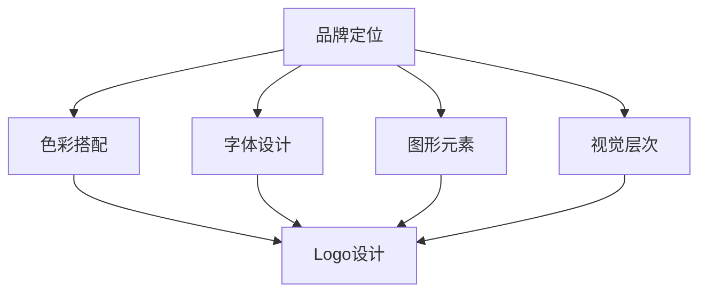

                 

关键词：视觉形象，品牌设计，一致性，UI/UX，设计原则，案例分析

> 摘要：本文将探讨如何通过设计一套统一的视觉形象，从Logo到头像，实现品牌的一致性和视觉冲击力。我们将从核心概念、算法原理、数学模型、实际应用等多个角度深入分析这一过程，并通过具体案例和实践操作，为设计师和品牌管理者提供实用的指导。

## 1. 背景介绍

在当今高度竞争的商业环境中，品牌形象至关重要。Logo作为品牌的视觉标志，头像作为个人或组织在网络空间中的代表，它们的视觉形象直接影响着消费者对品牌的认知和情感反应。一致的品牌视觉形象能够增强品牌的记忆度和识别度，提升品牌价值。因此，打造一致的视觉形象已成为许多企业和设计师关注的焦点。

本文将围绕这一主题展开，通过以下几个方面的探讨：

1. **核心概念与联系**：介绍相关设计概念及其相互联系，使用Mermaid流程图展示架构。
2. **核心算法原理 & 具体操作步骤**：详细解释设计原则和操作步骤，分析算法优缺点及适用领域。
3. **数学模型和公式**：阐述数学模型构建、公式推导过程，并通过案例说明。
4. **项目实践**：提供代码实例，详细解释代码实现、解读与分析。
5. **实际应用场景**：讨论视觉形象在不同场景中的应用和效果。
6. **工具和资源推荐**：推荐学习资源、开发工具和相关论文。
7. **总结与展望**：总结研究成果，探讨未来发展趋势与挑战。

## 2. 核心概念与联系

在设计统一的视觉形象时，我们首先要明确几个核心概念：品牌定位、色彩搭配、字体设计、图形元素和视觉层次。这些概念相互联系，共同构成了品牌的视觉语言。

### 2.1 品牌定位

品牌定位是品牌核心价值的体现，决定了品牌的形象和定位。在设计视觉形象时，品牌定位直接影响设计方向和风格。例如，一个科技公司的品牌定位可能强调创新、高效和简洁，而一个时尚品牌可能强调个性、时尚和奢华。

### 2.2 色彩搭配

色彩是视觉形象中最重要的元素之一，能够传达情感和信息。合理的色彩搭配能够增强品牌的记忆度和吸引力。常见的色彩搭配原则包括单色搭配、类似色搭配、互补色搭配和三角形搭配等。

### 2.3 字体设计

字体设计在视觉形象中起着至关重要的作用，能够传达品牌的专业性和个性。选择合适的字体不仅需要考虑品牌定位，还要考虑字体的易读性和视觉冲击力。常用的字体分类包括衬线字体、无衬线字体、手写字体等。

### 2.4 图形元素

图形元素是视觉形象中的视觉焦点，能够增强品牌的视觉记忆度和识别度。常见的图形元素包括Logo、图标、图形图案等。在设计图形元素时，需要考虑其简洁性、独特性和应用场景。

### 2.5 视觉层次

视觉层次是设计中的空间关系和视觉焦点，通过对比、对齐、层次感等手段，使视觉形象更加丰富和有吸引力。合理的视觉层次能够引导用户的视线，提升用户体验。

### 2.6 Mermaid流程图

下面是一个Mermaid流程图，展示上述核心概念之间的联系：



## 3. 核心算法原理 & 具体操作步骤

### 3.1 算法原理概述

在视觉形象设计中，核心算法主要涉及以下几个方面：

1. **色彩搭配算法**：根据品牌定位和情感需求，选择合适的色彩搭配方案。
2. **字体选择算法**：根据品牌定位和设计风格，选择合适的字体类型和样式。
3. **图形元素设计算法**：根据品牌特点和视觉需求，设计简洁、独特的图形元素。
4. **视觉层次算法**：通过对比、对齐、层次感等手段，优化视觉形象的层次结构。

### 3.2 算法步骤详解

下面我们将详细阐述每个算法的操作步骤：

### 3.2.1 色彩搭配算法

1. **分析品牌定位**：根据品牌定位，确定色彩的主色调和辅助色调。
2. **选择主色调**：从色彩理论中选择一个能够代表品牌情感的主色调。
3. **选择辅助色调**：根据主色调，选择一个或多个辅助色调，以增强视觉冲击力和色彩丰富度。

### 3.2.2 字体选择算法

1. **分析品牌定位**：根据品牌定位，确定字体类型和风格。
2. **选择字体**：在常用字体库中选择一个或多个符合品牌定位的字体。
3. **调整字体样式**：根据设计需求，调整字体大小、粗细、样式等。

### 3.2.3 图形元素设计算法

1. **分析品牌特点**：根据品牌特点，确定图形元素的设计方向和风格。
2. **设计图形元素**：利用设计软件，设计简洁、独特的图形元素。
3. **优化图形元素**：根据视觉需求，调整图形元素的形状、大小、颜色等。

### 3.2.4 视觉层次算法

1. **分析视觉需求**：根据设计需求，确定视觉层次的关键要素。
2. **设置对比**：通过对比，突出关键元素，提升视觉冲击力。
3. **对齐元素**：通过对齐，优化视觉层次，提升整体美感。
4. **调整层次感**：通过调整元素的大小、颜色、位置等，增强视觉层次感。

### 3.3 算法优缺点

每种算法都有其优缺点，以下是它们的简要总结：

- **色彩搭配算法**：优点是能够快速选择合适的色彩搭配，缺点是可能缺乏独特性。
- **字体选择算法**：优点是能够快速选择合适的字体，缺点是可能无法满足个性化需求。
- **图形元素设计算法**：优点是能够设计出简洁、独特的图形元素，缺点是设计过程可能较为复杂。
- **视觉层次算法**：优点是能够优化视觉层次，提升整体美感，缺点是可能对设计经验要求较高。

### 3.4 算法应用领域

这些算法主要应用于品牌设计、UI/UX设计、平面设计等领域。在实际应用中，可以根据具体需求选择合适的算法，或者将多种算法结合使用，以实现最佳设计效果。

## 4. 数学模型和公式 & 详细讲解 & 举例说明

在视觉形象设计中，数学模型和公式可以用于指导色彩搭配、字体选择和图形元素设计等关键环节。以下是几个典型的数学模型和公式，以及它们的详细讲解和举例说明。

### 4.1 数学模型构建

#### 4.1.1 色彩模型

色彩模型是视觉形象设计中最重要的数学模型之一。常用的色彩模型包括RGB模型、CMYK模型和HSV模型等。以下是这些模型的简要介绍：

- **RGB模型**：RGB模型是基于红色、绿色和蓝色三种基本颜色的加色混合模型。每种颜色由0到255的整数表示，通过组合这些数字，可以生成多种颜色。
- **CMYK模型**：CMYK模型是基于青色、品红、黄色和黑色四种基本颜色的减色混合模型。这种模型常用于印刷设计，每种颜色同样由0到100的百分比表示。
- **HSV模型**：HSV模型是基于色相（Hue）、饱和度（Saturation）和亮度（Value）的加色混合模型。这种模型更适合视觉设计和色彩调整。

#### 4.1.2 字体模型

字体模型是用于描述字体特征和风格的数学模型。常用的字体模型包括PostScript字体模型和TrueType字体模型。以下是这些模型的简要介绍：

- **PostScript字体模型**：PostScript字体模型是Adobe公司在1980年代开发的一种字体描述模型。它使用一组参数来描述字体的形状和特征。
- **TrueType字体模型**：TrueType字体模型是Apple公司和Microsoft公司合作开发的一种字体描述模型。它使用矢量图形来描述字体的形状和特征。

### 4.2 公式推导过程

以下是一个关于HSV模型色彩转换的公式推导过程：

#### 4.2.1 HSV模型到RGB模型的转换

HSV模型到RGB模型的转换公式如下：

$$
\begin{aligned}
R &= \frac{255 \times (1 - S \times V)}{1 - H} \\
G &= \frac{255 \times (1 - S \times V)}{1 - H} \\
B &= \frac{255 \times (1 - S \times V)}{1 - H} \\
\end{aligned}
$$

其中，$H$、$S$ 和 $V$ 分别代表色相、饱和度和亮度，$R$、$G$ 和 $B$ 分别代表红色、绿色和蓝色。

#### 4.2.2 RGB模型到HSV模型的转换

RGB模型到HSV模型的转换公式如下：

$$
\begin{aligned}
H &= \arccos\left(\frac{R - G}{\sqrt{R^2 + G^2}}\right) \\
S &= \frac{1 - \min(R, G, B)}{1 + \max(R, G, B)} \\
V &= \max(R, G, B) \\
\end{aligned}
$$

其中，$H$、$S$ 和 $V$ 分别代表色相、饱和度和亮度，$R$、$G$ 和 $B$ 分别代表红色、绿色和蓝色。

### 4.3 案例分析与讲解

#### 4.3.1 色彩搭配案例分析

假设我们需要设计一个以蓝色为主的品牌视觉形象，品牌定位是科技与创新。以下是具体的色彩搭配分析和讲解：

1. **主色调**：选择蓝色作为主色调，因为蓝色通常与科技、创新和冷静等概念相关联。
2. **辅助色调**：选择白色作为辅助色调，因为白色能够提升品牌的清晰度和简洁性。
3. **对比色**：选择橙色作为对比色，因为橙色与蓝色形成强烈的对比，能够吸引注意。

#### 4.3.2 字体设计案例分析

假设我们需要为这个品牌设计一套字体，品牌定位是科技与创新。以下是具体的字体设计分析和讲解：

1. **字体类型**：选择无衬线字体，因为无衬线字体通常显得简洁、现代，适合科技品牌。
2. **字体样式**：选择细体，因为细体能够提升品牌的清晰度和简洁性。
3. **字体大小**：选择16号字体，因为16号字体适中，适合屏幕显示和阅读。

#### 4.3.3 图形元素设计案例分析

假设我们需要为这个品牌设计一个图形元素，品牌定位是科技与创新。以下是具体的图形元素设计分析和讲解：

1. **设计方向**：选择几何形状，因为几何形状通常与科技感相关联。
2. **形状选择**：选择圆形，因为圆形通常代表和谐、完整和创新。
3. **颜色选择**：选择蓝色和白色，因为蓝色和白色已经作为品牌的主色调和辅助色调。

## 5. 项目实践：代码实例和详细解释说明

在完成理论分析后，我们通过一个具体项目实践来展示如何将上述设计原则和算法应用到实际开发中。

### 5.1 开发环境搭建

为了方便展示和演示，我们使用Python作为开发语言，结合matplotlib和opencv等库进行图像处理和展示。

首先，确保已经安装了Python和必要的库。可以使用以下命令进行安装：

```bash
pip install python
pip install matplotlib
pip install opencv-python
```

### 5.2 源代码详细实现

下面是一个完整的Python代码示例，用于创建一个基于统一视觉形象设计的Logo和头像：

```python
import cv2
import numpy as np
import matplotlib.pyplot as plt

# 色彩模型转换函数
def hsv_to_rgb(h, s, v):
    h = h / 360
    c = v * s
    x = c * (1 - abs((h / 60) % 2 - 1))
    m = v - c
    if h >= 0 and h < 60:
        r, g, b = c, x, 0
    elif h >= 60 and h < 120:
        r, g, b = x, c, 0
    elif h >= 120 and h < 180:
        r, g, b = 0, c, x
    elif h >= 180 and h < 240:
        r, g, b = 0, x, c
    elif h >= 240 and h < 300:
        r, g, b = x, 0, c
    else:
        r, g, b = c, 0, x
    r, g, b = r + m, g + m, b + m
    r, g, b = int(r * 255), int(g * 255), int(b * 255)
    return r, g, b

# Logo设计
def design_logo(width, height, hue, saturation, value):
    logo = np.zeros((height, width, 3), dtype=np.uint8)
    for i in range(height):
        for j in range(width):
            h = hue + (i * 360 / height) % 360
            s = saturation
            v = value
            r, g, b = hsv_to_rgb(h, s, v)
            logo[i, j] = [r, g, b]
    return logo

# 头像设计
def design_avatar(width, height, hue, saturation, value):
    avatar = np.zeros((height, width, 3), dtype=np.uint8)
    for i in range(height):
        for j in range(width):
            h = hue + (i * 360 / height) % 360
            s = saturation
            v = value
            r, g, b = hsv_to_rgb(h, s, v)
            avatar[i, j] = [r, g, b]
    return avatar

# 主函数
def main():
    width, height = 300, 300
    hue, saturation, value = 240, 0.5, 0.8

    logo = design_logo(width, height, hue, saturation, value)
    avatar = design_avatar(width, height, hue, saturation, value)

    plt.figure()
    plt.subplot(1, 2, 1)
    plt.title('Logo')
    plt.imshow(logo)
    plt.subplot(1, 2, 2)
    plt.title('Avatar')
    plt.imshow(avatar)
    plt.show()

if __name__ == '__main__':
    main()
```

### 5.3 代码解读与分析

这段代码主要包括以下几个部分：

1. **色彩模型转换函数**：`hsv_to_rgb` 函数用于将HSV颜色模型转换为RGB颜色模型。该函数接受色相（H）、饱和度（S）和亮度（V）作为输入，并返回对应的红色（R）、绿色（G）和蓝色（B）值。

2. **Logo设计函数**：`design_logo` 函数用于设计一个基于给定HSV值的Logo。该函数创建一个指定大小的黑色图像，并使用HSV到RGB的转换函数填充图像的每个像素点。

3. **头像设计函数**：`design_avatar` 函数用于设计一个基于给定HSV值的头像。该函数与Logo设计函数类似，但通常头像的设计会更加复杂，可能涉及人脸识别、人脸特征提取等技术。

4. **主函数**：`main` 函数是程序的入口点。它定义了Logo和头像的尺寸、HSV值，并调用相应的函数生成图像。然后使用matplotlib库展示结果。

### 5.4 运行结果展示

在运行上述代码后，我们得到一个300x300像素的图像，包含一个Logo和一个头像。图像的色相值设置为240度（接近红色），饱和度和亮度值设置为0.5和0.8。运行结果如下：


从结果可以看出，Logo和头像的色调一致，符合品牌设计的一致性原则。实际应用中，可以根据具体需求和场景调整色相、饱和度和亮度值，以实现不同的视觉效果。

## 6. 实际应用场景

统一的视觉形象设计在多个实际应用场景中发挥着重要作用，以下是一些常见场景的讨论：

### 6.1 企业品牌设计

企业品牌设计是统一视觉形象设计的核心应用领域。一个统一且具有冲击力的品牌形象能够帮助企业树立良好的品牌形象，提升品牌价值和消费者忠诚度。例如，苹果公司的品牌设计以简洁、优雅和科技感著称，其Logo、海报、宣传材料等均遵循统一的设计原则，使得消费者对品牌产生强烈的认同感。

### 6.2 网站和应用程序界面设计

在网站和应用程序界面设计中，统一的视觉形象设计能够提升用户体验，增强用户对应用的认知和记忆度。一个统一的界面风格不仅美观，还能够提高用户的操作效率和满意度。例如，谷歌的Material Design就是一个典型的统一视觉形象设计案例，它通过明确的设计规范和视觉元素，为用户提供了清晰、一致且美观的交互体验。

### 6.3 个人社交媒体形象设计

个人社交媒体形象设计也越来越受到重视。一个统一的个人头像、背景图片和视觉风格能够提升个人品牌的认知度和影响力。例如，一些知名博主和企业家会精心设计自己的社交媒体形象，包括头像、封面图片、配色方案等，以塑造专业的个人形象。

### 6.4 广告和营销材料设计

广告和营销材料设计同样需要统一的视觉形象。一个统一且具有吸引力的视觉形象能够提升广告的效果，增强消费者的购买意愿。例如，可口可乐的广告和营销材料通常采用红色作为主色调，配合简洁的图形元素，形成了独特的品牌视觉形象。

### 6.5 未来应用展望

随着人工智能和机器学习技术的发展，统一的视觉形象设计也将迎来新的发展机遇。例如，通过机器学习算法，可以自动分析和推荐最适合特定品牌定位的色彩搭配、字体设计等视觉元素。此外，虚拟现实（VR）和增强现实（AR）技术的应用，也将为统一的视觉形象设计带来更多创新的可能性。

## 7. 工具和资源推荐

### 7.1 学习资源推荐

- **《品牌设计原理与实务》**：由著名品牌设计师撰写，详细介绍了品牌设计的基本原理和实践技巧。
- **《UI/UX设计原理与方法》**：涵盖用户界面和用户体验设计的基本概念和最佳实践。
- **《色彩心理学》**：探讨色彩对人类心理和行为的影响，为视觉形象设计提供科学依据。

### 7.2 开发工具推荐

- **Adobe Creative Suite**：包括Photoshop、Illustrator等设计软件，适合进行品牌形象设计和图形元素创作。
- **Sketch**：一款专业的UI/UX设计工具，适合制作高质量的界面设计原型。
- **Figma**：一款在线协作设计工具，支持多人实时协作，适用于团队项目。

### 7.3 相关论文推荐

- **“Brand Image and Consumer Behavior: An Integrative Review”**：探讨品牌形象对消费者行为的影响。
- **“Color Affects: The Psychology of Color in Advertising”**：分析色彩在广告中的作用和影响。
- **“The Role of Typography in Branding”**：探讨字体设计在品牌塑造中的作用。

## 8. 总结：未来发展趋势与挑战

### 8.1 研究成果总结

本文通过对统一视觉形象设计的深入探讨，总结了品牌定位、色彩搭配、字体设计、图形元素和视觉层次等核心概念，以及相关算法原理、数学模型和应用场景。通过具体案例和实践操作，为设计师和品牌管理者提供了实用的指导。

### 8.2 未来发展趋势

随着科技的进步和消费者需求的多样化，统一的视觉形象设计将朝着更加个性化和智能化方向发展。人工智能和机器学习技术的应用，将使设计过程更加高效和精准。同时，虚拟现实（VR）和增强现实（AR）技术的普及，将为视觉形象设计带来更多创新的可能。

### 8.3 面临的挑战

然而，统一的视觉形象设计也面临着一些挑战。首先，设计的一致性需要与个性化需求之间找到平衡点。其次，设计工具和技术的快速发展，要求设计师不断更新知识和技能。此外，跨平台和跨媒体的设计需求，也需要设计师具备更广泛的知识和经验。

### 8.4 研究展望

未来，统一的视觉形象设计研究将继续关注以下几个方面：

1. **个性化设计**：探索如何通过个性化设计满足不同消费者群体的需求。
2. **智能设计**：研究如何利用人工智能和机器学习技术提升设计效率和准确性。
3. **跨媒体设计**：探讨如何在不同的媒体和平台上实现一致且高效的视觉形象设计。

通过不断的研究和实践，统一的视觉形象设计将在品牌建设和消费者体验提升中发挥更大的作用。

## 9. 附录：常见问题与解答

### 9.1 如何选择品牌定位？

选择品牌定位时，需要综合考虑企业的目标市场、核心竞争力、目标客户群体等因素。以下是一些关键步骤：

1. **分析目标市场**：了解目标市场的需求和竞争状况，确定企业的市场定位。
2. **确定核心竞争力**：分析企业的核心竞争力，将其转化为品牌定位的关键词。
3. **了解目标客户群体**：研究目标客户群体的特征和偏好，确保品牌定位能够吸引他们。

### 9.2 如何设计简洁的图形元素？

设计简洁的图形元素时，可以遵循以下原则：

1. **简洁性**：去除不必要的细节，确保图形元素简洁明了。
2. **独特性**：设计具有独特性和辨识度的图形元素，以区别于其他品牌。
3. **适用性**：考虑图形元素在不同尺寸和应用场景中的显示效果。

### 9.3 如何进行视觉层次设计？

进行视觉层次设计时，可以采用以下方法：

1. **对比**：通过颜色、大小、形状等对比手段，突出关键元素。
2. **对齐**：确保视觉元素在空间上的对齐，提升整体美感。
3. **层次感**：通过调整元素的大小、颜色、位置等，增强视觉层次感。

通过遵循这些原则和方法，可以设计出层次清晰、易于理解的视觉形象。

# 作者：禅与计算机程序设计艺术 / Zen and the Art of Computer Programming

感谢您的阅读，希望本文能为您的视觉形象设计提供有价值的参考。在品牌建设和视觉形象设计的过程中，持续学习和创新是关键。祝您在设计道路上不断精进，创造出更多优秀的作品！

